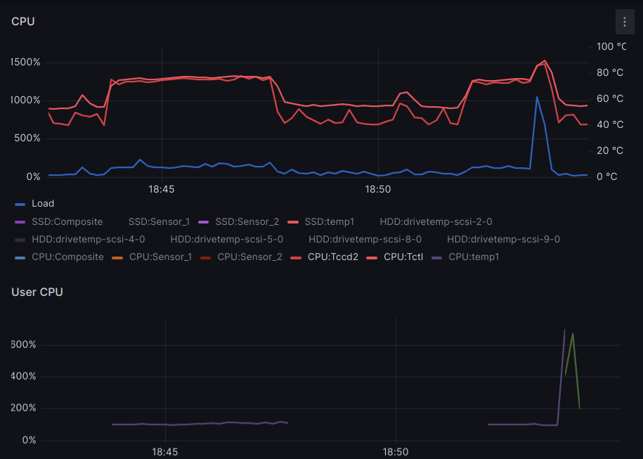

Audible is great, and the app is not bad, but I find Plex and
other apps more attractive to use for audiobooks. Now, if
only I could *take my books home*...

<!-- more --> 


***Added Bonus: pick your own choice of book covers!***

## Audible AAX/C formats

I didn't know much about this, until I found the
[KrumpetPirate/AAXtoMP3](https://github.com/KrumpetPirate/AAXtoMP3)
tool that taught me the basics, so I quite that source here:

> Audible uses the AAX file format to maintain DRM
> restrictions on their audio books and if you download your
> book through your library it will be stored in this format.

Downloading [audible.com/library](https://www.audible.com/library/titles)
provides the same **AAX** files, and nothing else.
There used to be an option to download lower quality files in
a non-DRM format, which would only show when visiting the
library from Linux, but that appears to have beem removed.

Worse yet, newer (upcoming?) AAXC files will be *even harder*
to use in Linux:

> The AAXC format is a new Audible encryption format, meant
> to replace the old AAX. The encryption has been updated,
> and now to decrypt the file the authcode is not
> sufficient, we need two "keys" which are unique for each
> audiobook. Since getting those keys is not simple, for now
> the method used to get them is handled by the package
> audible-cli, that stores them in a file when downloading
> the aaxc file. This means that in order to decrypt the
> aaxc files, they must be downloaded with audible-cli. Note
> that you need at least ffmpeg 4.4.

### Prerequiste: `activation_bytes`

To decode the AAX files you need your own authentication
code, that comes from Audible. To obtain this string, I used
[inAudible-NG/audible-activator](https://github.com/inAudible-NG/audible-activator) and saved the bytes in
`~/.authcode` to use later.

## Performance comparison for short and long books

[KrumpetPirate/AAXtoMP3](https://github.com/KrumpetPirate/AAXtoMP3)
works very well so, for a while, this was the tool I used.

After a while, it started to bother me that the conversion
took a long time and only used 1 CPU core, all the time.
Having to convert a boatload of books and having a 12-core
CPU, I was motivated to create my [`aax2mp3`](#aax2mp3sh)
script to parallelize the encoding of chapters.

The performance diffences is thus most notable with long
books, but there is quite a visible difference even with
short books, e.g.

*  [How to Talk So Teens Will Listen and Listen So Teens Will Talk](https://www.audible.com/pd/How-to-Talk-So-Teens-Will-Listen-and-Listen-So-Teens-Will-Talk-Audiobook/B002V8MWKA):
    **3 hrs and 18 mins** is converted in **half** the time.
*  [Elantris, Tenth Anniversary Special Edition](https://www.audible.com/pd/Elantris-Audiobook/B015YEFH40):
    **28 hrs and 42 mins** is converted in **a third** of the time.

### Performance of AAXtoMP3

#### Short book: 3h 18m converted in 3m 50s

```
$ time AAXtoMP3 \
  HowtoTalkSoTeensWillListenandListenSoTeensWillTalk_ep7.aax
...
real    3m50.693s
user    3m58.307s
sys     0m13.704s

$ id3v2 -l Audiobook/Adele\ Faber\,\ Elaine\ Mazlish/How\ to\ Talk\ So\ Teens\ Will\ Listen\ and\ Listen\ So\ Teens\ Will\ Talk/How\ to\ Talk\ So\ Teens\ Will\ Listen\ and\ Listen\ So\ Teens\ Will\ Talk-01\ Chapter\ 1.mp3 
id3v2 tag info for Audiobook/Adele Faber, Elaine Mazlish/How to Talk So Teens Will Listen and Listen So Teens Will Talk/How to Talk So Teens Will Listen and Listen So Teens Will Talk-01 Chapter 1.mp3:
TRCK (Track number/Position in set): 1
TPE1 (Lead performer(s)/Soloist(s)): Adele Faber, Elaine Mazlish
TPE2 (Band/orchestra/accompaniment): Adele Faber, Elaine Mazlish
TALB (Album/Movie/Show title): How to Talk So Teens Will Listen and Listen So Teens Will Talk
TYER (Year): 2005
TIT2 (Title/songname/content description): How to Talk So Teens Will Listen and Listen So Teens Will Talk-01 Chapter 1
TCON (Content type): Audiobook (255)
TCOP (Copyright message): ©2005 Adele Faber and Elaine Mazlish (P)2005 HarperCollins Publishers
TSSE (Software/Hardware and settings used for encoding): Lavf58.76.100
CTOC ():  frame
CHAP ():  frame
CHAP ():  frame
APIC (Attached picture): (Album cover)[, 3]: image/png, 272335 bytes
Audiobook/Adele Faber, Elaine Mazlish/How to Talk So Teens Will Listen and Listen So Teens Will Talk/How to Talk So Teens Will Listen and Listen So Teens Will Talk-01 Chapter 1.mp3: No ID3v1 tag
```

#### Long book: 28h 42m converted in m s

```
$ time AAXtoMP3 \
  ElantrisTenthAnniversarySpecialEdition_ep6.aax 
...
real    47m11.226s
user    52m53.673s
sys     4m37.468s

$ id3v2 -l Audiobook/Brandon\ Sanderson/Elantris-Tenth\ Anniversary\ Special\ Edition/Elantris-Tenth\ Anniversary\ Special\ Edition*\ 1.mp3
id3v2 tag info for Audiobook/Brandon Sanderson/Elantris-Tenth Anniversary Special Edition/Elantris-Tenth Anniversary Special Edition-01 Chapter 1.mp3:
TRCK (Track number/Position in set): 1
TPE1 (Lead performer(s)/Soloist(s)): Brandon Sanderson
TPE2 (Band/orchestra/accompaniment): Brandon Sanderson
TALB (Album/Movie/Show title): Elantris: Tenth Anniversary Special Edition
TYER (Year): 2015
TIT2 (Title/songname/content description): Elantris-Tenth Anniversary Special Edition-01 Chapter 1
TCON (Content type): Audiobook (255)
TCOP (Copyright message): ©2005, 2015 Dragonsteel Entertainment, LLC (P)2015 Recorded Books
TSSE (Software/Hardware and settings used for encoding): Lavf58.76.100
CTOC ():  frame
CHAP ():  frame
CHAP ():  frame
APIC (Attached picture): (Album cover)[, 3]: image/png, 615956 bytes
Audiobook/Brandon Sanderson/Elantris-Tenth Anniversary Special Edition/Elantris-Tenth Anniversary Special Edition-01 Chapter 1.mp3: No ID3v1 tag

```

### Performance of aax2mp3

#### Short book: 3h 18m converted in 3m 50s

```
$ wget -O cover.jpg https://m.media-amazon.com/images/...jpg
$ time aax2mp3.sh \
  HowtoTalkSoTeensWillListenandListenSoTeensWillTalk_ep7.aax
...
real    2m0.036s
user    4m21.804s
sys     0m4.618s

$ id3v2 -l 1.\ Chapter\ 1.mp3 
id3v1 tag info for 1. Chapter 1.mp3:
Title  : Chapter 1                       Artist: Adele Faber, Elaine Mazlish   
Album  : How to Talk So Teens Will List  Year: 2005, Genre: Vocal (28)
Comment:                                 Track: 1
id3v2 tag info for 1. Chapter 1.mp3:
TSSE (Software/Hardware and settings used for encoding): LAME 64bits version 3.100 (http://lame.sf.net)
TIT2 (Title/songname/content description): Chapter 1
TPE1 (Lead performer(s)/Soloist(s)): Adele Faber, Elaine Mazlish
TALB (Album/Movie/Show title): How to Talk So Teens Will Listen and Listen So Teens Will Talk
TYER (Year): 2005
TRCK (Track number/Position in set): 1/10
TCON (Content type): Vocal (28)
TLEN (Length): 526419
APIC (Attached picture): ()[, 0]: image/jpeg, 51854 bytes
```

#### Long book: 28h 42m converted in m s

```
$ wget -O cover.jpg https://m.media-amazon.com/images/...jpg
$ time aax2mp3.sh \
  ElantrisTenthAnniversarySpecialEdition_ep6.aax 
...
real    14m37.037s
user    62m19.688s
sys     0m46.445s


$ id3v2 -l 1.\ Chapter\ 1.mp3 
id3v1 tag info for 1. Chapter 1.mp3:
Title  : Chapter 1                       Artist: Brandon Sanderson             
Album  : Elantris: Tenth Anniversary Sp  Year: 2015, Genre: Vocal (28)
Comment:                                 Track: 1
id3v2 tag info for 1. Chapter 1.mp3:
TSSE (Software/Hardware and settings used for encoding): LAME 64bits version 3.100 (http://lame.sf.net)
TIT2 (Title/songname/content description): Chapter 1
TPE1 (Lead performer(s)/Soloist(s)): Brandon Sanderson
TALB (Album/Movie/Show title): Elantris: Tenth Anniversary Special Edition
TYER (Year): 2015
TRCK (Track number/Position in set): 1/79
TCON (Content type): Vocal (28)
TLEN (Length): 195651
APIC (Attached picture): ()[, 0]: image/jpeg, 89607 bytes
```

## CPU usage of AAXtoMP3 and aax2mp3

### Short book: 3h 18m converted in 3m 50s



### Long book: 28h 42m converted in m s


## Code

The gist of this is using `xargs` to parallelize the
extraction and encoding of individual chapters.
This would probably be better using
[GNU parallel](https://www.gnu.org/software/parallel/), but
I learned about that one a few months too late.

### `aax2mp3.sh`

The main script `aax2mp3.sh` does most of the work.

!!! note
    This script takes the activation codes from a
    different file: `~/audible_activation_bytes`

```bash linenums="1" title="aax2mp3.sh"
#!/bin/bash
#
# Convert DRM'ed AAX audibooks (e.g. Audible) to DRMless MP3 audio.
# Cover art is extracted from AAX files if present,
# otherwise cover.jpg file will be use for artwork.

# File names and target destinations in local (output) and remote targets.
input=$1
ext=${1##*.}
mp3=${1/.$ext/.mp3}
output="/home/raid/audio/Audiobooks"
remote="lexicon:/home/depot/audio/Audiobooks/"

if [ "$2" == "wy" ]; then
    echo "INFO: final diretory will include (year)"
fi

if [ ! -f "$1" ]; then
    echo "FATAL: $1 is missing, this will cause encoding to fail!"
    exit 1
fi

# Obtain activation bytes.
$activation_bytes
activation_bytes=$(head -1 ~/.audible_activation_bytes)

# Extract cover art. This will overwrite cover.jpg only if cover art is found.
art="cover.jpg"
ffmpeg -activation_bytes $activation_bytes -i "$input" -an -c:v copy -y "$art"

# Extract uncompressed audio.
ffmpeg -activation_bytes $activation_bytes -i "$input" -vn -c:a mp3 -y "$mp3"

# Extract metadata and chapters.
chapters=chapters.txt
metadata=metadata.txt
ffprobe -activation_bytes $activation_bytes -i "$input" -show_chapters >$chapters 2>$metadata
genre=28 # Vocal
album=$(grep '^    title' $metadata | sed 's/.* : //')
artist=$(grep '^    artist' $metadata | sed 's/.* : //')
year=$(grep '^    date' $metadata | sed 's/.* : //')
echo "$album ($year), by $artist"

# Split and encode chapters (parallel).
track=0
numtracks=$(grep -c title chapters.txt)
tabdata=chapters.tab
grep title chapters.txt | cut -f2 -d'=' | while read title; do
    track=$((track + 1))
    start=$(grep -B5 "title=$title$" chapters.txt | grep start_time | cut -f2 -d=)
    end=$(grep -B5 "title=$title$" chapters.txt | grep end_time | cut -f2 -d=)
    wav="$track. $title.wav"
    chapter=${wav/.wav/.mp3}
    echo -e "$track\t$start\t$end\t$title"
done >$tabdata

# Process chapters in parallel.
cut -f1 $tabdata | xargs --max-procs=10 -n 1 aax2mp3-chapter.sh $mp3 $metadata $tabdata

# Move processed chapters into author/book directory.
author="$(id3v2 -l 1.*.mp3 | grep TPE1 | cut -f2 -d: | cut -f1 -d, | sed 's/^ //')"
title="$(id3v2 -l 1.*.mp3 | grep TALB | cut -f2 -d: | sed 's/^ //')"
bookdir="$(echo "$author/$title" | sed 's/ /./g' | sed "s/'//g" | sed 's/\.\././g' | sed 's/&/and/g')"
if [ "$2" == "wy" ]; then
    echo "INFO: final diretory will include (year)"
    bookdir="$bookdir.($year)"
fi
echo "$bookdir"
mkdir -p "$bookdir"
echo "$bookdir" >.bookdirs
rename 's/^/0/' ?.\ Chapter*
rename 's/^/0/' ?.\ Kapitel*
ls -lh $art *Kapitel*.mp3 *Chapter*.mp3 "$bookdir"
mv -fv $art *Kapitel*.mp3 *Chapter*.mp3 "$bookdir"

# Move the book to destinations.
# Note: DO NOT let destdir end in /
destdir="$(echo "$output/$author" | sed 's/ /./g' | sed "s/'//g" | sed 's/\.\././g')"
rsync -turva "$bookdir" "$remote"
mkdir -p "$destdir"
mv -fv "$bookdir" "$destdir"

# Clean-up
rm -f chapters.t* *Kapitel*.wav *Chapter*.wav *_ep*.mp3 $input
```

The `--max-procs` flag is set to *only* **10** so that a few
CPU cores are left for other tasks. In a pinch this value
can be increased to the number of CPU **threads**, if the
system won't be used by anybody in the meantime, to further
reduce the time it takes to encode chapters.

### `aax2mp3-chapter.sh`

And to process each chapter, here is 
`aax2mp3-chapter.sh`

```bash linenums="1" title="aax2mp3-chapter.sh"
#!/bin/bash
#
# Split and encode a single audiobook chapter, to use with xargs.
# If available, cover.jpg file will be use for artwork.

# Input parameters.
mp3=$1
metadata=$2
tabdata=$3
track=$4
art=cover.jpg

# Recover book metadata from file.
genre=28 # Vocal
album=$(grep '^    title' $metadata | sed 's/.* : //')
artist=$(grep '^    artist' $metadata | sed 's/.* : //')
year=$(grep '^    date' $metadata | sed 's/.* : //')

start=$(grep "^$track[[:blank:]]" $tabdata | cut -f2)
end=$(grep "^$track[[:blank:]]" $tabdata | cut -f3)
title=$(grep "^$track[[:blank:]]" $tabdata | cut -f4)
numtracks=$(cat $tabdata | wc -l)
wav="$track. $title.wav"
chapter=${wav/.wav/.mp3}
ffmpeg \
    -nostdin \
    -i "$mp3" \
    -vn \
    -c:a pcm_s16le \
    -f wav \
    -ss $start \
    -to $end \
    -y "$wav"
lame \
    -S \
    --tt "$title" \
    --ta "$artist" \
    --tl "$album" \
    --ty $year \
    --tn $track/$numtracks \
    --tg $genre \
    --ti $art \
    "$wav" "$chapter"
```