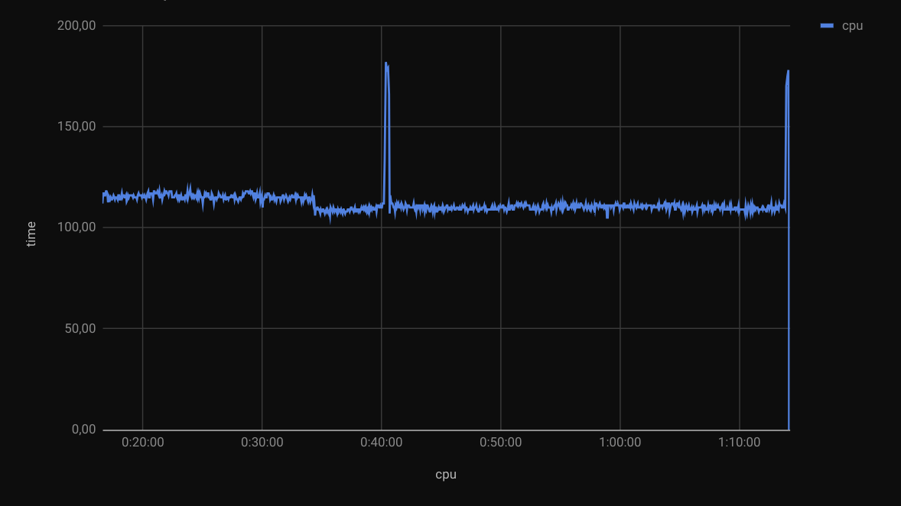

Never got the hang of `telegraf`, it was all too easy to cook my own monitoring...

## Humble Beginnings

In fact, when I started building detailed process monitoring
I knew nothing about
[telegraf](https://www.influxdata.com/time-series-platform/telegraf/),
[influxdb](https://www.influxdata.com/),
[grafana](https://grafana.com/)
or even Raspberry Pi computers.

It was back in 2017, when pondering whether to build my next
PC around an
[Intel Core i7-6950X](https://www.intel.com/content/www/us/en/products/sku/94456/intel-core-i76950x-processor-extreme-edition-25m-cache-up-to-3-50-ghz/specifications.html)
or an
[AMD Ryzen 5 1600X](https://www.amd.com/en/support/cpu/amd-ryzen-processors/amd-ryzen-5-desktop-processors/amd-ryzen-5-1600x), that I started looking into measuring
CPU usage of a specific process. I wanted to better see and 
understand whether more (but slower) CPU cores would be a
better investment than faster (but fewer) CPU cores.

At the time my PC had a
[AMD Phenom II X4 965 BE C3](https://bit-tech.net/reviews/tech/cpus/amd-phenom-ii-x4-965-be-c3-review/7/)
with 4 cores at 3.4GHz, and I had no idea how often those CPU
cores were all used to their full extent. To learn more about
the possibilities (and limitations) of *fully*
multi-threading CPU-bound applications, I started running
`top` commands in a loop and dumping lines in `.csv` files to
then plot charts in Google Sheets. This was very crude, but
it did show the difference between rendering a video in
Blender (not multi-threaded) compared to using the
[pulverize](https://github.com/sciactive/pulverize) tool to
fully multi-thread the same task:




This early ad-hoc effort resulted in a few scripts to
measure per-proccess CPU usage, overall CPU with thermals,
and even GPU usage.

<!-- more --> 

### `mt-top`

This script measures only CPU usage for a single process:

``` bash linenums="1" title="mt-top"
#!/bin/bash
#
# CPU usage stats across all threads / instances for a process.
#
# Given a process name (as it appears when running the "top" command),
# use the "top" command to capture aggregate CPU usage for all threads
# of that process every second.
#
# If that process is not yet running, wait until it does. Keep tracking
# CPU usage until that process ends, or Ctrl-C is pressed.
#
# Usage: mt-top blender

if test "$#" != 1
then
  echo "Usage: $0 <process name>"
  exit 1
fi

pname=$1
pstarted=0

echo -e "time\tcpu"
while true
do
  time=$(date +"%H:%M:%S")
  cpu=$(top -b -n 1 | egrep -i "$pname" | sort -n -k1 -t\  | awk '{print $9}' | tr '\n' '+' | sed 's/+$/\n/' | bc -ql)
  if [ -n "$cpu" ]
  then
    echo -e "$time\t$cpu"
    if [[ $pstarted == 0 ]]
    then
      pstarted=1
    fi
  else
    if [[ $pstarted == 1 ]]
    then
      # Process has finished.
      exit 0
    fi
  fi
  sleep 1
done
```

### `mt-top-temp`

This measures the overall CPU usage along with thermals:

``` bash linenums="1" title="mt-top-temp"
#!/bin/bash
#
# CPU usage % and temperature, sampled every second.
#
# Usage: mt-top-temp ... Ctrl+C

echo -e "time\tcpu\ttemp"
while true
do
  time=$(date +"%H:%M:%S")
  cpu=$(top -b -n 1 |awk '{print $9}' | egrep '[0-9]\.[0-9]|^[0-9][0-9]$|^[0-9][0-9][0-9]$|^[0-9][0-9][0-9][0-9]$' | tr '\n' '+' | sed 's/+$/\n/' | bc -ql)
  temp=$(sensors -A | grep temp1 | awk '{print $2}')
  echo -e "$time\t$cpu\t$temp"
  sleep 1
done
```

### `mt-top-gpu`

This script measures (overall)  GPU usage:

``` bash linenums="1" title="mt-top-gpu"
#!/bin/bash
#
# GPU usage % and temperature, sampled every second.
#
# Usage: mt-top-gpu ... Ctrl+C

echo -e "time\tcpu"
while true
do
  time=$(date +"%H:%M:%S")
  gpu=$(nvidia-smi -i 0 --query-gpu=temperature.gpu,utilization.gpu  --format=csv,noheader)
  echo -e "$time\t$gpu"
  sleep 1
done
```

## Enter InfluxDB & Grafana

A few days ago someone shared a screenshot of their 
good-looking weather monitoring and mentioned two things I
had never seen before:
[influxdb](https://www.influxdata.com/) and
[grafana](https://grafana.com/).
They also mentioned they were running their monitoring on a
Raspberry Pi computer.

*Now I know* what those are, I have a
[Raspberry Pi 3 model B](https://www.raspberrypi.com/products/raspberry-pi-3-model-b/)
with [CUPS](https://www.cups.org/)
to share the printer over WiFi;
much cheaper than even the cheapest WiFi-enabled printers.

### InfluxDB

Installing InfluxDB couldn't be easier, if you don't mind
running a fairly old version:

``` console
# apt install influxdb influxdb-client -y
# dpkg -l influxdb | grep influxdb
ii  influxdb       1.6.4-1+deb10u1 armhf        Scalable datastore for metrics, events, and real-time analytics
```

For a more recent version, one can install
[InfluxDB OSS 1.7](https://docs.influxdata.com/influxdb/v1/introduction/install/) or
[InfluxDB 2.7](https://docs.influxdata.com/influxdb/v1/introduction/install/).

Once installed, one or more databases need to be crated to
start collecting data.
[Get started with InfluxDB OSS](https://docs.influxdata.com/influxdb/v1/introduction/get-started/)
to create a database (e.g. `monitoring`) and set a
retention policy:

``` console
# influx
Connected to http://localhost:8086 version 1.6.7~rc0
InfluxDB shell version: 1.6.7~rc0
> CREATE DATABASE monitoring
> CREATE RETENTION POLICY "30_days" ON "monitoring" DURATION 30d REPLICATION 1
> ALTER RETENTION POLICY "30_days" on "monitoring" DURATION 30d REPLICATION 1 DEFAULT
```

As soon as the database is created, data can be inserted.
There is no need to define columns, instead just
[Write data with the InfluxDB API](https://docs.influxdata.com/influxdb/v1/guides/write_data/)
to feed simple data such as CPU load and temperature:

``` bash
curl -i -XPOST \
  --data-binary "cpu,host=$host value=$cpu" \
  'http://localhost:8086/write?db=monitoring'
curl -i -XPOST \
  --data-binary "temperature,host=$host value=$temp" \
  'http://localhost:8086/write?db=monitoring'
```

The body of the POST or
[InfluxDB line protocol](https://docs.influxdata.com/influxdb/v1/concepts/glossary/#influxdb-line-protocol)
contains the time series data that you want to store.
Data includes:

*  **Measurement (required)**: the thing to measure, e.g.
   `cpu` in this case to measure global CPU load.
*  **Tags**: Strictly speaking, tags are optional but most
   series include tags to differentiate data sources and
   to make querying both easy and efficient. Both tag keys
   and tag values are strings.
*  **Fields (required)**: Field keys are required and are
   always strings, and, 
   [by default](https://docs.influxdata.com/influxdb/v1/write_protocols/line_protocol_reference/#data-types),
   field values are floats.
*  **Timestamp**: Supplied at the end of the line in Unix
   time in nanoseconds since January 1, 1970 UTC - is
   optional. If you do not specify a timestamp, InfluxDB
  uses the server’s local nanosecond timestamp in Unix
  epoch. Time in InfluxDB is in UTC format by default.

#### Minimal update to post to InfluxDB

The scripts above can now feed data to it *in addition* to
producing TSV files, e.g. [`mt-top-temp`](#mt-top-temp)
can be updated as follows:

``` bash linenums="1" title="mt-top-temp"
#!/bin/bash
#
# CPU usage % and temperature, sampled every second.
#
# Usage: mt-top-temp ... Ctrl+C

echo -e "time\tcpu\ttemp"
while true
do
  time=$(date +"%H:%M:%S")
  cpu=$(top -b -n 1 |awk '{print $9}' | egrep '[0-9]\.[0-9]|^[0-9][0-9]$|^[0-9][0-9][0-9]$|^[0-9][0-9][0-9][0-9]$' | tr '\n' '+' | sed 's/+$/\n/' | bc -ql)
  temp=$(sensors -A | grep temp1 | awk '{print $2}' | egrep -o '[0-9]+\.[0-9]')
  host=$(hostname)
  curl -i -XPOST \
    --data-binary "cpu,host=$host value=$cpu" \
    'http://localhost:8086/write?db=monitoring' \
    2>&1 > /dev/null
  curl -i -XPOST \
    --data-binary "temperature,host=$host value=$temp" \
    'http://localhost:8086/write?db=monitoring'
    2>&1 > /dev/null
  echo -e "$time\t$cpu\t$temp"
  sleep 1
done
```

### Grafana

The next step is *visualizing* these time series in fancy
charts, and that's where [Grafana](https://grafana.com/)
comes in.

[Install Grafana OSS](https://grafana.com/docs/grafana/latest/setup-grafana/installation/debian/),
[start the server with `systemd`](https://grafana.com/docs/grafana/latest/setup-grafana/start-restart-grafana/#start-the-grafana-server-with-systemd)
and reset the **Admin** password:

``` console
# echo "deb https://packages.grafana.com/oss/deb stable main" \
  | tee /etc/apt/sources.list.d/grafana.list
# curl https://packages.grafana.com/gpg.key | sudo apt-key add -
# apt update
# apt install grafana
# systemctl daemon-reload
# systemctl start grafana-server
# grafana-cli admin reset-admin-password \
  PLEASE_CHOOSE_A_SENSIBLE_PASSWORD
INFO[03-20|15:02:11] Connecting to DB                         logger=sqlstore dbtype=sqlite3
INFO[03-20|15:02:11] Starting DB migrations                   logger=migrator
Admin password changed successfully ✔
```

At this point Grafana is available on http://localhost:3000/
for the Admin user. 

[Add your InfluxDB data source to Grafana](https://grafana.com/docs/grafana/latest/getting-started/get-started-grafana-influxdb/#add-your-influxdb-data-source-to-grafana),
create a new Dashboard and **Add > Visualization** for each
measurement (`cpu`, `temp`, `gpu`, etc.).

Tweak `/etc/grafana/grafana.ini` as follows to enable
[anonymous authentication](https://grafana.com/docs/grafana/latest/setup-grafana/configure-security/configure-authentication/#anonymous-authentication)
and allow anonymous users to view dashboards in the default org:

``` ini linenums="1" title="/etc/grafana/grafana.ini"
#################################### Anonymous Auth ######################
[auth.anonymous]
# enable anonymous access
enabled = true

# specify organization name that should be used for unauthenticated users
org_name = Main Org.

# specify role for unauthenticated users
org_role = Viewer

# systemctl restart grafana-server.service
```

## Continuous Monitoring

With InfluxDB and Grafana in place, collection and reporting of
metrics can be done continuously, rather than having to run the
scripts each time. 

For a minimal start, create a script that reports total CPU
usage every second, e.g as `/usr/local/bin/conmon`

``` bash linenums="1" title="/usr/local/bin/conmon"
#!/bin/bash
#
# Export system monitoring metrics to influxdb.

# InfluxDB target.
DBNAME=monitoring
TARGET='http://localhost:8086'

# Data file for batch POST.
DDIR="/dev/shm/$$"
DATA="${DDIR}/DATA.txt"
mkdir -p "${DDIR}"

host=$(hostname)

timestamp_ns() {
  date +'%s%N'
}

store_line() {
  # Write a line of data to the temporary in-memory file.
  # Exit immediately if this fails.
  echo $1 >>"${DATA}" || exit 1
}

report_top() {
  # Stats from top: CPU (overall and per process) and RAM (per process).
  ts=$(timestamp_ns)
  cpu_load=$(top -b -n 1 |awk '{print $9}' | egrep '[0-9]\.[0-9]|^[0-9][0-9]$|^[0-9][0-9][0-9]$|^[0-9][0-9][0-9][0-9]$' | tr '\n' '+' | sed 's/+$/\n/' | bc -ql)
  store_line "top,host=${host} value=${cpu_load} ${ts}"
}

post_lines_to_influxdb() {
  # POST data to InfluxDB in batch, when target is available.
  # Depends on: nc.
  sleep ${DELAY_POST}
  host_and_port=$(echo "${TARGET}" | sed 's/.*\///' | tr : ' ')
  if nc 2>&1 -zv ${host_and_port} | grep -q succeeded; then
    # All other tasks write data to the file in append mode (>>).
    # This task reads everything at once and immediately deletes the file.
    # This makes all the other tasks write to the same file, created anew.
    mv -f "${DATA}" "${DATA}.POST"
    cut -f1 -d, "${DATA}.POST" | sort | uniq -c
    curl >/dev/null 2>/dev/null -i -XPOST "${TARGET}/write?db=${DBNAME}" --data-binary @"${DATA}.POST"
  fi
}

# Run all the above tasks in a loop.
# Each task is responsible of its own checks.
while true; do
  report_top
  post_lines_to_influxdb
done
```

Create a new service to run this upon reboot, e.g. as
`/etc/systemd/system/conmon.service`

``` ini linenums="1" title="/etc/systemd/system/conmon.service"
[Unit]
Description=Continuous Monitoring
After=influxd.service
Wants=influxd.service

[Service]
ExecStart=/usr/local/bin/conmon
Restart=on-failure
StandardOutput=null
User=root

[Install]
WantedBy=multi-user.target
```

Then load and start the new service

``` console
# systemctl daemon-reload
# systemctl enable conmon.service
Created symlink /etc/systemd/system/multi-user.target.wants/conmon.service → /etc/systemd/system/conmon.service.
# systemctl start conmon.service
```

From here on, new functions can be added to the `conmon`
script to collect additional metrics, which will be then
posted by the script periodically. Many other metrics can
be added later, here are some ideas:

- Total RAM usage
- CPU usage per process
- RAM usage per process
- Network I/O per interface
- Disk I/O per disk
- Disk I/O per process
- Disk used/free (per partition)
- GPU load, VRAM, temperature, fan speed, power draw

These and more may be added later, keep an eye on the full
scripts in the [**Continuous Monitoring**](../../conmon.md) page.