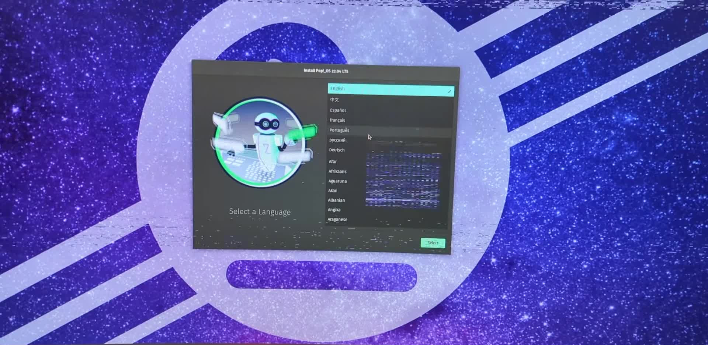
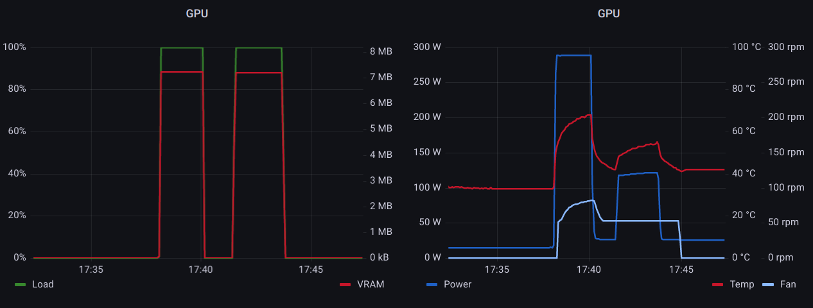
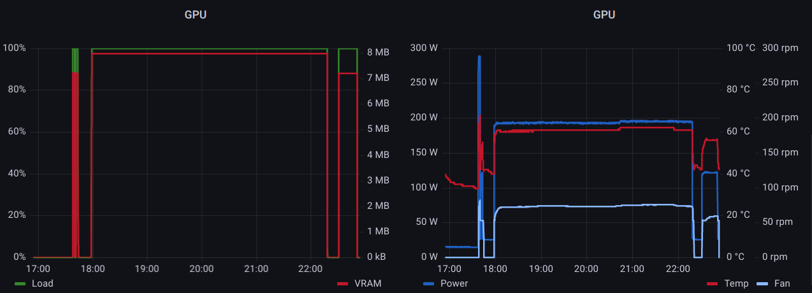
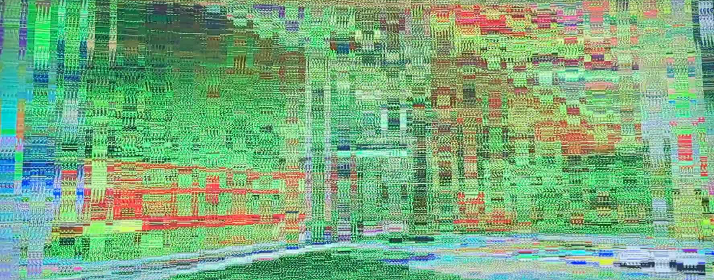

This is the kind of thing that makes you think,
*this **really** only happens to me*.

<!-- more --> 

Back in June, when the availability and price of graphics card
finally approached *relatively* normal values, I got myself an new
[ASUS GeForce TUF Gaming RTX 3070 Ti OC Edition](https://www.guru3d.com/articles-pages/asus-geforce-rtx-3070-tuf-gaming-review,33.html)
(to replace the old
[ASUS GeForce GTX 1070 STRIX](https://www.guru3d.com/articles-pages/asus-geforce-gtx-1070-strix-gaming-review,12.html)
from 2017). It still was still nearly $800 but it was clearly never
going to come down to $570 the old one costed back in August 2017.

Then, in September, the new card died. Somewhat *surreptitiously...*

## What Happened

It started small, like oak trees.

At first there were just faint *glitchy* thin lines blinking across
the screen. Searching for posts discussing this kind of video
artifacts, came up empty.

When the problem started I was running
[Ubuntu Studio 20.04](https://ubuntustudio.org/2020/04/ubuntu-studio-20-04-lts-released/)
with KDE Plasma. After a couple of weeks of trying a few tweaks
(e.g. disable compositor) and seeing how nothing really helped,
I decided to install
[Ubuntu Studio 22.04](https://ubuntustudio.org/2022/04/ubuntu-studio-22-04-lts-released/)
and at first it looked perfect, but then the problem manifested
again as soon as the first reboot with the NVidia driver.

The artifact would manifest mostly when the screen was locked,
sometimes when it wasn’t, and affect only the top 10-15% of the
screen, plus a fixed-size square area down-and-right of the mouse
cursor. It got worse day after day, and soon the entire screen was
affected, the corruption looked like large areas of the image would
turn one color (blue, magenta, green, etc.) and the artifacts
*followed* the content of the screen, so that the corrupted areas
would align with the clouds, sky and water in landscape photos.

From there, the problem quickly evolved to the point where graphics
are corrupted as soon as the login manager started up, upon login the
very simple splash screen was corrupted, and then the whole desktop
environment was so badly corrupted it was barely possible to even see
where the mouse cursor was and the text in Konsole was unreadable.
At that point, going back the text-only terminal with `Ctrl+Alt+F2`
presented such badly corrupted output it was unreadable.

## Regaining Control

The first suspect is usually the proprietary NVidia drivers, so the
first workaround, to be able to use the PC, was to switch to the
`nouveau` driver:

``` console
# dpkg -P nvidia-driver-515
# apt autoremove
# apt update
# apt install xserver-xorg-video-nouveau
```

The last 2 commands didn’t actually do anything. After this, rebooting
led to a perfectly usable system without any graphical glitches.

Ubuntu 22.04 had
[version 470 available for easy installation](https://linuxconfig.org/how-to-install-the-nvidia-drivers-on-ubuntu-22-04), and this version 
[supports the RTX 3070 cards](https://www.nvidia.com/download/driverResults.aspx/176525/en-us/),
so that was the next workaround. The trick to switch back to an older
version is to hold / freeze them to that version:

``` console
# apt install nvidia-driver-470
# apt-mark hold nvidia-driver-470 libnvidia-cfg1-470 libnvidia-common-470 \
  libnvidia-compute-470 libnvidia-compute-470:i386 libnvidia-decode-470 \
  libnvidia-decode-470:i386 libnvidia-egl-wayland1 libnvidia-encode-470 \
  libnvidia-encode-470:i386 libnvidia-extra-470 libnvidia-fbc1-470 \
  libnvidia-fbc1-470:i386 libnvidia-gl-470 libnvidia-gl-470:i386 libnvidia-ifr1-470 \
  libnvidia-ifr1-470:i386 libxnvctrl0 nvidia-compute-utils-470 nvidia-dkms-470 \
  nvidia-kernel-common-470 nvidia-kernel-source-470 nvidia-prime nvidia-settings \
  nvidia-utils-470 screen-resolution-extra xserver-xorg-video-nvidia-470
```

After this, rebooting led to straight back into the problem;
corrupted video as soon as SDDM came up, and still corrupted after
going to TTY.

Uninstall the NVidia drivers and rebooting solved the problem again.
This time needed to uninstall all packages explicitly:

``` console
# apt remove $(dpkg -l |grep 'nvidia.*470' | awk '{print $2}')
```

That was enough to go back to the nouveau driver.
A few more packages had to be removed later:

``` console
# apt remove screen-resolution-extra nvidia-settings nvidia-prime \
  libnvidia-egl-wayland1:amd64 libxnvctrl0:amd64
```

It became clear that switching back and forth between the Nvidia and
nouveau drivers was going to be necessary more than a few times, so I
create a couple of helper scripts I could run despite not being able
to read the screen:

``` bash linenums="1"
#!/bin/sh
echo "blacklist nouveau" \
  >  /etc/modprobe.d/blocklist-nvidia-nouveau.conf
echo "options nouveau modeset=0" \
  >> /etc/modprobe.d/blocklist-nvidia-nouveau.conf
update-initramfs -u
apt install nvidia-driver-515
```

``` bash linenums="1"
#!/bin/sh
dpkg -P nvidia-driver-515
apt remove -y $(dpkg -l | grep 'nvidia.*515' | awk '{print $2}')
apt autoremove -y
rm -f /etc/modprobe.d/blocklist-nvidia-nouveau.conf
```

The lines to
[disable the `nouveau` driver](https://linuxconfig.org/how-to-disable-blacklist-nouveau-nvidia-driver-on-ubuntu-22-04-jammy-jellyfish-linux)
are a precaution to keep the output from
[`nvidia-bug-report.sh`](https://helpmanual.io/help/nvidia-bug-report.sh/)
(part of `nvidia-utils-515`) from mentions the `nouveau` driver when
it is not in use.

## Root Cause Analysis

With this easy-switch toolkit in hand, it was time to go on a Wild
Hunt for the root cause of the problem by changing one thing at a time...

*  Going back to Ubuntu 20.04 (still available in its old partition)
   and try with NVidia drivers 470, 510 and 515.
*  Use the same screen on a laptop.
*  Connect the screen directly to the PC.
*  Try every DisplayPort cables at hand.
*  Confirm all DisplayPort cables are rated DP 1.2 (rated 4k@60).
*  Replaced DisplayPort 1.2 with HDMI 2.0 cable (rated 4k@60).
*  Tried [Pop!_OS live USB](https://pop.system76.com/) because it
   ships with the latest NVidia driver.

Normally the PC and laptop share the screen and keyboard via
[StarTech SV231DPDDUA2](https://www.startech.com/en-ch/server-management/sv231dpddua2)
DisplayPort KVM Switch rated 4K 60Hz. I took this KVM switch out of
the equation early on, so most of the tests were on a direct
PC-to-screen DP 1.2 connection.

Being *quite confident* that the problem was in the graphics card itself, but no idea how to go from here, I posted the problem in the NVidia forum:
[Extremely corrupted graphics _only_ with NVidia driver 515 on RTX 3070 Ti](https://forums.developer.nvidia.com/t/extremely-corrupted-graphics-only-with-nvidia-driver-515-on-rtx-3070-ti/228223).

Shortly after that, a friend suggested trying with
[Pop!_OS live USB](https://pop.system76.com/)
because it ships with the latest NVidia driver.
Having already removed everything else out of the way,
including the OS, this last test also reproduced the problem:



Notice the glitch lines around the top-right corner and through the Select button, plus the fixed-size square area down-and-right from the mouse cursor. This area followed the cursor, as you can see in this video.

<iframe width="800" height="450" src="https://www.youtube.com/embed/Sk11E_4gmYw?si=R-VynLLZmOs_RKtj" title="YouTube video player" frameborder="0" allow="accelerometer; autoplay; clipboard-write; encrypted-media; gyroscope; picture-in-picture; web-share" allowfullscreen></iframe>

In the NVidia forum, a top contributor suggested to
*check for a general hardware fault using gpu-burn or cuda-gpumemtest*.

None of these tools are directly available in Ubuntu 22.04 so first
I had to install them.

### `gpu-burn`

First I needed to reinstall the NVidia driver and CUDA libraries. To avoid corrupting the graphics or interfering with the test, I chose to disable SDDM before rebooting:

``` console
# systemctl disable sddm
# /root/nvidia-on.sh
# reboot
```

Installed gpu-burn from
[wilicc/gpu-burn](https://github.com/wilicc/gpu-burn)
and followed the instructions from
[wili.cc/blog/gpu-burn.html](http://wili.cc/blog/gpu-burn.html);
using `COMPUTE=8.6` for RTX 3070 Ti
([source](https://developer.nvidia.com/cuda-gpus)):

Apparently, *one does not simply* `make` this.
Many headers are missing or not found:

```
g++ -O3 -Wno-unused-result -I/usr/local/cuda/include -c gpu_burn-drv.cpp
gpu_burn-drv.cpp:51:10: fatal error: cuda.h: No such file or directory
   51 | #include <cuda.h>
      |          ^~~~~~~~
compilation terminated.
make: *** [Makefile:32: gpu_burn-drv.o] Error 1
```

Installing the `nvidia-cuda-dev` or `nvidia-cuda-toolkit` packages
was not an option because both wanted to remove the latest NVidia
driver (`nvidia-driver-515`) and replace it with older drivers.
Instead, found the missing headers and added `-I` flags to `gcc`:

``` console
# g++ -O3 -Wno-unused-result \
  -I/usr/local/cuda/include \
  -I/usr/src/linux-headers-5.15.0-47-lowlatency/include/linux \
  -I/usr/src/linux-headers-5.15.0-47-lowlatency/include \
  -I/usr/src/linux-headers-5.15.0-47-lowlatency/arch/x86/include/generated \
  -I/usr/src/linux-lowlatency-headers-5.15.0-47/arch/x86/include \
  -c gpu_burn-drv.cpp
```

Still not being enough, the build failed with yet another error:

```
gpu_burn-drv.cpp:52:10: fatal error: cublas_v2.h: No such file or directory
   52 | #include "cublas_v2.h"
      |          ^~~~~~~~~~~~~
compilation terminated.
```

This one was trickier. There is was trace of `cublas_v2.h` anywhere,
installing the `libcublas11` and `libcublaslt11` packages did not help.

The only clue I found was in
[github.com/NVIDIA/apex/issues/957](https://github.com/NVIDIA/apex/issues/957)
to install a package directly, but it is not installable in Ubuntu 22.04 so I had to follow the instructions for Ubuntu 22.04 at developer.[nvidia.com/cuda-downloads](https://developer.nvidia.com/cuda-downloads):

``` console
# wget -O /etc/apt/preferences.d/cuda-repository-pin-600 \
  https://developer.download.nvidia.com/compute/cuda/repos/ubuntu2204/x86_64/cuda-ubuntu2204.pin
# wget https://developer.download.nvidia.com/compute/cuda/11.7.1/local_installers/cuda-repo-ubuntu2204-11-7-local_11.7.1-515.65.01-1_amd64.deb
# dpkg -i cuda-repo-ubuntu2204-11-7-local_11.7.1-515.65.01-1_amd64.deb
# cp /var/cuda-repo-ubuntu2204-11-7-local/cuda-*-keyring.gpg /usr/share/keyrings/
# apt-get update
# apt-get -y install cuda
```

!!! note

	To undo this change later, remove
	`/etc/apt/preferences.d/cuda-repository-pin-600`
	and run `apt update`.

Finally, one can simply `make` and run `gpu_burn`:

``` console
# make COMPUTE=8.6
# ./gpu_burn 120
Burning for 120 seconds.
GPU 0: NVIDIA GeForce RTX 3070 Ti (UUID: GPU-0c349bdd-3426-f2d3-4b26-c0b4bf0aad2e)
Initialized device 0 with 7974 MB of memory (7451 MB available, using 6706 MB of it), using FLOATS
Results are 16777216 bytes each, thus performing 417 iterations
10.8%  proc'd: 8757 (13280 Gflop/s)   errors: 0   temps: 54 C 
	Summary at:   Mon Sep 19 05:38:21 PM CEST 2022

21.7%  proc'd: 18765 (13235 Gflop/s)   errors: 0   temps: 59 C 
	Summary at:   Mon Sep 19 05:38:34 PM CEST 2022

32.5%  proc'd: 28773 (13186 Gflop/s)   errors: 0   temps: 61 C 
	Summary at:   Mon Sep 19 05:38:47 PM CEST 2022

43.3%  proc'd: 38781 (13178 Gflop/s)   errors: 0   temps: 64 C 
	Summary at:   Mon Sep 19 05:39:00 PM CEST 2022

53.3%  proc'd: 47955 (13135 Gflop/s)   errors: 0   temps: 64 C 
	Summary at:   Mon Sep 19 05:39:12 PM CEST 2022

64.2%  proc'd: 57963 (13125 Gflop/s)   errors: 0   temps: 66 C 
	Summary at:   Mon Sep 19 05:39:25 PM CEST 2022

75.0%  proc'd: 67971 (13144 Gflop/s)   errors: 0   temps: 67 C 
	Summary at:   Mon Sep 19 05:39:38 PM CEST 2022

85.8%  proc'd: 77562 (13033 Gflop/s)   errors: 0   temps: 67 C 
	Summary at:   Mon Sep 19 05:39:51 PM CEST 2022

96.7%  proc'd: 87570 (13038 Gflop/s)   errors: 0   temps: 68 C 
	Summary at:   Mon Sep 19 05:40:04 PM CEST 2022

100.0%  proc'd: 91323 (13090 Gflop/s)   errors: 0   temps: 68 C 
Killing processes.. Freed memory for dev 0
Uninitted cublas
done

Tested 1 GPUs:
	GPU 0: OK
```

Then run it again using doubles (see
[usage](https://github.com/wilicc/gpu-burn#usage)):

``` console
# ./gpu_burn -d 120
Burning for 120 seconds.
GPU 0: NVIDIA GeForce RTX 3070 Ti (UUID: GPU-0c349bdd-3426-f2d3-4b26-c0b4bf0aad2e)
Initialized device 0 with 7974 MB of memory (7451 MB available, using 6706 MB of it), using DOUBLES
Results are 33554432 bytes each, thus performing 207 iterations
10.8%  proc'd: 207 (289 Gflop/s)   errors: 0   temps: 48 C 
	Summary at:   Mon Sep 19 05:41:43 PM CEST 2022

25.0%  proc'd: 414 (312 Gflop/s)   errors: 0   temps: 50 C 
	Summary at:   Mon Sep 19 05:42:00 PM CEST 2022

37.5%  proc'd: 621 (312 Gflop/s)   errors: 0   temps: 51 C 
	Summary at:   Mon Sep 19 05:42:15 PM CEST 2022

48.3%  proc'd: 1035 (316 Gflop/s)   errors: 0   temps: 52 C 
	Summary at:   Mon Sep 19 05:42:28 PM CEST 2022

62.5%  proc'd: 1242 (316 Gflop/s)   errors: 0   temps: 53 C 
	Summary at:   Mon Sep 19 05:42:45 PM CEST 2022

75.0%  proc'd: 1449 (316 Gflop/s)   errors: 0   temps: 53 C 
	Summary at:   Mon Sep 19 05:43:00 PM CEST 2022

85.8%  proc'd: 1863 (316 Gflop/s)   errors: 0   temps: 54 C 
	Summary at:   Mon Sep 19 05:43:13 PM CEST 2022

100.0%  proc'd: 2070 (316 Gflop/s)   errors: 0   temps: 54 C 
	Summary at:   Mon Sep 19 05:43:30 PM CEST 2022

100.0%  proc'd: 2070 (316 Gflop/s)   errors: 0   temps: 54 C 
Killing processes.. Freed memory for dev 0
Uninitted cublas
done

Tested 1 GPUs:
	GPU 0: OK
```

Both operations brought the GPU to 100% utilization and about 90%
of VRAM usage, but the first run went harder on power and thermals:



Later I re-run `gpu-burn` for a longer time. The example in GitHub is
to run for 1 hour, the recommendation I got in the NVidia forum was
just 10 minutes, so to meet them in the middle I tried with 20 minutes:

``` console
# ./gpu_burn -d 1200
Burning for 1200 seconds.
GPU 0: NVIDIA GeForce RTX 3070 Ti (UUID: GPU-0c349bdd-3426-f2d3-4b26-c0b4bf0aad2e)
Initialized device 0 with 7974 MB of memory (7451 MB available, using 6706 MB of it), using DOUBLES
Results are 33554432 bytes each, thus performing 207 iterations
10.4%  proc'd: 2070 (316 Gflop/s)   errors: 0   temps: 53 C 
	Summary at:   Mon Sep 19 10:32:55 PM CEST 2022

20.8%  proc'd: 4554 (316 Gflop/s)   errors: 0   temps: 56 C 
	Summary at:   Mon Sep 19 10:34:59 PM CEST 2022

30.8%  proc'd: 6624 (314 Gflop/s)   errors: 0   temps: 57 C 
	Summary at:   Mon Sep 19 10:37:00 PM CEST 2022

41.2%  proc'd: 8901 (314 Gflop/s)   errors: 0   temps: 56 C 
	Summary at:   Mon Sep 19 10:39:05 PM CEST 2022

51.7%  proc'd: 11178 (314 Gflop/s)   errors: 0   temps: 56 C 
	Summary at:   Mon Sep 19 10:41:10 PM CEST 2022

61.7%  proc'd: 13455 (314 Gflop/s)   errors: 0   temps: 56 C 
	Summary at:   Mon Sep 19 10:43:10 PM CEST 2022

71.8%  proc'd: 15525 (314 Gflop/s)   errors: 0   temps: 56 C 
	Summary at:   Mon Sep 19 10:45:11 PM CEST 2022

82.2%  proc'd: 17802 (314 Gflop/s)   errors: 0   temps: 56 C 
	Summary at:   Mon Sep 19 10:47:16 PM CEST 2022

92.2%  proc'd: 20079 (314 Gflop/s)   errors: 0   temps: 56 C 
	Summary at:   Mon Sep 19 10:49:16 PM CEST 2022

100.0%  proc'd: 21735 (314 Gflop/s)   errors: 0   temps: 56 C 
Killing processes.. Freed memory for dev 0
Uninitted cublas
done

Tested 1 GPUs:
	GPU 0: OK
```



### `cuda-gpumemtest`

Installed `cuda_memtest` from
[ComputationalRadiationPhysics/cuda_memtest](https://github.com/ComputationalRadiationPhysics/cuda_memtest)
because the `cuda-gpumemtest` in
[sourceforge.net/cudagpumemtest](https://sourceforge.net/projects/cudagpumemtest/files/)
was last updated in 2012.

``` console
# apt-get -y install cmake
# git clone \
  https://github.com/ComputationalRadiationPhysics/cuda_memtest.git
# cd cuda_memtest/
# mkdir build
# cd build
# cmake \
  -DCMAKE_CUDA_ARCHITECTURES=86 \
  -DCMAKE_CUDA_COMPILER:PATH=/usr/local/cuda-11.7/bin/nvcc
# make
```

This actually worked on the first try 😁

``` console
# ./cuda_memtest --stress
[09/19/2022 17:58:29][rapture][0]:Running cuda memtest, version 1.2.3
[09/19/2022 17:58:29][rapture][0]:NVRM version: NVIDIA UNIX x86_64 Kernel Module  515.65.01  Wed Jul 20 14:00:58 UTC 2022
[09/19/2022 17:58:29][rapture][0]:num_gpus=1
[09/19/2022 17:58:29][rapture][0]:Device name=NVIDIA GeForce RTX 3070 Ti, global memory size=8361607168, serial=unknown (NVML runtime error)
[09/19/2022 17:58:30][rapture][0]:Attached to device 0 successfully.
[09/19/2022 17:58:30][rapture][0]:WARNING: driver reported at least 8192524288 bytes are free but largest possible allocation is 8191475712 bytes.
[09/19/2022 17:58:30][rapture][0]:Allocated 7812 MB
[09/19/2022 17:58:30][rapture][0]:Test10 [Memory stress test]
[09/19/2022 17:58:30][rapture][0]:Test10 with pattern=0x10a8a7b723cac6bc
[09/19/2022 17:58:45][rapture][0]:Test10 finished in 14.9 seconds
[09/19/2022 17:58:45][rapture][0]:Test10 [Memory stress test]
[09/19/2022 17:58:45][rapture][0]:Test10 with pattern=0x3a96c31549d494a5
[09/19/2022 17:58:59][rapture][0]:Test10 finished in 14.9 seconds
```

This test took much longer; after 4.5 hours it was still running
and hadn’t found any errors.

### Worse Than Ever

While the above results seemed to indicate the GPU was “OK”, sure
enough after reenabling SDDM (`systemctl enable sddm`) and rebooting,
the issue happened again. And this time, worse than ever.

Not only the corrupted graphics happened again, it was much worse. While previously it wouldn’t happen until Xorg started, now the graphics are corrupted as soon as Grub shows up, and the login screen that used to be barely corrupted is now extremely corrupted. These are just 2 consecutive frames from the video of SDDM (below):




<iframe width="800" height="450" src="https://www.youtube.com/embed/QaTqfMccrlc?si=heZtZuyQdUOeN9P7" title="YouTube video player" frameborder="0" allow="accelerometer; autoplay; clipboard-write; encrypted-media; gyroscope; picture-in-picture; web-share" allowfullscreen></iframe>

## Root Cause Confirmation

With the new card now entirely unusable, there was nothing left to do
with it than to remove it and repackage it for RMA.

Installing the old card back and re-enabling the NVidia drivers was
absolutely free of any troubles, offering further proof than
*nothing else was wrong*.

Another issue that I had previously dismissed as unrelated suddenly
seemed very much related. In the weeks leading up to this issue,
I had noticed *mildly broken* graphics in Skyrim: sometimes textures
would go missing and a character’s armor or face would be all shiny
smooth blue. This issue also stopped when switching back to the old card.

It was all too easy to assume this was caused by bugs in the game
(which is famous for), since I had also experienced the
[Black Blobs bug in Mass Effect](https://www.nexusmods.com/masseffect/mods/181)
caused by poor support of hardware much newer than the game.

## Back To Normal

Fortunately, this happened within the warranty period of the new card (just a few months), so eventually I received a replacement card from the shop. The new card has been working quite well for a few days so far.
