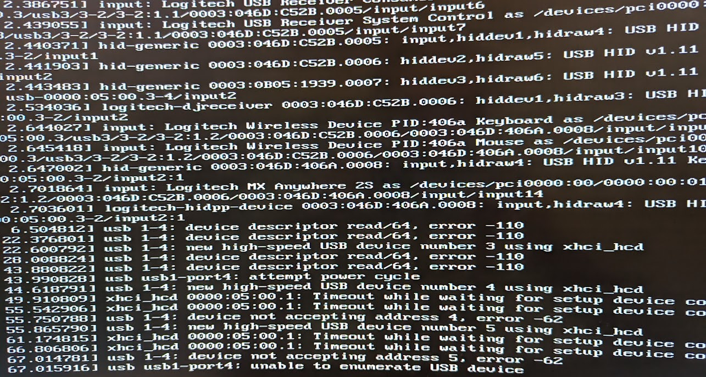

The Wi-Fi 6E & Bluetooth 5.2 controllers in my motherboard died today.

Until the motherboard can be replaced, the solution is to disable
both in the UEFI BIOS. This is the only state in which the PC boots
normally. Enabling the Bluetooth controller causes the boot process
to spend about a minute trying to initialize the device, enabling
the Wi-Fi controller causes the whole system to freeze with at the
login screen and/or eventually reboot itself.

<!-- more --> 

The motherboard model is 
[ASUS MB TUF GAMING X570-PRO WIFI II](https://www.asus.com/motherboards-components/motherboards/tuf-gaming/tuf-gaming-x570-pro-wifi-ii/)
and the wireless controller is, according to
[this one post on Reddit](https://reddit.com/r/ASUS/comments/133h7tv/tuf_gaming_x570pro_wifi_ii_slow_wifi_mediatek),
is the Mediatek RZ608. The settings to disable both controllers are
under Advanced Mode(F7) → Advanced
**→ Onboard Devices Configuration**.

After disabling both controllers, select Exit → Save & reset

*   `Wi-Fi Controller [Enabled]->[Disabled]`
*   `Bluetooth Controller [Enabled]->[Disabled]`

## What Happened

Saturday morning, coffee is ready, feeling like
[playing of Skyrim for a bit](https://www.youtube.com/watch?v=JvImL-2AJaI)...

Turn the PC on, suddenly *Nature calls*... 
gotta piss off for a minute.

Back to the PC, ready to... *wait, where’s the login greeter?*

The screen is just gray, not even back, only the mouse cursor is
visible. I move it around a bit, nothing happens. Hit Enter,
the PC reboots. What. The. ...

Time to boot into recovery mode then, and pay close attention to
what comes up. The boot process stops abruptly after printing
messages about all the USB devices found and then, slowly over
the next minute, the following shows up:

```
[    6.504390] usb 1-4: device descriptor read/64, error -110
[   22.376392] usb 1-4: device descriptor read/64, error -110
[   22.600375] usb 1-4: new high-speed USB device number 3 using xhci_hcd
[   28.008393] usb 1-4: device descriptor read/64, error -110
[   43.880388] usb 1-4: device descriptor read/64, error -110
[   43.990399] usb usb1-port4: attempt power cycle
[   44.618358] usb 1-4: new high-speed USB device number 4 using xhci_hcd
[   49.910386] xhci_hcd 0000:05:00.1: Timeout while waiting for setup device command
[   55.542386] xhci_hcd 0000:05:00.1: Timeout while waiting for setup device command
[   55.750358] usb 1-4: device not accepting address 4, error -62
[   55.865359] usb 1-4: new high-speed USB device number 5 using xhci_hcd
[   61.174387] xhci_hcd 0000:05:00.1: Timeout while waiting for setup device command
[   66.806387] xhci_hcd 0000:05:00.1: Timeout while waiting for setup device command
[   67.014360] usb 1-4: device not accepting address 5, error -62
[   67.015483] usb usb1-port4: unable to enumerate USB device
```

??? note "These lines scrolled away pretty fast, how to capture them as text?"

    Have a smart phone (or other device with a fast camera) ready to
    take photos of messages as they show up. Be ready to take many
    photos so you can later find one that shows what you need.

    

    Later, you may be able to recover those lines from logs
    (more on this below).

The recover tool shows up but the only option that seems useful
at this point is to `Drop to root shell` so there we go.

The system freezes again after just a few seconds,
barely enough time to find the
[script to restart a USB controller](2023-08-27-xhci-host-controller-not-responding-assume-dead.md),
but not time enough to run it.

*This is ridiculous!* How can I possibly even try anything if the
whole system freezes within seconds?

## Regaining Control

Specialist to troubleshoot hardware, and the first thing you do
when hardware is acting up is strip it down to the barest minimum
configuration you can work with.

So I unplugged *all* the USB devices.

I have lots of them, including enough hubs I’ve lost count of them.

*But wait!* A keyboard is required and all my keyboards are USB.
A mouse is also necessary, or at least very convenient, to navigate
the UEFI BIOS utility

So the minimum configuration I could work with was with the wireless keyboard
([Logitech G G915 TKL](https://href.li/?https://www.logitechg.com/en-ch/products/gaming-keyboards/g915-tkl-wireless.html))
and mouse
([Logitech MX Anywhere 2S](https://href.li/?https://www.rtings.com/mouse/reviews/logitech/mx-anywhere-2s)),
each with their own USB receiver, both plugged on the front ports.

To further reduce the number of devices involved, I went into the
UEFI BIOS utility and **disabled the Wi-Fi Controller** under
Advanced Mode(F7) → Advanced → Onboard Devices Configuration.

And to reduce also the number of processes involved, the next step
was to boot the system in *less than* recovery mode:

1. Mash the `Shift` key to make Grub show the menu (optional).
1. Select the relevant entry (usually the first, default).
1. Press `e` to edit this entry.
1. Go to the line that starts with `linux` and 
   add **`init=/bin/bash`** at the end of it.
1. Press `Ctrl+x` to boot with this modified entry.

This boots the system into *just* the shell, with only the root file
system mounted read-only. If it’s possible to run a *barer* system,
I don’t know how 😅

At this point `lsusb` shows *pretty much nothing*, as expected:

``` console
# lsusb
Bus 006 Device 001: ID 1d6b:0003 Linux Foundation 3.0 root hub
Bus 005 Device 001: ID 1d6b:0002 Linux Foundation 2.0 root hub
Bus 004 Device 001: ID 1d6b:0003 Linux Foundation 3.0 root hub
Bus 003 Device 002: ID 0b05:1939 ASUSTek Computer, Inc. AURA LED Controller
Bus 005 Device 014: ID 046d:c52b Logitech, Inc. Unifying Receiver
Bus 005 Device 012: ID 046d:c545 Logitech, Inc. USB Receiver
Bus 003 Device 001: ID 1d6b:0002 Linux Foundation 2.0 root hub
Bus 002 Device 001: ID 1d6b:0003 Linux Foundation 3.0 root hub
Bus 001 Device 001: ID 1d6b:0002 Linux Foundation 2.0 root hub
```

The good news is, this barest minimum configuration does not freeze
seconds after boot. The bad news is, I don’t really know how to go
from here.

## Root Cause Analysis

There is *still something wrong* with *something on USB*, which is
causing the timeouts to delay the boot process for a whole minute.
It would be best to find out what it is, and fix it, before adding
complexity back to return to the original (normal) state. The first
objective is to find out what is wrong.

Time to go and search around for posts about these errors,
in particular:

```
[   66.806387] xhci_hcd 0000:05:00.1: Timeout while waiting for setup device command
[   67.014360] usb 1-4: device not accepting address 5, error -62
[   67.015483] usb usb1-port4: unable to enumerate USB device
```

This looks like USB controller `0000:05:00.1` *is not responding*.

Among the many posts that came up searching for
`linux usb "device not accepting address" "error -62"`
`"unable to enumerate USB device"`
the following offered valuable clues:

*   *What is USB error -62?* is explained in
    [askubuntu.com/a/749864](https://askubuntu.com/a/749864)
    by pointing to
    [`/usr/include/asm-generic/errno.h`](https://github.com/torvalds/linux/blob/master/include/uapi/asm-generic/errno.h)
    where these error codes are defined. Spoiler: they are time outs.
*   *USB device descriptor read/64, error -62* is equally explained in 
    [linuxquestions.org/questions/linux-hardware-18/usb-device-descriptor-read-64-error-62-a-830555](http://linuxquestions.org/questions/linux-hardware-18/usb-device-descriptor-read-64-error-62-a-830555)
    with the additional suggestion that this is typically a hardware
    issue.
*   Paul Philippov in
    [How to fix “device not accepting address” error](https://paulphilippov.com/articles/how-to-fix-device-not-accepting-address-error)
    suggests the hardware issue may be caused by the USB over-current
    protection when something draws too much current out of a USB port
    and offers a workaround that seems to have helped some people… not
    me today 😞
*   [bbs.archlinux.org/viewtopic.php?id=265272](https://bbs.archlinux.org/viewtopic.php?id=265272)
    suggests a different root cause: a faulty PCIe card
    (network + bluetooth).

The last of these aligns with the symptom of system freezing shortly
after booting when the Wireless controller is not disabled.

None of the above actually show who to disable a malfunctioning USB
device, so I tried unbind command from the
[script to restart a USB controller](2023-08-27-xhci-host-controller-not-responding-assume-dead.md).

``` console
root@(none):/# /root/restart-usb.sh 0000:05:00.1
/root/restart-usb.sh: line 15: echo: write error: No such device
/root/restart-usb.sh: line 17: echo: write error: No such device
root@(none):/# echo -n 0000:05:00.1 > /sys/bus/pci/drivers/xhci_hcd/unbind
bash: echo: write error: No such device
root@(none):/# ls -l /sys/bus/pci/drivers/xhci_hcd/*bind
--w------- 1 root root 4096 Sep  9 19:15 /sys/bus/pci/drivers/xhci_hcd/bind
--w------- 1 root root 4096 Sep  9 19:15 /sys/bus/pci/drivers/xhci_hcd/unbind
```

[That doesn’t work!](https://www.reddit.com/r/discworld/comments/evqozb/that_doesnt_work/)
Not even after remounting root file system as read-write.

Given than at this point the kernel and bash are the absolute only
processes running, I decide to reboot into the less minimum
single-user mode:

1. Mash the `Shift` key to make Grub show the menu (optional).
1. Select the relevant entry (usually the first, default).
1. Press `e` to edit this entry.
1. Go to the line that starts with `linux` and 
   add **`single`** at the end of it.
1. Press `Ctrl+x` to boot with this modified entry.

This boots the system into
[single-user mode](https://www.veeam.com/blog/ubuntu-linux-defense-secure-boot-single-user.html),
which is more than just a shell. This is probably equivalent to
booting the (recovery mode) entry directly from Grub and then
`Drop to root shell` which might even be faster.

This time the un/bind commands do work, although not to the desired effect:

``` console
root@rapture:~# ./restart-usb.sh 0000:05:00.1
[  103.273788] usb 1-4: device descriptor read/64, error -110
[  119.145773] usb 1-4: device descriptor read/64, error -110
[  124.777716] usb 1-4: device descriptor read/64, error -110
[  140.649714] usb 1-4: device descriptor read/64, error -110
[  152.519706] usb 1-4: device not accepting address 4, error -62
[  163.783694] usb 1-4: device not accepting address 5, error -62
[  163.784239] usb usb1-port4: unable to enumerate USB device
root@rapture:~# 
```

After this `lsusb` shows even less:

``` console
# lsusb
Bus 006 Device 001: ID 1d6b:0003 Linux Foundation 3.0 root hub
Bus 005 Device 001: ID 1d6b:0002 Linux Foundation 2.0 root hub
Bus 004 Device 001: ID 1d6b:0003 Linux Foundation 3.0 root hub
Bus 003 Device 002: ID 0b05:1939 ASUSTek Computer, Inc. AURA LED Controller
Bus 005 Device 014: ID 046d:c52b Logitech, Inc. Unifying Receiver
Bus 005 Device 012: ID 046d:c545 Logitech, Inc. USB Receiver
Bus 003 Device 001: ID 1d6b:0002 Linux Foundation 2.0 root hub
```

Comparing this with the previous output, the last 2 lines are missing:

```
Bus 002 Device 001: ID 1d6b:0003 Linux Foundation 3.0 root hub
Bus 001 Device 001: ID 1d6b:0002 Linux Foundation 2.0 root hub
```

At this point it seems clear that restarting the USB controller
won’t help, we need to **disable** it. Ideally before the kernel
attempts device enumeration.

This could be done by adding (only) the unbind command to
`/etc/rc.local` (and then
[enable it to run in systemd](https://marsown.com/wordpress/how-to-enable-etc-rc-local-with-systemd-on-ubuntu-20-04/))
but it would still run *too late*.

Searching for a method to **disable** a specific USB controller at
boot time, the closest I found was to
[disable it *upon detection* via udev rules](https://ubuntuforums.org/showthread.php?t=1161574&page=7&p=8512485#post8512485):

``` bash title="/etc/udev/rules.d/10-disable-dead-usb-controller.rules"
# Disable dead USB controller.
ATTRS{idVendor}=="1d6b", ATTRS{idProduct}=="0002", PROGRAM="/bin/sh -c 'echo -n 0000:05:00.1 > /sys/bus/pci/drivers/xhci_hcd/unbind'"
ATTRS{idVendor}=="1d6b", ATTRS{idProduct}=="0003", PROGRAM="/bin/sh -c 'echo -n 0000:05:00.1 > /sys/bus/pci/drivers/xhci_hcd/unbind'"
```

With this method the kernel still tries to enumerate devices early in
the boot process, having to wait for the operation to timeout after
about a minute (looks like 3 attempts timing out after 20 seconds each).

Back to the question of what is broken, I made a copy of all the
(current and old) `dmesg` and `kern.log` files to search for clues in
them. The oldest of dmesg logs offered the first clue about what’s
behind the `usb 1-4 port`:

```
[    1.955188] kernel: usb 1-4: New USB device strings: Mfr=5, Product=6, SerialNumber=7
[    1.955615] kernel: usb 1-4: Product: Wireless_Device
[    1.956021] kernel: usb 1-4: Manufacturer: MediaTek Inc.
[    1.956454] kernel: usb 1-4: SerialNumber: 000000000
```

This hints at the wireless card integrated in the
[ASUS MB TUF GAMING X570-PRO WIFI II](https://www.asus.com/motherboards-components/motherboards/tuf-gaming/tuf-gaming-x570-pro-wifi-ii/)
motherboard.
[This post on Reddit](https://reddit.com/r/ASUS/comments/133h7tv/tuf_gaming_x570pro_wifi_ii_slow_wifi_mediatek)
claims the wireless controller in
this motherboard is the Mediatek RZ608 chip, so that’s match.

Since it’s common for the Bluetooth controller to be on the same chip
as the Wireless controller, and this motherboard has a
*WIFI 6E & BT 5*.2 chip that probably does both,
I went and search the logs for messages about bluetooth.

`/var/log/kern.log` still contained timeouts from *yesterday*:

```
Sep  7 20:12:23 [    5.913266] Bluetooth: Core ver 2.22
Sep  7 20:12:23 [    5.913281] NET: Registered PF_BLUETOOTH protocol family
Sep  7 20:12:23 [    5.913282] Bluetooth: HCI device and connection manager initialized
Sep  7 20:12:23 [    5.913284] Bluetooth: HCI socket layer initialized
Sep  7 20:12:23 [    5.913286] Bluetooth: L2CAP socket layer initialized
Sep  7 20:12:23 [    5.913288] Bluetooth: SCO socket layer initialized
Sep  7 20:12:23 [    6.078995] Bluetooth: hci0: Device setup in 136464 usecs
Sep  7 20:12:23 [   13.113408] Bluetooth: BNEP (Ethernet Emulation) ver 1.3
Sep  7 20:12:23 [   13.113410] Bluetooth: BNEP filters: protocol multicast
Sep  7 20:12:23 [   13.113413] Bluetooth: BNEP socket layer initialized
Sep  7 20:12:24 [   13.369207] Bluetooth: hci0: Device setup in 138047 usecs
Sep  7 20:12:27 [   16.272655] Bluetooth: RFCOMM TTY layer initialized
Sep  7 20:12:27 [   16.272662] Bluetooth: RFCOMM socket layer initialized
Sep  7 20:12:27 [   16.272667] Bluetooth: RFCOMM ver 1.11
---
Sep  8 22:30:44 [    5.967545] Bluetooth: Core ver 2.22
Sep  8 22:30:44 [    5.967768] NET: Registered PF_BLUETOOTH protocol family
Sep  8 22:30:44 [    5.967769] Bluetooth: HCI device and connection manager initialized
Sep  8 22:30:44 [    5.967773] Bluetooth: HCI socket layer initialized
Sep  8 22:30:44 [    5.967775] Bluetooth: L2CAP socket layer initialized
Sep  8 22:30:44 [    5.967779] Bluetooth: SCO socket layer initialized
Sep  8 22:30:44 [   13.083923] Bluetooth: BNEP (Ethernet Emulation) ver 1.3
Sep  8 22:30:44 [   13.083925] Bluetooth: BNEP filters: protocol multicast
Sep  8 22:30:44 [   13.083932] Bluetooth: BNEP socket layer initialized
Sep  8 22:30:48 [   16.275362] Bluetooth: hci0: Execution of wmt command timed out
Sep  8 22:30:48 [   16.275367] Bluetooth: hci0: Failed to send wmt func ctrl (-110)
```

The messages from September 7th indicate success, the messages from
September 8 indicate failure to initialize the Bluetooth controller
due to a command timing out. This seems conclusive and at this point
I realize there may be a separate option in the UEFI BIOS to disable
the Bluetooth controller.

Indeed there is, right under it but I hadn’t seen it because it was
necessary to scroll down. So I **disabled the Bluetooth Controller**
as well, under Advanced Mode(F7) → Advanced → Onboard Devices Configuration.

Finally, booting into single-user mode is *fast* and shows no errors,
and booting normally *nearly everything* works perfectly.

I setup my PC with 2 static IPs and this setup is susceptible to
changes in the names of network interfaces. Somehow disabling the
Wi-Fi Controller had *shifted* the Ethernet card from
`enp5s0` to `enp4s0`.

Replacing that name in the config file under `/etc/netplan` and
running netplan apply restored the network. *We are back!* 😎

## Back To Normal

With the system back to normal operation, we still have to plug all
the other USB devices back in. *Hopefully* the Mediatek chip, being
the only match for `usb 1-4` in the kernel logs, is the only device
behind the disabled USB controller. And hopefully all other
controllers will work.

While running `dmesg -w` to capture logs in real time, I start
plugging each USB cable on the back one by one, trying each cable on
every USB port on the motherboard. That is, those directly in the I/O
panel on the back of the computer, the only other USB ports are on
the front panel which I’ve been using for the keyboard and mouse
without any problems.

This process revealed a few things:

1.  My monitor
    ([Dell UltraSharp U3421WE](https://www.bhphotovideo.com/c/product/802784522-USE/dell_ultrasharp_u3421we_34_1_21_9.html/overview))
    has an RJ-45 port, which I never noticed until today.
    *   When plugging it via USB, a `Realtek USB 10/100/1000 LAN`
        shows up as interface `enx70b5e8f62f4d`.
1.  No output on the USB ports closets to the Wireless controller 🙁
    *   Power is delivered, so at least the LED strips feeding off the
        monitor’s USB port do work.
1.  There was no need to disable the entire USB controller
    `0000:05:00.1`

Having disabled the Wi-Fi and Bluetooth controllers in the UEFI BIOS,
it was no longer necessary to disable the entire USB controller.

Prior to disabling the Bluetooth controller, it was possible to have
USB devices detected into the USB ports closets to the Wireless
controller. There were timeouts as seen above, but devices would
*eventually* be detected and work normally. With the Bluetooth
controller disabled, it was now possibly to remove the udev rules
above to get those USB ports back to work.

```
# rm -f /etc/udev/rules.d/10-disable-dead-usb-controller.rules
```

## Root Cause Confirmation

To confirm that the Wi-Fi Controller was the root cause of the
problem, I went back to the UEFI BIOS and enabled it again. This
time, *I had a plan*: boot into single-user mode, watch out for
different warnings from the kernel and *very quickly* check `dmesg`
for matching entries. It was a close call, but it worked.

The anticipated warning from the kernel showed up right after
entering the root password to enter single-user mode:

```
[   16.593831] mt7921e 0000:04:00.0: driver own failed
```

Interestingly, that’s on *another* USB controller (`0000:04:00.0`).
Even more interestingly, this line alone confirms the MediaTek
wireless controller is involved, as reported in multiple forums
over the last year or so:

*   [Ubuntu 22.04 Mediatek mt7921e WiFi adaper not found](https://ubuntuforums.org/showthread.php?t=2488997) (July 2023)
*   [Ubuntu 22.04 kernel update to 5.19 breaks Wi-Fi (mt7921e)](https://askubuntu.com/questions/1456030/ubuntu-22-04-kernel-update-to-5-19-breaks-wi-fi-mt7921e) (March 2023)
*   [WiFi problem on MSI Bravo 15 B5DD](https://bbs.archlinux.org/viewtopic.php?id=278134) (July 2022)
*   [MediaTek MT7921 Driver (mt7921e) keeps crashing/failing, proceeds to not be detected for the next 1-2 boots](https://discussion.fedoraproject.org/t/mediatek-mt7921-driver-mt7921e-keeps-crashing-failing-proceeds-to-not-be-detected-for-the-next-1-2-boots/71728) (July 2022)

A quick check for matching lines from dmesg shows a few more:

```
[    4.789341] mt7921e 0000:04:00.0: enabling device (0000 -> 0002)
[   16.593831] mt7921e 0000:04:00.0: driver own failed
[   16.593831] mt7921e: probe of 0000:04:00.0 failed with error -5
```

Searching for that probe error yields even better results:

*   [[Solved] No WiFi with the Mediatek MT7922 adapter and MT7921e driver](https://bbs.archlinux.org/viewtopic.php?id=286981) (July 2023)
*   [[PATCH] wifi: mt76: mt7921e: Perform FLR to recovery the device](https://lore.kernel.org/lkml/20230614063252.1650824-1-kai.heng.feng@canonical.com/T/) (June 2023)
*   [github.com/openwrt/mt76/issues/548](https://github.com/openwrt/mt76/issues/548)
    mt7921e: probe of 0000:02:00.0 failed with error -5 (June 2021)
    *   A comment in July 2023 suggest updating the BIOS might help.
*   Reddit post [What does “driver own failed” mean?](https://www.reddit.com/r/linuxquestions/comments/133b3md/what_does_driver_own_failed_mean/) (April 2023)

For now, enabling the Wi-Fi Controller on this motherboard inevitable
crashes the system. In less than 2 minutes, more errors shoed up from
the kernel and I had to reset the PC:

```
[  110.252478] igc 0000:05:00.0 enp5s0: PCIe link lost, device now detached
[  110.860785] ahci 0000:07:00.0: AHCI controller unavailable!
[  110.860786] ahci 0000:08:00.0: AHCI controller unavailable!
[  114.716174] xhci_hcd: 0000:06:00.1: xHCI host controller not responding, assume dead
[  114.716474] mt7921e: 0000:06:00.1: HC died; cleaning up
```

That looks like the Ethernet and probably most of the remaining USB
controllers going offline. Nothing for it but to go back into the
UEFI BIOS and disable the Wi-Fi Controller.

Fortunately neither the Wi-Fi nor the Bluetooth controllers were in use
in the first place, or are likely to be necessary. Disabling them feels
like a bit of a loss, but not nearly as much as the hassle to replace
the motherboard. Besides, there is a small chance that the issue might
yet be fixed by a BIOS firmware update, or a Linux kernel patch, or a
benevolent fairy. Either way, I’m happy so long as everything else
continues to work. May that last a really long time 😁

After spending the whole morning troubleshooting this, and the rest of
the day writing all the above, all I want now is to play a bit of Skyrim!

<iframe width="1720" height="720" src="https://www.youtube.com/embed/JvImL-2AJaI?si=-N8pbDyvnBHonBb3" title="YouTube video player" frameborder="0" allow="accelerometer; autoplay; clipboard-write; encrypted-media; gyroscope; picture-in-picture; web-share" allowfullscreen></iframe>
