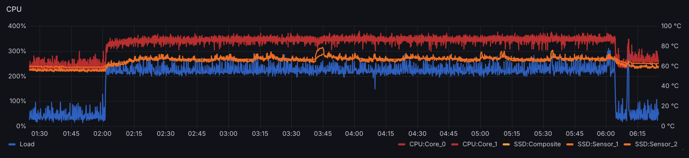
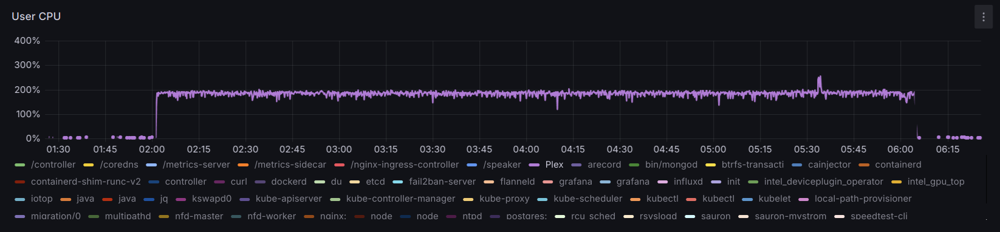
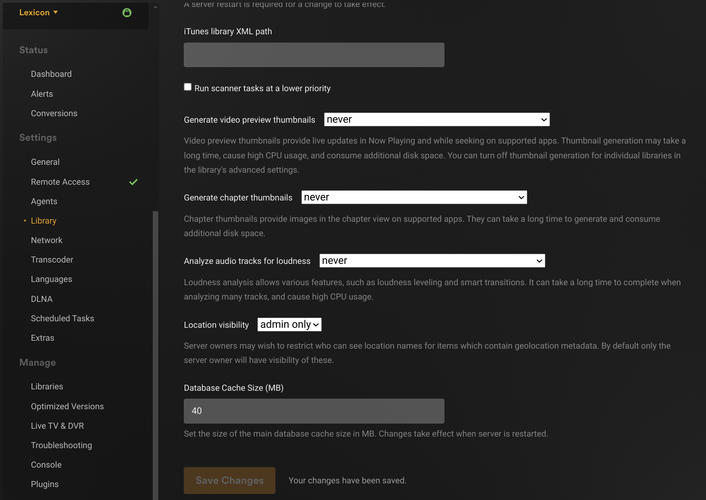
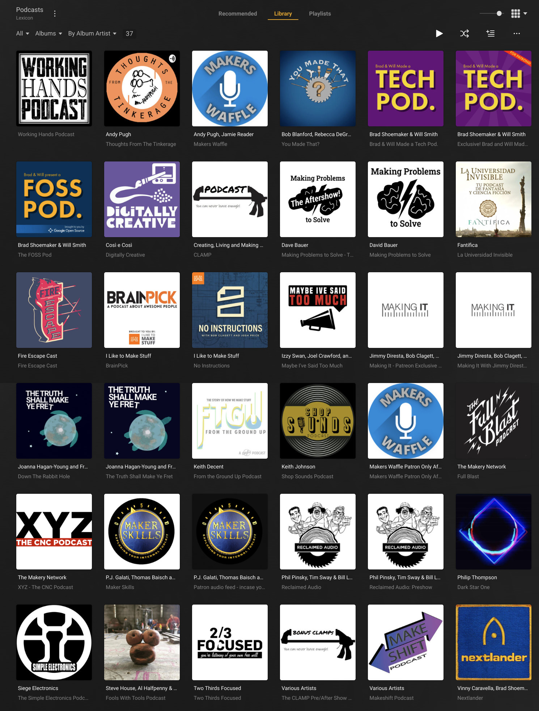

Running [Plex Media Server](https://www.plex.tv/) on Linux is easy.
Updating it is easy too. Re-using the library from an old server on a
new one is also quite easy.

That said, running anything in Kubernetes is only slightly harder
*once*, and after that updates are *entirely automatic* and moving
from one cluster to another would be *even easier*.

## Prologue

I’ve been using [Plex Media Server](https://www.plex.tv/) for a few
years, primarily to catch up with a bunch of podcasts I started
listening from *their* beginning in the spring of 2020, and
occasionally to share my Audible library with the family.
The family doesn’t really use any of this, specially since they got
Spotify, but this library of Podcasts has been a faithful companion
of mine for the last few years, at home and abroad.

The **Kubernetes** cluster running on **Lexicon** has proven stable
and convenient enough that I finally felt motivated to migrate the
Plex Media Server, from the stand-alone setup into the Kubernetes cluster.

<!-- more --> 

## Kubernetes

Plex offers their official Docker image
([plexinc/pms-docker](https://hub.docker.com/r/plexinc/pms-docker/))
but somehow the better documentation, in Reddit and blog posts,
seems to converge on the
[linuxserver/plex](https://hub.docker.com/r/linuxserver/plex)
image from the [LinuxServer.io](https://www.linuxserver.io/) team.
For the most part, I followed
[Kubernetes Part 14: Deploy Plexserver from debontonline.com](https://www.debontonline.com/2021/01/part-14-deploy-plexserver-yaml-with.html),
except instead of NFS shares I used local paths where the data is
already present. For that, I took inspiration from Greg Jeanmarts’
article [(K3S – 5/8) Self-host your Media Center On Kubernetes with Plex, Sonarr, Radarr, Transmission and Jackett](https://greg.jeanmart.me/2020/04/13/self-host-your-media-center-on-kubernetes-wi/).

I like to keep my Kubernetes deployments each in a single file, so
this one is a bit long. The sections are in the order introduced by
[Kubernetes Part 14: Deploy Plexserver](https://www.debontonline.com/2021/01/part-14-deploy-plexserver-yaml-with.html):

1. **Two** `PersistentVolume`s for the data (media) and config (library).
1. **Two** `PersistentVolumeClaim`s for these.
1. A `Deployment` to run the Plex image using the above storage volumes.
1. **Two** `Service`s to expose TCP and UDP on the same ports.
1. **No** `Ingress` because I had no long-term need to access this Plex server directly. Having already configured similar Plex servers (e.g. on a Raspberry Pi), once the new server is *claimed* it will show up along with others at [app.plex.tv](https://app.plex.tv).

**Notes** about highlighted lines:

*  `14,49`: `1Gi` may seem excessive for the `/config` directory, but
    with a large collection comes a large database under this directory.
*  `19`: Local storage for Kubernetes pods goes under `/home/k8s`
   (root partition is small, no separate `/var` partition).
*  `34`: Local storage for audio files goes under `/home/depot`
   (including symlinks for a few folder in a SSD).
*  `49`: Local storage for video files goes under `/home/ssd`.
*  `29,44,79,94`: `500Gi` may seem even more excessive, but this is not much
   more than the storage space taken by my collections already.
   *  124 GB are taken by my Audible library (about 350 books).
   *  320 GB are taken by the Podcasts I’ve downloaded, most of which I treasure.
*  `132`: the token obtained from [plex.tv/claim](https://www.plex.tv/claim/)
    ─ **expires in just 4 minutes**.
*  `134,136`: the old Plex server was running as user plex and
   `998` was the UID and GID assigned to it.
*  `223,252`: this IP address comes from the range of reserved
   when installing **MetallLB** and should be the same on both
   services (TCP and UDP).

??? k8s "Kubernetes deployment: `plex-media-server.yaml`"

    ``` yaml linenums="1" hl_lines="14 19 29 34 44 49 79 94 132 134 136 223 252" title="plex-media-server.yaml"
    apiVersion: v1
    kind: Namespace
    metadata:
      name: plexserver
    ---
    apiVersion: v1
    kind: PersistentVolume
    metadata:
      name: plexserver-pv-config
      namespace: plexserver
    spec:
      storageClassName: manual
      capacity:
        storage: 1Gi
      accessModes:
        - ReadWriteOnce
      persistentVolumeReclaimPolicy: Retain
      hostPath:
        path: /home/k8s/plexmediaserver
    ---
    apiVersion: v1
    kind: PersistentVolume
    metadata:
      name: plexserver-pv-data-depot
      namespace: plexserver
    spec:
      storageClassName: manual
      capacity:
        storage: 500Gi
      accessModes:
        - ReadWriteOnce
      persistentVolumeReclaimPolicy: Retain
      hostPath:
        path: /home/depot
    ---
    apiVersion: v1
    kind: PersistentVolume
    metadata:
      name: plexserver-pv-data-video
      namespace: plexserver
    spec:
      storageClassName: manual
      capacity:
        storage: 500Gi
      accessModes:
        - ReadWriteOnce
      persistentVolumeReclaimPolicy: Retain
      hostPath:
        path: /home/ssd/video
    ---
    apiVersion: v1
    kind: PersistentVolumeClaim
    metadata:
      name: plexserver-pvc-config
      namespace: plexserver
    spec:
      storageClassName: manual
      volumeName: plexserver-pv-config
      accessModes:
        - ReadWriteOnce
      volumeMode: Filesystem
      resources:
        requests:
          storage: 1Gi
    ---
    apiVersion: v1
    kind: PersistentVolumeClaim
    metadata:
      name: plexserver-pvc-data-depot
      namespace: plexserver
    spec:
      storageClassName: manual
      volumeName: plexserver-pv-data-depot
      accessModes:
        - ReadWriteOnce
      volumeMode: Filesystem
      resources:
        requests:
          storage: 500Gi
    ---
    apiVersion: v1
    kind: PersistentVolumeClaim
    metadata:
      name: plexserver-pvc-data-video
      namespace: plexserver
    spec:
      storageClassName: manual
      volumeName: plexserver-pv-data-video
      accessModes:
        - ReadWriteOnce
      volumeMode: Filesystem
      resources:
        requests:
          storage: 500Gi
    ---
    apiVersion: apps/v1
    kind: Deployment
    metadata:
      labels:
        app: plexserver
      name: plexserver
      namespace: plexserver
    spec:
      replicas: 1
      revisionHistoryLimit: 0
      selector:
        matchLabels:
          app: plexserver
      strategy:
        rollingUpdate:
          maxSurge: 0
          maxUnavailable: 1
        type: RollingUpdate
      template:
        metadata:
          labels:
            app: plexserver
        spec:
          volumes:
          - name: plex-config
            persistentVolumeClaim:
              claimName: plexserver-pvc-config
          - name: data-depot
            persistentVolumeClaim:
              claimName: plexserver-pvc-data-depot
          - name: data-video
            persistentVolumeClaim:
              claimName: plexserver-pvc-data-video
          containers:
          - env:
            - name: PLEX_CLAIM
              value: claim-deDSmtULWyYbvwt_2xAu
            - name: PGID
              value: "998"
            - name: PUID
              value: "998"
            - name: VERSION
              value: latest
            - name: TZ
              value: Europe/Amsterdam
            image: ghcr.io/linuxserver/plex
            imagePullPolicy: Always
            name: plexserver
            ports:
            - containerPort: 32400
              name: pms-web
              protocol: TCP
            - containerPort: 32469
              name: dlna-tcp
              protocol: TCP
            - containerPort: 1900
              name: dlna-udp
              protocol: UDP
            - containerPort: 3005
              name: plex-companion
              protocol: TCP  
            - containerPort: 5353
              name: discovery-udp
              protocol: UDP  
            - containerPort: 8324
              name: plex-roku
              protocol: TCP  
            - containerPort: 32410
              name: gdm-32410
              protocol: UDP
            - containerPort: 32412
              name: gdm-32412
              protocol: UDP
            - containerPort: 32413
              name: gdm-32413
              protocol: UDP
            - containerPort: 32414
              name: gdm-32414
              protocol: UDP
            resources: {}
            stdin: true
            tty: true
            volumeMounts:
            - mountPath: /config
              name: plex-config
            - mountPath: /home/depot
              name: data-depot
            - mountPath: /home/ssd/video
              name: data-video
          restartPolicy: Always
    ---
    kind: Service
    apiVersion: v1
    metadata:
      name: plex-udp
      namespace: plexserver
      annotations:
        metallb.universe.tf/allow-shared-ip: plexserver
    spec:
      selector:
        app: plexserver
      ports:
      - port: 1900
        targetPort: 1900
        name: dlna-udp
        protocol: UDP
      - port: 5353
        targetPort: 5353
        name: discovery-udp
        protocol: UDP
      - port: 32410
        targetPort: 32410
        name: gdm-32410
        protocol: UDP
      - port: 32412
        targetPort: 32412
        name: gdm-32412
        protocol: UDP
      - port: 32413
        targetPort: 32413
        name: gdm-32413
        protocol: UDP
      - port: 32414
        targetPort: 32414
        name: gdm-32414
        protocol: UDP
      type: LoadBalancer
      loadBalancerIP: 192.168.0.128  # Should be one from the MetalLB range and the same as the TCP service.
    ---
    kind: Service
    apiVersion: v1
    metadata:
      name: plex-tcp
      namespace: plexserver
      annotations:
        metallb.universe.tf/allow-shared-ip: plexserver
    spec:
      selector:
        app: plexserver
      ports:                      
      - port: 32400
        targetPort: 32400
        name: pms-web
        protocol: TCP
      - port: 3005
        targetPort: 3005
        name: plex-companion
      - port: 8324
        name: plex-roku
        targetPort: 8324  
        protocol: TCP  
      - port: 32469
        targetPort: 32469
        name: dlna-tcp
        protocol: TCP
      type: LoadBalancer
      loadBalancerIP: 192.168.0.128  # Should be one from the MetalLB range and the same as the UDP service.
    ```

Having saved the above as `plex-media-server.yaml`
all is left to do now is apply it:

```
$ kubectl apply -f plex-media-server.yaml 
namespace/plexserver created
persistentvolume/plexserver-pv-config created
persistentvolume/plexserver-pv-data-depot created
persistentvolume/plexserver-pv-data-video created
persistentvolumeclaim/plexserver-pvc-config created
persistentvolumeclaim/plexserver-pvc-data-depot created
persistentvolumeclaim/plexserver-pvc-data-video created
deployment.apps/plexserver created
service/plex-udp created
service/plex-tcp created
```

After about a minute the pod finds the `PersistentVolumeClaim`s and Plex is ready at
[192.168.0.128:32400/web](http://192.168.0.128:32400/web)
(LAN only, no SSL).

When accessing the new server’s web interface for the first time, log
in and create a test library with a small body of media, just to
confirm that Plex is able to scan the files. If there is no previous
Plex server, this is already a good time to let it scan the entire
media collection.

### Addition (that didn’t work)

GPU in this server isn’t big and video transcoding is not actually
necessary, since this server is used almost exclusively for audio,
but I tried following
[Plex on Kubernetes with intel iGPU passthrough – Small how to](https://www.reddit.com/r/selfhosted/comments/121vb07/plex_on_kubernetes_with_intel_igpu_passthrough/)
anyway to see how it’d go. *It didn’t*.

First, I didn’t even try tagging the server (single node) with the
label `intel.feature.node.kubernetes.io/gpu=true` ─ this may have
prevented pods from finding the GPU but I suspect something else did.
Installing a certificate manager should not be necessary, because
it’s already installed.

[intel/intel-device-plugins-for-kubernetes](https://github.com/intel/intel-device-plugins-for-kubernetes/blob/main/INSTALL.md)
requires NFD ([Node Feature Discovery](https://kubernetes-sigs.github.io/node-feature-discovery/stable/get-started/index.html))
for the Device Plugin operator, then the operator and GPU can be
installed with their respective helm charts:

*  [intel/helm-charts/charts/device-plugin-operator](https://github.com/intel/helm-charts/tree/main/charts/device-plugin-operator)
*  [intel/helm-charts/charts/gpu-device-plugin](https://github.com/intel/helm-charts/tree/main/charts/gpu-device-plugin)

Installing all these through the Helm charts *should* be quite easy:

``` console
$ helm repo add nfd https://kubernetes-sigs.github.io/node-feature-discovery/charts
$ helm repo add intel https://intel.github.io/helm-charts/
$ helm repo update

$ helm install nfd nfd/node-feature-discovery \
  --namespace node-feature-discovery --create-namespace --version 0.12.1 \
  --set 'master.extraLabelNs={gpu.intel.com,sgx.intel.com}' \
  --set 'master.resourceLabels={gpu.intel.com/millicores,gpu.intel.com/memory.max,gpu.intel.com/tiles,sgx.intel.com/epc}'
NAME: nfd
LAST DEPLOYED: Fri Sep 15 05:30:14 2023
NAMESPACE: node-feature-discovery
STATUS: deployed
REVISION: 1
TEST SUITE: None

$ helm install device-plugin-operator intel/intel-device-plugins-operator
NAME: device-plugin-operator
LAST DEPLOYED: Fri Sep 15 05:31:28 2023
NAMESPACE: default
STATUS: deployed
REVISION: 1
TEST SUITE: None
NOTES:
Thank you for installing intel-device-plugins-operator.

The next step would be to install the device (plugin) specific chart.

$ helm install gpu-device-plugin intel/intel-device-plugins-gpu
NAME: gpu-device-plugin
LAST DEPLOYED: Fri Sep 15 05:32:11 2023
NAMESPACE: default
STATUS: deployed
REVISION: 1
TEST SUITE: None

$ helm show values intel/intel-device-plugins-operator
manager:
  image:
    hub: intel
    tag: ""
    pullPolicy: IfNotPresent

kubeRbacProxy:
  image:
    hub: gcr.io
    hubRepo: kubebuilder
    tag: v0.14.1
    pullPolicy: IfNotPresent

privateRegistry:
  registryUrl: ""
  registryUser: ""
  registrySecret: ""

$ helm show values intel/intel-device-plugins-gpu
name: gpudeviceplugin-sample

image:
  hub: intel
  tag: ""

initImage:
  hub: intel
  tag: ""

sharedDevNum: 1
logLevel: 2
resourceManager: false
enableMonitoring: true
allocationPolicy: "none"

nodeSelector:
  intel.feature.node.kubernetes.io/gpu: 'true'

nodeFeatureRule: false
```

I’m not sure what is missing. Attempting to assign the GPU to Plex by
adding the following lines to `plex-media-server.yaml` did not work:

``` yaml linenums="175" title="plex-media-server.yaml"
        resources:
            requests:
                gpu.intel.com/i915: "1"
            limits:
                gpu.intel.com/i915: "1"
```

Made the deployment fail with because the GPU was not available:

```
0/1 nodes are available: 1
Insufficient gpu.intel.com/i915.
preemption: 0/1 nodes are available: 1
No preemption victims found for incoming pod.
```

### Alternative (that didn’t work)

There are also Helm charts, at least 2:

*  [munnerz/kube-plex](https://github.com/munnerz/kube-plex) which
   seems to be simpler
*  [ressu/kube-plex](https://github.com/ressu/kube-plex) which is a
   fork of [munnerz/kube-plex](https://github.com/munnerz/kube-plex)

I tried [munnerz/kube-plex](https://github.com/munnerz/kube-plex)
only; it didn’t work.

In all honestly, I didn’t really try hard, and didn’t quite see the motivation to use Helm charts instead a regular deployment (as seen above).

Installing the chart was *supposed* to be this easy:

``` console
$ helm install plex ./charts/kube-plex \
    --create-namespace \
    --namespace plex \
    --set claimToken=claim-VqczS1yENc_F8J7zitZo
NAME: plex
LAST DEPLOYED: Wed Sep 13 22:40:48 2023
NAMESPACE: plex
STATUS: deployed
REVISION: 3
TEST SUITE: None
NOTES:
1. Get the application URL by running these commands:
  export POD_NAME=$(kubectl get pods --namespace plex -l "app=kube-plex,release=plex" -o jsonpath="{.items[0].metadata.name}")
  echo "Visit http://127.0.0.1:8080 to use your application"
  kubectl port-forward $POD_NAME 8080:
```

However, this is resulted in the pod being

```
stuck waiting for a volume to be created,
either by external provisioner “rancher.io/local-path”
or manually created by system administrator.
```

With no great motivation to get this to work, I decided to uninstall
the chart and study the deployment options more closely to get one to
work (as seen above).

``` console
$ helm uninstall -n plex plex
$ kubectl delete namespace plex
```

## Migration

With both Plex servers working, albeit with only a small test library
in the new one, the next goal is to migrate the whole database from
the old stand-alone Plex server to the new one running in Kubernetes.
The path to each server’s database is

*  `/home/depot/plexmediaserver/Library` for the old stand-alone server.
*  `/home/k8s/plexmediaserver/Library` for the new server in Kubernetes.

The plan is simple: stop both servers, move the new database away, copy the old one as the new one, start the new server only.

``` console
$ kubectl delete -f plex/plex-media-server.yaml
# systemctl stop plexmediaserver.service
# cd /home/k8s/plexmediaserver
# mv Library Library.backup
# cp -a /home/depot/plexmediaserver/Library .
```

**Note**: most Plex deployments mount the media a generic path
(`/data`). If that had been the case above, the new server would not
recognize the files as already scanned, since the library would only
refer to files under the old path (`/home/depot`). If this was the
case, it would be enough to update the `mountPath` value in line `181`
in `plex-media-server.yaml`

``` yaml linenums="178" title="plex-media-server.yaml"
        volumeMounts:
        - mountPath: /config
          name: plex-config
        - mountPath: /home/depot
          name: data
```

In addition to that, my deployment creates 2 separate
`PhysicalVolume`s (and claims) because video files are
in a separate disk:

``` yaml linenums="181" title="plex-media-server.yaml"
        - mountPath: /home/depot
          name: data-depot
        - mountPath: /home/ssd/video
          name: data-video
```

### Port forwarding

Normally Plex is able to establish the necessary port
forwarding via UPnP, but in this case that doesn't seem to
work. This may be because it's not the only Plex server in
the nework, so because it's running in a Kubernetes cluster.
Either way, the port forwarding rule can be added manually to
the router and then **Manually specify public port** in the
Plex settings under **Settings > Remote Access**.

!!! note

    This step may require connecting directly to the web interface
    from the local network:
    [192.168.0.128:32400/web](http://192.168.0.128:32400/web)

### Scheduled Tasks

Normally Plex runs daily maintenance during the night,
which is a good time. However, given the limited CPU in
this server, even letting it run for 4 hours every day
results in the CPU running quite hot for all that time:




To get rid of this, I went to **Settings > Server > Library**
to update
[Plex Library Settings](https://support.plex.tv/articles/200289526-library/) and disable these which I don't really need,
by setting their *frequency* to **never**:

*  **Generate chapter thumbnails** seems relevant only for
   TV series, which I don't use (or care about).
*  **Analyze audio tracks for loudness** is clearly called out
   as potentially CPU-intensive, and I don't think is useful
   for podcasts, where each episode is a single track, and most
   of the times one listens to a single one per "album". Even
   if this *could* be useful for audiobooks, it shouldn't be
   necessary given the rather high quality of their audio.



## Epilogue

The migration had two *critical* requirements:

1. *Not re-scanning* the library again. Although I take care to make
   sure podcasts episodes have good
   [ID3 v2 tags](https://mutagen-specs.readthedocs.io/en/latest/id3/id3v2.2.html),
   adjusting them if necessary, Plex does not seem to understand them
   all that well all the time, often leading to a single podcast
   being split in 2 or 3 albums, authors showing as “Various Artists”
   despite correct ID3 tags, and a few other oddities. I spent time
   adjusting metadata in Plex and would hate to lose that work.
1. *Preserve playlists*. Catching up with over a dozen podcasts’ back
   catalogue is no small feat, specially since podcast apps (that I
   know of) do not make this particularly easy; they probably assume
   this is not what most users want. Here is where Plex comes in
   handy: it was not too hard to create a playlist, open a browser
   tab for each episode an add episodes in the right (release) order.
   Again, although easy, this was quite a bit of work I would hate to lose.

!!! note

    I did consider creating the playlist programmatically,
    and may yet do it. One option would be to create an M3U playlist
    and import it into Plex using
    [DocDocDocDocDoc/PlexPlaylistImporter](https://github.com/DocDocDocDocDoc/PlexPlaylistImporter);
    the as-of-yet open question is how to create that playlist.

The migration went smoothly and, I am happy to report, both goals
where achieved. Here is by beloved Podcast collection:

