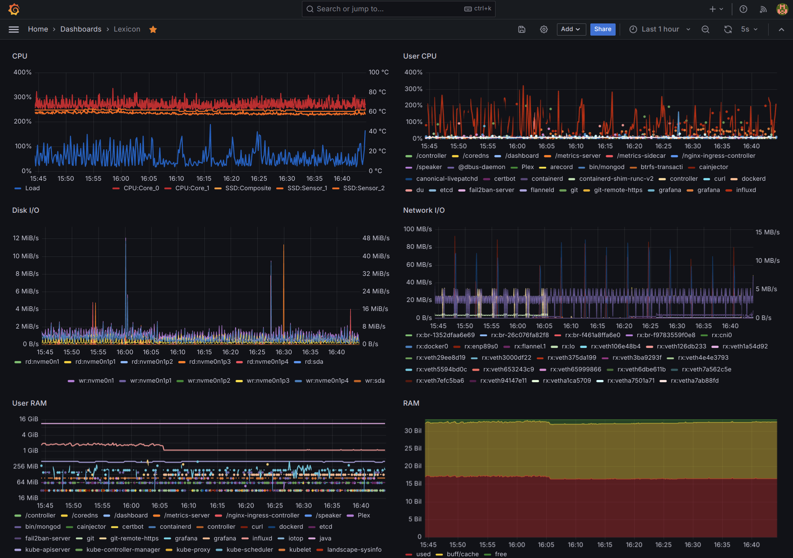

Four years later, I *still* have not gotten the hang of
telegraf, I'm *still* running my own home-made
[detailed system and process monitoring](2020-03-21-detailed-system-and-process-monitoring.md)
reporting to InfluxDB running *container-lessly* in
[lexicon](2023-03-25-single-node-kubernetes-cluster-on-ubuntu-server-lexicon.md)
and I feel the time is up for moving these services
into the Kubernetes cluster. Besides keeping them
updated, what I'm most looking forward is leveraging
the cluster's infrastructure to expose these services
(only) over HTTPS with automatically renewed SSL certs.

<!-- more --> 

## Current Setup

[Continuous Monitoring](../../conmon.md) describes the current, complete setup with the OSS
versions of InfluxDB and Grafana.

## Kubernetes Deployment

There quite a few articles out there explaining how to
run all 3 components (Telegraf, InfluxDB, Grafana) on
Docker, on some of which the following
`monitoring.yaml` deployment is (very loosly) based:

??? k8s "Kubernetes deployment: `monitoring.yaml`"

    ``` yaml linenums="1" title="monitoring.yaml"
    apiVersion: v1
    kind: Namespace
    metadata:
      name: monitoring
    ---
    apiVersion: v1
    kind: PersistentVolume
    metadata:
      name: influxdb-pv
      labels:
        type: local
      namespace: monitoring
    spec:
      storageClassName: manual
      capacity:
        storage: 30Gi
      accessModes:
        - ReadWriteOnce
      hostPath:
        path: /home/k8s/influxdb
    ---
    apiVersion: v1
    kind: PersistentVolumeClaim
    metadata:
      name: influxdb-pv-claim
      namespace: monitoring
    spec:
      storageClassName: manual
      volumeName: influxdb-pv
      accessModes:
        - ReadWriteOnce
      resources:
        requests:
          storage: 30Gi
    ---
    apiVersion: apps/v1
    kind: Deployment
    metadata:
      namespace: monitoring
      labels:
        app: influxdb
      name: influxdb
    spec:
      replicas: 1
      selector:
        matchLabels:
          app: influxdb
      template:
        metadata:
          labels:
            app: influxdb
        spec:
          hostname: influxdb
          containers:
          - image: docker.io/influxdb:1.8
            name: influxdb
            volumeMounts:
            - mountPath: /var/lib/influxdb
              name: influxdb-data
          securityContext:
            runAsUser: 114
            runAsGroup: 114
          volumes:
          - name: influxdb-data
            persistentVolumeClaim:
              claimName: influxdb-pv-claim
    ---
    apiVersion: v1
    kind: Service
    metadata:
      labels:
        app: influxdb
      name: influxdb-svc
      namespace: monitoring
    spec:
      ports:
      - port: 18086
        protocol: TCP
        targetPort: 8086
        nodePort: 30086
      selector:
        app: influxdb
      type: NodePort
    ---
    apiVersion: v1
    kind: ConfigMap
    metadata:
      name: telegraf
      namespace: monitoring
      labels:
        app: telegraf
    data:
      telegraf.conf: |+
        [agent]
          hostname = "influxdb"
        [[outputs.influxdb]]
          urls = ["http://influxdb-svc:18086/"]
          database = "telegraf"
          timeout = "5s"
        [[inputs.cpu]]
          percpu = true
          totalcpu = true
          collect_cpu_time = false
          report_active = false
        [[inputs.disk]]
          ignore_fs = ["tmpfs", "devtmpfs", "devfs"]
        [[inputs.diskio]]
        [[inputs.kernel]]
        [[inputs.mem]]
        [[inputs.processes]]
        [[inputs.swap]]
        [[inputs.system]]
        [[inputs.docker]]
          endpoint = "unix:///var/run/docker.sock"
    ---
    apiVersion: apps/v1
    kind: DaemonSet
    metadata:
      name: telegraf
      namespace: monitoring
      labels:
        app: telegraf
    spec:
      selector:
        matchLabels:
          name: telegraf
      template:
        metadata:
          labels:
            name: telegraf
        spec:
          containers:
          - name: telegraf
            image: docker.io/telegraf:1.30.1
            env:
            - name: HOSTNAME
              value: "influxdb"
            - name: "HOST_PROC"
              value: "/rootfs/proc"
            - name: "HOST_SYS"
              value: "/rootfs/sys"
            - name: INFLUXDB_DB
              value: "telegraf"
            volumeMounts:
            - name: sys
              mountPath: /rootfs/sys
              readOnly: true
            - name: proc
              mountPath: /rootfs/proc
              readOnly: true
            - name: docker-socket
              mountPath: /var/run/docker.sock
            - name: utmp
              mountPath: /var/run/utmp
              readOnly: true
            - name: config
              mountPath: /etc/telegraf
          terminationGracePeriodSeconds: 30
          volumes:
          - name: sys
            hostPath:
              path: /sys
          - name: docker-socket
            hostPath:
              path: /var/run/docker.sock
          - name: proc
            hostPath:
              path: /proc
          - name: utmp
            hostPath:
              path: /var/run/utmp
          - name: config
            configMap:
              name: telegraf
    ---
    apiVersion: v1
    kind: PersistentVolume
    metadata:
      name: grafana-pv
      labels:
        type: local
      namespace: monitoring
    spec:
      storageClassName: manual
      capacity:
        storage: 3Gi
      accessModes:
        - ReadWriteOnce
      hostPath:
        path: /home/k8s/grafana
    ---
    apiVersion: v1
    kind: PersistentVolumeClaim
    metadata:
      name: grafana-pv-claim
      namespace: monitoring
    spec:
      storageClassName: manual
      volumeName: grafana-pv
      accessModes:
        - ReadWriteOnce
      resources:
        requests:
          storage: 3Gi
    ---
    apiVersion: apps/v1
    kind: Deployment
    metadata:
      namespace: monitoring
      labels:
        app: grafana
      name: grafana
    spec:
      replicas: 1
      selector:
        matchLabels:
          app: grafana
      template:
        metadata:
          labels:
            app: grafana
        spec:
          containers:
          - image: docker.io/grafana/grafana:10.4.2
            env:
            - name: HOSTNAME
              valueFrom:
                fieldRef:
                  fieldPath: spec.nodeName
            - name: "GF_AUTH_ANONYMOUS_ENABLED"
              value: "true"
            - name: "GF_SECURITY_ADMIN_USER"
              value: "admin"
            - name: "GF_SECURITY_ADMIN_PASSWORD"
              value: "PLEASE_CHOOSE_A_SENSIBLE_PASSWORD"
            name: grafana
            volumeMounts:
              - name: grafana-data
                mountPath: /var/lib/grafana
          securityContext:
            runAsUser: 115
            runAsGroup: 115
            fsGroup: 115
          volumes:
          - name: grafana-data
            persistentVolumeClaim:
              claimName: grafana-pv-claim
    ---
    apiVersion: v1
    kind: Service
    metadata:
      labels:
        app: grafana
      name: grafana-svc
      namespace: monitoring
    spec:
      ports:
      - port: 13000
        protocol: TCP
        targetPort: 3000
        nodePort: 30300
      selector:
        app: grafana
      type: NodePort
    ```

This setup reuses the existing dedicated users
`influxdb` (114) and `grafana` (115) and requires
new directories owned by these users:

``` console
$ ls -ld /home/k8s/influxdb/ /home/k8s/grafana/
drwxr-xr-x 1 grafana  grafana  0 Mar 28 23:25 /home/k8s/grafana/
drwxr-xr-x 1 influxdb influxdb 0 Mar 28 21:54 /home/k8s/influxdb/

$ kubectl apply -f monitoring.yaml 
namespace/monitoring created
persistentvolume/influxdb-pv created
persistentvolumeclaim/influxdb-pv-claim created
deployment.apps/influxdb created
service/influxdb-svc created
configmap/telegraf created
daemonset.apps/telegraf created
persistentvolume/grafana-pv created
persistentvolumeclaim/grafana-pv-claim created
deployment.apps/grafana created
service/grafana-svc created

$ kubectl -n monitoring get all
NAME                            READY   STATUS    RESTARTS   AGE
pod/grafana-6c49f96c47-hx7kd    1/1     Running   0          73s
pod/influxdb-6c86444bb7-kt4sx   1/1     Running   0          73s
pod/telegraf-pwtkh              1/1     Running   0          73s

NAME               TYPE       CLUSTER-IP       EXTERNAL-IP   PORT(S)          AGE
service/grafana    NodePort   10.111.217.211   <none>        3000:30300/TCP   73s
service/influxdb   NodePort   10.109.61.156    <none>        8086:30086/TCP   73s

NAME                      DESIRED   CURRENT   READY   UP-TO-DATE   AVAILABLE   NODE SELECTOR   AGE
daemonset.apps/telegraf   1         1         1       1            1           <none>          73s

NAME                       READY   UP-TO-DATE   AVAILABLE   AGE
deployment.apps/grafana    1/1     1            1           73s
deployment.apps/influxdb   1/1     1            1           73s

NAME                                  DESIRED   CURRENT   READY   AGE
replicaset.apps/grafana-6c49f96c47    1         1         1       73s
replicaset.apps/influxdb-6c86444bb7   1         1         1       73s
```

Grafana is able to query InfluxDB at 
http://influxdb:8086/ and the following steps will be
to enable accessing both Grafana and InfluxDB over
HTTPS externally.

### Grafana Setup

Once InfluxDB is ready and Telegraf is feeding data
into it, setup Grafana by creating a **Data source**:

*   Type: InfluxDB
*   Name: `telegraf`
*   Query language: InfluxQL
*   URL: http://influxdb-svc:18086 (see [Pod Hostname DNS](#pod-hostname-dns))
*   Database: `telegraf`

### Secure InfluxDB

The next step is to add authentication to InfluxDB.
This will require updating Telegraf and Grafana.

#### InfluxDB Authentication

[Authentication and authorization in InfluxDB](https://docs.influxdata.com/influxdb/v1/administration/authentication_and_authorization/)
starts by enabling authentication.

Create at least one `admin` user:

``` console
$ influx -host localhost -port 30086
Connected to http://localhost:30086 version 1.8.10
InfluxDB shell version: 1.6.7~rc0

> USE telegraf
Using database telegraf

> CREATE USER admin WITH PASSWORD '**********' WITH ALL PRIVILEGES
```

!!! warning

    The password **must** be enclosed in **single** quotes (**`'`**).

[Enable authentication in the deployment](https://stackoverflow.com/a/67937758)
by setting the `INFLUXDB_HTTP_AUTH_ENABLED` variable:

``` yaml linenums="52" hl_lines="55 57" title="monitoring.yaml"
    spec:
      containers:
      - image: docker.io/influxdb:1.8
        env:
        - name: "INFLUXDB_HTTP_AUTH_ENABLED"
          value: "true"
        name: influxdb
```

Restart InfluxDB:

``` console
$ kubectl apply -f monitoring.yaml
...
deployment.apps/influxdb configured
...
```

The result is not that connections are rejected,
but access to the database is denied:

``` console
$ kubectl  -n monitoring logs telegraf-2k8hb | tail -1
2024-04-20T18:24:16Z E! [outputs.influxdb] E! [outputs.influxdb] Failed to write metric (will be dropped: 401 Unauthorized): unable to parse authentication credentials

$ influx -host localhost -port 30086
Connected to http://localhost:30086 version 1.8.10
InfluxDB shell version: 1.6.7~rc0
> USE telegraf
ERR: unable to parse authentication credentials
DB does not exist!
```

#### Update Grafana

Updating the InfluxDB connection under **Data soures**
in Grafana, by adding the username (`admin`) and
password, is enough to get the connextion restored.

#### Update Telegraf

To restore access to Telegraf, add the credentials
to the `ConfigMap` as follows:

``` yaml linenums="13" title="monitoring.yaml"
data:
  telegraf.conf: |+
    [[outputs.influxdb]]
      urls = ["http://influxdb-svc:18086/"]
      database = "telegraf"
      username = "admin"
      password = "*********************"
```

And restart `telegraf`:

``` console
$ kubectl delete -n monitoring daemonset telegraf
$ kubectl apply -f monitoring.yaml
```

### HTTPS Access

To do this, add an `Ingress` pointing to each service:

``` yaml numlines="178" title="monitoring.yaml"
apiVersion: networking.k8s.io/v1
kind: Ingress
metadata:
  name: grafana-ingress
  namespace: monitoring
  annotations:
    acme.cert-manager.io/http01-edit-in-place: "true"
    cert-manager.io/issue-temporary-certificate: "true"
    cert-manager.io/cluster-issuer: letsencrypt-prod
spec:
  ingressClassName: nginx
  rules:
    - host: gra.ssl.uu.am
      http:
        paths:
          - path: /
            pathType: Prefix
            backend:
              service:
                name: grafana-svc
                port:
                  number: 3000
  tls:
    - secretName: grafana-tls-secret
      hosts:
        - gra.ssl.uu.am
---
apiVersion: networking.k8s.io/v1
kind: Ingress
metadata:
  name: influxdb-ingress
  namespace: monitoring
  annotations:
    acme.cert-manager.io/http01-edit-in-place: "true"
    cert-manager.io/issue-temporary-certificate: "true"
    cert-manager.io/cluster-issuer: letsencrypt-prod
spec:
  ingressClassName: nginx
  rules:
    - host: inf.ssl.uu.am
      http:
        paths:
          - path: /
            pathType: Prefix
            backend:
              service:
                name: influxdb-svc
                port:
                  number: 8086
  tls:
    - secretName: influxdb-tls-secret
      hosts:
        - inf.ssl.uu.am
```

``` console
$ kubectl apply -f monitoring.yaml 
...
ingress.networking.k8s.io/grafana-ingress created
ingress.networking.k8s.io/influxdb-ingress created
```

Each Ingress will need to obtain its own certificate,
which requires patching each ACME solver to listen on
port 32080 (set up in router), leveraging the script
for [Monthly renewal of certificates (automated)](2023-03-25-single-node-kubernetes-cluster-on-ubuntu-server-lexicon.md#monthly-renewal-of-certificates-automated):

``` console
# /root/bin/cert-renewal-port-fwd.sh
service/cm-acme-http-solver-rnrs5 patched
```

This script runs every 30 minutes via `crontab`
but can also be run manually to speed things up.

If the external port 80 seems to be timing out,
it may be necessary to remove the port forwarding rule
in the router and add it again.

Once DNS records are updated, Grafana should be
available at https://gra.ssl.uu.am and InfluxDB
should be available at https://inf.ssl.uu.am

### Troubleshooting

#### Persistent Volumes

Because there are multiple `PersistentVolume` and
`PersistentVolumeClaim`, it is necessary to link them
explicitly by adding `volumeName` to each
`PersistentVolumeClaim`, otherwise volatile volumes
are used which are then discarded each time the
deployment is deleted.

#### Ingress Multiple SSL Certificates

When multiple `Ingress` are created in the same
namespace, it is also necessary to give each a
different `tls.secretName` for each `tls.hosts`
value; otherwise only one SSL certificate will be
created (and signed) and it won't be valid for all
subdomains in `tls.hosts`.

#### Pod Hostname DNS

For this setup to work, `telegraf` and `grafana` need
to send HTTP requests to `influxdb`. At first, it was
enough to set the `hostname` value in the `influxdb`
deployment, so that other services can connect to it
via the internal port and DNS: http://influxdb:8086

However, after the deployment was deleted and applied
a few times, `telegraf` and `grafana` were no longer
able to connect; the internal DNS would no longer
return an IP address for the `influxdb` hostname:

``` console
$ kubectl -n monitoring exec -i -t telegraf-zzs52 -- ping -c 1 kube-dns.kube-system.svc.cluster.local
PING kube-dns.kube-system.svc.cluster.local (10.96.0.10) 56(84) bytes of data.

$ kubectl -n monitoring exec -i -t telegraf-zzs52 -- ping -c 1 influxdb.monitoring.svc.cluster.local
ping: influxdb.monitoring.svc.cluster.local: Name or service not known
command terminated with exit code 2
```

Telegraf cannot write to InfluxDB:

``` console
$ kubectl -n monitoring logs telegraf-5rv6z | tail -2
2024-04-20T16:05:50Z E! [outputs.influxdb] When writing to [http://influxdb:8086/]: failed doing req: Post "http://influxdb:8086/write?db=telegraf": dial tcp: lookup influxdb on 10.96.0.10:53: no such host
2024-04-20T16:05:50Z E! [agent] Error writing to outputs.influxdb: could not write any address
```

Grafana cannot query InfluxDB:

``` console
Get "http://influxdb:8086/query?db=telegraf&epoch=ms&q=SELECT++FROM+%22%22+WHERE+time+%3E%3D+1713606668691ms+and+time+%3C%3D+1713628268691ms": dial tcp: lookup influxdb on 10.96.0.10:53: no such host
```

After getting tired of not finding relevant information
to troubleshoot this, updated the deployment and
Grafana to query InfluxDB via its `NodePort` at
10.0.0.6:30086

After updating dhe deployement, restart `telegraf`:

``` console
$ kubectl delete -n monitoring daemonset telegraf
$ kubectl apply -f monitoring.yaml
```

Still went to to check whether
[DNS queries are being received/processed?](https://kubernetes.io/docs/tasks/administer-cluster/dns-debugging-resolution/#are-dns-queries-being-received-processed)
and after adding logging of queries and trying again:

``` console
$ kubectl -n monitoring exec -i -t telegraf-zzs52 -- ping -c 1 kube-dns.kube-system.svc.cluster.local
PING kube-dns.kube-system.svc.cluster.local (10.96.0.10) 56(84) bytes of data.

$ kubectl -n monitoring exec -i -t telegraf-zzs52 -- ping -c 1 kube-dns.kube-system
PING kube-dns.kube-system.svc.cluster.local (10.96.0.10) 56(84) bytes of data.

$ kubectl -n monitoring exec -i -t telegraf-zzs52 -- ping -c 1 influxdb.monitoring
ping: influxdb.monitoring: Name or service not known
command terminated with exit code 2

$ kubectl -n monitoring exec -i -t telegraf-zzs52 -- ping -c 1 influxdb.monitoring.svc.cluster.local
ping: influxdb.monitoring.svc.cluster.local: Name or service not known
command terminated with exit code 2

$ kubectl logs --namespace=kube-system -l k8s-app=kube-dns
[INFO] 10.244.0.216:34419 - 28080 "AAAA IN kube-dns.kube-system.monitoring.svc.cluster.local. udp 67 false 512" NXDOMAIN qr,aa,rd 160 0.00013723s
[INFO] 10.244.0.216:34419 - 8637 "A IN kube-dns.kube-system.monitoring.svc.cluster.local. udp 67 false 512" NXDOMAIN qr,aa,rd 160 0.000129401s
[INFO] 10.244.0.216:43649 - 36293 "A IN kube-dns.kube-system.svc.cluster.local. udp 56 false 512" NOERROR qr,aa,rd 110 0.000073868s
[INFO] 10.244.0.216:43649 - 62915 "AAAA IN kube-dns.kube-system.svc.cluster.local. udp 56 false 512" NOERROR qr,aa,rd 149 0.000107266s
[INFO] 10.244.0.216:42170 - 53476 "A IN influxdb.monitoring.svc.cluster.local. udp 55 false 512" NXDOMAIN qr,aa,rd 148 0.000116052s
[INFO] 10.244.0.216:42170 - 27874 "AAAA IN influxdb.monitoring.svc.cluster.local. udp 55 false 512" NXDOMAIN qr,aa,rd 148 0.000141714s
[INFO] 10.244.0.216:51203 - 31196 "A IN influxdb.monitoring.cluster.local. udp 51 false 512" NXDOMAIN qr,aa,rd 144 0.000056868s
[INFO] 10.244.0.216:51203 - 64478 "AAAA IN influxdb.monitoring.cluster.local. udp 51 false 512" NXDOMAIN qr,aa,rd 144 0.000128173s
[INFO] 10.244.0.216:51687 - 28937 "A IN influxdb.monitoring.v.cablecom.net. udp 52 false 512" NXDOMAIN qr,rd,ra 139 0.020606519s
[INFO] 10.244.0.216:51687 - 65290 "AAAA IN influxdb.monitoring.v.cablecom.net. udp 52 false 512" NXDOMAIN qr,rd,ra 139 0.021962102s
```

**NXDOMAIN means that the domain is non-existent**, providing a DNS error message that is received by the client (Recursive DNS server). This happens when the domain has been requested but cannot be resolved to a valid IP address. All in all, NXDOMAIN error messages simply mean that the domain does not exist.

This only happens with the pod's hostname, but we can
resolve its `Service`:

``` console
$ kubectl -n monitoring exec -i -t telegraf-zzs52 -- ping -c 1 grafana-svc.monitoring
PING grafana-svc.monitoring.svc.cluster.local (10.109.127.41) 56(84) bytes of data.
```

All this is because
[there's no A record for a Pod born of a Deployment](https://www.reddit.com/r/kubernetes/comments/cwt9gj/how_can_i_find_the_cause_for_nxdomain_errors_for/)
so the DNS service will not resolve pods, but instead
**services**, and the port exposed is that of the service (`port`) instead of that of the pod
(`targetPort`), so the correct URL to reach InfluxDB
is http://influxdb-svc:18086

The change of service name and `port` happened while
creating the `Ingress` for HTTP access:

``` console
$ kubectl -n monitoring get all 
NAME                            READY   STATUS    RESTARTS   AGE
pod/grafana-7647f97d64-k8h5m    1/1     Running   0          19h
pod/influxdb-84dd8bc664-5m9fx   1/1     Running   0          17h
pod/telegraf-c59gg              1/1     Running   0          17h

NAME                   TYPE       CLUSTER-IP       EXTERNAL-IP   PORT(S)           AGE
service/grafana-svc    NodePort   10.109.127.41    <none>        13000:30300/TCP   19h
service/influxdb-svc   NodePort   10.109.191.140   <none>        18086:30086/TCP   19h

NAME                      DESIRED   CURRENT   READY   UP-TO-DATE   AVAILABLE   NODE SELECTOR   AGE
daemonset.apps/telegraf   1         1         1       1            1           <none>          17h

NAME                       READY   UP-TO-DATE   AVAILABLE   AGE
deployment.apps/grafana    1/1     1            1           19h
deployment.apps/influxdb   1/1     1            1           19h

NAME                                  DESIRED   CURRENT   READY   AGE
replicaset.apps/grafana-7647f97d64    1         1         1       19h
replicaset.apps/influxdb-6c86444bb7   0         0         0       19h
replicaset.apps/influxdb-84dd8bc664   1         1         1       17h
replicaset.apps/influxdb-87c66ff6     0         0         0       17h
```

**Further reading:
[Connecting the Dots: Understanding How Pods Talk in Kubernetes Networks](https://medium.com/@seifeddinerajhi/connecting-the-dots-understanding-how-pods-talk-in-kubernetes-networks-992fa69fbbeb).**

## Conmon Migration

[Continuous Monitoring](../../conmon.md)
can now be migrated to report metrics to a (new)
database in the new InfluxDB and serve dashboards
securely over HTTPS from the new Grafana.

Create a `monitoring` database (separate from the
`telegraf` database) and set its retencion period to
30 days:

``` console
$ influx -host localhost -port 30086
Connected to http://localhost:30086 version 1.8.10
InfluxDB shell version: 1.6.7~rc0

> auth
username: admin
password: 

> CREATE DATABASE monitoring
> USE monitoring
Using database monitoring

> CREATE RETENTION POLICY "30_days" ON "monitoring" DURATION 30d REPLICATION 1
> ALTER RETENTION POLICY "30_days" on "monitoring" DURATION 30d REPLICATION 1 DEFAULT
```

In Grafana, create a new InfluxDB connection under
**Data sources** pointing to this database.

In the `conmon` scripts, update the `curl` domain
to use **HTTP Basic** authentication, and update
the `TARGET` to point at the new InfluxDB service;
the value can be any of the following:

*   http://localhost:30086 only on the server itself
*   http://lexicon:30086 when running in the same LAN
*   https://inf.ssl.uu.am when running out of LAN

To accommodate for a transition period,
scripts can report to both InfluxDB
instances until the migration is over.

First, store the InfluxDB credentials in
`/etc/conmon/influxdb-auth` and make the
file readable only to the `root` user:

``` console
# echo 'admin:*************' > /etc/conmon/influxdb-auth
# chmod 400 /etc/conmon/influxdb-auth
```

``` bash numlines="1" title="conmon.sh"
DBNAME=monitoring
TARGET='http://lexicon:8086'
TARGET2='http://lexicon:30086'
...
      curl >/dev/null 2>/dev/null \
        -i -XPOST "${TARGET}/write?db=${DBNAME}" \
        --data-binary @"${DATA}.POST"
      curl >/dev/null 2>/dev/null \
        -u $(cat /etc/conmon/influxdb-auth) \
        -i -XPOST "${TARGET2}/write?db=${DBNAME}" \
        --data-binary @"${DATA}.POST"
```

The `conmon` scripts will need to be updated later to
optionally send authentication (user and password)
only when necessary, and store the password somewhere
safe (definitely outside of the running script).

For each host reporting metrics, migrating the dashboard/s
from the old Grafana to the old new should be as *easy* as:

1.  In (each one of) the **old** dashboards, go to 
    **Dashboard settings > JSON Model**
    and copy the JSON model into a local file.
1.  In (any of) the new **old** dashboards, go to 
    **Dashboard settings > JSON Model**
    and copy the `uid` of (any) `datasource` object.
1.  In the local file, **replace** the `uid` of the `influxdb`
    `datasource` objects (one per panel) with the value copied
    from the old dashboard.
1.  In the new Grafana, go to **Home > Dashboards** then
    **New > Import** and upload the local file.

Finally, once all the dashboards are working, one can go to
**Administration > General > Default preferences** and set a
specific dashboard as **Home Dashboard**.

### Clean Up

After some time dual-reporting with no regressions observed,
reporting to the old InfluxDB was removed and a few days later
the service could be disabled:

``` console
# systemctl stop grafana-server.service
# systemctl stop influxdb.service 
# systemctl disable grafana-server.service
Synchronizing state of grafana-server.service with SysV service script with /lib/systemd/systemd-sysv-install.
Executing: /lib/systemd/systemd-sysv-install disable grafana-server
Removed /etc/systemd/system/multi-user.target.wants/grafana-server.service.
# systemctl disable influxdb.service 
Synchronizing state of influxdb.service with SysV service script with /lib/systemd/systemd-sysv-install.
Executing: /lib/systemd/systemd-sysv-install disable influxdb
Removed /etc/systemd/system/multi-user.target.wants/influxdb.service.
Removed /etc/systemd/system/influxd.service.
```

This was rather necessary to keep the server cooler and quieter,
if not completely cool and quiet:


