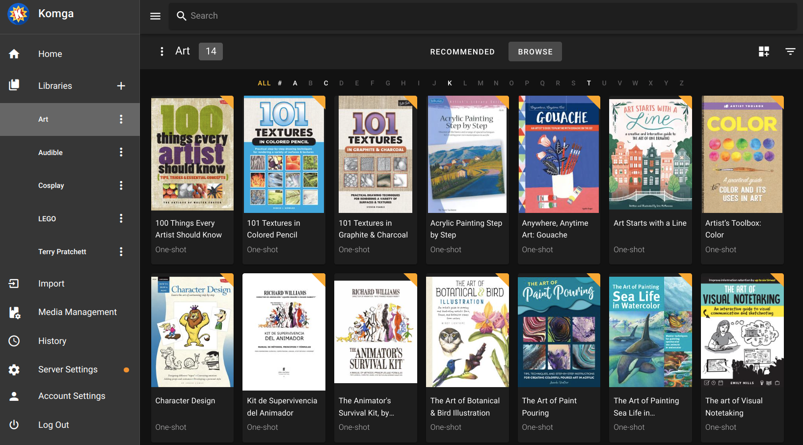
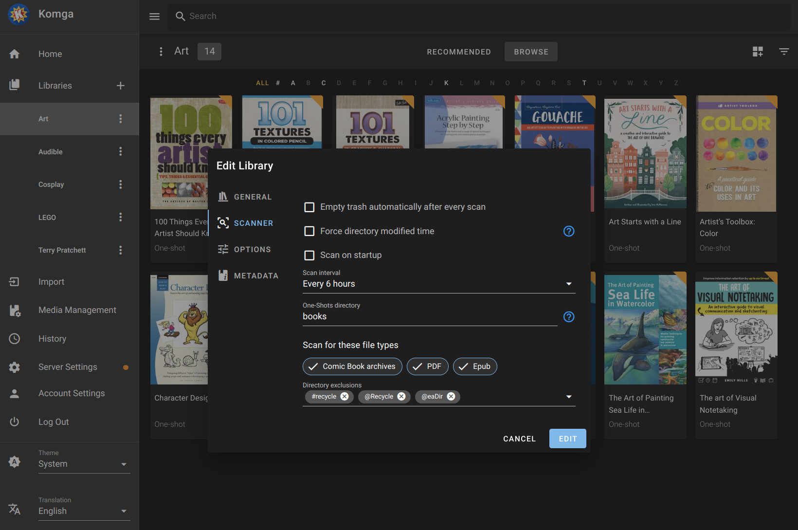
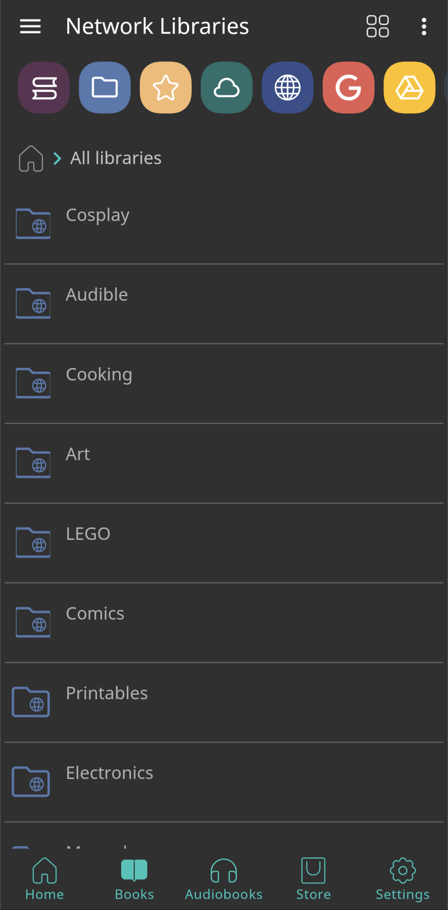

After weeks of using
[Audiobookshelf](2024-02-28-audiobookshelf-on-kubernetes.md)
to listen to audiobooks daily, it dawned on me that the PDF reader
was probably not the best I could be using.

Then is also dawned on me that Audible is not my only source of
eBooks; I have a few from HumbleBundle deals and a few indipendent
authors who sell PDF files directly, as well as a small collection
of appliance manuals and electronics datasheets. All these files
have been scattered all over the place, never having a common home
where they could all be conveniently navigated and read.

Until now. Enter... [Komga](https://komga.org/).

<!-- more -->



Komga is described as *a media server for your comics, mangas,
BDs, magazines and eBooks*. Most importantly, for me, is that it
handles individual books, file names and metadata better than a
few others.

## Installation

To deploy Komga in Kubernetes, the setup is essentially a fork of
[Audiobookshelf](2024-02-28-audiobookshelf-on-kubernetes.md)
deployment.

A single phisical volume to store the application's databases is
needed, while the books are read from `/home/depot/books/`:

``` console
# mkdir /home/k8s/komga/config
# chown -R audiobookshelf.audiobookshelf /home/k8s/komga/
```

Once the directories and files a ready, we run Komga as the same
non-privileged user as Audiobookshelf, based on
[Komga's `docker-compose`](https://komga.org/docs/installation/docker/#docker-compose):

??? k8s "Kubernetes deployment: `komga.yaml`"

    ``` yaml linenums="1" title="komga.yaml"
    apiVersion: v1
    kind: Namespace
    metadata:
      name: komga
    ---
    apiVersion: v1
    kind: PersistentVolume
    metadata:
      name: komga-pv-config
      namespace: komga
    spec:
      storageClassName: manual
      capacity:
        storage: 1Gi
      accessModes:
        - ReadWriteOnce
      persistentVolumeReclaimPolicy: Retain
      hostPath:
        path: /home/k8s/komga/config
    ---
    apiVersion: v1
    kind: PersistentVolume
    metadata:
      name: komga-pv-books
      namespace: komga
    spec:
      storageClassName: manual
      capacity:
        storage: 1Gi
      accessModes:
        - ReadWriteOnce
      persistentVolumeReclaimPolicy: Retain
      hostPath:
        path: /home/depot/books
    ---
    apiVersion: v1
    kind: PersistentVolumeClaim
    metadata:
      name: komga-pvc-config
      namespace: komga
    spec:
      storageClassName: manual
      volumeName: komga-pv-config
      accessModes:
        - ReadWriteOnce
      volumeMode: Filesystem
      resources:
        requests:
          storage: 1Gi
    ---
    apiVersion: v1
    kind: PersistentVolumeClaim
    metadata:
      name: komga-pvc-books
      namespace: komga
    spec:
      storageClassName: manual
      volumeName: komga-pv-books
      accessModes:
        - ReadWriteOnce
      volumeMode: Filesystem
      resources:
        requests:
          storage: 1Gi
    ---
    apiVersion: apps/v1
    kind: Deployment
    metadata:
      labels:
        app: komga
      name: komga
      namespace: komga
    spec:
      replicas: 1
      revisionHistoryLimit: 0
      selector:
        matchLabels:
          app: komga
      strategy:
        rollingUpdate:
          maxSurge: 0
          maxUnavailable: 1
        type: RollingUpdate
      template:
        metadata:
          labels:
            app: komga
        spec:
          containers:
            - image: gotson/komga
              imagePullPolicy: Always
              name: komga
              args: ["user", "1006:1006"]
              env:
              - name: TZ
                value: "Europe/Madrid"
              ports:
              - containerPort: 25600
              resources: {}
              stdin: true
              tty: true
              volumeMounts:
              - mountPath: /config
                name: komga-config
              - mountPath: /data
                name: komga-books
              securityContext:
                allowPrivilegeEscalation: false
                runAsUser: 1006
                runAsGroup: 1006
          restartPolicy: Always
          volumes:
          - name: komga-config
            persistentVolumeClaim:
              claimName: komga-pvc-config
          - name: komga-books
            persistentVolumeClaim:
              claimName: komga-pvc-books
    ---
    kind: Service
    apiVersion: v1
    metadata:
      name: komga-svc
      namespace: komga
    spec:
      type: NodePort
      ports:
      - port: 25600
        nodePort: 30600
        targetPort: 25600
      selector:
        app: komga
    ---
    apiVersion: networking.k8s.io/v1
    kind: Ingress
    metadata:
      name: komga-ingress
      namespace: komga
      annotations:
        acme.cert-manager.io/http01-edit-in-place: "true"
        cert-manager.io/issue-temporary-certificate: "true"
        cert-manager.io/cluster-issuer: letsencrypt-prod
        nginx.ingress.kubernetes.io/websocket-services: komga-svc
    spec:
      ingressClassName: nginx
      rules:
        - host: komga.ssl.uu.am
          http:
            paths:
              - path: /
                pathType: Prefix
                backend:
                  service:
                    name: komga-svc
                    port:
                      number: 25600
      tls:
        - secretName: tls-secret
          hosts:
            - komga.ssl.uu.am
    ```

``` console
$ kubectl apply -f komga.yaml
namespace/komga created
persistentvolume/komga-pv-config created
persistentvolume/komga-pv-books created
persistentvolumeclaim/komga-pvc-config created
persistentvolumeclaim/komga-pvc-books created
deployment.apps/komga created
service/komga-svc created
ingress.networking.k8s.io/komga-ingress created

$ kubectl -n komga get all
NAME                         READY   STATUS    RESTARTS   AGE
pod/komga-5c865d6587-tvlt2   1/1     Running   0          28s

NAME                TYPE       CLUSTER-IP       EXTERNAL-IP   PORT(S)           AGE
service/komga-svc   NodePort   10.103.226.126   <none>        25600:30600/TCP   8s

NAME                    READY   UP-TO-DATE   AVAILABLE   AGE
deployment.apps/komga   1/1     1            1           29s

NAME                               DESIRED   CURRENT   READY   AGE
replicaset.apps/komga-5c865d6587   1         1         1       28s
```

## Configuration

Once the application is running for the first time, register an
account (which will be the administrator) and start creating
libraries based on the files available under `/data`.

When creating libraries in Komga, an important step if there are
individual books, is to put then under one (or more) directories
that will be recognized as
[One-Shots](https://komga.org/docs/guides/oneshots).

My libray is rather small and exclusively made ouf of *one-shots*,
although I found it useful to store a few files as a *kind of*
series:

- *Art* and *LEGO*: eBooks from HumbleBundle deals.
- *Audible*: *visual aids* (PDF files) from Audible.
- *Cosplay*: books from 
  [Kamui Cosplay](https://www.kamuicosplay.com/product-category/tutorialbooks/) and
  [Punished Props](https://www.punishedprops.com/product-category/ref-mats/)
  - Including a couple of sets of templates, which make sense to
    store as *kind of* small series.
- *Terry Pratchett*: a small collection of
  [Discworld Fanfics](https://www.reddit.com/r/discworld/s/UcM6AvRDXK),
  mirrored at home just for convenience.

These are organized under the `/data` volume as follows:

``` console
/data/Art/books/
/data/Audible/books/
/data/Cosplay/books/
/data/Cosplay/templates/Jade Rabbit/
/data/Cosplay/templates/Ripper Axe/
/data/LEGO/books/
/data/Terry.Pratchett/books/
```

All individual books are stored under a `books` subdirectory under
each library directory, and then this name is set as the
**One-Shots directory** for every library:



## eReaders

While Komga comes with a good web-based eBook reader, this is only good when used on a
laptop or desktop PC with a big enough screen. To read books on a tablet or phone, this
web UI is hard to use because once it is zoomed in enough to make the text readable
turning pages is akward, confusing and sometimes frustrating. A much better experience
is often available through several eReaders devices or applications.

!!! warning

    If access to the Komga web UI is gated behind an access control layer, such as
    [Cloudflare Tunnels](./2025-03-23-remote-access-options-for-self-hosted-services.md#cloudflare-tunnels)
    or 
    [Pomerium](./2025-12-18-replacing-ingress-nginx-with-pomerium.md#access-control-for-users), additional configuration will be necessary to allow
    **unauthenticated** access to [Komga API endpoints](./2025-12-18-replacing-ingress-nginx-with-pomerium.md#komga)
    (relying only on Komga's own authentication).

### Kobo

[Kobo eReaders](https://www.kobo.com/us/en/ereaders)
may well be the best, open-source friendly eReaders out there. They can be easily tweaked
to [sync with a Komga server](https://komga.org/docs/guides/kobo/) instead of the
official Kobo servers, and Komga has the ability to proxy syncing on to the official
Kobo servers, so the reader has access to both a private collection on a Komga server
and books *and audiobooks* purchased from Kobo.

As anticipated in the *Troubleshooting* section of the Komga guide for Kobo sync,
[Sync fails with `Invalid character found in the request target`](https://komga.org/docs/guides/kobo/#sync-fails-with-invalid-character-found-in-the-request-target),
which is resolved by adding an environment variable in the above deployment:

``` yaml linenums="88" title="komga.yaml" hl_lines="10-11"
    spec:
      containers:
        - image: gotson/komga
          imagePullPolicy: Always
          name: komga
          args: ["user", "1006:1006"]
          env:
          - name: TZ
            value: "Europe/Madrid"
          - name: SERVER_TOMCAT_RELAXEDQUERYCHARS
            value: "[,]"
```

### Komic for iOS

[Komic](https://apps.apple.com/us/app/komic-comic-manga-reader/id6744676973)
seems to be the best, free to use (and not limited behind paywall or subscription)
eReader iOS app for iPad. Although slightly hidden, it hes the option to filter books
by library:


### eReaders for Android

There are only a few eReader Android apps that are *actually easy* to install on a
non-rooted Android phone, through the Google Play store, without side-loading an APK,
*and actually work*. Of those few, there is *maybe one* that is not too annoying to use.

All of them require first that the Komga catalog is available as an OPDS feed.

#### Enable OPDS catalog

[Komga works with OPDS eReaders](https://komga.org/docs/guides/opds/),
whether they use OPDS v1 or v2, but getting Komga to produce a well-formed OPDS catalog
requires a few adjustments to the aboove deployment to make it use the correct URL in
the ODPS feed by adding two environment variables:

1.  `KOMGA_SERVER_BASE_URL` set to the external URL Komga is reachable at.

1.  `SERVER_FORWARD_HEADERS_STRATEGY` set to `FRAMEWORK` to make Komga trust the headers
    coming from the reverse proxy gating access to it.

``` yaml linenums="88" title="komga.yaml" hl_lines="10-13"
    spec:
      containers:
        - image: gotson/komga
          imagePullPolicy: Always
          name: komga
          args: ["user", "1006:1006"]
          env:
          - name: TZ
            value: "Europe/Madrid"
          - name: KOMGA_SERVER_BASE_URL
            value: "https://komga.ssl.uu.am"
          - name: SERVER_FORWARD_HEADERS_STRATEGY
            value: "FRAMEWORK"
          - name: SERVER_TOMCAT_RELAXEDQUERYCHARS
            value: "[,]"
```

??? note "Why is `SERVER_FORWARD_HEADERS_STRATEGY` necessary."

    Even with the `KOMGA_SERVER_BASE_URL` set to the external URL, Komga's OPDS
    generator uses dynamic link building. When unaware of a reverse proxy gating
    access, Komga sees incoming requests from an internal IP address and uses that
    IP to construct the "absolute" URLs found in the XML feed. Setting
    `SERVER_FORWARD_HEADERS_STRATEGY` to `FRAMEWORK` tells it to "unwrap" the proxy
    headers and treat `komga.ssl.uu.am` as its own identity.

Apply the changes to the deployment and check the variables are set:

``` console hl_lines="12-14"
$ kubectl apply -f komga.yaml 
namespace/komga unchanged
persistentvolume/komga-pv-config unchanged
persistentvolume/komga-pv-books unchanged
persistentvolumeclaim/komga-pvc-config unchanged
persistentvolumeclaim/komga-pvc-books unchanged
deployment.apps/komga configured
service/komga-svc unchanged

$ kubectl describe pod komga -n komga | grep -A3 Environment
    Environment:
      KOMGA_SERVER_BASE_URL:            https://komga.ssl.uu.am
      SERVER_FORWARD_HEADERS_STRATEGY:  FRAMEWORK
      SERVER_TOMCAT_RELAXEDQUERYCHARS:  [,]
```

Reverse proxies gating access to Komga also must be adjusted to set the required headers.

For the original Nginx ingress above, this can be done by adding these annotations:

``` yaml linenums="136" title="komga.yaml" hl_lines="9-15"
metadata:
  name: komga-ingress
  namespace: komga
  annotations:
    acme.cert-manager.io/http01-edit-in-place: "true"
    cert-manager.io/issue-temporary-certificate: "true"
    cert-manager.io/cluster-issuer: letsencrypt-prod
    nginx.ingress.kubernetes.io/websocket-services: komga-svc
    nginx.ingress.kubernetes.io/proxy-set-headers: "true"
    nginx.ingress.kubernetes.io/x-forwarded-prefix: "/"
    # Ensure the Host header is passed correctly
    nginx.ingress.kubernetes.io/configuration-snippet: |
      proxy_set_header Host $host;
      proxy_set_header X-Forwarded-Proto $scheme;
      proxy_set_header X-Forwarded-For $proxy_add_x_forwarded_for;
```

After
[replacing Nginx with Pomerium](./2025-12-18-replacing-ingress-nginx-with-pomerium.md#convert-ngnix-ingress-to-pomerium),
just one annotation is needed to set the required headers in the new Pomerium ingress:

``` yaml title="pomerium-ingress/komga.yaml" linenums="3" hl_lines="7-9"
metadata:
  name: komga-pomerium-ingress
  namespace: komga
  annotations:
    cert-manager.io/cluster-issuer: letsencrypt-prod
    ingress.pomerium.io/pass_identity_headers: true
    ingress.pomerium.io/set_request_headers: |
      X-Forwarded-Proto: "https"
      X-Forwarded-Host: "komga.ssl.uu.am"
spec:
  ingressClassName: pomerium
```

Once all the above changes are applied to Komga and the relevant reverse proxy, the OPDS
catalog should be available at the following URLs:

*   <https://komga.ssl.uu.am/opds/v1.2/catalog>
*   <https://komga.ssl.uu.am/opds/v2/catalog>

Both feeds must be using the externally facing URL rather than an internal IP address:

=== "v1.2 catalog (XML)"

    ``` xml hl_lines="10-13"
    <?xml version="1.0"?>
    <feed xmlns="http://www.w3.org/2005/Atom">
      <id>root</id>
      <title>Komga OPDS catalog</title>
      <updated>2026-01-04T13:55:36.737358992+01:00</updated>
      <author>
        <name>Komga</name>
        <uri>https://github.com/gotson/komga</uri>
      </author>
      <link type="application/atom+xml;profile=opds-catalog;kind=navigation" rel="self" href="https://komga.ssl.uu.am/opds/v1.2/catalog"/>
      <link type="application/atom+xml;profile=opds-catalog;kind=navigation" rel="start" href="https://komga.ssl.uu.am/opds/v1.2/catalog"/>
      <link type="application/opensearchdescription+xml" rel="search" href="https://komga.ssl.uu.am/opds/v1.2/search"/>
      <link type="application/opds+json" rel="alternate" href="https://komga.ssl.uu.am/opds/v2/catalog"/>
      <entry>
        <title>Keep Reading</title>
        ...
    ```

=== "v2 catalog (JSON)"

    ``` json hl_lines="9 14"
    {
      "metadata": {
        "title": "All libraries - Recommended",
        "modified": "2026-01-04T15:44:57.858656045+01:00"
      },
      "links": [
        {
          "rel": "self",
          "href": "https://komga.ssl.uu.am/opds/v2/libraries"
        },
        {
          "title": "Home",
          "rel": "start",
          "href": "https://komga.ssl.uu.am/opds/v2/catalog",
          "type": "application/opds+json"
        },
        ...
    ```

Either of these can be used to add the Komga server as a remote (network) library in
eReader applications, although the v1.2 feed is recommended for maximum compatibility.

#### PocketBook

[PocketBook](https://play.google.com/store/apps/details?id=com.obreey.reader) seems to be
the only Android eReader app that is *acceptable*; easy to install, actually works, and
is not obnoxiously ridden by disgusting ads.

To connect the app to the Komga library:

1.  Tap the Menu icon (**:material-menu:**) in the top-left corner.
1.  Tap on **Network Libraries** and then tap the **`+`** icon usually found inside a
    folder icon (**:material-folder-multiple-plus:**) at the top of the screen.
1.  Enter the Komga librart details:
    *   **URL**: <https://komga.ssl.uu.am/opds/v1.2/catalog>
        (for maximum compatibility).
    *   **Catalog Name**: enter a name (e.g., "My Komga").
1.  When prompted, enter the Komga username and password.

Once the Komga server has been added as a network library, books can be downloaded to
the phone and they will later show up on the initial view when opening the app later.

 **Network libraries** | **Komga libraries** | **Art library** | **Deck**
-----------------------|---------------------|-----------------|----------
                  |                |            | 


#### Discarded

The few other Android eReader apps that are *actually easy* to install on a non-rooted
Android phone, through the Google Play store, without side-loading an APK,
*and actually work*, **fail miserably** in the user experience they chose to offer; they
chose to be **obnoxiously annoying**.

*   **Librera** starts with the most annoying "Manage your data" dialog with a long list
    of "partners" who claim to make "legitimate use" of your data (*yeah, right*), then
    displays adds a big button blended into the ui in a blatant attempt to confuse users
    into tapping on the ad when looking for the option to add a network library, which is
    hidden behind a tiny **`+`** icon on the top right, and then (disgusting) ads are
    displayed **all the time** taking away valuable screen space.
*   **Moon+ Reader** not only hides the UI controls to add a network library a few levels
    deep in the UI, it also makes those books not available anywhere else than in that
    *off-the-main-track* section. Not does this app contain ads, it's also quite horrible
    about it; upon closing a book, it displays multiple, non-skippable, *disgusting*
    ads. Being bombarded with ads from the some of the worst, *beyond borderline*
    **illegal** apps; the only sane way to use this app is to avoid *leaving* a book and
    instead **close** the app entirely each time.

## Alternatives

Komga is not the only Free Software application available for this
purpose, so it is worth mentioning why it was chosen over the
alternatives.

Priot to setting up Komga, I spent some time trying the same with
[kavitareader.com](https://www.kavitareader.com/#downloads-v1-docker).
The Kubernetes deployment was essentially the same, based on
[linuxserver.io/images/docker-kavita](https://docs.linuxserver.io/images/docker-kavita/). The main drawback that kept me from using
this one long-term was that it really is built for *series* and
*really not* for individual books.

Admitedly, that was the only one I tried among other alternatives
[mentioned here](https://www.reddit.com/r/selfhosted/comments/1b4fg8l/book_server/). Others include:

- **Calibre Web**, available as [janeczku/calibre-web](https://github.com/janeczku/calibre-web)
  or
  [linuxserver/calibre-web](https://docs.linuxserver.io/images/docker-calibre-web/).
  It only supports a single library and requires using the
  Calibre desktop application. While this wouldn't be a problem
  for myself, it would prevent kids from reading the books because
  they only have school laptops where Calibre cannot be installed.
- [Librum](https://github.com/Librum-Reader/Librum?tab=readme-ov-file#self-hosting)
  could be a good option, were it not for a similar requirement
  to install and run a client application. This is not a web app.