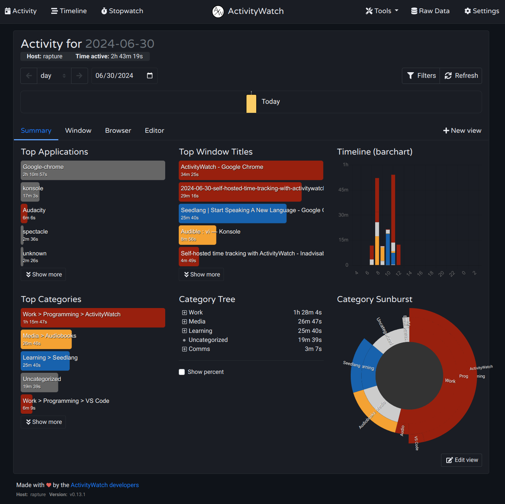

A big chunk of my time is spent **at** the computer, also during
my downtime, and there is no clear separation between study,
chores, entertainment, etc. *Work* happens at other computers,
where time flies by sometimes at ridiculous speeds. I often find
myself wondering *where did my day/week go?*

For some time I've been using a badly-cobbled-together solution
with Bash scripts doing a few basic operations, all the time:

1. Detect when the screen saver is active (AFk).
2. Capture the id and title of the active windown (when not AFK).
3. Store those details in plain-text log files.
4. Aggregate those by window id into CSV files.
5. Import CSV files into a spreadsheet to clean it up.

The results have been barely enough to keep track of where my
weeks go, which has already been a relief; when someone (often me)
asks *"why so little progress on X?"*, I can check the spreadsheet and
answer with numbers: *because this week, out of 40 hours, ...*

At home, however, the results have been very underwhelming. This
is due to completely different behaviour patterns, which is where
I hope [ActivityWatch](https://activitywatch.net/) will help.

<!-- more -->

### Installation

To install [ActivityWatch](https://activitywatch.net/) on Ubuntu
(and other Debian-based systems) one can simply install the `.deb`
package provided as part of ActivityWatch
[releases](https://github.com/ActivityWatch/activitywatch/releases):

``` console
$ wget -S \
    https://github.com/ActivityWatch/activitywatch/releases/download/v0.13.1/activitywatch-v0.13.1-linux-x86_64.deb
$ sudo dpkg -i activitywatch-v0.13.1-linux-x86_64.deb
```

Once installed, make sure `/opt/activitywatch/aw-qt` is run when
logging into the desktop session. For instance, in KDE Plasma, add
ActivityWatch in the **Autostart** section of System Setting:
click **+ Add...** then **Add Application...** then enter the name
(ActivityWatch) and it should be available under Utilities.

While ActivityWatch is running, the web UI is available at
[http://localhost:5600/](http://localhost:5600/).
After about 2 hours of having this running, while 
*going about my business*, I can see it's already capturing my
activities just as messing about with audiobooks and learning
languages:


### Configuration

As noted by ActivityWatch itself, 65% of the time today is
*uncategorized*, and this can be addressed by using the
[Category Builder](https://docs.activitywatch.net/en/latest/features/categorization.html).

At first nothing shows up in the **Categorization Helper**,
because it defauls to the *unknown* hostname. Click on
**Show options** and select the appropriate hostname, then
a list of common words show with their associated times:


New categories can be added here to match these words, but
in this section the UI does not allow creating new *parent*
categories:


Following the link to the **Settings** page one can create a
whole new *branch*, e.g. here a new **Learning** *root*
category is created for all activites related to learning
and studying:


To create additional categories, it is useful to follow the
**Uncategorized** link under **Top Categories** in the
dashboard, to see what makes up most of the *uncategorized*
time. For instance, here it is clear that most of the time
is spent in activities related to Audiobooks:


After a few more tweaks and, of course, finding the **dark**
theme in the Setting, this is finally looking much better:



### Additional Wathers

A number of [Watchers](https://docs.activitywatch.net/en/latest/watchers.html#custom-watchers)
are available for more accurate tracking.
Sadly, none of the following worked out.

#### Steam
 
[aw-watcher-steam](https://github.com/Edwardsoen/aw-watcher-steam)
*attempts to log the timeline of Steam game activity*
by fetching play time from the
[Steam API](https://steamcommunity.com/dev).

Installating is easy enough:

``` console
$ git clone https://github.com/Edwardsoen/aw-watcher-steam.git
$ cd aw-watcher-steam/
$ pip install .
...
Successfully installed aw-client-0.5.13 aw-core-0.5.16 aw-watcher-steam-0.0.1 charset-normalizer-3.3.2 deprecation-2.1.0 iso8601-1.1.0 peewee-3.17.5 persist-queue-0.8.1 platformdirs-3.10.0 requests-2.32.3 rfc3339-validator-0.1.4 strict-rfc3339-0.7 timeslot-0.1.2
```

Or may be note, see
[Issue #4: How to install?](https://github.com/Edwardsoen/aw-watcher-steam/issues/4)
where no conclusive answer has been found. In particular,
[marcinsmialek's comment](https://github.com/Edwardsoen/aw-watcher-steam/issues/4#issuecomment-1975401516)
points out this watcher does not making any easier to group
all games under a parent category (*can't find a way to add
a rule that would match the Steam games in general*). Thus,
this watcher seem to only provide better names for the same
activities.

#### Media Player

[Media Player watcher](https://github.com/2e3s/aw-watcher-media-player)
captures information about media playback. It supports any
player which can report its status to the system and be
controllable by tray or standard multimedia keys.

This is an interesting watcher, just not so much if one is
more interested about traking time "watching movies" or
"listining to X" rather than tracking time spent on each
piece of video or audio.

#### VS Code

It would be good to have better reporting in some areas,
for instance working in VS Code. Sadly,
[aw-watcher-vscode](https://github.com/ActivityWatch/aw-watcher-vscode)
*is not available in code-server for the Web*, and
[ActivityWatchVS](https://github.com/LaggAt/ActivityWatchVS)
is not even found at all.

### Appendix

This is the script that does steps 1-3 above, added here for 
reference because it has a few interesting bits.
Aggregating this data is rather trivial so not really interesting.

``` bash numlines="1"
#!/bin/bash
#
# Poll every second for the name of the active window.

LDIR="${HOME}/activitylogs"
TSTM="$(date +'%Y-%m-%d-%H-%M-%S')"
LOGF="${LDIR}/${TSTM}.txt"

mkdir -p "${LDIR}"
while true; do
  # Skip if screen is locked (KDE Plasma)
  if qdbus org.freedesktop.ScreenSaver /ScreenSaver org.freedesktop.ScreenSaver.GetActive 2>/dev/null |
    grep -q true; then
    continue
  fi
  # Take a screenshot, but only if the screen is not locked.
  if dbus-send --session --dest=org.freedesktop.ScreenSaver --type=method_call --print-reply /org/freedesktop/ScreenSaver org.freedesktop.ScreenSaver.GetActive 2>/dev/null |
    grep -q 'boolean false'; then
    continue
  fi
  # Skip if screen is locked (XFCE)
  if dbus-send --session --dest=org.xfce.ScreenSaver --type=method_call --print-reply /org/xfce/ScreenSaver org.xfce.ScreenSaver.GetActive 2>/dev/null |
    grep -q true; then
    continue
  fi
  wid=$(xdotool getwindowfocus -f)
  if [[ -z "${wid}" ]]; then
    continue
  fi
  wname=$(xdotool getwindowname "${wid}")
  echo "${wid} ${wname}" >>"${LOGF}"
  sleep 1
done
```