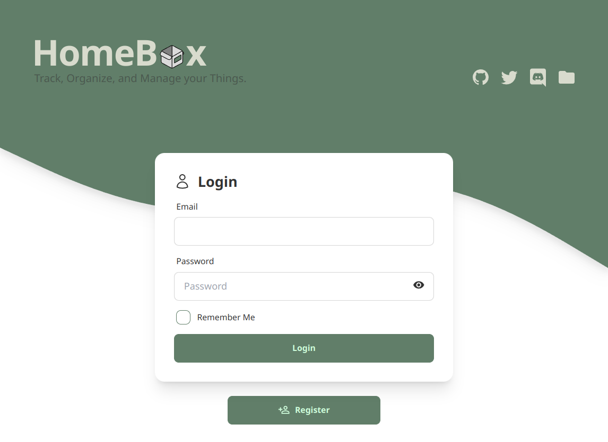

[Homebox](https://homebox.sysadminsmedia.com/en/)
*is the inventory and organization system built for the Home User*
which sounds *exactly* like what I want, to keep track of 
*where things go*.

<!-- more -->

## Installation

**Note:** the original project from 
[hay-kot](https://github.com/hay-kot)
[was archived last month](https://github.com/hay-kot/homebox/issues/919),
so this post is based on the currently active fork at
[github.com/sysadminsmedia/homebox](https://github.com/sysadminsmedia/homebox).

To deploy Homebox in Kubernetes, the setup is *yet another* fork of the
[Audiobookshelf](2024-02-28-audiobookshelf-on-kubernetes.md) deployment.
A single phisical volume to store the application's databases is
needed, while the books are read from `/home/depot/books/`:

``` console
# mkdir /home/k8s/homebox
# chown -R 65532:65532 /home/k8s/homebox/
```

This simple setup is based on
[Homebox's Docker-Dompose](https://homebox.sysadminsmedia.com/en/quick-start#docker-compose)
documentation:

??? k8s "Kubernetes deployment: `homebox.yaml`"

    ``` yaml linenums="1" title="homebox.yaml"
    apiVersion: v1
    kind: Namespace
    metadata:
      name: homebox
    ---
    apiVersion: v1
    kind: PersistentVolume
    metadata:
      name: homebox-pv-data
      namespace: homebox
    spec:
      storageClassName: manual
      capacity:
        storage: 1Gi
      accessModes:
        - ReadWriteOnce
      persistentVolumeReclaimPolicy: Retain
      hostPath:
        path: /home/k8s/homebox
    ---
    apiVersion: v1
    kind: PersistentVolumeClaim
    metadata:
      name: homebox-pvc-data
      namespace: homebox
    spec:
      storageClassName: manual
      volumeName: homebox-pv-data
      accessModes:
        - ReadWriteOnce
      volumeMode: Filesystem
      resources:
        requests:
          storage: 1Gi
    ---
    apiVersion: apps/v1
    kind: Deployment
    metadata:
      labels:
        app: homebox
      name: homebox
      namespace: homebox
    spec:
      replicas: 1
      revisionHistoryLimit: 0
      selector:
        matchLabels:
          app: homebox
      strategy:
        rollingUpdate:
          maxSurge: 0
          maxUnavailable: 1
        type: RollingUpdate
      template:
        metadata:
          labels:
            app: homebox
        spec:
          containers:
            - image: ghcr.io/sysadminsmedia/homebox:latest-rootless
              imagePullPolicy: Always
              name: homebox
              env:
              - name: TZ
                value: "Europe/Madrid"
              ports:
              - containerPort: 7745
              resources: {}
              stdin: true
              tty: true
              volumeMounts:
              - mountPath: /data
                name: homebox-data
              securityContext:
                allowPrivilegeEscalation: false
                runAsUser: 65532
                runAsGroup: 65532
          restartPolicy: Always
          volumes:
          - name: homebox-data
            persistentVolumeClaim:
              claimName: homebox-pvc-data
    ---
    kind: Service
    apiVersion: v1
    metadata:
      name: homebox-svc
      namespace: homebox
    spec:
      type: NodePort
      ports:
      - port: 7745
        nodePort: 30745
        targetPort: 7745
      selector:
        app: homebox
    ---
    apiVersion: networking.k8s.io/v1
    kind: Ingress
    metadata:
      name: homebox-ingress
      namespace: homebox
      annotations:
        acme.cert-manager.io/http01-edit-in-place: "true"
        cert-manager.io/issue-temporary-certificate: "true"
        cert-manager.io/cluster-issuer: letsencrypt-prod
        nginx.ingress.kubernetes.io/websocket-services: homebox-svc
    spec:
      ingressClassName: nginx
      rules:
        - host: homebox.ssl.uu.am
          http:
            paths:
              - path: /
                pathType: Prefix
                backend:
                  service:
                    name: homebox-svc
                    port:
                      number: 7745
      tls:
        - secretName: tls-secret
          hosts:
            - homebox.ssl.uu.am
    ```

``` console
$ kubectl apply -f homebox.yaml
namespace/homebox created
persistentvolume/homebox-pv-data created
persistentvolumeclaim/homebox-pvc-data created
deployment.apps/homebox created
service/homebox-svc created
ingress.networking.k8s.io/homebox-ingress created

$ kubectl -n homebox get all
NAME                            READY   STATUS    RESTARTS   AGE
pod/cm-acme-http-solver-jk4cr   1/1     Running   0          31s
pod/homebox-7fb9d44d48-wxj6q    1/1     Running   0          29m

NAME                                TYPE       CLUSTER-IP      EXTERNAL-IP   PORT(S)          AGE
service/cm-acme-http-solver-2xqr8   NodePort   10.102.88.72    <none>        8089:32649/TCP   31s
service/homebox-svc                 NodePort   10.96.235.150   <none>        7745:30745/TCP   91m

NAME                      READY   UP-TO-DATE   AVAILABLE   AGE
deployment.apps/homebox   1/1     1            1           91m

NAME                                 DESIRED   CURRENT   READY   AGE
replicaset.apps/homebox-7fb9d44d48   1         1         1       29m
```

## Configuration

Homebox is available on 
[lexicon:30745](http://lexicon:30745) locally, and at
[https://homebox.ssl.uu.am](https://homebox.ssl.uu.am)
remotely. The initial login screen allows self-registering an
account and beyon that there is not much more to explain.


