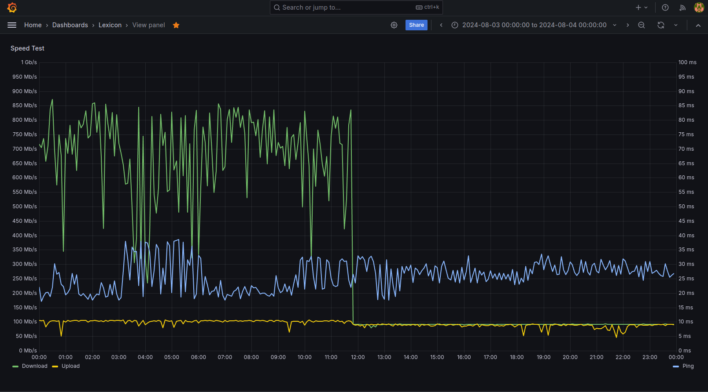
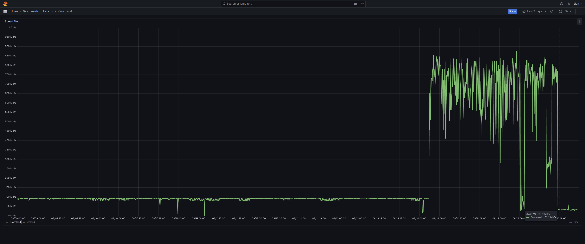
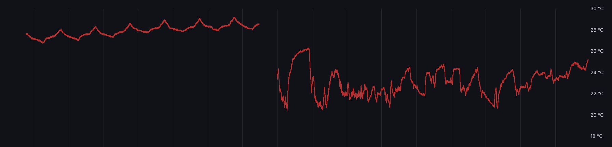
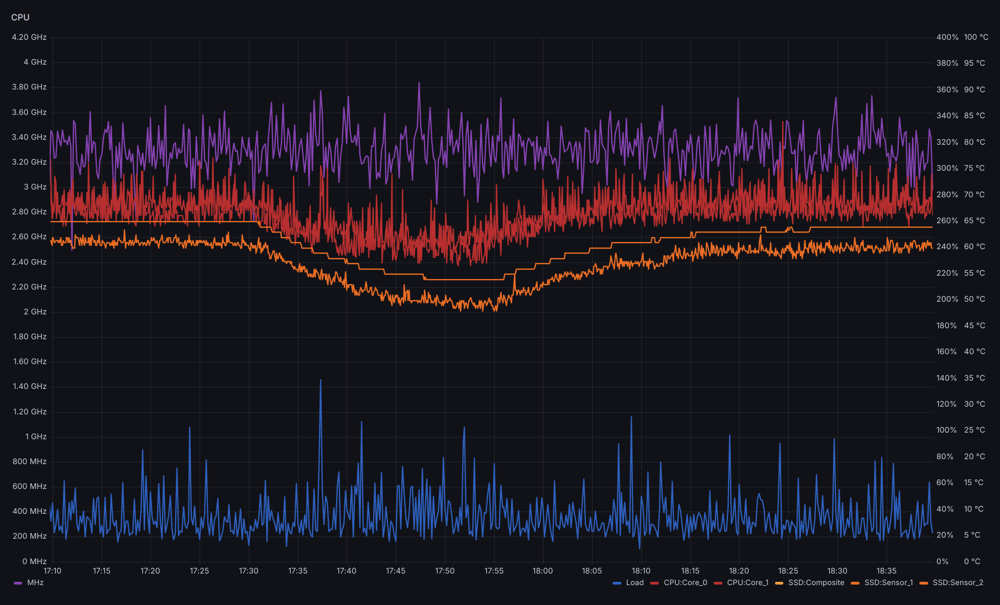
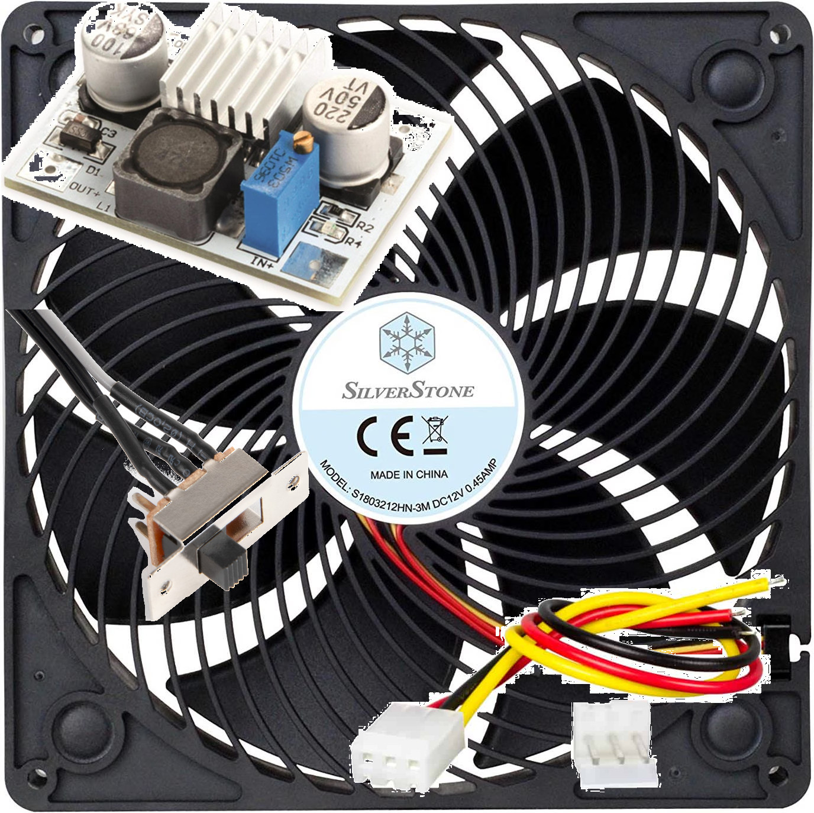

One day, completely out of nowhere, both download and upload
speeds dropped to about 12 M**b**/s *flat*, suggesting the speed
was being throttled very much intentionally:

<!-- more -->

It turned out the broadband router, despite being designed to be
standing vertically on a flat surface, was suffering from dust
clogging its vertical airflow. This was eventually bad enough that
its fan was running at full speed constantly, at which point the
noise was unmistakable. After cleaning the air intake at the
bottom, which had barely a single milimeter to let air flow in,
the router was able to cool down and download speeds were restored
*sharply*:

The restricted airflow had also compounded with abnormaly high
room temperature. This was promptly addressed and the air around
the router and lexicon went down several (Celcius) degrees, but
still room temperature retains a tendency to slowly climp up:

To alleviate the issue on the router and lexicon, a
[Silverstone Air Penetrator AP181](https://www.silverstonetek.com/en/product/info/fans/AP181/),
180 mm. fan, combined with a 
[LM2577 DC-DC Voltage Step-Up (boost) module](https://whadda.com/product/lm2577-dc-dc-voltage-step-up-boost-module-wpm402/)
to power it from a regular USB port (lexicon). The fan speed can
be adjusted in 3 steps, at its maximum speed it lowers lexicon CPU
temperatures by about 10ºC:

