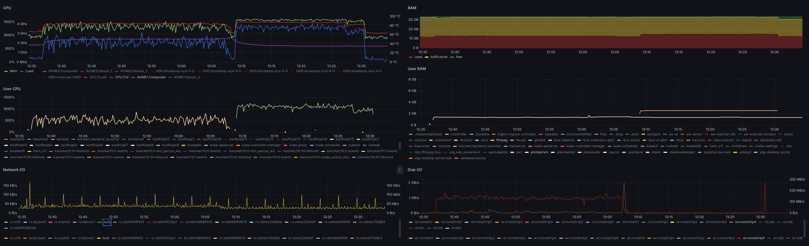
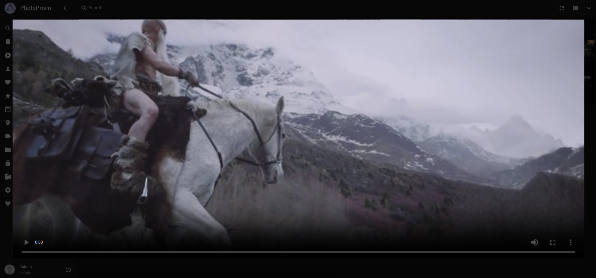

[PhotoPrism®](https://www.photoprism.app/) is *an AI-Powered Photos App
for the Decentralized Web* I heard some good comments about.I tried it [on my *other* Kubernetes cluster](2024-05-12-single-node-kubernetes-cluster-on-ubuntu-studio-desktop-rapture.md)
and here are impressions so far.

<!-- more -->

The following deployment is based on the PhotoPrism®
[Setup Using Docker Compose](https://docs.photoprism.app/getting-started/docker-compose/):

```yaml
apiVersion: v1
kind: Namespace
metadata:
  name: photoprism
---
apiVersion: v1
kind: Secret
metadata:
  name: photoprism-secrets
  namespace: photoprism
stringData:
  PHOTOPRISM_ADMIN_PASSWORD: "************"
  PHOTOPRISM_DATABASE_DRIVER: "sqlite"
  PHOTOPRISM_DATABASE_DSN: /photoprism/storage/db.sqlite
---
apiVersion: v1
kind: PersistentVolume
metadata:
  name: photoprism-pv-originals
  namespace: photoprism
spec:
  storageClassName: manual
  capacity:
    storage: 1Gi
  accessModes:
    - ReadWriteOnce
  persistentVolumeReclaimPolicy: Retain
  hostPath:
    path: /home/k8s/photoprism/originals
---
apiVersion: v1
kind: PersistentVolume
metadata:
  name: photoprism-pv-import
  namespace: photoprism
spec:
  storageClassName: manual
  capacity:
    storage: 1Gi
  accessModes:
    - ReadWriteOnce
  persistentVolumeReclaimPolicy: Retain
  hostPath:
    path: /home/k8s/photoprism/import
---
apiVersion: v1
kind: PersistentVolume
metadata:
  name: photoprism-pv-storage
  namespace: photoprism
spec:
  storageClassName: manual
  capacity:
    storage: 1Gi
  accessModes:
    - ReadWriteOnce
  persistentVolumeReclaimPolicy: Retain
  hostPath:
    path: /home/k8s/photoprism/storage
---
apiVersion: v1
kind: PersistentVolumeClaim
metadata:
  name: photoprism-pvc-originals
  namespace: photoprism
spec:
  storageClassName: manual
  volumeName: photoprism-pv-originals
  accessModes:
    - ReadWriteOnce
  volumeMode: Filesystem
  resources:
    requests:
      storage: 1Gi
---
apiVersion: v1
kind: PersistentVolumeClaim
metadata:
  name: photoprism-pvc-import
  namespace: photoprism
spec:
  storageClassName: manual
  volumeName: photoprism-pv-import
  accessModes:
    - ReadWriteOnce
  volumeMode: Filesystem
  resources:
    requests:
      storage: 1Gi
---
apiVersion: v1
kind: PersistentVolumeClaim
metadata:
  name: photoprism-pvc-storage
  namespace: photoprism
spec:
  storageClassName: manual
  volumeName: photoprism-pv-storage
  accessModes:
    - ReadWriteOnce
  volumeMode: Filesystem
  resources:
    requests:
      storage: 1Gi
---
apiVersion: apps/v1
kind: StatefulSet
metadata:
  name: photoprism
  namespace: photoprism
spec:
  selector:
    matchLabels:
      app: photoprism
  serviceName: photoprism
  replicas: 1
  template:
    metadata:
      labels:
        app: photoprism
    spec:
      containers:
      - name: photoprism
        image: photoprism/photoprism:latest
        env:
        - name: PHOTOPRISM_DEBUG
          value: "true"
        - name: PHOTOPRISM_DATABASE_DRIVER
          value: sqlite
        - name: PHOTOPRISM_HTTP_HOST
          value: 0.0.0.0
        - name: PHOTOPRISM_HTTP_PORT
          value: "2342"
        - name: PHOTOPRISM_GID
          value: "1000"
        - name: PHOTOPRISM_UID
          value: "1000"
        - name: PHOTOPRISM_ORIGINALS_LIMIT
          value: "20000"
        # Load database DSN & admin password from secret
        envFrom:
        - secretRef:
            name: photoprism-secrets
            optional: false
        ports:
        - containerPort: 2342
          name: http
        volumeMounts:
        - mountPath: /photoprism/originals
          name: photoprism-originals
        - mountPath: /photoprism/import
          name: photoprism-import
        - mountPath: /photoprism/storage
          name: photoprism-storage
        readinessProbe:
          httpGet:
            path: /api/v1/status
            port: http
        securityContext:
          allowPrivilegeEscalation: false
          runAsUser: 1000
          runAsGroup: 1000
      volumes:
      - name: photoprism-originals
        persistentVolumeClaim:
          claimName: photoprism-pvc-originals
      - name: photoprism-import
        persistentVolumeClaim:
          claimName: photoprism-pvc-import
      - name: photoprism-storage
        persistentVolumeClaim:
          claimName: photoprism-pvc-storage
---
apiVersion: v1
kind: Service
metadata:
  name: photoprism
  namespace: photoprism
spec:
  ports:
  - name: http
    port: 80
    protocol: TCP
    targetPort: http
  selector:
    app: photoprism
  type: LoadBalancer
```

In addition to the deployment, I create a `.ppignore` file at the top
level directory of the photo collection, to leave out (for now) some
of the largest parts of my photo collection, to save time on indexing,
as well as several directories of no interest:

```
$ cat /photoprism/originals/.ppignore
# Temporarily ignore the biggest directories.
People/Family
People/Weddings
Videos/Hobbies
Videos/Locations
Videos/People
# Permanently ignore a directories of no interest.
data
Krita
MyTracks
New
photos
old-photos-scripts
Rejects
scripts
Selections
Takeout
watermark
# Permanently ignore all raw/ folders.
raw
[raw]*
# Permanently ignore non-JPEG images.
*.xcf
*.gif
*.nef
*.pp3
*.raf
*.raf.xmp
```

After starting the deployment with the usual
`kubectl apply -f photoprism.yaml`
the service is ready to use at:

```
$ kubectl -n photoprism get all
NAME               READY   STATUS    RESTARTS        AGE
pod/photoprism-0   1/1     Running   9 (4h14m ago)   12m

NAME                 TYPE           CLUSTER-IP       EXTERNAL-IP     PORT(S)        AGE
service/photoprism   LoadBalancer   10.108.135.112   192.168.0.220   80:31202/TCP   103m

NAME                          READY   AGE
statefulset.apps/photoprism   1/1     103m
```

To make my life a little easier, I add an entry to `/etc/hosts`
so that I can directly visit http://photoprism.rapture.uu.am

```
# Kubernetes MetalLB
192.168.0.220   photoprism.rapture.uu.am
```

But before using the web application, PhotoPrism® needs some time to
scan and index the images. In this case, it was a good half hour:



The second CPU-intensive task was a rather lengthy preprocessing of a
movie. I tried to watch it simply because I was surprised to find that
a few videos were indexed, but then was even more surprised how long it
took to even start playing. PhotoPrism® spent a good 20 minutes running
`ffmpeg`; in particular this command:

```
/usr/bin/ffmpeg \
  -i /photoprism/originals/Videos/Fan.Films/Troll.Bridge.2018/Troll.Bridge.2018.avi \
  -c:v libx264 \
  -map 0:v:0 \
  -map 0:a:0? \
  -c:a aac \
  -vf scale='if(gte(iw,ih), min(4096, iw), -2):if(gte(iw,ih), -2, min(4096, ih))',format=yuv420p \
  -max_muxing_queue_size 1024 \
  -crf 23 \
  -r 30 \
  -b:v 50M \
  -f mp4 \
  -movflags +faststart \
  -y /photoprism/storage/sidecar/Videos/Fan.Films/Troll.Bridge.2018/Troll.Bridge.2018.avi.avc
```

*Eventually* this lead to a 1.5G *sidecar* `.avc` file, for a video
that was originally 5.9G. That was taking up nearly 10% of the 17G
under `/photoprism/storage` and all the while all I cold see was



But the most surprising, and eventually frustrating of all, was that
only a small portion of the overall photo library appears to have been
indexed.

The library, that is the set of images *not ignored* by `.ppignore`,
is made of 14,762 65,276 JPEG files in 2,599 directories (not including a
large number of RAW files and a few stray videos).

The final scan was very incomplete, finding only 436 folders, 35 videos and 14,178 photos. Even after disabling the
[Quality filter](https://docs.photoprism.app/user-guide/organize/review/) only 14,762 images are found.

Going through the checklist in
[Missing Pictures](https://docs.photoprism.app/getting-started/troubleshooting/#missing-pictures)
the only relevant step seems to be checking `.ppignore`, nothing else
seems to apply here and nothing at all explains why 
**only 22.6% of images are found**.

Even disabling **all** the options to
[Stack](https://docs.photoprism.app/user-guide/settings/library/#stacks) photos, *and then* forcing a full reindex.

Additional (*significant*) issues:

1. Images cannot be found by their file name; *despite* the file name
   being stored in the EXIF `DocumentName` tag ([`0x010d`](https://exiftool.org/TagNames/EXIF.html)).
1. *Stacks* includes 351 images (stacks) *despite* all my attempts at
   disabling that feature, purging and reindexing.
1. Images missing EXIF `DateTimeOriginal` (`0x9003`) get a *Taken on*
   date of January 1st in the current year.
1. Only 2 out of 1,854 images geotagged in Australia are recognized.
1. *None* of the 25 folder under `/photoprism/originals/Travel/Australia` show up under *Folders*.
1. All the folders show under *Library > Originals* but there is no
   easy to even re-index a single folder.

Other (not so minor) issues:

1. All 3 layouts use square thumbnails.
1. Some images *without* GPS tags are somehow *geolocated* in Canada.

Other (really minor) issues:

1. *Monochrome* includes a few images with quite a bit of color.
1. *Panoramas* are essentially any images with an aspect ratio
   beyond some threshold (e.g. 21:9), including small screenshots
   and cropped photos.
1. *Scans* includes just one photo, even though there are hundreds of
   scanned film photos.
