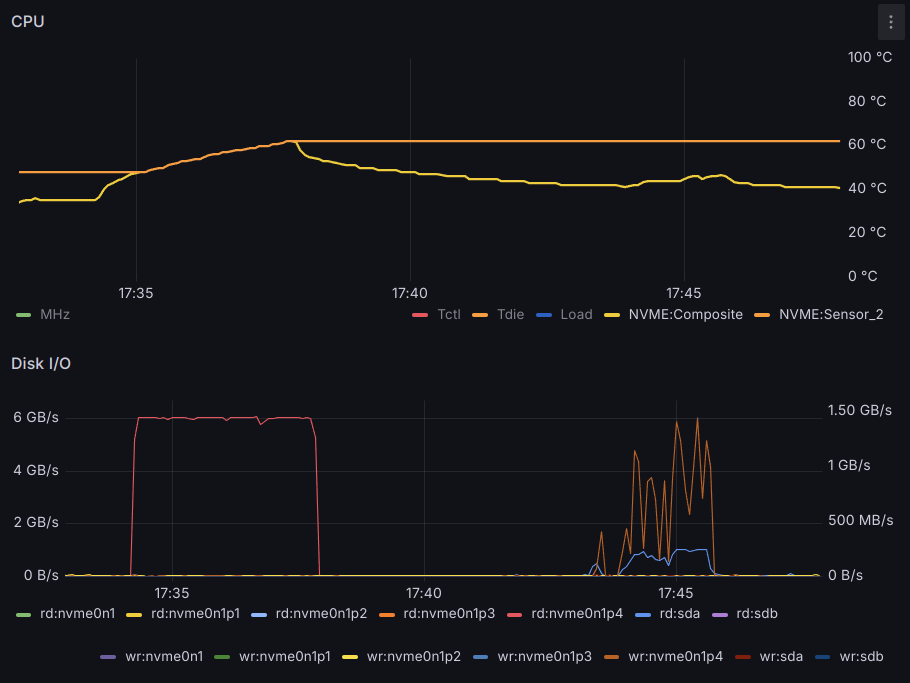
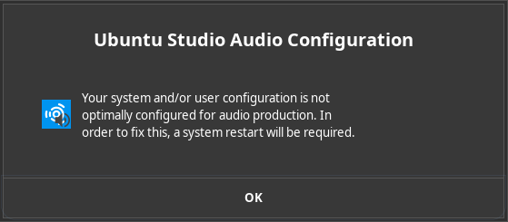
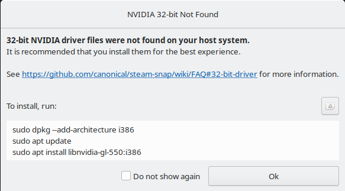

It has been nearly two years since installing 
[Ubuntu Studio 22.04 on Computer, for a young artist](2022-11-12-ubuntu-studio-22-04-on-computer-for-a-young-artist.md)
and so it is time to upgrade it to the next LTS version:
[**Ubuntu Studio**](https://ubuntustudio.org/) **24.04**.

<!-- more -->

## Prepare new 4TB M.2 SSD

This time around the installation will go on a new 4TB NVMe SSD to
provide plenty of storage capacity and speed for the latest and
future creating inclinations.

Before installing Ubuntu Studio 24.04 the disk is installed in the
M.2 slot and prepared from the running Ubuntu Studio 22.04 system.

A new GPT partition table is created, including

1. A 260 MB EFI partition, with the ESP (boot) flag set.
1. Two 64 GB partitions for the root filesystem, of the upcoming
   Ubuntu Studio 24.04 system and the future Ubuntu Studio 26.04.
1. A large partition taking up most of the disk, for user storage.

``` console
# parted -a optimal /dev/nvme0n1 
(parted) mktable gpt
(parted) mkpart EFI 0% 260M
(parted) mkpart root1 260M 65796M
(parted) mkpart root2 65796M 131332M
(parted) mkpart home 131332M 100%
(parted) set 1 esp on
(parted) print
Model: KINGSTON SFYRDK4000G (nvme)
Disk /dev/nvme0n1: 4001GB
Sector size (logical/physical): 512B/512B
Partition Table: gpt
Disk Flags: 

Number  Start   End     Size    File system  Name   Flags
 1      1049kB  260MB   259MB                EFI    boot, esp
 2      260MB   65.8GB  65.5GB               root1
 3      65.8GB  131GB   65.5GB               root2
 4      131GB   4001GB  3869GB               home

(parted) quit
```

## Install Ubuntu Studio 24.04

Prepared the USB stick with `usb-creator-kde` and booted into
it, then used the “Install Ubuntu” launcher on the desktop.

1.  Plug the USB stick and turn the PC on.
1.  Press **`F8`** to select the boot device and choose the
    **UEFI: ...** option.
1.  In the Grub menu, choose to **Try or Install Ubuntu**.
1.  Select language (English) and then **Install Ubuntu**.
1.  Select keyboard layout (can be from a different language).
1.  Select the appropriate wired or wireless network.
1.  Select **Install Ubuntu Studio**.
1.  Select Type of install: **Interactive Installation**.
1.  Enable the options to **Install third-party software for graphics**
    and Wifi hardware and **Download and install support for **
    **additional media formats**.
1.  Select **Manual Installation**
    *   Use the arrow keys to navigate down to the **nvme0n1** disk.
    *   Set **nvme0n1p1** (259 MB) as **EFI System Partition** mounted
        on `/boot/efi`
    *   Set **nvme0n1p2** (66 GB) as **ext4** mounted on `/`
    *   Leave **nvme0n1p3** (66 GB) alone (to be used for Ubuntu 26.04)
    *   Set **nvme0n1p4** (3.87 TB) as **Leave formatted as Btrfs**
        mounted on `/home`
    *   Set **Device for boot loader installation** to **nvme0n1**
1.  Click on **Next** to confirm the partition selection.
1.  Confirm first non-root user name (`ponder`) and computer
    name (`computer`).
1.  Select time zone (seems to be detected correctly).
1.  Review the choices and click on **Install** to start copying files.
1.  Once it's done, select **Restart**
    (remove install media and hit `Enter`).

### Wayland is Dead?

The very first thing I tried, out of curiousity, was to log in using
**Plasma (Wayland)**. The screen went black shortly after the Plasma
splash screen and, shortly after that, the computer rebooted. This
doesn't look like it's ready to use just yet.

### Multiple IPs on LAN

Connecting to the local wired network provides a dynamic IP address
that may change over time, but it is more convenient to have fixed
IP addresses. Moreover, the DHCP range is shared with the wireless
network, we want to have an additional wired-only LAN and set *both*
IP addresses on the same NIC.

To this effect, edit `/etc/netplan/01-network-manager-all.yaml` with
with the following contenct and apply the changes with `netplan apply`:

``` yaml linenums="1" title="/etc/netplan/01-network-manager-all.yaml"
network:
  version: 2
  renderer: networkd
  ethernets:
    enp8s0:
      dhcp4: no
      dhcp6: no
      # Ser IP address & subnet mask
      addresses: [ 10.0.0.3/24, 192.168.0.3/24 ]
      # Set default gateway
      routes:
       - to: default
         via: 192.168.0.1
      nameservers:
        # Set DNS name servers
        addresses: [62.2.24.158, 62.2.17.61]
```

``` console
# netplan apply 
# ip a
1: lo: <LOOPBACK,UP,LOWER_UP> mtu 65536 qdisc noqueue state UNKNOWN group default qlen 1000
    link/loopback 00:00:00:00:00:00 brd 00:00:00:00:00:00
    inet 127.0.0.1/8 scope host lo
       valid_lft forever preferred_lft forever
    inet6 ::1/128 scope host noprefixroute 
       valid_lft forever preferred_lft forever
2: enp8s0: <BROADCAST,MULTICAST,UP,LOWER_UP> mtu 1500 qdisc mq state UP group default qlen 1000
    link/ether 60:45:cb:a0:16:7b brd ff:ff:ff:ff:ff:ff
    inet 10.0.0.2/24 brd 10.0.0.255 scope global enp8s0
       valid_lft forever preferred_lft forever
    inet 192.168.0.9/24 brd 192.168.0.255 scope global enp8s0
       valid_lft forever preferred_lft forever
    inet 192.168.0.118/24 metric 100 brd 192.168.0.255 scope global secondary dynamic enp8s0
       valid_lft 86398sec preferred_lft 86398sec
```

### SSH Server

Ubuntu Studio doesn't enable the SSH server by default, but we want
this to adjust the system remotely:

``` console
# apt install ssh -y
# sed -i 's/#PermitRootLogin prohibit-password/PermitRootLogin yes/' /etc/ssh/sshd_config
# systemctl enable --now ssh
```

!!! note

    Remember to copy over files under `/root` from previous system/s,
    in case it contains useful scripts (and/or SSH keys worth keeping
    under `.ssh`).

    ``` console
    # mount /dev/sdb1 /mnt/
    # rm /root/.ssh/authorized_keys 
    # rmdir /root/.ssh/ 
    # cp -a /mnt/root/.ssh/ /root/
    ```

### `/etc/hosts`

Having the old system's root partition mounted (see above),
copy over `/etc/hosts` so that connections to local hosts work as
smoothly as in the old system (e.g. for
[Continuous Monitoring](#continuous-monitoring)).

## Install Essential Packages

Before proceeding further, install a few basic APT packages:

``` console
# apt install gdebi-core wget gkrellm vim curl gkrellm-leds \
  gkrellm-xkb gkrellm-cpufreq geeqie playonlinux exfat-fuse \
  clementine id3v2 htop vnstat neofetch tigervnc-viewer sox \
  scummvm wine gamemode python-is-python3 exiv2 rename scrot \
  speedtest-cli xcalib python3-pip netcat-openbsd jstest-gtk \
  etherwake python3-selenium lm-sensors sysstat tor unrar \
  ttf-mscorefonts-installer winetricks icc-profiles ffmpeg \
  iotop-c xdotool redshift-gtk inxi vainfo vdpauinfo mpv \
  tigervnc-tools screen -y
...
The following additional packages will be installed:
  cabextract caca-utils chafa chromium-browser chromium-chromedriver evemu-tools evtest
  exiftran fonts-wine fuseiso gamemode-daemon geeqie-common gir1.2-ayatanaappindicator3-0.1
  icoutils joystick jp2a libasound2-plugins libayatana-appindicator3-1 libayatana-ido3-0.4-0
  libayatana-indicator3-7 libcapi20-3t64 libchafa0t64 libcpufreq0 libdbusmenu-gtk3-4
  libevemu3t64 libgamemode0 libgamemodeauto0 libgnutls-openssl27t64 libgpod-common libgpod4t64
  libinih1 liblastfm5-1 liblua5.3-0 libmikmod3 libmspack0t64 libmygpo-qt5-1 libntlm0 libosmesa6
  libpython3-dev libpython3.12-dev libsdl2-net-2.0-0 libsgutils2-1.46-2 libsixel-bin
  libsonivox3 libutempter0 libwine libxdo3 libxkbregistry0 libz-mingw-w64 python3-dev
  python3-exceptiongroup python3-h11 python3-natsort python3-outcome python3-sniffio
  python3-trio python3-trio-websocket python3-wsproto python3.12-dev redshift scummvm-data
  toilet toilet-fonts tor-geoipdb torsocks tree vim-runtime w3m w3m-img wakeonlan
  webp-pixbuf-loader wine64
Suggested packages:
  gnome-shell-extension-gamemode xpaint libjpeg-progs libterm-readline-gnu-perl
  | libterm-readline-perl-perl libxml-dumper-perl sg3-utils fancontrol read-edid i2c-tools
  libcuda1 winbind python-natsort-doc byobu | screenie | iselect beneath-a-steel-sky drascula
  flight-of-the-amazon-queen lure-of-the-temptress libsox-fmt-all figlet mixmaster
  torbrowser-launcher apparmor-utils nyx obfs4proxy ctags vim-doc vim-scripts vnstati brotli
  cmigemo compface dict dict-wn dictd mailcap w3m-el xsel q4wine wine-binfmt dosbox
  wine64-preloader
Recommended packages:
  libgamemode0:i386 libgamemodeauto0:i386 wine32
The following NEW packages will be installed:
  cabextract caca-utils chafa chromium-browser chromium-chromedriver clementine curl etherwake
  evemu-tools evtest exfat-fuse exiftran exiv2 fonts-wine fuseiso gamemode gamemode-daemon
  gdebi-core geeqie geeqie-common gir1.2-ayatanaappindicator3-0.1 gkrellm gkrellm-cpufreq
  gkrellm-leds gkrellm-xkb htop icc-profiles icoutils id3v2 inxi iotop-c joystick jp2a
  jstest-gtk libasound2-plugins libayatana-appindicator3-1 libayatana-ido3-0.4-0
  libayatana-indicator3-7 libcapi20-3t64 libchafa0t64 libcpufreq0 libdbusmenu-gtk3-4
  libevemu3t64 libgamemode0 libgamemodeauto0 libgnutls-openssl27t64 libgpod-common libgpod4t64
  libinih1 liblastfm5-1 liblua5.3-0 libmikmod3 libmspack0t64 libmygpo-qt5-1 libntlm0 libosmesa6
  libpython3-dev libpython3.12-dev libsdl2-net-2.0-0 libsgutils2-1.46-2 libsixel-bin
  libsonivox3 libutempter0 libwine libxdo3 libxkbregistry0 libz-mingw-w64 lm-sensors mpv
  neofetch playonlinux python-is-python3 python3-dev python3-exceptiongroup python3-h11
  python3-natsort python3-outcome python3-pip python3-selenium python3-sniffio python3-trio
  python3-trio-websocket python3-wsproto python3.12-dev redshift redshift-gtk rename screen
  scrot scummvm scummvm-data sox speedtest-cli tigervnc-tools tigervnc-viewer toilet
  toilet-fonts tor tor-geoipdb torsocks tree ttf-mscorefonts-installer unrar vainfo vdpauinfo
  vim vim-runtime vnstat w3m w3m-img wakeonlan webp-pixbuf-loader wine wine64 winetricks xcalib
  xdotool
0 upgraded, 117 newly installed, 0 to remove and 5 not upgraded.
Need to get 314 MB of archives.
After this operation, 1,131 MB of additional disk space will be used.
```

??? note "A few packages are missing here ..."
    
    A few packages are missing here, compared to those installed with
    [Ubuntu Studio 22.04](2022-11-12-ubuntu-studio-22-04-on-computer-for-a-young-artist.md#apt-packages):

    *   `netcat` is a virtual package now; instead of on its providers
        must be selected explicitly:
        *   `netcat-openbsd` contains the OpenBSD rewrite of netcat,
            including support for IPv6, proxies, and Unix sockets.
        *   `netcat-traditional` is the "classic" netcat, written by
            *Hobbit*. It lacks many features found in netcat-openbsd.
    *   `gkrellm-hdplop` and `gkrellm-x86info` are no longer included.
    *   `ttf-mscorefonts-installer:i386` is not available because the
        `i386` architecture has not been enabled (and is not needed).

There is Warning regarding `/snap/bin` not found in your `$PATH`

``` console
Preparing to unpack .../000-chromium-browser_2%3a1snap1-0ubuntu2_amd64.deb ...
=> Installing the chromium snap
==> Checking connectivity with the snap store
==> Installing the chromium snap
Warning: /snap/bin was not found in your $PATH. If you've not restarted your session since you
         installed snapd, try doing that. Please see https://forum.snapcraft.io/t/9469 for more
         details.
```

### Hardware Sensors

Initially there is only a limited amount of hardware sensors:

``` console
# sensors -A
nvme-pci-0100
Composite:    +30.9°C  (low  = -20.1°C, high = +83.8°C)
                       (crit = +88.8°C)
ERROR: Can't get value of subfeature temp3_min: I/O error
ERROR: Can't get value of subfeature temp3_max: I/O error
Sensor 2:     +47.9°C  (low  =  +0.0°C, high =  +0.0°C)

k10temp-pci-00c3
Tctl:         +44.9°C  
Tdie:         +24.9°C  
```

HDD temperatures are available by loading the drivetemp kernel module:

``` console
# echo drivetemp > /etc/modules-load.d/drivetemp.conf
# modprobe drivetemp
# sensors -A
temp1:        +27.0°C  (low  =  +0.0°C, high = +70.0°C)
                       (crit low =  +0.0°C, crit = +70.0°C)
                       (lowest = +27.0°C, highest = +40.0°C)

nvme-pci-0100
Composite:    +30.9°C  (low  = -20.1°C, high = +83.8°C)
                       (crit = +88.8°C)
ERROR: Can't get value of subfeature temp3_min: I/O error
ERROR: Can't get value of subfeature temp3_max: I/O error
Sensor 2:     +47.9°C  (low  =  +0.0°C, high =  +0.0°C)

drivetemp-scsi-0-0
temp1:        +29.0°C  (low  =  +0.0°C, high = +70.0°C)
                       (crit low =  +0.0°C, crit = +70.0°C)
                       (lowest = +27.0°C, highest = +29.0°C)

k10temp-pci-00c3
Tctl:         +47.5°C  
Tdie:         +27.5°C  

```


### Continuous Monitoring

Install the
[multi-thread version](../../conmon.md/#deploy-to-pcs)
of the `conmon` script as `/usr/local/bin/conmon` and
[run it as a service](../../conmon.md/#install-conmon);
create `/etc/systemd/system/conmon.service` as follows:

``` ini linenums="1" title="/etc/systemd/system/conmon.service"
[Unit]
Description=Continuous Monitoring

[Service]
ExecStart=/usr/local/bin/conmon
Restart=on-failure
StandardOutput=null

[Install]
WantedBy=multi-user.target
```

Then enable and start the services in `systemd`:

``` console
# systemctl enable conmon.service
# systemctl daemon-reload
# systemctl start conmon.service
# systemctl status conmon.service
```

## System Configuration

### Logitech Trackman Marble

To enable 2-axis scrolling with the
[Logitech Trackman Marble](https://www.trackballmouse.org/logitech-trackman-marble/)
create or edit `/usr/share/X11/xorg.conf.d/10-libinput.conf`
like this:

``` conf linenums="1" title="/usr/share/X11/xorg.conf.d/10-libinput.conf"
Section "InputClass"
    Identifier      "Marble Mouse"
    MatchProduct    "Logitech USB Trackball"
    MatchIsPointer  "on"
    MatchDevicePath "/dev/input/event*"
    Driver          "libinput"
    Option          "SendCoreEvents" "true"

    #  Physical buttons come from the mouse as:
    #     Big:   1 3
    #     Small: 8 9
    #
    # This makes right small button (9) into the middle, and puts
    #  scrolling on the left small button (8).
    #
    Option "Buttons"            "9"
    Option "ButtonMapping"      "1 8 3 4 5 6 7 9 2"
    Option "ScrollMethod"       "button"
    Option "ScrollButton"       "8"
    Option "EmulateWheel"       "true"
    Option "EmulateWheelButton" "8"
    Option "YAxisMapping"       "4 5"
    Option "XAxisMapping"       "6 7"
EndSection
```

On a *tangentially* related note, it is also good to
forbid joystick mouse emulation when using certain
joystick-like gaming controllers. To do this, 
create or edit `/usr/share/X11/xorg.conf.d/50-joystick.conf`

``` conf linenums="1" title="/usr/share/X11/xorg.conf.d/50-joystick.conf"
Section "InputClass"
	Identifier "joystick catchall"
	MatchIsJoystick "on"
	MatchDevicePath "/dev/input/event*"
	Driver "joystick"
  Option "StartKeysEnabled" "False"       #Disable mouse
  Option "StartMouseEnabled" "False"      #support
EndSection
```

### Weekly btrfs scrub

To keep BTRFS file systems healthy, it is recommended to
[run a weekly scrub](http://marc.merlins.org/perso/btrfs/post_2014-03-19_Btrfs-Tips_-Btrfs-Scrub-and-Btrfs-Filesystem-Repair.html)
to check everything for consistency. For this, I run
[the script](https://marc.merlins.org/linux/scripts/btrfs-scrub)
from crontab every Saturday morning, early enough that it will
be done by the time anyone wakes up.

``` console
# wget -O /usr/local/bin/btrfs-scrub-all \
  http://marc.merlins.org/linux/scripts/btrfs-scrub

# apt install inn -y

# crontab -l | grep btrfs
# m h  dom mon dow   command
50 5 * * 6 /usr/local/bin/btrfs-scrub-all

# /usr/local/bin/btrfs-scrub-all
<13>Sep 22 17:33:43 root: Quick Metadata and Data Balance of /home (/dev/nvme0n1p4)
Done, had to relocate 0 out of 615 chunks
Done, had to relocate 0 out of 615 chunks
Done, had to relocate 1 out of 615 chunks
<13>Sep 22 17:34:13 root: Starting scrub of /home
btrfs scrub start -Bd /home
Starting scrub on devid 1


Scrub device /dev/nvme0n1p4 (id 1) done
Scrub started:    Sun Sep 22 17:34:13 2024
Status:           finished
Duration:         0:03:40
Total to scrub:   612.16GiB
Rate:             2.78GiB/s
Error summary:    no errors found

real    3m40.034s
user    0m0.002s
sys     1m25.821s
```

The whole process takes less than 10 minutes with a 2TB NVMe SSD:



### Create Users

As is always the case when installing a new system, even though
personal directories are already in `/home` the users need to be
re-created; in the correct order to match the user IDs from the
previous system. These can be checked with `ls -ln`:

``` console
# ls -ln /home
total 0
drwx------ 1 1002 1002 5440 Sep 21 20:03 artist
drwx------ 1 1001 1001 1722 Nov  2  2019 other
drwxr-x--- 1 1000 1000  464 Sep 22 17:43 coder
```

### Make SDDM Look Good

Ubuntu Studio 24.04 uses 
[Simple Desktop Display Manager (SDDM)](https://wiki.archlinux.org/title/SDDM)
([sddm/sddm](https://github.com/sddm/sddm) in GitHub)
which is quite good looking out of the box, but I like to
customize this for each computer.

For most computers my favorite SDDM theme is
[Breeze-Noir-Dark](https://store.kde.org/p/1361460),
which I like to install system-wide:

``` console
# unzip Breeze-Noir-Dark.zip
# mv Breeze-Noir-Dark /usr/share/sddm/themes/
```

!!! warning

    Action icons won’t render if the directory name is
    changed. If needed, change the directory name in the `iconSource`
    fields in `Main.qml` to match final directory name so icons show.

Other than installing this theme, all I really change in it
is the background image, e.g. assuming it's downloaded as
`/tmp/background.jpg`

``` console
# mv /tmp/background.jpg /usr/share/sddm/themes/breeze-noir-dark
# mv /tmp/ponyo.jpg /usr/share/sddm/themes/breeze-noir-dark
# cd /usr/share/sddm/themes/breeze-noir-dark
# vi theme.conf
background=/usr/share/sddm/themes/breeze-noir-dark/background.jpg
# vi theme.conf.user
background=background.jpg
```

**Additionally**, as this is new in Ubuntu 24.04, the theme has to
be selected by adding a `[Theme]` section in the system config
in `/usr/lib/sddm/sddm.conf.d/ubuntustudio.conf`

``` ini linenums="1" title="/usr/lib/sddm/sddm.conf.d/ubuntustudio.conf"
[General]
InputMethod=

[Theme]
Current="Breeze-Noir-Dark"
EnableAvatars=True
```

This did not set the theme, even though it did [Make SDDM Listen to TCP](#make-sddm-listen-to-tcp).

[Reportedly](https://superuser.com/questions/1720931/how-to-configure-sddm-in-kubuntu-22-04-where-is-config-file),
you have to **create** the `/etc/sddm.conf.d` directory to add
the *Local configuration* file that allows setting the theme:

``` console
# mkdir /etc/sddm.conf.d
# vi /etc/sddm.conf.d/ubuntustudio.conf
```

Besides setting the theme, it is also good to limit the range of
user ids so that only human users show up:

``` ini linenums="1" title="/etc/sddm.conf.d/ubuntustudio.conf"
[Theme]
Current=Breeze-Noir-Dark

[Users]
MaximumUid=1004
MinimumUid=1000
```

#### Make SDDM Listen to TCP

By default, SDDM launches X.org with `-nolisten tcp` for
security reasons. To override this, set the flag under the
`[X11]` section in `/usr/lib/sddm/sddm.conf.d/ubuntustudio.conf`

``` ini linenums="1" title="/usr/lib/sddm/sddm.conf.d/ubuntustudio.conf"
[General]
InputMethod=

[Theme]
Current="Breeze-Noir-Dark"
EnableAvatars=True

[X11]
ServerArguments=-listen tcp
```

Then add a short script to authorize connections from `localhost` to the user (`artist`) **session**, e.g. as
`~/bin/xhost-localhost`

``` bash
#!/bin/bash
xhost +localhost
```

This allows an SSH session for the user (`artist`) to send messages to the screen with `zenity`:

``` bash
DISPLAY=localhost:0 /usr/bin/zenity --warning \
  --text='Computer Will Shut Down in 20 Minutes'
```

### Ubuntu Studio Audio Configuration

Rather than something one has to setup, this seems to be something
that *just happens*: the first time logging in with a new user
(`artist`) a pop-up message from the
**Ubuntu Studio Audio Configuration** shows up and only offers
an **OK** button. Upon clicking this button, the system reboots.
After logging in again, audio seems to work just fine.



### APT respositories clean-up

``` console
# apt update
Hit:1 http://ch.archive.ubuntu.com/ubuntu noble InRelease
Get:2 http://ch.archive.ubuntu.com/ubuntu noble-updates InRelease [126 kB]                      
Hit:3 http://archive.ubuntu.com/ubuntu noble InRelease                                          
Get:4 http://archive.ubuntu.com/ubuntu noble-updates InRelease [126 kB]                         
Get:5 https://dl.google.com/linux/chrome/deb stable InRelease [1,825 B]                         
Hit:6 http://ch.archive.ubuntu.com/ubuntu noble-backports InRelease                             
Get:7 http://security.ubuntu.com/ubuntu noble-security InRelease [126 kB]
Get:8 https://dl.google.com/linux/chrome/deb stable/main amd64 Packages [1,083 B]
Get:9 http://ch.archive.ubuntu.com/ubuntu noble-updates/main amd64 Packages [530 kB]
Get:10 http://ch.archive.ubuntu.com/ubuntu noble-updates/main Translation-en [128 kB]
Get:11 http://ch.archive.ubuntu.com/ubuntu noble-updates/main amd64 c-n-f Metadata [8,548 B]
Get:12 http://ch.archive.ubuntu.com/ubuntu noble-updates/restricted amd64 Packages [353 kB]
Get:13 http://archive.ubuntu.com/ubuntu noble-updates/universe amd64 Packages [373 kB]
Get:14 http://ch.archive.ubuntu.com/ubuntu noble-updates/restricted Translation-en [68.1 kB]
Get:15 http://ch.archive.ubuntu.com/ubuntu noble-updates/universe amd64 Packages [373 kB]       
Get:16 http://ch.archive.ubuntu.com/ubuntu noble-updates/universe Translation-en [153 kB]       
Get:17 http://ch.archive.ubuntu.com/ubuntu noble-updates/universe amd64 c-n-f Metadata [14.6 kB]
Get:18 http://archive.ubuntu.com/ubuntu noble-updates/universe Translation-en [153 kB]          
Get:19 http://archive.ubuntu.com/ubuntu noble-updates/universe amd64 c-n-f Metadata [14.6 kB] 
Get:20 http://security.ubuntu.com/ubuntu noble-security/universe amd64 Packages [269 kB]       
Get:21 http://security.ubuntu.com/ubuntu noble-security/universe Translation-en [113 kB]
Get:22 http://security.ubuntu.com/ubuntu noble-security/universe amd64 c-n-f Metadata [10.1 kB]
Get:23 http://security.ubuntu.com/ubuntu noble-security/main amd64 Packages [377 kB]
Get:24 http://security.ubuntu.com/ubuntu noble-security/main Translation-en [81.4 kB]
Get:25 http://security.ubuntu.com/ubuntu noble-security/main amd64 c-n-f Metadata [4,516 B]
Get:26 http://security.ubuntu.com/ubuntu noble-security/restricted amd64 Packages [353 kB]
Get:27 http://security.ubuntu.com/ubuntu noble-security/restricted Translation-en [68.1 kB]
Fetched 3,827 kB in 1s (2,664 kB/s)                                
Reading package lists... Done
Building dependency tree... Done
Reading state information... Done
27 packages can be upgraded. Run 'apt list --upgradable' to see them.
W: Target Packages (universe/binary-amd64/Packages) is configured multiple times in /etc/apt/sources.list.d/dvd.list:3 and /etc/apt/sources.list.d/ubuntu.sources:2
W: Target Packages (universe/binary-all/Packages) is configured multiple times in /etc/apt/sources.list.d/dvd.list:3 and /etc/apt/sources.list.d/ubuntu.sources:2
W: Target Translations (universe/i18n/Translation-en_US) is configured multiple times in /etc/apt/sources.list.d/dvd.list:3 and /etc/apt/sources.list.d/ubuntu.sources:2
W: Target Translations (universe/i18n/Translation-en) is configured multiple times in /etc/apt/sources.list.d/dvd.list:3 and /etc/apt/sources.list.d/ubuntu.sources:2
W: Target DEP-11 (universe/dep11/Components-amd64.yml) is configured multiple times in /etc/apt/sources.list.d/dvd.list:3 and /etc/apt/sources.list.d/ubuntu.sources:2
W: Target DEP-11 (universe/dep11/Components-all.yml) is configured multiple times in /etc/apt/sources.list.d/dvd.list:3 and /etc/apt/sources.list.d/ubuntu.sources:2
W: Target DEP-11-icons-small (universe/dep11/icons-48x48.tar) is configured multiple times in /etc/apt/sources.list.d/dvd.list:3 and /etc/apt/sources.list.d/ubuntu.sources:2
W: Target DEP-11-icons (universe/dep11/icons-64x64.tar) is configured multiple times in /etc/apt/sources.list.d/dvd.list:3 and /etc/apt/sources.list.d/ubuntu.sources:2
W: Target DEP-11-icons-hidpi (universe/dep11/icons-64x64@2.tar) is configured multiple times in /etc/apt/sources.list.d/dvd.list:3 and /etc/apt/sources.list.d/ubuntu.sources:2
W: Target DEP-11-icons-large (universe/dep11/icons-128x128.tar) is configured multiple times in /etc/apt/sources.list.d/dvd.list:3 and /etc/apt/sources.list.d/ubuntu.sources:2
W: Target CNF (universe/cnf/Commands-amd64) is configured multiple times in /etc/apt/sources.list.d/dvd.list:3 and /etc/apt/sources.list.d/ubuntu.sources:2
W: Target CNF (universe/cnf/Commands-all) is configured multiple times in /etc/apt/sources.list.d/dvd.list:3 and /etc/apt/sources.list.d/ubuntu.sources:2
W: Target Packages (multiverse/binary-amd64/Packages) is configured multiple times in /etc/apt/sources.list.d/dvd.list:3 and /etc/apt/sources.list.d/ubuntu.sources:2
W: Target Packages (multiverse/binary-all/Packages) is configured multiple times in /etc/apt/sources.list.d/dvd.list:3 and /etc/apt/sources.list.d/ubuntu.sources:2
W: Target Translations (multiverse/i18n/Translation-en_US) is configured multiple times in /etc/apt/sources.list.d/dvd.list:3 and /etc/apt/sources.list.d/ubuntu.sources:2
W: Target Translations (multiverse/i18n/Translation-en) is configured multiple times in /etc/apt/sources.list.d/dvd.list:3 and /etc/apt/sources.list.d/ubuntu.sources:2
W: Target DEP-11 (multiverse/dep11/Components-amd64.yml) is configured multiple times in /etc/apt/sources.list.d/dvd.list:3 and /etc/apt/sources.list.d/ubuntu.sources:2
W: Target DEP-11 (multiverse/dep11/Components-all.yml) is configured multiple times in /etc/apt/sources.list.d/dvd.list:3 and /etc/apt/sources.list.d/ubuntu.sources:2
W: Target DEP-11-icons-small (multiverse/dep11/icons-48x48.tar) is configured multiple times in /etc/apt/sources.list.d/dvd.list:3 and /etc/apt/sources.list.d/ubuntu.sources:2
W: Target DEP-11-icons (multiverse/dep11/icons-64x64.tar) is configured multiple times in /etc/apt/sources.list.d/dvd.list:3 and /etc/apt/sources.list.d/ubuntu.sources:2
W: Target DEP-11-icons-hidpi (multiverse/dep11/icons-64x64@2.tar) is configured multiple times in /etc/apt/sources.list.d/dvd.list:3 and /etc/apt/sources.list.d/ubuntu.sources:2
W: Target DEP-11-icons-large (multiverse/dep11/icons-128x128.tar) is configured multiple times in /etc/apt/sources.list.d/dvd.list:3 and /etc/apt/sources.list.d/ubuntu.sources:2
W: Target CNF (multiverse/cnf/Commands-amd64) is configured multiple times in /etc/apt/sources.list.d/dvd.list:3 and /etc/apt/sources.list.d/ubuntu.sources:2
W: Target CNF (multiverse/cnf/Commands-all) is configured multiple times in /etc/apt/sources.list.d/dvd.list:3 and /etc/apt/sources.list.d/ubuntu.sources:2
W: Target Packages (universe/binary-amd64/Packages) is configured multiple times in /etc/apt/sources.list.d/dvd.list:3 and /etc/apt/sources.list.d/ubuntu.sources:2
W: Target Packages (universe/binary-all/Packages) is configured multiple times in /etc/apt/sources.list.d/dvd.list:3 and /etc/apt/sources.list.d/ubuntu.sources:2
W: Target Translations (universe/i18n/Translation-en_US) is configured multiple times in /etc/apt/sources.list.d/dvd.list:3 and /etc/apt/sources.list.d/ubuntu.sources:2
W: Target Translations (universe/i18n/Translation-en) is configured multiple times in /etc/apt/sources.list.d/dvd.list:3 and /etc/apt/sources.list.d/ubuntu.sources:2
W: Target DEP-11 (universe/dep11/Components-amd64.yml) is configured multiple times in /etc/apt/sources.list.d/dvd.list:3 and /etc/apt/sources.list.d/ubuntu.sources:2
W: Target DEP-11 (universe/dep11/Components-all.yml) is configured multiple times in /etc/apt/sources.list.d/dvd.list:3 and /etc/apt/sources.list.d/ubuntu.sources:2
W: Target DEP-11-icons-small (universe/dep11/icons-48x48.tar) is configured multiple times in /etc/apt/sources.list.d/dvd.list:3 and /etc/apt/sources.list.d/ubuntu.sources:2
W: Target DEP-11-icons (universe/dep11/icons-64x64.tar) is configured multiple times in /etc/apt/sources.list.d/dvd.list:3 and /etc/apt/sources.list.d/ubuntu.sources:2
W: Target DEP-11-icons-hidpi (universe/dep11/icons-64x64@2.tar) is configured multiple times in /etc/apt/sources.list.d/dvd.list:3 and /etc/apt/sources.list.d/ubuntu.sources:2
W: Target DEP-11-icons-large (universe/dep11/icons-128x128.tar) is configured multiple times in /etc/apt/sources.list.d/dvd.list:3 and /etc/apt/sources.list.d/ubuntu.sources:2
W: Target CNF (universe/cnf/Commands-amd64) is configured multiple times in /etc/apt/sources.list.d/dvd.list:3 and /etc/apt/sources.list.d/ubuntu.sources:2
W: Target CNF (universe/cnf/Commands-all) is configured multiple times in /etc/apt/sources.list.d/dvd.list:3 and /etc/apt/sources.list.d/ubuntu.sources:2
W: Target Packages (multiverse/binary-amd64/Packages) is configured multiple times in /etc/apt/sources.list.d/dvd.list:3 and /etc/apt/sources.list.d/ubuntu.sources:2
W: Target Packages (multiverse/binary-all/Packages) is configured multiple times in /etc/apt/sources.list.d/dvd.list:3 and /etc/apt/sources.list.d/ubuntu.sources:2
W: Target Translations (multiverse/i18n/Translation-en_US) is configured multiple times in /etc/apt/sources.list.d/dvd.list:3 and /etc/apt/sources.list.d/ubuntu.sources:2
W: Target Translations (multiverse/i18n/Translation-en) is configured multiple times in /etc/apt/sources.list.d/dvd.list:3 and /etc/apt/sources.list.d/ubuntu.sources:2
W: Target DEP-11 (multiverse/dep11/Components-amd64.yml) is configured multiple times in /etc/apt/sources.list.d/dvd.list:3 and /etc/apt/sources.list.d/ubuntu.sources:2
W: Target DEP-11 (multiverse/dep11/Components-all.yml) is configured multiple times in /etc/apt/sources.list.d/dvd.list:3 and /etc/apt/sources.list.d/ubuntu.sources:2
W: Target DEP-11-icons-small (multiverse/dep11/icons-48x48.tar) is configured multiple times in /etc/apt/sources.list.d/dvd.list:3 and /etc/apt/sources.list.d/ubuntu.sources:2
W: Target DEP-11-icons (multiverse/dep11/icons-64x64.tar) is configured multiple times in /etc/apt/sources.list.d/dvd.list:3 and /etc/apt/sources.list.d/ubuntu.sources:2
W: Target DEP-11-icons-hidpi (multiverse/dep11/icons-64x64@2.tar) is configured multiple times in /etc/apt/sources.list.d/dvd.list:3 and /etc/apt/sources.list.d/ubuntu.sources:2
W: Target DEP-11-icons-large (multiverse/dep11/icons-128x128.tar) is configured multiple times in /etc/apt/sources.list.d/dvd.list:3 and /etc/apt/sources.list.d/ubuntu.sources:2
W: Target CNF (multiverse/cnf/Commands-amd64) is configured multiple times in /etc/apt/sources.list.d/dvd.list:3 and /etc/apt/sources.list.d/ubuntu.sources:2
W: Target CNF (multiverse/cnf/Commands-all) is configured multiple times in /etc/apt/sources.list.d/dvd.list:3 and /etc/apt/sources.list.d/ubuntu.sources:2
```

This seems to be because the same repository is defined in two
different ways:

``` console
root@computer:~# cat /etc/apt/sources.list.d/dvd.list 
deb http://archive.ubuntu.com/ubuntu/ noble universe multiverse
deb http://archive.ubuntu.com/ubuntu/ noble-updates universe multiverse
deb http://security.ubuntu.com/ubuntu/ noble-security universe multiverse

root@computer:~# cat /etc/apt/sources.list.d/ubuntu.sources
Types: deb
URIs: http://ch.archive.ubuntu.com/ubuntu/
Suites: noble noble-updates noble-backports
Components: main restricted universe multiverse
Signed-By: /usr/share/keyrings/ubuntu-archive-keyring.gpg

Types: deb
URIs: http://security.ubuntu.com/ubuntu/
Suites: noble-security
Components: main restricted universe multiverse
Signed-By: /usr/share/keyrings/ubuntu-archive-keyring.gpg
```

The minimal fix for this was to comment out the last line
in `dvd.list` and let `noble-security` be defined (only) in
`ubuntu.sources`.

### Ubuntu Pro

When updating the system with `apt full-upgrade -y` a notice comes
up about additional security updates:

```
Get more security updates through Ubuntu Pro with 'esm-apps' enabled:
  libdcmtk17t64 libcjson1 libavdevice60 ffmpeg libpostproc57 libavcodec60
  libavutil58 libswscale7 libswresample4 libavformat60 libavfilter9
Learn more about Ubuntu Pro at https://ubuntu.com/pro
```

This being a new system, indeed it's not attached to an Ubuntu Pro
account (the old system was):

``` console
# pro security-status
3208 packages installed:
     1638 packages from Ubuntu Main/Restricted repository
     1569 packages from Ubuntu Universe/Multiverse repository
     1 package from a third party

To get more information about the packages, run
    pro security-status --help
for a list of available options.

This machine is receiving security patching for Ubuntu Main/Restricted
repository until 2029.
This machine is NOT attached to an Ubuntu Pro subscription.

Ubuntu Pro with 'esm-infra' enabled provides security updates for
Main/Restricted packages until 2034.

Ubuntu Pro with 'esm-apps' enabled provides security updates for
Universe/Multiverse packages until 2034. There are 11 pending security updates.

Try Ubuntu Pro with a free personal subscription on up to 5 machines.
Learn more at https://ubuntu.com/pro
```

After creating an Ubuntu account a token is available to use with
`pro attach`:

``` console
# pro attach ...
Enabling Ubuntu Pro: ESM Apps
Ubuntu Pro: ESM Apps enabled
Enabling Ubuntu Pro: ESM Infra
Ubuntu Pro: ESM Infra enabled
Enabling Livepatch
Livepatch enabled
This machine is now attached to 'Ubuntu Pro - free personal subscription'

SERVICE          ENTITLED  STATUS       DESCRIPTION
anbox-cloud      yes       disabled     Scalable Android in the cloud
esm-apps         yes       enabled      Expanded Security Maintenance for Applications
esm-infra        yes       enabled      Expanded Security Maintenance for Infrastructure
landscape        yes       disabled     Management and administration tool for Ubuntu
livepatch        yes       warning      Current kernel is not covered by livepatch
realtime-kernel* yes       disabled     Ubuntu kernel with PREEMPT_RT patches integrated

 * Service has variants

NOTICES
Operation in progress: pro attach
The current kernel (6.8.0-44-lowlatency, x86_64) is not covered by livepatch.
Covered kernels are listed here: https://ubuntu.com/security/livepatch/docs/kernels
Either switch to a covered kernel or `sudo pro disable livepatch` to dismiss this warning.

For a list of all Ubuntu Pro services and variants, run 'pro status --all'
Enable services with: pro enable <service>

     Account: ponder.stibbons@uu.am
Subscription: Ubuntu Pro - free personal subscription

# pro status --all
SERVICE          ENTITLED  STATUS       DESCRIPTION
anbox-cloud      yes       disabled     Scalable Android in the cloud
cc-eal           yes       n/a          Common Criteria EAL2 Provisioning Packages
esm-apps         yes       enabled      Expanded Security Maintenance for Applications
esm-infra        yes       enabled      Expanded Security Maintenance for Infrastructure
fips             yes       n/a          NIST-certified FIPS crypto packages
fips-preview     yes       n/a          Preview of FIPS crypto packages undergoing certification with NIST
fips-updates     yes       n/a          FIPS compliant crypto packages with stable security updates
landscape        yes       disabled     Management and administration tool for Ubuntu
livepatch        yes       warning      Current kernel is not covered by livepatch
realtime-kernel  yes       disabled     Ubuntu kernel with PREEMPT_RT patches integrated
├ generic        yes       disabled     Generic version of the RT kernel (default)
├ intel-iotg     yes       n/a          RT kernel optimized for Intel IOTG platform
└ raspi          yes       n/a          24.04 Real-time kernel optimised for Raspberry Pi
ros              yes       n/a          Security Updates for the Robot Operating System
ros-updates      yes       n/a          All Updates for the Robot Operating System
usg              yes       n/a          Security compliance and audit tools

NOTICES
The current kernel (6.8.0-44-lowlatency, x86_64) is not covered by livepatch.
Covered kernels are listed here: https://ubuntu.com/security/livepatch/docs/kernels
Either switch to a covered kernel or `sudo pro disable livepatch` to dismiss this warning.

Enable services with: pro enable <service>
```

Now the system can be updated *again* with `apt full-upgrade -y`
to receive those additional security updates:

``` console
# apt full-upgrade -y
Reading package lists... Done
Building dependency tree... Done
Reading state information... Done
Calculating upgrade... Done
The following upgrades have been deferred due to phasing:
  python3-distupgrade ubuntu-release-upgrader-core ubuntu-release-upgrader-qt
The following packages will be upgraded:
  ffmpeg libavcodec60 libavdevice60 libavfilter9 libavformat60 libavutil58 libcjson1
  libdcmtk17t64 libpostproc57 libswresample4 libswscale7
11 upgraded, 0 newly installed, 0 to remove and 3 not upgraded.
11 esm-apps security updates
```

### Crontab Bedtime

Everybody has a natural tendency to stay in front of their 
computer, or other entertaining devices, for longer than is
good for them. This can be very detrimental when it impacts
sleep pattners, to avoid this this computer will shut down
on a regular schedule:

``` console
# crontab -l | grep -i 'shut.*down'
# Shut down at 20:30 (Sun-Thu)
30 20 * * 0-4 /sbin/shutdown -h now
35 20 * * 0-4 /sbin/shutdown -h now
40 20 * * 0-4 /sbin/shutdown -h now
45 20 * * 0-4 /sbin/shutdown -h now
50 20 * * 0-4 /sbin/shutdown -h now
55 20 * * 0-4 /sbin/shutdown -h now
*/5 21,22,23 * * 0-4 /sbin/shutdown -h now
# Shut down at 21:30 (Fri-Sat)
30 21 * * 5-6 /sbin/shutdown -h now
35 21 * * 5-6 /sbin/shutdown -h now
40 21 * * 5-6 /sbin/shutdown -h now
45 21 * * 5-6 /sbin/shutdown -h now
50 21 * * 5-6 /sbin/shutdown -h now
55 21 * * 5-6 /sbin/shutdown -h now
0 22 * * 5-6 /sbin/shutdown -h now
*/5 22,23 * * 5-6 /sbin/shutdown -h now
```

To avoid nasty surprises, the `artist` user has their own
`crontab` to notify them how much time they have left:

``` console
$ crontab -l
# m h  dom mon dow   command
* 12 * * 6,7 /home/artist/Desktop/.bin/restore .edu .fun
* 18 * * 1,2,3,4,5 /home/artist/Desktop/.bin/restore .edu .fun
00 20 * * * /home/artist/Desktop/.bin/restore

# Count down to shut down at 20:30 (Sun-Thu) with UI pop-up
00 20 * * 0-4 /home/artist/bin/zenity-warning-shutdown-in-minutes.sh 30
05 20 * * 0-4 /home/artist/bin/zenity-warning-shutdown-in-minutes.sh 25
10 20 * * 0-4 /home/artist/bin/zenity-warning-shutdown-in-minutes.sh 20
15 20 * * 0-4 /home/artist/bin/zenity-warning-shutdown-in-minutes.sh 15
20 20 * * 0-4 /home/artist/bin/zenity-warning-shutdown-in-minutes.sh 10
25 20 * * 0-4 /home/artist/bin/zenity-warning-shutdown-in-minutes.sh 5
27 20 * * 0-4 /home/artist/bin/zenity-warning-shutdown-in-minutes.sh 3
28 20 * * 0-4 /home/artist/bin/zenity-warning-shutdown-in-minutes.sh 2
29 20 * * 0-4 /home/artist/bin/zenity-warning-shutdown-in-minutes.sh 1

# Count down to shut down at 21:00 (interim) with UI pop-up
30 20 * * * /home/artist/bin/zenity-warning-shutdown-in-minutes.sh 30
35 20 * * * /home/artist/bin/zenity-warning-shutdown-in-minutes.sh 25
40 20 * * * /home/artist/bin/zenity-warning-shutdown-in-minutes.sh 20
45 20 * * * /home/artist/bin/zenity-warning-shutdown-in-minutes.sh 15
50 20 * * * /home/artist/bin/zenity-warning-shutdown-in-minutes.sh 10
55 20 * * * /home/artist/bin/zenity-warning-shutdown-in-minutes.sh 5
57 20 * * * /home/artist/bin/zenity-warning-shutdown-in-minutes.sh 3
58 20 * * * /home/artist/bin/zenity-warning-shutdown-in-minutes.sh 2
59 20 * * * /home/artist/bin/zenity-warning-shutdown-in-minutes.sh 1

# Count down to shut down at 22:00 (Fri-Sat) with UI pop-up
00 21 * * 5,6 /home/artist/bin/zenity-warning-shutdown-in-minutes.sh 30
05 21 * * 5,6 /home/artist/bin/zenity-warning-shutdown-in-minutes.sh 25
10 21 * * 5,6 /home/artist/bin/zenity-warning-shutdown-in-minutes.sh 20
15 21 * * 5,6 /home/artist/bin/zenity-warning-shutdown-in-minutes.sh 15
20 21 * * 5,6 /home/artist/bin/zenity-warning-shutdown-in-minutes.sh 10
25 21 * * 5,6 /home/artist/bin/zenity-warning-shutdown-in-minutes.sh 5
27 21 * * 5,6 /home/artist/bin/zenity-warning-shutdown-in-minutes.sh 3
28 21 * * 5,6 /home/artist/bin/zenity-warning-shutdown-in-minutes.sh 2
29 21 * * 5,6 /home/artist/bin/zenity-warning-shutdown-in-minutes.sh 1
```

## Install Additional Software

### Google Chrome

Installing [Google Chrome](https://google.com/chrome) is as
simple as downloading the Debian package and installing it:

``` console
# dpkg -i google-chrome-stable_current_amd64.deb
```

### Steam

Installing Steam from Snap 
[couldn't be simplers](https://unixhint.com/install-steam-on-ubuntu-24-04/):

``` console
# snap install steam
steam 1.0.0.79 from Canonical✓ installed
```

!!! note

    [snapcraft.io/steam](https://snapcraft.io/steam) is provided
    by Canonical.

When runing the Steam client for the first time, a pop-up shows up
advising to install additional 32-bit drivers *for best experience*



``` console
# dpkg --add-architecture i386
# apt update
# sudo apt install libnvidia-gl-550:i386 -y
Reading package lists... Done
Building dependency tree... Done
Reading state information... Done
The following additional packages will be installed:
  gcc-14-base:i386 libbsd0:i386 libc6:i386 libdrm2:i386 libffi8:i386 libgcc-s1:i386
  libidn2-0:i386 libmd0:i386 libnvidia-egl-wayland1:i386 libunistring5:i386
  libwayland-client0:i386 libwayland-server0:i386 libx11-6:i386 libxau6:i386 libxcb1:i386
  libxdmcp6:i386 libxext6:i386
Suggested packages:
  glibc-doc:i386 locales:i386 libnss-nis:i386 libnss-nisplus:i386
The following NEW packages will be installed:
  gcc-14-base:i386 libbsd0:i386 libc6:i386 libdrm2:i386 libffi8:i386 libgcc-s1:i386
  libidn2-0:i386 libmd0:i386 libnvidia-egl-wayland1:i386 libnvidia-gl-550:i386
  libunistring5:i386 libwayland-client0:i386 libwayland-server0:i386 libx11-6:i386 libxau6:i386
  libxcb1:i386 libxdmcp6:i386 libxext6:i386
0 upgraded, 18 newly installed, 0 to remove and 14 not upgraded.
```

#### Non-snap alternative

Installing the Steam client direction from
[store.steampowered.com/about](https://store.steampowered.com/about/)
[is not as simple](https://linuxcapable.com/how-to-install-steam-on-ubuntu-linux/),
it requires first installing several `i386` (32-bit) libraries:

``` console
# apt install libgl1-mesa-glx:i386 libc6:amd64 libc6:i386 \
  libegl1:amd64 libegl1:i386 libgbm1:amd64 libgbm1:i386 \
  libgl1-mesa-dri:amd64 libgl1-mesa-dri:i386 libgl1:amd64 \
  libgl1:i386 steam-libs-amd64:amd64 steam-libs-i386:i386 -y
```

With those installed, one can download `steam_latest.deb` from

and install it with `gdebi`:

``` console
# gdebi steam_latest.deb
```

### Minecraft

To avoid taking chances, copy the Minecraft launcher from the
previous system:

``` console
# mount /dev/sdb1 /mnt/
# cp -a /mnt/opt/minecraft-launcher/ /opt/
```

It works perfectly right after installing; no need to login again.

In contrast,
[at least 2 years ago](2022-11-12-ubuntu-studio-22-04-on-computer-for-a-young-artist.md#minecraft)
the [`Minecraft_staging.deb` launcher](https://launcher.mojang.com/mc-staging/download/Minecraft_staging.deb)
no longer worked, because it only allows trying to log in with
**Mojang accounts**, and those have been deprecated.

Today, the page for
[Alternative Download Options for Minecraft: Java Edition](https://www.minecraft.net/en-us/download/alternative)
still points to the old
[`Minecraft.deb`](https://launcher.mojang.com/download/Minecraft.deb)
(`md5sum: 9ec53b60fba93b1adf05a3246055e7a4`)
and an additional *Other Linux*
[`Minecraft.tar.gz`](https://launcher.mojang.com/download/Minecraft.tar.gz)

Installing the `Minecraft.deb` (freshly downloaded) produces a new
binary with a different MD5 than the old backup:

``` console
root@computer:~/minecraft# md5sum /usr/bin/minecraft-launcher
eb40c31c9c15449770ea6a61f8f794a3  /usr/bin/minecraft-launcher

lexicon:~/computer-backup$ md5sum \
  usr/bin/minecraft-launcher \
5d0a29a858de070384fcbe84540fcdc9  usr/bin/minecraft-launcher
```

Today, the page for
[Alternative Download Options for Minecraft: Java Edition](https://www.minecraft.net/en-us/download/alternative)
also seems to recommend installing via Snap, but the
*minecraft-launcher.snap* links to the AUR (Arc) repo and none of
the actual snaps available are verified (or seem very popular):

- [snapcraft.io/mc-installer](https://snapcraft.io/mc-installer) from [kz6fittycent/mc-installer](https://github.com/kz6fittycent/mc-installer) has only 17 stars.
- [snapcraft.io/launcher-ot-minecraft](https://snapcraft.io/launcher-ot-minecraft) from [petebuffon/launcher-ot-minecraft](https://github.com/petebuffon/launcher-ot-minecraft) has only 2 star.

### Blender

[Blender 4.2 LTS](https://www.blender.org/) is already available
even for Ubuntu 24.04 via 
[snapcraft.io/blender](https://snapcraft.io/blender)
so there is no reason to install it any other way:

``` console
# snap install blender --classic
blender 4.2.1 from Blender Foundation (blenderfoundation✓) installed
```

### Visual Studio Code

The artist wants to learn how to create websites and wants to use
[Visual Studio Code](https://code.visualstudio.com/)
to comfortably edit HTML, CSS, JavaScript, etc.

[Installation](https://code.visualstudio.com/docs/setup/linux) is fairly simple,
so much a single `.deb` file can be installed directly, but the apt repository
can also be installed manually with the following script:

``` console
# apt-get install apt-transport-https gpg wget -y
# wget -qO- https://packages.microsoft.com/keys/microsoft.asc \
  | gpg --dearmor > packages.microsoft.gpg
# install -D -o root -g root -m 644 packages.microsoft.gpg \
  /etc/apt/keyrings/packages.microsoft.gpg
# echo "deb [arch=amd64,arm64,armhf signed-by=/etc/apt/keyrings/packages.microsoft.gpg] https://packages.microsoft.com/repos/code stable main" \
  | tee /etc/apt/sources.list.d/vscode.list > /dev/null
# rm -f packages.microsoft.gpg
# apt update
# apt install code -y
```

### OpenToonz

The artist may want to try using
[OpenToonz](https://opentoonz.github.io/e/) later,
but that may be worth its own post given how involved
[Setting up the development environment for GNU/Linux](https://github.com/opentoonz/opentoonz/blob/master/doc/how_to_build_linux.md)
is.

## User-specific Settings

### RedShift

[Redshift](http://jonls.dk/redshift/)
adjusts the color temperature of your screen according to
your surroundings. This may help your eyes hurt less if you
are working in front of the screen at night.

More importantly,
[blue light can affect your sleep](https://www.health.harvard.edu/staying-healthy/blue-light-has-a-dark-side), because
[exposure to blue light before bedtime can disrupt sleep](https://health.ucdavis.edu/blog/cultivating-health/blue-light-effects-on-your-eyes-sleep-and-health/2022/08)
patterns as it affects when our bodies create melatonin.

This is why `redshift-gtk` was already installed as part of
the [Essential Packages](#install-essential-packages). What is left to do
for a full customization is to adjust the color temperature
values and manual location in `~/.config/redshift.conf`

``` ini linenums="1" title="~/.config/redshift.conf"
[redshift]
temp-day=6000
temp-night=4000
transition=1
brightness-night=0.7
gamma=0.8
gamma-night=0.7
location-provider=manual
adjustment-method=randr

[manual]
lat=48
lon=8

[randr]
screen=0
```

!!! note

    It seems no longer necessary to manually add Redshift to the
    user's desktop session. Previously, it would be necessary to
    launch **Autostart** and **Add Application…** to add Redshift.

## Troubleshooting

### `nvidia-gpu i2c timeout error e0000000`

On December 17, 2024 the 1440p display claims to support only a resolution
of 1024x764; there is no option to change this. Previously, a similar issue
had happened with a very old GPU (Nvidia GT-610) which would be no longer
supported by recent NVidia drivers. 

This PC has an MSI GeForce GTX 1660 SUPER VENTUS XS OC (6GB) which is
[supported in the latest driver version 550.120](https://www.nvidia.com/en-us/drivers/details/232672/). At that time there was a clear message in
`dmesg` but this time there is *nearly* nothing:

``` console
root@computer:~# dmesg | grep -i nvidia
[    6.394310] input: HDA NVidia HDMI/DP,pcm=3 as /devices/pci0000:00/0000:00:03.1/0000:0a:00.1/sound/card0/input8
[    6.394526] input: HDA NVidia HDMI/DP,pcm=7 as /devices/pci0000:00/0000:00:03.1/0000:0a:00.1/sound/card0/input9
[    6.394643] input: HDA NVidia HDMI/DP,pcm=8 as /devices/pci0000:00/0000:00:03.1/0000:0a:00.1/sound/card0/input10
[    6.394733] input: HDA NVidia HDMI/DP,pcm=9 as /devices/pci0000:00/0000:00:03.1/0000:0a:00.1/sound/card0/input11
[    7.382902] nvidia-gpu 0000:0a:00.3: i2c timeout error e0000000
```

The timing of this aligns with a system update to kernel 6.8.0-50:

``` console
root@computer:~# ls -l /boot/
total 204049
-rw-r--r-- 1 root root   287453 Nov  9 21:38 config-6.8.0-49-lowlatency
-rw-r--r-- 1 root root   287407 Nov 21 02:13 config-6.8.0-50-lowlatency
drwxr-xr-x 3 root root      512 Jan  1  1970 efi
drwxr-xr-x 6 root root     4096 Dec 17 12:47 grub
lrwxrwxrwx 1 root root       30 Dec 17 12:46 initrd.img -> initrd.img-6.8.0-50-lowlatency
-rw-r--r-- 1 root root 24212231 Sep 14 22:39 initrd.img-6.8.0-41-lowlatency
-rw-r--r-- 1 root root 67743692 Dec 10 19:38 initrd.img-6.8.0-49-lowlatency
-rw-r--r-- 1 root root 67736037 Dec 17 12:47 initrd.img-6.8.0-50-lowlatency
lrwxrwxrwx 1 root root       30 Dec 17 12:46 initrd.img.old -> initrd.img-6.8.0-49-lowlatency
-rw-r--r-- 1 root root   142796 Apr  8  2024 memtest86+ia32.bin
-rw-r--r-- 1 root root   143872 Apr  8  2024 memtest86+ia32.efi
-rw-r--r-- 1 root root   147744 Apr  8  2024 memtest86+x64.bin
-rw-r--r-- 1 root root   148992 Apr  8  2024 memtest86+x64.efi
-rw------- 1 root root  9064172 Nov  9 21:38 System.map-6.8.0-49-lowlatency
-rw------- 1 root root  9072978 Nov 21 02:13 System.map-6.8.0-50-lowlatency
lrwxrwxrwx 1 root root       27 Dec 17 12:46 vmlinuz -> vmlinuz-6.8.0-50-lowlatency
-rw------- 1 root root 14961032 Nov  9 21:40 vmlinuz-6.8.0-49-lowlatency
-rw------- 1 root root 14969224 Nov 21 02:33 vmlinuz-6.8.0-50-lowlatency
lrwxrwxrwx 1 root root       27 Dec 17 12:46 vmlinuz.old -> vmlinuz-6.8.0-49-lowlatency
```

Scrolling through the entire `dmesg` ouput there is not much to see about
the NVidia driver, only this `i2c` timeout:

``` console
root@computer:~# dmesg 
[    0.000000] Linux version 6.8.0-50-lowlatency (buildd@lcy02-amd64-026) (x86_64-linux-gnu-gcc-13 (Ubuntu 13.3.0-6ubuntu2~24.04) 13.3.0, GNU ld (GNU Binutils for Ubuntu) 2.42) #51.1-Ubuntu SMP PREEMPT_DYNAMIC Thu Nov 21 12:44:17 UTC 2024 (Ubuntu 6.8.0-50.51.1-lowlatency 6.8.12)
[    0.000000] Command line: BOOT_IMAGE=/boot/vmlinuz-6.8.0-50-lowlatency root=UUID=0c531d25-fb2f-4f74-8382-c2160008b355 ro quiet splash threadirqs vt.handoff=7
...
[    7.093902] cfg80211: Loading compiled-in X.509 certificates for regulatory database
[    7.094199] Loaded X.509 cert 'sforshee: 00b28ddf47aef9cea7'
[    7.094419] Loaded X.509 cert 'wens: 61c038651aabdcf94bd0ac7ff06c7248db18c600'
[    7.382902] nvidia-gpu 0000:0a:00.3: i2c timeout error e0000000
[    7.382910] ucsi_ccg 3-0008: i2c_transfer failed -110
[    7.382914] ucsi_ccg 3-0008: ucsi_ccg_init failed - -110
[    7.382919] ucsi_ccg: probe of 3-0008 failed with error -110
[    7.888419] usb 3-2.2: set resolution quirk: cval->res = 384
[    7.888768] usbcore: registered new interface driver snd-usb-audio
```

Web search for recent(ish) thread on this topic, concretely
["nvidia-gpu" "i2c timeout error e0000000" "i2c_transfer failed -110" "ucsi_ccg_init failed"](https://www.google.com/search?q=%22nvidia-gpu%22+%22i2c+timeout+error+e0000000%22+%22i2c_transfer+failed+-110%22+%22ucsi_ccg_init+failed%22&oq=%22nvidia-gpu%22+%22i2c+timeout+error+e0000000%22+%22i2c_transfer+failed+-110%22+%22ucsi_ccg_init+failed%22&gs_lcrp=EgZjaHJvbWUyBggAEEUYOTIHCAEQIRiPAjIHCAIQIRiPAtIBCjM1NzQ0ajBqMTWoAgCwAgA&sourceid=chrome&ie=UTF-8)
yields a few results with a few common themes:

- From `/r/openSUSE` on Sep 29, 2024: [No desktop after updating to kernel 6.11 - snapshot 20240927](https://www.reddit.com/r/openSUSE/comments/1fsasx0/no_desktop_after_updating_to_kernel_611_snapshot/)
  - based on [Issues with kernel 6.11.0-1-default and Nvidia drivers](https://forums.opensuse.org/t/issues-with-kernel-6-11-0-1-default-and-nvidia-drivers/178932/1) on Sep 27, 2024
  - suggests adding kernel parameters:
    - `nvidia_drm.modeset=1 nvidia_drm.fbdev=1`
- From `/r/linuxmint` on May 20, 2023: [My computer no longer works after updating my nvidia drivers to 520 open](https://www.reddit.com/r/linuxmint/comments/13n3lzs/my_computer_no_longer_works_after_updating_my/)
  - `i2c` timeout starts after updating NVidia drivers
  - suggests reverting to previous kernel helps
  - leaves unclear whether drivers were replaced with `nouveau`
- From `/r/Ubuntu` on Aug 10, 2024: [Need help with i2c timeout error - Ubuntu 22.04.4 LTM (Jelly Jamfish) - Dual booted version](https://www.reddit.com/r/Ubuntu/comments/1ep3dgr/need_help_with_i2c_timeout_error_ubuntu_22044_ltm/)
  - suggests blocklisting the `i2c_nvidia_gpu` module
  - other steps include troubleshooting an NVME drive and removing NVidia drivers, to then install *default* drivers with 
  `ubuntu-drivers autoinstall` (unclear what this installed)
  - [Ubuntu not booting - i2c timeout error?](https://askubuntu.com/questions/1522974/ubuntu-not-booting-i2c-timeout-error) thread in
    askubuntu.com yielded no useful answers.
- From `r/archlinux` on Oct 31, 2021: [nvidia-gpu 0000:07:00.3: i2c timeout error e0000000](https://www.reddit.com/r/archlinux/comments/qjteir/nvidiagpu_000007003_i2c_timeout_error_e0000000/)
  - shows this error is nothing new, and points to
  - [[Dual system, Ubuntu 20.04]nvidia-gpu: i2c timeout error; ucsi_ccg: i2c_transfer failed -110, ucsi_ccg_init failed](https://askubuntu.com/questions/1278399/dual-system-ubuntu-20-04nvidia-gpu-i2c-timeout-error-ucsi-ccg-i2c-transfer)
    - which also suggests blocklisting the `i2c_nvidia_gpu` module

So far the most popular workaround seems to be:

``` console
# echo "blacklist i2c_nvidia_gpu" > \
  /etc/modprobe.d/blacklist_i2c-nvidia-gpu.conf
# update-initramfs -u
```

The module is currently loaded, but not in used; it can be unloaded:

``` console
# lsmod | grep -i nv
i2c_nvidia_gpu         12288  0
i2c_ccgx_ucsi          12288  1 i2c_nvidia_gpu
nvme                   61440  3
nvme_core             212992  4 nvme
nvme_auth              28672  1 nvme_core

root@computer:~# modprobe -r i2c_nvidia_gpu
root@computer:~# lsmod | grep -i nv
nvme                   61440  3
nvme_core             212992  4 nvme
nvme_auth              28672  1 nvme_core
```

However, a *more recent* workaround is adding kernel parameters
`nvidia_drm.modeset=1 nvidia_drm.fbdev=1`.

This could be related to a recent change in those parameters, since there is
already something similar under 

``` console
root@computer:~# ls -l /etc/modprobe.d/nvidia-graphics-drivers-kms.conf 
-rw-r--r-- 1 root root 117 Jul 31 16:08 /etc/modprobe.d/nvidia-graphics-drivers-kms.conf

root@computer:~# cat /etc/modprobe.d/nvidia-graphics-drivers-kms.conf 
# This file was generated by nvidia-driver-550
# Set value to 0 to disable modesetting
options nvidia-drm modeset=1
```

There is also a blocklist for `nvidiafb` in 
`/etc/modprobe.d/blacklist-framebuffer.conf`

Before trying any of this, there are a few updates available, including
`linux-firmware`, so first update the system with

??? terminal "`# apt update && apt full-upgrade -y`"

    ``` console
    root@computer:~# apt update && apt full-upgrade -y
    Hit:1 http://ch.archive.ubuntu.com/ubuntu noble InRelease
    Hit:2 http://ch.archive.ubuntu.com/ubuntu noble-updates InRelease
    Hit:3 https://brave-browser-apt-release.s3.brave.com stable InRelease
    Hit:4 http://archive.ubuntu.com/ubuntu noble InRelease
    Hit:5 http://ch.archive.ubuntu.com/ubuntu noble-backports InRelease
    Hit:6 https://dl.google.com/linux/chrome/deb stable InRelease
    Hit:7 http://security.ubuntu.com/ubuntu noble-security InRelease
    Hit:8 https://packages.microsoft.com/repos/code stable InRelease                                                  
    Hit:9 http://archive.ubuntu.com/ubuntu noble-updates InRelease                              
    Hit:10 https://esm.ubuntu.com/apps/ubuntu noble-apps-security InRelease
    Hit:11 https://esm.ubuntu.com/apps/ubuntu noble-apps-updates InRelease
    Hit:12 https://esm.ubuntu.com/infra/ubuntu noble-infra-security InRelease
    Hit:13 https://esm.ubuntu.com/infra/ubuntu noble-infra-updates InRelease
    Reading package lists... Done
    Building dependency tree... Done
    Reading state information... Done
    39 packages can be upgraded. Run 'apt list --upgradable' to see them.
    N: Skipping acquire of configured file 'main/binary-i386/Packages' as repository 'https://brave-browser-apt-release.s3.brave.com stable InRelease' doesn't support architecture 'i386'
    Reading package lists... Done
    Building dependency tree... Done
    Reading state information... Done
    Calculating upgrade... Done
    The following packages were automatically installed and are no longer required:
      libnvidia-cfg1-550 libnvidia-decode-550 libnvidia-egl-wayland1 libnvidia-encode-550
      libnvidia-extra-550 libnvidia-fbc1-550 libnvidia-gl-550 nvidia-compute-utils-550
      nvidia-kernel-source-550 nvidia-prime nvidia-settings nvidia-utils-550
      screen-resolution-extra xserver-xorg-video-nvidia-550
    Use 'apt autoremove' to remove them.
    The following upgrades have been deferred due to phasing:
      cloud-init python3-distupgrade ubuntu-release-upgrader-core ubuntu-release-upgrader-qt
    The following packages will be upgraded:
      apport apport-core-dump-handler apport-kde brave-browser code fwupd
      gir1.2-packagekitglib-1.0 gir1.2-udisks-2.0 google-chrome-stable libegl-mesa0
      libegl1-mesa-dev libfwupd2 libgbm1 libgl1-mesa-dri libglapi-mesa libglx-mesa0 libnm0
      libosmesa6 libpackagekit-glib2-18 libudisks2-0 libxatracker2 linux-firmware linux-libc-dev
      linux-tools-common lp-solve mesa-va-drivers mesa-vdpau-drivers mesa-vulkan-drivers
      network-manager packagekit packagekit-tools python3-apport python3-problem-report thermald
      udisks2
    35 upgraded, 0 newly installed, 0 to remove and 4 not upgraded.
    2 standard LTS security updates
    Need to get 0 B/881 MB of archives.
    After this operation, 6,394 kB of additional disk space will be used.
    Extracting templates from packages: 100%
    Preconfiguring packages ...
    (Reading database ... 469435 files and directories currently installed.)
    Preparing to unpack .../00-python3-problem-report_2.28.1-0ubuntu3.3_all.deb ...
    Unpacking python3-problem-report (2.28.1-0ubuntu3.3) over (2.28.1-0ubuntu3.1) ...
    Preparing to unpack .../01-python3-apport_2.28.1-0ubuntu3.3_all.deb ...
    Unpacking python3-apport (2.28.1-0ubuntu3.3) over (2.28.1-0ubuntu3.1) ...
    Preparing to unpack .../02-apport-core-dump-handler_2.28.1-0ubuntu3.3_all.deb ...
    Unpacking apport-core-dump-handler (2.28.1-0ubuntu3.3) over (2.28.1-0ubuntu3.1) ...
    Preparing to unpack .../03-apport_2.28.1-0ubuntu3.3_all.deb ...
    Unpacking apport (2.28.1-0ubuntu3.3) over (2.28.1-0ubuntu3.1) ...
    Preparing to unpack .../04-libosmesa6_24.0.9-0ubuntu0.3_amd64.deb ...
    Unpacking libosmesa6:amd64 (24.0.9-0ubuntu0.3) over (24.0.9-0ubuntu0.2) ...
    Preparing to unpack .../05-libgl1-mesa-dri_24.0.9-0ubuntu0.3_amd64.deb ...
    Unpacking libgl1-mesa-dri:amd64 (24.0.9-0ubuntu0.3) over (24.0.9-0ubuntu0.2) ...
    Preparing to unpack .../06-libglx-mesa0_24.0.9-0ubuntu0.3_amd64.deb ...
    Unpacking libglx-mesa0:amd64 (24.0.9-0ubuntu0.3) over (24.0.9-0ubuntu0.2) ...
    Preparing to unpack .../07-libegl-mesa0_24.0.9-0ubuntu0.3_amd64.deb ...
    Unpacking libegl-mesa0:amd64 (24.0.9-0ubuntu0.3) over (24.0.9-0ubuntu0.2) ...
    Preparing to unpack .../08-libglapi-mesa_24.0.9-0ubuntu0.3_amd64.deb ...
    Unpacking libglapi-mesa:amd64 (24.0.9-0ubuntu0.3) over (24.0.9-0ubuntu0.2) ...
    Preparing to unpack .../09-libgbm1_24.0.9-0ubuntu0.3_amd64.deb ...
    Unpacking libgbm1:amd64 (24.0.9-0ubuntu0.3) over (24.0.9-0ubuntu0.2) ...
    Preparing to unpack .../10-brave-browser_1.73.101_amd64.deb ...
    Unpacking brave-browser (1.73.101) over (1.73.97) ...
    Preparing to unpack .../11-google-chrome-stable_131.0.6778.139-1_amd64.deb ...
    Unpacking google-chrome-stable (131.0.6778.139-1) over (131.0.6778.108-1) ...
    Preparing to unpack .../12-apport-kde_2.28.1-0ubuntu3.3_all.deb ...
    Unpacking apport-kde (2.28.1-0ubuntu3.3) over (2.28.1-0ubuntu3.1) ...
    Preparing to unpack .../13-code_1.96.0-1733888194_amd64.deb ...
    Unpacking code (1.96.0-1733888194) over (1.95.3-1731513102) ...
    Warning in file "/usr/share/applications/displaycal-vrml-to-x3d-converter.desktop": usage of MIME type "x-world/x-vrml" is discouraged (the use of "x-world" as media type is strongly discouraged in favor of a subtype of the "application" media type)
    Warning in file "/usr/share/applications/displaycal-vrml-to-x3d-converter.desktop": usage of MIME type "x-world/x-vrml" is discouraged (the use of "x-world" as media type is strongly discouraged in favor of a subtype of the "application" media type)
    Preparing to unpack .../14-libfwupd2_1.9.27-0ubuntu1~24.04.1_amd64.deb ...
    Unpacking libfwupd2:amd64 (1.9.27-0ubuntu1~24.04.1) over (1.9.24-1~24.04.1) ...
    Preparing to unpack .../15-fwupd_1.9.27-0ubuntu1~24.04.1_amd64.deb ...
    Unpacking fwupd (1.9.27-0ubuntu1~24.04.1) over (1.9.24-1~24.04.1) ...
    Preparing to unpack .../16-libpackagekit-glib2-18_1.2.8-2ubuntu1_amd64.deb ...
    Unpacking libpackagekit-glib2-18:amd64 (1.2.8-2ubuntu1) over (1.2.8-2build3) ...
    Preparing to unpack .../17-gir1.2-packagekitglib-1.0_1.2.8-2ubuntu1_amd64.deb ...
    Unpacking gir1.2-packagekitglib-1.0 (1.2.8-2ubuntu1) over (1.2.8-2build3) ...
    Preparing to unpack .../18-udisks2_2.10.1-6ubuntu1_amd64.deb ...
    Unpacking udisks2 (2.10.1-6ubuntu1) over (2.10.1-6build1) ...
    Preparing to unpack .../19-libudisks2-0_2.10.1-6ubuntu1_amd64.deb ...
    Unpacking libudisks2-0:amd64 (2.10.1-6ubuntu1) over (2.10.1-6build1) ...
    Preparing to unpack .../20-gir1.2-udisks-2.0_2.10.1-6ubuntu1_amd64.deb ...
    Unpacking gir1.2-udisks-2.0:amd64 (2.10.1-6ubuntu1) over (2.10.1-6build1) ...
    Preparing to unpack .../21-libegl1-mesa-dev_24.0.9-0ubuntu0.3_amd64.deb ...
    Unpacking libegl1-mesa-dev:amd64 (24.0.9-0ubuntu0.3) over (24.0.9-0ubuntu0.2) ...
    Preparing to unpack .../22-network-manager_1.46.0-1ubuntu2.2_amd64.deb ...
    Unpacking network-manager (1.46.0-1ubuntu2.2) over (1.46.0-1ubuntu2) ...
    Preparing to unpack .../23-libnm0_1.46.0-1ubuntu2.2_amd64.deb ...
    Unpacking libnm0:amd64 (1.46.0-1ubuntu2.2) over (1.46.0-1ubuntu2) ...
    Preparing to unpack .../24-libxatracker2_24.0.9-0ubuntu0.3_amd64.deb ...
    Unpacking libxatracker2:amd64 (24.0.9-0ubuntu0.3) over (24.0.9-0ubuntu0.2) ...
    Preparing to unpack .../25-linux-firmware_20240318.git3b128b60-0ubuntu2.6_amd64.deb ...
    Unpacking linux-firmware (20240318.git3b128b60-0ubuntu2.6) over (20240318.git3b128b60-0ubuntu2.5) ...
    Preparing to unpack .../26-linux-libc-dev_6.8.0-51.52_amd64.deb ...
    Unpacking linux-libc-dev:amd64 (6.8.0-51.52) over (6.8.0-50.51) ...
    Preparing to unpack .../27-linux-tools-common_6.8.0-51.52_all.deb ...
    Unpacking linux-tools-common (6.8.0-51.52) over (6.8.0-50.51) ...
    Preparing to unpack .../28-lp-solve_5.5.2.5-2ubuntu0.1_amd64.deb ...
    Unpacking lp-solve (5.5.2.5-2ubuntu0.1) over (5.5.2.5-2build4) ...
    Preparing to unpack .../29-mesa-va-drivers_24.0.9-0ubuntu0.3_amd64.deb ...
    Unpacking mesa-va-drivers:amd64 (24.0.9-0ubuntu0.3) over (24.0.9-0ubuntu0.2) ...
    Preparing to unpack .../30-mesa-vdpau-drivers_24.0.9-0ubuntu0.3_amd64.deb ...
    Unpacking mesa-vdpau-drivers:amd64 (24.0.9-0ubuntu0.3) over (24.0.9-0ubuntu0.2) ...
    Preparing to unpack .../31-mesa-vulkan-drivers_24.0.9-0ubuntu0.3_amd64.deb ...
    Unpacking mesa-vulkan-drivers:amd64 (24.0.9-0ubuntu0.3) over (24.0.9-0ubuntu0.2) ...
    Preparing to unpack .../32-packagekit-tools_1.2.8-2ubuntu1_amd64.deb ...
    Unpacking packagekit-tools (1.2.8-2ubuntu1) over (1.2.8-2build3) ...
    Preparing to unpack .../33-packagekit_1.2.8-2ubuntu1_amd64.deb ...
    Unpacking packagekit (1.2.8-2ubuntu1) over (1.2.8-2build3) ...
    Preparing to unpack .../34-thermald_2.5.6-2ubuntu0.24.04.1_amd64.deb ...
    Unpacking thermald (2.5.6-2ubuntu0.24.04.1) over (2.5.6-2build2) ...
    Setting up mesa-vulkan-drivers:amd64 (24.0.9-0ubuntu0.3) ...
    Setting up mesa-vdpau-drivers:amd64 (24.0.9-0ubuntu0.3) ...
    Setting up libgbm1:amd64 (24.0.9-0ubuntu0.3) ...
    Setting up linux-firmware (20240318.git3b128b60-0ubuntu2.6) ...
    Setting up python3-problem-report (2.28.1-0ubuntu3.3) ...
    Setting up libfwupd2:amd64 (1.9.27-0ubuntu1~24.04.1) ...
    Setting up lp-solve (5.5.2.5-2ubuntu0.1) ...
    Setting up linux-libc-dev:amd64 (6.8.0-51.52) ...
    Setting up libpackagekit-glib2-18:amd64 (1.2.8-2ubuntu1) ...
    Setting up libxatracker2:amd64 (24.0.9-0ubuntu0.3) ...
    Setting up python3-apport (2.28.1-0ubuntu3.3) ...
    Setting up gir1.2-packagekitglib-1.0 (1.2.8-2ubuntu1) ...
    Setting up libglapi-mesa:amd64 (24.0.9-0ubuntu0.3) ...
    Setting up libnm0:amd64 (1.46.0-1ubuntu2.2) ...
    Setting up brave-browser (1.73.101) ...
    Setting up packagekit (1.2.8-2ubuntu1) ...
    Setting up mesa-va-drivers:amd64 (24.0.9-0ubuntu0.3) ...
    Setting up linux-tools-common (6.8.0-51.52) ...
    Setting up thermald (2.5.6-2ubuntu0.24.04.1) ...
    Setting up fwupd (1.9.27-0ubuntu1~24.04.1) ...
    fwupd-offline-update.service is a disabled or a static unit not running, not starting it.
    fwupd-refresh.service is a disabled or a static unit not running, not starting it.
    fwupd.service is a disabled or a static unit not running, not starting it.
    Setting up libudisks2-0:amd64 (2.10.1-6ubuntu1) ...
    Setting up libosmesa6:amd64 (24.0.9-0ubuntu0.3) ...
    Setting up libegl1-mesa-dev:amd64 (24.0.9-0ubuntu0.3) ...
    Setting up code (1.96.0-1733888194) ...
    Warning in file "/usr/share/applications/displaycal-vrml-to-x3d-converter.desktop": usage of MIME type "x-world/x-vrml" is discouraged (the use of "x-world" as media type is strongly discouraged in favor of a subtype of the "application" media type)
    Warning in file "/usr/share/applications/displaycal-vrml-to-x3d-converter.desktop": usage of MIME type "x-world/x-vrml" is discouraged (the use of "x-world" as media type is strongly discouraged in favor of a subtype of the "application" media type)
    Setting up packagekit-tools (1.2.8-2ubuntu1) ...
    Setting up udisks2 (2.10.1-6ubuntu1) ...
    Setting up google-chrome-stable (131.0.6778.139-1) ...
    Setting up gir1.2-udisks-2.0:amd64 (2.10.1-6ubuntu1) ...
    Setting up libgl1-mesa-dri:amd64 (24.0.9-0ubuntu0.3) ...
    Setting up network-manager (1.46.0-1ubuntu2.2) ...
    Setting up libegl-mesa0:amd64 (24.0.9-0ubuntu0.3) ...
    Setting up libglx-mesa0:amd64 (24.0.9-0ubuntu0.3) ...
    Setting up apport-core-dump-handler (2.28.1-0ubuntu3.3) ...
    Setting up apport (2.28.1-0ubuntu3.3) ...
    apport-autoreport.service is a disabled or a static unit not running, not starting it.
    Setting up apport-kde (2.28.1-0ubuntu3.3) ...
    Processing triggers for man-db (2.12.0-4build2) ...
    Processing triggers for dbus (1.14.10-4ubuntu4.1) ...
    Processing triggers for shared-mime-info (2.4-4) ...
    Processing triggers for desktop-file-utils (0.27-2build1) ...
    Processing triggers for hicolor-icon-theme (0.17-2) ...
    Processing triggers for libc-bin (2.39-0ubuntu8.3) ...
    Processing triggers for initramfs-tools (0.142ubuntu25.4) ...
    update-initramfs: Generating /boot/initrd.img-6.8.0-50-lowlatency
    ```

    Reboot after `/boot/initrd.img-6.8.0-50-lowlatency` is regenerated...

    The problem is not gone, so lets try the most popular workaround...

    ``` console
    root@computer:~# echo "blacklist i2c_nvidia_gpu" > \
      /etc/modprobe.d/blacklist_i2c-nvidia-gpu.conf
    root@computer:~# cat /etc/modprobe.d/blacklist_i2c-nvidia-gpu.conf
    blacklist i2c_nvidia_gpu
    root@computer:~# update-initramfs -u
    update-initramfs: Generating /boot/initrd.img-6.8.0-50-lowlatency
    ```

The problem is not gone, the error is gone from `dmesg` but this is only
because **none** of the NVidia driver modules are loaded at all.

Lets undo the more popular workaround and try the more recent workaround...
nope, *that doesn't work!*

What does work is booting the previous kernel (6.8.0-49), so the
workaround may be to rollback, or possibly to
[Install Linux Kernel 6.9](https://9to5linux.com/you-can-now-install-linux-kernel-6-9-on-ubuntu-24-04-lts-heres-how).
In the meantime, selecting the old kernel manually should work.