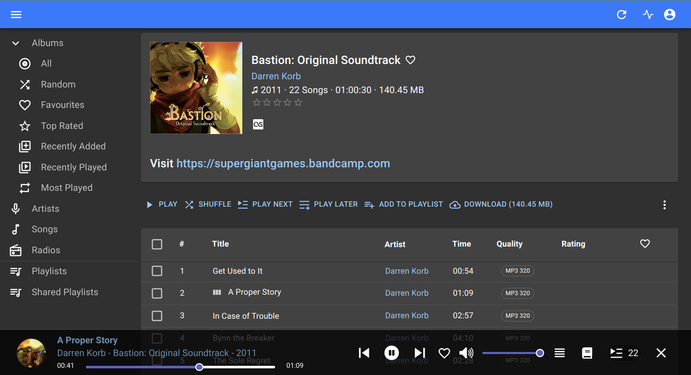
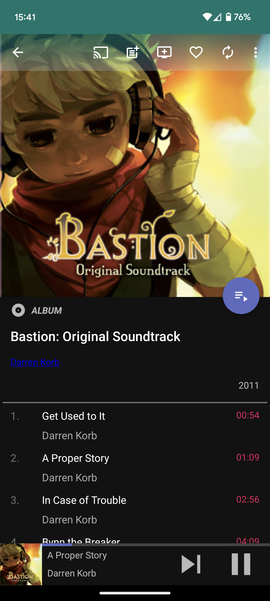

[Navidrome](https://www.navidrome.org/about/) is *a self-hosted,
open source music server and streamer. It gives you freedom to
listen to your music collection from any browser or mobile
device* I heard about in the
[Linux Matters](https://linuxmatters.sh/37/) podcast.

I tried it on
[my little Kubernetes cluster](2023-03-25-single-node-kubernetes-cluster-on-ubuntu-server-lexicon.md)
and here are impressions so far.

<!-- more -->

The following deployment is based on the Navidrome
[Installing with Docker](https://www.navidrome.org/docs/installation/docker/):

??? k8s "Kubernetes deployment: `navidrome.yaml`"

    ``` yaml linenums="1" title="navidrome.yaml"
    apiVersion: v1
    kind: Namespace
    metadata:
      name: navidrome
    ---
    apiVersion: v1
    kind: PersistentVolume
    metadata:
      name: navidrome-pv-data
      namespace: navidrome
    spec:
      storageClassName: manual
      capacity:
        storage: 1Gi
      accessModes:
        - ReadWriteOnce
      persistentVolumeReclaimPolicy: Retain
      hostPath:
        path: /home/k8s/navidrome/data
    ---
    apiVersion: v1
    kind: PersistentVolume
    metadata:
      name: navidrome-pv-depot-music
      namespace: navidrome
    spec:
      storageClassName: manual
      capacity:
        storage: 100Gi
      accessModes:
        - ReadWriteOnce
      persistentVolumeReclaimPolicy: Retain
      hostPath:
        path: /home/depot/audio/Music
    ---
    apiVersion: v1
    kind: PersistentVolumeClaim
    metadata:
      name: navidrome-pvc-data
      namespace: navidrome
    spec:
      storageClassName: manual
      volumeName: navidrome-pv-data
      accessModes:
        - ReadWriteOnce
      volumeMode: Filesystem
      resources:
        requests:
          storage: 1Gi
    ---
    apiVersion: v1
    kind: PersistentVolumeClaim
    metadata:
      name: navidrome-pvc-depot-music
      namespace: navidrome
    spec:
      storageClassName: manual
      volumeName: navidrome-pv-depot-music
      accessModes:
        - ReadWriteOnce
      volumeMode: Filesystem
      resources:
        requests:
          storage: 1Gi
    ---
    apiVersion: apps/v1
    kind: Deployment
    metadata:
      labels:
        app: navidrome
      name: navidrome
      namespace: navidrome
    spec:
      replicas: 1
      revisionHistoryLimit: 0
      selector:
        matchLabels:
          app: navidrome
      strategy:
        rollingUpdate:
          maxSurge: 0
          maxUnavailable: 1
        type: RollingUpdate
      template:
        metadata:
          labels:
            app: navidrome
        spec:
          containers:
            - image: deluan/navidrome:latest
              imagePullPolicy: Always
              name: navidrome
              env:
              - name: ND_BASEURL
                value: "https://music.ssl.uu.am/"
              - name: ND_LOGLEVEL
                value: "info"
              - name: ND_SCANSCHEDULE
                value: "1h"
              - name: ND_SESSIONTIMEOUT
                value: "24h"
              ports:
              - containerPort: 4533
              resources: {}
              stdin: true
              tty: true
              volumeMounts:
              - mountPath: /data
                name: navidrome-data
              - mountPath: /music
                name: navidrome-music
              securityContext:
                allowPrivilegeEscalation: false
                runAsUser: 1008
                runAsGroup: 1008
          restartPolicy: Always
          volumes:
          - name: navidrome-data
            persistentVolumeClaim:
              claimName: navidrome-pvc-data
          - name: navidrome-music
            persistentVolumeClaim:
              claimName: navidrome-pvc-depot-music
    ---
    kind: Service
    apiVersion: v1
    metadata:
      name: navidrome-svc
      namespace: navidrome
    spec:
      type: NodePort
      ports:
      - port: 4533
        nodePort: 30533
        targetPort: 4533
      selector:
        app: navidrome
    ---
    apiVersion: networking.k8s.io/v1
    kind: Ingress
    metadata:
      name: navidrome-ingress
      namespace: navidrome
      annotations:
        acme.cert-manager.io/http01-edit-in-place: "true"
        cert-manager.io/issue-temporary-certificate: "true"
        cert-manager.io/cluster-issuer: letsencrypt-prod
        nginx.ingress.kubernetes.io/websocket-services: navidrome-svc
    spec:
      ingressClassName: nginx
      rules:
        - host: music.ssl.uu.am
          http:
            paths:
              - path: /
                pathType: Prefix
                backend:
                  service:
                    name: navidrome-svc
                    port:
                      number: 4533
      tls:
        - secretName: tls-secret
          hosts:
            - music.ssl.uu.am

    ```

To use a configuration file, create a `navidrome.toml` config
file in the `/data` folder and set the option
`ND_CONFIGFILE=/data/navidrome.toml`. So far this has not seemed
to be necessary.

Before running this deployment, create the required directory
and local user, get its user id (`1008`) and plug it above:

``` console
# useradd navidrome
# mkdir /home/k8s/navidrome
# chown navidrome.navidrome /home/k8s/navidrome
# ls -lan /home/k8s/navidrome/
total 0
drwxr-xr-x 1 1008 1008   0 Oct 26 08:53 .
drwxr-xr-x 1    0    0 372 Oct 26 08:53 ..
```

Once everything is ready, apply the deployment and give it a
few minutes to start the pods and get the SSL certificated ready:

``` console
$ kubectl apply -f navidrome.yaml
namespace/navidrome created
persistentvolume/navidrome-pv-data created
persistentvolume/navidrome-pv-depot-music created
persistentvolumeclaim/navidrome-pvc-data created
persistentvolumeclaim/navidrome-pvc-depot-music created
deployment.apps/navidrome created
service/navidrome-svc created
ingress.networking.k8s.io/navidrome-ingress created
```

After a couple of minutes the server's web interface is at
[https://music.ssl.uu.am/](https://music.ssl.uu.am/)
and one can start by creating an admin user, then (optionally)
more users (some of which can be admins too). In the meantime,
the server will detect and scan music files and, as they are
found, make them available for playback. The web player works
*doesn't look like much* but works very nicely:



This web player alone already satisfy my first need, which is to
listen to music while working, i.e. from a computer. For the
use case of listening to music while on the go (i.e. from a
phone), there are a few Subsonic-compatible Android apps
available directly from Google Play:


  [GoSONIC](https://play.google.com/store/apps/details?id=com.readysteadygosoftware.gosonic) | [Symfonium](https://play.google.com/store/apps/details?id=app.symfonik.music.player) | [Ultrasonic](https://play.google.com/store/apps/details?id=org.moire.ultrasonic)
--------------|---------------|-----------------
         |          | 

The jury is still out, and not in a hurry to come back, as to
which of these players will win me over. Symfonium seems to be
the only one that require payment, which likely won't help.

!!! news

    After a couple of months, I find myself always going back to
    [GoSONIC](https://play.google.com/store/apps/details?id=com.readysteadygosoftware.gosonic).
    The main reason for this choice is just how easy, fast **and reliable** it is to
    start playing the most recently played playlist. This is essentially what I use
    every music player for, so this matters most for me.
