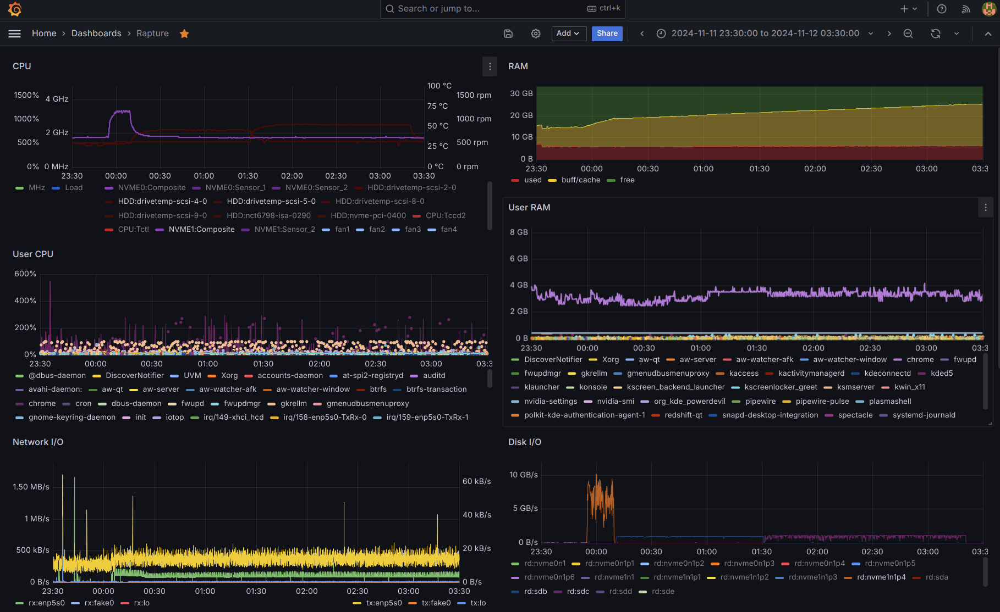

Installing Ubuntu Studio 24.04 on my main PC, for Gaming, coding, media and more."

<!-- more -->

## Considering Timing

[Ubuntu Studio 24.04 LTS Released](https://ubuntustudio.org/2024/04/ubuntu-studio-24-04-lts-released/)
on April 25 but, as they themselves put it
*since it’s just out, you may experience some issues, so you might want to wait a bit before upgrading*.

There doesn't seem to be anything particular scarey in release notes:

*  [Ubuntu Studio 24.04 LTS Release Notes](https://ubuntustudio.org/ubuntu-studio-24-04-LTS-release-notes/)
*  [Kubuntu 24.04 Release Notes](https://wiki.ubuntu.com/NobleNumbat/ReleaseNotes/Kubuntu)
*  [Noble Numbat Release Notes](https://discourse.ubuntu.com/t/noble-numbat-release-notes/39890/1)

And my plan is not to upgrade in place; I like to keep the previous
version around just in case I need a stable system to fall back to.

## Preparation

In preparation to upgrade my main PC to
[**Ubuntu Studio**](https://ubuntustudio.org/) **24.04**,
I installed a new
[Kingston FURY Renegade 4000 GB M.2 SSD](https://www.kingston.com/en/ssd/gaming/kingston-fury-renegade-nvme-m2-ssd)
and prepared partitions as follows:

1. 260 MB EFI System for the EFI boot.
2. 75 GB Linux filesystem for the root (ext4).
3. 75 GB Linux filesystem for the alternative root (ext4).
4. 3.5T GB Linux filesystem for `/home` (btrfs).

**Note:** 75 GB has proven to be a reasonable size for the
root partition for the amount of software that tends to be
installed in my PC, including 20 GB in `/usr` and 13 GB in
`/snap`.

### Partitions

First,
[create a GPT partition table](https://serverfault.com/a/709952)
(`label`), then create the partitions
[with `optimal` alignment](https://unix.stackexchange.com/a/49274)

```
# parted /dev/nvme1n1 --script -- mklabel gpt
# parted -a optimal /dev/nvme1n1 mkpart primary fat32 0% 260MiB
# parted -a optimal /dev/nvme1n1 mkpart primary ext4 260MiB 75GiB
# parted -a optimal /dev/nvme1n1 mkpart primary ext4 75GiB 150GiB
# parted -a optimal /dev/nvme1n1 mkpart primary btrfs 150GiB 100%

# parted /dev/nvme1n1 print
Model: KINGSTON SFYRD4000G (nvme)
Disk /dev/nvme1n1: 4001GB
Sector size (logical/physical): 512B/512B
Partition Table: gpt
Disk Flags: 

Number  Start   End     Size    File system  Name     Flags
 1      1049kB  273MB   272MB                primary  msftdata
 2      273MB   80.5GB  80.3GB               primary
 3      80.5GB  161GB   80.5GB               primary
 4      161GB   4001GB  3840GB               primary

# fdisk -l /dev/nvme1n1 
Disk /dev/nvme1n1: 3.64 TiB, 4000787030016 bytes, 7814037168 sectors
Disk model: KINGSTON SFYRD4000G                     
Units: sectors of 1 * 512 = 512 bytes
Sector size (logical/physical): 512 bytes / 512 bytes
I/O size (minimum/optimal): 512 bytes / 512 bytes
Disklabel type: gpt
Disk identifier: 3C935B5D-3EFC-4683-9483-BC110B2AEB17

Device             Start        End    Sectors  Size Type
/dev/nvme1n1p1      2048     532479     530432  259M Microsoft basic data
/dev/nvme1n1p2    532480  157286399  156753920 74.7G Linux filesystem
/dev/nvme1n1p3 157286400  314572799  157286400   75G Linux filesystem
/dev/nvme1n1p4 314572800 7814035455 7499462656  3.5T Linux filesystem
```

**Note:** in retrospect, it seems to be necessary to also apply the
`boot` flag to the EFI partition; otherwise the Ubuntu installer will
not offer the possibility of installing the boot loader in this disk:

```
# parted /dev/nvme1n1 toggle 1 boot

# parted /dev/nvme1n1 print
Model: KINGSTON SFYRD4000G (nvme)
Disk /dev/nvme1n1: 4001GB
Sector size (logical/physical): 512B/512B
Partition Table: gpt
Disk Flags: 

Number  Start   End     Size    File system  Name     Flags
 1      1049kB  273MB   272MB                primary  boot, esp
 2      273MB   80.5GB  80.3GB               primary
 3      80.5GB  161GB   80.5GB               primary
 4      161GB   4001GB  3840GB               primary
```

Partitions can be created during the installation of the
system, there is no need to create them before hand because
the previous M.2 SSD is not going anywhere any time soon.

In the future, the previous (2 TB) M.2 SSD may be replaced with another 4 TB SSD, e.g.
- [Kingston FURY Renegade with Heatsink](https://www.digitec.ch/en/s1/product/kingston-fury-renegade-with-heatsink-4000-gb-m2-2280-ssd-22903765) ($320+)
- [Samsung 990 Pro with Heatsink](https://www.digitec.ch/en/s1/product/samsung-990-pro-with-heatsink-4000-gb-m2-2280-ssd-37728060) ($300+)

However, that replacement will likely not happen under 2026,
once Ubuntu Studio 26.04 is installed and there is no longer
a point to keep the old Ubuntu 22.04 around.

In the meantime, the new SSD can be converted into being the new
`/home` and, while the old one is still around, this could be a
good time to try [bcachefs](https://bcachefs.org/) on the new one.
However, that requires either [building a kernel](https://kernelnewbies.org/KernelBuild)
or waiting for Linux **6.7** or later.
[Ubuntu 24.04 LTS Will Aim To Ship With The Linux 6.8 Kernel](https://www.phoronix.com/news/Ubuntu-24.04-Will-Use-Linux-6.8),
so the easier approach would be to wait for the installation of Ubuntu 24.04
to move `/home` to the new SSD.

Listen to [Linux Matters #23: An Exodus of Bitcoin](https://linuxmatters.sh/23/)
were *Martin has excitedly installed it on everything!*
In particular, there seems to be options to configure large
file systems across multiple devices **with redundancy**
(details to be confirmed) and *tiered storage* to keep
*hot data* on the faster storage (NVME) and rebalance unused
data back to slower storage (SATA).

### New BtrFS Home

Create a new `btrfs` file system to test the new SSD, while
we're waiting for the upcoming Ubuntu 24.04 release:

```
# mkfs.btrfs /dev/nvme1n1p4
btrfs-progs v5.16.2
See http://btrfs.wiki.kernel.org for more information.

Performing full device TRIM /dev/nvme1n1p4 (3.49TiB) ...
NOTE: several default settings have changed in version 5.15, please make sure
      this does not affect your deployments:
      - DUP for metadata (-m dup)
      - enabled no-holes (-O no-holes)
      - enabled free-space-tree (-R free-space-tree)

Label:              (null)
UUID:               8edfc3ba-4981-4423-8730-7e229bfa63f3
Node size:          16384
Sector size:        4096
Filesystem size:    3.49TiB
Block group profiles:
  Data:             single            8.00MiB
  Metadata:         DUP               1.00GiB
  System:           DUP               8.00MiB
SSD detected:       yes
Zoned device:       no
Incompat features:  extref, skinny-metadata, no-holes
Runtime features:   free-space-tree
Checksum:           crc32c
Number of devices:  1
Devices:
   ID        SIZE  PATH
    1     3.49TiB  /dev/nvme1n1p4

# mkdir /home/new-m2
# tail -1 /etc/fstab 
UUID=8edfc3ba-4981-4423-8730-7e229bfa63f3 /home/new-m2      btrfs   defaults        0       0
```

Suddently there is a lot of space available!

```
$ df -h
Filesystem      Size  Used Avail Use% Mounted on
/dev/nvme0n1p5  1.7T  1.2T  517G  70% /home
/dev/sdc        3.7T  2.7T  1.1T  72% /home/ssd
/dev/sda        5.5T  5.3T  254G  96% /home/raid
/dev/sdb        3.7T  3.0T  667G  83% /home/new-ssd
/dev/nvme1n1p4  3.5T  3.7M  3.5T   1% /home/new-m2
```

### Transfer Speed Test

First, transfer 1.4 GB of media (family photos and videos)
from the SATA SSD. Theoretical maximum transfer speed is
around 550 MB/s, but in practice the transfer speed fluctuates
between 500 and 540 MB/s and the transfer took 48 minutes.
There was little difference between using `rync -uva` vs
`cp -av`.

```
# time cp -a /home/ssd/Fotos /home/new-m2/

real    48m39.874s
user    0m3.933s
sys     13m10.019s
```

Then, transfer 1.1 GB of personal files from the old
NVME SSD. Theoretical maximum transfer speed is
around 3000 MB/s, in practice the transfer speed fluctuates
between 800 and 2500 MB/s and the transfer took 25 minutes,
so just about twice as fast as the previous one.

```
# time rsync -a /home/coder /home/new-m2/

real    24m54.444s
user    4m31.149s
sys     17m54.582s
```

With these 2 transfers, the new M.2 SSD is nearly at 70%:

```
$ df -h
Filesystem      Size  Used Avail Use% Mounted on
/dev/nvme0n1p5  1.7T  1.2T  517G  70% /home
/dev/sdc        3.7T  2.7T  1.1T  72% /home/ssd
/dev/sda        5.5T  5.3T  254G  96% /home/raid
/dev/sdb        3.7T  3.0T  667G  83% /home/new-ssd
/dev/nvme1n1p4  3.5T  2.4T  1.2T  69% /home/new-m2
```

## Installation

With the above partitions prepared well in advance, to
[Install Ubuntu Studio 24.04](../../../../2024/09/14/ubuntu-studio-24-04-on-computer-for-a-young-artist.html#install-ubuntu-studio-2404)
the process *should* be as simple, easy and smooth as it
was with other systems.

Alas, it wasn't. Even after setting up all the partition
correctly for the new install, the installer would not
allow selecting the correct device for to install the
boot loader in it: `nvme1n1` is grayed out!

This problem is one I had seen recently, but didn't write
down what the solution was.

While search (in vain) for others facing the same issue,
I took advantage of being in a live USB system and
cloned the current Ubuntu Studio 22.04 root partition
(`nvme0n1p6`) onto what *would* have been the new Ubuntu
Studio 24.04 root partition (`nvme1n1p2`), in case this
may come in handy later.

**Important:** after cloning a root file system, the
`/etc/fstab` file in the new clone must be updated with
the correct UUID of that partition.

If the (new) EFI partition has not been formatted yet;
format it as **FAT32**:

```
# mkfs.fat -F32 /dev/nvme1n1p1
mkfs.fat 4.2 (2021-01-31)

# lsblk -f
nvme1n1
│
├─nvme1n1p1
│    vfat   FAT32       73CC-6E86
...
├─nvme1n1p2
│    ext4   1.0         409501ea-d63d-49b2-bd45-3b876404dc53

nvme0n1
│
...
└─nvme0n1p6
     ext4   1.0         de317ca5-96dd-49a7-b72b-4bd050a8d15c   20.8G    67% /var/snap/firefox/common/host-hunspell
```

The mount the new root and edit `/etc/fstab` in it:

```
# mount /dev/nvme1n1p2 /media/cdrom/
# vi /media/cdrom/etc/fstab
...
# <file system>             <mount point>  <type>  <options>  <dump>  <pass>
UUID=73CC-6E86                            /boot/efi      vfat    umask=0077 0 2
UUID=409501ea-d63d-49b2-bd45-3b876404dc53 /              ext4    defaults,discard 0 1
...
```

One potential problem is that no partition in `nvme1n1` 
has tbe `boot` flag. It appears all bootable partitions
that are working have flags `boot, esp` so the solution
may be simply to add those flags. At the very least, this
seems like it is necessary, if not sufficient:

```
# parted /dev/nvme1n1
GNU Parted 3.4
Using /dev/nvme1n1
Welcome to GNU Parted! Type 'help' to view a list of commands.
(parted) print                                                            
Model: KINGSTON SFYRD4000G (nvme)
Disk /dev/nvme1n1: 4001GB
Sector size (logical/physical): 512B/512B
Partition Table: gpt
Disk Flags: 

Number  Start   End     Size    File system  Name     Flags
 1      1049kB  273MB   272MB                primary  msftdata
 2      273MB   80.5GB  80.3GB  ext4         primary
 4      161GB   4001GB  3840GB  btrfs        primary

(parted) toggle 1 boot
(parted) print
Model: KINGSTON SFYRD4000G (nvme)
Disk /dev/nvme1n1: 4001GB
Sector size (logical/physical): 512B/512B
Partition Table: gpt
Disk Flags: 

Number  Start   End     Size    File system  Name     Flags
 1      1049kB  273MB   272MB                primary  boot, esp
 2      273MB   80.5GB  80.3GB  ext4         primary
 4      161GB   4001GB  3840GB  btrfs        primary
```

**Note:** `boot` and `esp` are the same flag; if you
toggle both you end up with the initial state.

At this point, decided to follow 
[askubuntu.com/a/1463655](https://askubuntu.com/a/1463655)
to fully cloned the current system onto the new 4TB
NVME and try to boot from it.

```
# mount /dev/nvme1n1p2 /media/cdrom/
# mount /dev/nvme1n1p1 /media/cdrom/boot/efi/

# grub-install \
  --target x86_64-efi \
  --efi-directory /media/cdrom/boot/efi \
  --boot-directory /media/cdrom/boot
Installing for x86_64-efi platform.
Installation finished. No error reported.

# grub-mkconfig -o /media/cdrom/boot/grub/grub.cfg
Sourcing file `/etc/default/grub'
Sourcing file `/etc/default/grub.d/init-select.cfg'
Generating grub configuration file ...
Found linux image: /boot/vmlinuz-5.15.0-124-lowlatency
Found initrd image: /boot/initrd.img-5.15.0-124-lowlatency
Found linux image: /boot/vmlinuz-5.15.0-124-lowlatency
Found initrd image: /boot/initrd.img-5.15.0-124-lowlatency
Found linux image: /boot/vmlinuz-5.15.0-122-lowlatency
Found initrd image: /boot/initrd.img-5.15.0-122-lowlatency
Found linux image: /boot/vmlinuz-5.15.0-60-lowlatency
Found initrd image: /boot/initrd.img-5.15.0-60-lowlatency
Memtest86+ needs a 16-bit boot, that is not available on EFI, exiting
Warning: os-prober will be executed to detect other bootable partitions.
Its output will be used to detect bootable binaries on them and create new boot entries.
Found Ubuntu 22.04.1 LTS (22.04) on /dev/nvme0n1p2
Found Ubuntu 22.04.5 LTS (22.04) on /dev/nvme1n1p2
Adding boot menu entry for UEFI Firmware Settings ...
done
```

At this point there *should* be a boot loader, ready to
boot, on thew new NVME. If anything, it looks like it
would boot the *old old* 22.04.1 `nvme0n1p2` instead of
the *old* (current) 22.04.5 `nvme0n1p6`.

Indeed upon reboot, the UEFI boot menu now shows both
NVME disks and selecting the 4TB disk the new bootloader
shows those entries. After this, the installation process
was, finally, smooth and successful, installing the new
boot loader in `nvme1n1`.

This *new new* bootloader in `nvme1n1` now shows all 4
systems available to boot
- Ubuntu 22.04.1 in `nvme0n1p2` (have not used in some time)
- Ubuntu 22.04.5 in `nvme0n1p6` (current daily driver)
- Ubuntu 22.04.5 in `nvme1n1p2` (future backup daily driver)
- Ubuntu 24.04.1 in `nvme1n1p3` (future daily driver)

### Adjusting all `/etc/fstab` files

To make sure all those root partitions are usable, their
`/etc/fstab` files need to be adjusted to point to the
correct `/boot/efi` partitions (the one in the same disk)
and the new one will has a new UUID after the last
installation:

```
# lsblk -f
NAME FSTYPE FSVER LABEL UUID                                 FSAVAIL FSUSE% MOUNTPOINTS
...
nvme0n1
│
├─nvme0n1p1
│                  
├─nvme0n1p2
│    ext4   1.0         833c6403-a771-46b2-bde8-704f2ab7e88b
├─nvme0n1p3
│    ext4   1.0         343f75fe-ec96-49fa-a4f8-0d32c69c1424
├─nvme0n1p4
│    vfat   FAT32 NO_LABEL
│                       C38B-C318                             293.3M     2% /boot/efi
├─nvme0n1p5
│    btrfs              18238846-d411-4dcb-af87-a2d19a17fef3  654.9G    62% /home
└─nvme0n1p6
     ext4   1.0         de317ca5-96dd-49a7-b72b-4bd050a8d15c

nvme1n1
│
├─nvme1n1p1
│    vfat   FAT16       4485-0F5E
├─nvme1n1p2
│    ext4   1.0         409501ea-d63d-49b2-bd45-3b876404dc53   18.7G    69%
├─nvme1n1p3
│    ext4   1.0         1d30a16e-b4f6-4459-9b19-8c9093b0d047                
└─nvme1n1p4
     btrfs              8edfc3ba-4981-4423-8730-7e229bfa63f3      1T    71% /home/new-m2
```

Following the above order, make sure that each
`/etc/fstab` file points to the correct partition/s:

Ubuntu 22.04.1 in `nvme0n1p2` (not used in some time) is
not even using an EFI partition at all; this one dates
back to a time when this disk was used in legacy BIOS
mode:

```
# df -h | grep nvme0n1p2
/dev/nvme0n1p2   50G   27G   21G  57% /jellyfish
# grep -E '/ |/bo'  /jellyfish/etc/fstab 
UUID=833c6403-a771-46b2-bde8-704f2ab7e88b /              ext4    defaults   0 1
```

Ubuntu 22.04.5 in `nvme0n1p6` (current daily driver) has
not changed, as expected:

```
# grep -E '/ |/bo'  /etc/fstab 
UUID=C38B-C318                            /boot/efi      vfat    umask=0077 0 2
UUID=de317ca5-96dd-49a7-b72b-4bd050a8d15c /              ext4    defaults,discard 0 1
```

Ubuntu 22.04.5 in `nvme1n1p2` (the *future backup* daily
driver) is a clone of the one in `nvme0n1p6` **but** it
is also on the newer NVME disk, so both partitions must
be updated:
- `/boot/efi` must point to `nvme1n1p1`
- `/` must point to `nvme1n1p2`

```
# mount /dev/nvme1n1p2 /media/cdrom/
# grep -E '/ |/bo'  /media/cdrom/etc/fstab 
UUID=4485-0F5E                            /boot/efi      vfat    umask=0077 0 2
UUID=409501ea-d63d-49b2-bd45-3b876404dc53 /              ext4    defaults,discard 0 1
# umount /dev/nvme1n1p2
```

This being an updated copy of the current `/etc/fstab`
file, it already has all the partitions currently in use.

**Ubuntu 24.04.1** in `nvme1n1p3` (the **future** daily
driver) should be already good to go; since it was just
installed:

```
# mount /dev/nvme1n1p3 /noble
# grep -E '/ |/bo'  /noble/etc/fstab 
# / was on /dev/nvme1n1p3 during curtin installation
/dev/disk/by-uuid/1d30a16e-b4f6-4459-9b19-8c9093b0d047 / ext4 defaults 0 1
# /boot/efi was on /dev/nvme1n1p1 during curtin installation
/dev/disk/by-uuid/4485-0F5E /boot/efi vfat defaults 0 1
```

### New mount points for all partitions

The `/etc/fstab` in **Ubuntu 24.04.1** (`nvme1n1p3`) is
missing all the *other* partitions currently in use, and
includes a swap file that is unnecessary in a system with
32 GB of RAM:

```bash
# /etc/fstab: static file system information.
#
# Use 'blkid' to print the universally unique identifier for a
# device; this may be used with UUID= as a more robust way to name devices
# that works even if disks are added and removed. See fstab(5).
#
# <file system> <mount point>   <type>  <options>       <dump>  <pass>
# / was on /dev/nvme1n1p3 during curtin installation
/dev/disk/by-uuid/1d30a16e-b4f6-4459-9b19-8c9093b0d047 / ext4 defaults 0 1
# /boot/efi was on /dev/nvme1n1p1 during curtin installation
/dev/disk/by-uuid/4485-0F5E /boot/efi vfat defaults 0 1
# /home was on /dev/nvme1n1p4 during curtin installation
/dev/disk/by-uuid/8edfc3ba-4981-4423-8730-7e229bfa63f3 /home btrfs defaults 0 1
/swap.img       none    swap    sw      0       0
```

Because this PC has been *collecting* hard drives over
the years, there are many additional partitions in use:

```
# df -h | head -1; df -h | grep -E 'nvme|sd.'
Filesystem      Size  Used Avail Use% Mounted on
/dev/nvme0n1p6   74G   49G   21G  71% /
/dev/nvme0n1p4  300M  6.1M  294M   3% /boot/efi
/dev/nvme0n1p5  1.7T  1.1T  655G  62% /home
/dev/sdb        3.7T  2.1T  1.6T  57% /home/new-ssd
/dev/sdc        3.7T  2.9T  833G  78% /home/ssd
/dev/nvme1n1p4  3.5T  2.5T  1.1T  71% /home/new-m2
/dev/sda        5.5T  5.1T  370G  94% /home/raid
/dev/nvme1n1p3   74G   22G   49G  31% /noble
```

For just about the same reason, there are also several
symlinks strategically pointing from where thigns used
to be to where they are now:

```
# ls -l /home/
total 80
lrwxrwxrwx 1 root   root      17 Sep 24  2022 depot -> /home/raid/depot/
lrwxrwxrwx 1 root   root      16 May 12 19:37 k8s -> /home/new-m2/k8s
lrwxrwxrwx 1 root   root      16 May 12 10:02 lib -> /home/new-m2/lib

# ls -l /home/raid/depot/[av]*
lrwxrwxrwx 1 coder coder 16 Aug 20  2023 /home/raid/depot/audio -> /home/raid/audio
lrwxrwxrwx 1 coder coder 16 Aug 20  2023 /home/raid/depot/video -> /home/raid/video

# ls -l /home/new-ssd/video
lrwxrwxrwx 1 root root 16 Aug 20  2023 /home/new-ssd/video -> /home/raid/video
```

In the future daily driver, the old 2TB NVME should not
be used, so it can be replaced later by a newer 4TB disk.

To that effect, all data in `/dev/nvme0n1p5` must be
copied over to `/dev/nvme1n1p4` and in fact most of it
is already there. There are only a few users' home
directories and empty directories (mount points):

```
# du -sh /home/*
952G    /home/coder
18G     /home/ernest
134G    /home/manuel
1.5G    /home/minecraft
44K     /home/sam

# du -sh /home/new-m2/*
952G    /home/new-m2/coder
18G     /home/new-m2/ernest
1.5T    /home/new-m2/Fotos
26G     /home/new-m2/k8s
35G     /home/new-m2/lib
134G    /home/new-m2/manuel
1.5G    /home/new-m2/minecraft
44K     /home/new-m2/sam

# cd /home/new-m2/
root@rapture:/home/new-m2# mkdir new-ssd raid ssd
```

#### Boot cloned Ubuntu Studio 22.04 without old NVME

As an intermediate step to booting the new Ubuntu Studio
24.04 later, boot the newly cloned Ubuntu Studio 22.04
in `nvme1n1p3` **without** mounting the old NVME.

With the above preparetions done in the new NVME, this
*should* be as simple as mounting the new NVME on
`/home` and simply *not mounting* the old NVME:

```
# mount /dev/nvme1n1p2 /media/cdrom/

# vi /media/cdrom/etc/fstab
...
# Previous-new (June 2022) 2TB NVME SSD (/home)
#UUID=18238846-d411-4dcb-af87-a2d19a17fef3 /home          btrfs   defaults,noatime,autodefrag,discard,compress=lzo 0 0

# New-new 4TB M.2 SSD (newer /home; previously /home/new-m2)
UUID=8edfc3ba-4981-4423-8730-7e229bfa63f3 /home      btrfs   defaults        0       0

# umount /media/cdrom/
```

Reboot into the *newly cloned* **Ubuntu Studio 22.04**
and check that everything works as usual. This would be
the first green light to removing the old 2TB NVME disk
from the system.

Despite booting from the new bootloader in the 4TB NVME
the **Ubuntu Studio 22.04.5 on /dev/nvme1n1p2** option, 
somehow the system boots the *old old* root:

```
$ df-h
Filesystem      Size  Used Avail Use% Mounted on
/dev/nvme0n1p6   74G   49G   22G  70% /
/dev/nvme0n1p2   50G   27G   21G  57% /jellyfish
/dev/nvme0n1p4  300M  6.1M  294M   3% /boot/efi
/dev/nvme0n1p5  1.7T  1.1T  655G  62% /home
/dev/sdc        3.7T  2.9T  833G  78% /home/ssd
/dev/sdb        3.7T  2.1T  1.6T  57% /home/new-ssd
/dev/nvme1n1p4  3.5T  2.7T  887G  76% /home/new-m2
/dev/sda        5.5T  5.1T  370G  94% /home/raid
```

The bootloader entry specifies the root file system as
`409501ea-d63d-49b2-bd45-3b876404dc53` but it boots on
`de317ca5-96dd-49a7-b72b-4bd050a8d15c`; despite the
correct UUID in the new `/etc/fstab`.

The problem is in precisely *this* entry in the boot
loader, as is the only one that boots the kernel with
the wrong `root=` parameter. This can be confirmed in the
bootloader by pressing `e` after selecting the entry to
boot the newly cloned Ubuntu 22.04:

```
setparams 'Ubuntu 22.04.5 LTS (22.04) (on /dev/nvme1n1p2)'

        insmod part_gpt
        insmod ext2
        search --no-floppy --fs-uuid --set=root 409501ea-d63d-49b2-bd45-3b876404dc53
        linux /boot/vmlinuz-5.15.0-124-lowlatency root=UUID=de317ca5-96dd-49a7-b72b-4bd050a8d15c ro threadirqs noquiet nosplash
        initrd /boot/initrd.img-5.15.0-124-lowlatency
```

There is why the kernel is mounting the root from the old NMVE:
the UUID in the `search` line is the desired root, the newly
cloned 22.04 in the 4TB NVME, but the `linux` line is pointing
to the old root in the 2TB NVME. Editing this value and then
pressing `Ctrl+x` finally boots into the newly cloned 22.04
and the old 2TB NVMe is not mounted or used at all:

```
$ df -h
Filesystem      Size  Used Avail Use% Mounted on
/dev/nvme1n1p2   74G   51G   19G  74% /
/dev/nvme1n1p1  259M  6.2M  253M   3% /boot/efi
/dev/nvme1n1p4  3.5T  2.7T  887G  76% /home
/dev/sdc        3.7T  2.9T  833G  78% /home/ssd
/dev/sdb        3.7T  2.1T  1.6T  57% /home/new-ssd
/dev/sda        5.5T  5.1T  370G  94% /home/raid
```

To make this change permanent, the answer (from **2019**) in
https://askubuntu.com/a/1140397 seems to suggest that simply
running `sudo update-grub` would pick up the correct root.
This would make sense, but perhaps would be better to do it
from the new 24.04 system. Perhaps the old root UUID has
been left somewhere in the new root UUID, which would be
updated by now.

So the next move is to boot the new 24.04 system, but before
doing that its `/etc/fstab` needs to be updated to **add** the
additional partitions in the old SATA disks.

First, lets add the 24.04 root as a read-only mount:

```
# vi /etc/fstab
...
# NEW Ubuntu Studio 24.04 root (nvme1n1p3)
UUID=1d30a16e-b4f6-4459-9b19-8c9093b0d047 /noble      ext4   defaults,ro        0       0
```

Then update its `/etc/fstab` after remounting as read-write:

```
# mount /noble/ -o remount,rw

# cat /etc/fstab \
  | grep --color=no -C2 sd. \
  >> /noble/etc/fstab 

# cat /noble/etc/fstab
# /etc/fstab: static file system information.
#
# Use 'blkid' to print the universally unique identifier for a
# device; this may be used with UUID= as a more robust way to name devices
# that works even if disks are added and removed. See fstab(5).
#
# <file system> <mount point>   <type>  <options>       <dump>  <pass>
# / was on /dev/nvme1n1p3 during curtin installation
/dev/disk/by-uuid/1d30a16e-b4f6-4459-9b19-8c9093b0d047 / ext4 defaults 0 1
# /boot/efi was on /dev/nvme1n1p1 during curtin installation
/dev/disk/by-uuid/4485-0F5E /boot/efi vfat defaults 0 1
# /home was on /dev/nvme1n1p4 during curtin installation
/dev/disk/by-uuid/8edfc3ba-4981-4423-8730-7e229bfa63f3 /home btrfs defaults 0 1
/swap.img       none    swap    sw      0       0

# Previous (June 2021) 4TB SSD (previous-previous /home)
# /home/ssd is now on /dev/sde with a new UUID
UUID=5cf65a95-4ae5-41ed-9a14-7d7fbeee1951 /home/ssd       btrfs   defaults        0       2

# /home/raid was on /dev/sdb during installation
UUID=a4ee872d-b985-445f-94a2-15232e93dcd5 /home/raid      btrfs   defaults        0       0

# New (Jan 2023) 4TB SSD (Crucial MX)
# Always write slowly! e.g.
# rsync -turva --bwlimit=500000 /home/depot/audio/* /home/ssd/audio/
UUID=6b809fc0-0b85-4041-ac25-47ec4682f5f5 /home/new-ssd      btrfs   defaults        0       0
```

Finally, comment out the line for the swap file (`/swap.img`),
because that won't be necessary in a system with 32GB of RAM,
and add a line to mount the newly clone 22.04 as read-only:

```
# mkdir /noble/jammy
# vi /noble/etc/fstab
...
# Ubuntu Studio 22.04 root (ro)
UUID=409501ea-d63d-49b2-bd45-3b876404dc53 /jammy      ext4   defaults,ro        0       0
```

With all these adjustments, after booting into the new
**Ubuntu Studio 24.04** this should be what is mounted:

```
# df -h | head -1; df -h | grep -E 'nvme|sd.'
Filesystem      Size  Used Avail Use% Mounted on
/dev/nvme1n1p3   74G   22G   49G  31% /
/dev/nvme1n1p1  300M  6.1M  294M   3% /boot/efi
/dev/nvme1n1p4  3.5T  2.5T  1.1T  71% /home/
/dev/sdb        3.7T  2.1T  1.6T  57% /home/new-ssd
/dev/sdc        3.7T  2.9T  833G  78% /home/ssd
/dev/sda        5.5T  5.1T  370G  94% /home/raid
/dev/nvme1n1p2   74G   51G   19G  74% /jammy
```

And then it will be a better time to run `sudo update-grub`
to hopefully pick up the correct root for the new 22.04.

## First boot into Ubuntu Studio 24.04

The first time booting into the new system, right after login for
the first time an additional reboot is required for the
[Ubuntu Studio Audio Configuration](../../../../2024/09/14/ubuntu-studio-24-04-on-computer-for-a-young-artist.html##ubuntu-studio-audio-configuration).

After rebooting again, `df` shows partitions are mounted like this:

```
# df -h
Filesystem      Size  Used Avail Use% Mounted on
tmpfs           3.2G  2.6M  3.2G   1% /run
/dev/nvme1n1p3   74G   22G   48G  32% /
tmpfs            16G     0   16G   0% /dev/shm
tmpfs           5.0M   24K  5.0M   1% /run/lock
efivarfs        128K   51K   73K  42% /sys/firmware/efi/efivars
/dev/nvme1n1p2   74G   51G   19G  74% /jammy
/dev/nvme1n1p1  259M  6.2M  253M   3% /boot/efi
/dev/nvme1n1p4  3.5T  2.7T  887G  76% /home
/dev/sdb        3.7T  2.1T  1.6T  57% /home/new-ssd
/dev/sdc        3.7T  2.9T  833G  78% /home/ssd
/dev/sda        5.5T  5.1T  370G  94% /home/raid
tmpfs           3.2G  136K  3.2G   1% /run/user/1000
```

### Fix boot for cloned Ubuntu Studio 22.04

Contrary to initial expectaions, running `sudo update-grub` on the
new 24.04 system did not help fix the root UUID for `nvme1n1p2`;
it actually *unfixed* the one that was correct!

Instead, it is necessary to edit `/boot/grub/grub.cfg` as
suggested in https://superuser.com/a/485763 and replace
`nvme0n1p6` UUID with that of `nvme1n1p2` for all entries
under the name `Ubuntu 22.04.5 LTS (22.04) (on /dev/nvme1n1p2)`
*and then simply reboot*. This does lead to the *new old*
system (22.04 in the new NVME) to boot correctly and `df -h`
shows the desired partitions mounted:

```
$ df-h
Filesystem      Size  Used Avail Use% Mounted on
/dev/nvme1n1p2   74G   51G   19G  73% /
/dev/nvme1n1p1  259M  6.2M  253M   3% /boot/efi
/dev/nvme1n1p3   74G   24G   47G  34% /noble
/dev/nvme1n1p4  3.5T  2.7T  886G  76% /home
/dev/sdc        3.7T  2.9T  833G  78% /home/ssd
/dev/sdb        3.7T  2.1T  1.6T  57% /home/new-ssd
/dev/sda        5.5T  5.1T  370G  94% /home/raid
```

**Warning:** running `sudo update-grub` will *unfix* the root UUID for `nvme1n1p2` *again*; and this will happen each time
a new kernel is installed.

Once the *new old* 22.04 system is *reliably* bootable, it can be
left alone as a fallback system, and continue setting up the new one.

### Multiple IPs on LAN

Connecting to the local wired network provides a dynamic IP address
that may change over time, but it is more convenient to have fixed
IP addresses. Moreover, the DHCP range is shared with the wireless
network, we want to have an additional wired-only LAN and set *both*
IP addresses on the same NIC.

To this effect, copy `/etc/netplan/01-network-manager-all.yaml` from
the old system, change the network interface name if different (run
`ip a` to check) and apply the changes with `netplan apply`:

```
# ip a
1: lo: <LOOPBACK,UP,LOWER_UP> mtu 65536 qdisc noqueue state UNKNOWN group default qlen 1000
    link/loopback 00:00:00:00:00:00 brd 00:00:00:00:00:00
    inet 127.0.0.1/8 scope host lo
       valid_lft forever preferred_lft forever
    inet6 ::1/128 scope host noprefixroute 
       valid_lft forever preferred_lft forever
2: enp5s0: <BROADCAST,MULTICAST,UP,LOWER_UP> mtu 1500 qdisc mq state UP group default qlen 1000
    link/ether 04:42:1a:97:4e:47 brd ff:ff:ff:ff:ff:ff
    inet 192.168.0.2/24 brd 192.168.0.255 scope global dynamic noprefixroute enp5s0
       valid_lft 78508sec preferred_lft 78508sec
    inet6 fe80::642:1aff:fe97:4e47/64 scope link 
       valid_lft forever preferred_lft forever
```

Network interface is `enp5s0`; 

```yaml
# Dual static IP on LAN, nothing else.
network:
  version: 2
  renderer: networkd
  ethernets:
    enp4s0:
      dhcp4: no
      dhcp6: no
      # Ser IP address & subnet mask
      addresses: [ 10.0.0.2/24, 192.168.0.2/24 ]
      nameservers:
      # Set DNS name servers
        search: [v.cablecom.net]
        addresses: [62.2.24.158, 62.2.17.61]
    enp5s0:
      dhcp4: no
      dhcp6: no
      # Ser IP address & subnet mask
      addresses: [ 10.0.0.2/24, 192.168.0.2/24 ]
      # Set default gateway
      routes:
        - to: default
          via: 192.168.0.1
      nameservers:
      # Set DNS name servers
        search: [v.cablecom.net]
        addresses: [62.2.24.158, 62.2.17.61]
```

```
# chmod 400 /etc/netplan/01-network-manager-all.yam
# netplan apply

# ip a
1: lo: <LOOPBACK,UP,LOWER_UP> mtu 65536 qdisc noqueue state UNKNOWN group default qlen 1000
    link/loopback 00:00:00:00:00:00 brd 00:00:00:00:00:00
    inet 127.0.0.1/8 scope host lo
       valid_lft forever preferred_lft forever
    inet6 ::1/128 scope host noprefixroute 
       valid_lft forever preferred_lft forever
2: enp5s0: <BROADCAST,MULTICAST,UP,LOWER_UP> mtu 1500 qdisc mq state UP group default qlen 1000
    link/ether 04:42:1a:97:4e:47 brd ff:ff:ff:ff:ff:ff
    inet 10.0.0.2/24 brd 10.0.0.255 scope global enp5s0
       valid_lft forever preferred_lft forever
    inet 192.168.0.2/24 metric 100 brd 192.168.0.255 scope global dynamic enp5s0
       valid_lft 86382sec preferred_lft 86382sec
```

### SSH Server

Ubuntu Studio doesn't enable the SSH server by default, but we want
this to adjust the system remotely:

```
# apt install ssh -y
# sed -i 's/#PermitRootLogin prohibit-password/PermitRootLogin yes/' /etc/ssh/sshd_config
# systemctl enable --now ssh
```

**Note:** remember to copy over files under `/root` from
previous system/s, in case it contains useful scripts (and/or
SSH keys worth keeping under `.ssh`).

```
# rm /root/.ssh/authorized_keys 
# rmdir /root/.ssh/ 
# cp -a /mnt/root/.ssh/ /root/
```

### `/etc/hosts`

Having the old system's root partition mounted (see above),
copy over `/etc/hosts` so that connections to local hosts work as
smoothly as in the old system (e.g. for
[Continuous Monitoring](#continuous-monitoring)).

Better yet, **append** the old `/etc/hosts` to the new one, then
edit the new one to remove redundant lines. There are a few
interesting lines in the new one:

```
# Standard host addresses
127.0.0.1 localhost
127.0.1.1 rapture

# The following lines are desirable for IPv6 capable hosts
::1     ip6-localhost ip6-loopback
fe00::0 ip6-localnet
ff00::0 ip6-mcastprefix
ff02::1 ip6-allnodes
ff02::2 ip6-allrouters
```

### Install Essential Packages

Start by installing a few
[essential packages](../../../../2024/09/14/ubuntu-studio-24-04-on-computer-for-a-young-artist.md#install-essential-packages):

```
# apt install gdebi-core wget gkrellm vim curl gkrellm-leds \
  gkrellm-xkb gkrellm-cpufreq geeqie playonlinux exfat-fuse \
  clementine id3v2 htop vnstat neofetch tigervnc-viewer sox \
  scummvm wine gamemode python-is-python3 exiv2 rename scrot \
  speedtest-cli xcalib python3-pip netcat-openbsd jstest-gtk \
  etherwake python3-selenium lm-sensors sysstat tor unrar \
  ttf-mscorefonts-installer winetricks icc-profiles ffmpeg \
  iotop-c xdotool redshift-qt inxi vainfo vdpauinfo mpv xsane \
  tigervnc-tools screen lutris libxxf86vm-dev displaycal \
  python3-absl python3-unidecode -y
```

After installing these **Redshift** is immediately available.

Even before installing any packages **KDE Connect** is already
running, which comes in very handy if it was already setup.

At this point a reboot should not be necessary.

## Install Additional Software

### Brave browser

Install from the
[Release Channel](https://brave.com/linux/#release-channel-installation):

```
# curl -fsSLo \
  /usr/share/keyrings/brave-browser-archive-keyring.gpg \
  https://brave-browser-apt-release.s3.brave.com/brave-browser-archive-keyring.gpg

# echo "deb [signed-by=/usr/share/keyrings/brave-browser-archive-keyring.gpg] https://brave-browser-apt-release.s3.brave.com/ stable main" \
| tee /etc/apt/sources.list.d/brave-browser-release.list

# apt update && apt install brave-browser -y
```

### Google Chrome

Installing [Google Chrome](https://google.com/chrome) is as
simple as downloading the Debian package and installing it:

```
# dpkg -i google-chrome-stable_current_amd64.deb
```

### ActivityWatch

As soon as Chrome is started, the ActivityWatch extension complains
that it can't connect to the server, because it only runs locally.

Install the latest version of [ActivityWatch](../../../../2024/06/30/self-hosted-time-tracking-with-activitywatch.md)
and then run `/opt/activitywatch/aw-qt` manually once.
This should already be in the **Autostart** settings, if it was
setup previously, so it only needs to be run manually this once. 

### Steam

Installing Steam from Snap 
[couldn't be simplers](https://unixhint.com/install-steam-on-ubuntu-24-04/):

```
# snap install steam
steam 1.0.0.81 from Canonical✓ installed
```

**Note:** [snapcraft.io/steam](https://snapcraft.io/steam) is
provided by Canonical.

When runing the Steam client for the first time, a pop-up shows up
advising to install additional 32-bit drivers *for best experience*

```
# dpkg --add-architecture i386
# apt update
# apt install libnvidia-gl-550:i386 -y
Reading package lists... Done
Building dependency tree... Done
Reading state information... Done
The following additional packages will be installed:
  gcc-14-base:i386 libbsd0:i386 libc6:i386 libdrm2:i386 libffi8:i386 libgcc-s1:i386 libidn2-0:i386 libmd0:i386
  libnvidia-egl-wayland1:i386 libunistring5:i386 libwayland-client0:i386 libwayland-server0:i386 libx11-6:i386
  libxau6:i386 libxcb1:i386 libxdmcp6:i386 libxext6:i386
Suggested packages:
  glibc-doc:i386 locales:i386 libnss-nis:i386 libnss-nisplus:i386
The following NEW packages will be installed:
  gcc-14-base:i386 libbsd0:i386 libc6:i386 libdrm2:i386 libffi8:i386 libgcc-s1:i386 libidn2-0:i386 libmd0:i386
  libnvidia-egl-wayland1:i386 libnvidia-gl-550:i386 libunistring5:i386 libwayland-client0:i386 libwayland-server0:i386
  libx11-6:i386 libxau6:i386 libxcb1:i386 libxdmcp6:i386 libxext6:i386
0 upgraded, 18 newly installed, 0 to remove and 6 not upgraded.
```

It should also be possible to install the official Steam client, with
[the non-snap alternative](../../../../2024/09/14/ubuntu-studio-24-04-on-computer-for-a-young-artist.md#non-snap-alternative). This doesn't seems necessary anymore.

### Minecraft Java Edition

To avoid taking chances, copy the Minecraft launcher from the
previous system:

```
# cp -a /jammy/opt/minecraft-launcher/ /opt/
```

It works perfectly right after installing; no need to login again.

In contrast, trying to re-download Minecraft Java Edition
[seems to lead nowhere good](../../../../2024/11/03/ubuntu-studio-24-04-on-rapture-gaming-pc-and-more.md).

### Minecraft Bedrock Edition

There is an **unofficial**
[Minecraft Bedrock Launcher](https://flathub.org/apps/io.mrarm.mcpelauncher),
including smiple steps to install it on
[Debian / Ubuntu](https://mcpelauncher.readthedocs.io/en/latest/getting_started/index.html#debian-ubuntu).
This has not seemed necessary so far, since the family enjoys
playing the Java edition more.

### Blender

[Blender 4.2 LTS](https://www.blender.org/) is already available
even for Ubuntu 22.04 via 
[snapcraft.io/blender](https://snapcraft.io/blender)
so there is no reason to install it any other way:

```
# snap install blender --classic
blender 4.2.3 from Blender Foundation (blenderfoundation✓) installed
```

### Continuous Monitoring

Install the
[multi-thread version](../../../../conmon.md#deploy-to-pcs)
of the `conmon` script as `/usr/local/bin/conmon` and
[run it as a service](../../../../conmon.md#install-conmon);
create `/etc/systemd/system/conmon.service` as follows:

```ini
[Unit]
Description=Continuous Monitoring

[Service]
ExecStart=/usr/local/bin/conmon
Restart=on-failure
StandardOutput=null

[Install]
WantedBy=multi-user.target
```

Then enable and start the services in `systemd`:

```
# systemctl enable conmon.service
# systemctl daemon-reload
# systemctl start conmon.service
# systemctl status conmon.service
```

#### Hardware Sensors

Initially there is only a limited amount of hardware sensors:

```
# sensors -A
nvme-pci-0400
Composite:    +36.9°C  (low  = -20.1°C, high = +83.8°C)
                       (crit = +88.8°C)
Sensor 2:     +72.8°C  

k10temp-pci-00c3
Tctl:         +42.5°C  
Tccd2:        +36.0°C  

nvme-pci-0100
Composite:    +42.9°C  (low  = -273.1°C, high = +84.8°C)
                       (crit = +84.8°C)
Sensor 1:     +42.9°C  (low  = -273.1°C, high = +65261.8°C)
Sensor 2:     +42.9°C  (low  = -273.1°C, high = +65261.8°C) 
```

HDD temperatures are available by loading the drivetemp kernel module:

```
# echo drivetemp > /etc/modules-load.d/drivetemp.conf
# modprobe drivetemp
# sensors -A
drivetemp-scsi-9-0
temp1:        +40.0°C  (low  =  +0.0°C, high = +55.0°C)
                       (crit low = -40.0°C, crit = +70.0°C)
                       (lowest = +24.0°C, highest = +40.0°C)

drivetemp-scsi-5-0
temp1:        +29.0°C  (low  =  +0.0°C, high = +70.0°C)
                       (crit low =  +0.0°C, crit = +70.0°C)
                       (lowest = +25.0°C, highest = +34.0°C)

drivetemp-scsi-2-0
temp1:        +40.0°C  (low  =  +0.0°C, high = +60.0°C)
                       (crit low = -40.0°C, crit = +70.0°C)
                       (lowest = +24.0°C, highest = +40.0°C)

nvme-pci-0400
Composite:    +36.9°C  (low  = -20.1°C, high = +83.8°C)
                       (crit = +88.8°C)
Sensor 2:     +72.8°C  

k10temp-pci-00c3
Tctl:         +42.5°C  
Tccd2:        +36.0°C  

drivetemp-scsi-8-0
temp1:        +36.0°C  (low  =  +0.0°C, high = +60.0°C)
                       (crit low = -41.0°C, crit = +85.0°C)
                       (lowest = +22.0°C, highest = +36.0°C)

drivetemp-scsi-4-0
temp1:        +29.0°C  (low  =  +0.0°C, high = +100.0°C)
                       (crit low =  +0.0°C, crit = +100.0°C)
                       (lowest = +25.0°C, highest = +29.0°C)

nvme-pci-0100
Composite:    +42.9°C  (low  = -273.1°C, high = +84.8°C)
                       (crit = +84.8°C)
Sensor 1:     +42.9°C  (low  = -273.1°C, high = +65261.8°C)
Sensor 2:     +42.9°C  (low  = -273.1°C, high = +65261.8°C)
```

##### Motherboard Sensors (NCT6798D)

The [ASUS TUF X-570-PRO WIFI II](https://www.asus.com/motherboards-components/motherboards/tuf-gaming/tuf-gaming-x570-pro-wifi-ii/techspec/)
motherboard initially shows only the South bridge sensors
(`k10temp`); to gain access to the full range of sensors
load the additional driver `nct6775`:

```
# echo nct6775 > /etc/modules-load.d/nct6775.conf
# modprobe nct6775
```

When loading this driver, `dmesg` should show a single line:

```
nct6775: Found NCT6798D or compatible chip at 0x2e:0x290
```

Previously (in Ubuntu Studio 22.04 in late 2022) this driver
would encounter a conflict and sensors would not be available:

```
nct6775: Found NCT6798D or compatible chip at 0x2e:0x290
ACPI Warning: SystemIO range 0x0000000000000295-0x0000000000000296 conflicts with OpRegion 0x0000000000000290-0x0000000000000299 (\AMW0.SHWM) (20210730/utaddress-204)
ACPI: OSL: Resource conflict; ACPI support missing from driver?
```

As for late 2024, the driver encounters no conflict, and the
output from `sensors -A` shows the `nct6798-isa-0290` with
many additional sensors:

```
nct6798-isa-0290
in0:                        1.39 V  (min =  +0.00 V, max =  +1.74 V)
in1:                        1.01 V  (min =  +0.00 V, max =  +0.00 V)  ALARM
in2:                        3.41 V  (min =  +0.00 V, max =  +0.00 V)  ALARM
in3:                        3.34 V  (min =  +0.00 V, max =  +0.00 V)  ALARM
in4:                        1.02 V  (min =  +0.00 V, max =  +0.00 V)  ALARM
in5:                      864.00 mV (min =  +0.00 V, max =  +0.00 V)
in6:                        1.01 V  (min =  +0.00 V, max =  +0.00 V)  ALARM
in7:                        3.41 V  (min =  +0.00 V, max =  +0.00 V)  ALARM
in8:                        3.30 V  (min =  +0.00 V, max =  +0.00 V)  ALARM
in9:                        1.82 V  (min =  +0.00 V, max =  +0.00 V)  ALARM
in10:                     464.00 mV (min =  +0.00 V, max =  +0.00 V)  ALARM
in11:                     960.00 mV (min =  +0.00 V, max =  +0.00 V)  ALARM
in12:                       1.04 V  (min =  +0.00 V, max =  +0.00 V)  ALARM
in13:                     1000.00 mV (min =  +0.00 V, max =  +0.00 V)  ALARM
in14:                       1.01 V  (min =  +0.00 V, max =  +0.00 V)  ALARM
fan1:                     1337 RPM  (min =    0 RPM)
fan2:                     1021 RPM  (min =    0 RPM)
fan3:                      963 RPM  (min =    0 RPM)
fan4:                      964 RPM  (min =    0 RPM)
fan5:                        0 RPM  (min =    0 RPM)
fan6:                        0 RPM  (min =    0 RPM)
fan7:                        0 RPM  (min =    0 RPM)
SYSTIN:                    +33.0°C  (high = +80.0°C, hyst = +75.0°C)
                                    (crit = +125.0°C)  sensor = thermistor
CPUTIN:                    +38.0°C  (high = +80.0°C, hyst = +75.0°C)
                                    (crit = +125.0°C)  sensor = thermistor
AUXTIN0:                   +26.0°C  (high = +80.0°C, hyst = +75.0°C)
                                    (crit = +125.0°C)  sensor = thermistor
AUXTIN1:                   +67.0°C  (high = +80.0°C, hyst = +75.0°C)
                                    (crit = +125.0°C)  sensor = thermistor
AUXTIN2:                   +27.0°C  (high = +80.0°C, hyst = +75.0°C)
                                    (crit = +100.0°C)  sensor = thermistor
AUXTIN3:                   +25.0°C  (high = +80.0°C, hyst = +75.0°C)
                                    (crit = +100.0°C)  sensor = thermistor
AUXTIN4:                   +33.0°C  (high = +80.0°C, hyst = +75.0°C)
                                    (crit = +100.0°C)
PECI Agent 0 Calibration:  +58.0°C  (high = +80.0°C, hyst = +75.0°C)
PCH_CHIP_CPU_MAX_TEMP:      +0.0°C  
PCH_CHIP_TEMP:              +0.0°C  
PCH_CPU_TEMP:               +0.0°C  
PCH_MCH_TEMP:               +0.0°C  
TSI0_TEMP:                 +69.6°C  
TSI1_TEMP:                 +61.2°C  
intrusion0:               ALARM
intrusion1:               ALARM
beep_enable:              disabled
```

### Itch.io

There is a binary in `.itch/itch` but it doesn’t work, it seem to have launched the app but the app itself is nowhere to be seen:

```
$ .itch/itch
2024/11/07 23:27:26 itch-setup will log to /tmp/itch-setup-log.txt
2024/11/07 23:27:26 =========================================
2024/11/07 23:27:26 itch-setup "v1.26.0, built on Apr 22 2021 @ 03:48:12, ref 48f97b3e7b0b065a2478811b8d0ebcae414845fd" starting up at "2024-11-07 23:27:26.862907105 +0100 CET m=+0.002170433" with arguments:
2024/11/07 23:27:26 "/home/coder/.itch/itch-setup"
2024/11/07 23:27:26 "--prefer-launch"
2024/11/07 23:27:26 "--appname"
2024/11/07 23:27:26 "itch"
2024/11/07 23:27:26 "--"
2024/11/07 23:27:26 =========================================
2024/11/07 23:27:26 App name specified on command-line: itch
2024/11/07 23:27:26 Locale:  en-US
2024/11/07 23:27:26 Initializing installer GUI...
2024/11/07 23:27:26 Using GTK UI

(process:1496821): Gtk-WARNING **: 23:27:26.864: Locale not supported by C library.
        Using the fallback 'C' locale.
2024/11/07 23:27:26 Initializing (itch) multiverse @ (/home/coder/.itch)
2024/11/07 23:27:26 (/home/coder/.itch)(current = "26.1.9", ready = "")
2024/11/07 23:27:26 Launch preferred, attempting...
2024/11/07 23:27:26 Launching (26.1.9) from (/home/coder/.itch/app-26.1.9)
2024/11/07 23:27:26 Kernel should support SUID sandboxing, leaving it enabled
2024/11/07 23:27:26 App launched, getting out of the way
```

The solution, albeit possibly only a temporary one, is to
[disable sandboxing](https://www.reddit.com/r/pop_os/comments/uocj8p/itchio_launcher_crashing_on_startup_ever_sense/)
([source](https://itch.io/t/1760026/itch-app-official-is-closing-at-launch-fedora-linux)) by adding the
`--no-sandbox` in `.itch/itch`:

```bash
#!/bin/sh
/home/coder/.itch/itch-setup \
  --prefer-launch --appname itch \
  -- --no-sandbox "$@"
```

### Arduino IDE

The Arduino IDE in Ubuntu 22.04 (in `/jammy/opt/arduino`) will be
out of date, so it pays to install the latest/nightly version:

```
# wget https://downloads.arduino.cc/arduino-ide/nightly/arduino-ide_nightly-latest_Linux_64bit.zip
# unzip  arduino-ide_nightly-latest_Linux_64bit.zip
# mv arduino-ide_nightly-20241106_Linux_64bit/ /opt/arduino/
# chmod 4755 /opt/arduino/chrome-sandbox
```

Upon launching the Arduino IDE, a notification card offers updating
installed libraries, which comes in vary handy to update them all.

**Note:** without the `chmod 4755` command, the IDEA refuses to run:

```
$ /opt/arduino/arduino-ide
[1917080:1107/234610.122185:FATAL:setuid_sandbox_host.cc(158)] The SUID sandbox helper binary was found, but is not configured correctly. Rather than run without sandboxing I'm aborting now. You need to make sure that /opt/arduino/chrome-sandbox is owned by root and has mode 4755.
Trace/breakpoint trap (core dumped)
```

### FMNT Autofirma

Requesting personal certificates from the FMNT the requires configuracion-previa:

Download the
[AutoFirma 1.8 para Debian Linux](https://firmaelectronica.gob.es/Home/Descargas.html)
and the
[Configurador FNMT-RCM para GNU/Linux 64 bits (DEB)](https://www.sede.fnmt.gob.es/descargas/descarga-software/instalacion-software-generacion-de-claves)
packages and `unzip` the AutoFirma package and install both, but
**first** install dependencies (`libnss` and Java Runtime Environment):

```
# apt install default-jre libnss3-tools -y
Reading package lists... Done
Building dependency tree... Done
Reading state information... Done
libnss3-tools is already the newest version (2:3.98-1build1).
The following additional packages will be installed:
  ca-certificates-java default-jre-headless java-common libatk-wrapper-java
  libatk-wrapper-java-jni openjdk-21-jre openjdk-21-jre-headless
Suggested packages:
  fonts-ipafont-gothic fonts-ipafont-mincho fonts-wqy-microhei
  | fonts-wqy-zenhei fonts-indic
The following NEW packages will be installed:
  ca-certificates-java default-jre default-jre-headless java-common
  libatk-wrapper-java libatk-wrapper-java-jni openjdk-21-jre
  openjdk-21-jre-headless
0 upgraded, 8 newly installed, 0 to remove and 14 not upgraded.
Need to get 46.9 MB of archives.
After this operation, 203 MB of additional disk space will be used.
Get:1 http://ch.archive.ubuntu.com/ubuntu noble/main amd64 ca-certificates-java all 20240118 [11.6 kB]
Get:2 http://ch.archive.ubuntu.com/ubuntu noble/main amd64 java-common all 0.75+exp1 [6,798 B]
Get:3 http://ch.archive.ubuntu.com/ubuntu noble-updates/main amd64 openjdk-21-jre-headless amd64 21.0.4+7-1ubuntu2~24.04 [46.6 MB]
Get:4 http://ch.archive.ubuntu.com/ubuntu noble/main amd64 default-jre-headless amd64 2:1.21-75+exp1 [3,094 B]
Get:5 http://ch.archive.ubuntu.com/ubuntu noble-updates/main amd64 openjdk-21-jre amd64 21.0.4+7-1ubuntu2~24.04 [227 kB]
Get:6 http://ch.archive.ubuntu.com/ubuntu noble/main amd64 default-jre amd64 2:1.21-75+exp1 [922 B]
Get:7 http://ch.archive.ubuntu.com/ubuntu noble/main amd64 libatk-wrapper-java all 0.40.0-3build2 [54.3 kB]
Get:8 http://ch.archive.ubuntu.com/ubuntu noble/main amd64 libatk-wrapper-java-jni amd64 0.40.0-3build2 [46.4 kB]
Fetched 46.9 MB in 1s (38.9 MB/s)                  
Selecting previously unselected package ca-certificates-java.
(Reading database ... 430136 files and directories currently installed.)
Preparing to unpack .../0-ca-certificates-java_20240118_all.deb ...
Unpacking ca-certificates-java (20240118) ...
Selecting previously unselected package java-common.
Preparing to unpack .../1-java-common_0.75+exp1_all.deb ...
Unpacking java-common (0.75+exp1) ...
Selecting previously unselected package openjdk-21-jre-headless:amd64.
Preparing to unpack .../2-openjdk-21-jre-headless_21.0.4+7-1ubuntu2~24.04_amd64.deb ...
Unpacking openjdk-21-jre-headless:amd64 (21.0.4+7-1ubuntu2~24.04) ...
Selecting previously unselected package default-jre-headless.
Preparing to unpack .../3-default-jre-headless_2%3a1.21-75+exp1_amd64.deb ...
Unpacking default-jre-headless (2:1.21-75+exp1) ...
Selecting previously unselected package openjdk-21-jre:amd64.
Preparing to unpack .../4-openjdk-21-jre_21.0.4+7-1ubuntu2~24.04_amd64.deb ...
Unpacking openjdk-21-jre:amd64 (21.0.4+7-1ubuntu2~24.04) ...
Selecting previously unselected package default-jre.
Preparing to unpack .../5-default-jre_2%3a1.21-75+exp1_amd64.deb ...
Unpacking default-jre (2:1.21-75+exp1) ...
Selecting previously unselected package libatk-wrapper-java.
Preparing to unpack .../6-libatk-wrapper-java_0.40.0-3build2_all.deb ...
Unpacking libatk-wrapper-java (0.40.0-3build2) ...
Selecting previously unselected package libatk-wrapper-java-jni:amd64.
Preparing to unpack .../7-libatk-wrapper-java-jni_0.40.0-3build2_amd64.deb ...
Unpacking libatk-wrapper-java-jni:amd64 (0.40.0-3build2) ...
Setting up java-common (0.75+exp1) ...
Setting up libatk-wrapper-java (0.40.0-3build2) ...
Setting up ca-certificates-java (20240118) ...
No JRE found. Skipping Java certificates setup.
Setting up openjdk-21-jre-headless:amd64 (21.0.4+7-1ubuntu2~24.04) ...
update-alternatives: using /usr/lib/jvm/java-21-openjdk-amd64/bin/java to provide /usr/bin/java (java) in auto mode
update-alternatives: using /usr/lib/jvm/java-21-openjdk-amd64/bin/jpackage to provide /usr/bin/jpackage (jpackage) in auto mode
update-alternatives: using /usr/lib/jvm/java-21-openjdk-amd64/bin/keytool to provide /usr/bin/keytool (keytool) in auto mode
update-alternatives: using /usr/lib/jvm/java-21-openjdk-amd64/bin/rmiregistry to provide /usr/bin/rmiregistry (rmiregistry) in auto mode
update-alternatives: using /usr/lib/jvm/java-21-openjdk-amd64/lib/jexec to provide /usr/bin/jexec (jexec) in auto mode
Setting up libatk-wrapper-java-jni:amd64 (0.40.0-3build2) ...
Processing triggers for man-db (2.12.0-4build2) ...
Processing triggers for desktop-file-utils (0.27-2build1) ...
Processing triggers for hicolor-icon-theme (0.17-2) ...
Processing triggers for ca-certificates-java (20240118) ...
Adding debian:ACCVRAIZ1.pem
Adding debian:AC_RAIZ_FNMT-RCM.pem
Adding debian:AC_RAIZ_FNMT-RCM_SERVIDORES_SEGUROS.pem
Adding debian:ANF_Secure_Server_Root_CA.pem
Adding debian:Actalis_Authentication_Root_CA.pem
Adding debian:AffirmTrust_Commercial.pem
Adding debian:AffirmTrust_Networking.pem
Adding debian:AffirmTrust_Premium.pem
Adding debian:AffirmTrust_Premium_ECC.pem
Adding debian:Amazon_Root_CA_1.pem
Adding debian:Amazon_Root_CA_2.pem
Adding debian:Amazon_Root_CA_3.pem
Adding debian:Amazon_Root_CA_4.pem
Adding debian:Atos_TrustedRoot_2011.pem
Adding debian:Atos_TrustedRoot_Root_CA_ECC_TLS_2021.pem
Adding debian:Atos_TrustedRoot_Root_CA_RSA_TLS_2021.pem
Adding debian:Autoridad_de_Certificacion_Firmaprofesional_CIF_A62634068.pem
Adding debian:BJCA_Global_Root_CA1.pem
Adding debian:BJCA_Global_Root_CA2.pem
Adding debian:Baltimore_CyberTrust_Root.pem
Adding debian:Buypass_Class_2_Root_CA.pem
Adding debian:Buypass_Class_3_Root_CA.pem
Adding debian:CA_Disig_Root_R2.pem
Adding debian:CFCA_EV_ROOT.pem
Adding debian:COMODO_Certification_Authority.pem
Adding debian:COMODO_ECC_Certification_Authority.pem
Adding debian:COMODO_RSA_Certification_Authority.pem
Adding debian:Certainly_Root_E1.pem
Adding debian:Certainly_Root_R1.pem
Adding debian:Certigna.pem
Adding debian:Certigna_Root_CA.pem
Adding debian:Certum_EC-384_CA.pem
Adding debian:Certum_Trusted_Network_CA.pem
Adding debian:Certum_Trusted_Network_CA_2.pem
Adding debian:Certum_Trusted_Root_CA.pem
Adding debian:CommScope_Public_Trust_ECC_Root-01.pem
Adding debian:CommScope_Public_Trust_ECC_Root-02.pem
Adding debian:CommScope_Public_Trust_RSA_Root-01.pem
Adding debian:CommScope_Public_Trust_RSA_Root-02.pem
Adding debian:Comodo_AAA_Services_root.pem
Adding debian:D-TRUST_BR_Root_CA_1_2020.pem
Adding debian:D-TRUST_EV_Root_CA_1_2020.pem
Adding debian:D-TRUST_Root_Class_3_CA_2_2009.pem
Adding debian:D-TRUST_Root_Class_3_CA_2_EV_2009.pem
Adding debian:DigiCert_Assured_ID_Root_CA.pem
Adding debian:DigiCert_Assured_ID_Root_G2.pem
Adding debian:DigiCert_Assured_ID_Root_G3.pem
Adding debian:DigiCert_Global_Root_CA.pem
Adding debian:DigiCert_Global_Root_G2.pem
Adding debian:DigiCert_Global_Root_G3.pem
Adding debian:DigiCert_High_Assurance_EV_Root_CA.pem
Adding debian:DigiCert_TLS_ECC_P384_Root_G5.pem
Adding debian:DigiCert_TLS_RSA4096_Root_G5.pem
Adding debian:DigiCert_Trusted_Root_G4.pem
Adding debian:Entrust.net_Premium_2048_Secure_Server_CA.pem
Adding debian:Entrust_Root_Certification_Authority.pem
Adding debian:Entrust_Root_Certification_Authority_-_EC1.pem
Adding debian:Entrust_Root_Certification_Authority_-_G2.pem
Adding debian:Entrust_Root_Certification_Authority_-_G4.pem
Adding debian:GDCA_TrustAUTH_R5_ROOT.pem
Adding debian:GLOBALTRUST_2020.pem
Adding debian:GTS_Root_R1.pem
Adding debian:GTS_Root_R2.pem
Adding debian:GTS_Root_R3.pem
Adding debian:GTS_Root_R4.pem
Adding debian:GlobalSign_ECC_Root_CA_-_R4.pem
Adding debian:GlobalSign_ECC_Root_CA_-_R5.pem
Adding debian:GlobalSign_Root_CA.pem
Adding debian:GlobalSign_Root_CA_-_R3.pem
Adding debian:GlobalSign_Root_CA_-_R6.pem
Adding debian:GlobalSign_Root_E46.pem
Adding debian:GlobalSign_Root_R46.pem
Adding debian:Go_Daddy_Class_2_CA.pem
Adding debian:Go_Daddy_Root_Certificate_Authority_-_G2.pem
Adding debian:HARICA_TLS_ECC_Root_CA_2021.pem
Adding debian:HARICA_TLS_RSA_Root_CA_2021.pem
Adding debian:Hellenic_Academic_and_Research_Institutions_ECC_RootCA_2015.pem
Adding debian:Hellenic_Academic_and_Research_Institutions_RootCA_2015.pem
Adding debian:HiPKI_Root_CA_-_G1.pem
Adding debian:Hongkong_Post_Root_CA_3.pem
Adding debian:ISRG_Root_X1.pem
Adding debian:ISRG_Root_X2.pem
Adding debian:IdenTrust_Commercial_Root_CA_1.pem
Adding debian:IdenTrust_Public_Sector_Root_CA_1.pem
Adding debian:Izenpe.com.pem
Adding debian:Microsec_e-Szigno_Root_CA_2009.pem
Adding debian:Microsoft_ECC_Root_Certificate_Authority_2017.pem
Adding debian:Microsoft_RSA_Root_Certificate_Authority_2017.pem
Adding debian:NAVER_Global_Root_Certification_Authority.pem
Warning: there was a problem reading the certificate file /etc/ssl/certs/NetLock_Arany_=Class_Gold=_F?tan?s?tv?ny.pem. Message:
  /etc/ssl/certs/NetLock_Arany_=Class_Gold=_F?tan?s?tv?ny.pem (No such file or directory)
Adding debian:OISTE_WISeKey_Global_Root_GB_CA.pem
Adding debian:OISTE_WISeKey_Global_Root_GC_CA.pem
Adding debian:QuoVadis_Root_CA_1_G3.pem
Adding debian:QuoVadis_Root_CA_2.pem
Adding debian:QuoVadis_Root_CA_2_G3.pem
Adding debian:QuoVadis_Root_CA_3.pem
Adding debian:QuoVadis_Root_CA_3_G3.pem
Adding debian:SSL.com_EV_Root_Certification_Authority_ECC.pem
Adding debian:SSL.com_EV_Root_Certification_Authority_RSA_R2.pem
Adding debian:SSL.com_Root_Certification_Authority_ECC.pem
Adding debian:SSL.com_Root_Certification_Authority_RSA.pem
Adding debian:SSL.com_TLS_ECC_Root_CA_2022.pem
Adding debian:SSL.com_TLS_RSA_Root_CA_2022.pem
Adding debian:SZAFIR_ROOT_CA2.pem
Adding debian:Sectigo_Public_Server_Authentication_Root_E46.pem
Adding debian:Sectigo_Public_Server_Authentication_Root_R46.pem
Adding debian:SecureSign_RootCA11.pem
Adding debian:SecureTrust_CA.pem
Adding debian:Secure_Global_CA.pem
Adding debian:Security_Communication_ECC_RootCA1.pem
Adding debian:Security_Communication_RootCA2.pem
Adding debian:Security_Communication_RootCA3.pem
Adding debian:Security_Communication_Root_CA.pem
Adding debian:Starfield_Class_2_CA.pem
Adding debian:Starfield_Root_Certificate_Authority_-_G2.pem
Adding debian:Starfield_Services_Root_Certificate_Authority_-_G2.pem
Adding debian:SwissSign_Gold_CA_-_G2.pem
Adding debian:SwissSign_Silver_CA_-_G2.pem
Adding debian:T-TeleSec_GlobalRoot_Class_2.pem
Adding debian:T-TeleSec_GlobalRoot_Class_3.pem
Adding debian:TUBITAK_Kamu_SM_SSL_Kok_Sertifikasi_-_Surum_1.pem
Adding debian:TWCA_Global_Root_CA.pem
Adding debian:TWCA_Root_Certification_Authority.pem
Adding debian:TeliaSonera_Root_CA_v1.pem
Adding debian:Telia_Root_CA_v2.pem
Adding debian:TrustAsia_Global_Root_CA_G3.pem
Adding debian:TrustAsia_Global_Root_CA_G4.pem
Adding debian:Trustwave_Global_Certification_Authority.pem
Adding debian:Trustwave_Global_ECC_P256_Certification_Authority.pem
Adding debian:Trustwave_Global_ECC_P384_Certification_Authority.pem
Adding debian:TunTrust_Root_CA.pem
Adding debian:UCA_Extended_Validation_Root.pem
Adding debian:UCA_Global_G2_Root.pem
Adding debian:USERTrust_ECC_Certification_Authority.pem
Adding debian:USERTrust_RSA_Certification_Authority.pem
Adding debian:XRamp_Global_CA_Root.pem
Adding debian:certSIGN_ROOT_CA.pem
Adding debian:certSIGN_Root_CA_G2.pem
Adding debian:e-Szigno_Root_CA_2017.pem
Adding debian:ePKI_Root_Certification_Authority.pem
Adding debian:emSign_ECC_Root_CA_-_C3.pem
Adding debian:emSign_ECC_Root_CA_-_G3.pem
Adding debian:emSign_Root_CA_-_C1.pem
Adding debian:emSign_Root_CA_-_G1.pem
Adding debian:vTrus_ECC_Root_CA.pem
Adding debian:vTrus_Root_CA.pem
done.
Setting up openjdk-21-jre:amd64 (21.0.4+7-1ubuntu2~24.04) ...
Setting up default-jre-headless (2:1.21-75+exp1) ...
Setting up default-jre (2:1.21-75+exp1) ...
```

The last action (`Adding debian:AutoFirma_ROOT.pem`) is **critical**
for the installation of `AutoFirma`:

```
# gdebi ./AutoFirma_1_8_3.deb configuradorfnmt_4.0.6_amd64.deb 
/usr/bin/gdebi:113: SyntaxWarning: invalid escape sequence '\S'
  c = findall("[[(](\S+)/\S+[])]", msg)[0].lower()
Reading package lists... Done
Building dependency tree... Done
Reading state information... Done
Reading state information... Done

AutoFirma - Cliente @firma
Do you want to install the software package? [y/N]:y
/usr/bin/gdebi:113: FutureWarning: Possible nested set at position 1
  c = findall("[[(](\S+)/\S+[])]", msg)[0].lower()
(Reading database ... 430504 files and directories currently installed.)
Preparing to unpack ./AutoFirma_1_8_3.deb ...
Updating certificates in /etc/ssl/certs...
0 added, 0 removed; done.
Running hooks in /etc/ca-certificates/update.d...
done.
Se ha borrado el certificado CA en el almacenamiento del sistema
Unpacking autofirma (1.8.3) over (1.8.3) ...
Desinstalación completada con exito
Setting up autofirma (1.8.3) ...
Nov 08, 2024 12:17:11 AM es.gob.afirma.standalone.configurator.AutoFirmaConfigurator <init>
INFO: Se configurara la aplicacion en modo nativo
Nov 08, 2024 12:17:11 AM es.gob.afirma.standalone.configurator.ConsoleManager getConsole
INFO: Se utilizara la consola de tipo I/O
Nov 08, 2024 12:17:11 AM es.gob.afirma.standalone.configurator.ConfiguratorLinux configure
INFO: Identificando directorio de aplicación...
Nov 08, 2024 12:17:11 AM es.gob.afirma.standalone.configurator.ConfiguratorLinux configure
INFO: Directorio de aplicación: /usr/lib/AutoFirma
Nov 08, 2024 12:17:11 AM es.gob.afirma.standalone.configurator.ConfiguratorLinux configure
INFO: Generando certificado para la comunicación con el navegador web...
Nov 08, 2024 12:17:12 AM es.gob.afirma.standalone.configurator.ConfiguratorLinux configure
INFO: Se guarda el almacén de claves en el directorio de instalación de la aplicación
Nov 08, 2024 12:17:12 AM es.gob.afirma.standalone.configurator.ConfiguratorLinux configure
INFO: Se va a instalar el certificado en el almacen de Mozilla Firefox
Nov 08, 2024 12:17:12 AM es.gob.afirma.standalone.configurator.ConfiguratorFirefoxLinux createScriptsToSystemKeyStore
INFO: Comprobamos que se encuentre certutil en el sistema
Nov 08, 2024 12:17:12 AM es.gob.afirma.standalone.configurator.ConfiguratorLinux configure
INFO: Fin de la configuración
Generacion de certificados
Instalacion del certificado CA en el almacenamiento de Firefox y Chrome
Updating certificates in /etc/ssl/certs...
rehash: warning: skipping ca-certificates.crt,it does not contain exactly one certificate or CRL
1 added, 0 removed; done.
Running hooks in /etc/ca-certificates/update.d...
done.
Instalacion del certificado CA en el almacenamiento del sistema
Processing triggers for ca-certificates-java (20240118) ...
Adding debian:AutoFirma_ROOT.pem
done.
Processing triggers for desktop-file-utils (0.27-2build1) ...
```

Without a JRE installed, the installation of `AutoFirma` will fails
when `AutoFirma_ROOT.pem` cannot be found:

```
# unzip AutoFirma_Linux_Debian.zip
# gdebi ./AutoFirma_1_8_3.deb configuradorfnmt_4.0.6_amd64.deb 
/usr/bin/gdebi:113: SyntaxWarning: invalid escape sequence '\S'
  c = findall("[[(](\S+)/\S+[])]", msg)[0].lower()
Reading package lists... Done
Building dependency tree... Done
Reading state information... Done
Reading state information... Done

AutoFirma - Cliente @firma
Do you want to install the software package? [y/N]:y
/usr/bin/gdebi:113: FutureWarning: Possible nested set at position 1
  c = findall("[[(](\S+)/\S+[])]", msg)[0].lower()
Selecting previously unselected package autofirma.
(Reading database ... 430119 files and directories currently installed.)
Preparing to unpack ./AutoFirma_1_8_3.deb ...
Unpacking autofirma (1.8.3) ...
Setting up autofirma (1.8.3) ...
/var/lib/dpkg/info/autofirma.postinst: 3: java: not found
Generacion de certificados
Instalacion del certificado CA en el almacenamiento de Firefox y Chrome
Could not open file or uri for loading certificate from /usr/lib/AutoFirma/AutoFirma_ROOT.cer
40474AFDD37D0000:error:16000069:STORE routines:ossl_store_get0_loader_int:unregistered scheme:../crypto/store/store_register.c:237:scheme=file
40474AFDD37D0000:error:80000002:system library:file_open:No such file or directory:../providers/implementations/storemgmt/file_store.c:267:calling stat(/usr/lib/AutoFirma/AutoFirma_ROOT.cer)
Unable to load certificate
mv: cannot stat '/usr/lib/AutoFirma/AutoFirma_ROOT.pem': No such file or directory
cp: cannot stat '/usr/lib/AutoFirma/AutoFirma_ROOT.crt': No such file or directory
cp: cannot stat '/usr/lib/AutoFirma/AutoFirma_ROOT.crt': No such file or directory
Updating certificates in /etc/ssl/certs...
0 added, 0 removed; done.
Running hooks in /etc/ca-certificates/update.d...
done.
Instalacion del certificado CA en el almacenamiento del sistema
rm: cannot remove '/usr/lib/AutoFirma/script.sh': No such file or directory
rm: cannot remove '/usr/lib/AutoFirma/AutoFirma_ROOT.crt': No such file or directory
Processing triggers for desktop-file-utils (0.27-2build1) ...
```

### DisplayCal

[DisplayCAL](https://displaycal.net/) is no longer maintained, it was dropped from
Ubuntu 20.04 because it would not work with Python 3, but was still possible to build
with python2.7 packages. Later, that was no longer possible in Ubuntu 22.04, so a new
port to Python 3 was started: the
[DisplayCAL Python 3 Project](https://github.com/eoyilmaz/displaycal-py3/tree/develop?tab=readme-ov-file#displaycal-python-3-project).

Back in late 2022, the best method around was in (French)
[DisplayCAL en Python 3](https://ignace72.eu/displaycal-en-python-3.html)
and required only a few basic packages.

As or late 2024, the new project has its own
[Installation Instructions (Linux)](https://github.com/eoyilmaz/displaycal-py3/blob/develop/docs/install_instructions_linux.md)
but in Ubuntu Studio 24.04 none of this is necessary; `apt install displaycal` will do.

## System Configuration

The above having covered **installing** software, there are still
system configurations that need to be tweaked.

### APT respositories clean-up

Ubuntu Studio 24.04 seems to consistently need a little
[APT respositories clean-up](../../../../2024/09/14/ubuntu-studio-24-04-on-computer-for-a-young-artist.html#apt-respositories-clean-up); just comment out the last line
in `/etc/apt/sources.list.d/dvd.list` to let `noble-security` be
defined (only) in `ubuntu.sources`.

### Ubuntu Pro

When updating the system with `apt full-upgrade -y` a notice comes
up about additional security updates:

```
Get more security updates through Ubuntu Pro with 'esm-apps' enabled:
  libdcmtk17t64 libcjson1 libavdevice60 ffmpeg libpostproc57 libavcodec60
  libavutil58 libswscale7 libswresample4 libavformat60 libavfilter9
Learn more about Ubuntu Pro at https://ubuntu.com/pro
```

This being a new system, indeed it's not attached to an Ubuntu Pro
account (the old system was):

```
# pro security-status
3213 packages installed:
     1642 packages from Ubuntu Main/Restricted repository
     1569 packages from Ubuntu Universe/Multiverse repository
     1 package from a third party
     1 package no longer available for download

To get more information about the packages, run
    pro security-status --help
for a list of available options.

This machine is receiving security patching for Ubuntu Main/Restricted
repository until 2029.
This machine is NOT attached to an Ubuntu Pro subscription.

Ubuntu Pro with 'esm-infra' enabled provides security updates for
Main/Restricted packages until 2034.

Ubuntu Pro with 'esm-apps' enabled provides security updates for
Universe/Multiverse packages until 2034. There are 11 pending security updates.

Try Ubuntu Pro with a free personal subscription on up to 5 machines.
Learn more at https://ubuntu.com/pro
```

After creating an Ubuntu account a token is available to use with
`pro attach`:

```
# pro attach ...
Enabling Ubuntu Pro: ESM Apps
Ubuntu Pro: ESM Apps enabled
Enabling Ubuntu Pro: ESM Infra
Ubuntu Pro: ESM Infra enabled
Enabling Livepatch
Livepatch enabled
This machine is now attached to 'Ubuntu Pro - free personal subscription'

SERVICE          ENTITLED  STATUS       DESCRIPTION
anbox-cloud      yes       disabled     Scalable Android in the cloud
esm-apps         yes       enabled      Expanded Security Maintenance for Applications
esm-infra        yes       enabled      Expanded Security Maintenance for Infrastructure
landscape        yes       disabled     Management and administration tool for Ubuntu
livepatch        yes       warning      Current kernel is not covered by livepatch
realtime-kernel* yes       disabled     Ubuntu kernel with PREEMPT_RT patches integrated

 * Service has variants

NOTICES
Operation in progress: pro attach
The current kernel (6.8.0-47-lowlatency, x86_64) is not covered by livepatch.
Covered kernels are listed here: https://ubuntu.com/security/livepatch/docs/kernels
Either switch to a covered kernel or `sudo pro disable livepatch` to dismiss this warning.

For a list of all Ubuntu Pro services and variants, run 'pro status --all'
Enable services with: pro enable <service>

     Account: ponder.stibbons@uu.am
Subscription: Ubuntu Pro - free personal subscription

# pro status --all
SERVICE          ENTITLED  STATUS       DESCRIPTION
anbox-cloud      yes       disabled     Scalable Android in the cloud
cc-eal           yes       n/a          Common Criteria EAL2 Provisioning Packages
esm-apps         yes       enabled      Expanded Security Maintenance for Applications
esm-infra        yes       enabled      Expanded Security Maintenance for Infrastructure
fips             yes       n/a          NIST-certified FIPS crypto packages
fips-preview     yes       n/a          Preview of FIPS crypto packages undergoing certification with NIST
fips-updates     yes       n/a          FIPS compliant crypto packages with stable security updates
landscape        yes       disabled     Management and administration tool for Ubuntu
livepatch        yes       warning      Current kernel is not covered by livepatch
realtime-kernel  yes       disabled     Ubuntu kernel with PREEMPT_RT patches integrated
├ generic        yes       disabled     Generic version of the RT kernel (default)
├ intel-iotg     yes       n/a          RT kernel optimized for Intel IOTG platform
└ raspi          yes       n/a          24.04 Real-time kernel optimised for Raspberry Pi
ros              yes       n/a          Security Updates for the Robot Operating System
ros-updates      yes       n/a          All Updates for the Robot Operating System
usg              yes       n/a          Security compliance and audit tools

NOTICES
The current kernel (6.8.0-47-lowlatency, x86_64) is not covered by livepatch.
Covered kernels are listed here: https://ubuntu.com/security/livepatch/docs/kernels
Either switch to a covered kernel or `sudo pro disable livepatch` to dismiss this warning.

Enable services with: pro enable <service>
```

Now the system can be updated *again* with `apt full-upgrade -y`
to receive those additional security updates:

```
# apt full-upgrade -y
Reading package lists... Done
Building dependency tree... Done
Reading state information... Done
Calculating upgrade... Done
The following upgrades have been deferred due to phasing:
  python3-distupgrade ubuntu-release-upgrader-core
  ubuntu-release-upgrader-qt
The following packages will be upgraded:
  ffmpeg libavcodec60 libavdevice60 libavfilter9 libavformat60 libavutil58
  libcjson1 libdcmtk17t64 libpostproc57 libswresample4 libswscale7
11 upgraded, 0 newly installed, 0 to remove and 3 not upgraded.
11 esm-apps security updates
```

### Fix failed locale settings

Every time `dpkg` runs, `perl` reports failed locale settings:

```
perl: warning: Setting locale failed.
perl: warning: Please check that your locale settings:
        LANGUAGE = "en_US:en",
        LC_ALL = (unset),
        LC_TIME = "en_CH.UTF-8",
        LC_MONETARY = "de_CH.UTF-8",
        LC_ADDRESS = "C.UTF-8",
        LC_TELEPHONE = "C.UTF-8",
        LC_NAME = "C.UTF-8",
        LC_MEASUREMENT = "de_CH.UTF-8",
        LC_IDENTIFICATION = "C.UTF-8",
        LC_NUMERIC = "de_CH.UTF-8",
        LC_PAPER = "C.UTF-8",
        LANG = "en_US.UTF-8"
    are supported and installed on your system.
perl: warning: Falling back to a fallback locale ("en_US.UTF-8").
locale: Cannot set LC_ALL to default locale: No such file or directory
```

To fix this, set `LC_ALL` globally:

```
# echo 'LC_ALL="en_US.UTF-8"' >> /etc/environment
```

Re/generate the desired locales, e.g. at least `en_US.UTF-8`.

```
# dpkg-reconfigure locales
Generating locales (this might take a while)...
  en_US.UTF-8... done
  ...
Generation complete.
```

### Make SDDM Look Good

Ubuntu Studio 24.04 uses 
[Simple Desktop Display Manager (SDDM)](https://wiki.archlinux.org/title/SDDM)
([sddm/sddm](https://github.com/sddm/sddm) in GitHub)
which is quite good looking out of the box, but I like to
customize this for each computer.

For most computers my favorite SDDM theme is
[Breeze-Noir-Dark](https://store.kde.org/p/1361460),
which I like to install system-wide.

```
# unzip -d /usr/share/sddm/themes Breeze-Noir-Dark.zip
```

**Note:** action icons won’t render if the directory name is
changed. If needed, change the directory name in the `iconSource` fields in `Main.qml` to match final directory name
so icons show. This is not the only thing that breaks when
changing the directory name.

Other than installing this theme, all I really change in it
is the background image to use 
[The Rapture [3440x1440]](https://www.flickr.com/photos/douglastofoli/27740699244/).

```
# mv welcome-to-rapture-opportunity-awaits-3440x1440.jpg \
  /usr/share/sddm/themes/Breeze-Noir-Dark/
# cd /usr/share/sddm/themes/Breeze-Noir-Dark/

# vi theme.conf
[General]
type=image
color=#132e43
background=/usr/share/sddm/themes/Breeze-Noir-Dark/welcome-to-rapture-opportunity-awaits-3440x1440.jpg

# vi theme.conf.user
[General]
type=image
background=welcome-to-rapture-opportunity-awaits-3440x1440.jpg
```

**Additionally**, as this is new in Ubuntu 24.04, the theme has to
be selected by adding a `[Theme]` section in the system config
in `/usr/lib/sddm/sddm.conf.d/ubuntustudio.conf`

```ini
[General]
InputMethod=

[Theme]
Current="Breeze-Noir-Dark"
EnableAvatars=True
```

[Reportedly](https://superuser.com/questions/1720931/how-to-configure-sddm-in-kubuntu-22-04-where-is-config-file),
you have to **create** the `/etc/sddm.conf.d` directory to add
the *Local configuration* file that allows setting the theme:

```
# mkdir /etc/sddm.conf.d
# vi /etc/sddm.conf.d/ubuntustudio.conf
```

Besides setting the theme, it is also good to limit the range of
user ids so that only human users show up:

```ini
[Theme]
Current=Breeze-Noir-Dark

[Users]
MaximumUid=1003
MinimumUid=1000
```

It seems no longer necessary to manually add Redshift to one's
desktop session. Previously, it would be necessary to launch
**Autostart** and **Add Application…** to add Redshift.

### Make `dmesg` non-privileged

Since Ubuntu 22.04, `dmesg` has become a privileged operation
by default:

```
$ dmesg
dmesg: read kernel buffer failed: Operation not permitted
```

This is controlled by 

```
# sysctl kernel.dmesg_restrict
kernel.dmesg_restrict = 1
```

To revert this default, and make it permanent
([source](https://archived.forum.manjaro.org/t/why-did-dmesg-become-a-priveleged-operation-suddenly/86468/3)):

```
# echo 'kernel.dmesg_restrict=0' | tee -a /etc/sysctl.d/99-sysctl.conf
```

### Waiting for initial location to become available...

However, redshift in Ubuntu 24.04 seems to be susceptible to
crashing whenever toggleing it on/off or adjusting the color
temperature. *Despite* the setting above to force specific
coordinates manually, it tries to fetch location from an online
service that is not available: a pop-up error tells:

> Redshift has terminated unexpectedly with exit code 0:  
> Waiting for initial location to become available...

The same is seen when running `redshift-qt` in a shell, then trying
to adjust the color temperature:

```
$ redshift-qt
"Solar elevations: day above 3.0, night below -6.0"
"Temperatures: 4500K at day, 3500K at night"
"Brightness: 1.00:0.70"
"Gamma (Daytime): 0.700, 0.700, 0.700"
"Gamma (Night): 0.700, 0.700, 0.700"
"Location: 48.00 N, 8.00 E"
"Color temperature: 6500K"
"Brightness: 1.00"
"Status: Enabled"
"Period: Night"
"Color temperature: 3500K"
"Brightness: 0.70"

"Status: Disabled"
"Period: None"
"Color temperature: 6500K"
"Brightness: 1.00"
"Waiting for initial location to become available..."
```

In the end, it was again necessary to manually add Redshift to the
desktop session. Previously, it would be necessary to launch
**Autostart** and **Add Application…** to add `redshift-qt`.

This *may* be related to the **Update** app failing with
[Cannot Refresh Cache Whilst Offline](https://www.reddit.com/r/Actualfixes/comments/1cek3rg/fix_cockpit_cannot_refresh_cache_whilst_offline/),
apparently becuase 
[Cockpit just 'needs' Network Manager](https://askubuntu.com/a/1336040),
but there is a
[Solution](https://cockpit-project.org/faq#error-message-about-being-offline),
involving the creation of a *fake* network interface.

```
# ip a
1: lo: <LOOPBACK,UP,LOWER_UP> mtu 65536 qdisc noqueue state UNKNOWN group default qlen 1000
    link/loopback 00:00:00:00:00:00 brd 00:00:00:00:00:00
    inet 127.0.0.1/8 scope host lo
       valid_lft forever preferred_lft forever
    inet6 ::1/128 scope host noprefixroute 
       valid_lft forever preferred_lft forever
2: enp5s0: <BROADCAST,MULTICAST,UP,LOWER_UP> mtu 1500 qdisc mq state UP group default qlen 1000
    link/ether 04:42:1a:97:4e:47 brd ff:ff:ff:ff:ff:ff
    inet 10.0.0.2/24 brd 10.0.0.255 scope global enp5s0
       valid_lft forever preferred_lft forever
    inet 192.168.0.2/24 metric 100 brd 192.168.0.255 scope global dynamic enp5s0
       valid_lft 85940sec preferred_lft 85940sec
    inet6 fe80::642:1aff:fe97:4e47/64 scope link 
       valid_lft forever preferred_lft forever

# nmcli con add type dummy con-name fake ifname fake0 ip4 1.2.3.4/24 gw4 1.2.3.1
Connection 'fake' (f7fe724b-5aa8-4988-b21b-aa9dc96dae1a) successfully added.

# ip a
1: lo: <LOOPBACK,UP,LOWER_UP> mtu 65536 qdisc noqueue state UNKNOWN group default qlen 1000
    link/loopback 00:00:00:00:00:00 brd 00:00:00:00:00:00
    inet 127.0.0.1/8 scope host lo
       valid_lft forever preferred_lft forever
    inet6 ::1/128 scope host noprefixroute 
       valid_lft forever preferred_lft forever
2: enp5s0: <BROADCAST,MULTICAST,UP,LOWER_UP> mtu 1500 qdisc mq state UP group default qlen 1000
    link/ether 04:42:1a:97:4e:47 brd ff:ff:ff:ff:ff:ff
    inet 10.0.0.2/24 brd 10.0.0.255 scope global enp5s0
       valid_lft forever preferred_lft forever
    inet 192.168.0.2/24 metric 100 brd 192.168.0.255 scope global dynamic enp5s0
       valid_lft 85937sec preferred_lft 85937sec
    inet6 fe80::642:1aff:fe97:4e47/64 scope link 
       valid_lft forever preferred_lft forever
3: fake0: <BROADCAST,NOARP,UP,LOWER_UP> mtu 1500 qdisc noqueue state UNKNOWN group default qlen 1000
    link/ether ce:56:b8:58:f8:32 brd ff:ff:ff:ff:ff:ff
    inet 1.2.3.4/24 brd 1.2.3.255 scope global noprefixroute fake0
       valid_lft forever preferred_lft forever
```

This doesn't seem to affect anything else's connectivity, but
at least now the **Updates** application no longer fails.

### Weekly btrfs scrub

To keep BTRFS file systems healthy, it is recommended to
[run a weekly scrub](http://marc.merlins.org/perso/btrfs/post_2014-03-19_Btrfs-Tips_-Btrfs-Scrub-and-Btrfs-Filesystem-Repair.html)
to check everything for consistency. For this, I run
[the script](https://marc.merlins.org/linux/scripts/btrfs-scrub)
from crontab every Saturday night.

```
# wget -O /usr/local/bin/btrfs-scrub-all \
  http://marc.merlins.org/linux/scripts/btrfs-scrub

# apt install inn -y

# crontab -e
...
# m h  dom mon dow   command
50 23 * * 6 /usr/local/bin/btrfs-scrub-all
```

[Marc MERLIN](https://marc.merlins.org/) keeps the script updated,
so each systme may benefit from a few modifications, e.g.
1. Remove tests for laptop battery status, when running on a PC.
2. Set the `BTRFS_SCRUB_SKIP` to filter out partitions to skip.

```bash
#! /bin/bash

# By Marc MERLIN <marc_soft@merlins.org> 2014/03/20
# License: Apache-2.0
# http://marc.merlins.org/perso/btrfs/post_2014-03-19_Btrfs-Tips_-Btrfs-Scrub-and-Btrfs-Filesystem-Repair.html

which btrfs >/dev/null || exit 0
export PATH=/usr/local/bin:/sbin:$PATH

FILTER='(^Dumping|balancing, usage)'
BTRFS_SCRUB_SKIP="sda"
source /etc/btrfs_config 2>/dev/null
test -n "$DEVS" || DEVS=$(grep '\<btrfs\>' /proc/mounts | awk '{ print $1 }' | sort -u | grep -v $BTRFS_SCRUB_SKIP)
for btrfs in $DEVS
do
    tail -n 0 -f /var/log/syslog | grep "BTRFS" | grep -Ev '(disk space caching is enabled|unlinked .* orphans|turning on discard|device label .* devid .* transid|enabling SSD mode|BTRFS: has skinny extents|BTRFS: device label|BTRFS info )' &
    mountpoint="$(grep "$btrfs" /proc/mounts | awk '{ print $2 }' | sort | head -1)"
    logger -s "Quick Metadata and Data Balance of $mountpoint ($btrfs)" >&2
    # Even in 4.3 kernels, you can still get in places where balance
    # won't work (no place left, until you run a -m0 one first)
    # I'm told that proactively rebalancing metadata may not be a good idea.
    #btrfs balance start -musage=20 -v $mountpoint 2>&1 | grep -Ev "$FILTER"
    # but a null rebalance should help corner cases:
    sleep 10
    btrfs balance start -musage=0 -v $mountpoint 2>&1 | grep -Ev "$FILTER"
    # After metadata, let's do data:
    sleep 10
    btrfs balance start -dusage=0 -v $mountpoint 2>&1 | grep -Ev "$FILTER"
    sleep 10
    btrfs balance start -dusage=20 -v $mountpoint 2>&1 | grep -Ev "$FILTER"
    # And now we do scrub. Note that scrub can fail with "no space left
    # on device" if you're very out of balance.
    logger -s "Starting scrub of $mountpoint" >&2
    echo btrfs scrub start -Bd $mountpoint
    # -r is read only, but won't fix a redundant array.
    #ionice -c 3 nice -10 btrfs scrub start -Bdr $mountpoint
    time ionice -c 3 nice -10 btrfs scrub start -Bd $mountpoint
    pkill -f 'tail -n 0 -f /var/log/syslog'
    logger "Ended scrub of $mountpoint" >&2
done
```

**Note:** setting `BTRFS_SCRUB_SKIP="sda"` prefents Btrfs balancing from running
every week on the larger 6TB RAID 1 array of HDD, because that takes too long.

```
# /usr/local/bin/btrfs-scrub-all
<13>Nov 11 23:54:17 root: Quick Metadata and Data Balance of /home (/dev/nvme1n1p4)
Done, had to relocate 0 out of 2695 chunks
Done, had to relocate 0 out of 2695 chunks
Done, had to relocate 1 out of 2695 chunks
<13>Nov 11 23:54:48 root: Starting scrub of /home
btrfs scrub start -Bd /home
Starting scrub on devid 1

Scrub device /dev/nvme1n1p4 (id 1) done
Scrub started:    Mon Nov 11 23:54:48 2024
Status:           finished
Duration:         0:14:39
Total to scrub:   2.63TiB
Rate:             3.06GiB/s
Error summary:    no errors found

real    14m39.641s
user    0m0.001s
sys     3m40.063s
<13>Nov 12 00:09:27 root: Quick Metadata and Data Balance of /home/new-ssd (/dev/sdb)
Done, had to relocate 0 out of 2086 chunks
Done, had to relocate 0 out of 2086 chunks
Done, had to relocate 42 out of 2086 chunks
<13>Nov 12 00:10:22 root: Starting scrub of /home/new-ssd
btrfs scrub start -Bd /home/new-ssd
Starting scrub on devid 1

Scrub device /dev/sdb (id 1) done
Scrub started:    Tue Nov 12 00:10:22 2024
Status:           finished
Duration:         1:20:26
Total to scrub:   1.98TiB
Rate:             431.00MiB/s
Error summary:    no errors found

real    80m25.930s
user    0m0.004s
sys     2m45.709s
<13>Nov 12 01:30:48 root: Quick Metadata and Data Balance of /home/ssd (/dev/sdc)
Done, had to relocate 0 out of 2937 chunks
Done, had to relocate 0 out of 2937 chunks
Done, had to relocate 0 out of 2937 chunks
<13>Nov 12 01:31:18 root: Starting scrub of /home/ssd
btrfs scrub start -Bd /home/ssd
Starting scrub on devid 1

Scrub device /dev/sdc (id 1) done
Scrub started:    Tue Nov 12 01:31:18 2024
Status:           finished
Duration:         1:49:18
Total to scrub:   2.82TiB
Rate:             451.50MiB/s
Error summary:    no errors found

real    109m17.722s
user    0m0.002s
sys     4m34.310s
```

The whole process takes about 15 minutes for the 4TB NVMe SSD, then something
between 1 and 2 hours for each of the 4TB SATA SSDs:



### Stop apparmor spew in the logs

Although also somewhat visible in Ubuntu Studio 22.04, the *log spam*
from `audit` seems to flood `dmesg` output a lot more in 24.04:

```
audit: type=1107 audit(1731359486.714:247): pid=2329 uid=101 auid=4294967295 ses=4294967295 subj=unconfined msg='apparmor="DENIED" operation="dbus_signal"  bus="system" path="/com/redhat/PrinterSpooler" interface="com.redhat.PrinterSpooler" member="QueueChanged" mask="send" name="org.freedesktop.DBus" pid=3909 label="snap.cups.cupsd" peer_pid=110058 peer_label="plasmashell"
                exe="/usr/bin/dbus-daemon" sauid=101 hostname=? addr=? terminal=?'
...
                exe="/usr/bin/dbus-daemon" sauid=101 hostname=? addr=? terminal=?'
audit: type=1107 audit(1731360145.704:378): pid=2329 uid=101 auid=4294967295 ses=4294967295 subj=unconfined msg='apparmor="DENIED" operation="dbus_signal"  bus="system" path="/com/redhat/PrinterSpooler" interface="com.redhat.PrinterSpooler" member="QueueChanged" mask="send" name="org.freedesktop.DBus" pid=3909 label="snap.cups.cupsd" peer_pid=110058 peer_label="plasmashell"
                exe="/usr/bin/dbus-daemon" sauid=101 hostname=? addr=? terminal=?'
audit: type=1400 audit(1731360145.807:379): apparmor="DENIED" operation="capable" class="cap" profile="/usr/lib/snapd/snap-confine" pid=344504 comm="snap-confine" capability=12  capname="net_admin"
audit: type=1400 audit(1731360145.807:380): apparmor="DENIED" operation="capable" class="cap" profile="/usr/lib/snapd/snap-confine" pid=344504 comm="snap-confine" capability=38  capname="perfmon"
audit: type=1400 audit(1731360145.998:381): apparmor="DENIED" operation="capable" class="cap" profile="/usr/lib/snapd/snap-confine" pid=344893 comm="snap-confine" capability=12  capname="net_admin"
audit: type=1400 audit(1731360145.998:382): apparmor="DENIED" operation="capable" class="cap" profile="/usr/lib/snapd/snap-confine" pid=344893 comm="snap-confine" capability=38  capname="perfmon"
audit: type=1107 audit(1731360150.704:383): pid=2329 uid=101 auid=4294967295 ses=4294967295 subj=unconfined msg='apparmor="DENIED" operation="dbus_signal"  bus="system" path="/com/redhat/PrinterSpooler" interface="com.redhat.PrinterSpooler" member="QueueChanged" mask="send" name="org.freedesktop.DBus" pid=3909 label="snap.cups.cupsd" peer_pid=110058 peer_label="plasmashell"
                exe="/usr/bin/dbus-daemon" sauid=101 hostname=? addr=? terminal=?'
...
audit: type=1107 audit(1731360733.595:484): pid=2329 uid=101 auid=4294967295 ses=4294967295 subj=unconfined msg='apparmor="DENIED" operation="dbus_signal"  bus="system" path="/com/redhat/PrinterSpooler" interface="com.redhat.PrinterSpooler" member="QueueChanged" mask="send" name="org.freedesktop.DBus" pid=3909 label="snap.cups.cupsd" peer_pid=110058 peer_label="plasmashell"
                exe="/usr/bin/dbus-daemon" sauid=101 hostname=? addr=? terminal=?'
```

No worries, it is rather easy to
[stop apparmor spew in dmesg](https://askubuntu.com/questions/1336845/how-to-stop-apparmor-spew-in-the-logs),
just install `auditd` and (most of) the messages will go to
`/var/log/kern.log` instead.

```
# apt install auditd -y
Reading package lists... Done
Building dependency tree... Done
Reading state information... Done
The following additional packages will be installed:
  libauparse0t64
Suggested packages:
  audispd-plugins
The following NEW packages will be installed:
  auditd libauparse0t64
0 upgraded, 2 newly installed, 0 to remove and 5 not upgraded.
Need to get 274 kB of archives.
After this operation, 893 kB of additional disk space will be used.
```

### Bluetooth controller and devices

Since
[the death of Wi-Fi and Bluetooth](../../../../2023/09/09/the-death-of-wifi-and-bluetooth.html)
chipset in this PC motherboard,
bluetooth devices have been out of the question but also not needed.

However, in yet another attempt to get some of these devices to work,
a cheap USB 4.0 [ASUS USB-BT400](https://www.asus.com/us/networking-iot-servers/adapters/all-series/usbbt400/)
was added. Upon plugging it, the following shows up in `dmesg`:

```
usb 3-2: new full-speed USB device number 4 using xhci_hcd
usb 3-2: New USB device found, idVendor=0b05, idProduct=17cb, bcdDevice= 1.12
usb 3-2: New USB device strings: Mfr=1, Product=2, SerialNumber=3
usb 3-2: Product: BCM20702A0
usb 3-2: Manufacturer: Broadcom Corp
usb 3-2: SerialNumber: 5CF370AB7D8C
Bluetooth: hci0: BCM: chip id 63
Bluetooth: hci0: BCM: features 0x07
Bluetooth: hci0: BCM20702A
Bluetooth: hci0: BCM20702A1 (001.002.014) build 0000
Bluetooth: hci0: BCM: firmware Patch file not found, tried:
Bluetooth: hci0: BCM: 'brcm/BCM20702A1-0b05-17cb.hcd'
Bluetooth: hci0: BCM: 'brcm/BCM-0b05-17cb.hcd'
Bluetooth: MGMT ver 1.22
```

Despite the messages about firmware patch files not being found,
the controller seems to work just fine.

However, the firmware can (and should) be updated from the
[winterheart/broadcom-bt-firmware](https://github.com/winterheart/broadcom-bt-firmware)
repository. Following the
[Detection and manual installation](https://github.com/winterheart/broadcom-bt-firmware?tab=readme-ov-file#detection-and-manual-installation)
method, use `BCM20702A1-0b05-17cb.hcd` (**and not others**):

```
# cd /lib/firmware/brcm
# ls -l | grep -i bcm
lrwxrwxrwx 1 root root     21 Sep 13 10:49 BCM-0a5c-6410.hcd.zst -> BCM-0bb4-0306.hcd.zst
-rw-r--r-- 1 root root  36998 Sep 13 10:49 BCM-0bb4-0306.hcd.zst
-rw-r--r-- 1 root root 171803 Sep 13 10:49 bcm4329-fullmac-4.bin.zst
-rw-r--r-- 1 root root  27425 Sep 13 10:49 bcm43xx-0.fw.zst
-rw-r--r-- 1 root root    115 Sep 13 10:49 bcm43xx_hdr-0.fw.zst

# wget https://github.com/winterheart/broadcom-bt-firmware/blob/master/brcm/BCM20702A1-0b05-17cb.hcd
```

Unplug the controller, reboot the PC and plug the controller again.
Then, the following shows up in `dmesg`:

```
usb 3-2: new full-speed USB device number 3 using xhci_hcd
usb 3-2: New USB device found, idVendor=0b05, idProduct=17cb, bcdDevice= 1.12
usb 3-2: New USB device strings: Mfr=1, Product=2, SerialNumber=3
usb 3-2: Product: BCM20702A0
usb 3-2: Manufacturer: Broadcom Corp
usb 3-2: SerialNumber: 5CF370AB7D8C
Bluetooth: Core ver 2.22
NET: Registered PF_BLUETOOTH protocol family
Bluetooth: HCI device and connection manager initialized
Bluetooth: HCI socket layer initialized
Bluetooth: L2CAP socket layer initialized
Bluetooth: SCO socket layer initialized
usbcore: registered new interface driver btusb
Bluetooth: BNEP (Ethernet Emulation) ver 1.3
Bluetooth: BNEP filters: protocol multicast
Bluetooth: BNEP socket layer initialized
Bluetooth: hci0: BCM: chip id 63
Bluetooth: hci0: BCM: features 0x07
Bluetooth: hci0: BCM20702A
Bluetooth: hci0: BCM20702A1 (001.002.014) build 0000
Bluetooth: hci0: BCM20702A1 'brcm/BCM20702A1-0b05-17cb.hcd' Patch
Bluetooth: hci0: command 0x0a0a tx timeout
Bluetooth: hci0: BCM: Patch command 0a0a failed (-110)
Bluetooth: hci0: BCM: Patch failed (-110)
Bluetooth: hci0: command 0x1001 tx timeout
Bluetooth: hci0: BCM: Reading local version info failed (-110)
```

In the face of these timeouts, and considering the firmware file has not
been updated in the last 8 years, it seems most sensible to remove it:

```
# rm /lib/firmware/brcm/BCM20702A1-0b05-17cb.hcd
```

Unplug the controller, reboot the PC and plug the controller again.
Then, the following shows up in `dmesg`:

```
usb 3-2: new full-speed USB device number 3 using xhci_hcd
usb 3-2: New USB device found, idVendor=0b05, idProduct=17cb, bcdDevice= 1.12
usb 3-2: New USB device strings: Mfr=1, Product=2, SerialNumber=3
usb 3-2: Product: BCM20702A0
usb 3-2: Manufacturer: Broadcom Corp
usb 3-2: SerialNumber: 5CF370AB7D8C
Bluetooth: Core ver 2.22
NET: Registered PF_BLUETOOTH protocol family
Bluetooth: HCI device and connection manager initialized
Bluetooth: HCI socket layer initialized
Bluetooth: L2CAP socket layer initialized
Bluetooth: SCO socket layer initialized
usbcore: registered new interface driver btusb
Bluetooth: BNEP (Ethernet Emulation) ver 1.3
Bluetooth: BNEP filters: protocol multicast
Bluetooth: BNEP socket layer initialized
Bluetooth: hci0: BCM: chip id 63
Bluetooth: hci0: BCM: features 0x07
Bluetooth: hci0: BCM20702A
Bluetooth: hci0: BCM20702A1 (001.002.014) build 0000
Bluetooth: hci0: BCM: firmware Patch file not found, tried:
Bluetooth: hci0: BCM: 'brcm/BCM20702A1-0b05-17cb.hcd'
Bluetooth: hci0: BCM: 'brcm/BCM-0b05-17cb.hcd'
Bluetooth: MGMT ver 1.22
NET: Registered PF_ALG protocol family
Bluetooth: RFCOMM TTY layer initialized
Bluetooth: RFCOMM socket layer initialized
Bluetooth: RFCOMM ver 1.11
```

**Warning:** The above method is recommened in other forums, but there are
[reports](https://itsfoss.community/t/bluetooth-failure-after-upgrading-the-bcm20702a0-device-in-ubuntu-22-04-1-lts/9937#the-path-of-the-location-where-the-latest-linux-driver-for-broadcom-bluetooth-firmware-for-dongledevice-bcm20702a-is-available-on-the-github-website-is-given-at-the-link-above-3)
of this method leading to *bluetooth system stopped working*, upon
which the (only) recommended workaround is reinstall the system.

#### PlayStation Dual Shock 4 controller 

The Dual Shock 4 controller works perfectly (with all features) over
any USB 2.0 cable, using over Bluetooth is not always really necessary.

The controller is easy enough to *pair* (hold *Share* and press *PS* button)
but after that the system always fails to **connect** to it.
During this (failed) attempt, the following shows up in `dmesg`:

```
Bluetooth: HIDP (Human Interface Emulation) ver 1.2
Bluetooth: HIDP socket layer initialized
playstation 0005:054C:09CC.0019: unknown main item tag 0x0
playstation 0005:054C:09CC.0019: hidraw22: BLUETOOTH HID v1.00 Gamepad [Wireless Controller] on 5c:f3:70:ab:7d:8c
input: Wireless Controller as /devices/pci0000:00/0000:00:01.2/0000:02:00.0/0000:03:08.0/0000:06:00.3/usb3/3-2/3-2:1.0/bluetooth/hci0/hci0:12/0005:054C:09CC.0019/input/input46
input: Wireless Controller Motion Sensors as /devices/pci0000:00/0000:00:01.2/0000:02:00.0/0000:03:08.0/0000:06:00.3/usb3/3-2/3-2:1.0/bluetooth/hci0/hci0:12/0005:054C:09CC.0019/input/input47
input: Wireless Controller Touchpad as /devices/pci0000:00/0000:00:01.2/0000:02:00.0/0000:03:08.0/0000:06:00.3/usb3/3-2/3-2:1.0/bluetooth/hci0/hci0:12/0005:054C:09CC.0019/input/input48
playstation 0005:054C:09CC.0019: Registered DualShock4 controller hw_version=0x0000b400 fw_version=0x0000a007
```

Following the instructions to use `blueoothctl` in
[wiki.gentoo.org/wiki/Sony_DualShock#DualShock_4](https://wiki.gentoo.org/wiki/Sony_DualShock#DualShock_4)
also led to multiple failed attempts to connect, failing with
`Failed to connect: org.bluez.Error.Failed br-connection-create-socket`

```
[bluetooth]# agent on
Agent is already registered
default-agentdefault-agent
[bluetooth]# Default agent request successful
[bluetooth]# power on
[bluetooth]# Changing power on succeeded
discoverable onscoverable on
[bluetooth]# hci0 new_settings: powered connectable bondable ssp br/edr le secure-conn 
[bluetooth]# hci0 new_settings: powered connectable discoverable bondable ssp br/edr le secure-conn 
[bluetooth]# Changing discoverable on succeeded
[bluetooth]# [CHG] Controller 5C:F3:70:AB:7D:8C Discoverable: yes
[bluetooth]# pairable on
[bluetooth]# scan on
[bluetooth]# SetDiscoveryFilter success
[bluetooth]# Discovery started
...
Device DC:0C:2D:DE:61:D1 Wireless Controller
...
[bluetooth]# [NEW] Device DC:0C:2D:DE:61:D1 Wireless Controller
pair DC:0C:2D:DE:61:D1C:2D:DE:61:D1
Attempting to pair with DC:0C:2D:DE:61:D1
[CHG] Device DC:0C:2D:DE:61:D1 Connected: yes
[Wireless Controller]# [CHG] Device DC:0C:2D:DE:61:D1 Bonded: yes
[Wireless Controller]# [CHG] Device DC:0C:2D:DE:61:D1 WakeAllowed: yes
[Wireless Controller]# [CHG] Device DC:0C:2D:DE:61:D1 ServicesResolved: yes
[Wireless Controller]# [CHG] Device DC:0C:2D:DE:61:D1 Paired: yes
[Wireless Controller]# Pairing successful
[Wireless Controller]# [CHG] Device DC:0C:2D:DE:61:D1 ServicesResolved: no
[CHG] Device DC:0C:2D:DE:61:D1 Connected: no

[bluetooth]# trust DC:0C:2D:DE:61:D1
[bluetooth]# Changing DC:0C:2D:DE:61:D1 trust succeeded
[bluetooth]# connect DC:0C:2D:DE:61:D1
Attempting to connect to DC:0C:2D:DE:61:D1
[bluetooth]# Failed to connect: org.bluez.Error.Failed br-connection-create-socket
```

After many failed attempts, and with no clear reason, a system notification
popped up asking whether the trust the device, and upon selecting
**Always Trust** (or similar) the connection was established and the
controller was finally usable.

[Other](https://www.reddit.com/r/linux_gaming/comments/115kx4d/ds4_via_bluetooth_on_ubuntu_2204_connects_and/)
[reports](https://askubuntu.com/questions/1385658/using-dualshock-4-and-dualsense-controller-over-bluetooth)
recommend using `blueoothctl` and confirmed it worked, although
[in some cases it is necessary to *re-pair and re-connect*](https://www.reddit.com/r/linux_gaming/comments/ouejd1/ps4_controller_via_bluetooth_any_luck/).

For this purpose this handy `repair-bluetooth.sh` script is useful:

```bash
DS4DEV="DC:0C:2D:DE:61:D1" 
CMDS=("power on" "agent on" "default-agent" "remove ${DS4DEV}" "scan on" "pair ${DS4DEV}" "trust ${DS4DEV}" "connect ${DS4DEV}" "scan off") 
for CMD in "${CMDS[@]}"
do
	sh -c echo "$CMD" | bluetoothctl
	sleep 0.5
done
```

##### Battery level and charging status

Once the Dual Shock 4 controller is connected, the battery charging status
and current capacity can be checked with `upower`:

```
$ upower -e
/org/freedesktop/UPower/devices/battery_hidpp_battery_0
/org/freedesktop/UPower/devices/battery_ps_controller_battery_dco0co2dodeo61od1
/org/freedesktop/UPower/devices/DisplayDevice

$ upower -i /org/freedesktop/UPower/devices/battery_ps_controller_battery_dco0co2dodeo61od1
  native-path:          ps-controller-battery-dc:0c:2d:de:61:d1
  model:                Wireless Controller
  serial:               dc:0c:2d:de:61:d1
  power supply:         no
  updated:              Thu 14 Nov 2024 08:40:39 PM CET (26 seconds ago)
  has history:          yes
  has statistics:       yes
  touchpad
    present:             yes
    rechargeable:        yes
    state:               charging
    warning-level:       none
    percentage:          25%
    icon-name:          'battery-low-charging-symbolic'
  History (charge):
    1731613239  25.000  charging
```

### S.M.A.R.T. Monitoring

Install
[Smartmontools](https://help.ubuntu.com/community/Smartmontools)
to setup up
[S.M.A.R.T.](https://wiki.archlinux.org/index.php/S.M.A.R.T.)
monitoring:

```
# apt install smartmontools gsmartcontrol libnotify-bin -y
```

Create `/usr/local/bin/smartdnotify` to notify when errors are found:

```bash
#!/bin/sh
data=/root/smart-latest-error
echo "SMARTD_FAILTYPE=$SMARTD_FAILTYPE" >> $data
echo "SMARTD_MESSAGE=’$SMARTD_MESSAGE’" >> $data
sudo -u coder DISPLAY=:0 DBUS_SESSION_BUS_ADDRESS=unix:path=/run/user/1000/bus notify-send "S.M.A.R.T Error ($SMARTD_FAILTYPE)" "$SMARTD_MESSAGE"  -i /usr/share/pixmaps/yoshimi.png
```

Configure `/etc/smartd.conf` to run this script:

```bash
DEVICESCAN -d removable -n standby -m root -M exec /usr/local/bin/smartdnotify
```

Restart the `smartd` service:

```
# systemctl restart smartd.service
```

Then add a scrip to re-notify: `/usr/local/bin/smartd-renotify`

```bash
#!/bin/sh
latest=/root/smart-latest-error
if [ -f $latest ] ; then
  . $latest
  if [ -n "$SMARTD_FAILTYPE" ]
  then
    sudo -u coder DISPLAY=:0 DBUS_SESSION_BUS_ADDRESS=unix:path=/run/user/1000/bus notify-send "S.M.A.R.T Error ($SMARTD_FAILTYPE)" "$SMARTD_MESSAGE"  -i /usr/share/pixmaps/yoshimi.png
  fi
fi
```

```
# chmod +x /usr/local/bin/smartdnotify /usr/local/bin/smartd-renotify
# crontab -e
*/5 * * * * /usr/local/bin/smartd-renotify
```

#### ErrorCount in NVME

Once in a while, the above monitoring reports an “ErrorCount” error.

```
# cat smart-latest-error 
SMARTD_FAILTYPE=
SMARTD_MESSAGE=
SMARTD_FAILTYPE=
SMARTD_MESSAGE=
SMARTD_FAILTYPE=
SMARTD_MESSAGE=
...
SMARTD_FAILTYPE=ErrorCount
SMARTD_MESSAGE='Device: /dev/nvme0, number of Error Log entries increased from 1000 to 1020'
SMARTD_FAILTYPE=ErrorCount
SMARTD_MESSAGE='Device: /dev/nvme1, number of Error Log entries increased from 338 to 368'
```

```
# smartctl -a /dev/nvme0
smartctl 7.4 2023-08-01 r5530 [x86_64-linux-6.8.0-47-lowlatency] (local build)
Copyright (C) 2002-23, Bruce Allen, Christian Franke, www.smartmontools.org

=== START OF INFORMATION SECTION ===
Model Number:                       Samsung SSD 970 EVO Plus 2TB
Serial Number:                      S4J4NX0T216141L
Firmware Version:                   2B2QEXM7
PCI Vendor/Subsystem ID:            0x144d
IEEE OUI Identifier:                0x002538
Total NVM Capacity:                 2,000,398,934,016 [2.00 TB]
Unallocated NVM Capacity:           0
Controller ID:                      4
NVMe Version:                       1.3
Number of Namespaces:               1
Namespace 1 Size/Capacity:          2,000,398,934,016 [2.00 TB]
Namespace 1 Utilization:            1,235,084,509,184 [1.23 TB]
Namespace 1 Formatted LBA Size:     512
Namespace 1 IEEE EUI-64:            002538 5221b08748
Local Time is:                      Mon Nov 18 22:35:43 2024 CET
Firmware Updates (0x16):            3 Slots, no Reset required
Optional Admin Commands (0x0017):   Security Format Frmw_DL Self_Test
Optional NVM Commands (0x005f):     Comp Wr_Unc DS_Mngmt Wr_Zero Sav/Sel_Feat Timestmp
Log Page Attributes (0x03):         S/H_per_NS Cmd_Eff_Lg
Maximum Data Transfer Size:         512 Pages
Warning  Comp. Temp. Threshold:     85 Celsius
Critical Comp. Temp. Threshold:     85 Celsius

Supported Power States
St Op     Max   Active     Idle   RL RT WL WT  Ent_Lat  Ex_Lat
 0 +     7.50W       -        -    0  0  0  0        0       0
 1 +     5.90W       -        -    1  1  1  1        0       0
 2 +     3.60W       -        -    2  2  2  2        0       0
 3 -   0.0700W       -        -    3  3  3  3      210    1200
 4 -   0.0050W       -        -    4  4  4  4     2000    8000

Supported LBA Sizes (NSID 0x1)
Id Fmt  Data  Metadt  Rel_Perf
 0 +     512       0         0

=== START OF SMART DATA SECTION ===
SMART overall-health self-assessment test result: PASSED

SMART/Health Information (NVMe Log 0x02)
Critical Warning:                   0x00
Temperature:                        41 Celsius
Available Spare:                    100%
Available Spare Threshold:          10%
Percentage Used:                    1%
Data Units Read:                    279,103,719 [142 TB]
Data Units Written:                 118,255,818 [60.5 TB]
Host Read Commands:                 552,324,221
Host Write Commands:                1,104,801,710
Controller Busy Time:               10,076
Power Cycles:                       800
Power On Hours:                     4,834
Unsafe Shutdowns:                   7
Media and Data Integrity Errors:    0
Error Information Log Entries:      1,048
Warning  Comp. Temperature Time:    0
Critical Comp. Temperature Time:    0
Temperature Sensor 1:               41 Celsius
Temperature Sensor 2:               44 Celsius

Error Information (NVMe Log 0x01, 16 of 64 entries)
Num   ErrCount  SQId   CmdId  Status  PELoc          LBA  NSID    VS  Message
  0       1048     0  0x0008  0x4004      -            0     0     -  Invalid Field in Command

Self-test Log (NVMe Log 0x06)
Self-test status: No self-test in progress
No Self-tests Logged

# smartctl -a /dev/nvme1
smartctl 7.4 2023-08-01 r5530 [x86_64-linux-6.8.0-47-lowlatency] (local build)
Copyright (C) 2002-23, Bruce Allen, Christian Franke, www.smartmontools.org

=== START OF INFORMATION SECTION ===
Model Number:                       KINGSTON SFYRD4000G
Serial Number:                      50026B76866DA9CA
Firmware Version:                   EIFK31.6
PCI Vendor/Subsystem ID:            0x2646
IEEE OUI Identifier:                0x0026b7
Total NVM Capacity:                 4,000,787,030,016 [4.00 TB]
Unallocated NVM Capacity:           0
Controller ID:                      1
NVMe Version:                       1.4
Number of Namespaces:               1
Namespace 1 Size/Capacity:          4,000,787,030,016 [4.00 TB]
Namespace 1 Formatted LBA Size:     512
Namespace 1 IEEE EUI-64:            0026b7 6866da9ca5
Local Time is:                      Mon Nov 18 22:36:00 2024 CET
Firmware Updates (0x12):            1 Slot, no Reset required
Optional Admin Commands (0x0017):   Security Format Frmw_DL Self_Test
Optional NVM Commands (0x005d):     Comp DS_Mngmt Wr_Zero Sav/Sel_Feat Timestmp
Log Page Attributes (0x08):         Telmtry_Lg
Maximum Data Transfer Size:         512 Pages
Warning  Comp. Temp. Threshold:     84 Celsius
Critical Comp. Temp. Threshold:     89 Celsius

Supported Power States
St Op     Max   Active     Idle   RL RT WL WT  Ent_Lat  Ex_Lat
 0 +     8.80W       -        -    0  0  0  0        0       0
 1 +     7.10W       -        -    1  1  1  1        0       0
 2 +     5.20W       -        -    2  2  2  2        0       0
 3 -   0.0620W       -        -    3  3  3  3     2500    7500
 4 -   0.0620W       -        -    4  4  4  4     2500    7500

Supported LBA Sizes (NSID 0x1)
Id Fmt  Data  Metadt  Rel_Perf
 0 +     512       0         2
 1 -    4096       0         1

=== START OF SMART DATA SECTION ===
SMART overall-health self-assessment test result: PASSED

SMART/Health Information (NVMe Log 0x02)
Critical Warning:                   0x00
Temperature:                        41 Celsius
Available Spare:                    100%
Available Spare Threshold:          10%
Percentage Used:                    0%
Data Units Read:                    154,185,434 [78.9 TB]
Data Units Written:                 15,777,901 [8.07 TB]
Host Read Commands:                 219,252,510
Host Write Commands:                109,668,538
Controller Busy Time:               653
Power Cycles:                       174
Power On Hours:                     2,079
Unsafe Shutdowns:                   1
Media and Data Integrity Errors:    0
Error Information Log Entries:      472
Warning  Comp. Temperature Time:    0
Critical Comp. Temperature Time:    0
Temperature Sensor 2:               73 Celsius
Thermal Temp. 1 Total Time:         6429

Error Information (NVMe Log 0x01, 16 of 63 entries)
Num   ErrCount  SQId   CmdId  Status  PELoc          LBA  NSID    VS  Message
  0        472     0  0x101b  0x4004      -            0     1     -  Invalid Field in Command
  1        471     0  0x3001  0x4004      -            0     1     -  Invalid Field in Command
  2        470     0  0x0003  0x4004  0x028            0     0     -  Invalid Field in Command
  3        469     0  0x0011  0x4004      -            0     0     -  Invalid Field in Command

Self-test Log (NVMe Log 0x06)
Self-test status: No self-test in progress
No Self-tests Logged
```

However, most of the entries are the same: not an error at all:

```
# nvme error-log /dev/nvme0 | grep status_field | sort | uniq -c
     63 status_field    : 0(Successful Completion: The command completed without error)
      1 status_field    : 0x2002(Invalid Field in Command: A reserved coded value or an unsupported value in a defined field)

# nvme error-log /dev/nvme1 | grep status_field | sort | uniq -c
     59 status_field    : 0(Successful Completion: The command completed without error)
      4 status_field    : 0x2002(Invalid Field in Command: A reserved coded value or an unsupported value in a defined field)
```

Update `/usr/local/bin/smartdnotify` and `/usr/local/bin/smartd-renotify`
to ignore only those entries that are not errors (`status_field: 0`):

```bash
#!/bin/sh

# Ignore NVME "error" entries that are not errors.
elog=/root/smart-latest-error-log-entry
nvme error-log /dev/nvme0 | tail -16 > $elog
nvme error-log /dev/nvme1 | tail -16 >> $elog
grep -iq 'status_field[[:blank:]]*: 0.SUCCESS' $elog && exit 0

# Otherwise, log and notify the error.
data=/root/smart-latest-error
echo "SMARTD_FAILTYPE=$SMARTD_FAILTYPE" >> $data
echo "SMARTD_MESSAGE=’$SMARTD_MESSAGE’" >> $data
sudo -u coder DISPLAY=:0 DBUS_SESSION_BUS_ADDRESS=unix:path=/run/user/1000/bus notify-send "S.M.A.R.T Error ($SMARTD_FAILTYPE)" "$SMARTD_MESSAGE"  -i /usr/share/pixmaps/yoshimi.png
```

```bash
#!/bin/sh

# Ignore NVME "error" entries that are not errors.
elog=/root/smart-latest-error-log-entry
nvme error-log /dev/nvme0 | tail -16 > $elog
nvme error-log /dev/nvme1 | tail -16 >> $elog
grep -iq 'status_field[[:blank:]]*: 0.SUCCESS' $elog && exit 0

# Otherwise, re-notify.
latest=/root/smart-latest-error
if [ -f $latest ] ; then
  . $latest
  if [ -n "$SMARTD_FAILTYPE" ]
  then
    sudo -u coder DISPLAY=:0 DBUS_SESSION_BUS_ADDRESS=unix:path=/run/user/1000/bus notify-send "S.M.A.R.T Error ($SMARTD_FAILTYPE)" "$SMARTD_MESSAGE"  -i /usr/share/pixmaps/yoshimi.png
  fi
fi
```

## Appendix

### 2nd New NVMe SSD

Once the new system had been a reliable daily driver and there was no need to
boot back into the old 2TB NVMe SSD, it was time to replace it with a new
4TB NVMe SSD (and, this time, one with a headsink).

This *new new* SSD gets the same [Partitions](#partitions) as the *old new*
SSD; the goal is to be able to boot from either of these.

```
# parted /dev/nvme0n1 --script -- mklabel gpt
# parted -a optimal /dev/nvme0n1 mkpart primary fat32 0% 260MiB
# parted -a optimal /dev/nvme0n1 mkpart primary ext4 260MiB 75GiB
# parted -a optimal /dev/nvme0n1 mkpart primary ext4 75GiB 150GiB
# parted -a optimal /dev/nvme0n1 mkpart primary btrfs 150GiB 100%
# parted /dev/nvme0n1 toggle 1 boot
# parted /dev/nvme0n1 print                         
Model: KINGSTON SFYRDK4000G (nvme)
Disk /dev/nvme0n1: 4001GB
Sector size (logical/physical): 512B/512B
Partition Table: gpt
Disk Flags: 

Number  Start   End     Size    File system  Name     Flags
 1      1049kB  273MB   272MB                primary  boot, esp
 2      273MB   80.5GB  80.3GB               primary
 3      80.5GB  161GB   80.5GB               primary
 4      161GB   4001GB  3840GB               primary

# fdisk -l /dev/nvme0n1 
Disk /dev/nvme0n1: 3.64 TiB, 4000787030016 bytes, 7814037168 sectors
Disk model: KINGSTON SFYRDK4000G                    
Units: sectors of 1 * 512 = 512 bytes
Sector size (logical/physical): 512 bytes / 512 bytes
I/O size (minimum/optimal): 512 bytes / 512 bytes
Disklabel type: gpt
Disk identifier: 97991032-0F17-48B4-B658-C1D033F89E73

Device             Start        End    Sectors  Size Type
/dev/nvme0n1p1      2048     532479     530432  259M EFI System
/dev/nvme0n1p2    532480  157286399  156753920 74.7G Linux filesystem
/dev/nvme0n1p3 157286400  314572799  157286400   75G Linux filesystem
/dev/nvme0n1p4 314572800 7814035455 7499462656  3.5T Linux filesystem

# mkfs.ext4 /dev/nvme0n1p2
# mkfs.ext4 /dev/nvme0n1p3
# mkfs.btrfs /dev/nvme0n1p4
```

This finally allows taking the *old* new 4TB NVMe SSD down from 81% to a more
comfortable __% so that installing big Steam games is not a problem.

```
$ df -h
Filesystem      Size  Used Avail Use% Mounted on
/dev/nvme1n1p3   74G   33G   38G  47% /
/dev/nvme1n1p1  259M  6.2M  253M   3% /boot/efi
/dev/nvme1n1p2   74G   51G   19G  73% /jammy
/dev/nvme1n1p4  3.5T  2.9T  680G  81% /home
/dev/sdc        3.7T  2.9T  831G  78% /home/ssd
/dev/sdb        3.7T  2.0T  1.7T  55% /home/new-ssd
/dev/sda        5.5T  5.1T  425G  93% /home/raid
/dev/nvme0n1p4  3.5T  5.8M  3.5T   1% /home/new-m2

$ time rsync -ua /home/Fotos/ /home/new-m2/Fotos/

sent 1,621,093,379,224 bytes  received 3,164,279 bytes  711,475,331.80 bytes/sec
total size is 1,620,950,812,470  speedup is 1.00

real    37m57.967s
user    11m33.723s
sys     31m42.640s

$ df -h
Filesystem      Size  Used Avail Use% Mounted on
/dev/nvme1n1p3   74G   33G   37G  47% /
/dev/nvme1n1p1  259M  6.2M  253M   3% /boot/efi
/dev/nvme1n1p2   74G   51G   19G  73% /jammy
/dev/nvme1n1p4  3.5T  2.9T  680G  81% /home
/dev/sdc        3.7T  2.9T  831G  78% /home/ssd
/dev/sdb        3.7T  2.0T  1.7T  55% /home/new-ssd
/dev/sda        5.5T  5.1T  425G  93% /home/raid
/dev/nvme0n1p4  3.5T  1.5T  2.1T  43% /home/new-m2
```

There goes 1.5T of photos that can now be removed from the *old new* SSD,
but as an additional precaution let `rsync` check that files really are
identical on both disks now, using the `-c` flag to 
[skip based on checksum, not mod-time & size](https://stackoverflow.com/a/19540611):

```
$ time rsync -cuva /home/Fotos/ /home/new-m2/Fotos/
sending incremental file list

sent 6,297,699 bytes  received 4,541 bytes  4,783.48 bytes/sec
total size is 1,620,950,812,470  speedup is 257,202.33

real    21m57.232s
user    2m20.143s
sys     18m48.906s
```

At this point the old copy can be confidently removed; there are other copies
elsewhere too, the checking of the checksum was intended to check the file
integrity in the *new new* disk because it will now become the canonical
copy that is backed up everywhere else:

```
$ rm -rf /home/Fotos/
$ ln -sf /home/new-m2/Fotos/ $HOME/
$ df -h
Filesystem      Size  Used Avail Use% Mounted on
/dev/nvme1n1p3   74G   35G   35G  50% /
/dev/nvme1n1p1  259M  6.2M  253M   3% /boot/efi
/dev/nvme1n1p2   74G   51G   19G  73% /jammy
/dev/nvme1n1p4  3.5T  1.4T  2.2T  39% /home
/dev/sdc        3.7T  2.9T  831G  78% /home/ssd
/dev/sdb        3.7T  2.0T  1.7T  55% /home/new-ssd
/dev/sda        5.5T  5.1T  425G  93% /home/raid
/dev/nvme0n1p4  3.5T  1.5T  2.1T  43% /home/new-m2
```
