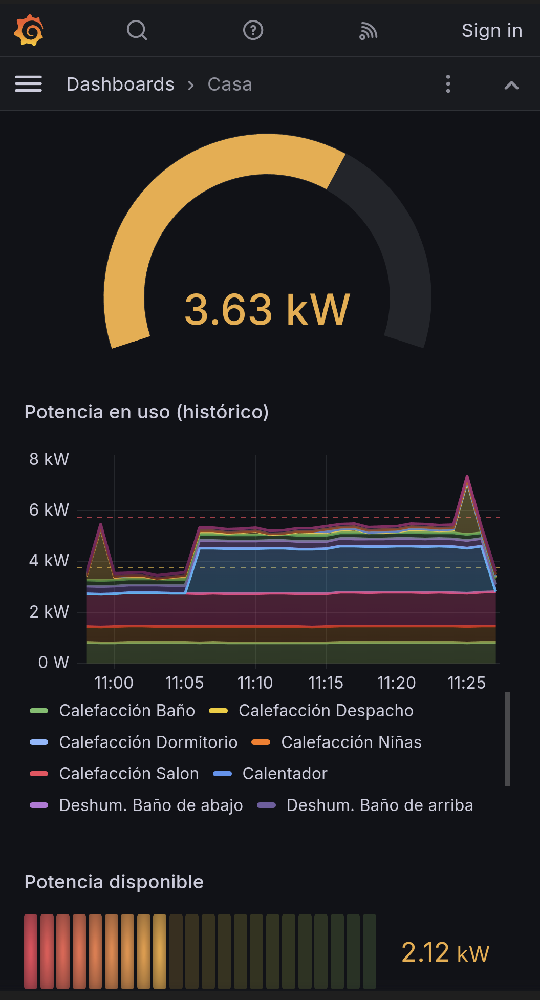

# Continuous Monitoring for TP-Link Tapo devices

In an old house with aging electrical wiring and a limited power contract, keeping power
consumption in check is quite necessary and can be a bit of a challenge. Some appliances are
very power-hungry for short periods of time, at unpredictable times throughout the day,
while others are running constantly and add up to a baseline that quietly takes a chunk
of the power budget.

A decent way to keep an eye on power consumption is offered by the
[TP-Link Tapo](https://www.tapo.com/en/) line of products, in particular their smart plugs
with energy monitoring and temperature and humidity sensors. These devices are relatively
easy to setup, reliable, discrete and not too expensive... although they do add up *fast*!

For all the smart features in these devices and the companion app, there is no way to
have a panoramic view of *aggregated* power consumption broken down by device, or to
configure thresholds based on the *aggregated* power consumption from all appliances.
Such panoramic view was not hard to implement by building on the
[Continuous Monitoring](../../conmon.md) solution previously built for monigoring
computing resources (already monitoring temperatures and power consumption).


<!-- more -->

## Monitoring for Tapo devices

Monitoring of these devices can be implemented, at least in Rust or Python, using the
Unofficial Tapo API Client at
[github.com/mihai-dinculescu/tapo](https://github.com/mihai-dinculescu/tapo/?tab=readme-ov-file#tapo).
This library has been tested with many devices, including all those already in use in
this house and those that may be used in the future:

*   [H100](https://www.tapo.com/en/product/smart-hub/tapo-h100/)
    *Smart Hub with Chime* located in the office, where its powered by an UPS
    for 24x7 availability and *very conveniently* close to me, so I can hear it chime. 
*   [T100](https://www.tapo.com/en/product/smart-sensor/tapo-t100/v1/)
    *Smart Motion Sensor* hanging around the front door, to alert me when someone is
    coming up the house, in case I don't hear the bell.
*   [T310](https://www.tapo.com/en/product/smart-sensor/tapo-t310/v1/)
    *Smart Temperature & Humidity Sensor*, needed in most rooms around the house,
    because in a house with multiple floors and different exposure to sun and wind,
    temperature and humidity *do* vary greatly across rooms.
*   [P100](https://www.tapo.com/en/product/smart-plug/tapo-p100/v1/)
    *Mini Smart Wi-Fi Socket* **without** *Energy Monitoring*, ordered by mistake
    and not yet of great use; there are no low-power appliances wanting remote control.
*   [P110](https://www.tapo.com/en/product/smart-plug/tapo-p110/v1/)
    *Mini Smart Wi-Fi Socket, Energy Monitoring*, slightly cheaper and bulkier than...
*   [P115](https://www.tapo.com/en/product/smart-plug/tapo-p115/v1/)
    *Mini Smart Wi-Fi Socket, Energy Monitoring*, by far my favorite monitoring and
    remote control device, slightly more expensive than the P110 but fits *anywhere*.
*   [P304M](https://www.tp-link.com/uk/home-networking/smart-plug/tapo-p304m/)
    *Smart Wi-Fi Power Strip, Energy Monitoring*, apparently only available in the UK
    as of the end of 2024 but hopefully available in more regions soon. This would make
    a great replacement for P110/P115 devices in a few places where multiple appliances
    require separate remote control.
*   [L900-5](https://www.tapo.com/en/product/smart-light-bulb/tapo-l900-5/)
    *Smart Wi-Fi Light Strip (5 m.)*, or maybe even
*   [L930-5](https://www.tapo.com/en/product/smart-light-bulb/tapo-l930-5/)
    *Smart Wi-Fi Light Strip, Multicolor* may be the one to brighten up my office. 

!!! note

    The Python library under 
    [`tapo-py`](https://github.com/mihai-dinculescu/tapo/tree/main/tapo-py) does not
    (yet) support a few interesting features of the
    [H100](https://www.tapo.com/en/product/smart-hub/tapo-h100/)
    *Smart Hub with Chime*, namely those that would allow sounding (and stopping) alarms.

The Python library can be installed via `pip`, along with a couple of other
[Python dependencies](../../conmon.md#python-dependencies).

### Smart Actions

The companion app supports creating *Smart Actions* to make these devices work together,
such as making the hub sound an alarm when the motion sensor is triggered, or turning a
plug on/off when the temperature and/or humidity in a room crosses a threshold.

Although this is not connected directly with the monitoring of power consumption,
it inspires me to think of *smart**er** actions*:

*   Turn off the boilder if total power use exceeds a threshold, so the total power
    consumption won't exceed the limited power contract.
*   Sound a chime when power consumption from an appliance matches a specific pattern,
    this can be used to detect when the washing machine has finished.
*   Sound an alarm when total power consumption crosses a threshold, because this can
    *and does* happen surprisingly often (a few times per day).

These may lead me to go down the rabbit hole of
[Home Assistant](https://www.home-assistant.io/), although support for Tapo devices in
the [TP-Link Smart Home](https://www.home-assistant.io/integrations/tplink) integration
seems to be missing all sensors, those are supported only by a separate integration at
[github.com/petretiandrea/home-assistant-tapo-p100](https://github.com/petretiandrea/home-assistant-tapo-p100).

## Implementation

Tapo devices sample values every 2 seconds, although this is only clearly advertised
for the temperature and humidity sensors. However, for a simple start, sampling once
per minute will be enough and makes it possible to run the monitoring script simply
from root's crontab:

``` console
root@raven:~# crontab -l
# m h  dom mon dow   command
  * * * * * /usr/local/bin/conmon-tapo.py
```

Thus the [`conmon-tapo.py`](../../conmon.md#conmon-tapopy) script reports temperature,
humidity and power use every minute, for those devices listed in the a configuration file
like [`tapo.yaml`](../../conmon.md#tapoyaml).

The code is based on several Python examples under
[`tapo-py/examples`](https://github.com/mihai-dinculescu/tapo/tree/main/tapo-py/examples),
in particular:

*   [`get_child_device_list()`](https://github.com/mihai-dinculescu/tapo/blob/main/tapo-py/examples/tapo_h100.py#L21)
    to get the list of devices paired with a hub, e.g. temperature and humidity sensors.
*   [`get_temperature_humidity_records()`](https://github.com/mihai-dinculescu/tapo/blob/main/tapo-py/examples/tapo_h100.py#L87C55-L87C87)
    to get values from temperature and humidity sensors.
*   [`get_current_power()`](https://github.com/mihai-dinculescu/tapo/blob/main/tapo-py/examples/tapo_p110.py#L34)
    to get values from smart plugs with energy monitoring.

The [`conmon-tapo.py`](../../conmon.md#conmon-tapopy) runs through 4 steps each time:

1.  Load a list of devices (with IP addresses) and other settings from a configuration file.
2.  Poll the devices for their latest values. Skip those that are unreadable.
3.  Synthesize measurements for *fake* devices; as encoded in the configuration file.
4.  Post measurements to an InfluxDB server,
    [tagged with the hostname](../../conmon.md#__codelineno-11-114) to differentiate
    devices across sites.

The tapo app allows creating multiple "homes" and "rooms" to track the location of
each device, but these attributes are not included in the device information returned
by `get_device_info()`.

??? json "Expand to see an example `device_info` result."

    ```json
    Device info: {
        "at_low_battery": false,
        "avatar": "balcony",
        "bind_count": 1,
        "category": "subg.trigger.temp-hmdt-sensor",
        "current_humidity": 81,
        "current_humidity_exception": 21,
        "current_temp": 13.199999809265137,
        "current_temp_exception": -6.800000190734863,
        "device_id": "802EB916B90AEB800E30246DF68C303322310766",
        "fw_ver": "1.5.0 Build 230105 Rel.150707",
        "hw_id": "2AE1228C7CE042A310FC70EA70D7A788",
        "hw_ver": "1.0",
        "jamming_rssi": -116,
        "jamming_signal_level": 1,
        "lastOnboardingTimestamp": 1723047115,
        "mac": "98254A51E05C",
        "nickname": "Exterior",
        "oem_id": "02F7CFFC203A7E622F6EA84BBB74C68F",
        "parent_device_id": "802D84BECDA15417AA1BD7CF881AEE6622451CF8",
        "region": "Europe/Madrid",
        "report_interval": 16,
        "rssi": -86,
        "signal_level": 1,
        "specs": "EU",
        "status": "online",
        "status_follow_edge": false,
        "temp_unit": "celsius",
        "type": "SMART.TAPOSENSOR"
    }
    ```

### Failing gracefully

The Python library relies on client applications to handle any and all exceptions,
which can sometimes lead to very crypt stack traces. See
[Device IP dependencies](../../conmon.md#device-ip-dependencies)
for those encountered so far, *Trying to read a P115 like it was an H100* produced a
particularly unique stack trace.

Such exceptions can be triggered by power loss (devide not reachable) or their IP
addresses changing (device refusing connection or causing other errors). Since all
those are events that *do* happen and not entirely under control, the script has a
very largey `try-expect-else` block to simply skip devices whenever fetching data fails.
If the device was only temporarly unavailable, its values will be fetched next time.

When devices have their IP address changed, it is necessary to update the configuration
files to update the relevant `devices[].ip` values. There is a feature request to
[Support client.getDeviceList](https://github.com/mihai-dinculescu/tapo/issues/208)
so that devices can be detected when their IP addresses change; in the mean time,
[this comment](https://github.com/mihai-dinculescu/tapo/issues/208#issuecomment-2173995264)
provides a few ideas to implement device discovery.

### Always-on appliances

There are several appliances in the house that operate essentially 24x7 with a fairly
constant power consumption. A common example in humid climates are dehumidifiers running
constantly, with a power consumption typically between 150 and 300 W. Computers also have
relativly constant power consumption, except during periods of high CPU or GPU load.

Instead of having all these appliances *actually* monitored with a dedicated smart plug
with energy monitoring (P110 or P115), they can be *hard-coded* in the configuration
file under `always_on`.

This can be used for appliances that go on and off at regular intervals, such as a
refrigerator that runs the compressor for about 10 minutes every 20-30 minutes,
consuming about 80 W each time. This is only the low-power cycle to maintain the
internal temperature. When the refrigerator is not opened; the compressor will run
for a longer time and/or draw more power (about 400 W) when the refrigerator is
refilled with groceries that are not cold.

### Rarely-on appliances

Smaller appliances that are used sporadically are not monitored at all, but they also
tend to be significantly power-hungry (especially in the kitchen). This is where the
*available power* metric comes in handy: substract the total current power consumption
from the contracted power rate, then compare this difference with what the appliance
will need.

*What what will appliance X need?* This can be measured with one of the P110 or P115
plugs once or twice to get a reading of each of these appliance's *typical power needs*,
then a simple paper note stuck on the appliance with the number should serve as a reminder
to check whether there is currently enough power available.

#### Adjustable appliances

Electric heaters, hair dryers and other power-hungry, adjustable appliances would need
a slightly bigger paper note stuck on them to indicate what their power consumption is
depending on each adjustable setting. Some appliances don't really need this though,
for instance a small toaster will draw the same power (e.g. 750 W) while it's on, its
adjustment changing only the *duration*.

This *should be practical enough* thanks to how well the dashboard shows on mobile screens: 



## A more long-term database

InfluxDB database for [Continuous Monitoring](../../conmon.md) was set up with a
[`30 days retention policy](2024-04-20-monitoring-with-influxdb-and-grafana-on-kubernetes.md#conmon-migration)
which would not be enough to capture long-term trends from sensors data.
At times it was found also slightly too, a more generous 90 days should do nicely,
after all the current database takes only 1.3 GB of disk space.

For the monitoring of temperature, humidity and power consumption, create a new database
(e.g. `home`) with a much larger retention policy of **5 years**:

``` console
$ influx -host localhost -port 30086 -username admin -password xxxxxxxxxx
Connected to http://localhost:30086 version 1.8.10
InfluxDB shell version: 1.6.7~rc0

> CREATE DATABASE home
> USE home
Using database home
> CREATE RETENTION POLICY "5_years" ON "home" DURATION 2000d REPLICATION 1
> ALTER RETENTION POLICY "5_years" on "home" DURATION 2000d REPLICATION 1 DEFAULT
> SHOW RETENTION POLICIES ON home
name    duration   shardGroupDuration replicaN default
----    --------   ------------------ -------- -------
autogen 0s         168h0m0s           1        false
5_years 48000h0m0s 168h0m0s           1        true

> USE monitoring
Using database monitoring
> CREATE RETENTION POLICY "90_days" ON "monitoring" DURATION 90d REPLICATION 1
> ALTER RETENTION POLICY "90_days" on "monitoring" DURATION 90d REPLICATION 1 DEFAULT
> SHOW RETENTION POLICIES ON monitoring
name    duration  shardGroupDuration replicaN default
----    --------  ------------------ -------- -------
autogen 0s        168h0m0s           1        false
90_days 2160h0m0s 24h0m0s            1        true
```

!!! warning

    **Do NOT `DROP RETENTION POLICY`** before copying measurements over to the new one,
    otherwise [`DROP RETENTION POLICY`](https://docs.influxdata.com/influxdb/v1/query_language/manage-database/#delete-retention-policies-with-drop-retention-policy)
    **will permanently delete all measurements** and data stored in the retention policy.

With the new database ready, all that is left to do is update the configuration file to set
`influxdb.database: "home"` and the script will immediately start pushing measurements to
the new database, because the configuration file is reloaded on every run.

### Copy measurements over

Old measurements are still in the `monitoring` database, leaving the graphs empty until new
data fills them back in. In the mean time, it is possible to
[copy measurments across databases](https://community.influxdata.com/t/copy-measurment-to-another-db-with-new-measurment-name/20459/9)
using
[the INTO clause](https://docs.influxdata.com/influxdb/v1/query_language/explore-data/#the-into-clause):

``` console
$ influx -host localhost -port 30086 -username admin -password xxxxxxxxxx
Connected to http://localhost:30086 version 1.8.10
InfluxDB shell version: 1.6.7~rc0

> USE home
Using database home

> show MEASUREMENTS
name: measurements
name
----
inet_down
inet_ping
inet_up
tapo_current_power
tapo_humidity
tapo_temperature

> SELECT * INTO "home"."5_years"."tapo_current_power" FROM "monitoring"."90_days"."tapo_current_power" GROUP BY *
name: result
time written
---- -------
0    210

> SELECT * INTO "home"."5_years"."tapo_humidity" FROM "monitoring"."90_days"."tapo_humidity" GROUP BY *
name: result
time written
---- -------
0    85

> SELECT * INTO "home"."5_years"."tapo_temperature" FROM "monitoring"."90_days"."tapo_temperature" GROUP BY *
name: result
time written
---- -------
0    85

```

That should make the charts look less empty, having copied data back to 12/28 23:00:35.

!!! note

    If that seems like a suspiciously small amount of data, it's because it is.
    See that warning up there about **not** dropping a retention policy?
    *Ask me how I know.*

## Import older historical data

It is possible to
[export history data from Tapo temperature & humidity sensor](https://www.tapo.com/en/faq/606/)
and receive CSV files via e-mail. In terms of retention policy and granularity, *data is
stored for up to 2 calendar years* but *when the interval is set to 1 minute, only the data
for the most recent month can be exported*. Still good enough to see seasonal patterns.

There is also an option to export energy monitoring data, but it is much more limited:
"all" energy data that can be exported (via e-mail in `.xls` files) is limited to the
last 24 hours in 15-minute intervals and the last 7 days in 1-hour intervals. 

Both options to export data send files that do not contain any reference as to
*which device* the data is from. It is thus necessary to organize those files in
some way that allows recovering those details later; each file needs to be mapped
to the `model` and `nickname` of the relevant device. Since the `model` is only a
single word, the files can be stored in directories named after the `model` and
`nickname` separated by a blank space, e.g.

```
T315 Exterior/
    1-min.csv  15-min.csv
P115 PC/
    'Energy Usage.xls'   Power.xls
```

This will require a new script to load data from these CSV and XLS files and push
measurements to InfluxDB. For the time being, having exported all available data
once the above setup is stable, this can be left for later as part of...

## Future improvements

These are ideas to implement in the future, *very roughly* sorted by priority:

1.  Create script to *react* to the total power consumption going above a threshold by
    turning off the less critical appliances (e.g. a boiler) to keep the more critical
    appliances running.
1.  Add monitoring for devices with `at_low_battery: true` (poll daily).
1.  Ingest historical data from exported CSV and XLS files from the Tapo app.
1.  Add support daily periods on `always_on` (e.g. always on during the night).
    *   [P100](https://www.tapo.com/en/product/smart-plug/tapo-p100/v1/)
        *Mini Smart Wi-Fi Socket* **without** *Energy Monitoring* devices may be useful
        to make a couple of appliances go off/on at a fixed schedule.
1.  Make the script adapt its *reporting rate*; but report only very 1 minute when
    there are no changes, to skip repeated values within each sensible tolerances.
    *   [T310](https://www.tapo.com/en/product/smart-sensor/tapo-t310/v1/#tapo-product-spec)
        *Smart Temperature & Humidity Sensor* specifies *Accuracy: ±0.3 °C, ±3% RH*
        but monitoring so far shows the sensors are *precise* enough to keep
        measurements steady over time, so we can use the *reporting accuracy* of
        **±0.1 °C, ±1% RH**.
    *   [P115](https://www.tapo.com/en/product/smart-plug/tapo-p115/v1/#tapo-product-spec)
        *Mini Smart Wi-Fi Socket, Energy Monitoring* does not specify the accuracy of
        measurements, so again we can use the *reporting accuracy* of 1 W for values
        under 1000 W and 10 W for values above 1000 W, of simply **10 W** for all values.
1.  Make the script adapt its *polling rate*; start polling every 2 seconds,
    then adjust to each device's `report_interval`.
1.  Add discovery of new devices to cope with IP address changes.
1.  Create script to export minimal data over to Pi Pico or ESP32.
1.  Find a way to update the list of `always_on` devices on demand.
