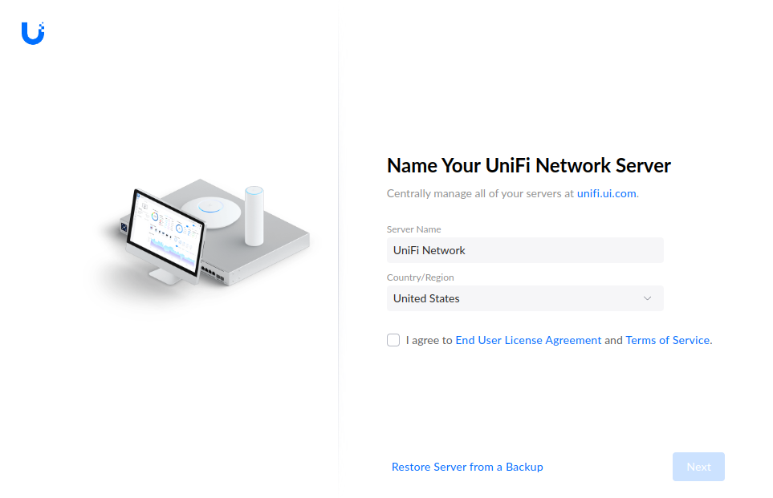

The old UniFi Controller and its required Mongo DB have been a bit
of a hassle to keep updated while running directly on the host OS in
[my little homelab server](./2022-07-03-low-effort-homelab-server-with-ubuntu-server-on-intel-nuc.md),
so the time has come to migrate this to the new
[linuxserver.io/docker-unifi-network-application](https://docs.linuxserver.io/images/docker-unifi-network-application/)
[~~on my little Kubernetes cluster~~](./2023-03-25-single-node-kubernetes-cluster-on-ubuntu-server-lexicon.md)
[on my *new* Kubernetes cluster](./2025-04-12-kubernetes-homelab-server-with-ubuntu-server-24-04-octavo.md).

!!! warning

    Beware of outdated documentation, most articles out there like
    [Install Unifi Controller on Kubernetes](https://anakinfoxe.com/blog/install-unifi-on-k8s/),
    are based on the **deprecated**
    [linuxserver/unifi-**controller**](https://hub.docker.com/r/linuxserver/unifi-controller),
    while others like
    [setting up the UniFi Network Controller using Docker](https://pimylifeup.com/unifi-docker/)
    are using
    [jacobalberty/unifi-docker](https://github.com/jacobalberty/unifi-docker)
    which was quite outdated until recently.

<!-- more -->

## Deploy the Unifi Network Application

### System requirements

The Unifi Network Application requires a Mongo DB backend
and both will need writeable directories and a dedicated user:

``` console
# groupadd unifi -g 119
# useradd  unifi -u 119 -g 119 -s /usr/sbin/nologin
# mkdir -p /home/k8s/unifi/config /home/k8s/unifi/mongodb
# vi /home/k8s/unifi/init-mongo.sh
# chown -R unifi:unifi /home/k8s/unifi
# ls -lan /home/k8s/unifi
total 4
drwxr-xr-x 1 119 119  52 Dec 31 16:06 .
drwxr-xr-x 1   0   0 264 Dec 31 16:05 ..
drwxr-xr-x 1 119 119   0 Dec 31 16:05 config
-rw-r--r-- 1 119 119 425 Dec 31 16:06 init-mongo.sh
drwxr-xr-x 1 119 119   0 Dec 31 16:05 mongodb
```

Note the UID/GID (**119**) to be used later.

Create the script `/home/k8s/unifi/init-mongo.sh` using the exact
content from the 
[Setting Up Your External Database](https://docs.linuxserver.io/images/docker-unifi-network-application/#setting-up-your-external-database)
documentation of
[linuxserver/unifi-network-application](https://docs.linuxserver.io/images/docker-unifi-network-application):

``` bash linenums="1" title="/home/k8s/unifi/init-mongo.sh"
#!/bin/bash

if which mongosh > /dev/null 2>&1; then
  mongo_init_bin='mongosh'
else
  mongo_init_bin='mongo'
fi
"${mongo_init_bin}" <<EOF
use ${MONGO_AUTHSOURCE}
db.auth("${MONGO_INITDB_ROOT_USERNAME}", "${MONGO_INITDB_ROOT_PASSWORD}")
db.createUser({
  user: "${MONGO_USER}",
  pwd: "${MONGO_PASS}",
  roles: [
    { db: "${MONGO_DBNAME}", role: "dbOwner" },
    { db: "${MONGO_DBNAME}_stat", role: "dbOwner" }
  ]
})
EOF
```

### Kubernetes deployment

There is no ready-to-use Kubernetes deployment in the documentation of
[linuxserver/unifi-network-application](https://docs.linuxserver.io/images/docker-unifi-network-application), or anywhere else I could find.
The following deployment is based on the
[recommended docker-compose](https://docs.linuxserver.io/images/docker-unifi-network-application/#docker-compose-recommended-click-here-for-more-info)
and parts of previous Kubernetes deployments:

*   [Plex Media Server](2023-09-16-migrating-a-plex-media-server-to-kubernetes.md#kubernetes)
    mounts multiple directories and exposes multiple TCP and UDP ports.
*   [InfluxDB and Grafana](2024-04-20-monitoring-with-influxdb-and-grafana-on-kubernetes.md#kubernetes-deployment)
    has services that depend on conneting with others over HTTP.
*   [Audiobookshelf](2024-02-28-audiobookshelf-on-kubernetes.md#deployment)
    has the `websocket` requirement.
*   [Kubernetes Dashboard](2023-03-25-single-node-kubernetes-cluster-on-ubuntu-server-lexicon.md#dashboard)
    enables HTTPS in the backend and disables TLS validation.

In addition to deploying the right set of objects, there are very specific requirements
in terms of which version of MongoDB can be used depending on the version of the UniFi
Network Application that is deployed. Check the correct pairs of versions under the
**Additional information** section of the latest release of UniFi Network Application in
[the latest linuxserver/unifi-network-application release](https://hub.docker.com/r/linuxserver/unifi-network-application/tags);
e.g. [9.0.114](https://community.ui.com/releases/UniFi-Network-Application-9-0-114/35b6e9ac-f63d-46c9-bbbe-74a4a61ac95f) specifies that
*Version 9.0 and newer supports up to MongoDB 8.0* and those are the versions used here.

??? k8s "UniFi Network Application deployment."

    ``` yaml linenums="1" title="unifi-network-app.yaml"
    apiVersion: v1
    kind: Namespace
    metadata:
      name: unifi
    ---
    apiVersion: v1
    kind: PersistentVolume
    metadata:
      name: mongo-pv-data
      namespace: unifi
    spec:
      storageClassName: manual
      capacity:
        storage: 1Gi
      accessModes:
        - ReadWriteOnce
      persistentVolumeReclaimPolicy: Retain
      hostPath:
        path: /home/k8s/unifi/mongodb
    ---
    apiVersion: v1
    kind: PersistentVolume
    metadata:
      name: mongo-pv-init
      namespace: unifi
    spec:
      storageClassName: manual
      capacity:
        storage: 1Gi
      accessModes:
        - ReadWriteOnce
      persistentVolumeReclaimPolicy: Retain
      hostPath:
        path: /home/k8s/unifi/init-mongo.sh
    ---
    apiVersion: v1
    kind: PersistentVolumeClaim
    metadata:
      name: mongo-pvc-data
      namespace: unifi
    spec:
      storageClassName: manual
      volumeName: mongo-pv-data
      accessModes:
        - ReadWriteOnce
      volumeMode: Filesystem
      resources:
        requests:
          storage: 1Gi
    ---
    apiVersion: v1
    kind: PersistentVolumeClaim
    metadata:
      name: mongo-pvc-init
      namespace: unifi
    spec:
      storageClassName: manual
      volumeName: mongo-pv-init
      accessModes:
        - ReadWriteOnce
      volumeMode: Filesystem
      resources:
        requests:
          storage: 1Gi
    ---
    apiVersion: apps/v1
    kind: Deployment
    metadata:
      name: mongo
      namespace: unifi
    spec:
      selector:
        matchLabels:
          app: mongo
      replicas: 1
      strategy:
        type: RollingUpdate
        rollingUpdate:
          maxSurge: 1
          maxUnavailable: 1
      template:
        metadata:
          labels:
            app: mongo
        spec:
          containers:
          - image: docker.io/mongo:8.0.0
            imagePullPolicy: IfNotPresent
            name: mongo
            env:
            - name: "MONGO_AUTHSOURCE"
              value: "admin"
            - name: "MONGO_DBNAME"
              value: "unifi"
            - name: "MONGO_INITDB_ROOT_USERNAME"
              value: "root"
            - name: "MONGO_INITDB_ROOT_PASSWORD"
              value: "*************************"
            - name: "MONGO_PASS"
              value: "*************************"
            - name: "MONGO_USER"
              value: "unifi"
            ports:
            - containerPort: 27017
            volumeMounts:
            - mountPath: /data/db
              name: mongo-data
            - mountPath: /docker-entrypoint-initdb.d/init-mongo.sh
              name: mongo-init
          securityContext:
            runAsUser: 119
            runAsGroup: 119
          volumes:
          - name: mongo-data
            persistentVolumeClaim:
              claimName: mongo-pvc-data
          - name: mongo-init
            persistentVolumeClaim:
              claimName: mongo-pvc-init
    ---
    apiVersion: v1
    kind: Service
    metadata:
      labels:
        app: mongo
      name: mongo-svc
      namespace: unifi
    spec:
      ports:
      - port: 27017
        protocol: TCP
        targetPort: 27017
        nodePort: 32717
      selector:
        app: mongo
      type: NodePort

    ---
    apiVersion: v1
    kind: PersistentVolume
    metadata:
      name: unifi-pv-config
      namespace: unifi
    spec:
      storageClassName: manual
      capacity:
        storage: 1Gi
      accessModes:
        - ReadWriteOnce
      persistentVolumeReclaimPolicy: Retain
      hostPath:
        path: /home/k8s/unifi/config
    ---
    apiVersion: v1
    kind: PersistentVolumeClaim
    metadata:
      name: unifi-pvc-config
      namespace: unifi
    spec:
      storageClassName: manual
      volumeName: unifi-pv-config
      accessModes:
        - ReadWriteOnce
      volumeMode: Filesystem
      resources:
        requests:
          storage: 1Gi
    ---
    apiVersion: apps/v1
    kind: Deployment
    metadata:
      name: unifi
      namespace: unifi
    spec:
      selector:
        matchLabels:
          app: unifi
      replicas: 1
      strategy:
        type: RollingUpdate
        rollingUpdate:
          maxSurge: 1
          maxUnavailable: 1
      template:
        metadata:
          labels:
            app: unifi
        spec:
          containers:
          - image: lscr.io/linuxserver/unifi-network-application:9.0.114
            imagePullPolicy: IfNotPresent
            name: unifi
            env:
            - name: "PUID"
              value: "119"
            - name: "PGID"
              value: "119"
            - name: TZ
              value: Europe/Amsterdam
            - name: "MONGO_AUTHSOURCE"
              value: "admin"
            - name: "MONGO_DBNAME"
              value: "unifi"
            - name: "MONGO_PASS"
              value: "*************************"
            - name: "MONGO_USER"
              value: "unifi"
            - name: "MONGO_HOST"
              value: "mongo-svc"
            - name: "MONGO_PORT"
              value: "27017"
            ports:
            - containerPort: 6789
              name: mob-speedtest
              protocol: TCP
            - containerPort: 8080
              name: device-inform
              protocol: TCP
            - containerPort: 8443
              name: web-ui
              protocol: TCP
            - containerPort: 1900
              name: ssdp
              protocol: UDP
            - containerPort: 3478
              name: stun
              protocol: UDP
            - containerPort: 10001
              name: ap-discovery
              protocol: UDP
            volumeMounts:
            - mountPath: /config
              name: unifi-config
          volumes:
          - name: unifi-config
            persistentVolumeClaim:
              claimName: unifi-pvc-config
    ---
    kind: Service
    apiVersion: v1
    metadata:
      name: unifi-tcp
      namespace: unifi
      annotations:
        metallb.universe.tf/allow-shared-ip: unifi
    spec:
      type: LoadBalancer
      loadBalancerIP: 192.168.0.173
      ports:
      - name: mob-speedtest
        protocol: TCP
        port: 6789
        targetPort: 6789
      - name: device-inform
        protocol: TCP
        port: 8080
        targetPort: 8080
      - name: web-ui
        protocol: TCP
        port: 8443
        targetPort: 8443
      selector:
        app: unifi
    ---
    apiVersion: v1
    kind: Service
    metadata:
      name: unifi-udp
      namespace: unifi
      annotations:
        metallb.universe.tf/allow-shared-ip: unifi
    spec:
      type: LoadBalancer
      loadBalancerIP: 192.168.0.173
      ports:
        - name: stun
          protocol: UDP
          port: 3478
          targetPort: 3478
        - name: ap-discovery
          protocol: UDP
          port: 10001
          targetPort: 10001
        - name: ssdp
          protocol: UDP
          port: 1900
          targetPort: 1900
      selector:
        app: unifi
    ---
    apiVersion: networking.k8s.io/v1
    kind: Ingress
    metadata:
      name: unifi-ingress
      namespace: unifi
      annotations:
        acme.cert-manager.io/http01-edit-in-place: "true"
        cert-manager.io/issue-temporary-certificate: "true"
        cert-manager.io/cluster-issuer: letsencrypt-prod
        nginx.ingress.kubernetes.io/websocket-services: unifi-tcp
        nginx.ingress.kubernetes.io/backend-protocol: HTTPS
        nginx.ingress.kubernetes.io/auth-tls-verify-client: "false"
        nginx.ingress.kubernetes.io/whitelist-source-range: 10.244.0.0/16
    spec:
      ingressClassName: nginx
      rules:
        - host: uni.ssl.uu.am
          http:
            paths:
              - path: /
                pathType: Prefix
                backend:
                  service:
                    name: unifi-tcp
                    port:
                      number: 8443
      tls:
        - secretName: tls-secret
          hosts:
            - uni.ssl.uu.am
    ```

### Troubleshooting

Putting this deployment together was a bit of a process,
so here are some notes and warnings about the troubles
that had to be sorted out along the way:

!!! warning

    Double-check that the Unifi Application data directory is mounted
    **exactly** on `/config`; otherwise the application will create an
    ephemeral directory that will be discarded when restarting the pod.
    Once this data is lost, the application has to be setup again, and
    every access point adopted since the last backup has to be factory
    reset to be readopted.

??? note "This Unifi image does not support running rootless."

    Attempting to set `securityContext` (as is done for the `mongodb`
    image) will result in fatal errors and crash-loop:

    ```
    s6-overlay-suexec: warning: unable to gain root privileges (is the suid bit set?)
    s6-mkdir: warning: unable to mkdir /run/s6: Permission denied
    s6-mkdir: warning: unable to mkdir /run/service: Permission denied
    s6-overlay-suexec: fatal: child failed with exit code 111
    ```

??? note "This image does not seem to use the `system.properties` files."

    The `~MONGO_...~` strings in the `system.properties` files
    [should be replaced](https://github.com/linuxserver/docker-unifi-network-application/blob/main/root/etc/s6-overlay/s6-rc.d/init-unifi-network-application-config/run#L48-L52)
    with the values of the environment variables set in the
    deployment, but they are not:

    ``` console
    $ kubectl -n unifi exec \
      $(kubectl get pods -n unifi | grep unifi | cut -f1 -d' ') \
      -- cat /defaults/system.properties | grep MONGO
    db.mongo.uri=mongodb://~MONGO_USER~:~MONGO_PASS~@~MONGO_HOST~:~MONGO_PORT~/~MONGO_DBNAME~?tls=~MONGO_TLS~~MONGO_AUTHSOURCE~
    statdb.mongo.uri=mongodb://~MONGO_USER~:~MONGO_PASS~@~MONGO_HOST~:~MONGO_PORT~/~MONGO_DBNAME~_stat?tls=~MONGO_TLS~~MONGO_AUTHSOURCE~
    unifi.db.name=~MONGO_DBNAME~

    $ kubectl -n unifi exec \
      $(kubectl get pods -n unifi | grep unifi | cut -f1 -d' ') \
      -- cat /config/data/system.properties
    cat: /config/data/system.properties: No such file or directory
    command terminated with exit code 1
    ```

    Yet the environment variables are correctly set in the running pod:

    ``` console
    $ kubectl -n unifi exec \
      $(kubectl get pods -n unifi | grep unifi | cut -f1 -d' ') \
      -- printenv | grep MONGO
    MONGO_PORT=27017
    MONGO_PASS=*************************
    MONGO_USER=unifi
    MONGO_HOST=mongo-svc
    MONGO_AUTHSOURCE=admin
    MONGO_DBNAME=unifi
    MONGO_SVC_SERVICE_PORT=27017
    MONGO_SVC_PORT_27017_TCP_ADDR=10.104.94.112
    MONGO_SVC_PORT=tcp://10.104.94.112:27017
    MONGO_SVC_PORT_27017_TCP_PROTO=tcp
    MONGO_SVC_SERVICE_HOST=10.104.94.112
    MONGO_SVC_PORT_27017_TCP=tcp://10.104.94.112:27017
    MONGO_SVC_PORT_27017_TCP_PORT=27017

    $ kubectl -n unifi exec \
      $(kubectl get pods -n unifi | grep unifi | cut -f1 -d' ') \
      -- cat /run/s6/container_environment/MONGO_PORT
    27017
    ```

??? warning "Pay close attention to how the pods are connected."

    Misconfiguration in either the Mongo DB service port or the
    `MONGO_HOST` value in the Unify deployment can easily lead to
    the Unifi application failing to start because it's not able to
    connect to MondoDB:

    ``` console hl_lines="32"
    $ kubectl -n unifi logs \
      $(kubectl get pods -n unifi | grep unifi | cut -f1 -d' ') -f
    [migrations] started
    [migrations] no migrations found
    ───────────────────────────────────────

          ██╗     ███████╗██╗ ██████╗
          ██║     ██╔════╝██║██╔═══██╗
          ██║     ███████╗██║██║   ██║
          ██║     ╚════██║██║██║   ██║
          ███████╗███████║██║╚██████╔╝
          ╚══════╝╚══════╝╚═╝ ╚═════╝

      Brought to you by linuxserver.io
    ───────────────────────────────────────

    To support LSIO projects visit:
    https://www.linuxserver.io/donate/

    ───────────────────────────────────────
    GID/UID
    ───────────────────────────────────────

    User UID:    119
    User GID:    119
    ───────────────────────────────────────
    Linuxserver.io version: 8.6.9-ls73
    Build-date: 2024-12-24T17:37:56+00:00
    ───────────────────────────────────────
        
    *** Waiting for MONGO_HOST mongo-svc to be reachable. ***
    *** Defined MONGO_HOST mongo-svc is not reachable, cannot proceed. ***
    ```

    The environment variables are correctly set in the running pod:

    ``` console
    $ kubectl -n unifi exec \
      $(kubectl get pods -n unifi | grep unifi | cut -f1 -d' ') \
      -- nc -zv mongo-svc 27017
    nc: connect to mongo-svc (10.104.94.112) port 27017 (tcp) failed: Connection refused
    command terminated with exit code 1
    ```

    The service is reachable instead of `mongo-svc:27017`
    **only** when the `mongo` deployment has `targetPort: 27017`

    ``` console
    $ kubectl -n unifi exec \
      $(kubectl get pods -n unifi | grep unifi | cut -f1 -d' ') \
      -- nc -zv mongo-svc.unifi 27017
    Connection to mongo-svc.unifi (10.104.94.112) 27017 port [tcp/*] succeeded!
    ```

??? warning "Clear the Mondo DB every time deployment fails."

    Scripts in the `/docker-entrypoint-initdb.d` folder will be executed
    **only** if the database has never been initialized before. If the
    deployment fails at any point, delete the contents of
    `/home/k8s/unifi/mongodb` so right before reapplying the deployment.

    Otherwise, if the database has been previously incorrectly intialized,
    the user `unifi` will not be found and the `unifi` application will be
    constantly re-trying and logging authentication errors:

    ``` console hl_lines="38"
    $ kubectl -n unifi logs \
      $(kubectl get pods -n unifi | grep unifi | cut -f1 -d' ') -f
    [migrations] started
    [migrations] no migrations found
    ───────────────────────────────────────

          ██╗     ███████╗██╗ ██████╗
          ██║     ██╔════╝██║██╔═══██╗
          ██║     ███████╗██║██║   ██║
          ██║     ╚════██║██║██║   ██║
          ███████╗███████║██║╚██████╔╝
          ╚══════╝╚══════╝╚═╝ ╚═════╝

      Brought to you by linuxserver.io
    ───────────────────────────────────────

    To support LSIO projects visit:
    https://www.linuxserver.io/donate/

    ───────────────────────────────────────
    GID/UID
    ───────────────────────────────────────

    User UID:    119
    User GID:    119
    ───────────────────────────────────────
    Linuxserver.io version: 8.6.9-ls73
    Build-date: 2024-12-24T17:37:56+00:00
    ───────────────────────────────────────
        
    *** Waiting for MONGO_HOST mongo-svc.unifi to be reachable. ***
    Generating 4,096 bit RSA key pair and self-signed certificate (SHA384withRSA) with a validity of 3,650 days
            for: CN=unifi
    [custom-init] No custom files found, skipping...
    Exception in thread "launcher" java.lang.IllegalStateException: Tomcat failed to start up
    Caused by: org.springframework.beans.factory.BeanCreationException: Error creating bean with name 'mongoRuntimeService' defined in com.ubnt.service.db.CoreDatabaseSpringContext: Exception authenticating MongoCredential{mechanism=SCRAM-SHA-1, userName='unifi', source='admin', password=<hidden>, mechanismProperties=<hidden>}
    Caused by: com.mongodb.MongoSecurityException: Exception authenticating MongoCredential{mechanism=SCRAM-SHA-1, userName='unifi', source='admin', password=<hidden>, mechanismProperties=<hidden>}
    Caused by: com.mongodb.MongoCommandException: Command failed with error 18 (AuthenticationFailed): 'Authentication failed.' on server mongo-svc.unifi:27017. The full response is {"ok": 0.0, "errmsg": "Authentication failed.", "code": 18, "codeName": "AuthenticationFailed"}
    ```

    *The full response* is in JSON format; it doesn't tell much:

    ``` json
    {
      "ok": 0,
      "errmsg": "Authentication failed.",
      "code": 18,
      "codeName": "AuthenticationFailed"
    }
    ```

    The reason behind the error is clearly stated in the Mondo DB logs,
    which are conveniently in JSON format so they can be piped to `jq`:

    ``` console
    $ kubectl -n unifi logs \
      $(kubectl get pods -n unifi | grep mongo | cut -f1 -d' ') \
      | grep ACCESS | head -2 | jq
    ```
    ``` json hl_lines="30"
    {
      "t": {
        "$date": "2024-12-31T20:18:09.557+00:00"
      },
      "s": "I",
      "c": "ACCESS",
      "id": 20251,
      "ctx": "conn3",
      "msg": "Supported SASL mechanisms requested for unknown user",
      "attr": {
        "user": "unifi@admin"
      }
    }
    {
      "t": {
        "$date": "2024-12-31T20:18:09.558+00:00"
      },
      "s": "I",
      "c": "ACCESS",
      "id": 20249,
      "ctx": "conn3",
      "msg": "Authentication failed",
      "attr": {
        "mechanism": "SCRAM-SHA-256",
        "speculative": true,
        "principalName": "unifi",
        "authenticationDatabase": "admin",
        "remote": "10.244.0.85:53330",
        "extraInfo": {},
        "error": "UserNotFound: Could not find user \"unifi\" for db \"admin\""
      }
    }
    ```

    The user `unifi` was not found because the database was not initialized
    correctly, because it failed to initialize in a previous iteration,
    because the `mongo-init` volume containing the script was not mounted
    in the `mongo` container.

??? warning "Make sure to enable HTTPS backend protocol in Nginx."

    Otherwise, Nginx will be unable to connect to unifi because it will
    reject plain HTTP requests on port 8443:

    ```
    Bad Request
    This combination of host and port requires TLS.
    ```

    The (better) solution is to enable HTTPS as the backend protocol and
    [instruct Nginx to skip TLS certification validation](https://docs.linuxserver.io/FAQ/#strict-proxy).
    This is what the
    [Kubernetes Dashboard](2023-03-25-single-node-kubernetes-cluster-on-ubuntu-server-lexicon.md#dashboard)
    deployment does as well; in fact that's where I found those 3 lines.

??? warning "Do not bother trying to enable plain HTTP UI on port 8880."

    [Since UniFi 8.2](https://community.ui.com/questions/Unifi-Network-Server-8-2-unable-to-be-configured-for-HTTP-only/f0218132-a423-4b1d-a848-1facb7cdd985)
    (at least) it is no longer possible to
    [disable the HTTP to HTTPS redirect](https://community.ui.com/questions/UniFi-controller-on-HTTP-No-HTTPS-the-solution/cf93c093-c87f-484f-b833-363446983c04).

### Final result

Apply the deployment and wait a few minutes for services to start:

``` console
$ kubectl apply -f unifi-network-app.yaml
namespace/unifi created
persistentvolume/mongo-pv-data created
persistentvolume/mongo-pv-init created
persistentvolumeclaim/mongo-pvc-data created
persistentvolumeclaim/mongo-pvc-init created
deployment.apps/mongo created
service/mongo-svc created
persistentvolume/unifi-pv-config created
persistentvolumeclaim/unifi-pvc-config created
deployment.apps/unifi created
service/unifi-tcp created
service/unifi-udp created
ingress.networking.k8s.io/unifi-ingress created
```

``` console
$ kubectl get all -n unifi
NAME                            READY   STATUS    RESTARTS   AGE
pod/cm-acme-http-solver-w26rm   1/1     Running   0          36s
pod/mongo-564774d869-dfk7h      1/1     Running   0          36s
pod/unifi-584f4847c7-vpthl      1/1     Running   0          36s

NAME                TYPE           CLUSTER-IP       EXTERNAL-IP     PORT(S)                                         AGE
service/mongo-svc   NodePort       10.103.150.110   <none>          27017:32717/TCP                                 37s
service/unifi-tcp   LoadBalancer   10.105.232.48    192.168.0.173   6789:31231/TCP,8080:32034/TCP,8443:30909/TCP    37s
service/unifi-udp   LoadBalancer   10.108.54.45     192.168.0.173   3478:31805/UDP,10001:32694/UDP,1900:30234/UDP   37s

NAME                    READY   UP-TO-DATE   AVAILABLE   AGE
deployment.apps/mongo   1/1     1            1           37s
deployment.apps/unifi   1/1     1            1           37s

NAME                               DESIRED   CURRENT   READY   AGE
replicaset.apps/mongo-564774d869   1         1         1       37s
replicaset.apps/unifi-584f4847c7   1         1         1       37s
```

*If all goes well*, there will be no errors in the logs *and* the
web UI will be available at <https://uni.ssl.uu.am/>

``` console
[migrations] started
[migrations] no migrations found
───────────────────────────────────────

      ██╗     ███████╗██╗ ██████╗
      ██║     ██╔════╝██║██╔═══██╗
      ██║     ███████╗██║██║   ██║
      ██║     ╚════██║██║██║   ██║
      ███████╗███████║██║╚██████╔╝
      ╚══════╝╚══════╝╚═╝ ╚═════╝

  Brought to you by linuxserver.io
───────────────────────────────────────

To support LSIO projects visit:
https://www.linuxserver.io/donate/

───────────────────────────────────────
GID/UID
───────────────────────────────────────

User UID:    119
User GID:    119
───────────────────────────────────────
Linuxserver.io version: 8.6.9-ls73
Build-date: 2024-12-24T17:37:56+00:00
───────────────────────────────────────
    
*** Waiting for MONGO_HOST mongo-svc to be reachable. ***
Generating 4,096 bit RSA key pair and self-signed certificate (SHA384withRSA) with a validity of 3,650 days
        for: CN=unifi
[custom-init] No custom files found, skipping...
[ls.io-init] done.
```



From this point on, follow the documentation for
[UniFi - Backups and Migration](https://help.ui.com/hc/en-us/articles/360008976393-UniFi-Backups-and-Migration)
to migrate the current site from the old controller to the new
UniFi Network Application.