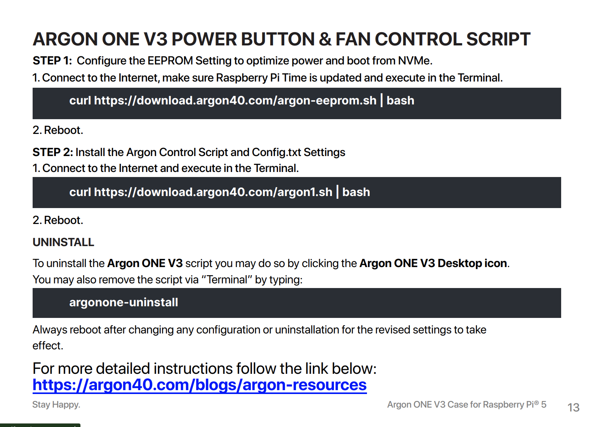
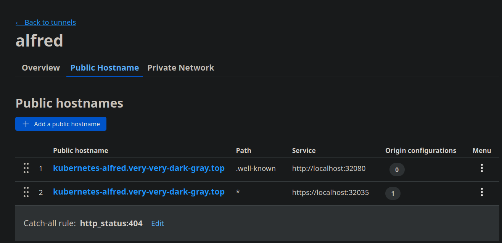
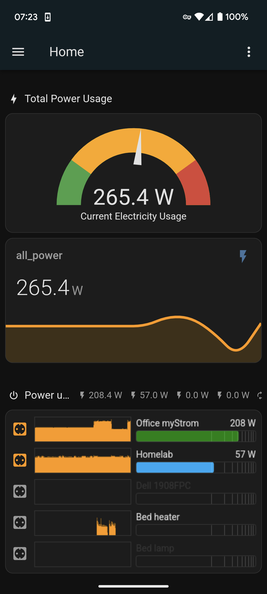

That old house with aging electrical wiring, where last winter we needed
[Continuous Monitoring for TP-Link Tapo devices](./2024-12-28-continuous-monitoring-for-tp-link-tapo-devices.md)
to keep power consumption in check at all times, could do with a more versatile
and capable setup, to at least partially automate the juggling involved in
keeping power consumption within the contracted capacity.

[Home Assistant](https://www.home-assistant.io/) should be a good way to scale
this up, but what that old house needs in the first place is a 24x7 system, so
here we go again to setup a brand new Raspberry Pi... enter **Alfred**, the new
housekeeper.

<!-- more -->

## Hardware

Although it may be overkill for the initial few purposes, the hardware chosen
for this system is a rather generous setup to leave plenty of room for growth:

*  [Raspberry Pi 5 8GB](https://www.raspberrypi.com/products/raspberry-pi-5/)
*  [Samsung 970 EVO Plus (2000 GB, M.2 2280)](https://www.samsung.com/de/memory-storage/nvme-ssd/970-evo-plus-nvme-m-2-ssd-2tb-mz-v7s2t0bw/)
*  [Argon ONE V3 M.2 NVME Raspberry Pi 5 Case](https://argon40.com/products/argon-one-v3-m-2-nvme-case)

This Argon ONE case is a bit tricky to assemble, it pays to follow the
instructions carefully and make sure the PCIe cable is connected the right way
and fully connected.

??? terminal "How this NVMe enclosure shows up in `dmesg`."

    ``` dmesg
    [103602.068970] sd 10:0:0:0: [sdf] tag#11 uas_zap_pending 0 uas-tag 1 inflight: CMD 
    [103602.068975] sd 10:0:0:0: [sdf] tag#11 CDB: Test Unit Ready 00 00 00 00 00 00
    [103602.069000] sd 10:0:0:0: [sdf] Test Unit Ready failed: Result: hostbyte=DID_NO_CONNECT driverbyte=DRIVER_OK
    [103602.069013] sd 10:0:0:0: [sdf] Read Capacity(16) failed: Result: hostbyte=DID_ERROR driverbyte=DRIVER_OK
    [103602.069015] sd 10:0:0:0: [sdf] Sense not available.
    [103602.069022] sd 10:0:0:0: [sdf] Read Capacity(10) failed: Result: hostbyte=DID_ERROR driverbyte=DRIVER_OK
    [103602.069024] sd 10:0:0:0: [sdf] Sense not available.
    [103602.069029] sd 10:0:0:0: [sdf] 0 512-byte logical blocks: (0 B/0 B)
    [103602.069032] sd 10:0:0:0: [sdf] 0-byte physical blocks
    [103602.069035] sd 10:0:0:0: [sdf] Write Protect is off
    [103602.069038] sd 10:0:0:0: [sdf] Mode Sense: 00 00 00 00
    [103602.069042] sd 10:0:0:0: [sdf] Asking for cache data failed
    [103602.069046] sd 10:0:0:0: [sdf] Assuming drive cache: write through
    [103602.069049] sd 10:0:0:0: [sdf] Preferred minimum I/O size 4096 bytes not a multiple of physical block size (0 bytes)
    [103602.069052] sd 10:0:0:0: [sdf] Optimal transfer size 33553920 bytes not a multiple of physical block size (0 bytes)
    [103602.069483] sd 10:0:0:0: [sdf] Attached SCSI disk
    [103603.389453] usb 4-1: new SuperSpeed USB device number 3 using xhci_hcd
    [103603.402010] usb 4-1: New USB device found, idVendor=152d, idProduct=0583, bcdDevice=31.08
    [103603.402017] usb 4-1: New USB device strings: Mfr=1, Product=2, SerialNumber=3
    [103603.402019] usb 4-1: Product: USB Storage Device
    [103603.402021] usb 4-1: Manufacturer: JMicron
    [103603.402023] usb 4-1: SerialNumber: DD564198838E3
    [103603.403724] scsi host10: uas
    [103603.404249] scsi 10:0:0:0: Direct-Access     Samsung  SSD 970 EVO      3108 PQ: 0 ANSI: 6
    [103603.406054] sd 10:0:0:0: Attached scsi generic sg5 type 0
    [103603.406383] sd 10:0:0:0: [sdf] 3907029168 512-byte logical blocks: (2.00 TB/1.82 TiB)
    [103603.406386] sd 10:0:0:0: [sdf] 4096-byte physical blocks
    [103603.406504] sd 10:0:0:0: [sdf] Write Protect is off
    [103603.406507] sd 10:0:0:0: [sdf] Mode Sense: 5f 00 00 08
    [103603.406703] sd 10:0:0:0: [sdf] Write cache: enabled, read cache: enabled, doesn't support DPO or FUA
    [103603.406706] sd 10:0:0:0: [sdf] Preferred minimum I/O size 4096 bytes
    [103603.406708] sd 10:0:0:0: [sdf] Optimal transfer size 33553920 bytes not a multiple of preferred minimum block size (4096 bytes)
    [103603.410179]  sdf: sdf1 sdf2 sdf3 sdf4 sdf5 sdf6
    [103603.410501] sd 10:0:0:0: [sdf] Attached SCSI disk
    ```

## Install to NVMe SSD

To install Raspberry Pi Os directly on the NVMe drive, it goes first into an
[ICY BOX IB-1817M-C31 USB 3.1 NVMe enclosure](https://icybox.de/product/externe_speicherloesungen/IB-1817M-C31)
to then use `rpi-imager` to install the latest 64-bit Raspberry Pi Os Lite on
it. This will replace original partitions with just two (`bootfs`, `rootfs`):

``` dmesg
[104897.486810]  sdf: sdf1 sdf2
```

``` console
# parted /dev/sdf print
Model: Samsung SSD 970 EVO (scsi)
Disk /dev/sdf: 2000GB
Sector size (logical/physical): 512B/4096B
Partition Table: msdos
Disk Flags: 

Number  Start   End     Size    Type     File system  Flags
 1      4194kB  541MB   537MB   primary  fat32        lba
 2      541MB   2756MB  2215MB  primary  ext4
```

??? note "GPT would be necessary only if the disk is larger than 2TB."

    [Booting Pi from NVME greater than 2TB (GPT as opposed to MBR)](https://www.reddit.com/r/raspberry_pi/comments/19e0x42/booting_pi_from_nvme_greater_than_2tb_gpt_as/)
    includes manual instructions to install Raspberry Pi OS on a 4TB NVME using
    a GPT table. If you image a disk which is larger than 2TB with the
    Raspberry Pi tools or images, your disk will be limited to 2TB because they
    use MBR (Master Boot Record) instead of GPT (GUID partition table).

## System Configuration

### PCIe Gen 3

[NVMe SSD boot with the Raspberry Pi 5](https://www.jeffgeerling.com/blog/2023/nvme-ssd-boot-raspberry-pi-5), at least with this Argon ONE case, turned out to
be easy. When using a HAT+-compliant NVMe adapter, there is no need to enable
the external PCIe port, it will be enabled automatically, but it is useful to
force PCIe Gen 3 speeds using these options in `/boot/firmware/config.txt`

``` ini
[all]
dtparam=pciex1
dtparam=pciex1_gen=3
```

### WiFi (re)configuration

The system boots just fine on the first try. Somehow the WiFi connection was
not established, but it did work well after setting up by running
`raspi-config` and going through the menus.

??? terminal "`$ ip a`"

    ``` console
    $ ip a
    1: lo: <LOOPBACK,UP,LOWER_UP> mtu 65536 qdisc noqueue state UNKNOWN group default qlen 1000
        link/loopback 00:00:00:00:00:00 brd 00:00:00:00:00:00
        inet 127.0.0.1/8 scope host lo
        valid_lft forever preferred_lft forever
        inet6 ::1/128 scope host noprefixroute 
        valid_lft forever preferred_lft forever
    2: eth0: <NO-CARRIER,BROADCAST,MULTICAST,UP> mtu 1500 qdisc pfifo_fast state DOWN group default qlen 1000
        link/ether 2c:cf:67:83:6f:3b brd ff:ff:ff:ff:ff:ff
    3: wlan0: <BROADCAST,MULTICAST,UP,LOWER_UP> mtu 1500 qdisc pfifo_fast state UP group default qlen 1000
        link/ether 2c:cf:67:83:6f:3c brd ff:ff:ff:ff:ff:ff
        inet 192.168.0.124/24 brd 192.168.0.255 scope global dynamic noprefixroute wlan0
        valid_lft 85830sec preferred_lft 85830sec
        inet6 fe80::17df:d960:1aa4:36ff/64 scope link noprefixroute 
        valid_lft forever preferred_lft forever
    ```

??? note "About IP address conflicts with `lexicon`."    

    Initically the Raspberry Pi had the `.122` IP address assigned to it, which
    caused a conflict with the `metallb` configuration in the Kubernetes
    cluster in `lexicon`, where this IP had been assigned to the `ingress-nginx`
    service, so as soon as the Raspberry Pi was assigned that IP address,
    **all** services behind Nginx became unreachable. The workaround was to
    configure the UPC router to assign those IP addresses used by the
    `ingress-nginx` service to made-up MAC addresses, so they won't be assigned
    to physical devices.

#### Additional WiFi networks

[How to add a second WiFi network to your Raspberry Pi (updated for OS Bookworm)](https://www.thedigitalpictureframe.com/how-to-add-a-second-wifi-network-to-your-raspberry-pi/)
explains how the wpa_supplicant.conf file is no longer used to configure Wi-Fi
connections and, instead, the current Raspberry Pi OS (based on Bookworm) uses
NetworkManager to manage network connections, including Wi-Fi.

There is a separate configuration file for each WiFi connection under
`/etc/NetworkManager/system-connections`, all it takes to configure additional
WiFi connections is to

1. Copy a working file with a new name (e.g. the SSID name).
1. Replace the SSID and password.
1. Replace the `id` with a new unique value of choice.
1. Replace the `uuid` with a new unique value from running `uuid`.
1. Set the permissions to `600`

This can be done in advance of replacing WiFi access points, etc.

#### Retrospective on IP address assignment

!!! warning

    When setting up a Kubernetes cluster to be relocated to a different LAN,
    make sure to assign a **static** IP address that will be available in the
    destination LAN. Otherwise, the cluster will become non-operational because
    the required certificates are signed for the initial IP address and are not
    trivial to replace without losing deployments and data.

??? note "Ask me how I know..."

    After relocating `alfred` to a its destination LAN a having a new IP address
    assigned from the local DCHP server (ISP router), the `kubelet` service is no
    longer accessible at the old (or new) IP address.

    On the old IP address, nothing is listening:

    ``` console
    $ kubectl get all -A
    E0723 20:15:48.259515   23554 memcache.go:265] "Unhandled Error" err="couldn't get current server API group list: Get \"http://localhost:8080/api?timeout=32s\": dial tcp [::1]:8080: connect: connection refused"
    E0723 20:15:48.261327   23554 memcache.go:265] "Unhandled Error" err="couldn't get current server API group list: Get \"http://localhost:8080/api?timeout=32s\": dial tcp [::1]:8080: connect: connection refused"
    E0723 20:15:48.263000   23554 memcache.go:265] "Unhandled Error" err="couldn't get current server API group list: Get \"http://localhost:8080/api?timeout=32s\": dial tcp [::1]:8080: connect: connection refused"
    E0723 20:15:48.264590   23554 memcache.go:265] "Unhandled Error" err="couldn't get current server API group list: Get \"http://localhost:8080/api?timeout=32s\": dial tcp [::1]:8080: connect: connection refused"
    E0723 20:15:48.266104   23554 memcache.go:265] "Unhandled Error" err="couldn't get current server API group list: Get \"http://localhost:8080/api?timeout=32s\": dial tcp [::1]:8080: connect: connection refused"
    The connection to the server localhost:8080 was refused - did you specify the right host or port?
    ```

    The server is unable to connect to `etcd` on `192.168.0.124:6443`

    ``` console
    $ systemctl status kubelet.service
    ...
    1323 pod_workers.go:1301] "Error syncing pod, skipping" err="failed to \"StartContainer\" for \"kube-apiserver\" with CrashLoopBackOff: \"back-off 5m0s restarting failed container=kube-apiserver pod=kube-apiserver-alfred_kube-system(b254715d65c91745b90>
    1323 kubelet.go:3190] "No need to create a mirror pod, since failed to get node info from the cluster" err="node \"alfred\" not found" node="alfred"
    1323 scope.go:117] "RemoveContainer" containerID="7a63e157dfff240e6122e2677a690bcfbc25828b9e70b15f3183c0b5bd37b5d4"
    1323 pod_workers.go:1301] "Error syncing pod, skipping" err="failed to \"StartContainer\" for \"etcd\" with CrashLoopBackOff: \"back-off 5m0s restarting failed container=etcd pod=etcd-alfred_kube-system(bd8b1f1f7ec248fb91965a18bb2161c3)\"" pod="kube-sy>
    1323 controller.go:145] "Failed to ensure lease exists, will retry" err="Get \"https://192.168.0.124:6443/apis/coordination.k8s.io/v1/namespaces/kube-node-lease/leases/alfred?timeout=10s\": dial tcp 192.168.0.124:6443: connect: no route to host" interv>
    1323 kubelet_node_status.go:107] "Unable to register node with API server" err="Post \"https://192.168.0.124:6443/api/v1/nodes\": dial tcp 192.168.0.124:6443: connect: no route to host" node="alfred"
    1323 event.go:368] "Unable to write event (may retry after sleeping)" err="Patch \"https://192.168.0.124:6443/api/v1/namespaces/default/events/alfred.1854f3b436893b1b\": dial tcp 192.168.0.124:6443: connect: no route to host" event="&Event{ObjectMeta:{>
    1323 kubelet.go:3190] "No need to create a mirror pod, since failed to get node info from the cluster" err="node \"alfred\" not found" node="alfred"
    ```

    Because the service is now listening on the new IP address:

    ``` console
    $ netstat -na | grep 6443
    tcp        0      1 192.168.0.50:54216      192.168.0.124:6443      SYN_SENT 

    $ ip a
    ...
    2: eth0: <BROADCAST,MULTICAST,UP,LOWER_UP> mtu 1500 qdisc pfifo_fast state UP group default qlen 1000
        link/ether 2c:cf:67:83:6f:3b brd ff:ff:ff:ff:ff:ff
        inet 192.168.0.50/24 brd 192.168.0.255 scope global dynamic noprefixroute eth0
          valid_lft 602389sec preferred_lft 602389sec
        inet6 fe80::5269:183f:fa1a:d1e5/64 scope link noprefixroute 
          valid_lft forever preferred_lft forever
    ```

    The old IP address is promptly found in several files that would need to be updated:

    ```
    /etc/hosts
    /etc/kubernetes/kubelet.conf
    /etc/kubernetes/admin.conf
    ~/.kube/config
    ```

    But there are quite a few more files that would need to be updated
    (in multiple lines):

    ```
    $ sudo grep -rin 124 /etc/kubernetes/*
    /etc/kubernetes/controller-manager.conf:5:    server: https://192.168.0.124:6443
    /etc/kubernetes/manifests/etcd.yaml:5:    kubeadm.kubernetes.io/etcd.advertise-client-urls: https://192.168.0.124:2379
    /etc/kubernetes/manifests/etcd.yaml:16:    - --advertise-client-urls=https://192.168.0.124:2379
    /etc/kubernetes/manifests/etcd.yaml:22:    - --initial-advertise-peer-urls=https://192.168.0.124:2380
    /etc/kubernetes/manifests/etcd.yaml:23:    - --initial-cluster=alfred=https://192.168.0.124:2380
    /etc/kubernetes/manifests/etcd.yaml:25:    - --listen-client-urls=https://127.0.0.1:2379,https://192.168.0.124:2379
    /etc/kubernetes/manifests/etcd.yaml:27:    - --listen-peer-urls=https://192.168.0.124:2380
    /etc/kubernetes/manifests/kube-apiserver.yaml:5:    kubeadm.kubernetes.io/kube-apiserver.advertise-address.endpoint: 192.168.0.124:6443
    /etc/kubernetes/manifests/kube-apiserver.yaml:16:    - --advertise-address=192.168.0.124
    /etc/kubernetes/manifests/kube-apiserver.yaml:48:        host: 192.168.0.124
    /etc/kubernetes/manifests/kube-apiserver.yaml:59:        host: 192.168.0.124
    /etc/kubernetes/manifests/kube-apiserver.yaml:71:        host: 192.168.0.124
    /etc/kubernetes/scheduler.conf:5:    server: https://192.168.0.124:6443
    /etc/kubernetes/super-admin.conf:5:    server: https://192.168.0.124:6443
    ```

    It would be best if the kubelet service updated all these from a single,
    centralized parameter. Based on https://stackoverflow.com/a/68391387,
    although `/etc/systemd/system/kubelet.service.d/10-kubeadm.conf` does not exist,
    this should be possible by setting `KUBELET_EXTRA_ARGS=--node-ip 192.168.0.50`
    in `/etc/default/kubelet` (then reloading and restarting the service):

    ```
    # systemctl daemon-reload
    # systemctl restart kubelet.service
    # systemctl status kubelet.service
    142316 reflector.go:569] k8s.io/client-go/informers/factory.go:160: failed to list *v1.Node: Get "https://192.168.0.50:6443/api/v1/nodes?fieldSelector=metadata.name%3Dalfred&limit=500&resourceVersion=0": net/http: TLS handshake timeout
    142316 reflector.go:166] "Unhandled Error" err="k8s.io/client-go/informers/factory.go:160: Failed to watch *v1.Node: failed to list *v1.Node: Get \"https://192.168.0.50:6443/api/v1/nodes?fieldSelector=metadata.name%3Dalfred&limit=500&resourceVersion=0\>
    ```

    Now the issue is that the **TLS handshake** fails, because certificates were created
    for the IP address 192.168.0.124 **but not 192.168.0.50**; this has been reported as
    [`kudeamd` issue #338: Changing master IP address](https://github.com/kubernetes/kubeadm/issues/338)
    [and the workaround is quite involved](https://github.com/kubernetes/kubeadm/issues/338#issuecomment-1835645768).    

    So the solution is, for now, to add 124 as a
    [Static IP Address Using the Network Manager CLI](https://pimylifeup.com/raspberry-pi-static-ip-address/#static-ip-address-using-network-manager-cli).    

    However, 124 is in the middle of the router's DHCP pool and there is no option to assign IPs to MACs,
    so just in case add also .5 and perhaps later rebuild the cluster on that address.

### Fix locales

The above looks like rpi-imager took my PC’s locale settings:

``` console
-bash: warning: setlocale: LC_ALL: cannot change locale (en_US.UTF-8)
```

The solution is to use `raspi-config` to generate `en_US.UTF-8` and set it as the system default.

``` console
$ sudo raspi-config
...
Generating locales (this might take a while)...
  en_GB.UTF-8... done
  en_US.UTF-8... done
Generation complete.
```

### Disable swap

With 8 GB of RAM there should be no reason to need disk swap, never mind that it
would be rather fast in this system.

``` console
$ free -h
               total        used        free      shared  buff/cache   available
Mem:           7.9Gi       205Mi       7.2Gi       5.1Mi       590Mi       7.7Gi
Swap:          511Mi          0B       511Mi

$ sudo dphys-swapfile swapoff
$ sudo dphys-swapfile uninstall
$ sudo systemctl disable dphys-swapfile
Synchronizing state of dphys-swapfile.service with SysV service script with /lib/systemd/systemd-sysv-install.
Executing: /lib/systemd/systemd-sysv-install disable dphys-swapfile
Removed "/etc/systemd/system/multi-user.target.wants/dphys-swapfile.service".

$ free -h
               total        used        free      shared  buff/cache   available
Mem:           7.9Gi       210Mi       7.2Gi       5.1Mi       591Mi       7.7Gi
Swap:             0B          0B          0
```

### SSH Server

As a general good practices, even if this system won't have its SSH port open to
the Internet, add the relevant public keys to `/home/pi/.ssh/authorized_keys`
and disable password authentication by setting `PasswordAuthentication no` in
`/etc/ssh/sshd_config`.

### Disable power save for WiFi

Raspberry Pi enables power save on WiFi by default:

``` dmesg
[    5.598286] brcmfmac: F1 signature read @0x18000000=0x15264345
[    5.600446] brcmfmac: brcmf_fw_alloc_request: using brcm/brcmfmac43455-sdio for chip BCM4345/6
[    5.600754] usbcore: registered new interface driver brcmfmac
[    5.790052] brcmfmac: brcmf_c_process_txcap_blob: no txcap_blob available (err=-2)
[    5.790325] brcmfmac: brcmf_c_preinit_dcmds: Firmware: BCM4345/6 wl0: Aug 29 2023 01:47:08 version 7.45.265 (28bca26 CY) FWID 01-b677b91b
[    6.423812] brcmfmac: brcmf_cfg80211_set_power_mgmt: power save enabled
```

This can lead to losing connectivity in certain conditions, so disable power
save of WiFi to avoid having to deal with such problems like
[Reconnect on WiFi drop](https://forums.raspberrypi.com/viewtopic.php?f=91&t=16054).

``` console
$ sudo /sbin/iw dev wlan0 set power_save off
```

``` dmesg
[ 1767.061929] brcmfmac: brcmf_cfg80211_set_power_mgmt: power save disabled
```

### Argon case scripts

The instructions in page 13 of the
[Argon ONE V3 NVMe case manual](https://www.pi-shop.ch/downloads/dl/file/id/1127/product/3203/manual_argon_one_v3_m_2_nvme.pdf)
to install the scripts for FAN control seem simple enough:

{: style="height:550px;width:764px"}

However, these scripts were problematic for users with this hardware setup
[as of early 2024](https://forum.argon40.com/t/argon-one-v3-power-button-and-fan-scripts-issue/2276/32)
and also in this case something didn't go well at first:

``` console
$ curl https://download.argon40.com/argon-eeprom.sh | bash
*************
 Argon Setup  
*************
Hit:1 http://archive.raspberrypi.com/debian bookworm InRelease
Hit:2 http://deb.debian.org/debian bookworm InRelease
Hit:3 http://deb.debian.org/debian-security bookworm-security InRelease
Get:4 http://deb.debian.org/debian bookworm-updates InRelease [55.4 kB]
Fetched 55.4 kB in 1s (101 kB/s)    
Reading package lists... Done
Reading package lists... Done
Building dependency tree... Done
Reading state information... Done
Calculating upgrade... Done
0 upgraded, 0 newly installed, 0 to remove and 0 not upgraded.
*** UPDATE AVAILABLE ***

Run "sudo rpi-eeprom-update -a" to install this update now.

To configure the bootloader update policy run "sudo raspi-config"

BOOTLOADER: update available
   CURRENT: Mon Sep 23 01:02:56 PM UTC 2024 (1727096576)
    LATEST: Wed Feb 12 10:51:52 AM UTC 2025 (1739357512)
   RELEASE: default (/usr/lib/firmware/raspberrypi/bootloader-2712/default)
            Use raspi-config to change the release.
Updating bootloader EEPROM
 image: /usr/lib/firmware/raspberrypi/bootloader-2712/default/pieeprom-2025-02-12.bin
config_src: blconfig device
config: /tmp/tmpgeb40cic/boot.conf
################################################################################
[all]
WAKE_ON_GPIO=0
PCIE_PROBE=1
BOOT_UART=1
POWER_OFF_ON_HALT=1
BOOT_ORDER=0xf416

################################################################################

*** To cancel this update run 'sudo rpi-eeprom-update -r' ***

ERROR: rpi-eeprom-update -d -i -f /tmp/tmpgeb40cic/pieeprom.upd timeout
```

This EEPROM update failure appears to have been discussed absolutely nowhere
on the Internet (what does this timeout mean?), leading to extreme caution
moving forward. The active EEPROM config now seems like a subset of the above:

``` console
$ sudo rpi-eeprom-config 
[all]
BOOT_UART=1
POWER_OFF_ON_HALT=0
BOOT_ORDER=0xf461
```

Since this appears to be the recommendation from the above script output,
lets cancel the pending update for now:

``` console
$ sudo rpi-eeprom-update -r
Removing temporary files from previous EEPROM update
```

There are a couple of newer versions available, the last one being very
recent:

``` console
$ sudo rpi-eeprom-update -l
/usr/lib/firmware/raspberrypi/bootloader-2712/default/pieeprom-2025-02-12.bin
$ ls -l /usr/lib/firmware/raspberrypi/bootloader-2712/default/
total 6248
-rw-r--r-- 1 root root 2097152 Feb 18 10:42 pieeprom-2024-11-12.bin
-rw-r--r-- 1 root root 2097152 Feb 18 10:42 pieeprom-2025-01-22.bin
-rw-r--r-- 1 root root 2097152 Feb 18 10:42 pieeprom-2025-02-12.bin
-rw-r--r-- 1 root root  102992 Feb 18 10:42 recovery.bin
```

[Using raspi-config to update the bootloader](https://www.raspberrypi.com/documentation/computers/raspberry-pi.html#raspi-config)
and set it to `Latest` (**without** resetting config) worked just fine.
After the required reboot, the `argon-eeprom.sh` script also run fine:

??? terminal "`curl https://download.argon40.com/argon-eeprom.sh | bash`"

    ``` console
    $ curl https://download.argon40.com/argon-eeprom.sh | bash
    *************
    Argon Setup  
    *************
    Hit:1 http://deb.debian.org/debian bookworm InRelease
    Hit:2 http://archive.raspberrypi.com/debian bookworm InRelease
    Hit:3 http://deb.debian.org/debian-security bookworm-security InRelease
    Hit:4 http://deb.debian.org/debian bookworm-updates InRelease
    Reading package lists... Done
    Reading package lists... Done
    Building dependency tree... Done
    Reading state information... Done
    Calculating upgrade... Done
    0 upgraded, 0 newly installed, 0 to remove and 0 not upgraded.
    BOOTLOADER: up to date
      CURRENT: Wed Feb 12 10:51:52 AM UTC 2025 (1739357512)
        LATEST: Wed Feb 12 10:51:52 AM UTC 2025 (1739357512)
      RELEASE: latest (/usr/lib/firmware/raspberrypi/bootloader-2712/latest)
                Use raspi-config to change the release.
    EEPROM settings up to date
    ```

Then after another required reboot, the `argon1.sh` script worked fine too:

??? terminal "`curl https://download.argon40.com/argon1.sh | bash`"

    ``` console
    $ curl https://download.argon40.com/argon1.sh | bash
    *************
     Argon Setup  
    *************
    Reading package lists... Done
    Building dependency tree... Done
    Reading state information... Done
    python3-libgpiod is already the newest version (1.6.3-1+b3).
    0 upgraded, 0 newly installed, 0 to remove and 0 not upgraded.
    Reading package lists... Done
    Building dependency tree... Done
    Reading state information... Done
    The following additional packages will be installed:
      i2c-tools libi2c0 read-edid
    Suggested packages:
      libi2c-dev
    The following NEW packages will be installed:
      i2c-tools libi2c0 python3-smbus read-edid
    0 upgraded, 4 newly installed, 0 to remove and 0 not upgraded.
    Need to get 116 kB of archives.
    After this operation, 773 kB of additional disk space will be used.
    Get:1 http://deb.debian.org/debian bookworm/main arm64 libi2c0 arm64 4.3-2+b3 [9,456 B]
    Get:2 http://deb.debian.org/debian bookworm/main arm64 i2c-tools arm64 4.3-2+b3 [78.6 kB]
    Get:3 http://deb.debian.org/debian bookworm/main arm64 python3-smbus arm64 4.3-2+b3 [11.8 kB]
    Get:4 http://deb.debian.org/debian bookworm/main arm64 read-edid arm64 3.0.2-1.1 [16.1 kB]
    Fetched 116 kB in 0s (487 kB/s)      
    Selecting previously unselected package libi2c0:arm64.
    (Reading database ... 81258 files and directories currently installed.)
    Preparing to unpack .../libi2c0_4.3-2+b3_arm64.deb ...
    Unpacking libi2c0:arm64 (4.3-2+b3) ...
    Selecting previously unselected package i2c-tools.
    Preparing to unpack .../i2c-tools_4.3-2+b3_arm64.deb ...
    Unpacking i2c-tools (4.3-2+b3) ...
    Selecting previously unselected package python3-smbus:arm64.
    Preparing to unpack .../python3-smbus_4.3-2+b3_arm64.deb ...
    Unpacking python3-smbus:arm64 (4.3-2+b3) ...
    Selecting previously unselected package read-edid.
    Preparing to unpack .../read-edid_3.0.2-1.1_arm64.deb ...
    Unpacking read-edid (3.0.2-1.1) ...
    Setting up libi2c0:arm64 (4.3-2+b3) ...
    Setting up read-edid (3.0.2-1.1) ...
    Setting up i2c-tools (4.3-2+b3) ...
    Setting up python3-smbus:arm64 (4.3-2+b3) ...
    Processing triggers for man-db (2.11.2-2) ...
    Processing triggers for libc-bin (2.36-9+rpt2+deb12u9) ...
    Reading package lists... Done
    Building dependency tree... Done
    Reading state information... Done
    i2c-tools is already the newest version (4.3-2+b3).
    i2c-tools set to manually installed.
    0 upgraded, 0 newly installed, 0 to remove and 0 not upgraded.
    Created symlink /etc/systemd/system/multi-user.target.wants/argononed.service → /lib/systemd/system/argononed.service.
    Hit:1 http://deb.debian.org/debian bookworm InRelease
    Hit:2 http://deb.debian.org/debian-security bookworm-security InRelease
    Hit:3 http://deb.debian.org/debian bookworm-updates InRelease   
    Hit:4 http://archive.raspberrypi.com/debian bookworm InRelease  
    Reading package lists... Done                             
    Reading package lists... Done
    Building dependency tree... Done
    Reading state information... Done
    Calculating upgrade... Done
    0 upgraded, 0 newly installed, 0 to remove and 0 not upgraded.
    BOOTLOADER: up to date
       CURRENT: Wed Feb 12 10:51:52 AM UTC 2025 (1739357512)
        LATEST: Wed Feb 12 10:51:52 AM UTC 2025 (1739357512)
       RELEASE: latest (/usr/lib/firmware/raspberrypi/bootloader-2712/latest)
                Use raspi-config to change the release.
    Updating bootloader EEPROM
     image: /usr/lib/firmware/raspberrypi/bootloader-2712/latest/pieeprom-2025-02-12.bin
    config_src: blconfig device
    config: /tmp/tmpsnnegdcc/boot.conf
    ################################################################################
    [all]
    PSU_MAX_CURRENT=5000
    WAKE_ON_GPIO=0
    PCIE_PROBE=1
    BOOT_UART=1
    POWER_OFF_ON_HALT=1
    BOOT_ORDER=0xf416
    
    ################################################################################
    
    *** To cancel this update run 'sudo rpi-eeprom-update -r' ***
    
    *** CREATED UPDATE /tmp/tmpsnnegdcc/pieeprom.upd  ***
    
       CURRENT: Wed Feb 12 10:51:52 AM UTC 2025 (1739357512)
        UPDATE: Wed Feb 12 10:51:52 AM UTC 2025 (1739357512)
        BOOTFS: /boot/firmware
    '/tmp/tmp.U1Yfb9oJp3' -> '/boot/firmware/pieeprom.upd'
    
    UPDATING bootloader. This could take up to a minute. Please wait
    
    *** Do not disconnect the power until the update is complete ***
    
    If a problem occurs then the Raspberry Pi Imager may be used to create
    a bootloader rescue SD card image which restores the default bootloader image.
    
    flashrom -p linux_spi:dev=/dev/spidev10.0,spispeed=16000 -w /boot/firmware/pieeprom.upd
    Verifying update
    VERIFY: SUCCESS
    UPDATE SUCCESSFUL
    *********************
      Setup Completed 
    *********************
    Version 2502002
    
    We acknowledge the valuable feedback of the following:
    ghalfacree, NHHiker
    
    Feel free to join the discussions at https://forum.argon40.com
    
    
    Use 'argon-config' to configure device
    
    ```

And finally, after yet another reboot, the `argon-config` works:

??? terminal "`sudo argon-config`"

    ``` console
    $ sudo argon-config
    --------------------------
    Argon Configuration Tool
    Version 2502002
    --------------------------
    
    Choose Option:
      1. Configure Fan
      2. Configure IR
      3. Argon Industria UPS
      4. Configure BLSTR DAC (v3/v5 only)
      5. Configure Units
      6. System Information
      7. Uninstall
    
      0. Exit
    Enter Number (0-7):6
    --------------------------
     Argon System Information
    --------------------------
    
      1. Temperatures
      2. CPU Utilization
      3. Storage Capacity
      4. RAM
      5. IP Address
      6. Fan Speed
    
      0. Back
    Enter Number (0-6):1
    --------------------------
    TEMPERATURE INFORMATION:
       CPU: 40.2°C
    --------------------------
    
      1. Temperatures
      2. CPU Utilization
      3. Storage Capacity
      4. RAM
      5. IP Address
      6. Fan Speed
    
      0. Back
    Enter Number (0-6):2
    --------------------------
    CPU USAGE INFORMATION:
       cpu0: 0%
       cpu1: 0%
       cpu2: 0%
       cpu3: 0%
    --------------------------
    
      1. Temperatures
      2. CPU Utilization
      3. Storage Capacity
      4. RAM
      5. IP Address
      6. Fan Speed
    
      0. Back
    Enter Number (0-6):3
    --------------------------
    STORAGE INFORMATION:
       nvme0n1 0% used of 2TB
    --------------------------
    
      1. Temperatures
      2. CPU Utilization
      3. Storage Capacity
      4. RAM
      5. IP Address
      6. Fan Speed
    
      0. Back
    Enter Number (0-6):4
    --------------------------
    RAM INFORMATION:
       97% of 8GB
    --------------------------
    
      1. Temperatures
      2. CPU Utilization
      3. Storage Capacity
      4. RAM
      5. IP Address
      6. Fan Speed
    
      0. Back
    Enter Number (0-6):5
    --------------------------
    IP INFORMATION:
       192.168.0.124
    --------------------------
    
      1. Temperatures
      2. CPU Utilization
      3. Storage Capacity
      4. RAM
      5. IP Address
      6. Fan Speed
    
      0. Back
    Enter Number (0-6):6
    --------------------------
    TEMPERATURE INFORMATION:
       CPU: 40.2°C
    FAN CONFIGURATION INFORMATION:
            65.0=100
            60.0=55
            55.0=30
    FAN SPEED INFORMATION:
       Fan Speed 0
    --------------------------
    
      1. Temperatures
      2. CPU Utilization
      3. Storage Capacity
      4. RAM
      5. IP Address
      6. Fan Speed
    
      0. Back
    Enter Number (0-6):0
    
    Choose Option:
      1. Configure Fan
      2. Configure IR
      3. Argon Industria UPS
      4. Configure BLSTR DAC (v3/v5 only)
      5. Configure Units
      6. System Information
      7. Uninstall
    
      0. Exit
    Enter Number (0-7):0
    Thank you.
    
    ```

## Essential Software

### Basic packages

Before moving forward, I like to install a few basics that make work easier,
or on which subsequent packages depend:

``` console
$ sudo apt update
$ sudo apt full-upgrade -y
$ sudo apt install -y bc git iotop-c netcat-openbsd rename speedtest-cli \
  sysstat vim python3-pip python3-influxdb python3-numpy python3-absl \
  python3-unidecode
```

### Continuous Monitoring

[Continuous Monitoring](../../projects/conmon.md) on this system needs only the
[`conmon-st`](../../projects/conmon.md#conmon-st) script to gather metrics,
since it will be reporting metrics to the
[InfluxDB and Grafana on Kubernetes](./2024-04-20-monitoring-with-influxdb-and-grafana-on-kubernetes.md)
already setup on `lexicon`.

After [installing the service file](../../projects/conmon.md#install-conmon),
it is also necessary to add `User=pi` in the `[Service]` section.

``` console
$ sudo systemctl enable conmon.service
$ sudo systemctl daemon-reload
$ sudo systemctl start conmon.service
$ sudo systemctl status conmon.service
```

### Fail2Ban

[Fail2Ban](https://github.com/fail2ban/fail2ban?tab=readme-ov-file#fail2ban-ban-hosts-that-cause-multiple-authentication-errors)
scans log files and bans IP addresses conducting too many failed login attempts.
It is a rather basic protection mechanism, and this system is not intended to
have its SSH port open to the Internet, but it is so easy to install and enable
that there is no excuse not to.

``` console
$ sudo apt-get install iptables fail2ban -y
$ sudo systemctl enable --now fail2ban
```

The configuration in `/etc/fail2ban/jail.conf` can be spiced up to make a
little more trigger-happy:

``` ini
# "bantime" is the number of seconds that a host is banned.
bantime  = 12h
# A host is banned if it has generated "maxretry" during the last "findtime"
# seconds.
findtime  = 90m
# "maxretry" is the number of failures before a host get banned.
maxretry = 3
# "bantime.increment" allows to use database for searching of previously banned ip's to increase a 
# default ban time using special formula, default it is banTime * 1, 2, 4, 8, 16, 32...
bantime.increment = true
```

Then restart the service to pick the changes up:

``` console
$ sudo systemctl restart fail2ban
```

## Kubernetes

[Raspberry Pi 5 - a Kubernetes cluster](https://devops.datenkollektiv.de/raspberry-pi-5-a-kubernetes-cluster.html)
looks like installing Kubernetes on a Raspberry Pi is not any different than
installing it on Ubuntu Server, so we can essentially combine the latest
[Single-node Kubernetes cluster on Ubuntu Studio desktop (rapture)](./2024-05-12-single-node-kubernetes-cluster-on-ubuntu-studio-desktop-rapture.md)
with the original, more detailed
[Single-node Kubernetes cluster on Ubuntu Server (lexicon)](./2023-03-25-single-node-kubernetes-cluster-on-ubuntu-server-lexicon.md), which
*should* mean *mostly* following
[kubernetes.io/docs](https://kubernetes.io/docs/)
along with the combined learnings from having done this already twice.

### GitHub Repository

Kubernetes deployments for all servers are best kept in a revision controlled
[GitHub repo](./2024-05-12-single-node-kubernetes-cluster-on-ubuntu-studio-desktop-rapture.md#github-repository),
already in use since the last cluster was setup.
[Generate a new SSH key](https://docs.github.com/en/authentication/connecting-to-github-with-ssh/generating-a-new-ssh-key-and-adding-it-to-the-ssh-agent#generating-a-new-ssh-key),
[add it to the GitHub account](https://docs.github.com/en/authentication/connecting-to-github-with-ssh/adding-a-new-ssh-key-to-your-github-account#adding-a-new-ssh-key-to-your-account)
as an *Authentication Key* and, instead of keeping separate directories for
each Kubernetes version, which seems to have been unnecessary, simply create
a directory per server and keep common files at the root:

``` console
$ git clone git@github.com:xxxx/kubernetes-deployments.git
$ cd kubernetes-deployments/
$ mkdir alfred
```

### Install Kubernetes

The [current stable release](https://cdn.dl.k8s.io/release/stable.txt) is now
v1.32.**2** which is already the 3rd patch in 1.32, so we use this version to
[Installing kubeadm, kubelet and kubectl](https://kubernetes.io/docs/setup/production-environment/tools/kubeadm/install-kubeadm/#installing-kubeadm-kubelet-and-kubectl)
from Debian packages:

``` console
$ curl -fsSL https://pkgs.k8s.io/core:/stable:/v1.32/deb/Release.key \
  | sudo gpg --dearmor -o /etc/apt/keyrings/kubernetes-apt-keyring.gpg
$ sudo chmod 644 /etc/apt/keyrings/kubernetes-apt-keyring.gpg
$ echo 'deb [signed-by=/etc/apt/keyrings/kubernetes-apt-keyring.gpg] https://pkgs.k8s.io/core:/stable:/v1.32/deb/ /' \
  | sudo tee /etc/apt/sources.list.d/kubernetes.list
$ sudo apt-get update
```

!!! note

    The "`/etc/apt/keyrings` already existed and the required packages were
    already installed: `ca-certificates`, `curl`, `gnupg` (and
    `apt-transport-https` is a dummy package).

Once the APT repository is ready, install the packages:

??? terminal "`sudo apt-get install -y kubelet kubeadm kubectl`"

    ``` console
    $ sudo apt-get install -y kubelet kubeadm kubectl
    Reading package lists... Done
    Building dependency tree... Done
    Reading state information... Done
    The following additional packages will be installed:
      conntrack cri-tools kubernetes-cni
    The following NEW packages will be installed:
      conntrack cri-tools kubeadm kubectl kubelet kubernetes-cni
    0 upgraded, 6 newly installed, 0 to remove and 0 not upgraded.
    Need to get 83.4 MB of archives.
    After this operation, 330 MB of additional disk space will be used.
    Fetched 83.4 MB in 9s (9,047 kB/s)                                                                   
    Selecting previously unselected package conntrack.
    (Reading database ... 83134 files and directories currently installed.)
    Preparing to unpack .../0-conntrack_1%3a1.4.7-1+b2_arm64.deb ...
    Unpacking conntrack (1:1.4.7-1+b2) ...
    Selecting previously unselected package cri-tools.
    Preparing to unpack .../1-cri-tools_1.32.0-1.1_arm64.deb ...
    Unpacking cri-tools (1.32.0-1.1) ...
    Selecting previously unselected package kubeadm.
    Preparing to unpack .../2-kubeadm_1.32.2-1.1_arm64.deb ...
    Unpacking kubeadm (1.32.2-1.1) ...
    Selecting previously unselected package kubectl.
    Preparing to unpack .../3-kubectl_1.32.2-1.1_arm64.deb ...
    Unpacking kubectl (1.32.2-1.1) ...
    Selecting previously unselected package kubernetes-cni.
    Preparing to unpack .../4-kubernetes-cni_1.6.0-1.1_arm64.deb ...
    Unpacking kubernetes-cni (1.6.0-1.1) ...
    Selecting previously unselected package kubelet.
    Preparing to unpack .../5-kubelet_1.32.2-1.1_arm64.deb ...
    Unpacking kubelet (1.32.2-1.1) ...
    Setting up conntrack (1:1.4.7-1+b2) ...
    Setting up kubectl (1.32.2-1.1) ...
    Setting up cri-tools (1.32.0-1.1) ...
    Setting up kubernetes-cni (1.6.0-1.1) ...
    Setting up kubeadm (1.32.2-1.1) ...
    Setting up kubelet (1.32.2-1.1) ...
    Processing triggers for man-db (2.11.2-2) ...
    ```

And then, because updating Kubernetes is a rather involved process, *hold* them:

``` console
$ sudo apt-mark hold kubelet kubeadm kubectl
```

[Enabling shell autocompletion](https://kubernetes.io/docs/tasks/tools/install-kubectl-linux/#enable-kubectl-autocompletion)
for `kubectl` is very easy, since `bash-completion` is already installed:

``` console
$ kubectl completion bash | sudo tee /etc/bash_completion.d/kubectl > /dev/null
$ sudo chmod a+r /etc/bash_completion.d/kubectl
```

#### Enable the kubelet service

This step is only really necessary later, before
[bootstrapping the cluster with `kubeadm`](#bootstrap-with-kubeadm),
but it can be done any time; the service will just be waiting:

``` console
$ sudo systemctl enable --now kubelet
```

### Install container runtime

#### Networking setup

[Enabling IPv4 packet forwarding](https://kubernetes.io/docs/setup/production-environment/container-runtimes/#prerequisite-ipv4-forwarding-optional)
appears to be the only required network setup for Kubernetes v1.32,
and this is already enabled in Rasberry Pi OS:

``` console
$ sudo sysctl net.ipv4.ip_forward
net.ipv4.ip_forward = 1
```

Even so, better to have this enabled explicitly now than to later have
[Kubernetes cluster DNS issues](2024-09-22-kubernetes-cluster-dns-issues.md).

``` console
$ cat <<EOF | sudo tee /etc/sysctl.d/k8s.conf
net.ipv4.ip_forward = 1
EOF

$ sudo sysctl --system
```

However, this alone is not enough for the successful deployment of the
[Network plugin](#network-plugin) required after bootstraping the cluster.

Ommitting the additional steps to
[let iptables see bridged traffic](https://v1-29.docs.kubernetes.io/docs/setup/production-environment/container-runtimes/#forwarding-ipv4-and-letting-iptables-see-bridged-traffic),
which seems to have been required only up to **v1.29**, would later result
in the `kube-flannel`
[deployment failing to start up](#troubleshooting-flannel)
(stuck in a crash loop):

``` console
$ sudo modprobe overlay
$ sudo modprobe br_netfilter
$ sudo tee /etc/modules-load.d/k8s.conf<<EOF
br_netfilter
overlay
EOF

$ sudo tee /etc/sysctl.d/k8s.conf<<EOF
net.bridge.bridge-nf-call-ip6tables = 1
net.bridge.bridge-nf-call-iptables = 1
net.ipv4.ip_forward = 1
EOF
$ sudo sysctl --system
```

Reboot the system to make sure that the changes are permanent:

``` console
$ sudo sysctl -a | egrep 'net.ipv4.ip_forward |net.bridge.bridge-nf-call-ip'
net.bridge.bridge-nf-call-ip6tables = 1
net.bridge.bridge-nf-call-iptables = 1
net.ipv4.ip_forward = 1

$ lsmod | egrep 'overlay|bridge'
bridge                294912  1 br_netfilter
stp                    49152  1 bridge
llc                    49152  2 bridge,stp
overlay               163840  11
ipv6                  589824  58 bridge,br_netfilter
```

#### Install containerd

[Installing a container runtime](https://kubernetes.io/docs/setup/production-environment/tools/kubeadm/install-kubeadm/#installing-runtime)
comes next, with `containerd` being the runtime of choice.
[Install using the `apt` repository](https://docs.docker.com/engine/install/debian/#install-using-the-repository):

``` console
$ sudo curl -fsSL https://download.docker.com/linux/debian/gpg \
  -o /etc/apt/keyrings/docker.asc
$ sudo chmod a+r /etc/apt/keyrings/docker.asc
$ echo \
  "deb [arch=$(dpkg --print-architecture) signed-by=/etc/apt/keyrings/docker.asc] https://download.docker.com/linux/debian \
  $(. /etc/os-release && echo "$VERSION_CODENAME") stable" | \
  sudo tee /etc/apt/sources.list.d/docker.list > /dev/null
$ sudo apt-get update
```

Once the APT repository is ready, install the packages:

??? terminal "`sudo apt-get install -y docker-ce docker-ce-cli containerd.io docker-buildx-plugin docker-compose-plugin`"

    ``` console
    $ sudo apt-get install -y docker-ce docker-ce-cli containerd.io docker-buildx-plugin docker-compose-plugin
    Reading package lists... Done
    Building dependency tree... Done
    Reading state information... Done
    The following additional packages will be installed:
      docker-ce-rootless-extras libltdl7 libslirp0 pigz slirp4netns
    Suggested packages:
      cgroupfs-mount | cgroup-lite
    The following NEW packages will be installed:
      containerd.io docker-buildx-plugin docker-ce docker-ce-cli docker-ce-rootless-extras
      docker-compose-plugin libltdl7 libslirp0 pigz slirp4netns
    0 upgraded, 10 newly installed, 0 to remove and 0 not upgraded.
    Need to get 104 MB of archives.
    After this operation, 405 MB of additional disk space will be used.
    Fetched 104 MB in 9s (11.8 MB/)
    Selecting previously unselected package pigz.
    (Reading database ... 83193 files and directories currently installed.)
    Preparing to unpack .../0-pigz_2.6-1_arm64.deb ...
    Unpacking pigz (2.6-1) ...
    Selecting previously unselected package containerd.io.
    Preparing to unpack .../1-containerd.io_1.7.25-1_arm64.deb ...
    Unpacking containerd.io (1.7.25-1) ...
    Selecting previously unselected package docker-buildx-plugin.
    Preparing to unpack .../2-docker-buildx-plugin_0.21.0-1~debian.12~bookworm_arm64.deb ...
    Unpacking docker-buildx-plugin (0.21.0-1~debian.12~bookworm) ...
    Selecting previously unselected package docker-ce-cli.
    Preparing to unpack .../3-docker-ce-cli_5%3a28.0.0-1~debian.12~bookworm_arm64.deb ...
    Unpacking docker-ce-cli (5:28.0.0-1~debian.12~bookworm) ...
    Selecting previously unselected package docker-ce.
    Preparing to unpack .../4-docker-ce_5%3a28.0.0-1~debian.12~bookworm_arm64.deb ...
    Unpacking docker-ce (5:28.0.0-1~debian.12~bookworm) ...
    Selecting previously unselected package docker-ce-rootless-extras.
    Preparing to unpack .../5-docker-ce-rootless-extras_5%3a28.0.0-1~debian.12~bookworm_arm64.deb ...
    Unpacking docker-ce-rootless-extras (5:28.0.0-1~debian.12~bookworm) ...
    Selecting previously unselected package docker-compose-plugin.
    Preparing to unpack .../6-docker-compose-plugin_2.33.0-1~debian.12~bookworm_arm64.deb ...
    Unpacking docker-compose-plugin (2.33.0-1~debian.12~bookworm) ...
    Selecting previously unselected package libltdl7:arm64.
    Preparing to unpack .../7-libltdl7_2.4.7-7~deb12u1_arm64.deb ...
    Unpacking libltdl7:arm64 (2.4.7-7~deb12u1) ...
    Selecting previously unselected package libslirp0:arm64.
    Preparing to unpack .../8-libslirp0_4.7.0-1_arm64.deb ...
    Unpacking libslirp0:arm64 (4.7.0-1) ...
    Selecting previously unselected package slirp4netns.
    Preparing to unpack .../9-slirp4netns_1.2.0-1_arm64.deb ...
    Unpacking slirp4netns (1.2.0-1) ...
    Setting up docker-buildx-plugin (0.21.0-1~debian.12~bookworm) ...
    Setting up containerd.io (1.7.25-1) ...
    Created symlink /etc/systemd/system/multi-user.target.wants/containerd.service → /lib/systemd/system/containerd.service.
    Setting up docker-compose-plugin (2.33.0-1~debian.12~bookworm) ...
    Setting up libltdl7:arm64 (2.4.7-7~deb12u1) ...
    Setting up docker-ce-cli (5:28.0.0-1~debian.12~bookworm) ...
    Setting up libslirp0:arm64 (4.7.0-1) ...
    Setting up pigz (2.6-1) ...
    Setting up docker-ce-rootless-extras (5:28.0.0-1~debian.12~bookworm) ...
    Setting up slirp4netns (1.2.0-1) ...
    Setting up docker-ce (5:28.0.0-1~debian.12~bookworm) ...
    Created symlink /etc/systemd/system/multi-user.target.wants/docker.service → /lib/systemd/system/docker.service.
    Created symlink /etc/systemd/system/sockets.target.wants/docker.socket → /lib/systemd/system/docker.socket.
    Processing triggers for man-db (2.11.2-2) ...
    Processing triggers for libc-bin (2.36-9+rpt2+deb12u9) ...
    ```

In just a few moments `docker` is already running:

??? terminal "`systemctl status docker`"

    ``` console
    $ systemctl status docker
    ● docker.service - Docker Application Container Engine
        Loaded: loaded (/lib/systemd/system/docker.service; enabled; preset: enabled)
        Active: active (running) since Sat 2025-02-22 14:45:10 CET; 1min 58s ago
    TriggeredBy: ● docker.socket
          Docs: https://docs.docker.com
      Main PID: 272049 (dockerd)
          Tasks: 10
            CPU: 179ms
        CGroup: /system.slice/docker.service
                └─272049 /usr/bin/dockerd -H fd:// --containerd=/run/containerd/containerd.sock

    Feb 22 14:45:10 alfred dockerd[272049]: time="2025-02-22T14:45:10.298075305+01:00" level=info msg="Loading containers: start."
    Feb 22 14:45:10 alfred dockerd[272049]: time="2025-02-22T14:45:10.482322273+01:00" level=info msg="Loading containers: done."
    Feb 22 14:45:10 alfred dockerd[272049]: time="2025-02-22T14:45:10.493322483+01:00" level=warning msg="WARNING: No memory limit support"
    Feb 22 14:45:10 alfred dockerd[272049]: time="2025-02-22T14:45:10.493351206+01:00" level=warning msg="WARNING: No swap limit support"
    Feb 22 14:45:10 alfred dockerd[272049]: time="2025-02-22T14:45:10.493375243+01:00" level=info msg="Docker daemon" commit=af898ab containerd-snapshotter=false storage-driver=overlay2 version=28.0.0
    Feb 22 14:45:10 alfred dockerd[272049]: time="2025-02-22T14:45:10.493479613+01:00" level=info msg="Initializing buildkit"
    Feb 22 14:45:10 alfred dockerd[272049]: time="2025-02-22T14:45:10.538199044+01:00" level=info msg="Completed buildkit initialization"
    Feb 22 14:45:10 alfred dockerd[272049]: time="2025-02-22T14:45:10.543738454+01:00" level=info msg="Daemon has completed initialization"
    Feb 22 14:45:10 alfred systemd[1]: Started docker.service - Docker Application Container Engine.
    Feb 22 14:45:10 alfred dockerd[272049]: time="2025-02-22T14:45:10.543810435+01:00" level=info msg="API listen on /run/docker.sock"
    ```

The server is indeed reachable and its version can be checked:

??? terminal "`sudo docker version`"

    ``` console
    $ sudo docker version
    Client: Docker Engine - Community
    Version:           28.0.0
    API version:       1.48
    Go version:        go1.23.6
    Git commit:        f9ced58
    Built:             Wed Feb 19 22:10:37 2025
    OS/Arch:           linux/arm64
    Context:           default

    Server: Docker Engine - Community
    Engine:
      Version:          28.0.0
      API version:      1.48 (minimum version 1.24)
      Go version:       go1.23.6
      Git commit:       af898ab
      Built:            Wed Feb 19 22:10:37 2025
      OS/Arch:          linux/arm64
      Experimental:     false
    containerd:
      Version:          1.7.25
      GitCommit:        bcc810d6b9066471b0b6fa75f557a15a1cbf31bb
    runc:
      Version:          1.2.4
      GitCommit:        v1.2.4-0-g6c52b3f
    docker-init:
      Version:          0.19.0
      GitCommit:        de40ad0
    ```

And the basic `hello-world` example *just works*:

??? terminal "`sudo docker run hello-world`"

    ``` console
    $ sudo docker run hello-world
    Unable to find image 'hello-world:latest' locally
    latest: Pulling from library/hello-world
    c9c5fd25a1bd: Pull complete 
    Digest: sha256:e0b569a5163a5e6be84e210a2587e7d447e08f87a0e90798363fa44a0464a1e8
    Status: Downloaded newer image for hello-world:latest

    Hello from Docker!
    This message shows that your installation appears to be working correctly.

    To generate this message, Docker took the following steps:
    1. The Docker client contacted the Docker daemon.
    2. The Docker daemon pulled the "hello-world" image from the Docker Hub.
        (arm64v8)
    3. The Docker daemon created a new container from that image which runs the
        executable that produces the output you are currently reading.
    4. The Docker daemon streamed that output to the Docker client, which sent it
        to your terminal.

    To try something more ambitious, you can run an Ubuntu container with:
    $ docker run -it ubuntu bash

    Share images, automate workflows, and more with a free Docker ID:
    https://hub.docker.com/

    For more examples and ideas, visit:
    https://docs.docker.com/get-started/
    ```

##### Configure `containerd` for Kubernetes

The default configutation that comes with `containerd`, at least when
installed from the APT repository, needs two adjustments to work with
Kubernetes

1. Enable the use of [`systemd` cgroup driver](https://kubernetes.io/docs/setup/production-environment/container-runtimes/#systemd-cgroup-driver),
   because Debian 12 (bookworm) uses both `systemd` and
   [cgroup v2](https://kubernetes.io/docs/concepts/architecture/cgroups/#using-cgroupv2).
2. Enable CRI integration, which is disabled in `/etc/containerd/config.toml`,
   but is needed to use `containerd` with Kubernetes.

The safest method to set these configurations is to do it based off of the
default configuration:

``` console
$ containerd config default \
 | sed 's/disabled_plugins.*/disabled_plugins = []/' \
 | sed 's/SystemdCgroup = false/SystemdCgroup = true/' \
 | sudo tee /etc/containerd/config.toml > /dev/null

$ sudo systemctl restart containerd
```

!!! note

    There is no need to manually configure the cgroup driver for `kubelet`
    because, already since v1.22, `kubeadm` defaults it to `systemd`.

Installing Raspberry Pi OS uses most of the disk for the root partition,
so there is plenty of space under `/var` (unlike in my PCs).

### Bootstrap with `kubeadm`

[Creating a cluster with kubeadm](https://kubernetes.io/docs/setup/production-environment/tools/kubeadm/create-cluster-kubeadm/)
is the next big step towards *creating* the Kubernetes cluster.

#### Initialize control-plane

Having reviewed the requirements and installed all the components already,
[initialize the control-plane node](https://kubernetes.io/docs/setup/production-environment/tools/kubeadm/create-cluster-kubeadm/#initializing-your-control-plane-node)
with the following flags:

*  `--cri-socket=unix:/run/containerd/containerd.sock` to make sure Kubernetes
   uses the containerd runtime.
*  `--pod-network-cidr=10.244.0.0/16` as 
   [required by flannel](https://github.com/flannel-io/flannel/blob/master/Documentation/kubernetes.md),
   which is the [network plugin](#network-plugin) to be installed later.

??? terminal "`sudo kubeadm init`"

    ``` console
    $ sudo kubeadm init \
      --cri-socket=unix:/run/containerd/containerd.sock \
      --pod-network-cidr=10.244.0.0/16
    [init] Using Kubernetes version: v1.32.2
    [preflight] Running pre-flight checks
            [WARNING SystemVerification]: missing optional cgroups: hugetlb
    [preflight] Pulling images required for setting up a Kubernetes cluster
    [preflight] This might take a minute or two, depending on the speed of your internet connection
    [preflight] You can also perform this action beforehand using 'kubeadm config images pull'
    W0222 18:06:17.311306   23707 checks.go:846] detected that the sandbox image "registry.k8s.io/pause:3.8" of the container runtime is inconsistent with that used by kubeadm.It is recommended to use "registry.k8s.io/pause:3.10" as the CRI sandbox image.
    [certs] Using certificateDir folder "/etc/kubernetes/pki"
    [certs] Generating "ca" certificate and key
    [certs] Generating "apiserver" certificate and key
    [certs] apiserver serving cert is signed for DNS names [alfred kubernetes kubernetes.default kubernetes.default.svc kubernetes.default.svc.cluster.local] and IPs [10.96.0.1 192.168.0.124]
    [certs] Generating "apiserver-kubelet-client" certificate and key
    [certs] Generating "front-proxy-ca" certificate and key
    [certs] Generating "front-proxy-client" certificate and key
    [certs] Generating "etcd/ca" certificate and key
    [certs] Generating "etcd/server" certificate and key
    [certs] etcd/server serving cert is signed for DNS names [alfred localhost] and IPs [192.168.0.124 127.0.0.1 ::1]
    [certs] Generating "etcd/peer" certificate and key
    [certs] etcd/peer serving cert is signed for DNS names [alfred localhost] and IPs [192.168.0.124 127.0.0.1 ::1]
    [certs] Generating "etcd/healthcheck-client" certificate and key
    [certs] Generating "apiserver-etcd-client" certificate and key
    [certs] Generating "sa" key and public key
    [kubeconfig] Using kubeconfig folder "/etc/kubernetes"
    [kubeconfig] Writing "admin.conf" kubeconfig file
    [kubeconfig] Writing "super-admin.conf" kubeconfig file
    [kubeconfig] Writing "kubelet.conf" kubeconfig file
    [kubeconfig] Writing "controller-manager.conf" kubeconfig file
    [kubeconfig] Writing "scheduler.conf" kubeconfig file
    [etcd] Creating static Pod manifest for local etcd in "/etc/kubernetes/manifests"
    [control-plane] Using manifest folder "/etc/kubernetes/manifests"
    [control-plane] Creating static Pod manifest for "kube-apiserver"
    [control-plane] Creating static Pod manifest for "kube-controller-manager"
    [control-plane] Creating static Pod manifest for "kube-scheduler"
    [kubelet-start] Writing kubelet environment file with flags to file "/var/lib/kubelet/kubeadm-flags.env"
    [kubelet-start] Writing kubelet configuration to file "/var/lib/kubelet/config.yaml"
    [kubelet-start] Starting the kubelet
    [wait-control-plane] Waiting for the kubelet to boot up the control plane as static Pods from directory "/etc/kubernetes/manifests"
    [kubelet-check] Waiting for a healthy kubelet at http://127.0.0.1:10248/healthz. This can take up to 4m0s
    [kubelet-check] The kubelet is healthy after 1.500708247s
    [api-check] Waiting for a healthy API server. This can take up to 4m0s
    [api-check] The API server is healthy after 6.502008927s
    [upload-config] Storing the configuration used in ConfigMap "kubeadm-config" in the "kube-system" Namespace
    [kubelet] Creating a ConfigMap "kubelet-config" in namespace kube-system with the configuration for the kubelets in the cluster
    [upload-certs] Skipping phase. Please see --upload-certs
    [mark-control-plane] Marking the node alfred as control-plane by adding the labels: [node-role.kubernetes.io/control-plane node.kubernetes.io/exclude-from-external-load-balancers]
    [mark-control-plane] Marking the node alfred as control-plane by adding the taints [node-role.kubernetes.io/control-plane:NoSchedule]
    [bootstrap-token] Using token: wsa12a.382ftng8m2y3id9x
    [bootstrap-token] Configuring bootstrap tokens, cluster-info ConfigMap, RBAC Roles
    [bootstrap-token] Configured RBAC rules to allow Node Bootstrap tokens to get nodes
    [bootstrap-token] Configured RBAC rules to allow Node Bootstrap tokens to post CSRs in order for nodes to get long term certificate credentials
    [bootstrap-token] Configured RBAC rules to allow the csrapprover controller automatically approve CSRs from a Node Bootstrap Token
    [bootstrap-token] Configured RBAC rules to allow certificate rotation for all node client certificates in the cluster
    [bootstrap-token] Creating the "cluster-info" ConfigMap in the "kube-public" namespace
    [kubelet-finalize] Updating "/etc/kubernetes/kubelet.conf" to point to a rotatable kubelet client certificate and key
    [addons] Applied essential addon: CoreDNS
    [addons] Applied essential addon: kube-proxy

    Your Kubernetes control-plane has initialized successfully!

    To start using your cluster, you need to run the following as a regular user:

      mkdir -p $HOME/.kube
      sudo cp -i /etc/kubernetes/admin.conf $HOME/.kube/config
      sudo chown $(id -u):$(id -g) $HOME/.kube/config

    Alternatively, if you are the root user, you can run:

      export KUBECONFIG=/etc/kubernetes/admin.conf

    You should now deploy a pod network to the cluster.
    Run "kubectl apply -f [podnetwork].yaml" with one of the options listed at:
      https://kubernetes.io/docs/concepts/cluster-administration/addons/

    Then you can join any number of worker nodes by running the following on each as root:

    kubeadm join 192.168.0.124:6443 --token wsa12a.382ftng8m2y3id9x \
            --discovery-token-ca-cert-hash sha256:33d013e353b67503bf547c210adc44fe52617626b6f310f801c87c1200269daf
    ```

Now `kubelet` is running and reporting pod startups:

??? terminal "`systemctl status kubelet`"

    ``` console
    $ systemctl status kubelet
    ● kubelet.service - kubelet: The Kubernetes Node Agent
        Loaded: loaded (/lib/systemd/system/kubelet.service; enabled; preset: enabled)
        Drop-In: /usr/lib/systemd/system/kubelet.service.d
                └─10-kubeadm.conf
        Active: active (running) since Sat 2025-02-22 18:07:07 CET; 59s ago
          Docs: https://kubernetes.io/docs/
      Main PID: 26454 (kubelet)
          Tasks: 13 (limit: 9586)
        Memory: 33.7M
            CPU: 1.841s
        CGroup: /system.slice/kubelet.service
                └─26454 /usr/bin/kubelet --bootstrap-kubeconfig=/etc/kubernetes/bootstrap-kubelet.conf --kubeconfig=/etc/kubernetes/kubelet.conf --config=/var/lib/kubelet/config.yaml --container-runtime-endpoint=unix:/run/containerd/containerd.sock --pod-infra-container-image=registry.k8s.io/pause:3.10

    Feb 22 18:07:08 alfred kubelet[26454]: I0222 18:07:08.449253   26454 pod_startup_latency_tracker.go:104] "Observed pod startup duration" pod="kube-system/kube-apiserver-alfred" podStartSLOduration=1.449228049 podStartE2EDuration="1.449228049s" podCreationTimestamp="2025-02-22 18:07:07 +0100 CET" firstStartedPulling="0001-01-01 00:00:00 +0000 UTC" lastFinishedPulling="0001-01->
    Feb 22 18:07:08 alfred kubelet[26454]: I0222 18:07:08.465459   26454 pod_startup_latency_tracker.go:104] "Observed pod startup duration" pod="kube-system/kube-controller-manager-alfred" podStartSLOduration=1.4654371689999999 podStartE2EDuration="1.465437169s" podCreationTimestamp="2025-02-22 18:07:07 +0100 CET" firstStartedPulling="0001-01-01 00:00:00 +0000 UTC" lastFinishedP>
    Feb 22 18:07:08 alfred kubelet[26454]: I0222 18:07:08.477805   26454 pod_startup_latency_tracker.go:104] "Observed pod startup duration" pod="kube-system/kube-scheduler-alfred" podStartSLOduration=1.47777902 podStartE2EDuration="1.47777902s" podCreationTimestamp="2025-02-22 18:07:07 +0100 CET" firstStartedPulling="0001-01-01 00:00:00 +0000 UTC" lastFinishedPulling="0001-01-01>
    Feb 22 18:07:11 alfred kubelet[26454]: I0222 18:07:11.830256   26454 kuberuntime_manager.go:1702] "Updating runtime config through cri with podcidr" CIDR="10.244.0.0/24"
    Feb 22 18:07:11 alfred kubelet[26454]: I0222 18:07:11.831026   26454 kubelet_network.go:61] "Updating Pod CIDR" originalPodCIDR="" newPodCIDR="10.244.0.0/24"
    Feb 22 18:07:12 alfred kubelet[26454]: I0222 18:07:12.664117   26454 reconciler_common.go:251] "operationExecutor.VerifyControllerAttachedVolume started for volume \"kube-proxy\" (UniqueName: \"kubernetes.io/configmap/d82bc4b9-39fd-4616-9d9d-919b5dbf12f8-kube-proxy\") pod \"kube-proxy-m9rb6\" (UID: \"d82bc4b9-39fd-4616-9d9d-919b5dbf12f8\") " pod="kube-system/kube-proxy-m9rb6"
    Feb 22 18:07:12 alfred kubelet[26454]: I0222 18:07:12.664164   26454 reconciler_common.go:251] "operationExecutor.VerifyControllerAttachedVolume started for volume \"xtables-lock\" (UniqueName: \"kubernetes.io/host-path/d82bc4b9-39fd-4616-9d9d-919b5dbf12f8-xtables-lock\") pod \"kube-proxy-m9rb6\" (UID: \"d82bc4b9-39fd-4616-9d9d-919b5dbf12f8\") " pod="kube-system/kube-proxy-m9>
    Feb 22 18:07:12 alfred kubelet[26454]: I0222 18:07:12.664191   26454 reconciler_common.go:251] "operationExecutor.VerifyControllerAttachedVolume started for volume \"lib-modules\" (UniqueName: \"kubernetes.io/host-path/d82bc4b9-39fd-4616-9d9d-919b5dbf12f8-lib-modules\") pod \"kube-proxy-m9rb6\" (UID: \"d82bc4b9-39fd-4616-9d9d-919b5dbf12f8\") " pod="kube-system/kube-proxy-m9rb>
    Feb 22 18:07:12 alfred kubelet[26454]: I0222 18:07:12.664222   26454 reconciler_common.go:251] "operationExecutor.VerifyControllerAttachedVolume started for volume \"kube-api-access-kvm6p\" (UniqueName: \"kubernetes.io/projected/d82bc4b9-39fd-4616-9d9d-919b5dbf12f8-kube-api-access-kvm6p\") pod \"kube-proxy-m9rb6\" (UID: \"d82bc4b9-39fd-4616-9d9d-919b5dbf12f8\") " pod="kube-sy>
    Feb 22 18:07:13 alfred kubelet[26454]: I0222 18:07:13.955329   26454 pod_startup_latency_tracker.go:104] "Observed pod startup duration" pod="kube-system/kube-proxy-m9rb6" podStartSLOduration=1.955298193 podStartE2EDuration="1.955298193s" podCreationTimestamp="2025-02-22 18:07:12 +0100 CET" firstStartedPulling="0001-01-01 00:00:00 +0000 UTC" lastFinishedPulling="0001-01-01 00>
    ```

We can see all the containers already running:

??? terminal "`sudo crictl ps -a`"

    ``` console
    $ sudo crictl ps -a
    WARN[0000] Config "/etc/crictl.yaml" does not exist, trying next: "/usr/bin/crictl.yaml" 
    CONTAINER           IMAGE               CREATED             STATE               NAME                      ATTEMPT             POD ID              POD                              NAMESPACE
    96bfa773295db       e5aac5df76d9b       3 minutes ago       Running             kube-proxy                0                   913830cf3993f       kube-proxy-m9rb6                 kube-system
    a6b39c9d1cb7b       3c9285acfd2ff       3 minutes ago       Running             kube-controller-manager   0                   a79090d0033d6       kube-controller-manager-alfred   kube-system
    daabcca3c5ff7       6417e1437b6d9       3 minutes ago       Running             kube-apiserver            0                   eb82d6f92e0a6       kube-apiserver-alfred            kube-system
    a3265cea76a4e       82dfa03f692fb       3 minutes ago       Running             kube-scheduler            0                   358bbf99544f9       kube-scheduler-alfred            kube-system
    58c64ed06ad12       7fc9d4aa817aa       3 minutes ago       Running             etcd                      0                   a176e6da07c76       etcd-alfred                      kube-system
    ```

The cluster is configured correctly to use registry.k8s.io/pause:3.**10**:

``` console
$ grep container-runtime /var/lib/kubelet/kubeadm-flags.env 
KUBELET_KUBEADM_ARGS="--container-runtime-endpoint=unix:/run/containerd/containerd.sock --pod-infra-container-image=registry.k8s.io/pause:3.10"
```

##### Troubleshooting Bootstrap

The first attempt failed for a few reasons:

??? terminal "`sudo kubeadm init`"

    ``` console hl_lines="7 46 48"
    $ sudo kubeadm init \
      --cri-socket=unix:/run/containerd/containerd.sock \
      --pod-network-cidr=10.244.0.0/16

    [init] Using Kubernetes version: v1.32.2
    [preflight] Running pre-flight checks
    W0222 16:05:57.929808  443810 checks.go:1077] [preflight] WARNING: Couldn't create the interface used for talking to the container runtime: failed to create new CRI runtime service: validate service connection: validate CRI v1 runtime API for endpoint "unix:/run/containerd/containerd.sock": rpc error: code = Unimplemented desc = unknown service runtime.v1.RuntimeService
    [preflight] The system verification failed. Printing the output from the verification:
    KERNEL_VERSION: 6.6.74+rpt-rpi-2712
    CONFIG_NAMESPACES: enabled
    CONFIG_NET_NS: enabled
    CONFIG_PID_NS: enabled
    CONFIG_IPC_NS: enabled
    CONFIG_UTS_NS: enabled
    CONFIG_CGROUPS: enabled
    CONFIG_CGROUP_BPF: enabled
    CONFIG_CGROUP_CPUACCT: enabled
    CONFIG_CGROUP_DEVICE: enabled
    CONFIG_CGROUP_FREEZER: enabled
    CONFIG_CGROUP_PIDS: enabled
    CONFIG_CGROUP_SCHED: enabled
    CONFIG_CPUSETS: enabled
    CONFIG_MEMCG: enabled
    CONFIG_INET: enabled
    CONFIG_EXT4_FS: enabled
    CONFIG_PROC_FS: enabled
    CONFIG_NETFILTER_XT_TARGET_REDIRECT: enabled (as module)
    CONFIG_NETFILTER_XT_MATCH_COMMENT: enabled (as module)
    CONFIG_FAIR_GROUP_SCHED: enabled
    CONFIG_OVERLAY_FS: enabled (as module)
    CONFIG_AUFS_FS: not set - Required for aufs.
    CONFIG_BLK_DEV_DM: enabled (as module)
    CONFIG_CFS_BANDWIDTH: enabled
    CONFIG_CGROUP_HUGETLB: not set - Required for hugetlb cgroup.
    CONFIG_SECCOMP: enabled
    CONFIG_SECCOMP_FILTER: enabled
    OS: Linux
    CGROUPS_CPU: enabled
    CGROUPS_CPUSET: enabled
    CGROUPS_DEVICES: enabled
    CGROUPS_FREEZER: enabled
    CGROUPS_MEMORY: missing
    CGROUPS_PIDS: enabled
    CGROUPS_HUGETLB: missing
    CGROUPS_IO: enabled
            [WARNING SystemVerification]: missing optional cgroups: hugetlb
    error execution phase preflight: [preflight] Some fatal errors occurred:
            [ERROR SystemVerification]: missing required cgroups: memory
    [preflight] If you know what you are doing, you can make a check non-fatal with `--ignore-preflight-errors=...`
    To see the stack trace of this error execute with --v=5 or higher
    ```

There are 2 warnings and 1 error, although at least one of the warnings looks
like it may be a fatal error preventing the creation of the cluster:

1.  **WARNING:** Couldn't create the interface used for talking to the
    container runtime: failed to create new CRI runtime service: validate
    service connection: validate CRI v1 runtime API for endpoint
    `"unix:/run/containerd/containerd.sock"`: rpc error:
    `code = Unimplemented desc = unknown service runtime.v1.RuntimeService`
    *  **Solution**: `sudo systemctl restart containerd`
    *  **Explanation**: this was a subtle mistake; after replacing the
       configuration in `/etc/containerd/config.toml` the service was **not**
       restarted, because the command was `sudo systemctl start containerd`
       (**`start`** instead of **`restart`**) which had no effect because the
       service was already running. Later, this was suspected based on the
       notes taken along the way (i.e. this article's draft) and 
       confirmed by the last modified time in the config file being 1 hour
       **later** than the start time given by `sudo status containerd`.
1.  **WARNING:** missing optional cgroups: hugetlb
    *  This appears safe to ignore, since 
       [HugeTLB Pages](https://docs.kernel.org/admin-guide/mm/hugetlbpage.html)
       is neither supported by the kernel nor necessary for this system.
1.  **ERROR:** missing required cgroups: memory
    *  [Raspberry Pi OS bug #5933](https://github.com/raspberrypi/linux/issues/5933)
       causes this; the memory cgroup in the kernel command line:  
       ``` dmesg
       [    0.000000] Kernel command line: ... cgroup_disable=memory ...
       [    0.000000] cgroup: Disabling memory control group subsystem
       ```
       This is **not** caused by the command line parameters defined in
       `/boot/firmware/cmdline.txt` (documented in
       [Kernel command line (cmdline.txt)](https://www.raspberrypi.com/documentation/computers/configuration.html#kernel-command-line-cmdline-txt)):
       `console=serial0,115200 console=tty1 root=PARTUUID=7c5a31a3-02 rootfstype=ext4 fsck.repair=yes rootwait cfg80211.ieee80211_regdom=CH`
    *  **Solution**: add the required cgroups
       (`cgroup_enable=cpuset cgroup_memory=1 cgroup_enable=memory`) to the
       command line parameters defined in `/boot/firmware/cmdline.txt`:
       ``` console
       $ sudo sed -i \
         's/^/cgroup_enable=cpuset cgroup_memory=1 cgroup_enable=memory/ ' \
         /boot/firmware/cmdline.txt
       ```
       After rebooting, `/proc/cmdline` shows **both** `cgroup_disable=memory`
       and the added parameters, but the memory cgroup is now enabled:
       ``` dmesg hl_lines="2 5"
       [    0.000000] Kernel command line: ... cgroup_disable=memory ...
           cgroup_enable=cpuset cgroup_memory=1 cgroup_enable=memory ...
       [    0.000000] cgroup: Disabling memory control group subsystem
       [    0.000000] cgroup: Enabling cpuset control group subsystem
       [    0.000000] cgroup: Enabling memory control group subsystem
       ```
       The `cgroup_memory=1` parameter is unknown to the kernel and passed on
       to `/init`.

#### Setup `kubectl` access

To run `kubectl` as the non-root user (`pi`), copy the Kubernetes config file
under the `~/.kube` directory and set the right permissions to it:

``` console
$ mkdir $HOME/.kube
$ sudo cp -f /etc/kubernetes/admin.conf $HOME/.kube/config
$ sudo chown $(id -u):$(id -g) $HOME/.kube/config
$ ls -l $HOME/.kube/config
-rw------- 1 pi pi 5653 Feb 22 18:20 /home/pi/.kube/config
$ kubectl cluster-info
Kubernetes control plane is running at https://192.168.0.124:6443
CoreDNS is running at https://192.168.0.124:6443/api/v1/namespaces/kube-system/services/kube-dns:dns/proxy

To further debug and diagnose cluster problems, use 'kubectl cluster-info dump'.
```

### Network plugin

[Installing a Pod network add-on](https://kubernetes.io/docs/setup/production-environment/tools/kubeadm/create-cluster-kubeadm/#pod-network)
is the next required step and, once again, in lack of other suggestions,
[deploying flannel manually](https://github.com/flannel-io/flannel#deploying-flannel-manually)
like in previous clusters seems the way to go:

``` console
$ wget \
  https://github.com/flannel-io/flannel/releases/latest/download/kube-flannel.yml

$ kubectl apply -f kube-flannel.yml
namespace/kube-flannel created
serviceaccount/flannel created
clusterrole.rbac.authorization.k8s.io/flannel created
clusterrolebinding.rbac.authorization.k8s.io/flannel created
configmap/kube-flannel-cfg created
daemonset.apps/kube-flannel-ds created
```

#### Troubleshooting Flannel

Unlike in previous cluster setups, the `kube-flannel-ds` deployment fails
and the pod stays in a `CrashLoopBackOff` cycle:

``` console
$ kubectl get pods -n kube-flannel 
NAME                    READY   STATUS             RESTARTS       AGE
kube-flannel-ds-l6446   0/1     CrashLoopBackOff   10 (85s ago)   27m

$ kubectl get all -n kube-flannel 
NAME                        READY   STATUS   RESTARTS      AGE
pod/kube-flannel-ds-l6446   0/1     Error    5 (88s ago)   3m18s

NAME                             DESIRED   CURRENT   READY   UP-TO-DATE   AVAILABLE   NODE SELECTOR   AGE
daemonset.apps/kube-flannel-ds   1         1         0       1            0           <none>          3m18s
```

Inspecting the logs of this pod, in particular the error regarding
`br_netfilter` suggests that the [networking setup](#networking-setup)
*previously* required by `containerd` was now, if not required by `containerd`,
at least required by Flannel:

``` console hl_lines="12"
$ kubectl logs -n kube-flannel \
  $(kubectl get pods -n kube-flannel | grep kube-flannel | cut -f1 -d' ')
Defaulted container "kube-flannel" out of: kube-flannel, install-cni-plugin (init), install-cni (init)
I0222 18:58:21.486712       1 main.go:211] CLI flags config: {etcdEndpoints:http://127.0.0.1:4001,http://127.0.0.1:2379 etcdPrefix:/coreos.com/network etcdKeyfile: etcdCertfile: etcdCAFile: etcdUsername: etcdPassword: version:false kubeSubnetMgr:true kubeApiUrl: kubeAnnotationPrefix:flannel.alpha.coreos.com kubeConfigFile: iface:[] ifaceRegex:[] ipMasq:true ifaceCanReach: subnetFile:/run/flannel/subnet.env publicIP: publicIPv6: subnetLeaseRenewMargin:60 healthzIP:0.0.0.0 healthzPort:0 iptablesResyncSeconds:5 iptablesForwardRules:true netConfPath:/etc/kube-flannel/net-conf.json setNodeNetworkUnavailable:true}
W0222 18:58:21.486829       1 client_config.go:618] Neither --kubeconfig nor --master was specified.  Using the inClusterConfig.  This might not work.
I0222 18:58:21.501277       1 kube.go:139] Waiting 10m0s for node controller to sync
I0222 18:58:21.501371       1 kube.go:469] Starting kube subnet manager
I0222 18:58:22.502220       1 kube.go:146] Node controller sync successful
I0222 18:58:22.502244       1 main.go:231] Created subnet manager: Kubernetes Subnet Manager - alfred
I0222 18:58:22.502249       1 main.go:234] Installing signal handlers
I0222 18:58:22.502404       1 main.go:468] Found network config - Backend type: vxlan
E0222 18:58:22.502451       1 main.go:268] Failed to check br_netfilter: stat /proc/sys/net/bridge/bridge-nf-call-iptables: no such file or directory
```

Having initially omitted the steps to
[let iptables see bridged traffic](https://v1-29.docs.kubernetes.io/docs/setup/production-environment/container-runtimes/#forwarding-ipv4-and-letting-iptables-see-bridged-traffic),
these were performed after this failure and, afer restarting the daemonset
(`ds`), proved to be the missing ingredient for success:

``` console
$ kubectl rollout restart ds kube-flannel-ds -n kube-flannel
daemonset.apps/kube-flannel-ds restarted

$ kubectl get all -n kube-flannel
NAME                        READY   STATUS    RESTARTS   AGE
pod/kube-flannel-ds-gq6b4   1/1     Running   0          4s

NAME                             DESIRED   CURRENT   READY   UP-TO-DATE   AVAILABLE   NODE SELECTOR   AGE
daemonset.apps/kube-flannel-ds   1         1         1       1            1           <none>          43m

$ kubectl logs -n kube-flannel \
  $(kubectl get pods -n kube-flannel | grep kube-flannel | cut -f1 -d' ')
Defaulted container "kube-flannel" out of: kube-flannel, install-cni-plugin (init), install-cni (init)
I0222 19:10:27.963740       1 main.go:211] CLI flags config: {etcdEndpoints:http://127.0.0.1:4001,http://127.0.0.1:2379 etcdPrefix:/coreos.com/network etcdKeyfile: etcdCertfile: etcdCAFile: etcdUsername: etcdPassword: version:false kubeSubnetMgr:true kubeApiUrl: kubeAnnotationPrefix:flannel.alpha.coreos.com kubeConfigFile: iface:[] ifaceRegex:[] ipMasq:true ifaceCanReach: subnetFile:/run/flannel/subnet.env publicIP: publicIPv6: subnetLeaseRenewMargin:60 healthzIP:0.0.0.0 healthzPort:0 iptablesResyncSeconds:5 iptablesForwardRules:true netConfPath:/etc/kube-flannel/net-conf.json setNodeNetworkUnavailable:true}
W0222 19:10:27.963882       1 client_config.go:618] Neither --kubeconfig nor --master was specified.  Using the inClusterConfig.  This might not work.
I0222 19:10:27.981819       1 kube.go:139] Waiting 10m0s for node controller to sync
I0222 19:10:27.981886       1 kube.go:469] Starting kube subnet manager
I0222 19:10:27.985297       1 kube.go:490] Creating the node lease for IPv4. This is the n.Spec.PodCIDRs: [10.244.0.0/24]
I0222 19:10:28.981965       1 kube.go:146] Node controller sync successful
I0222 19:10:28.981987       1 main.go:231] Created subnet manager: Kubernetes Subnet Manager - alfred
I0222 19:10:28.981992       1 main.go:234] Installing signal handlers
I0222 19:10:28.982155       1 main.go:468] Found network config - Backend type: vxlan
I0222 19:10:28.984567       1 kube.go:669] List of node(alfred) annotations: map[string]string{"flannel.alpha.coreos.com/backend-data":"{\"VNI\":1,\"VtepMAC\":\"8a:31:5f:70:6e:3f\"}", "flannel.alpha.coreos.com/backend-type":"vxlan", "flannel.alpha.coreos.com/kube-subnet-manager":"true", "flannel.alpha.coreos.com/public-ip":"192.168.0.124", "kubeadm.alpha.kubernetes.io/cri-socket":"unix:/run/containerd/containerd.sock", "node.alpha.kubernetes.io/ttl":"0", "volumes.kubernetes.io/controller-managed-attach-detach":"true"}
I0222 19:10:28.984614       1 match.go:211] Determining IP address of default interface
I0222 19:10:28.984933       1 match.go:264] Using interface with name wlan0 and address 192.168.0.124
I0222 19:10:28.984953       1 match.go:286] Defaulting external address to interface address (192.168.0.124)
I0222 19:10:28.985003       1 vxlan.go:141] VXLAN config: VNI=1 Port=0 GBP=false Learning=false DirectRouting=false
I0222 19:10:28.987228       1 kube.go:636] List of node(alfred) annotations: map[string]string{"flannel.alpha.coreos.com/backend-data":"{\"VNI\":1,\"VtepMAC\":\"8a:31:5f:70:6e:3f\"}", "flannel.alpha.coreos.com/backend-type":"vxlan", "flannel.alpha.coreos.com/kube-subnet-manager":"true", "flannel.alpha.coreos.com/public-ip":"192.168.0.124", "kubeadm.alpha.kubernetes.io/cri-socket":"unix:/run/containerd/containerd.sock", "node.alpha.kubernetes.io/ttl":"0", "volumes.kubernetes.io/controller-managed-attach-detach":"true"}
I0222 19:10:28.987278       1 vxlan.go:155] Interface flannel.1 mac address set to: 8a:31:5f:70:6e:3f
I0222 19:10:28.987762       1 iptables.go:51] Starting flannel in iptables mode...
W0222 19:10:28.987895       1 main.go:557] no subnet found for key: FLANNEL_IPV6_NETWORK in file: /run/flannel/subnet.env
W0222 19:10:28.987918       1 main.go:557] no subnet found for key: FLANNEL_IPV6_SUBNET in file: /run/flannel/subnet.env
I0222 19:10:28.987925       1 iptables.go:125] Setting up masking rules
I0222 19:10:28.993678       1 iptables.go:226] Changing default FORWARD chain policy to ACCEPT
I0222 19:10:28.995928       1 main.go:412] Wrote subnet file to /run/flannel/subnet.env
I0222 19:10:28.995946       1 main.go:416] Running backend.
I0222 19:10:28.996090       1 vxlan_network.go:65] watching for new subnet leases
I0222 19:10:29.005453       1 iptables.go:372] bootstrap done
I0222 19:10:29.009834       1 main.go:437] Waiting for all goroutines to exit
I0222 19:10:29.014751       1 iptables.go:372] bootstrap done
```

### Enable single-node cluster

[Control plane node isolation](https://kubernetes.io/docs/setup/production-environment/tools/kubeadm/create-cluster-kubeadm/#control-plane-node-isolation)
is required for a single-node cluster, because otherwise a cluster
will not schedule Pods on the control plane nodes for security reasons.
This is reflected in the **`Taints`** found in the node details:

``` console hl_lines="23"
$ kubectl get nodes -o wide
NAME     STATUS   ROLES           AGE    VERSION   INTERNAL-IP     EXTERNAL-IP   OS-IMAGE                         KERNEL-VERSION        CONTAINER-RUNTIME
alfred   Ready    control-plane   161m   v1.32.2   192.168.0.124   <none>        Debian GNU/Linux 12 (bookworm)   6.6.74+rpt-rpi-2712   containerd://1.7.25

$ kubectl describe node alfred
Name:               alfred
Roles:              control-plane
Labels:             beta.kubernetes.io/arch=arm64
                    beta.kubernetes.io/os=linux
                    kubernetes.io/arch=arm64
                    kubernetes.io/hostname=alfred
                    kubernetes.io/os=linux
                    node-role.kubernetes.io/control-plane=
                    node.kubernetes.io/exclude-from-external-load-balancers=
Annotations:        flannel.alpha.coreos.com/backend-data: {"VNI":1,"VtepMAC":"8a:31:5f:70:6e:3f"}
                    flannel.alpha.coreos.com/backend-type: vxlan
                    flannel.alpha.coreos.com/kube-subnet-manager: true
                    flannel.alpha.coreos.com/public-ip: 192.168.0.124
                    kubeadm.alpha.kubernetes.io/cri-socket: unix:/run/containerd/containerd.sock
                    node.alpha.kubernetes.io/ttl: 0
                    volumes.kubernetes.io/controller-managed-attach-detach: true
CreationTimestamp:  Sat, 22 Feb 2025 18:07:04 +0100
Taints:             node-role.kubernetes.io/control-plane:NoSchedule
Unschedulable:      false
Lease:
  HolderIdentity:  alfred
  AcquireTime:     <unset>
  RenewTime:       Sat, 22 Feb 2025 20:50:44 +0100
```

Remove this taint to allow other pods to be scheduled:

``` console
$ kubectl taint nodes --all node-role.kubernetes.io/control-plane-
node/alfred untainted

$ kubectl describe node alfred | grep -i taint
Taints:             <none>
```

#### Test pod scheduling

``` console hl_lines="26-27"
$ kubectl apply -f https://k8s.io/examples/pods/commands.yaml
pod/command-demo created

$ kubectl get all
NAME               READY   STATUS              RESTARTS   AGE
pod/command-demo   0/1     ContainerCreating   0          7s

NAME                 TYPE        CLUSTER-IP   EXTERNAL-IP   PORT(S)   AGE
service/kubernetes   ClusterIP   10.96.0.1    <none>        443/TCP   172m

$ kubectl get all
NAME               READY   STATUS      RESTARTS   AGE
pod/command-demo   0/1     Completed   0          14s

NAME                 TYPE        CLUSTER-IP   EXTERNAL-IP   PORT(S)   AGE
service/kubernetes   ClusterIP   10.96.0.1    <none>        443/TCP   172m

$ kubectl events pods
LAST SEEN           TYPE      REASON                    OBJECT             MESSAGE
...
12m                 Normal    Starting                  Node/alfred        
12m                 Normal    RegisteredNode            Node/alfred        Node alfred event: Registered Node alfred in Controller
19s                 Normal    Pulling                   Pod/command-demo   Pulling image "debian"
19s                 Normal    Scheduled                 Pod/command-demo   Successfully assigned default/command-demo to alfred
8s                  Normal    Pulled                    Pod/command-demo   Successfully pulled image "debian" in 11.231s (11.231s including waiting). Image size: 48316582 bytes.
8s                  Normal    Created                   Pod/command-demo   Created container: command-demo-container
7s                  Normal    Started                   Pod/command-demo   Started container command-demo-container
```

With the cluster now ready to run pods and services, move on to installing
more components that will be used by the actual services:
[MetalLB Load Balancer](#metallb-load-balancer),
[Kubernets Dashboard](#kubernetes-dashboard),
[Ingress Controller](#ingress-controller),
[HTTPS certificates](#https-certificates)
with Let’s Encrypt, including
[automatically renovated monthly](#automatic-renovation).

[LocalPath PV provisioner](./2023-03-25-single-node-kubernetes-cluster-on-ubuntu-server-lexicon.md#localpath-pv-provisioner)
for simple persistent storage in local file systems may be setup later,
but experience with previous clusters so far has proven this unnecessary.

### MetalLB Load Balancer

A Load Balancer is going to be necessary for the 
[Dashboard](#kubernetes-dashboard) and other services, to expose individual
services via open ports on the server (`NodePort`) or virtual IP addresses.
[Installation By Manifest](https://metallb.universe.tf/installation/#installation-by-manifest)
is as simple as applying the provided manifest:

``` console
$ wget \
  https://raw.githubusercontent.com/metallb/metallb/v0.14.9/config/manifests/metallb-native.yaml

$ kubectl apply -f metallb/metallb-native.yaml
namespace/metallb-system created
customresourcedefinition.apiextensions.k8s.io/bfdprofiles.metallb.io created
customresourcedefinition.apiextensions.k8s.io/bgpadvertisements.metallb.io created
customresourcedefinition.apiextensions.k8s.io/bgppeers.metallb.io created
customresourcedefinition.apiextensions.k8s.io/communities.metallb.io created
customresourcedefinition.apiextensions.k8s.io/ipaddresspools.metallb.io created
customresourcedefinition.apiextensions.k8s.io/l2advertisements.metallb.io created
customresourcedefinition.apiextensions.k8s.io/servicel2statuses.metallb.io created
serviceaccount/controller created
serviceaccount/speaker created
role.rbac.authorization.k8s.io/controller created
role.rbac.authorization.k8s.io/pod-lister created
clusterrole.rbac.authorization.k8s.io/metallb-system:controller created
clusterrole.rbac.authorization.k8s.io/metallb-system:speaker created
rolebinding.rbac.authorization.k8s.io/controller created
rolebinding.rbac.authorization.k8s.io/pod-lister created
clusterrolebinding.rbac.authorization.k8s.io/metallb-system:controller created
clusterrolebinding.rbac.authorization.k8s.io/metallb-system:speaker created
configmap/metallb-excludel2 created
secret/metallb-webhook-cert created
service/metallb-webhook-service created
deployment.apps/controller created
daemonset.apps/speaker created
validatingwebhookconfiguration.admissionregistration.k8s.io/metallb-webhook-configuration created
```

Soon enough the deployment should have the controller and speaker running:

``` console
$ kubectl get all -n metallb-system
NAME                             READY   STATUS    RESTARTS   AGE
pod/controller-bb5f47665-hgctc   1/1     Running   0          3m47s
pod/speaker-974wc                1/1     Running   0          3m47s

NAME                              TYPE        CLUSTER-IP    EXTERNAL-IP   PORT(S)   AGE
service/metallb-webhook-service   ClusterIP   10.97.34.85   <none>        443/TCP   3m47s

NAME                     DESIRED   CURRENT   READY   UP-TO-DATE   AVAILABLE   NODE SELECTOR            AGE
daemonset.apps/speaker   1         1         1       1            1           kubernetes.io/os=linux   3m47s

NAME                         READY   UP-TO-DATE   AVAILABLE   AGE
deployment.apps/controller   1/1     1            1           3m47s

NAME                                   DESIRED   CURRENT   READY   AGE
replicaset.apps/controller-bb5f47665   1         1         1       3m47s
```

MetalLB remains idle until configured, which is done by deploying resources
into its namespace (`metallb-system`). In this PC, a small range of IP
addresses is advertised via 
[Layer 2 Configuration](https://metallb.universe.tf/configuration/#layer-2-configuration),
which does not not require the IPs to be bound to the network interfaces:

``` yaml hl_lines="8" title="metallb/ipaddress-pool-alfred.yaml"
apiVersion: metallb.io/v1beta1
kind: IPAddressPool
metadata:
  name: production
  namespace: metallb-system
spec:
  addresses:
    - 192.168.0.151-192.168.0.160
---
apiVersion: metallb.io/v1beta1
kind: L2Advertisement
metadata:
  name: l2-advert
  namespace: metallb-system
```

The range is based on the local DHCP server configuration and which IPs are 
currently in use; this range has just not been leased so far. The reason to
use IPs from the leased range is that the router only allows adding port
forwarding rules for those. This range is intentionally on the same network
range and subnet as the DHCP server so that no routing is needed to reach
MetalLB IPs.

``` console
$ kubectl apply -f ipaddress-pool-alfred.yaml
ipaddresspool.metallb.io/production created
l2advertisement.metallb.io/l2-advert created

$ kubectl get ipaddresspool.metallb.io -n metallb-system 
NAME         AUTO ASSIGN   AVOID BUGGY IPS   ADDRESSES
production   true          false             ["192.168.0.151-192.168.0.160"]

$ kubectl get l2advertisement.metallb.io -n metallb-system 
NAME        IPADDRESSPOOLS   IPADDRESSPOOL SELECTORS   INTERFACES
l2-advert                                              

$ kubectl describe ipaddresspool.metallb.io production -n metallb-system 
Name:         production
Namespace:    metallb-system
Labels:       <none>
Annotations:  <none>
API Version:  metallb.io/v1beta1
Kind:         IPAddressPool
Metadata:
  Creation Timestamp:  2025-02-22T21:45:44Z
  Generation:          1
  Resource Version:    22690
  UID:                 ca4ffb14-4063-4a63-8ab4-75995db0347c
Spec:
  Addresses:
    192.168.0.151-192.168.0.160
  Auto Assign:       true
  Avoid Buggy I Ps:  false
Events:              <none>
```

### Kubernetes Dashboard

As of v1.29,
[Kubernetes Dashboard](https://kubernetes.io/docs/tasks/access-application-cluster/web-ui-dashboard/)
supports only Helm-based 
[installation](https://github.com/kubernetes/dashboard?tab=readme-ov-file#installation),
which at this point means we have to
[Install helm from APT](https://helm.sh/docs/intro/install/#from-apt-debianubuntu):

``` console
$ curl https://baltocdn.com/helm/signing.asc \
  | sudo gpg --dearmor -o /etc/apt/keyrings/helm.gpg
$ echo "deb [arch=$(dpkg --print-architecture) signed-by=/etc/apt/keyrings/helm.gpg] https://baltocdn.com/helm/stable/debian/ all main" \
  | sudo tee /etc/apt/sources.list.d/helm-stable-debian.list
$ sudo apt-get update
$ sudo apt-get install -y helm
```

Then install the Helm repository for the Kubernetes dashboard:

``` console
$ helm repo add \
  kubernetes-dashboard \
  https://kubernetes.github.io/dashboard/
"kubernetes-dashboard" has been added to your repositories
```

And install the Kubernetes dashboard (without any customization):

``` console
$ helm upgrade \
  --install kubernetes-dashboard \
    kubernetes-dashboard/kubernetes-dashboard \
  --create-namespace \
  --namespace kubernetes-dashboard

Release "kubernetes-dashboard" does not exist. Installing it now.
NAME: kubernetes-dashboard
LAST DEPLOYED: Sun Feb 23 17:08:33 2025
NAMESPACE: kubernetes-dashboard
STATUS: deployed
REVISION: 1
TEST SUITE: None
NOTES:
*************************************************************************************************
*** PLEASE BE PATIENT: Kubernetes Dashboard may need a few minutes to get up and become ready ***
*************************************************************************************************

Congratulations! You have just installed Kubernetes Dashboard in your cluster.

To access Dashboard run:
  kubectl -n kubernetes-dashboard port-forward svc/kubernetes-dashboard-kong-proxy 8443:443

NOTE: In case port-forward command does not work, make sure that kong service name is correct.
      Check the services in Kubernetes Dashboard namespace using:
        kubectl -n kubernetes-dashboard get svc

Dashboard will be available at:
  https://localhost:8443

$ kubectl get all -n kubernetes-dashboard 
NAME                                                        READY   STATUS    RESTARTS   AGE
pod/kubernetes-dashboard-api-5b7599777f-ltvmn               1/1     Running   0          17m
pod/kubernetes-dashboard-auth-9c9bf4947-gzvbw               1/1     Running   0          17m
pod/kubernetes-dashboard-kong-79867c9c48-9mx5z              1/1     Running   0          17m
pod/kubernetes-dashboard-metrics-scraper-55cc88cbcb-k7t4k   1/1     Running   0          17m
pod/kubernetes-dashboard-web-8f95766b5-z7cj7                1/1     Running   0          17m

NAME                                           TYPE        CLUSTER-IP       EXTERNAL-IP   PORT(S)    AGE
service/kubernetes-dashboard-api               ClusterIP   10.111.251.2     <none>        8000/TCP   17m
service/kubernetes-dashboard-auth              ClusterIP   10.96.196.222    <none>        8000/TCP   17m
service/kubernetes-dashboard-kong-proxy        ClusterIP   10.100.147.211   <none>        443/TCP    17m
service/kubernetes-dashboard-metrics-scraper   ClusterIP   10.106.137.217   <none>        8000/TCP   17m
service/kubernetes-dashboard-web               ClusterIP   10.106.239.53    <none>        8000/TCP   17m

NAME                                                   READY   UP-TO-DATE   AVAILABLE   AGE
deployment.apps/kubernetes-dashboard-api               1/1     1            1           17m
deployment.apps/kubernetes-dashboard-auth              1/1     1            1           17m
deployment.apps/kubernetes-dashboard-kong              1/1     1            1           17m
deployment.apps/kubernetes-dashboard-metrics-scraper   1/1     1            1           17m
deployment.apps/kubernetes-dashboard-web               1/1     1            1           17m

NAME                                                              DESIRED   CURRENT   READY   AGE
replicaset.apps/kubernetes-dashboard-api-5b7599777f               1         1         1       17m
replicaset.apps/kubernetes-dashboard-auth-9c9bf4947               1         1         1       17m
replicaset.apps/kubernetes-dashboard-kong-79867c9c48              1         1         1       17m
replicaset.apps/kubernetes-dashboard-metrics-scraper-55cc88cbcb   1         1         1       17m
replicaset.apps/kubernetes-dashboard-web-8f95766b5                1         1         1       17m
```

The dashboard is now behind the `kubernetes-dashboard-kong-proxy` service,
and the suggested port forward can be used to map port 8443 to it:

``` console
$ kubectl -n kubernetes-dashboard port-forward \
  svc/kubernetes-dashboard-kong-proxy 8443:443 \
  --address 0.0.0.0
Forwarding from 0.0.0.0:8443 -> 8443
^C
```

The dasboard is then available at [https://alfred:8443/](https://alfred:8443/):

{: style="height:342px;width:964px"}

[Accessing the Dashboard UI](https://kubernetes.io/docs/tasks/access-application-cluster/web-ui-dashboard/)
requires
[creating a sample user](https://github.com/kubernetes/dashboard/blob/master/docs/user/access-control/creating-sample-user.md);
the setup in the tutorial creates an example admin user with all privileges,
good enough for now:

``` yaml title="dashboard/admin-sa-rbac.yaml"
apiVersion: v1
kind: ServiceAccount
metadata:
  name: admin-user
  namespace: kubernetes-dashboard
---
apiVersion: rbac.authorization.k8s.io/v1
kind: ClusterRoleBinding
metadata:
  namespace: kubernetes-dashboard
  name: admin-user
roleRef:
  apiGroup: rbac.authorization.k8s.io
  kind: ClusterRole
  name: cluster-admin
subjects:
- kind: ServiceAccount
  name: admin-user
  namespace: kubernetes-dashboard
---
apiVersion: v1
kind: Secret
metadata:
  name: admin-user
  namespace: kubernetes-dashboard
  annotations:
    kubernetes.io/service-account.name: "admin-user"   
type: kubernetes.io/service-account-token
```

``` console
$ kubectl apply -f dashboard/admin-sa-rbac.yaml
serviceaccount/admin-user created
clusterrolebinding.rbac.authorization.k8s.io/admin-user created
secret/admin-user created

$ kubectl -n kubernetes-dashboard create token admin-user
eyJhbGciOiJSUzI1NiIsImtpZCI6IkFEVlNfMlN2SVJUbEpvMGNVeGRjako1LTlXakxFdXRzQy1kZjJIdHpCVUEifQ.eyJhdWQiOlsiaHR0cHM6Ly9rdWJlcm5ldGVzLmRlZmF1bHQuc3ZjLmNsdXN0ZXIubG9jYWwiXSwiZXhwIjoxNzQwMzM5OTgwLCJpYXQiOjE3NDAzMzYzODAsImlzcyI6Imh0dHBzOi8va3ViZXJuZXRlcy5kZWZhdWx0LnN2Yy5jbHVzdGVyLmxvY2FsIiwianRpIjoiMGMyODJkZjMtNjcwOC00N2NjLTk1NzItMTFmYzRkOGU3ZDEzIiwia3ViZXJuZXRlcy5pbyI6eyJuYW1lc3BhY2UiOiJrdWJlcm5ldGVzLWRhc2hib2FyZCIsInNlcnZpY2VhY2NvdW50Ijp7Im5hbWUiOiJhZG1pbi11c2VyIiwidWlkIjoiNjJiMmY5NzMtMWQ2MC00NzQ2LTk2ZTYtNmZiNDJhMGE1NmUzIn19LCJuYmYiOjE3NDAzMzYzODAsInN1YiI6InN5c3RlbTpzZXJ2aWNlYWNjb3VudDprdWJlcm5ldGVzLWRhc2hib2FyZDphZG1pbi11c2VyIn0.AgvTqQ3-cEuAQyKgaV0NYApq4cMjEd8rf4taOjwBDwtwBAeqIcGrv5nHv4RMTOK3CyxjBHevBOsOzZ_ycskngQ6aiq5lgrhGNzO8bKKMhFbZqvcO6soQfccNQFqCVcP01oBa6Ue7vx1YctWe1L5YJB201oQt8Fhvee72Xy5cyZ9BONKTp7lJTL48EXgGj6mSgwaHPKF6xfmYWgG8V3WXabN_MExVEEVrQMI0rJeS08iJ6S0yQAGi2VU4qpJ4m-1dwkoUtbqYmtNJnj8itP5tmuIdIYRJusg8ptoGHSBtV538U_QXEO4dLDTGgcWT1Y3wIwDvVaP969yJtXh5KaAdVg
```

#### Troubleshooting Dashboard

Without the `--address 0.0.0.0` flag it will only accept connections from
`localhost` and no other clients. This flag is necessary because this forward
[is the way to access the proxy over HTTPS](https://github.com/kubernetes/dashboard/issues/4624#issuecomment-560504320)
*and* this is necessary for the access token to work:

- [Bug #8794: Bearer Token Authentication not responding](https://github.com/kubernetes/dashboard/issues/8794)
- [Bug #8795: Bearer token not working](https://github.com/kubernetes/dashboard/issues/8795)

This issue makes impossible to access the dashboard bypassing the proxy, which
*could have been* another way to access the dashboard from remote clients, using
[`kubectl proxy`](https://github.com/kubernetes/dashboard/blob/master/docs/user/accessing-dashboard/README.md#kubectl-proxy)
with the following flags:

``` console
$ kubectl proxy \
  --address='0.0.0.0' \
  --disable-filter=true \
  --port=8001
W0223 19:09:06.922315  850945 proxy.go:177] Request filter disabled, your proxy is vulnerable to XSRF attacks, please be cautious
Starting to serve on [::]:8001
```

The dashboard is thus available on a really long URL, via its API:
[http://alfred:8001/api/v1/namespaces/kubernetes-dashboard/services/https:kubernetes-dashboard-kong-proxy:443/proxy/#/login](http://alfred:8001/api/v1/namespaces/kubernetes-dashboard/services/https:kubernetes-dashboard-kong-proxy:443/proxy/#/login)
but, due to the issues above, the token won't work:

``` console
$ kubectl logs -n kubernetes-dashboard \
  $(kubectl get pods -n kubernetes-dashboard | grep kubernetes-dashboard-web | cut -f1 -d' ') -f
...
E0223 18:46:31.743145       1 handler.go:33] "Could not get user" err="MSG_LOGIN_UNAUTHORIZED_ERROR"
```

##### Custom Helm Values

To customize the Kubernetes dashboard installation, use 
[helm chart values](https://github.com/kubernetes/dashboard/blob/master/charts/kubernetes-dashboard/values.yaml)
to enable the `ingress` and set services as `LoadBalancer` so they get each a
dedicated virtual IP address:

``` yaml title="dashboard/values.yaml"
app:
  ingress:
    enabled: true
    hosts:
      - alfred
      - alfred-kong
web:
  service:
    type: LoadBalancer
kong:
  ingressController:
    enabled: true
  proxy:
    type: LoadBalancer
```

Update the dashboard with the custom values:

``` console
$ helm upgrade \
  kubernetes-dashboard \
    kubernetes-dashboard/kubernetes-dashboard \
  --create-namespace \
  --namespace kubernetes-dashboard \
  --values=dashboard/values.yaml
Release "kubernetes-dashboard" has been upgraded. Happy Helming!
NAME: kubernetes-dashboard
LAST DEPLOYED: Sun Feb 23 17:59:31 2025
NAMESPACE: kubernetes-dashboard
STATUS: deployed
REVISION: 5
TEST SUITE: None
NOTES:
*************************************************************************************************
*** PLEASE BE PATIENT: Kubernetes Dashboard may need a few minutes to get up and become ready ***
*************************************************************************************************

Congratulations! You have just installed Kubernetes Dashboard in your cluster.

To access Dashboard run:
  kubectl -n kubernetes-dashboard port-forward svc/kubernetes-dashboard-kong-proxy 8443:443

NOTE: In case port-forward command does not work, make sure that kong service name is correct.
      Check the services in Kubernetes Dashboard namespace using:
        kubectl -n kubernetes-dashboard get svc

Dashboard will be available at:
  https://localhost:8443


Looks like you are deploying Kubernetes Dashboard on a custom domain(s).
Please make sure that the ingress configuration is valid.
Dashboard should be accessible on your configured domain(s) soon:
  - https://alfred
```

The web UI is available on http://192.168.0.151:8000/ but only from the local
host (e.g. via `curl`), it still refuses connections from other clients.

On the contrary, https://alfred/ does not accept connections even locally,
because it is only running as `ClusterIP` so it is only reachable on
https://10.100.147.211/

``` console hl_lines="6 9"
$ kubectl get svc -n kubernetes-dashboard
NAME                                           TYPE           CLUSTER-IP       EXTERNAL-IP     PORT(S)               AGE
kubernetes-dashboard-api                       ClusterIP      10.111.251.2     <none>          8000/TCP              72m
kubernetes-dashboard-auth                      ClusterIP      10.96.196.222    <none>          8000/TCP              72m
kubernetes-dashboard-kong-metrics              ClusterIP      10.99.128.207    <none>          10255/TCP,10254/TCP   30s
kubernetes-dashboard-kong-proxy                LoadBalancer   10.100.147.211   192.168.0.152   443:32353/TCP         72m
kubernetes-dashboard-kong-validation-webhook   ClusterIP      10.104.184.144   <none>          443/TCP               30s
kubernetes-dashboard-metrics-scraper           ClusterIP      10.106.137.217   <none>          8000/TCP              72m
kubernetes-dashboard-web                       LoadBalancer   10.106.239.53    192.168.0.151   8000:31544/TCP        72m
```

However, both services refurse connections from clients other than localhost,
which makes the use of `LoadBalancer` rather pointless.

#### Alternatives considered

For a brief moment, considered falling back to the old deployment-based
[recommended.yaml](https://raw.githubusercontent.com/kubernetes/dashboard/v2.7.0/aio/deploy/recommended.yaml)
used in previous clusters, but this may not work since 
[kubernetes-dashboard-7.10.3](https://github.com/kubernetes/dashboard/releases/tag/kubernetes-dashboard-7.10.3)
is the first version compaible with Kubernetes v1.**32**.

Other resources briefly considered were:

- [Kubernetes Dashboard: Tutorial, Best Practices & Alternatives](https://spacelift.io/blog/kubernetes-dashboard#how-to-access-and-deploy-kubernetes-dashboard)
- [Using Kong to access Kubernetes services, using a Gateway resource with no cloud provided LoadBalancer](https://medium.com/@martin.hodges/using-kong-to-access-kubernetes-services-using-a-gateway-resource-with-no-cloud-provided-8a1bcd396be9)
- Setting [trusted_ips](https://docs.konghq.com/gateway/latest/reference/configuration/#trusted_ips) in Kong.

### Ingress Controller

An Nginx Ingress Controller will be used to redirect HTTPS requests to
different services depending on the `Host` header, while all those requests
will be hitting the same IP address.

The current Nginx
[Installation Guide](https://kubernetes.github.io/ingress-nginx/deploy/)
essentially suggests two methods to install Nginx:

- The Helm chart.
- The default v1.12 deployment
  [based on the Helm chart](https://raw.githubusercontent.com/kubernetes/ingress-nginx/controller-v1.12.0/deploy/static/provider/cloud/deploy.yaml).
- A `NodePort` deployment for
  [bare metal clusters](https://kubernetes.github.io/ingress-nginx/deploy/#bare-metal-clusters).

[Supported Versions table](https://github.com/kubernetes/ingress-nginx?tab=readme-ov-file#supported-versions-table)
indicates Nginx v1.12 is the first version compaible with Kubernetes v1.32 and,
most conviniently, the updated version is nearly the only difference between
the default deployment based on the Helm template and the deployment used in
previous clusters.

``` console
$ helm repo add \
  ingress-nginx \
  https://kubernetes.github.io/ingress-nginx
"ingress-nginx" has been added to your repositories

$ helm upgrade \
  --install ingress-nginx \
  ingress-nginx/ingress-nginx \
  --create-namespace \
  --namespace ingress-nginx
Release "ingress-nginx" does not exist. Installing it now.
NAME: ingress-nginx
LAST DEPLOYED: Sun Feb 23 21:26:13 2025
NAMESPACE: ingress-nginx
STATUS: deployed
REVISION: 1
TEST SUITE: None
NOTES:
The ingress-nginx controller has been installed.
It may take a few minutes for the load balancer IP to be available.
You can watch the status by running 'kubectl get service --namespace ingress-nginx ingress-nginx-controller --output wide --watch'

An example Ingress that makes use of the controller:
  apiVersion: networking.k8s.io/v1
  kind: Ingress
  metadata:
    name: example
    namespace: foo
  spec:
    ingressClassName: nginx
    rules:
      - host: www.example.com
        http:
          paths:
            - pathType: Prefix
              backend:
                service:
                  name: exampleService
                  port:
                    number: 80
              path: /
    # This section is only required if TLS is to be enabled for the Ingress
    tls:
      - hosts:
        - www.example.com
        secretName: example-tls

If TLS is enabled for the Ingress, a Secret containing the certificate and key must also be provided:

  apiVersion: v1
  kind: Secret
  metadata:
    name: example-tls
    namespace: foo
  data:
    tls.crt: <base64 encoded cert>
    tls.key: <base64 encoded key>
  type: kubernetes.io/tls
```

The first virtual IP address is assigned to the `ingress-nginx-controller`
service and there is NGinx happily returning 404 Not found:

``` console
$ kubectl get svc -n ingress-nginx
NAME                                 TYPE           CLUSTER-IP      EXTERNAL-IP     PORT(S)                      AGE
ingress-nginx-controller             LoadBalancer   10.111.164.62   192.168.0.151   80:31235/TCP,443:32391/TCP   70s
ingress-nginx-controller-admission   ClusterIP      10.100.225.28   <none>          443/TCP                      70s

$ curl -k https://192.168.0.151/
<html>
<head><title>404 Not Found</title></head>
<body>
<center><h1>404 Not Found</h1></center>
<hr><center>nginx</center>
</body>
</html>
```

#### Troubleshooting Ingress

This is still not available from other hosts, connections to the `LoadBalancer`
IP address times out or is refused, on both ports.
[This Stack Overflow answer](https://stackoverflow.com/a/56053059) suggests
the reason is likely to be that the pod itself is not accepting connections
from external hosts, but the Helm chart seems to default to accepting them:

``` console
$ helm upgrade \
  --install ingress-nginx \
  ingress-nginx/ingress-nginx \
  --create-namespace \
  --namespace ingress-nginx \
  --dry-run --debug
...
  service:
    annotations: {}
    appProtocol: true
    clusterIP: ""
    enableHttp: true
    enableHttps: true
    enabled: true
    external:
      enabled: true
    type: LoadBalancer
```

Lets try uninstalling the Helm chart and installing instead the
[deployment for bare metal clusters](https://kubernetes.github.io/ingress-nginx/deploy/#bare-metal-clusters):

``` console
$ helm uninstall ingress-nginx \
  --namespace ingress-nginx   
release "ingress-nginx" uninstalled

$ kubectl get all -n ingress-nginx
NAME                                           READY   STATUS        RESTARTS       AGE
pod/ingress-nginx-controller-cd9d6bbd7-c4cbp   1/1     Terminating   1 (167m ago)   5d20h

$ kubectl delete namespace ingress-nginx
namespace "ingress-nginx" deleted
```

``` console
$ wget -O nginx-baremetal.yaml \
  https://raw.githubusercontent.com/kubernetes/ingress-nginx/controller-v1.12.0/deploy/static/provider/baremetal/deploy.yaml

$ kubectl apply -f nginx-baremetal.yaml
namespace/ingress-nginx created
serviceaccount/ingress-nginx created
serviceaccount/ingress-nginx-admission created
role.rbac.authorization.k8s.io/ingress-nginx created
role.rbac.authorization.k8s.io/ingress-nginx-admission created
clusterrole.rbac.authorization.k8s.io/ingress-nginx created
clusterrole.rbac.authorization.k8s.io/ingress-nginx-admission created
rolebinding.rbac.authorization.k8s.io/ingress-nginx created
rolebinding.rbac.authorization.k8s.io/ingress-nginx-admission created
clusterrolebinding.rbac.authorization.k8s.io/ingress-nginx created
clusterrolebinding.rbac.authorization.k8s.io/ingress-nginx-admission created
configmap/ingress-nginx-controller created
service/ingress-nginx-controller created
service/ingress-nginx-controller-admission created
deployment.apps/ingress-nginx-controller created
job.batch/ingress-nginx-admission-create created
job.batch/ingress-nginx-admission-patch created
ingressclass.networking.k8s.io/nginx created
validatingwebhookconfiguration.admissionregistration.k8s.io/ingress-nginx-admission created

$ kubectl get all -n ingress-nginx
NAME                                            READY   STATUS      RESTARTS   AGE
pod/ingress-nginx-admission-create-55p4r        0/1     Completed   0          37s
pod/ingress-nginx-admission-patch-fhhgq         0/1     Completed   1          37s
pod/ingress-nginx-controller-6d59d95796-5lggl   1/1     Running     0          37s

NAME                                         TYPE        CLUSTER-IP      EXTERNAL-IP   PORT(S)                      AGE
service/ingress-nginx-controller             NodePort    10.110.176.19   <none>        80:31438/TCP,443:32035/TCP   37s
service/ingress-nginx-controller-admission   ClusterIP   10.103.89.225   <none>        443/TCP                      37s

NAME                                       READY   UP-TO-DATE   AVAILABLE   AGE
deployment.apps/ingress-nginx-controller   1/1     1            1           37s

NAME                                                  DESIRED   CURRENT   READY   AGE
replicaset.apps/ingress-nginx-controller-6d59d95796   1         1         1       37s

NAME                                       STATUS     COMPLETIONS   DURATION   AGE
job.batch/ingress-nginx-admission-create   Complete   1/1           3s         37s
job.batch/ingress-nginx-admission-patch    Complete   1/1           4s         37s
```

Finally, at least those `NodePort` are reachable from other hosts:

```
$ curl http://192.168.0.124:31438/
<html>
<head><title>404 Not Found</title></head>
<body>
<center><h1>404 Not Found</h1></center>
<hr><center>nginx</center>
</body>
</html>

$ curl -k https://192.168.0.124:32035/
<html>
<head><title>404 Not Found</title></head>
<body>
<center><h1>404 Not Found</h1></center>
<hr><center>nginx</center>
</body>
</html>
```

But still, switching the `ingress-nginx-controller` services back to
`LoadBalancer` makes the service unreachable; even when connecting to the
Ethernet network, in case the problem would be related to
[which NIC Flannel is using](https://github.com/kubernetes/kubernetes/issues/70222#issuecomment-1912699834),
but neither the cable nor adding `--iface=wlan0` to the `args` for `flanneld`
in `kube-flannel.yml` made any difference.

Morever, the assigned `LoadBalancer` IP address does not respond to `ping` and
there is no ARP resolution for it after trying:

``` console
$ ping 192.168.0.151 -c 1
PING 192.168.0.151 (192.168.0.151) 56(84) bytes of data.
From 192.168.0.2 icmp_seq=1 Destination Host Unreachable

--- 192.168.0.151 ping statistics ---
1 packets transmitted, 0 received, +1 errors, 100% packet loss, time 0ms

$ ping 192.168.0.121 -c 1
PING 192.168.0.121 (192.168.0.121) 56(84) bytes of data.
64 bytes from 192.168.0.121: icmp_seq=1 ttl=64 time=0.183 ms

--- 192.168.0.121 ping statistics ---
1 packets transmitted, 1 received, 0% packet loss, time 0ms
rtt min/avg/max/mdev = 0.183/0.183/0.183/0.000 ms

$ ping 192.168.0.124 -c 1
PING 192.168.0.124 (192.168.0.124) 56(84) bytes of data.
64 bytes from 192.168.0.124: icmp_seq=1 ttl=64 time=92.9 ms

--- 192.168.0.124 ping statistics ---
1 packets transmitted, 1 received, 0% packet loss, time 0ms
rtt min/avg/max/mdev = 92.896/92.896/92.896/0.000 ms

$ nc -v 192.168.0.151 80
nc: connect to 192.168.0.151 port 80 (tcp) failed: No route to host

$ nc -v 192.168.0.151 443
nc: connect to 192.168.0.151 port 443 (tcp) failed: No route to host

$ arp -a
? (192.168.0.121) at 2c:cf:67:83:6f:3b [ether] on enp5s0
alfred (192.168.0.124) at 2c:cf:67:83:6f:3c [ether] on enp5s0
? (192.168.0.151) at <incomplete> on enp5s0
```

[The LoadbalancerIP or the External SVC IP will never be pingable](https://stackoverflow.com/a/73307679)
suggest this last test may have been futile, but either way neither `ping` nor
`nc` nor `tcptraceroute` nor `mtr` can connect to HTTP/S ports on that IP.

#### Fix MetalLB Speaker

The problem turned out to be that
[MetalLB is not advertising my service from my control-plane nodes or from my single node cluster](https://metallb.universe.tf/troubleshooting/#metallb-is-not-advertising-my-service-from-my-control-plane-nodes-or-from-my-single-node-cluster)
and the solutions are to either remove the node label, or make MetalLB circumvent it.

This label is present by default in control panel nodes, so it is found here now:

``` console
$ kubectl describe node alfred | grep exclude
                    node.kubernetes.io/exclude-from-external-load-balancers=
```

While this label is in effect, MetalLB virtual IPs are not found even by `arping`:

``` console
# arping 192.168.0.124
ARPING 192.168.0.124
60 bytes from 2c:cf:67:83:6f:3b (192.168.0.124): index=0 time=161.545 usec
60 bytes from 2c:cf:67:83:6f:3c (192.168.0.124): index=1 time=176.240 msec
60 bytes from 2c:cf:67:83:6f:3c (192.168.0.124): index=2 time=177.685 msec
60 bytes from 2c:cf:67:83:6f:3b (192.168.0.124): index=3 time=153.981 usec
^C
--- 192.168.0.124 statistics ---
2 packets transmitted, 4 packets received,   0% unanswered (2 extra)
rtt min/avg/max/std-dev = 0.154/88.560/177.685/88.404 ms

# arping 192.168.0.151
ARPING 192.168.0.151
Timeout
Timeout
^C
--- 192.168.0.151 statistics ---
3 packets transmitted, 0 packets received, 100% unanswered (0 extra)
```

IP address `.124` is the node's (non-virtual) address, `.154` is a `LoalBalancder`
virtual address issued by MetalLB. 

##### Remove node label `node.kubernetes.io/exclude-from-external-load-balancers`

The recommended solution is to *make sure your nodes are not labeled with the*
[*`node.kubernetes.io/exclude-from-external-load-balancers`*](https://kubernetes.io/docs/reference/labels-annotations-taints/#node-kubernetes-io-exclude-from-external-load-balancers)
*label*. This means **removing** the label (setting the label explicitly to `false`
is not enough):

``` console
$ kubectl label nodes alfred \
  node.kubernetes.io/exclude-from-external-load-balancers-
node/alfred unlabeled
```

##### Make MetalLB circumvent the node label

An alternative method is provided in the troubleshooting guide as well: *one way to
circumvent the issue is to provide the speakers with the `--ignore-exclude-lb`*.
In this case, the flag can be added under the `args` for the Speaker's `DaemonSet` in
the manifest:

``` yaml title="metallb/metallb-native.yaml" linenums="1759" hl_lines="28"
---
apiVersion: apps/v1
kind: DaemonSet
metadata:
  labels:
    app: metallb
    component: speaker
  name: speaker
  namespace: metallb-system
spec:
  selector:
    matchLabels:
      app: metallb
      component: speaker
  template:
    metadata:
      annotations:
        prometheus.io/port: "7472"
        prometheus.io/scrape: "true"
      labels:
        app: metallb
        component: speaker
    spec:
      containers:
      - args:
        - --port=7472
        - --log-level=info
        - --ignore-exclude-lb=true
```

After applying **either** of the above changes, and reverting the
[Ingress Controller](#ingress-controller) service to the `LoadBalancer` type,
NGinx is finally reachable from other hosts:

``` console
# arping 192.168.0.151
ARPING 192.168.0.151
60 bytes from 2c:cf:67:83:6f:3b (192.168.0.151): index=0 time=224.584 usec
60 bytes from 2c:cf:67:83:6f:3b (192.168.0.151): index=1 time=216.128 usec
^C
--- 192.168.0.151 statistics ---
2 packets transmitted, 2 packets received,   0% unanswered (0 extra)
rtt min/avg/max/std-dev = 0.216/0.220/0.225/0.004 ms

$ curl 2>/dev/null \
  -H "Host: kubernetes-alfred.very-very-dark-gray.top" \
  -k https://192.168.0.151/ | head
<!--
Copyright 2017 The Kubernetes Authors.

Licensed under the Apache License, Version 2.0 (the "License");
you may not use this file except in compliance with the License.
You may obtain a copy of the License at

    http://www.apache.org/licenses/LICENSE-2.0

Unless required by applicable law or agreed to in writing, software
```

As a nice bonus, NGinx still replies to the old `NodePort` port `32035`.

??? terminal "`kubectl apply -f metallb/metallb-native.yaml`"

    ``` console
    $ kubectl apply -f metallb/metallb-native.yaml
    namespace/metallb-system unchanged
    customresourcedefinition.apiextensions.k8s.io/bfdprofiles.metallb.io unchanged
    customresourcedefinition.apiextensions.k8s.io/bgpadvertisements.metallb.io unchanged
    customresourcedefinition.apiextensions.k8s.io/bgppeers.metallb.io configured
    customresourcedefinition.apiextensions.k8s.io/communities.metallb.io unchanged
    customresourcedefinition.apiextensions.k8s.io/ipaddresspools.metallb.io unchanged
    customresourcedefinition.apiextensions.k8s.io/l2advertisements.metallb.io unchanged
    customresourcedefinition.apiextensions.k8s.io/servicel2statuses.metallb.io unchanged
    serviceaccount/controller unchanged
    serviceaccount/speaker unchanged
    role.rbac.authorization.k8s.io/controller unchanged
    role.rbac.authorization.k8s.io/pod-lister unchanged
    clusterrole.rbac.authorization.k8s.io/metallb-system:controller unchanged
    clusterrole.rbac.authorization.k8s.io/metallb-system:speaker unchanged
    rolebinding.rbac.authorization.k8s.io/controller unchanged
    rolebinding.rbac.authorization.k8s.io/pod-lister unchanged
    clusterrolebinding.rbac.authorization.k8s.io/metallb-system:controller unchanged
    clusterrolebinding.rbac.authorization.k8s.io/metallb-system:speaker unchanged
    configmap/metallb-excludel2 unchanged
    secret/metallb-webhook-cert unchanged
    service/metallb-webhook-service unchanged
    deployment.apps/controller unchanged
    daemonset.apps/speaker configured
    validatingwebhookconfiguration.admissionregistration.k8s.io/metallb-webhook-configuration configured
    ```

#### Allow snippet directives

To enable the use of snippets annotations in the next section, it is necessary to override
[`allow-snippet-annotations`](https://kubernetes.github.io/ingress-nginx/user-guide/nginx-configuration/configmap/#allow-snippet-annotations)
which is set `to false` by default to mitigate known vulnerability
[CVE-2021-25742](https://nvd.nist.gov/vuln/detail/CVE-2021-25742).
This vulnerability only applies in clusters where multiple users have Kubernetes
namespace administrator privileges, which is not the case here.

To enable this in the
[deployment for bare metal clusters](https://kubernetes.github.io/ingress-nginx/deploy/#bare-metal-clusters),
replace the `data: null` in line 323 with the following 3-line section:

``` yaml title="nginx-baremetal.yaml" linenums="321" hl_lines="3-5"
---
apiVersion: v1
data:
  allow-snippet-annotations: "true"
  annotations-risk-level: "Critical"
kind: ConfigMap
```

Re-applying will only *configure* the `configmap` and webhook validation rules:

``` console
$ kubectl apply -f nginx-baremetal.yaml
namespace/ingress-nginx unchanged
serviceaccount/ingress-nginx unchanged
serviceaccount/ingress-nginx-admission unchanged
role.rbac.authorization.k8s.io/ingress-nginx unchanged
role.rbac.authorization.k8s.io/ingress-nginx-admission unchanged
clusterrole.rbac.authorization.k8s.io/ingress-nginx unchanged
clusterrole.rbac.authorization.k8s.io/ingress-nginx-admission unchanged
rolebinding.rbac.authorization.k8s.io/ingress-nginx unchanged
rolebinding.rbac.authorization.k8s.io/ingress-nginx-admission unchanged
clusterrolebinding.rbac.authorization.k8s.io/ingress-nginx unchanged
clusterrolebinding.rbac.authorization.k8s.io/ingress-nginx-admission unchanged
configmap/ingress-nginx-controller configured
service/ingress-nginx-controller unchanged
service/ingress-nginx-controller-admission unchanged
deployment.apps/ingress-nginx-controller configured
job.batch/ingress-nginx-admission-create unchanged
job.batch/ingress-nginx-admission-patch unchanged
ingressclass.networking.k8s.io/nginx unchanged
validatingwebhookconfiguration.admissionregistration.k8s.io/ingress-nginx-admission configured
```

??? note "Exactly why enable `allow-snippet-annotations` *and* raise the `annotations-risk-level`?"

    Without enabling `allow-snippet-annotations`, deploying the `Ingress` in the next
    section fails because the `configuration-snippet` used to hide server headers makes
    the deployment fail:

    ``` console
    $ kubectl apply -f dashboard/nginx-ingress.yaml
    {"metadata":{"annotations":{"cert-manager.io/issuer":"letsencrypt-staging","kubectl.kubernetes.io/last-applied-configuration":"{\"apiVersion\":\"networking.k8s.io/v1\",\"kind\":\"Ingress\",\"metadata\":{\"annotations\":{\"cert-manager.io/issuer\":\"letsencrypt-staging\",\"nginx.ingress.kubernetes.io/auth-tls-verify-client\":\"false\",\"nginx.ingress.kubernetes.io/backend-protocol\":\"HTTPS\",\"nginx.ingress.kubernetes.io/configuration-snippet\":\"more_set_headers \\\"server: hide\\\";\\n\",\"nginx.ingress.kubernetes.io/whitelist-source-range\":\"10.244.0.0/16\"},\"name\":\"kubernetes-dashboard-ingress\",\"namespace\":\"kubernetes-dashboard\"},\"spec\":{\"ingressClassName\":\"nginx\",\"rules\":[{\"host\":\"k8s.alfred.uu.am\",\"http\":{\"paths\":[{\"backend\":{\"service\":{\"name\":\"kubernetes-dashboard-kong-proxy\",\"port\":{\"number\":443}}},\"path\":\"/\",\"pathType\":\"Prefix\"}]}}],\"tls\":[{\"hosts\":[\"k8s.alfred.uu.am\"],\"secretName\":\"tls-secret\"}]}}\n","nginx.ingress.kubernetes.io/configuration-snippet":"more_set_headers \"server: hide\";\n"}},"spec":{"tls":[{"hosts":["k8s.alfred.uu.am"],"secretName":"tls-secret"}]}}
    to:
    Resource: "networking.k8s.io/v1, Resource=ingresses", GroupVersionKind: "networking.k8s.io/v1, Kind=Ingress"
    Name: "kubernetes-dashboard-ingress", Namespace: "kubernetes-dashboard"
    for: "dashboard/nginx-ingress.yaml": error when patching "dashboard/nginx-ingress.yaml": admission webhook "validate.nginx.ingress.kubernetes.io" denied the request: nginx.ingress.kubernetes.io/configuration-snippet annotation cannot be used. Snippet directives are disabled by the Ingress administrator
    ```

    The `Snippet directives are disabled by the Ingress administrator` and the end of
    the error message is the hint that `allow-snippet-annotations` needs to be enabled.

    Without raisig the `annotations-risk-level` to `Critical`, the deployment fails
    because, since controller 1.12, the annotation used to hide server headers
    (`nginx.ingress.kubernetes.io/configuration-snippet`) is rated `Critical`.

#### Kubernetes Dashboard Ingress

With both Ngnix and the Kubernetes dashboard up and running, it is now possible to make
the dashboard more conveniently accessible via Nginx. This `Ingress` is a slightly more
complete one based on the example above:

``` yaml title="dashboard/nginx-ingress.yaml"
apiVersion: networking.k8s.io/v1
kind: Ingress
metadata:
  name: kubernetes-dashboard-ingress
  namespace: kubernetes-dashboard
  annotations:
    nginx.ingress.kubernetes.io/backend-protocol: HTTPS
    nginx.ingress.kubernetes.io/auth-tls-verify-client: "false"
    nginx.ingress.kubernetes.io/whitelist-source-range: 10.244.0.0/16
    nginx.ingress.kubernetes.io/configuration-snippet: |
      more_set_headers "server: hide";
spec:
  ingressClassName: nginx
  rules:
    - host: k8s.alfred
      http:
        paths:
          - path: /
            pathType: Prefix
            backend:
              service:
                name: kubernetes-dashboard-kong-proxy
                port:
                  number: 443
```

This will point to the `kubernetes-dashboard-kong-proxy` which is the one listening on
standard HTTPS port 443. This is the one targeted by the `kubectl port-forward` command
above, which then exposes it on the node's port 8443.

``` console
$ kubectl apply -f dashboard/nginx-ingress.yaml
ingress.networking.k8s.io/kubernetes-dashboard-ingress created
```

A very quick way to test that the new `Ingress` is working correctly, add the `Host` header
to the above `curl` command:

``` console
$ curl 2>/dev/null \
  -H "Host: k8s.alfred" \
  -k https://192.168.0.151/ \
| head
<!--
Copyright 2017 The Kubernetes Authors.

Licensed under the Apache License, Version 2.0 (the "License");
you may not use this file except in compliance with the License.
You may obtain a copy of the License at

    http://www.apache.org/licenses/LICENSE-2.0
```

Once this works in the local network, it can be made accessible externally by forwarding
*a* port (443 if available, any other one otherwise) to the Nginx `LoadBalancer` IP (or `NodePort` on the node's local IP address; this should work just as well as if Nginx
had a `LoadBalancer` IP address). It is also necessary to update (or clone) the ingress
rule to set `host` to the FQDN that points to the router's exterenal IP address, e.g.
`k8s.alfred.uu.am`.

#### More Flannel Troubleshooting

It looks like no `LoadBalancer` or `NodePort` is reachable from other hosts and
it looks like it may be a consequence of having initially omitted the steps to
[let iptables see bridged traffic](https://v1-29.docs.kubernetes.io/docs/setup/production-environment/container-runtimes/#forwarding-ipv4-and-letting-iptables-see-bridged-traffic),
thus leading to [Flannel problems](#troubleshooting-flannel). Comparing the
output from `iptables` with that in `lexicon`, many rules with source and
destination `br-*****` are missing:

??? terminal "`root@lexicon ~ # iptables -nvL`"

    ``` console
    root@lexicon ~ # iptables -nvL
    Chain FORWARD (policy ACCEPT 0 packets, 0 bytes)
    pkts bytes target     prot opt in     out     source               destination         
    530K   34M KUBE-PROXY-FIREWALL  all  --  *      *       0.0.0.0/0            0.0.0.0/0            ctstate NEW /* kubernetes load balancer firewall */
    2528K 4151M KUBE-FORWARD  all  --  *      *       0.0.0.0/0            0.0.0.0/0            /* kubernetes forwarding rules */
    468K   31M KUBE-SERVICES  all  --  *      *       0.0.0.0/0            0.0.0.0/0            ctstate NEW /* kubernetes service portals */
    468K   31M KUBE-EXTERNAL-SERVICES  all  --  *      *       0.0.0.0/0            0.0.0.0/0            ctstate NEW /* kubernetes externally-visible service portals */
    468K   31M DOCKER-USER  all  --  *      *       0.0.0.0/0            0.0.0.0/0           
      33 16623 ACCEPT     all  --  *      *       0.0.0.0/0            0.0.0.0/0            match-set docker-ext-bridges-v4 dst ctstate RELATED,ESTABLISHED
    468K   31M DOCKER-ISOLATION-STAGE-1  all  --  *      *       0.0.0.0/0            0.0.0.0/0           
      26  1560 DOCKER     all  --  *      *       0.0.0.0/0            0.0.0.0/0            match-set docker-ext-bridges-v4 dst
        0     0 ACCEPT     all  --  wg0    *       0.0.0.0/0            0.0.0.0/0           
        0     0 ACCEPT     all  --  br-1352dfaa6e69 *       0.0.0.0/0            0.0.0.0/0           
      139 10023 ACCEPT     all  --  br-26c076fa82f8 *       0.0.0.0/0            0.0.0.0/0           
        0     0 ACCEPT     all  --  br-f461a8ffa6e0 *       0.0.0.0/0            0.0.0.0/0           
        0     0 ACCEPT     all  --  br-f9783559f0e8 *       0.0.0.0/0            0.0.0.0/0           
        0     0 ACCEPT     all  --  docker0 *       0.0.0.0/0            0.0.0.0/0           
    468K   31M FLANNEL-FWD  all  --  *      *       0.0.0.0/0            0.0.0.0/0            /* flanneld forward */

    Chain DOCKER (1 references)
    pkts bytes target     prot opt in     out     source               destination         
        0     0 ACCEPT     tcp  --  !br-26c076fa82f8 br-26c076fa82f8  0.0.0.0/0            172.19.0.4           tcp dpt:3000
        0     0 ACCEPT     tcp  --  !br-26c076fa82f8 br-26c076fa82f8  0.0.0.0/0            172.19.0.3           tcp dpt:8086
        0     0 ACCEPT     tcp  --  !br-26c076fa82f8 br-26c076fa82f8  0.0.0.0/0            172.19.0.2           tcp dpt:8125
        0     0 DROP       all  --  !br-1352dfaa6e69 br-1352dfaa6e69  0.0.0.0/0            0.0.0.0/0           
      24  1440 DROP       all  --  !br-26c076fa82f8 br-26c076fa82f8  0.0.0.0/0            0.0.0.0/0           
        0     0 DROP       all  --  !br-f461a8ffa6e0 br-f461a8ffa6e0  0.0.0.0/0            0.0.0.0/0           
        0     0 DROP       all  --  !br-f9783559f0e8 br-f9783559f0e8  0.0.0.0/0            0.0.0.0/0           
        0     0 DROP       all  --  !docker0 docker0  0.0.0.0/0            0.0.0.0/0           

    Chain DOCKER-ISOLATION-STAGE-1 (1 references)
    pkts bytes target     prot opt in     out     source               destination         
        0     0 DOCKER-ISOLATION-STAGE-2  all  --  br-1352dfaa6e69 !br-1352dfaa6e69  0.0.0.0/0            0.0.0.0/0           
      137  9903 DOCKER-ISOLATION-STAGE-2  all  --  br-26c076fa82f8 !br-26c076fa82f8  0.0.0.0/0            0.0.0.0/0           
        0     0 DOCKER-ISOLATION-STAGE-2  all  --  br-f461a8ffa6e0 !br-f461a8ffa6e0  0.0.0.0/0            0.0.0.0/0           
        0     0 DOCKER-ISOLATION-STAGE-2  all  --  br-f9783559f0e8 !br-f9783559f0e8  0.0.0.0/0            0.0.0.0/0           
        0     0 DOCKER-ISOLATION-STAGE-2  all  --  docker0 !docker0  0.0.0.0/0            0.0.0.0/0           

    Chain DOCKER-ISOLATION-STAGE-2 (5 references)
    pkts bytes target     prot opt in     out     source               destination         
        0     0 DROP       all  --  *      docker0  0.0.0.0/0            0.0.0.0/0           
        0     0 DROP       all  --  *      br-f9783559f0e8  0.0.0.0/0            0.0.0.0/0           
        0     0 DROP       all  --  *      br-f461a8ffa6e0  0.0.0.0/0            0.0.0.0/0           
        0     0 DROP       all  --  *      br-26c076fa82f8  0.0.0.0/0            0.0.0.0/0           
        0     0 DROP       all  --  *      br-1352dfaa6e69  0.0.0.0/0            0.0.0.0/0           

    Chain DOCKER-USER (1 references)
    pkts bytes target     prot opt in     out     source               destination         
    468K   31M RETURN     all  --  *      *       0.0.0.0/0            0.0.0.0/0           

    Chain FLANNEL-FWD (1 references)
    pkts bytes target     prot opt in     out     source               destination         
    468K   31M ACCEPT     all  --  *      *       10.244.0.0/16        0.0.0.0/0            /* flanneld forward */
      16   960 ACCEPT     all  --  *      *       0.0.0.0/0            10.244.0.0/16        /* flanneld forward */

    Chain KUBE-FIREWALL (2 references)
    pkts bytes target     prot opt in     out     source               destination         
        0     0 DROP       all  --  *      *      !127.0.0.0/8          127.0.0.0/8          /* block incoming localnet connections */ ! ctstate RELATED,ESTABLISHED,DNAT

    Chain KUBE-FORWARD (1 references)
    pkts bytes target     prot opt in     out     source               destination         
        0     0 DROP       all  --  *      *       0.0.0.0/0            0.0.0.0/0            ctstate INVALID nfacct-name  ct_state_invalid_dropped_pkts
    3206  189K ACCEPT     all  --  *      *       0.0.0.0/0            0.0.0.0/0            /* kubernetes forwarding rules */
    448K 1979M ACCEPT     all  --  *      *       0.0.0.0/0            0.0.0.0/0            /* kubernetes forwarding conntrack rule */ ctstate RELATED,ESTABLISHED
    ```

??? terminal "`root@lexicon ~ # iptables --list-rules`"

    ``` console
    root@lexicon ~ # iptables --list-rules
    -P INPUT ACCEPT
    -P FORWARD ACCEPT
    -P OUTPUT ACCEPT
    -N DOCKER
    -N DOCKER-ISOLATION-STAGE-1
    -N DOCKER-ISOLATION-STAGE-2
    -N DOCKER-USER
    -N FLANNEL-FWD
    -N KUBE-EXTERNAL-SERVICES
    -N KUBE-FIREWALL
    -N KUBE-FORWARD
    -N KUBE-KUBELET-CANARY
    -N KUBE-NODEPORTS
    -N KUBE-PROXY-CANARY
    -N KUBE-PROXY-FIREWALL
    -N KUBE-SERVICES
    -A INPUT -m conntrack --ctstate NEW -m comment --comment "kubernetes load balancer firewall" -j KUBE-PROXY-FIREWALL
    -A INPUT -m comment --comment "kubernetes health check service ports" -j KUBE-NODEPORTS
    -A INPUT -m conntrack --ctstate NEW -m comment --comment "kubernetes externally-visible service portals" -j KUBE-EXTERNAL-SERVICES
    -A INPUT -j KUBE-FIREWALL
    -A FORWARD -m conntrack --ctstate NEW -m comment --comment "kubernetes load balancer firewall" -j KUBE-PROXY-FIREWALL
    -A FORWARD -m comment --comment "kubernetes forwarding rules" -j KUBE-FORWARD
    -A FORWARD -m conntrack --ctstate NEW -m comment --comment "kubernetes service portals" -j KUBE-SERVICES
    -A FORWARD -m conntrack --ctstate NEW -m comment --comment "kubernetes externally-visible service portals" -j KUBE-EXTERNAL-SERVICES
    -A FORWARD -j DOCKER-USER
    -A FORWARD -m set --match-set docker-ext-bridges-v4 dst -m conntrack --ctstate RELATED,ESTABLISHED -j ACCEPT
    -A FORWARD -j DOCKER-ISOLATION-STAGE-1
    -A FORWARD -m set --match-set docker-ext-bridges-v4 dst -j DOCKER
    -A FORWARD -i wg0 -j ACCEPT
    -A FORWARD -i br-1352dfaa6e69 -j ACCEPT
    -A FORWARD -i br-26c076fa82f8 -j ACCEPT
    -A FORWARD -i br-f461a8ffa6e0 -j ACCEPT
    -A FORWARD -i br-f9783559f0e8 -j ACCEPT
    -A FORWARD -i docker0 -j ACCEPT
    -A FORWARD -m comment --comment "flanneld forward" -j FLANNEL-FWD
    -A OUTPUT -m conntrack --ctstate NEW -m comment --comment "kubernetes load balancer firewall" -j KUBE-PROXY-FIREWALL
    -A OUTPUT -m conntrack --ctstate NEW -m comment --comment "kubernetes service portals" -j KUBE-SERVICES
    -A OUTPUT -j KUBE-FIREWALL
    -A DOCKER -d 172.19.0.4/32 ! -i br-26c076fa82f8 -o br-26c076fa82f8 -p tcp -m tcp --dport 3000 -j ACCEPT
    -A DOCKER -d 172.19.0.3/32 ! -i br-26c076fa82f8 -o br-26c076fa82f8 -p tcp -m tcp --dport 8086 -j ACCEPT
    -A DOCKER -d 172.19.0.2/32 ! -i br-26c076fa82f8 -o br-26c076fa82f8 -p tcp -m tcp --dport 8125 -j ACCEPT
    -A DOCKER ! -i br-1352dfaa6e69 -o br-1352dfaa6e69 -j DROP
    -A DOCKER ! -i br-26c076fa82f8 -o br-26c076fa82f8 -j DROP
    -A DOCKER ! -i br-f461a8ffa6e0 -o br-f461a8ffa6e0 -j DROP
    -A DOCKER ! -i br-f9783559f0e8 -o br-f9783559f0e8 -j DROP
    -A DOCKER ! -i docker0 -o docker0 -j DROP
    -A DOCKER-ISOLATION-STAGE-1 -i br-1352dfaa6e69 ! -o br-1352dfaa6e69 -j DOCKER-ISOLATION-STAGE-2
    -A DOCKER-ISOLATION-STAGE-1 -i br-26c076fa82f8 ! -o br-26c076fa82f8 -j DOCKER-ISOLATION-STAGE-2
    -A DOCKER-ISOLATION-STAGE-1 -i br-f461a8ffa6e0 ! -o br-f461a8ffa6e0 -j DOCKER-ISOLATION-STAGE-2
    -A DOCKER-ISOLATION-STAGE-1 -i br-f9783559f0e8 ! -o br-f9783559f0e8 -j DOCKER-ISOLATION-STAGE-2
    -A DOCKER-ISOLATION-STAGE-1 -i docker0 ! -o docker0 -j DOCKER-ISOLATION-STAGE-2
    -A DOCKER-ISOLATION-STAGE-2 -o docker0 -j DROP
    -A DOCKER-ISOLATION-STAGE-2 -o br-f9783559f0e8 -j DROP
    -A DOCKER-ISOLATION-STAGE-2 -o br-f461a8ffa6e0 -j DROP
    -A DOCKER-ISOLATION-STAGE-2 -o br-26c076fa82f8 -j DROP
    -A DOCKER-ISOLATION-STAGE-2 -o br-1352dfaa6e69 -j DROP
    -A DOCKER-USER -j RETURN
    -A FLANNEL-FWD -s 10.244.0.0/16 -m comment --comment "flanneld forward" -j ACCEPT
    -A FLANNEL-FWD -d 10.244.0.0/16 -m comment --comment "flanneld forward" -j ACCEPT
    -A KUBE-FIREWALL ! -s 127.0.0.0/8 -d 127.0.0.0/8 -m comment --comment "block incoming localnet connections" -m conntrack ! --ctstate RELATED,ESTABLISHED,DNAT -j DROP
    -A KUBE-FORWARD -m conntrack --ctstate INVALID -m nfacct --nfacct-name  ct_state_invalid_dropped_pkts -j DROP
    -A KUBE-FORWARD -m comment --comment "kubernetes forwarding rules" -j ACCEPT
    -A KUBE-FORWARD -m comment --comment "kubernetes forwarding conntrack rule" -m conntrack --ctstate RELATED,ESTABLISHED -j ACCEPT
    ```

??? terminal "`pi@alfred:~ $ sudo iptables -nvL`"

    ``` console
    pi@alfred:~ $ sudo iptables -nvL
    Chain FORWARD (policy ACCEPT 0 packets, 0 bytes)
    pkts bytes target     prot opt in     out     source               destination         
      904 68334 KUBE-PROXY-FIREWALL  0    --  *      *       0.0.0.0/0            0.0.0.0/0            ctstate NEW /* kubernetes load balancer firewall */
    7786   25M KUBE-FORWARD  0    --  *      *       0.0.0.0/0            0.0.0.0/0            /* kubernetes forwarding rules */
      904 68334 KUBE-SERVICES  0    --  *      *       0.0.0.0/0            0.0.0.0/0            ctstate NEW /* kubernetes service portals */
      904 68334 KUBE-EXTERNAL-SERVICES  0    --  *      *       0.0.0.0/0            0.0.0.0/0            ctstate NEW /* kubernetes externally-visible service portals */
      904 68334 DOCKER-USER  0    --  *      *       0.0.0.0/0            0.0.0.0/0           
        0     0 ACCEPT     0    --  *      *       0.0.0.0/0            0.0.0.0/0            match-set docker-ext-bridges-v4 dst ctstate RELATED,ESTABLISHED
      904 68334 DOCKER-ISOLATION-STAGE-1  0    --  *      *       0.0.0.0/0            0.0.0.0/0           
        0     0 DOCKER     0    --  *      *       0.0.0.0/0            0.0.0.0/0            match-set docker-ext-bridges-v4 dst
        0     0 ACCEPT     0    --  docker0 *       0.0.0.0/0            0.0.0.0/0           
        0     0 FLANNEL-FWD  0    --  *      *       0.0.0.0/0            0.0.0.0/0            /* flanneld forward */

    Chain DOCKER (1 references)
    pkts bytes target     prot opt in     out     source               destination         
        0     0 DROP       0    --  !docker0 docker0  0.0.0.0/0            0.0.0.0/0           

    Chain DOCKER-ISOLATION-STAGE-1 (1 references)
    pkts bytes target     prot opt in     out     source               destination         
        0     0 DOCKER-ISOLATION-STAGE-2  0    --  docker0 !docker0  0.0.0.0/0            0.0.0.0/0           

    Chain DOCKER-ISOLATION-STAGE-2 (1 references)
    pkts bytes target     prot opt in     out     source               destination         
        0     0 DROP       0    --  *      docker0  0.0.0.0/0            0.0.0.0/0           

    Chain FLANNEL-FWD (1 references)
    pkts bytes target     prot opt in     out     source               destination         
        0     0 ACCEPT     0    --  *      *       10.244.0.0/16        0.0.0.0/0            /* flanneld forward */
        0     0 ACCEPT     0    --  *      *       0.0.0.0/0            10.244.0.0/16        /* flanneld forward */

    Chain KUBE-EXTERNAL-SERVICES (2 references)
    pkts bytes target     prot opt in     out     source               destination         

    Chain KUBE-FIREWALL (2 references)
    pkts bytes target     prot opt in     out     source               destination         
        0     0 DROP       0    --  *      *      !127.0.0.0/8          127.0.0.0/8          /* block incoming localnet connections */ ! ctstate RELATED,ESTABLISHED,DNAT

    Chain KUBE-FORWARD (1 references)
    pkts bytes target     prot opt in     out     source               destination         
        0     0 DROP       0    --  *      *       0.0.0.0/0            0.0.0.0/0            ctstate INVALID nfacct-name  ct_state_invalid_dropped_pkts
        0     0 ACCEPT     0    --  *      *       0.0.0.0/0            0.0.0.0/0            /* kubernetes forwarding rules */ mark match 0x4000/0x4000
        0     0 ACCEPT     0    --  *      *       0.0.0.0/0            0.0.0.0/0            /* kubernetes forwarding conntrack rule */ ctstate RELATED,ESTABLISHED
    ```

??? terminal "`pi@alfred:~ $ sudo iptables --list-rules`"

    ``` console
    pi@alfred:~ $ sudo iptables --list-rules
    -P INPUT ACCEPT
    -P FORWARD ACCEPT
    -P OUTPUT ACCEPT
    -N DOCKER
    -N DOCKER-ISOLATION-STAGE-1
    -N DOCKER-ISOLATION-STAGE-2
    -N DOCKER-USER
    -N FLANNEL-FWD
    -N KUBE-EXTERNAL-SERVICES
    -N KUBE-FIREWALL
    -N KUBE-FORWARD
    -N KUBE-KUBELET-CANARY
    -N KUBE-NODEPORTS
    -N KUBE-PROXY-CANARY
    -N KUBE-PROXY-FIREWALL
    -N KUBE-SERVICES
    -A INPUT -m conntrack --ctstate NEW -m comment --comment "kubernetes load balancer firewall" -j KUBE-PROXY-FIREWALL
    -A INPUT -m comment --comment "kubernetes health check service ports" -j KUBE-NODEPORTS
    -A INPUT -m conntrack --ctstate NEW -m comment --comment "kubernetes externally-visible service portals" -j KUBE-EXTERNAL-SERVICES
    -A INPUT -j KUBE-FIREWALL
    -A FORWARD -m conntrack --ctstate NEW -m comment --comment "kubernetes load balancer firewall" -j KUBE-PROXY-FIREWALL
    -A FORWARD -m comment --comment "kubernetes forwarding rules" -j KUBE-FORWARD
    -A FORWARD -m conntrack --ctstate NEW -m comment --comment "kubernetes service portals" -j KUBE-SERVICES
    -A FORWARD -m conntrack --ctstate NEW -m comment --comment "kubernetes externally-visible service portals" -j KUBE-EXTERNAL-SERVICES
    -A FORWARD -j DOCKER-USER
    -A FORWARD -m set --match-set docker-ext-bridges-v4 dst -m conntrack --ctstate RELATED,ESTABLISHED -j ACCEPT
    -A FORWARD -j DOCKER-ISOLATION-STAGE-1
    -A FORWARD -m set --match-set docker-ext-bridges-v4 dst -j DOCKER
    -A FORWARD -i docker0 -j ACCEPT
    -A FORWARD -m comment --comment "flanneld forward" -j FLANNEL-FWD
    -A OUTPUT -m conntrack --ctstate NEW -m comment --comment "kubernetes load balancer firewall" -j KUBE-PROXY-FIREWALL
    -A OUTPUT -m conntrack --ctstate NEW -m comment --comment "kubernetes service portals" -j KUBE-SERVICES
    -A OUTPUT -j KUBE-FIREWALL
    -A DOCKER ! -i docker0 -o docker0 -j DROP
    -A DOCKER-ISOLATION-STAGE-1 -i docker0 ! -o docker0 -j DOCKER-ISOLATION-STAGE-2
    -A DOCKER-ISOLATION-STAGE-2 -o docker0 -j DROP
    -A DOCKER-USER -j RETURN
    -A FLANNEL-FWD -s 10.244.0.0/16 -m comment --comment "flanneld forward" -j ACCEPT
    -A FLANNEL-FWD -d 10.244.0.0/16 -m comment --comment "flanneld forward" -j ACCEPT
    -A KUBE-FIREWALL ! -s 127.0.0.0/8 -d 127.0.0.0/8 -m comment --comment "block incoming localnet connections" -m conntrack ! --ctstate RELATED,ESTABLISHED,DNAT -j DROP
    -A KUBE-FORWARD -m conntrack --ctstate INVALID -m nfacct --nfacct-name  ct_state_invalid_dropped_pkts -j DROP
    -A KUBE-FORWARD -m comment --comment "kubernetes forwarding rules" -m mark --mark 0x4000/0x4000 -j ACCEPT
    -A KUBE-FORWARD -m comment --comment "kubernetes forwarding conntrack rule" -m conntrack --ctstate RELATED,ESTABLISHED -j ACCEPT
    ```

Removing those `DROP` rules did not help:

- `sudo iptables -D KUBE-FIREWALL 1`
- `sudo iptables -D KUBE-FORWARD 1`

### HTTPS certificates

The Kubernetes dashboard uses a self-signed certificate, and so does Nginx by default,
which *works* in so far as encrypting traffic, but provides no guarantee that the traffic
is coming from the actual servers and is just very annoying when browsers complain every
time accessing the service. It is now time to get properly signed HTTPS certificates.
*This is the way*.

#### Install `cert-manager`

[cert-manager](https://cert-manager.io/) is the native Kubernetes certificate
management controller of choice to issue certificates from Let's Encrypt to
[secure NGINX-ingress](https://cert-manager.io/docs/tutorials/acme/nginx-ingress/).

Having already installed Helm (3.17), deployed the NGINX
[Ingress Controller](#ingress-controller), assigned `alfred.uu.am` to the
router's external IP address, and deployed the
[Kubernetes dashboard](#kubernetes-dashboard) service, the system is ready for
[Step 5 - Deploy cert-manager](https://cert-manager.io/docs/tutorials/acme/nginx-ingress/#step-5---deploy-cert-manager),
[installing with Helm](https://cert-manager.io/docs/installation/helm/):

``` console
$ helm repo add jetstack https://charts.jetstack.io --force-update
"jetstack" has been added to your repositories

$ helm install \
    cert-manager jetstack/cert-manager \
    --namespace cert-manager \
    --create-namespace \
    --version v1.17.0 \
    --set crds.enabled=true
NAME: cert-manager
LAST DEPLOYED: Sun Mar 23 17:19:57 2025
NAMESPACE: cert-manager
STATUS: deployed
REVISION: 1
TEST SUITE: None
NOTES:
cert-manager v1.17.0 has been deployed successfully!

In order to begin issuing certificates, you will need to set up a ClusterIssuer
or Issuer resource (for example, by creating a 'letsencrypt-staging' issuer).

More information on the different types of issuers and how to configure them
can be found in our documentation:

https://cert-manager.io/docs/configuration/

For information on how to configure cert-manager to automatically provision
Certificates for Ingress resources, take a look at the `ingress-shim`
documentation:

https://cert-manager.io/docs/usage/ingress/
```

The `helm install` command takes several seconds to come back with the above output,
at which point the pods and services are all up and running:

``` console
$ kubectl get all -n cert-manager
NAME                                           READY   STATUS    RESTARTS   AGE
pod/cert-manager-665948465f-2574k              1/1     Running   0          73s
pod/cert-manager-cainjector-7c8f7984fb-6phv2   1/1     Running   0          73s
pod/cert-manager-webhook-7594bcdb99-w4tr9      1/1     Running   0          73s

NAME                              TYPE        CLUSTER-IP       EXTERNAL-IP   PORT(S)            AGE
service/cert-manager              ClusterIP   10.109.245.11    <none>        9402/TCP           73s
service/cert-manager-cainjector   ClusterIP   10.104.227.129   <none>        9402/TCP           73s
service/cert-manager-webhook      ClusterIP   10.104.66.87     <none>        443/TCP,9402/TCP   73s

NAME                                      READY   UP-TO-DATE   AVAILABLE   AGE
deployment.apps/cert-manager              1/1     1            1           73s
deployment.apps/cert-manager-cainjector   1/1     1            1           73s
deployment.apps/cert-manager-webhook      1/1     1            1           73s

NAME                                                 DESIRED   CURRENT   READY   AGE
replicaset.apps/cert-manager-665948465f              1         1         1       73s
replicaset.apps/cert-manager-cainjector-7c8f7984fb   1         1         1       73s
replicaset.apps/cert-manager-webhook-7594bcdb99      1         1         1       73s
```

#### Test `cert-manager`

[Verify the installation](https://cert-manager.io/docs/installation/kubectl/#2-optional-end-to-end-verify-the-installation)
by creating a simple self-signed certificate:

??? code "Test certificate: `test-resources.yaml`"

    ``` yaml title="test-resources.yaml"
    apiVersion: v1
    kind: Namespace
    metadata:
      name: cert-manager-test
    ---
    apiVersion: cert-manager.io/v1
    kind: Issuer
    metadata:
      name: test-selfsigned
      namespace: cert-manager-test
    spec:
      selfSigned: {}
    ---
    apiVersion: cert-manager.io/v1
    kind: Certificate
    metadata:
      name: selfsigned-cert
      namespace: cert-manager-test
    spec:
      dnsNames:
        - example.com
      secretName: selfsigned-cert-tls
      issuerRef:
        name: test-selfsigned
    ```

Deploying this succeeds withing seconds, after which it can be cleaned up:

??? terminal "`kubectl apply -f test-resources.yaml`"

    ``` console
    $ kubectl apply -f test-resources.yaml
    namespace/cert-manager-test created
    issuer.cert-manager.io/test-selfsigned created
    certificate.cert-manager.io/selfsigned-cert created

    $ kubectl describe certificate -n cert-manager-test
    Name:         selfsigned-cert
    Namespace:    cert-manager-test
    Labels:       <none>
    Annotations:  <none>
    API Version:  cert-manager.io/v1
    Kind:         Certificate
    Metadata:
      Creation Timestamp:  2025-03-23T16:32:58Z
      Generation:          1
      Resource Version:    2931074
      UID:                 f0646ae2-8344-45a0-a453-f46ba16400b6
    Spec:
      Dns Names:
        example.com
      Issuer Ref:
        Name:       test-selfsigned
      Secret Name:  selfsigned-cert-tls
    Status:
      Conditions:
        Last Transition Time:  2025-03-23T16:32:59Z
        Message:               Certificate is up to date and has not expired
        Observed Generation:   1
        Reason:                Ready
        Status:                True
        Type:                  Ready
      Not After:               2025-06-21T16:32:59Z
      Not Before:              2025-03-23T16:32:59Z
      Renewal Time:            2025-05-22T16:32:59Z
      Revision:                1
    Events:
      Type    Reason     Age   From                                       Message
      ----    ------     ----  ----                                       -------
      Normal  Issuing    6s    cert-manager-certificates-trigger          Issuing certificate as Secret does not exist
      Normal  Generated  5s    cert-manager-certificates-key-manager      Stored new private key in temporary Secret resource "selfsigned-cert-g9cv2"
      Normal  Requested  5s    cert-manager-certificates-request-manager  Created new CertificateRequest resource "selfsigned-cert-1"
      Normal  Issuing    5s    cert-manager-certificates-issuing          The certificate has been successfully issued

    $ kubectl delete -f test-resources.yaml
    namespace "cert-manager-test" deleted
    issuer.cert-manager.io "test-selfsigned" deleted
    certificate.cert-manager.io "selfsigned-cert" deleted
    ```

#### Configure Let's Encrypt

[Step 6 - Configure a Let's Encrypt Issuer](https://cert-manager.io/docs/tutorials/acme/nginx-ingress/#step-6---configure-a-lets-encrypt-issuer)
shows how to create an `Issuer`, but in this system with multiple services running in
different namespaces, a `ClusterIssuer` is needed instead:

``` yaml title="cert-manager-issuer.yaml"
apiVersion: cert-manager.io/v1
kind: ClusterIssuer
metadata:
  name: letsencrypt-prod
spec:
  acme:
    server: https://acme-v02.api.letsencrypt.org/directory
    email: stibbons@uu.am
    privateKeySecretRef:
      name: letsencrypt-prod
    solvers:
      - http01:
          ingress:
            class: nginx
```

``` console
$ kubectl create -f cert-manager-issuer.yaml
clusterissuer.cert-manager.io/letsencrypt-prod created

$ kubectl describe clusterissuer.cert-manager.io/letsencrypt-prod
Name:         letsencrypt-prod
Namespace:    
Labels:       <none>
Annotations:  <none>
API Version:  cert-manager.io/v1
Kind:         ClusterIssuer
Metadata:
  Creation Timestamp:  2025-03-23T19:11:39Z
  Generation:          1
  Resource Version:    2945998
  UID:                 f75d8154-b858-4c3b-ae70-c1cb632f7d7c
Spec:
  Acme:
    Email:  stibbons@uu.am
    Private Key Secret Ref:
      Name:  letsencrypt-prod
    Server:  https://acme-v02.api.letsencrypt.org/directory
    Solvers:
      http01:
        Ingress:
          Class:  nginx
Status:
  Acme:
    Last Private Key Hash:  M7S/jp7wvlxuzt4QTkelCzWNe5SqfhFZpqfAcNSOZL0=
    Last Registered Email:  stibbons@uu.am
    Uri:                    https://acme-v02.api.letsencrypt.org/acme/acct/2298686296
  Conditions:
    Last Transition Time:  2025-03-23T19:11:40Z
    Message:               The ACME account was registered with the ACME server
    Observed Generation:   1
    Reason:                ACMEAccountRegistered
    Status:                True
    Type:                  Ready
Events:                    <none>
```

#### Secure Kubernetes Dashboard Ingress

[Step 7 - Deploy a TLS Ingress Resource](https://cert-manager.io/docs/tutorials/acme/nginx-ingress/#step-7---deploy-a-tls-ingress-resource)
is the last step left to actually make pratical use of all the above. Based on the
provided example, apply the equivalent changes to `dashboard/nginx-ingress.yaml`,
using `cert-manager.io/cluster-issuer` instead of `cert-manager.io/issuer` and adding the
`tls` section with just the relevant FQDN under `hosts`:

``` yaml title="dashboard/nginx-ingress.yaml" hl_lines="7 26-29"
apiVersion: networking.k8s.io/v1
kind: Ingress
metadata:
  name: kubernetes-dashboard-ingress
  namespace: kubernetes-dashboard
  annotations:
    cert-manager.io/cluster-issuer: letsencrypt-prod
    nginx.ingress.kubernetes.io/backend-protocol: HTTPS
    nginx.ingress.kubernetes.io/auth-tls-verify-client: "false"
    nginx.ingress.kubernetes.io/whitelist-source-range: 10.244.0.0/16
    nginx.ingress.kubernetes.io/configuration-snippet: |
      more_set_headers "server: hide";
spec:
  ingressClassName: nginx
  rules:
    - host: k8s.alfred.uu.am
      http:
        paths:
          - path: /
            pathType: Prefix
            backend:
              service:
                name: kubernetes-dashboard-kong-proxy
                port:
                  number: 443
  tls:
    - secretName: tls-secret
      hosts:
        - k8s.alfred.uu.am
```

Re-apply this deployment to trigger the request for a certificate signed by Let's Encrypt:

``` console
$ kubectl apply -f dashboard/nginx-ingress.yaml
ingress.networking.k8s.io/kubernetes-dashboard-ingress configured
```

Now there will be a pending order and challenge for a new certificate, so it is
time to forward the router's external port 80 to the `NodePort` of the ACME solver:

``` console
$ kubectl get svc -A | grep acme
kubernetes-dashboard   cm-acme-http-solver-b9ckt              NodePort    10.96.223.114    <none>        8089:31453/TCP               13s
```

The pod behind the service is listening and the logs can be monitored in real time:

``` console
$ kubectl -n kubernetes-dashboard logs \
  $(kubectl get pods -n kubernetes-dashboard | grep acme | cut -f1 -d' ') -f

I0323 20:44:32.293925       1 solver.go:52] "starting listener" logger="cert-manager.acmesolver" expected_domain="k8s.alfred.uu.am" expected_token="Ib9C-k31rDjp2A5SH7jmELo4F0VNBvOfWzXg6Mu6YWc" expected_key="Ib9C-k31rDjp2A5SH7jmELo4F0VNBvOfWzXg6Mu6YWc.AiIi2mdeMBlCng6As7epqFyP8bmjSGQqxIdEbnstHEo" listen_port=8089
```

Now, instead of forwarding directly to the `NodePort` of *this* ACME resolver, it is more convinient to update the router's forwarding rules only once, to forward port the
external port 80 to the node's port **32080**, and then `patch` the ACME resolve
service to
[change the service's NodePort](https://stackoverflow.com/questions/65789509/kubernetes-how-to-change-service-ports-using-patch).

The `patch` command is directed at the specific ACME resolver service in each namespace:

``` console
$ kubectl -n kubernetes-dashboard patch \
    service cm-acme-http-solver-b9ckt \
     -p '{"spec":{"ports": [{"port": 8089, "nodePort": 32080}]}}'
service/cm-acme-http-solver-b9ckt patched

$ kubectl get svc -A | grep acme
kubernetes-dashboard   cm-acme-http-solver-b9ckt              NodePort    10.96.223.114    <none>        8089:32080/TCP               5m24s
```

Once the service is patched, the external connection reaches the resolver pod and the
renewal is completed very shortly, which then deletes the pod and service. At that point, the command above to monitor the pod's logs will terminate when the pods
finishes:

``` hl_lines="2"
I0323 20:49:58.055831       1 solver.go:104] "comparing token" logger="cert-manager.acmesolver" host="k8s.alfred.uu.am" path="/.well-known/acme-challenge/Ib9C-k31rDjp2A5SH7jmELo4F0VNBvOfWzXg6Mu6YWc" base_path="/.well-known/acme-challenge" token="Ib9C-k31rDjp2A5SH7jmELo4F0VNBvOfWzXg6Mu6YWc" headers={"Accept":["*/*"],"Accept-Encoding":["gzip"],"Connection":["close"],"User-Agent":["Mozilla/5.0 (compatible; Let's Encrypt validation server; +https://www.letsencrypt.org)"]} expected_token="Ib9C-k31rDjp2A5SH7jmELo4F0VNBvOfWzXg6Mu6YWc"
I0323 20:49:58.055843       1 solver.go:112] "got successful challenge request, writing key" logger="cert-manager.acmesolver" host="k8s.alfred.uu.am" path="/.well-known/acme-challenge/Ib9C-k31rDjp2A5SH7jmELo4F0VNBvOfWzXg6Mu6YWc" base_path="/.well-known/acme-challenge" token="Ib9C-k31rDjp2A5SH7jmELo4F0VNBvOfWzXg6Mu6YWc" headers={"Accept":["*/*"],"Accept-Encoding":["gzip"],"Connection":["close"],"User-Agent":["Mozilla/5.0 (compatible; Let's Encrypt validation server; +https://www.letsencrypt.org)"]}
E0323 20:49:59.002384       1 main.go:42] "error executing command" err="http: Server closed" logger="cert-manager"
```

From now on, accessing the Kubernetes dashboard at
[https://k8s.alfred.uu.am/](https://k8s.alfred.uu.am/) will no longer result in browsers
complaining about the connection not being secure.

#### Automatic renovation

The above technique to `patch` each ACME resolver service can be extended to automatically
patch each service when it is found running:

``` bash title="cert-renewal-port-fwd.sh"
#!/bin/bash
#
# Patch the nodePort of running cert-manager renewal challenge, to listen
# on port 32080 which is the one the router is forwarding port 80 to.

# Check if there is a LetsEncrypt challenge resolver (acme) running.
export KUBECONFIG=/etc/kubernetes/admin.conf
namespace=$(kubectl get svc -A | grep acme | awk '{print $1}' | head -1)
service=$(kubectl get svc -A | grep acme | awk '{print $2}' | head -1)

# Patch the service to listen on port 32080 (set up in router).
if [ -n "${namespace}" ] && [ -n "${service}" ]; then
    kubectl -n "${namespace}" patch service "${service}" -p '{"spec":{"ports": [{"port": 8089, "nodePort":32080}]}}'
fi
```

Install this script in a convenient location and setup `crontab` to run it hourly:

``` cron
# Hourly patch montly cert renewal solvers.
30 * * * * /home/pi/cert-renewal-port-fwd.sh
```

## Cloudflare Tunnel

Although during the installation process this system was behind a router that
supported port forwarding, so that ports 80 and 443 could be made available
externally, the final destination may not provide this facility. To cope with
an enviromeent without port forwarding capabilities, and/or a static IPv4
address, or possibly even CGNAT in the future, a Cloudflare tunnel will be used.

### Install `cloudflared`

Install the latest `cloudflared` using the instructions provided for
[Any Debian Based Distribution](https://pkg.cloudflare.com/index.html#debian-any):

``` console
# curl -fsSL https://pkg.cloudflare.com/cloudflare-main.gpg \
  | tee /usr/share/keyrings/cloudflare-main.gpg >/dev/null

# echo 'deb [signed-by=/usr/share/keyrings/cloudflare-main.gpg] https://pkg.cloudflare.com/cloudflared any main' \
  | tee /etc/apt/sources.list.d/cloudflared.list

# install cloudflared
sudo apt-get update && sudo apt-get install cloudflared
```

### Create a tunnel

??? note " Cloudflare requires **adding a site** before creating a tunnel."
    
    Before creating a tunnel, Cloudflare requires 
    [adding a site](./2025-03-23-remote-access-options-for-self-hosted-services.md#add-a-site/),
    which in turn requires updating DNS settins in a domain,
    as well as on Cloudflare, all of which can take hours to take effect.

??? tip "`very-very-dark-gray.top` is an example cheap domain."

    `very-very-dark-gray.top` is an example cheap domain, probably not great
    for public or customer-facing applications, but should be fine for purely
    self-hosted personal applications.

[Create a tunnel](https://developers.cloudflare.com/cloudflare-one/connections/connect-networks/get-started/create-remote-tunnel/)
named `alfred` using `cloudflared` as the connector. Cloudflare will provide the
commands to run, including installating the connector (already done) and connecting
the tunnel:

```
$ sudo cloudflared service install eyJhIjoiMD...
2025-03-29T10:07:08Z INF Using Systemd
2025-03-29T10:07:10Z INF Linux service for cloudflared installed successfully
```

!!! note "The token in the command is much longer that Cloudflare shows."

A few seconds after running the commmand, the Cloudflare console will show the
tunnel as **Connected**; otherwise something is blocking it.

#### Public hostnames

Once the tunnel is working, access to the
[Kubernetes dashboard ingress](#kubernetes-dashboard-ingress) can be enabled
by adding a **public hostname** to make `localhost:32035` (the `NodePort` of Nginx,
using **HTTPS**), or the `LoadBalancer` IP, available *behind*
<https://kubernetes-alfred.very-very-dark-gray.top/>.

Make sure to **enable *No TLS Verify*** under *Additional application settings
\> TLS* because Nginx will not be using the certificate from Let's Encrypt.

Before Cloudflare *can* reach the Kubernetes dashboard through that URL,
an additional `host` rule must be added to the
[Kubernetes Dashboard Ingress](#kubernetes-dashboard-ingress), so that
Nginx knows to route requests with that `Host` value to the right service.
Otherwise, Nginx will not find anything matching that URL:

``` console
$ curl 2>/dev/null \
  -H "Host: kubernetes-alfred.very-very-dark-gray.top" \
  -k https://192.168.0.151/ \
| head
<html>
<head><title>404 Not Found</title></head>
<body>
<center><h1>404 Not Found</h1></center>
<hr><center>nginx</center>
</body>
</html>

$ curl 2>/dev/null \
  -H "Host: kubernetes-alfred.very-very-dark-gray.top" \
  -k https://192.168.0.124:32035/ \
| head
<html>
<head><title>404 Not Found</title></head>
<body>
<center><h1>404 Not Found</h1></center>
<hr><center>nginx</center>
</body>
</html>
```

A rule for `host: kubernetes-alfred.very-very-dark-gray.top` must be added:

``` yaml title="dashboard/nginx-ingress.yaml" linenums="14" hl_lines="4-13"
spec:
  ingressClassName: nginx
  rules:
    - host: kubernetes-alfred.very-very-dark-gray.top
      http:
        paths:
          - path: /
            pathType: Prefix
            backend:
              service:
                name: kubernetes-dashboard-kong-proxy
                port:
                  number: 443
    - host: k8s.alfred.uu.am
```

After applying this change, the `kubernetes-dashboard-kong-proxy` service is
available *behind* `kubernetes-alfred.very-very-dark-gray.top`:

``` console
$ kubectl apply -f dashboard/nginx-ingress.yaml
ingress.networking.k8s.io/kubernetes-dashboard-ingress created

$ curl 2>/dev/null \
  -H "Host: kubernetes-alfred.very-very-dark-gray.top" \
  -k https://192.168.0.151/ \
| head
<!--
Copyright 2017 The Kubernetes Authors.

Licensed under the Apache License, Version 2.0 (the "License");
you may not use this file except in compliance with the License.
You may obtain a copy of the License at

    http://www.apache.org/licenses/LICENSE-2.0
```

<https://kubernetes-alfred.very-very-dark-gray.top/>
will now lead to the Kubernetes dashboard, through its own HTTPS tunnel,
provided all the configurations have been applied correctly.

``` console
$ curl 2>/dev/null \
  -k https://kubernetes-alfred.very-very-dark-gray.top/ \
| head
<!--
Copyright 2017 The Kubernetes Authors.

Licensed under the Apache License, Version 2.0 (the "License");
you may not use this file except in compliance with the License.
You may obtain a copy of the License at

    http://www.apache.org/licenses/LICENSE-2.0
```

#### Troubleshooting public hostnames

??? warning "Do not try using multi-level domains."

    If the same hostname is added as `kubernetes.alfred.very-very-dark-gray.top`
    that's a 2nd-level domain and connections will fail, e.g. in Firefox with
    `SSL_ERROR_NO_CYPHER_OVERLAP` (and `curl` is also unable to connect)

    The reason for this to fail is that the Cloudflare 
    [Universal SSL certificates](https://developers.cloudflare.com/ssl/edge-certificates/universal-ssl/)
    only cover apex domain and one level of subdomain; see
    [Multi-level subdomains](https://developers.cloudflare.com/ssl/troubleshooting/version-cipher-mismatch/#multi-level-subdomains).

??? warning "Don't forget to **enable** **No TLS Verify**."

    If **No TLS Verify** is not enabled, the **502 Bad Gateway** page will
    continue to show, because Cloudflare won't accept connecting to Nginx with
    the default self-signed certificate. This can be checked by
    [viewing `cloudflared` logs](https://developers.cloudflare.com/cloudflare-one/connections/connect-networks/monitor-tunnels/logs/#view-logs)
    in the CLI to get detailed error messages:

    ``` console
    $ cloudflared tail 3923ef0b-986b-43cd-9066-d48035a77f89
    2025-03-29T17:50:56Z ERR Cannot determine default origin certificate path. No file cert.pem in [~/.cloudflared ~/.cloudflare-warp ~/cloudflare-warp /etc/cloudflared /usr/local/etc/cloudflared]. You need to specify the origin certificate path by specifying the origincert option in the configuration file, or set TUNNEL_ORIGIN_CERT environment variable originCertPath=
    2025-03-29T17:50:56Z ERR unable to construct management request URL error="unable to acquire management token for requested tunnel id: Error locating origin cert: client didn't specify origincert path"
    ```

    Here is the error message in a more readable format:

    > Cannot determine default origin certificate path.  
    > No file cert.pem in `[~/.cloudflared ~/.cloudflare-warp ~/cloudflare-warp`
    > `/etc/cloudflared /usr/local/etc/cloudflared]`.  
    > You need to specify the origin certificate path by specifying the
    > `origincert` option in the configuration file, or set `TUNNEL_ORIGIN_CERT`
    > environment variable `originCertPath=`  
    > 2025-03-29T17:50:56Z ERR unable to construct management request URL
    > `error="unable to acquire management token for requested tunnel id: `
    > `Error locating origin cert: client didn't specify origincert path"`

??? warning "**HTTP Host Header** must match the hostname **exactly**."
    
    Overriding **HTTP Settings > HTTP Host Header** in the tunnel should not
    be necessary; by default it will send the correct `Host` header. Otherwise,
    if the override header is not exactly the same as the tunnel's hostname,
    e.g. `kubernetes.alfred.very-very-dark-gray.top` instead of
    `kubernetes-alfred.very-very-dark-gray.top`, requests will not match
    any rules in Nginx and recieve a **404 Not Found** response:

    ``` console
    $ curl 2>/dev/null \
      -k https://kubernetes-alfred.very-very-dark-gray.top/ \
    | head
    <html>
    <head><title>404 Not Found</title></head>
    <body>
    <center><h1>404 Not Found</h1></center>
    <hr><center>nginx</center>
    </body>
    </html>
    ```

    To confirm the problem is in Nginx and not in the `cloudflared` connector,
    temporarily run the `port-forward` to make the
    [Kubernetes Dashboard](#kubernetes-dashboard)
    accessible directly without going through Nginx:

    ``` console
    $ kubectl -n kubernetes-dashboard port-forward \
      svc/kubernetes-dashboard-kong-proxy 8443:443 \
      --address 0.0.0.0
    Forwarding from 0.0.0.0:8443 -> 8443
    ^C
    ```

    **Edit** the `kubernetes-alfred.very-very-dark-gray.top` tunnel to point to
    `https://localhost:8443` and the dashboard becomes immediately available.

    To debug the problem in Nginx, increase logging level to the maximum
    (`debug`):

    ``` yaml title="nginx-baremetal.yaml" linenums="321" hl_lines="6"
    ---
    apiVersion: v1
    data:
      allow-snippet-annotations: "true"
      annotations-risk-level: "Critical"
      error-log-level: debug
    kind: ConfigMap
    ```

    After applying this change, the logs of the `ingress-nginx-controller`
    will included **lots** of details and will stream *fast*; be ready to
    grep for the relevant hostname to find the log entries for the request:

    ``` console hl_lines="6 10"
    kubectl logs -n ingress-nginx \
      $(kubectl get pods -n ingress-nginx | grep ingress-nginx-controller | cut -f1 -d' ') -f
    ...
    "GET / HTTP/1.1
    Host: kubernetes.alfred.very-very-dark-gray.top
    X-Request-ID: 3a67e281e598abf5d21dda0679f0be59
    X-Real-IP: 10.244.0.1
    X-Forwarded-For: 10.244.0.1
    X-Forwarded-Host: kubernetes.alfred.very-very-dark-gray.top
    X-Forwarded-Port: 443
    X-Forwarded-Proto: https
    X-Forwarded-Scheme: https
    X-Scheme: https
    X-Original-Forwarded-For: 217.162.57.64
    User-Agent: curl/8.5.0
    Accept: */*
    Accept-Encoding: gzip, br
    Cdn-Loop: cloudflare; loops=1
    Cf-Connecting-Ip: 217.162.57.64
    Cf-Ipcountry: CH
    Cf-Ray: 92815e1e1c1a039c-ZRH
    Cf-Visitor: {"scheme":"https"}
    Cf-Warp-Tag-Id: 3923ef0b-986b-43cd-9066-d48035a77f89
    ...
    2025/03/29 18:18:03 [debug] 1392#1392: *8405048 event timer del: 22: 689556672
    2025/03/29 18:18:03 [debug] 1392#1392: *8405048 generic phase: 0
    2025/03/29 18:18:03 [debug] 1392#1392: *8405048 rewrite phase: 1
    2025/03/29 18:18:03 [debug] 1392#1392: *8405048 http script value: "internal"
    2025/03/29 18:18:03 [debug] 1392#1392: *8405048 http script set $proxy_upstream_name
    2025/03/29 18:18:03 [debug] 1392#1392: *8405048 test location: "/"
    2025/03/29 18:18:03 [debug] 1392#1392: *8405048 using configuration "/"
    2025/03/29 18:18:03 [debug] 1392#1392: *8405048 http cl:-1 max:1048576
    2025/03/29 18:18:03 [debug] 1392#1392: *8405048 rewrite phase: 3
    2025/03/29 18:18:03 [debug] 1392#1392: *8405048 http finalize request: 404, "/?" a:1, c:1
    2025/03/29 18:18:03 [debug] 1392#1392: *8405048 http special response: 404, "/?"
    2025/03/29 18:18:03 [debug] 1392#1392: *8405048 http set discard body
    2025/03/29 18:18:03 [debug] 1392#1392: *8405048 lua header filter for user lua code, uri "/"
    2025/03/29 18:18:03 [debug] 1392#1392: *8405048 lua capture header filter, uri "/"
    2025/03/29 18:18:03 [debug] 1392#1392: *8405048 headers more header filter, uri "/"
    2025/03/29 18:18:03 [debug] 1392#1392: *8405048 HTTP/1.1 404 Not Found
    ```

### Let's Encrypt via tunnel

To use Let's Encrypt certificates behind a Cloudflare tunnel, an additional
**Public hostname** must be added to the tunnel, to route requests for paths under
`/.well-known/` to port **32080** over plain **HTTP**. Combined with the patching of
ACME solvers from [Automatic renovation](#automatic-renovation), this makes solvers
for `HTTP01` challenges reachable, so certificates can be issued and renewed.

The **Public hostname** to route requests under `/.well-known/` **must** be the
first one (these can be dragged to rearrange their order):

{: style="height:319px;width:658px"}

[To avoid hitting Let's Encrypt rate limits](https://stackoverflow.com/a/74006118),
*use a different secret name for each host*:

``` yaml title="dashboard/nginx-ingress.yaml" linenums="37" hl_lines="5-7"
  tls:
    - secretName: tls-secret
      hosts:
        - k8s.alfred.uu.am
    - secretName: tls-secret-cloudflare
      hosts:
        - kubernetes-alfred.very-very-dark-gray.top
```

After applying this update to the ingress, the sequence of events to
[Secure Kubernetes Dashboard Ingress](#secure-kubernetes-dashboard-ingress) is repeated,
with a few extra steps involving the Cloudflare tunnel:

1.  A new solver starts, listening on a `NodePort`; this can be found in the list of
    services:
    ``` console
    $ kubectl get svc -A | grep acme
    kubernetes-dashboard   cm-acme-http-solver-chp9k              NodePort    10.103.151.109   <none>        8089:30956/TCP               3s
    ```
1.  The logs indicate the solver is listening:
    ``` console
    $ kubectl -n kubernetes-dashboard logs \
      $(kubectl get pods -n kubernetes-dashboard | grep acme | cut -f1 -d' ') -f
    I0330 12:04:55.423524       1 solver.go:52] "starting listener" logger="cert-manager.acmesolver" expected_domain="kubernetes-alfred.very-very-dark-gray.top" expected_token="aqO1GODyRAWRg4nnh6keja5mdYVSJg0zcA01eL0CHtI" expected_key="aqO1GODyRAWRg4nnh6keja5mdYVSJg0zcA01eL0CHtI.AiIi2mdeMBlCng6As7epqFyP8bmjSGQqxIdEbnstHEo" listen_port=8089
    ```
1.  Streaming logs for the Cloudflare tunnel connector shows **Request failed** about
    once a minute, with the URL for the challenge
    (`/.well-known/acme-challenge/aqO1GODyRAWRg4nnh6keja5mdYVSJg0zcA01eL0CHtI`).
    Error details show it cannot connect to port **32080**:
    `"dial tcp [::1]:32080: connect: connection refused"`.
1.  After `cert-renewal-port-fwd.sh` runs and patches the solver, it's listening on port
    **32080**:
    ``` console
    $ kubectl get svc -A | grep acme
    kubernetes-dashboard   cm-acme-http-solver-chp9k              NodePort    10.103.151.109   <none>        8089:32080/TCP               2m35s
    ```
1.  Streaming logs for the tunnel connector now shows **OK** for subsequent requests.
1.  The solver receives the requests and finishes successfully.

At this point it is no longer necessary to have **No TLS Verify** enable under
*Additional application settings \> TLS* because Nginx is now using a certificate
signed by Let's Encrypt. However, if **No TLS Verify** is to be disabled, then it
is necessary to set **Origin Server Name** (`kubernetes-alfred.very-very-dark-gray.top`)
to the FQDN so that Cloudflare accepts the certificate.

## Tailscale

[Set up Tailscale](./2025-03-23-remote-access-options-for-self-hosted-services.md#tailscale),
which involved mostly setting this up on the Tailscale admin console,
and several changes in `alfred`:

1.  Install `tailscale` and connect to a new tailnet when creating the first one.
1.  Install the [Tailscale Kubernetes operator](./2025-03-23-remote-access-options-for-self-hosted-services.md#tailscale-kubernetes-operator)
    and add a *Tailscale* `Ingress` to the [Kubernetes Dashboard Ingress](#kubernetes-dashboard-ingress).
1.  As a test, enabled [Public access through Funnel](./2025-03-23-remote-access-options-for-self-hosted-services.md#public-access-through-funnel)
    to check how services can be made accessible from outside the tailnet.
    *   Not really necessary for the Kubernetes Dashboard, because SSH access is
        necessary to obtain a token and Tailnet Funnel does not offer anything like
        [Cloudflare Access](./2025-03-23-remote-access-options-for-self-hosted-services.md#cloudflare-access)
        that could possibly take over authentication.

## InfluxDB and Grafana

With all the above in place, this system is now ready to run
[InfluxDB and Grafana](./2025-04-12-kubernetes-homelab-server-with-ubuntu-server-24-04-octavo.md#influxdb-and-grafana)
to collect metrics from [Continuous Monitoring](../../projects/conmon.md),
[Home Assistant](#home-assistant) and any other systems in its final location.

Taking the combined deployment in `octavo` for
[InfluxDB and Grafana](./2025-04-12-kubernetes-homelab-server-with-ubuntu-server-24-04-octavo.md#influxdb-and-grafana)
as the starting point, the deployment for `alfred` changes only a few details:

*   Remove the `influxdb-ingress` (will not be receiving metrics remotely).
*   Set a different FQDN for the `grafana-ingress` to access Grafana remotely.
*   Add `grafana-ingress-tailscale` for access through [Tailscale](#tailscale).

??? k8s "Combined deployment for InfluxDB and Grafana"

    ``` yaml title="alfred/monitoring.yaml"
    apiVersion: v1
    kind: Namespace
    metadata:
      name: monitoring
    ---
    apiVersion: v1
    kind: PersistentVolume
    metadata:
      name: influxdb-pv
      labels:
        type: local
      namespace: monitoring
    spec:
      storageClassName: manual
      capacity:
        storage: 30Gi
      accessModes:
        - ReadWriteOnce
      hostPath:
        path: /home/k8s/influxdb
    ---
    apiVersion: v1
    kind: PersistentVolumeClaim
    metadata:
      name: influxdb-pv-claim
      namespace: monitoring
    spec:
      storageClassName: manual
      volumeName: influxdb-pv
      accessModes:
        - ReadWriteOnce
      resources:
        requests:
          storage: 30Gi
    ---
    apiVersion: apps/v1
    kind: Deployment
    metadata:
      namespace: monitoring
      labels:
        app: influxdb
      name: influxdb
    spec:
      replicas: 1
      selector:
        matchLabels:
          app: influxdb
      template:
        metadata:
          labels:
            app: influxdb
        spec:
          hostname: influxdb
          containers:
          - image: docker.io/influxdb:1.11.8
            env:
            - name: "INFLUXDB_HTTP_AUTH_ENABLED"
              value: "true"
            name: influxdb
            volumeMounts:
            - mountPath: /var/lib/influxdb
              name: influxdb-data
          securityContext:
            runAsUser: 114
            runAsGroup: 114
          volumes:
          - name: influxdb-data
            persistentVolumeClaim:
              claimName: influxdb-pv-claim
    ---
    apiVersion: v1
    kind: Service
    metadata:
      labels:
        app: influxdb
      name: influxdb-svc
      namespace: monitoring
    spec:
      ports:
      - port: 18086
        protocol: TCP
        targetPort: 8086
        nodePort: 30086
      selector:
        app: influxdb
      type: NodePort
    ---
    apiVersion: v1
    kind: PersistentVolume
    metadata:
      name: grafana-pv
      labels:
        type: local
      namespace: monitoring
    spec:
      storageClassName: manual
      capacity:
        storage: 3Gi
      accessModes:
        - ReadWriteOnce
      hostPath:
        path: /home/k8s/grafana
    ---
    apiVersion: v1
    kind: PersistentVolumeClaim
    metadata:
      name: grafana-pv-claim
      namespace: monitoring
    spec:
      storageClassName: manual
      volumeName: grafana-pv
      accessModes:
        - ReadWriteOnce
      resources:
        requests:
          storage: 3Gi
    ---
    apiVersion: apps/v1
    kind: Deployment
    metadata:
      namespace: monitoring
      labels:
        app: grafana
      name: grafana
    spec:
      replicas: 1
      selector:
        matchLabels:
          app: grafana
      template:
        metadata:
          labels:
            app: grafana
        spec:
          containers:
          - image: docker.io/grafana/grafana:11.6.1
            env:
            - name: HOSTNAME
              valueFrom:
                fieldRef:
                  fieldPath: spec.nodeName
            - name: "GF_AUTH_ANONYMOUS_ENABLED"
              value: "true"
            - name: "GF_SECURITY_ADMIN_USER"
              value: "admin"
            - name: "GF_SECURITY_ADMIN_PASSWORD"
              value: "__________________________"
            name: grafana
            volumeMounts:
              - name: grafana-data
                mountPath: /var/lib/grafana
          securityContext:
            runAsUser: 115
            runAsGroup: 115
            fsGroup: 115
          volumes:
          - name: grafana-data
            persistentVolumeClaim:
              claimName: grafana-pv-claim
    ---
    apiVersion: v1
    kind: Service
    metadata:
      labels:
        app: grafana
      name: grafana-svc
      namespace: monitoring
    spec:
      ports:
      - port: 13000
        protocol: TCP
        targetPort: 3000
        nodePort: 30300
      selector:
        app: grafana
      type: NodePort
    ---
    apiVersion: networking.k8s.io/v1
    kind: Ingress
    metadata:
      name: grafana-ingress
      namespace: monitoring
      annotations:
        acme.cert-manager.io/http01-edit-in-place: "true"
        cert-manager.io/issue-temporary-certificate: "true"
        cert-manager.io/cluster-issuer: letsencrypt-prod
    spec:
      ingressClassName: nginx
      rules:
        - host: grafana-alfred.very-very-dark-gray.top
          http:
            paths:
              - path: /
                pathType: Prefix
                backend:
                  service:
                    name: grafana-svc
                    port:
                      number: 3000
      tls:
        - secretName: tls-secret-grafana
          hosts:
            - grafana-alfred.very-very-dark-gray.top
    ---
    apiVersion: networking.k8s.io/v1
    kind: Ingress
    metadata:
      name: grafana-ingress-tailscale
      namespace: monitoring
    spec:
      ingressClassName: tailscale
      defaultBackend:
        service:
          name: grafana-svc
          port:
            number: 3000
      tls:
        - hosts:
            - grafana-alfred
    ```

Before deploying the above, dedicated users and home directories must be created for
`influxdb` and `grafana`:

``` console
$ sudo groupadd influxdb -g 114
$ sudo groupadd grafana  -g 115
$ sudo useradd  influxdb -u 114 -g 114 -s /usr/sbin/nologin
$ sudo useradd  grafana  -u 115 -g 115 -s /usr/sbin/nologin
$ sudo mkdir /home/k8s/influxdb /home/k8s/grafana
$ sudo chown -R influxdb:influxdb /home/k8s/influxdb
$ sudo chown -R  grafana:grafana  /home/k8s/grafana
$ sudo ls -hal /home/k8s/influxdb /home/k8s/grafana
/home/k8s/grafana:
total 8.0K
drwxr-xr-x 2 grafana grafana 4.0K May  2 23:54 .
drwxr-xr-x 5 root    root    4.0K May  2 23:54 ..

/home/k8s/influxdb:
total 8.0K
drwxr-xr-x 2 influxdb influxdb 4.0K May  2 23:54 .
drwxr-xr-x 5 root     root     4.0K May  2 23:54 ..
```

The apply the new deployment to start InfluxDB and Grafana:

``` console
$ kubectl apply -f alfred/monitoring.yaml
namespace/monitoring created
persistentvolume/influxdb-pv created
persistentvolumeclaim/influxdb-pv-claim created
deployment.apps/influxdb created
service/influxdb-svc created
persistentvolume/grafana-pv created
persistentvolumeclaim/grafana-pv-claim created
deployment.apps/grafana created
service/grafana-svc created
ingress.networking.k8s.io/grafana-ingress created
ingress.networking.k8s.io/grafana-ingress-tailscale created

$ kubectl get all -n monitoring
NAME                            READY   STATUS    RESTARTS   AGE
pod/cm-acme-http-solver-4kh85   1/1     Running   0          18s
pod/grafana-895c94879-j5dnr     1/1     Running   0          22s
pod/influxdb-5974bf664f-zwwrx   1/1     Running   0          23s

NAME                                TYPE       CLUSTER-IP     EXTERNAL-IP   PORT(S)           AGE
service/cm-acme-http-solver-p4cxg   NodePort   10.109.30.68   <none>        8089:32080/TCP    18s
service/grafana-svc                 NodePort   10.111.30.81   <none>        13000:30300/TCP   22s
service/influxdb-svc                NodePort   10.104.23.44   <none>        18086:30086/TCP   23s

NAME                       READY   UP-TO-DATE   AVAILABLE   AGE
deployment.apps/grafana    1/1     1            1           22s
deployment.apps/influxdb   1/1     1            1           23s

NAME                                  DESIRED   CURRENT   READY   AGE
replicaset.apps/grafana-895c94879     1         1         1       22s
replicaset.apps/influxdb-5974bf664f   1         1         1       23s

$ kubectl get ingress -n monitoring
NAME                        CLASS       HOSTS                                     ADDRESS                              PORTS     AGE
grafana-ingress             nginx       grafana-alfred.very-very-dark-gray.top    192.168.0.124                        80, 443   41h
grafana-ingress-tailscale   tailscale   *                                         grafana-alfred.royal-penny.ts.net    80, 443   3m33s
```

After a couple of minutes both services are running fine and Grafana is available at
<https://grafana-alfred.royal-penny.ts.net> and
<https://grafana-alfred.very-very-dark-gray.top> but it will be empty because before
anything and report to InfluxDB, it must be initialized.

### Secure InfluxDB

[Secure InfluxDB](./2024-04-20-monitoring-with-influxdb-and-grafana-on-kubernetes.md#secure-influxdb)
by first creating an `admin` user with a password:

``` console
$ influx -host localhost -port 30086
Connected to http://localhost:30086 version v1.11.8
InfluxDB shell version: 1.6.7~rc0
> CREATE USER admin WITH PASSWORD '**********' WITH ALL PRIVILEGES
```

After that, re-login with the password and create databases `monitoring` (for
[Continuous Monitoring](#continuous-monitoring)) and `home_assistant` (for
[Home Assistant](#home-assistant)). 

``` console
$ influx -host localhost -port 30086 -username admin -password '**********'
Connected to http://localhost:30086 version v1.11.8
InfluxDB shell version: 1.6.7~rc0

> CREATE DATABASE monitoring
> USE monitoring
Using database monitoring

> CREATE RETENTION POLICY "90_days" ON "monitoring" DURATION 30d REPLICATION 1
> ALTER RETENTION POLICY "90_days" on "monitoring" DURATION 30d REPLICATION 1 DEFAULT

> CREATE DATABASE home_assistant
> USE home_assistant
Using database home_assistant

> CREATE RETENTION POLICY "800_days" ON "home_assistant" DURATION 30d REPLICATION 1
> ALTER RETENTION POLICY "800_days" on "home_assistant" DURATION 30d REPLICATION 1 DEFAULT

> CREATE USER conmon WITH password ''
> GRANT ALL PRIVILEGES ON "monitoring" TO "conmon"
```

[InfluxDB Authentication](./2024-04-20-monitoring-with-influxdb-and-grafana-on-kubernetes.md#influxdb-authentication)
is enabled by the `INFLUXDB_HTTP_AUTH_ENABLED` setting in the above deployment.
The user `conmon` with an empty password, granted read and write access to the
`monitoring` database, is created to allow the `conmon` script to report to *both*
this system (without authentication) and remotely to `octavo` (with authentication).
The `conmon` user can then be used to both report metrics from the `conmon` script
and read metrics from Grafana.

``` bash title="/usr/local/bin/conmon" hl_lines="8"
#!/bin/bash
#
# Export system monitoring metrics to influxdb.

# InfluxDB target.
# HTTP works only with a 'conmon' user with empty password.
DBNAME=monitoring
TARGET_HTTP='http://localhost:30086'
TARGET_HTTPS='https://influxdb.very-very-dark-gray.top:443'
```

### Grafana Dashboards

With the databases in place and `conmon` reporting metrics to the local InfluxDB,
create **Data sources** for the above databases using the relevant credentails
(or just use `admin` for all of them). Once Data Sources are successfully setup,
the relevant dashboards can now be exported from Grafana in `octavo` using the
**Export as JSON** functionality from each existing dashboard, with the option to
**Export the dashboard to use in another instance** enabled.

## Home Assistant

To install [Home Assistant](https://www.home-assistant.io/) in Kubernetes,
[abalage/home-assistant-k8s](https://github.com/abalage/home-assistant-k8s/tree/main?tab=readme-ov-file#home-assistant-k8s)
offers a very good starting point, including the use of `kustomize` which
will be useful to have the same *base* deployment in two systems with
minimal differences.

[Additional tweaks](https://www.reddit.com/r/homeassistant/comments/ygmcpg/anyone_running_it_in_kubernetes_and_if_yes_how/) 
are needed to make discovery work, based off the
[docker-compose](https://www.home-assistant.io/installation/linux#docker-compose):

``` yaml hl_lines="10-11"
services:
  homeassistant:
    container_name: homeassistant
    image: "ghcr.io/home-assistant/home-assistant:stable"
    volumes:
      - /PATH_TO_YOUR_CONFIG:/config
      - /etc/localtime:/etc/localtime:ro
      - /run/dbus:/run/dbus:ro
    restart: unless-stopped
    privileged: true
    network_mode: host
```

### Base deployment

In addition to `privileged: true` and `network_mode: host`
[it is also necessary to add certain `capabilities`](https://www.reddit.com/r/homeassistant/comments/ygmcpg/comment/iu9eomv/)
to make network discover work. It is not yet clear whether this will be
actually necessary for the currently available devices, mostly just
[TP-Link Tapo devices](./2024-12-28-continuous-monitoring-for-tp-link-tapo-devices.md).
Further adjustments include adding a hard-coded `namespace` and adding two
different `Ingress`; one for use with [Tailscale](#tailscale) and the other
one for use with [Cloudflare Tunnel](#cloudflare-tunnel).

*   `configmap.yaml` includes a minimal `configuration.yaml` needed to allow
     requests through the reverse proxy.
*   `persistent-volume.yaml` provides a simple physical volume (and claim)
    to store files in a local directory.
*   `deployment.yaml` defines how the Home Assistant pod runs and updates.
*   `service.yaml` defines how the pod's port 8123 is exposed, to be used by...
*   `ingress.yaml` which maps specific hostnames (FQDN) to the pod's port 8123.
*   `kustomization.yaml` presents all the above to be *kustomized* for each server.

#### Caveat on reverse proxies

The initial configuration created by Home Assistant includes mostly empty files,
which does not allow request coming through reverse proxies. Services are running,
but Cloudflare and Tailscale are getting nothing but `400: Bad Request`:

``` console
$ curl 2>/dev/null \
  -H "Host: home-assistant-alfred.very-very-dark-gray.top" \
  -k https://192.168.0.151/ 
400: Bad Request

$ curl -I -k https://home-assistant-alfred.royal-penny.ts.net/
HTTP/2 400 
content-type: text/plain; charset=utf-8
date: Sun, 20 Apr 2025 19:42:46 GMT
server: Python/3.13 aiohttp/3.11.16
content-length: 16
```

Inspecting the logs from the `home-assistant` pod shows this is in fact an issue in
Home Assistant itself:

``` console
$ kubectl logs -n home-assistant \
  $(kubectl get pods -n home-assistant | grep home-assistant | cut -f1 -d' ') -f
s6-rc: info: service legacy-services successfully started
2025-04-20 21:42:26.465 ERROR (MainThread) [homeassistant.components.http.forwarded] A request from a reverse proxy was received from 10.244.0.105, but your HTTP integration is not set-up for reverse proxies
```

[This warning became an error in 2021.7](https://community.home-assistant.io/t/a-request-from-a-reverse-proxy-was-received-from/314089)
and the solution is to add the following into Home Assistant's `configuration.yaml`
[to allow the reverse proxy](https://www.home-assistant.io/integrations/http/#reverse-proxies)
(allowing the entire Kubernetes IP range):

``` yaml title="/home/k8s/home-assistant/configuration.yaml"
http:
  use_x_forwarded_for: true
  trusted_proxies:
    - 10.244.0.0/16
```

Changes to files in `/home/k8s/home-assistant` will persist through pod and node 
restarts because this config directory is mounted to a persistent volume. However,
such changes to config files will not be effective without restarting the pod or node.
A `ConfigMap` can be used to achieve a more permanent solution for the above, which is
why it is included below. Such a `ConfigMap` is found in the manifests presented in
[Running your Home Assistant on Kubernetes — Part II](https://faun.pub/running-your-home-assistant-on-kubernetes-part-ii-60eb46a73c61),
but these are problematic because (apparently) the use of `!` in the `ConfigMap`
leads to Home Assistant failing to parse the config and going into *recovery mode*.

#### Base deployment manifests

!!! warning

    Avoid use of `!include` in the `ConfigMap` or else Home Assistan will fail to
    parse it, go into *recovery mode* and start without allowing requests coming in
    through the reverse proxy. The following `ConfigMap` omits such lines to address
    the [Caveat on reverse proxies](#caveat-on-reverse-proxies).

??? k8s "`base/configmap.yaml`"

    ``` yaml
    ---
    kind: ConfigMap
    apiVersion: v1
    metadata:
      name: home-assistant-configmap
    data:
      configuration.yaml: |-
        default_config:
        http:
          use_x_forwarded_for: true
          trusted_proxies:
            - 10.244.0.0/16
    ```

??? k8s "`base/persistent-volume.yaml`"

    ``` yaml
    ---
    apiVersion: v1
    kind: PersistentVolume
    metadata:
      name: home-assistant-pv-config
    spec:
      storageClassName: manual
      capacity:
        storage: 1Gi
      accessModes:
        - ReadWriteOnce
      persistentVolumeReclaimPolicy: Retain
      hostPath:
        path: /home/k8s/home-assistant
    ---
    apiVersion: v1
    kind: PersistentVolumeClaim
    metadata:
      name: home-assistant-config-root
    spec:
      storageClassName: manual
      volumeName: home-assistant-pv-config
      accessModes:
        - ReadWriteOnce
      volumeMode: Filesystem
      resources:
        requests:
          storage: 1Gi
    ```

??? k8s "`base/deployment.yaml`"

    ``` yaml
    apiVersion: v1
    kind: Namespace
    metadata:
      name: home-assistant
    ---
    apiVersion: apps/v1
    kind: Deployment
    metadata:
      labels:
        app: home-assistant
      name: home-assistant
    spec:
      revisionHistoryLimit: 3
      replicas: 1
      strategy:
        type: Recreate
      selector:
        matchLabels:
          app: home-assistant
      template:
        metadata:
          labels:
            app: home-assistant
        spec:
        # securityContext:
        #   fsGroup: 33
        #   fsGroupChangePolicy: "OnRootMismatch"
          containers:
            - name: home-assistant-app
              image: "ghcr.io/home-assistant/home-assistant:stable"
              imagePullPolicy: Always
              securityContext:
                capabilities:
                  add:
                    - NET_ADMIN
                    - NET_RAW
                    - NET_BROADCAST
                privileged: true
              envFrom:
                - configMapRef:
                    name: home-assistant-config
              ports:
                - name: http
                  containerPort: 8123
                  protocol: TCP
              resources: {}
              livenessProbe:
                tcpSocket:
                  port: 8123
                initialDelaySeconds: 0
                failureThreshold: 3
                timeoutSeconds: 1
                periodSeconds: 10
              readinessProbe:
                tcpSocket:
                  port: 8123
                initialDelaySeconds: 0
                failureThreshold: 3
                timeoutSeconds: 1
                periodSeconds: 10
              startupProbe:
                tcpSocket:
                  port: 8123
                initialDelaySeconds: 0
                failureThreshold: 30
                timeoutSeconds: 1
                periodSeconds: 5
              volumeMounts:
                - name: ha-config-root
                  mountPath: /config
                - name: configmap-file
                  mountPath: /config/configuration.yaml
                  subPath: configuration.yaml
          restartPolicy: Always
          hostNetwork: true
          volumes:
            - name: ha-config-root
              persistentVolumeClaim:
                claimName: home-assistant-config-root
            - name: configmap-file
              configMap:
                name: home-assistant-configmap
    ```

??? k8s "`base/service.yaml`"

    ``` yaml
    ---
    apiVersion: v1
    kind: Service
    metadata:
      labels:
        app: home-assistant
      name: home-assistant-svc
    spec:
      type: ClusterIP
      ports:
      - port: 8123
        targetPort: http
        protocol: TCP
        name: http
    ```

??? k8s "`base/ingress.yaml`"

    ``` yaml
    ---
    apiVersion: networking.k8s.io/v1
    kind: Ingress
    metadata:
      name: home-assistant-nginx
      annotations:
        cert-manager.io/cluster-issuer: letsencrypt-prod
    spec:
      ingressClassName: nginx
      rules:
        - host: REPLACEME  # FQDN for Cloudflare Tunnel or port-forwarded
          http:
            paths:
            - path: /
              pathType: Prefix
              backend:
                service:
                  name: home-assistant-svc
                  port:
                    name: "http"
      tls:
        - hosts:
            - REPLACEME  # FQDN for Cloudflare Tunnel or port-forwarded
          secretName: tls-secret
    ---
    apiVersion: networking.k8s.io/v1
    kind: Ingress
    metadata:
      name: home-assistant-tailscale
    spec:
      ingressClassName: tailscale
      defaultBackend:
        service:
          name: home-assistant-svc
          port:
            name: "http"
      tls:
        - hosts:
            - REPLACEME  # Hostname-only for Tailscale [Funnel]
    ```

??? k8s "`base/kustomization.yaml`"

    ``` yaml
    apiVersion: kustomize.config.k8s.io/v1beta1
    kind: Kustomization
    namespace: home-assistant
    resources:
    - configmap.yaml
    - deployment.yaml
    - ingress.yaml
    - persistent-volume.yaml
    - service.yaml
    configMapGenerator:
    - name: home-assistant-config
      literals:
      - TZ="UTC"
    labels:
    - includeSelectors: true
      pairs:
        app.kubernetes.io/name: home-assistant
        app: home-assistant
    ```

### Kustomized deployment

For each server to start this deployment on, create a `kustomization.yaml`
file under a directory named after the server and adjust the relevant
values:

*   Set `TZ` under `configMapGenerator` to the correct time zone.
*   Set `/spec/rules/0/host` and `/spec/tls/0/hosts/0` for the
    `Ingress` named `home-assistant-nginx` to the FQDN from Cloudflare.
*   Set `/spec/rules/0/host` and `/spec/tls/0/hosts/0` for the
    `Ingress` named `home-assistant-tailscale` to the *Machine* name
     from Tailscale (just the hostname, not the FQDN).

``` yaml title="alfred/kustomization.yaml" linenums="1" hl_lines="10 19 22 29"
apiVersion: kustomize.config.k8s.io/v1beta1
kind: Kustomization
resources:
- ../base

configMapGenerator:
- name: home-assistant-config
  behavior: replace
  literals:
  - TZ="Europe/Madrid"

patches:
  - target: #FQDN for Cloudflare Tunnel or port-forwarded
      kind: Ingress
      name: home-assistant-nginx
    patch: |-
      - op: replace
        path: /spec/rules/0/host
        value: home-assistant-alfred.very-very-dark-gray.top
      - op: replace
        path: /spec/tls/0/hosts/0
        value: home-assistant-alfred.very-very-dark-gray.top
  - target: # Hostname-only for Tailscale [Funnel]
      kind: Ingress
      name: home-assistant-tailscale
    patch: |-
      - op: replace
        path: /spec/tls/0/hosts/0
        value: home-assistant-alfred
```

There are two different checks to make before applying this deployment:

1.  Run `kubectl kustomize alfred` to inspect that the generated deployment manifest
    does replace the correct values.

1.  Run `kubectl apply -k alfred --dry-run=client` to verify that `kubectl` finds
    on errors in the generated manifest.

### Prepare remote access

**Before** applying the deployment, Cloudflare Tunnel and Access should be setup so
that the Let's Encrypt certificate can be obtained and the Home Assistant frontend
is easily accessible while at the same time well secured.

#### Cloudflare

Since [Cloudflare Tunnel](#cloudflare-tunnel) is already working, go in to
[Zero Trust](https://one.dash.cloudflare.com/) and go to **Networks > Tunnels**,
find the relevant connector (**alfred**) and
[add a public hostname](#public-hostnames) named `home-assistant-alfred` to point
<https://home-assistant-alfred.very-very-dark-gray.top/> to the appropriate targets
as seen in [Let's Encrypt via tunnel](#lets-encrypt-via-tunnel):

1.  Requests for files under `.well-known` must go to `http://localhost:32080` so that
    [HTTPS certificates](#https-certificates) can be issued.
1.  Requests for everything else (`*`) must to to the `LoadBalancer` IP of Nginx
    over HTTP**S** (`https://192.168.0.151`) with the **TLS > Origin Server Name**
    configured as `home-assistant-alfred.very-very-dark-gray.top`
    *   *TLS > No TLS Verify* should not be necessary, unless there are issues
        obtaining Let's Encrypt certificates.

Restrict access to this public hostname by **creating an Access application** in
[Cloudflare Access](./2025-03-23-remote-access-options-for-self-hosted-services.md#cloudflare-access),
so that only trusted users can actually access
<https://home-assistant-alfred.very-very-dark-gray.top/>
(with a bypass policy for files under `.well-known`).

If all the above has been correctly setup, requests for files under `.well-known`
will receive `error code: 502` because the `Ingress` is not deployed yet, and requests
for any other files should receive a redirect to `cloudflareaccess.com`.

#### Tailscale

No preparation is necessary for [Tailscale](#tailscale) if the server already has the
[Tailscale Kubernetes operator](./2025-03-23-remote-access-options-for-self-hosted-services.md#tailscale-kubernetes-operator)
installed. However, Tailscale DNS typically take a day or two to propagate after the
deployment is applied and the `home-assistant-alfred` *machine* is created.

### Deployment Start

``` console
$ sudo mkdir /home/k8s/home-assistant/
$ sudo ls -lah /home/k8s/home-assistant/
total 8.0K
drwxr-xr-x 2 root root 4.0K Apr 20 22:44 .
drwxr-xr-x 3 root root 4.0K Apr 20 22:44 ..

$ kubectl apply -k alfred
namespace/home-assistant created
configmap/home-assistant-config-79257h2772 created
configmap/home-assistant-configmap created
service/home-assistant-svc created
persistentvolume/home-assistant-pv-config created
persistentvolumeclaim/home-assistant-config-root created
deployment.apps/home-assistant created
ingress.networking.k8s.io/home-assistant-nginx created
ingress.networking.k8s.io/home-assistant-tailscale created

$ kubectl get all -n home-assistant
NAME                                  READY   STATUS    RESTARTS   AGE
pod/home-assistant-74fc8db56f-ws6j4   1/1     Running   0          2m21s

NAME                         TYPE        CLUSTER-IP      EXTERNAL-IP   PORT(S)    AGE
service/home-assistant-svc   ClusterIP   10.99.217.239   <none>        8123/TCP   2m21s

NAME                             READY   UP-TO-DATE   AVAILABLE   AGE
deployment.apps/home-assistant   1/1     1            1           2m21s

NAME                                        DESIRED   CURRENT   READY   AGE
replicaset.apps/home-assistant-74fc8db56f   1         1         1       2m21s

$ kubectl get ingress -n home-assistant
NAME                       CLASS       HOSTS                                           ADDRESS                                    PORTS     AGE
home-assistant-nginx       nginx       home-assistant-alfred.very-very-dark-gray.top   192.168.0.121                              80, 443   2m26s
home-assistant-tailscale   tailscale   *                                               home-assistant-alfred.royal-penny.ts.net   80, 443   2m26s

$ sudo ls -lah /home/k8s/home-assistant
total 808K
drwxr-xr-x 6 root root 4.0K Apr 20 23:24 .
drwxr-xr-x 3 root root 4.0K Apr 20 23:22 ..
drwxr-xr-x 4 root root 4.0K Apr 20 23:24 blueprints
drwxr-xr-x 2 root root 4.0K Apr 20 23:24 .cloud
-rw-r--r-- 1 root root    0 Apr 20 23:23 configuration.yaml
-rw-r--r-- 1 root root    8 Apr 20 23:24 .HA_VERSION
-rw-r--r-- 1 root root    0 Apr 20 23:24 home-assistant.log
-rw-r--r-- 1 root root    0 Apr 20 23:24 home-assistant.log.1
-rw-r--r-- 1 root root    0 Apr 20 23:24 home-assistant.log.fault
-rw-r--r-- 1 root root 4.0K Apr 20 23:24 home-assistant_v2.db
-rw-r--r-- 1 root root  32K Apr 20 23:40 home-assistant_v2.db-shm
-rw-r--r-- 1 root root 741K Apr 20 23:40 home-assistant_v2.db-wal
drwxr-xr-x 2 root root 4.0K Apr 20 23:39 .storage
drwxr-xr-x 2 root root 4.0K Apr 20 23:24 tts

$ kubectl get svc -A | grep acme
home-assistant         cm-acme-http-solver-7qb57                         NodePort       10.103.172.33    <none>          8089:32447/TCP               0s
```

After less than a minute, the ACME solver is patched to listen on port `32080`,
and after just about another minute the solver is gone. At that point Home Assistant
is available at both <https://home-assistant-alfred.royal-penny.ts.net/> and
<https://home-assistant-alfred.very-very-dark-gray.top/>; ready to start the
onboarding process.

Although it should not be necessary, it is possible to restore now the original
`configuration.yaml` file, with the additional lines to allow traffic through
reverse proxies (under `http`):

``` yaml title="/home/k8s/home-assistant/configuration.yaml"
# Loads default set of integrations. Do not remove.
default_config:

# Load frontend themes from the themes folder
frontend:
  themes: !include_dir_merge_named themes

automation: !include automations.yaml
script: !include scripts.yaml
scene: !include scenes.yaml

http:
  use_x_forwarded_for: true
  trusted_proxies:
    - 10.244.0.0/16
```

#### Deployment in `lexicon`

To test the *portability* of this deployment, applied it to `lexicon` and it
seemed to work, except for an error that shows in the logs every 30 seconds:

``` logs
2025-04-21 11:14:49.560 ERROR (MainThread) [async_upnp_client.ssdp] Received error: [Errno 126] Required key not available, transport: <_SelectorDatagramTransport fd=40 read=polling write=<idle, bufsize=0>>, socket: <asyncio.TransportSocket fd=40, family=2, type=2, proto=0, laddr=('0.0.0.0', 55239)>
2025-04-21 11:15:19.561 ERROR (MainThread) [async_upnp_client.ssdp] Received error: [Errno 126] Required key not available, transport: <_SelectorDatagramTransport fd=40 read=polling write=<idle, bufsize=0>>, socket: <asyncio.TransportSocket fd=40, family=2, type=2, proto=0, laddr=('0.0.0.0', 55239)>
2025-04-21 11:15:49.561 ERROR (MainThread) [async_upnp_client.ssdp] Received error: [Errno 126] Required key not available, transport: <_SelectorDatagramTransport fd=40 read=polling write=<idle, bufsize=0>>, socket: <asyncio.TransportSocket fd=40, family=2, type=2, proto=0, laddr=('0.0.0.0', 55239)>
2025-04-21 11:16:19.562 ERROR (MainThread) [async_upnp_client.ssdp] Received error: [Errno 126] Required key not available, transport: <_SelectorDatagramTransport fd=40 read=polling write=<idle, bufsize=0>>, socket: <asyncio.TransportSocket fd=40, family=2, type=2, proto=0, laddr=('0.0.0.0', 55239)>
```

There are multiple threads with pretty much exactly the same error lines in the
[Home Assistant Community](https://community.home-assistant.io/t/network-failed-without-reason/843528),
but all of them *die out with a solution* other than *restart Home Assistant* or
*unplug and replug the network cable*:

*   2023-01-08: [Network Crashing](https://community.home-assistant.io/t/network-crashing/515157)
*   2021-11-04: [HA Blue loosing connection - Network unreachable](https://community.home-assistant.io/t/ha-blue-loosing-connection-network-unreachable/353001)
*   2024-01-09: [HA crashed with no obvious reason](https://community.home-assistant.io/t/ha-crashed-with-no-obvious-reason/670042)
*   2024-05-28: [\[async_upnp_client.ssdp\] Received error: \[Errno 101\] Network unreachable](https://community.home-assistant.io/t/async-upnp-client-ssdp-received-error-errno-101-network-unreachable/733815)
*   2025-02-07: [Network failed without reason](https://community.home-assistant.io/t/network-failed-without-reason/843528)

[This workaround by `/u/TristanDJr` (2023-01-28)](https://www.reddit.com/r/homeassistant/comments/10mt3ac/comment/j67qt78/)
seems to embrace the *unfixable* nature of the issue by constantly checking for loss
of network connectivity and resetting the WiFi interface when trigged. However, these
errors persisted after rebooting the server at least twice, over several hours. And yet,
despite all those errors, Home Assistant seems to be working very well, as it was able
to automatically discover several devices in the network.

#### Bluetooth failed setup

The one warning Home Assistant was showing after onboarding was related
to the Bluetooth controller:

    Intel Corporate None (DC:21:48:43:B7:C2)  
    No devices or entities  
    Failed setup, will retry: hci0 (DC:21:48:43:B7:C2): hci0 (DC:21:48:43:B7:C2): DBus service not found; make sure the DBus socket is available: [Errno 2] No such file or directory

[Making the DBus socket available in the container](https://www.home-assistant.io/integrations/bluetooth/#additional-details-for-container-core-and-supervised-installs)
by *mounting* `/run/dbus` helped a bit:

``` yaml title="base/deployment.yaml" linenums="68" hl_lines="7-8 18-20"
          volumeMounts:
            - name: ha-config-root
              mountPath: /config
            - name: configmap-file
              mountPath: /config/configuration.yaml
              subPath: configuration.yaml
            - name: dev-dbus
              mountPath: /run/dbus
      restartPolicy: Always
      hostNetwork: true
      volumes:
        - name: ha-config-root
          persistentVolumeClaim:
            claimName: home-assistant-config-root
        - name: configmap-file
          configMap:
            name: home-assistant-configmap
        - name: dev-dbus
          hostPath:
            path: /run/dbus
```

``` console
$ kubectl apply -k lexicon
namespace/home-assistant unchanged
configmap/home-assistant-config-59kccc4bcd unchanged
configmap/home-assistant-configmap unchanged
service/home-assistant-svc unchanged
persistentvolume/home-assistant-pv-config unchanged
persistentvolumeclaim/home-assistant-config-root unchanged
deployment.apps/home-assistant configured
ingress.networking.k8s.io/home-assistant-nginx unchanged
ingress.networking.k8s.io/home-assistant-tailscale unchanged
```

After reloading the integration, the error was different:

    Failed setup, will retry: hci0 (DC:21:48:43:B7:C2): hci0 (DC:21:48:43:B7:C2): Failed to start Bluetooth: [org.freedesktop.DBus.Error.ServiceUnknown] The name org.bluez was not provided by any .service files; Try power cycling the Bluetooth hardware. 

This suggests **all 3** steps in the Home Assistant documentation are
required, including *Switching from dbus-daemon to dbus-broker* and
*Installing BlueZ*.

``` console
# apt install bluez dbus-broker -y

# systemctl --global enable dbus-broker.service
```

After this, without reloading the Bluetooth integration, it was instantely
fixed and ready to use.

The same 3 steps were then to `alfred` so that Bluetooth setup works well when the
onboarding is done.

### Protect critical plugs

A few smart plugs must never be powered off, at least not accidentally.
To prevent that from happening, these can be **hidden** (not disabled)
[so they don't show in dashboards](https://community.home-assistant.io/t/is-it-possible-to-protect-a-switch-from-being-turned-off-accidentally/778126).
They remain available under **Settings > Devices & services**, where they
can still be powered off if necessary.

### Home Assistant Community Store

Several of the following improvements require installing components from the
[HACS](https://www.hacs.xyz/docs/use/) (*Home Assistant Community Store*).

This involves running the installation script from inside the pod:

``` console
$ kubectl get pods -n home-assistant
NAME                              READY   STATUS    RESTARTS      AGE
home-assistant-686974fbcb-rqv9t   1/1     Running   1 (17h ago)   26h

$ kubectl exec --stdin --tty home-assistant-686974fbcb-rqv9t -n home-assistant -- /bin/bash
```

Once inside the pods, confirm that `wget` and `unzip` are available, then run:

``` console
lexicon:/config# wget -O install-hacs.sh https://get.hacs.xyz
Connecting to get.hacs.xyz (172.67.68.101:443)
Connecting to raw.githubusercontent.com (185.199.109.133:443)
saving to 'install-hacs.sh'
install-hacs.sh      100% |**************************************************************|  4990  0:00:00 ETA
'install-hacs.sh' saved

lexicon:/config# bash install-hacs.sh 
INFO: Trying to find the correct directory...
INFO: Found Home Assistant configuration directory at '/config'
INFO: Creating custom_components directory...
INFO: Changing to the custom_components directory...
INFO: Downloading HACS
Connecting to github.com (140.82.121.4:443)
Connecting to github.com (140.82.121.4:443)
Connecting to objects.githubusercontent.com (185.199.110.133:443)
saving to 'hacs.zip'
hacs.zip             100% |**************************************************************| 18.1M  0:00:00 ETA
'hacs.zip' saved
INFO: Creating HACS directory...
INFO: Unpacking HACS...

INFO: Verifying versions
INFO: Current version is 2025.4.3, minimum version is 2024.4.1

INFO: Removing HACS zip file...
INFO: Installation complete.

INFO: Remember to restart Home Assistant before you configure it

lexicon:/config# 
exit
```

One installed, restart Home Assistant using the power button icon at the top-right
under **Settings > Hardware**.

#### How to add cards

[Hello World Card](https://github.com/home-assistant-tutorials/02.hello-world-card?tab=readme-ov-file#hello-world-card)
explains the basics of installing and using custom cards.

To *add a Resource* go to **Settings > Dashboards** and pick **Resources** from
[the 3-dot menu in the top-right corner](https://community.home-assistant.io/t/where-are-dashboard-resources-tab-in-the-new-ui/435822/4).

### Real-time power monitoring

There is no built-in dashboard for real-time power usage, which is precisely what I
need to re-implement 
[Continuous Monitoring for TP-Link Tapo devices](./2024-12-28-continuous-monitoring-for-tp-link-tapo-devices.md).

There are multiple solutions to evaluate, all of which seem to require varying degrees
of crafting:

*   [A *dashboard and used a bunch of mushrooms in concert with the sections layout*](https://community.home-assistant.io/t/wth-isn-t-there-a-dashboard-for-real-time-power-usage/802204/3)
    with a graph of the last hour of usage.
*   [ha-tdv-bar](#ha-tdv-bar) shows individual power usage, but not total.
*   [Mini Graph Card](#mini-graph-card) supports showing better charts, but it does not
    support showing **stacked** graphs or
    [making the title show the total sum of all values](https://github.com/kalkih/mini-graph-card/discussions/1158).
*   [Bubble Card](https://community.home-assistant.io/t/bubble-card-a-minimalist-card-collection-for-home-assistant-with-a-nice-pop-up-touch/609678/)
    is *a minimalist card collection for Home Assistant with a nice pop-up touch*.
*   [Mushroom](https://community.home-assistant.io/t/bubble-card-a-minimalist-card-collection-for-home-assistant-with-a-nice-pop-up-touch/609678/)
    is a collection of cards for Home Assistant Dashboard UI.
*   [HA COMPONENT KIT](https://github.com/shannonhochkins/ha-component-kit?tab=readme-ov-file#ha-component-kit) 
    *to create seamless, highly customizable interfaces for Home Assistant dashboards*.
*   [Understand templates to elevate your game](https://www.reddit.com/r/homeassistant/comments/1hxm7wq/comment/m6fcg8z/).

#### ha-tdv-bar

The [ha-tdv-bar](https://github.com/tdvtdv/ha-tdv-bar?tab=readme-ov-file#ha-tdv-bar)
cards makes it very easy to show the *individual* power usage of multiple devices in a
single card, but offers no easy way to show the **total** power usage across them all.

#### Mini Graph Card

[Lovelace Mini Graph Card](https://github.com/kalkih/mini-graph-card?tab=readme-ov-file#lovelace-mini-graph-card)
supports showing better charts, where power usage can be in a single graph of multiple
ones, but it does not support showing **stacked** graphs or
[making the title show the total sum of all values](https://github.com/kalkih/mini-graph-card/discussions/1158).

#### Multiple cards combined

[Dashboard real-time power meter with device-level detail](https://community.home-assistant.io/t/dashboard-real-time-power-meter-with-device-level-detail/420763)
combines
[Config Template Card](https://github.com/iantrich/config-template-card?tab=readme-ov-file#config-template-card-card),
[Custom Card Mod](https://github.com/thomasloven/lovelace-card-mod?tab=readme-ov-file#card-mod-3)
([Add css styles to any lovelace card](https://community.home-assistant.io/t/card-mod-add-css-styles-to-any-lovelace-card/120744/9)),
[Bar Card](https://community.home-assistant.io/t/lovelace-bar-card/87503)
*to create a nice power consumption meter*. It also leverages
[Virtual Energy Meters with PowerCalc](https://seanblanchfield.com/2022/02/virtual-energy-meters-with-powercalc)
to create *virtual sensors* to monitor estimated power usage from devices
that have a constant power usage.

[Real Time Device Power Meter for Home Assistant](https://seanblanchfield.com/2022/05/real-time-device-power-meters-in-home-assistant)
explains pretty well how to make this, including the creation of **virtual sensors** to
account for power usage from devices without actual sensors. This involves creating a
few YAML files directly in the Home Assistant `/config` directory (and then restarting
Home Assistant to pick them up).

Create the directory  `/home/k8s/home-assistant/templates/sensors/` to store the
virtual sensors and update `configuration.yaml` to load files from it:

``` yaml title="/home/k8s/home-assistant/configuration.yaml" hl_lines="16 17"
default_config:

# Load frontend themes from the themes folder
frontend:
  themes: !include_dir_merge_named themes

automation: !include automations.yaml
script: !include scripts.yaml
scene: !include scenes.yaml

http:
  use_x_forwarded_for: true
  trusted_proxies:
    - 10.244.0.0/16

template:
  - sensor: !include_dir_merge_list  templates/sensors/
```

Then create a virtual sensor `all_power` with the aggregate sum of all power sensors:

``` yaml title="/home/k8s/home-assistant/template/sensors/power.yaml" hl_lines="8-12"
- name: all_power
  unique_id: all_power
  unit_of_measurement: W
  device_class: power
  state_class: measurement
  state: >-
    {{ 
      states('sensor.mystrom_device_power')|float(0)
      + states('sensor.homelab_current_consumption')|float(0)
      + states('sensor.dell_1908fpc_current_consumption')|float(0)
      + states('sensor.bed_heater_current_consumption')|float(0)
      + states('sensor.bedlamp_current_consumption')|float(0)
    }}
```

At this point it is necessary to restart Home Assistant, or at least reload YAML files.

!!! note

    Home Assistant may fail to reload YAML files or restart due to references in
    `configuration.yaml` to non-existant files; this can be easily solved by creating
    those files: `touch automations.yaml scripts.yaml scenes.yaml`.

Once YAML files are reloaded, a new virtual sensor `all_power` should be available
to create cards with it, e.g. a gauge:

``` yaml
type: gauge
min: 0
entity: sensor.all_power
name: Current Electricity Usage
max: 500
needle: true
severity:
  green: 0
  yellow: 100
  red: 400
unit: W
```

??? warning "Entity is currently unavailable: sensor.all_power"

    Sometimes the new entity becomes unavailable. This appears to go away after a few
    seconds, or a full Home Assistant restart, without leaving any clue in the logs.

Combined with the previous cards ([ha-tdv-bar](#ha-tdv-bar) and
[Mini Graph Card](#mini-graph-card)) this all comes together to offer a useful overview:

{: style="height:800px;width:360px"}

#### A better bar card

For a better bar card, install the
[Custom Card Mod](https://github.com/thomasloven/lovelace-card-mod?tab=readme-ov-file#card-mod-3)
manually and then add this card to the dashboard:

??? code "Custom template card for individual power usage sensors."

    ``` yaml
    type: 'custom:config-template-card'
    variables:
      - entity: sensor.mystrom_device_power
        name: Office
      - entity: sensor.homelab_current_consumption
        name: Homelab
      - entity: sensor.dell_1908fpc_current_consumption
        name: Dell 1908FPc
      - entity: sensor.bed_heater_current_consumption
        name: Bed heater
      - entity: sensor.tv_smart_plug_power
        name: TV
      - entity: sensor.bedlamp_current_consumption
        name: Bed lamp
    entities: 
      # Note: this list of entities may seem redundant, but is necessary to inform
      # config-template-card which entities to watch for updates.
      - sensor.mystrom_device_power
      - sensor.homelab_current_consumption
      - sensor.dell_1908fpc_current_consumption
      - sensor.bed_heater_current_consumption
      - sensor.bedlamp_current_consumption
    element:
      type: 'custom:bar-card'
      entities: |- 
        ${ vars.filter(v => {
          let ent = states[v.entity];
          if(ent === undefined || ent.state === undefined) {
            console.warn(`Power meter: Entity ${v.entity} not found`);
          }
          else if(ent.state === 'unknown') {
            console.warn(`Power meter: Entity ${v.entity} state is unknown`);
          }
          else if(isNaN(ent.state)) {
            console.warn(`Power meter: Entity ${v.entity} state is not a number`);
          }
          else return Number(ent.state) > 5;
        }).sort((v1,v2) => states[v2.entity].state - states[v1.entity].state)}
        direction: right
        entity_row: true
        min: 0
        max: ${ Math.max(...vars.map(v => states[v.entity]).filter(e => !!e).map(e => e.state).filter(n => !isNaN(n))) }
      height: 20px
      stack: vertical
      decimal: 0
      icon: 'mdi:flash'
      positions:
        icon: off
        indicator: outside
        name: inside
        value: inside
      severity:
      - color: '#a1a1a18a'
        from: 0
        to: 2
      - color: '#3ea8328a'
        from: 2
        to: 10
      - color: '#85a8328a'
        from: 10
        to: 50
      - color: '#a8a4328a'
        from: 50
        to: 200
      - color: '#a887328a'
        from: 200
        to: 500
      - color: '#a867328a'
        from: 500
        to: 1000
      - color: '#a846328a'
        from: 1000
        to: 3000
      - color: '#a832328a'
        from: 3000
        to: 10000
      style: |-
        #states > * {
          margin: 1px;
        }
        bar-card-name,
        bar-card-value {
          font-size: 0.9rem;
          color: #ffffffaa;
          font-weight: bold;
        }
        bar-card-value	{
          font-weight: bolder;
        }
        bar-card-indicator {
          margin-top: 4px;
          transform: scaleY(-1);
        }
    ```

!!! todo

    Find out why this doesn't work at all. It doesn't even show anything when editing
    the dashboard and can't even be edited afterwards, it can only be deleted.

#### InfluxDB

[The influxdb integration](https://www.home-assistant.io/integrations/influxdb/)
makes it possible to transfer all state changes to an external InfluxDB database.
This could be used to transfer all data to the InfluxDB use for
[Continuous Monitoring](#continuous-monitoring) and use a similar Grafana dashboard for
[Continuous Monitoring for TP-Link Tapo devices](./2024-12-28-continuous-monitoring-for-tp-link-tapo-devices.md).

To get started, add `influxdb:` to the main `configuration.yaml` and restart
Home Assistant, then find the **InfluxDB** will be available under
**Settings > Devices & services**. This integration cannot be configured from the UI;
instead create a new InfluxDB database `home_assistant` using the InfluxDB CLI,
with a retention policy of 800 days (well over 2 years):

``` console
$ influx -host localhost -port 30086 -username admin -password ''
password: 
Connected to http://localhost:30086 version 1.8.10
InfluxDB shell version: 1.6

> CREATE DATABASE home_assistant
> CREATE RETENTION POLICY "800_days" ON "home_assistant" DURATION 800d REPLICATION 1
> ALTER RETENTION POLICY "800_days" on "home_assistant" DURATION 800d REPLICATION 1 DEFAULT
```

To start sending metrics to InfluxDB, create a configuration based on the
[full configuration for 1.xx installations](https://www.home-assistant.io/integrations/influxdb/#full-configuration-for-1xx-installations), without
rules to `exclude` or `include` specific entities; no need to add
[filters](https://www.home-assistant.io/integrations/influxdb/#configure-filter)
(by default all entities are sent to InfluxDB):

``` yaml
influxdb:
  host: 192.168.0.6
  port: 30086
  database: home_assistant
  username: admin
  password: MY_PASSWORD
  max_retries: 3
  default_measurement: state
  tags:
    instance: prod
    source: hass
  component_config_glob:
    sensor.*humidity*:
      override_measurement: humidity
    sensor.*temperature*:
      override_measurement: temperature
```

The `component_config_glob` is a workaround found in forum thread
[InfluxDB to store data in intervals](https://community.home-assistant.io/t/influxdb-to-store-data-in-intervals/270896/17)
to replace the default `measurement` names, set as the unit of each entity,
(for example `°C` for temperature entities), with more sensible names. This is
particularly useful for those measurements with `%` as their unit, since that
unit is used for measurements of very different kinds such as humidity, battery level,
cpu load and storage capacity used.

!!! note

    If the InfluxDB is reached over HTTP**S** the above config need to have
    `ssl: true` and, depending on whether SSL certificates are valid or not,
    also `verify_ssl: true` (or `false`).  

After restarting Home Assistant metrics start flowing into new measurements
into the new InfluxDB database. These can be used to create dashboards in
Grafana, after adding the new database as a new InfluxDB data source.

[The InfluxDB `sensor`](https://www.home-assistant.io/integrations/influxdb/#sensor) *allows using values from a InfluxDB database to populate a sensor state. This can be used to present statistics as Home Assistant sensors, if used with the influxdb history integration. It can also be used with an external data source.* All this sound very
interesting for potential future expansions!

## Audiobookshelf

[Audiobookshelf](../../projects/self-hosting.md#audiobookshelf) running on `octavo` is
probably the first service I'd miss if it becomes unavailable or unusable, and since
`alfred` has a *roomy* 2000 GB NVMe SSD, it can serve as a backup for the main
service. This does not have to be a *complete* copy of
[Audiobookshelf on `octavo`](./2025-04-12-kubernetes-homelab-server-with-ubuntu-server-24-04-octavo.md#audiobookshelf)
but it does need to be kept in sync with it; and this sync must be *pausable* and
*reversable* in the event of the main service *becoming the secondary* service for
an extended period of time.

To test the syncing strategy, Audiobookshelf on `alfred` will start entirely empty:

``` console
$ sudo groupadd audiobookshelf -g 117
$ sudo useradd  audiobookshelf -u 117 -g 117 -s /usr/sbin/nologin
$ sudo mkdir /home/k8s/audiobookshelf
$ sudo chown -R audiobookshelf:audiobookshelf /home/k8s/audiobookshelf
$ sudo ls -hal /home/k8s/audiobookshelf
total 8.0K
drwxr-xr-x 2 audiobookshelf audiobookshelf 4.0K May  4 18:25 .
drwxr-xr-x 6 root           root           4.0K May  4 18:25 ..

$ sudo mkdir /home/depot
$ sudo chown pi:pi /home/depot
$ mkdir -p /home/depot/audio/Audiobooks /home/depot/audio/Podcasts
$ ls -hal /home/depot/audio/
total 16K
drwxr-xr-x 4 pi pi 4.0K May  4 18:32 .
drwxr-xr-x 3 pi pi 4.0K May  4 18:32 ..
drwxr-xr-x 2 pi pi 4.0K May  4 18:32 Audiobooks
drwxr-xr-x 2 pi pi 4.0K May  4 18:32 Podcasts
```

Taking the deployment of
[Audiobookshelf in `octavo`](./2025-04-12-kubernetes-homelab-server-with-ubuntu-server-24-04-octavo.md#audiobookshelf)
as the starting point, the deployment for `alfred` changes only a few details:

*   Change the mounting points for audio files to `/home/depot/audio` in the local
    filesystem, because the NAS will be too far away from the final destination.
*   Remove the `audiobookshelf-ingress` because this system will likely not be
    directly reachable from outside its network on destination, and
    [Cloudflare Tunnel](#cloudflare-tunnel) is not suitable for streaming audio.
*   Add `audiobookshelf-ingress-tailscale` for access through [Tailscale](#tailscale).
    *   Add the `nginx.ingress.kubernetes.io/websocket-services` annotation which is
        required by Audiobookshelf.

??? k8s "Audiobookshelf deployment on `alfred`"

    ``` yaml title="alfred/audiobookshelf.yaml"
    apiVersion: v1
    kind: Namespace
    metadata:
      name: audiobookshelf
    ---
    apiVersion: v1
    kind: PersistentVolume
    metadata:
      name: audiobookshelf-pv-config
      namespace: audiobookshelf
    spec:
      storageClassName: manual
      capacity:
        storage: 1Gi
      accessModes:
        - ReadWriteOnce
      persistentVolumeReclaimPolicy: Retain
      hostPath:
        path: /home/k8s/audiobookshelf/config
    ---
    apiVersion: v1
    kind: PersistentVolume
    metadata:
      name: audiobookshelf-pv-metadata
      namespace: audiobookshelf
    spec:
      storageClassName: manual
      capacity:
        storage: 1Gi
      accessModes:
        - ReadWriteOnce
      persistentVolumeReclaimPolicy: Retain
      hostPath:
        path: /home/k8s/audiobookshelf/metadata
    ---
    apiVersion: v1
    kind: PersistentVolume
    metadata:
      name: audiobookshelf-pv-audiobooks
      namespace: audiobookshelf
    spec:
      storageClassName: manual
      capacity:
        storage: 1Gi
      accessModes:
        - ReadWriteOnce
      persistentVolumeReclaimPolicy: Retain
      hostPath:
        path: /home/depot/audio/Audiobooks
    ---
    apiVersion: v1
    kind: PersistentVolume
    metadata:
      name: audiobookshelf-pv-podcasts
      namespace: audiobookshelf
    spec:
      storageClassName: manual
      capacity:
        storage: 1Gi
      accessModes:
        - ReadWriteOnce
      persistentVolumeReclaimPolicy: Retain
      hostPath:
        path: /home/depot/audio/Podcasts
    ---
    apiVersion: v1
    kind: PersistentVolume
    metadata:
      name: audiobookshelf-pv-depot-podcasts
      namespace: audiobookshelf
    spec:
      storageClassName: manual
      capacity:
        storage: 1Gi
      accessModes:
        - ReadWriteOnce
      persistentVolumeReclaimPolicy: Retain
      hostPath:
        path: /home/depot/audio/Podcasts
    ---
    apiVersion: v1
    kind: PersistentVolumeClaim
    metadata:
      name: audiobookshelf-pvc-config
      namespace: audiobookshelf
    spec:
      storageClassName: manual
      volumeName: audiobookshelf-pv-config
      accessModes:
        - ReadWriteOnce
      volumeMode: Filesystem
      resources:
        requests:
          storage: 1Gi
    ---
    apiVersion: v1
    kind: PersistentVolumeClaim
    metadata:
      name: audiobookshelf-pvc-metadata
      namespace: audiobookshelf
    spec:
      storageClassName: manual
      volumeName: audiobookshelf-pv-metadata
      accessModes:
        - ReadWriteOnce
      volumeMode: Filesystem
      resources:
        requests:
          storage: 1Gi
    ---
    apiVersion: v1
    kind: PersistentVolumeClaim
    metadata:
      name: audiobookshelf-pvc-audiobooks
      namespace: audiobookshelf
    spec:
      storageClassName: manual
      volumeName: audiobookshelf-pv-audiobooks
      accessModes:
        - ReadWriteOnce
      volumeMode: Filesystem
      resources:
        requests:
          storage: 1Gi
    ---
    apiVersion: v1
    kind: PersistentVolumeClaim
    metadata:
      name: audiobookshelf-pvc-podcasts
      namespace: audiobookshelf
    spec:
      storageClassName: manual
      volumeName: audiobookshelf-pv-podcasts
      accessModes:
        - ReadWriteOnce
      volumeMode: Filesystem
      resources:
        requests:
          storage: 1Gi
    ---
    apiVersion: v1
    kind: PersistentVolumeClaim
    metadata:
      name: audiobookshelf-pvc-depot-podcasts
      namespace: audiobookshelf
    spec:
      storageClassName: manual
      volumeName: audiobookshelf-pv-depot-podcasts
      accessModes:
        - ReadWriteOnce
      volumeMode: Filesystem
      resources:
        requests:
          storage: 1Gi
    ---
    apiVersion: apps/v1
    kind: Deployment
    metadata:
      labels:
        app: audiobookshelf
      name: audiobookshelf
      namespace: audiobookshelf
    spec:
      replicas: 1
      revisionHistoryLimit: 0
      selector:
        matchLabels:
          app: audiobookshelf
      strategy:
        rollingUpdate:
          maxSurge: 0
          maxUnavailable: 1
        type: RollingUpdate
      template:
        metadata:
          labels:
            app: audiobookshelf
        spec:
          containers:
            - image: ghcr.io/advplyr/audiobookshelf:latest
              imagePullPolicy: Always
              name: audiobookshelf
              env:
              - name: PORT
                value: "13378"
              ports:
              - containerPort: 13378
              resources: {}
              stdin: true
              tty: true
              volumeMounts:
              - mountPath: /config
                name: audiobookshelf-config
              - mountPath: /metadata
                name: audiobookshelf-metadata
              - mountPath: /audiobooks
                name: audiobookshelf-audiobooks
              - mountPath: /podcasts
                name: audiobookshelf-podcasts
              securityContext:
                allowPrivilegeEscalation: false
                runAsUser: 117
                runAsGroup: 117
          restartPolicy: Always
          volumes:
          - name: audiobookshelf-config
            persistentVolumeClaim:
              claimName: audiobookshelf-pvc-config
          - name: audiobookshelf-metadata
            persistentVolumeClaim:
              claimName: audiobookshelf-pvc-metadata
          - name: audiobookshelf-audiobooks
            persistentVolumeClaim:
              claimName: audiobookshelf-pvc-audiobooks
          - name: audiobookshelf-podcasts
            persistentVolumeClaim:
              claimName: audiobookshelf-pvc-depot-podcasts
    ---
    kind: Service
    apiVersion: v1
    metadata:
      name: audiobookshelf-svc
      namespace: audiobookshelf
    spec:
      type: NodePort
      ports:
      - port: 13388
        nodePort: 31378
        targetPort: 13378
      selector:
        app: audiobookshelf
    ---
    apiVersion: networking.k8s.io/v1
    kind: Ingress
    metadata:
      name: audiobookshelf-ingress-tailscale
      namespace: audiobookshelf
      annotations:
        nginx.ingress.kubernetes.io/websocket-services: audiobookshelf-svc
    spec:
      ingressClassName: tailscale
      defaultBackend:
        service:
          name: audiobookshelf-svc
          port:
            number: 13378
      tls:
        - hosts:
            - audiobookshelf-alfred
    ```

The apply the new deployment to start InfluxDB and Grafana:

``` console
$ kubectl apply -f alfred/audiobookshelf.yaml
namespace/audiobookshelf created
persistentvolume/audiobookshelf-pv-config created
persistentvolume/audiobookshelf-pv-metadata created
persistentvolume/audiobookshelf-pv-audiobooks created
persistentvolume/audiobookshelf-pv-podcasts created
persistentvolume/audiobookshelf-pv-depot-podcasts created
persistentvolumeclaim/audiobookshelf-pvc-config created
persistentvolumeclaim/audiobookshelf-pvc-metadata created
persistentvolumeclaim/audiobookshelf-pvc-audiobooks created
persistentvolumeclaim/audiobookshelf-pvc-podcasts created
persistentvolumeclaim/audiobookshelf-pvc-depot-podcasts created
deployment.apps/audiobookshelf created
service/audiobookshelf-svc created
ingress.networking.k8s.io/audiobookshelf-ingress-tailscale created

$ kubectl get all -n audiobookshelf
NAME                                 READY   STATUS    RESTARTS   AGE
pod/audiobookshelf-b49c49757-74rv5   1/1     Running   0          46s

NAME                         TYPE       CLUSTER-IP       EXTERNAL-IP   PORT(S)           AGE
service/audiobookshelf-svc   NodePort   10.108.207.194   <none>        13388:31378/TCP   46s

NAME                             READY   UP-TO-DATE   AVAILABLE   AGE
deployment.apps/audiobookshelf   1/1     1            1           46s

NAME                                       DESIRED   CURRENT   READY   AGE
replicaset.apps/audiobookshelf-b49c49757   1         1         1       46s

$ kubectl get ingress -n audiobookshelf
NAME                               CLASS       HOSTS   ADDRESS                                    PORTS     AGE
audiobookshelf-ingress-tailscale   tailscale   *       audiobookshelf-alfred.royal-penny.ts.net   80, 443   52s
```

After nearly a minute the service is running, but the web UI is not yet available
because somehow the process is having access denied to its own files:

``` console
$ klogs audiobookshelf audiobookshelf
[2025-05-04 17:10:17.354] FATAL: [Server] Unhandled rejection: [Error: EACCES: permission denied, mkdir '/metadata/logs'] {
  errno: -13,
  code: 'EACCES',
  syscall: 'mkdir',
  path: '/metadata/logs'
} 
promise: Promise {
  <rejected> [Error: EACCES: permission denied, mkdir '/metadata/logs'] {
    errno: -13,
    code: 'EACCES',
    syscall: 'mkdir',
    path: '/metadata/logs'
  }
}
```

This error repeats at a very high rate and the directory is indeed empty,
because somehow the directories have been *claimed* by `root` and need to be
*re-claimed* by `audiobookshelf`:

``` console
$ sudo ls -lad /home/k8s/audiobookshelf/*
drwxr-xr-x  6 root root 4096 May  4 19:11 /home/k8s/audiobookshelf/config
drwxr-xr-x  2 root root 4096 May  4 19:11 /home/k8s/audiobookshelf/metadata

$ sudo chown -R audiobookshelf:audiobookshelf /home/k8s/audiobookshelf/
$ sudo ls -lad /home/k8s/audiobookshelf/*
drwxr-xr-x 3 audiobookshelf audiobookshelf 4096 May  4 19:11 /home/k8s/audiobookshelf/config
drwxr-xr-x 6 audiobookshelf audiobookshelf 4096 May  4 19:11 /home/k8s/audiobookshelf/metadata
```

After some more time, because Tailscale DNS need time to propagate, it becomes
available at <https://audiobookshelf-alfred.royal-penny.ts.net>, but it will be
empty because it has not yet been *synced* with `octavo`.

### Audiobookshelf sync scripts

To keep alfred in sync with octavo, the trick is to copy `/home/k8s/audiobookshelf`
over while the service is not running; so long as the `config/absdatabase.sqlite`
database is copied over, Audiobookshelf on `alfred` will mirror exactly the status
in `octavo`.

??? code "Sync script: Audiobookshelf and audio from `octavo`"

    ```bash
    #!/bin/bash
    #
    # Sync specific directories from /home/nas (NAS) to /home/depot (NVMe).

    # Audiobooks: active (authors).
    for d in Andy.Weir Carl.Sagan Douglas.Adams James.S.A.Corey Terry.Pratchett; do
      rsync -ua \
        root@octavo.royal-penny.ts.net:/home/nas/public/audio/Audiobooks/$d \
        /home/depot/audio/Audiobooks
    done

    # Podcasts: active.
    for d in Linux.Matters Making.It Nextlander; do
      rsync -ua \
        root@octavo.royal-penny.ts.net:/home/depot/audio/Podcasts/$d \
        /home/depot/audio/Podcasts/
    done

    # Audiobookshelf: stop, sync, start.
    kubectl scale -n audiobookshelf deployment audiobookshelf --replicas=0
    sleep 20
    sudo rsync -ua --del \
      root@octavo.royal-penny.ts.net:/home/k8s/audiobookshelf/* \
      /home/k8s/audiobookshelf/
    kubectl scale -n audiobookshelf deployment audiobookshelf --replicas=1
    ```

Running this hourly should provide a good mirror.

## Navidrome

[Navidrome](../../projects/self-hosting.md#navidrome) would be missed too, should it
become unavailable. Following the same method as above, taking the deployment of
[Navidrome in `octavo`](./2025-04-12-kubernetes-homelab-server-with-ubuntu-server-24-04-octavo.md#navidrome)
as the starting point, the deployment for `alfred` changes about the same details
as with [Audiobookshelf](#audiobookshelf):

*   Change the mounting points for audio files to `/home/depot/audio` in the local
    filesystem, because the NAS will be too far away from the final destination.
*   Remove the `navidrome-ingress` because this system will likely not be
    directly reachable from outside its network on destination, and
    [Cloudflare Tunnel](#cloudflare-tunnel) is not suitable for streaming.
*   Add `navidrome-ingress-tailscale` for access through [Tailscale](#tailscale).
*   Modify the `ND_BASEURL` variable to reflect the expected FQND from Tailscale.

??? k8s "Navidrome deployment on `alfred`"

    ``` yaml title="alfred/navidrome.yaml"
    apiVersion: v1
    kind: Namespace
    metadata:
      name: navidrome
    ---
    apiVersion: v1
    kind: PersistentVolume
    metadata:
      name: navidrome-pv-data
      namespace: navidrome
    spec:
      storageClassName: manual
      capacity:
        storage: 1Gi
      accessModes:
        - ReadWriteOnce
      persistentVolumeReclaimPolicy: Retain
      hostPath:
        path: /home/k8s/navidrome
    ---
    apiVersion: v1
    kind: PersistentVolume
    metadata:
      name: navidrome-pv-music
      namespace: navidrome
    spec:
      storageClassName: manual
      capacity:
        storage: 100Gi
      accessModes:
        - ReadWriteOnce
      persistentVolumeReclaimPolicy: Retain
      hostPath:
        path: /home/depot/audio/Music
    ---
    apiVersion: v1
    kind: PersistentVolumeClaim
    metadata:
      name: navidrome-pvc-data
      namespace: navidrome
    spec:
      storageClassName: manual
      volumeName: navidrome-pv-data
      accessModes:
        - ReadWriteOnce
      volumeMode: Filesystem
      resources:
        requests:
          storage: 1Gi
    ---
    apiVersion: v1
    kind: PersistentVolumeClaim
    metadata:
      name: navidrome-pvc-music
      namespace: navidrome
    spec:
      storageClassName: manual
      volumeName: navidrome-pv-music
      accessModes:
        - ReadWriteOnce
      volumeMode: Filesystem
      resources:
        requests:
          storage: 1Gi
    ---
    apiVersion: apps/v1
    kind: Deployment
    metadata:
      labels:
        app: navidrome
      name: navidrome
      namespace: navidrome
    spec:
      replicas: 1
      revisionHistoryLimit: 0
      selector:
        matchLabels:
          app: navidrome
      strategy:
        rollingUpdate:
          maxSurge: 0
          maxUnavailable: 1
        type: RollingUpdate
      template:
        metadata:
          labels:
            app: navidrome
        spec:
          containers:
            - image: deluan/navidrome:latest
              imagePullPolicy: Always
              name: navidrome
              env:
              - name: ND_BASEURL
                value: "https://navidrome-alfred.royal-penny.ts.net/"
              - name: ND_LOGLEVEL
                value: "info"
              - name: ND_SCANSCHEDULE
                value: "1h"
              - name: ND_SESSIONTIMEOUT
                value: "24h"
              ports:
              - containerPort: 4533
              resources: {}
              stdin: true
              tty: true
              volumeMounts:
              - mountPath: /data
                name: navidrome-data
              - mountPath: /music
                name: navidrome-music
              securityContext:
                allowPrivilegeEscalation: false
                runAsUser: 116
                runAsGroup: 116
          restartPolicy: Always
          volumes:
          - name: navidrome-data
            persistentVolumeClaim:
              claimName: navidrome-pvc-data
          - name: navidrome-music
            persistentVolumeClaim:
              claimName: navidrome-pvc-music
    ---
    kind: Service
    apiVersion: v1
    metadata:
      name: navidrome-svc
      namespace: navidrome
    spec:
      type: NodePort
      ports:
      - port: 4533
        nodePort: 30533
        targetPort: 4533
      selector:
        app: navidrome
    ---
    apiVersion: networking.k8s.io/v1
    kind: Ingress
    metadata:
      name: navidrome-ingress-tailscale
      namespace: navidrome
    spec:
      ingressClassName: tailscale
      defaultBackend:
        service:
          name: navidrome-svc
          port:
            number: 4533
      tls:
        - hosts:
            - navidrome-alfred
    ```

Before deploying Navidrome, it makes sense to also import its `/data` directory
from `octavo`, at least once if not on a regular sync:

``` console
$ sudo groupadd navidrome -g 116
$ sudo useradd  navidrome -u 116 -g 116 -s /usr/sbin/nologin
$ sudo rsync -ua root@octavo.royal-penny.ts.net:/home/k8s/navidrome /home/k8s/
$ sudo chown -R navidrome:navidrome /home/k8s/navidrome
$ sudo ls -hal /home/k8s/navidrome
total 32M
drwxr-xr-x 3 navidrome navidrome 4.0K Apr 30 00:27 .
drwxr-xr-x 7 root      root      4.0K May  4 22:37 ..
drwxr-xr-x 5 navidrome navidrome 4.0K Dec 23 06:09 cache
-rw-r--r-- 1 navidrome navidrome  32M Apr 30 00:25 navidrome.db
-rw-r--r-- 1 navidrome navidrome  32K May  3 23:14 navidrome.db-shm
-rw-r--r-- 1 navidrome navidrome 165K May  3 23:14 navidrome.db-wal
```

Then apply the deployment and allow time for Tailscale DNS to propagate.

``` console
$ kubectl apply -f alfred/navidrome.yaml
namespace/navidrome created
persistentvolume/navidrome-pv-data created
persistentvolume/navidrome-pv-music created
persistentvolumeclaim/navidrome-pvc-data created
persistentvolumeclaim/navidrome-pvc-music created
deployment.apps/navidrome created
service/navidrome-svc created
ingress.networking.k8s.io/navidrome-ingress-tailscale created

$ kubectl get all -n navidrome
NAME                             READY   STATUS    RESTARTS   AGE
pod/navidrome-6f6bf7d87c-qrtz2   1/1     Running   0          25s

NAME                    TYPE       CLUSTER-IP      EXTERNAL-IP   PORT(S)          AGE
service/navidrome-svc   NodePort   10.104.114.45   <none>        4533:30533/TCP   25s

NAME                        READY   UP-TO-DATE   AVAILABLE   AGE
deployment.apps/navidrome   1/1     1            1           25s

NAME                                   DESIRED   CURRENT   READY   AGE
replicaset.apps/navidrome-6f6bf7d87c   1         1         1       25s

$ kubectl get ingress -n navidrome
NAME                          CLASS       HOSTS   ADDRESS                                PORTS     AGE
navidrome-ingress-tailscale   tailscale   *       navidrome-alfred.royal-penny.ts.net    80, 443   30s
```

Eventually the service is available at <https://navidrome-alfred.royal-penny.ts.net>
and *everything works just fine*. Otherwise, consider removing the contents of
`/home/k8s/navidrome` to let Navidrome initialize itself anew.

## Conclusion

*One does not simply...* anything!

All this started with a *fairly simple* goal: run Home Assistant on a Raspberry Pi 5.
Adding Kubernetes to the mix certainly adds complexity, but at the same time enables
future expansion by *easily* adding more services later.

The choice of [hardware](#hardware) turned out to be the least problematic part of
this project, although the Raspberry Pi OS can be attributed the issues leading to
[troubleshooting the Kubernetes bootstrap](#troubleshooting-bootstrap). Installing
[Kubernetes v1.32.2](#kubernetes) may be responsible for most of the other issues
and complications encountered, such as [Flannel troubles](#troubleshooting-flannel),
[trouble with the Kubernetes dashboard](#troubleshooting-dashboard),
[MetalLB speaker](#fix-metallb-speaker),
[Ingress directives](#allow-snippet-directives) and possibly even
[more toubles with Flannel](#more-flannel-troubleshooting). And then Home Assistant
itself had to present [its own issues with reverse proxies](#caveat-on-reverse-proxies).

On the plus side, this project has been a good test run to learn about
[Cloudflare Tunnel](#cloudflare-tunnel) (and
[Cloudflare Access](./2025-03-23-remote-access-options-for-self-hosted-services.md#cloudflare-access)),
[Tailscale](#tailscale) and [Kustomize](#kustomized-deployment), all of which will
be reused to setup remote access and services in the new
[ Kubernetes homelab server with Ubuntu Server 24.04 (octavo)](./2025-04-12-kubernetes-homelab-server-with-ubuntu-server-24-04-octavo.md).
