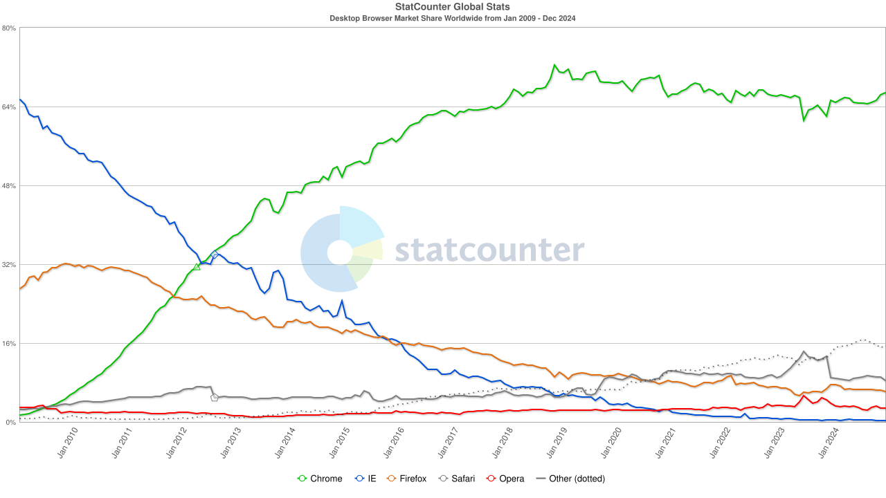

Google Chrome has been my daily driver for a really long time; so long, in fact,
that all I remember was the initial frustration when it first came out without a
release for the GNU/Linux platforms. I don't remember why, or even *whether*, I
was so eager to jump ship, and at this point I can only guess that the old ship
was the one I'm preparing to jump back to:
[Firefox](https://www.mozilla.org/en-US/firefox/new/).

It seems on-line life has gotten a wee bit more *comp-lic-ated* that it was
[back in 2008](https://cybercultural.com/p/internet-2008/), when smartphone
apps were a new thing, YouTube had only 720p video, and Spotify was brand new...

<!-- more -->

And one of the worst thing back in those days was that a single web browser had
so much market share, many (*too many*) developers would not care much about
people, including paying customers, using any other browser. The landscape has
since changed, only to essentially come back round to the same old problem:


Source: [StatCounter Global Stats - Browser Market Share](https://gs.statcounter.com/browser-market-share/desktop/worldwide#monthly-200901-202412)

These days there are other problems; developers and companies understand that
users must be respected even if they don't use the one most popular web browser,
operating system, screen resolution... well, at least *more* developers care,
but that's not enough; *still too many* don't, and so
[We Have A Browser Monopoly Again and Firefox is The Only Alternative Out There](https://batsov.com/articles/2021/11/28/firefox-is-the-only-alternative/).

## The PLN

With a significantly more complex on-line life and stronger dependencies on
many more on-line services, *one does not simply* leave everything behind.
Chrome used to be particularly useful thanks to many extensions, which would
make development easier or enable workarounds on half-broken sites. These days
I find its integrated password manager with cloud-based storage, along with
very conviniently accessible multiple profiles, the more useful features in a
modern browser. [Firefox stores passwords only locally](https://mzl.la/3vR5WB1),
which essentially means no multi-device password manager, but at least multiple
[profiles are supported](https://mzl.la/3zOUSpg) if only less convenient to use.

### Settings

Default settings are seldom the best for anyone; if anything, they are the
*one side does not exactly fit anybody* at best, or *what they want for you*
at worst. Either way, the following changes to default settings are, if not
necessarily vital, at least worth considering:

#### General

##### Startup

**☑ Open previous windows and tabs**

I like to enable this option to easily go back to consistently
[restore previous sessions](http://mzl.la/1BAQAMJ) each time. There is a mostly
fixed set of sites I like to keep *pinned* because I used them on a daily
basis, and beyond those I also like being able to just close the browser with
the peace of mind that I can easily and quickly go badk to **all** of them by
just launching the browser again.

**☐ Ask before closing multiple tabs**

This option is useful to avoid accidentally closing a window, although even then
it is not too hard to get those tabs back: just reopen the relevant profile and
then use the `Control`+`Shift`+`T` shortcut to reopen recently closed tabs.

##### Language and Appearance

###### Website appearance: Dark

I prefer dark themes on most websites, so I like to set this to **Dark**.

There are many more [themes](https://addons.mozilla.org/en-US/firefox/themes/)
available to further customize Firefox appearance; these may be useful later to
make different [profiles](#profiles) visually distinct.

###### Zoom

Working regularly on high DPI screens such as 4K and 2K monitors, I like to
keep *Default zoom* at **120%**.

###### Language

This is an interesting one if you are a multilingual person; even if you can
*just read* additional languages, it's useful to **Set Alternatives** and add
those languages, so that websites that are available in those languages are
not unnecessarily translated.

##### Digital Rights Management (DRM) Content

**☐ Play DRM-controlled content**

This option is necessary to watch video in the most protective platforms, e.g.
[Netflix Error F7701-1003](https://help.netflix.com/en/node/32661) requires
enabling DRM to play videos, Spotify requires it to play music, etc.

It may make sense to have a dedicated [profile](#profiles) with this enabled,
while leaving it disabled on all/most other profiles to avoid misuse or DRM
[Apply this workaround](https://bugzilla.mozilla.org/show_bug.cgi?id=1451762#c9) 
to avoid epetitive nagging for those profiles that are meant to never play DRM.

#### Home

##### Firefox Home Content

**☐ Web Search**

I see no need to have a search bar in the home page, since the same search is
readily available in the location bar already *and* that's where the keyboard
focus goes by default. The screen space saved by removing this can be better
used to display other, more useful links.

**☑ Shortcuts**

Shortcuts are good, but I rather not have **☐ Sponsored shortcuts**.

**☑ Recent activity**

Recent activity provides bigger page thumbnails from various sources, all of
which seem interesting enough to leave enabled and even allow this to take
2 or more rows.

#### Privacy & Security

##### Browser Privacy

###### Website Privacy Preferences

**☑ Tell websites not to sell or share my data**

This enables [Global Privacy Control](https://mzl.la/40igpUf) which
*operates as a “Do Not Sell” mechanism in some US states such as California,
Colorado and Connecticut. It may also be used to indicate an opt-out of
targeted advertising or general request to limit the sale or sharing of your
personal data in those jurisdictions, as well as in jurisdictions such as the
EU, UK, Nevada, Utah and Virginia.*

###### Passwords

**☐ Ask to save passwords**

Firefox built-in password manager stores passwords only locally, *optionally*
[protected by a primary password](https://mzl.la/3SG033C). While this is fine
for a single person using a single computer, as soon as multiple users and/or
devices are involved, it becomes more recommendable to disable this in favor of
a 3rd-party [password manager](#password-manager).

###### Autofill

**☐ Save and fill payment methods**

This should only be enabled on specific [profiles](#profiles) used for shopping.

##### Firefox Data Collection and Use

**☐ Allow Firefox to send technical and interaction data to Mozilla**

[Firefox Privacy Notice](https://www.mozilla.org/en-US/privacy/firefox/#health-report)
explains many ways in which such *technical and interaction data*, including
**To serve relevant content and advertising on Firefox New Tab**
which is not going to work anyway after disabling **☐ Sponsored shortcuts**.

**☐ Allow Firefox to send backlogged crash reports on your behalf**

##### Website Advertising Preferences

**☐ Allow websites to perform privacy-preserving ad measurement**

Disable [Privacy-Preserving Attribution](https://mzl.la/3Xht2j1) because,
quite frankly, even *Privacy-Preserving* is not unlikely to end up leaking a
bit too much.

##### Security

###### HTTPS-Only Mode

**🔘 Enable HTTPS-Only Mode in all windows**  
⊙ Enable HTTPS-Only Mode in private windows only  
⊙ Don’t enable HTTPS-Only Mode

[HTTPS-Only Mode in Firefox](https://mzl.la/3dnQOF5) should be enabled by
default everywhere; given how HTTPS is actually supported, often even
enforced, by most websites. Accessing HTTP-only sites remains easy and
exceptions can be added to make them permanent.

##### DNS over HTTPS

**Enable DNS over HTTPS using: Default Protection**

[DNS over HTTPS protection levels](https://mzl.la/3CeKjxH) higher than default
are only useful when a specific DNS provider is preferred, or when failing to
resolve DNS queries is preferred over using non-HTTPS resolvers.

#### Sync

This provides a secure method to synchronize data across Mozilla applications
using a **Mozilla account**. Currently exclusive to Firefox, Sync ensures data
is effortlessly shared and up-to-date. This enables seamless browsing across
multiple Firefox instances with bookmarks, logins and passwords, addresses,
credit cards, extensions and important settings kept consistent and accessible
across all devices.

[Create a Mozilla account](https://www.mozilla.org/en-US/account/) and keep
the [Recovery Keys](https://mzl.la/3bNrM1I) safe. These can be saved later
using a [password manager](#password-manager).

Displays a shortcut to prompts when you select text. Firefox sends the text, page title, and prompt to the chatbot.

#### Firefox Labs

##### Customize your browsing

**☐ AI chatbot** should probably stay disabled until it has been thoroughly
tested and confirmed more useful than harmful. So far the available
[community feedback](https://connect.mozilla.org/t5/discussions/share-your-feedback-on-the-ai-services-experiment-in-nightly/m-p/60519)
seems *overwhelmingly negative*.

[This](https://connect.mozilla.org/t5/discussions/share-your-feedback-on-the-ai-services-experiment-in-nightly/m-p/60840/highlight/true#M21309)
may be interesting in the future if/when employing a local LLM, there is a
way to change `about:config` to set `browser.ml.chat.provider` to any URL and,
if that URL accepts passing in prompts with `?q=`, the context menu works too.

### Profiles

Firefox [Profile Manager](https://mzl.la/3zOUSpg) may not be as convenient
(and pretty) as Chrome's, but it does let you create, remove or switch profiles.

Open `about:profiles` in a tab to see the list of profiles, create new ones,
make any one of them the default profile, and launch any in a new window.
To directly launch a specific profile by clicking on an icon, create desktop
launchers making use of the 
[`-P "profile_name"`](https://wiki.mozilla.org/Firefox/CommandLineOptions#-P_%22profile_name%22)
command line flag, or use `-P` alone to launch only the 
[Profile Manager](https://wiki.mozilla.org/Firefox/CommandLineOptions#-ProfileManager).

**All** the above [Settings](#settings) are specific to **each** profile, so
that each user can have their own profile with individual settings, etc.
The *most important* settings are also stored online via [Sync](#sync), so
it also makes sense to keep each profile synced to its own Mozilla account.

That means maintaining a number of Mozilla accounts, each with either their own
**unique email address** and password, which can lead to keeping track of many
accounts and passwords; too many to have only in one's head (or not-so-secure
places), so better setup a [password manager](#password-manager).

My preferred practice is to create a profile for each active account; meaning
accounts (Apple, Google, etc.) that I use on a daily basis, not necessarily
accounts like a dedicated one for the Android TV in the living room that is
used by the whole family.

Right after creating each profile,

1.  Install the [Bitwarden Password Manager](https://addons.mozilla.org/en-US/firefox/addon/bitwarden-password-manager/)
    (assuming the [password manager](#password-manager) is already set up),
    so that it can be used when creating the Mozilla account.
2.  Adjust all the above [settings](#settings); in particular, disable the
    built-in option to **☐ Ask to save passwords** so that Bitwarden is used.
3.  Install a visually distinct [Theme](#themes).
4.  Create an account at [accounts.firefox.com](https://accounts.firefox.com/)
    and save the credentials to Bitwarden.
5.  Enable **Sync** in Firefox settings (requires logging in again).
6.  Install whatever other [Extensions](#extentions) are relevant.

### Themes

[Themes](https://addons.mozilla.org/en-US/firefox/themes/) are not only pretty
to look at (although some of them get old *real* fast), they are also **useful**
to make each [profile](#profiles) visually distinct. Scrolling through the
[top rated themes](https://addons.mozilla.org/en-US/firefox/search/?sort=rating&
type=statictheme)
I liked a few:

- [Animated Miku Dance](https://addons.mozilla.org/en-US/firefox/addon/hatsune-miku-dancing-animated/)
- [ANIMATED sea sunset 02 by candelora](https://addons.mozilla.org/en-US/firefox/addon/animated-sea-sunset-02/)
- [chihiro](https://addons.mozilla.org/en-US/firefox/addon/chihiro/)
- [Cyberpunk \[Animated\]](https://addons.mozilla.org/en-US/firefox/addon/cyberpunk-pixels-animated/)
- [Fire Fox, The Anime Girl : Nebula Space \[Blue\]](https://addons.mozilla.org/en-US/firefox/addon/anime-firefox-girl-nebula-b/)
- [Hacker (Animated)](https://addons.mozilla.org/en-US/firefox/addon/hacker-animated/)
- [Halloween Moon Bats](https://addons.mozilla.org/en-US/firefox/addon/halloween-moon-bats/)
- [Kirby9](https://addons.mozilla.org/en-US/firefox/addon/kirby9/)
- [Nyan Cat (Animated)](https://addons.mozilla.org/en-US/firefox/addon/nyan-cat-animated/)
- [Praise the sun (animated)](https://addons.mozilla.org/en-US/firefox/addon/praisethesun/)
- [Purple starfield - Animated](https://addons.mozilla.org/en-US/firefox/addon/purple-starfield-animated/)
- [Sakura Blossoms & Birds by MaDonna](https://addons.mozilla.org/en-US/firefox/addon/sakura-blossoms-birds/)
- [Spirited Away (Animated)](https://addons.mozilla.org/en-US/firefox/addon/spirited-away-animated/)
- [TARDIS ⍟ animated](https://addons.mozilla.org/en-US/firefox/addon/tardis-spinny-twinkly-stars/)
- [Totoro 12](https://addons.mozilla.org/en-US/firefox/addon/totoro-12/)

### Extentions

There are many many *lots* of Firefox
[Extensions](https://addons.mozilla.org/en-US/firefox/extensions/)
to tweak how it behaves, or how websites look like, or behave. What follows
is only a handful I found worth *at least trying, to see how it goes*...

#### Dark Reader

[Dark Reader](https://addons.mozilla.org/en-US/firefox/addon/darkreader/)
makes *most* websites look like they have a dark mode. It turns out a bit
*hit and miss*, some websites will look *good enough*, other not really good,
while a few will look *pretty bad*, sometimes to the point of being unusable.

#### uBlock Origin

[uBlock Origin](https://addons.mozilla.org/en-US/firefox/addon/ublock-origin/)
is probably the most *transformative* extension; makes the Internet *bearable*.
(again). Ads are not even the worst part of the 
[Internet enshittification](https://arstechnica.com/gadgets/2025/02/as-internet-enshittification-marches-on-here-are-some-of-the-worst-offenders/),
so this extension helps dealing with many more of those things that make the
Internet *a sorry place*.

After installing the extension, I like to set it to prefer **Dark** theme
(under **Settings**) and enable all the additional **Filter lists**:
Cookie notices, Social widgets, Annoyances, Regions, languages.

#### Sponsor Block

[SponsorBlock](https://addons.mozilla.org/en-US/firefox/addon/sponsorblock/)
makes YouTube *bearable* (again). Sponsors may or may not be the better solution
for content creators to sustain their business, but after well over a decade
putting up with sponsor segments, I'm quite ready to not see them again. Most
(if not all) of what I watch on YouTube, especially those I watch regularly,
are creators I really like and support financially directly; they'll be okay.
I get precious little time to catch up with *their* videos, so I set this up:

Under **Behavior**:  

- Unpaid/Self Promotion: **Auto skip**
- Interaction Reminder (Subscribe): **Auto skip**
- Highlight: **Auto skip to the start**
- Intermission/Intro Animation: **Auto skip**

Under **Interface**:  

- **Disable** Show notice after a segment is skipped
- **Enable** Hide clutter in segment list group
- **Enable** Hide prompts about new features
- **Enable** Hide donation link
- **Enable** Hide options not available without extra payment

Undeer **Backup/Restore**, save the settings to file (`SponsorBlockConfig.json`)
to then easily apply the same settings to other profiles.

#### Return YouTube Dislike

[Return YouTube Dislike](https://addons.mozilla.org/en-US/firefox/addon/return-youtube-dislikes/)
should not be as needed as it sadly may still be; as much as YouTube is full of
great content, there is also many many *lots* of the opposite and the number of
dislikes *should* be a useful signal to keep an eye on.

#### Privacy Badger

[Privacy Badger](https://addons.mozilla.org/en-US/firefox/addon/privacy-badger17/)
automatically learns to block invisible trackers.

#### Search by Image

[Search by Image](https://addons.mozilla.org/en-US/firefox/addon/search_by_image/)
makes effortless reverse image searches possible, and comes with support
for more than 30 search engines.

#### Augmented Steam and SteamDB

[Augmented Steam](https://addons.mozilla.org/en-US/firefox/addon/augmented-steam/)
and [SteamDB](https://addons.mozilla.org/en-US/firefox/addon/steam-database/)
add small but nice-to-have improvements to the Steam store, which I'm mostly
curious about even though I may visit that store only a few times per year.

The most welcome features I would say are the ones that get rid of repetitive,
useless and/or annoying behaviors, such as

- Skip age check page
- Remove "You are leaving Steam" link filter from external sites
- Hide "Open in Steam" banner

#### Account-isolation Containers

[Firefox Multi-Account Containers](https://addons.mozilla.org/en-US/firefox/addon/multi-account-containers/)
(explained in [Multi-Account Containers](https://mzl.la/3bGetAg)), and the
[Facebook Container](https://addons.mozilla.org/en-US/firefox/addon/facebook-container/)
in particular, seems interesting for cases where Facebook or similar web apps
are unavoidable. Since I'm pretty good at avoiding Facebook, this shall stay
filed under *Interesting, Revisit Later If Needed*.

#### NoScript Security Suite

[NoScript Security Suite](https://addons.mozilla.org/en-US/firefox/addon/noscript/)
seems a bit too strong and restrictive, for instance Discord web app turns into
an empty void when this is enabled. More concerning would be e-Banking web apps
or other real-life mission-critical web apps that depend, for entirely legit
reasons, on scripting techniques that this extention would flag as malicious.

#### DeArrow

[DeArrow](https://dearrow.ajay.app/payment/#link=firefox) is a paid browser
extension: unlimited-use license key for 1$, 6-hour free trial. The *idea* of
moving away from clickbait and sensationalism is mildly appealing, but some of
the examples seem to go a little too far in the opposite directions. Either way,
even if not something to jump into right away, this is something to be aware of.

## Password Manager

If had a penny for each time I've heard someone saying *people, get yourself a
password manager!* I could probably afford myself a harty meal. Adding those who
also have shared their *quest to passwordmanagerized the whole family*, I should
have enough for an unreasonably hefty dessert.

Google's password manager is integrated well enough with Chrome and Android, so
that for quite a few years I have seldom needed to remember or lookup more than a
few passwords, but I do run into its limitations more often than I'd like. Other
browsers in Android and other applications on desktop don't get any of those
benefits, which often means having to ask Chrome for the password or, when that
is not an option, storing a few passwords in an *alternative storage* which, to
put it mildly, is not quite as secure as a *proper* password manager.

### A 2025 Comparison

Choosing *a* password manager can be a bit of a daunting task; although it is
probably not as hard to switch password managers are cars or houses, it is still
something one does not simply do in a few minutes. In the spirit of contrasting
multiple sources, without even trying too hard to verify how *reputable* each of
these sources are, and not bothering at all to figure out whether each of these
has been written by actual human beins with carbon-based brain, I've put together
this multi-source comparision (sources below):

| Ranking | Engadget | Safety Detectives | PCMag | security.org | tom's guide | TechRadar | Password Manager | Zapier | Cybernews |
| ------: | :------: | :---------------: | :---: | :----------: | :---------: | :-------: | :--------------: | :----: | :-------: |
| 1 | 1Password | 1Password | RoboForm | RoboForm | 1Password | NordPass | 1Password | 1Password | NordPass |
| 2 | Bitwarden | Dashlane | NordPass | NordPass | Bitwarden | Dashlane | Dashlane | Bitwarden | RoboForm |
| 3 | NordPass | RoboForm | Proton Pass | Total Password | Keeper | RoboForm | Keeper | Dashlane | 1Password |
| 4 | Dashlane | NordPass | 1Password | Dashlane | NordPass | | | Apple Passwords | Keeper |
| 5 | | Keeper | Dashlane | 1Password | Bitdefender | | | | Dashlane |
| 6 | | | LastPass | | Proton Pass | | | | Bitwarden |
| 7 | | | LogMeOnce | | Dashlane | | | | |
| 8 | | | Keeper | | Apple Passwords | | | | |
| 9 | | | Bitwarden | | | | | | |
| 10 | | | Enpass | | | | | | |

??? note "Sources (in reverse chronological order):"
    
    - [The best password manager for 2025](https://www.engadget.com/cybersecurity/best-password-manager-134639599.html)
      from Engadget, Mar 7, 2025.
    - [10 Best Password Managers for Windows in 2025](https://www.safetydetectives.com/best-password-managers/windows/)
      from Safety Detectives, March 7, 2025. 
    - [The Best Password Managers for 2025](https://uk.pcmag.com/password-managers/4296/the-best-password-managers)
      from PCMag, Feb 21, 2025.
    - [The Best Free Password Managers of 2025](https://www.security.org/password-manager/best/free/)
      from security.org, Feb 19, 2025.
    - [The best password managers in 2025](https://www.tomsguide.com/us/best-password-managers,review-3785.html)
      from tom's guide, February 11, 2025.
    - [The 4 best password managers in 2025](https://zapier.com/blog/best-password-manager/)
      from Zapier, February 6, 2025
    - [The best password manager for 2025](https://cybernews.com/best-password-managers/)
      from Cybernews, February 4, 2025
    - [Best password manager of 2025](https://www.techradar.com/best/password-manager)
      from TechRadar, January 9, 2025.
    - [The Best Password Managers of 2025](https://www.passwordmanager.com/best-password-managers/)
      from Password Manager, *Updated* June 23, **2023** (!!??)

    The first two sources claim to have been *updated* just yesterday, while
    the last one was updated in 2023 to list the best ones in 2025... take that
    with a chunk of salt.

Aggreating these rankings by giving each contestant 1 point each time they rank
in the first position, 1/2 pont each time they rank in the second position, and
so on, only three stand out:

1. [**1Password**](https://1password.com/) with 5.78 points.
1. [**NordPass**](https://nordpass.com/) with 3.83 points.
1. [**Bitwarden**](https://bitwarden.com/) with 3.27 points.

Comparing [Bitwarden pricing](https://bitwarden.com/pricing/) and
[NordPass pricing](https://nordpass.com/plans/) for *personal* use,
although they both offer a **Free** tier, only Bitwarden seems to offer enough
functionality to make that free tier *realistically useful* in the long run.
[1Password pricing](https://1password.com/pricing) includes no Free tier, only a
14-day free trial.

### Bitwarden

And so the adventure begins at
[bitwarden.com/go/start-free](https://bitwarden.com/go/start-free/),
creating a new account using my main everyday email address. The email takes a
minute or two to come in, with the link to finish the process by setting a
primary password. Funnily enough, the *unrecoverable* primary password for
*the new* password manager can be stored in *the old* password manager.

#### Import Passwords

[Import Data to your Vault](https://bitwarden.com/help/import-data/) should be
the first step after creating the account, and that means importing passwords
[from Google Chrome](https://bitwarden.com/help/import-from-chrome/) since that
is the one that has been in use for years.

Since multiple Chrome profiles have been in used over the years, although most
of them had been out of use for years too, this involved repeating a few steps
for each profile:

1. Open `chrome://password-manager` to check if there are any passwords.
2. If there are, then open `chrome://password-manager/settings` to download them,
   this will download a `Chrome Passwords.csv` file.
3. Create a **Folder** named after the profile, just to keep things tidy.
4. Go to [**Import Data**](https://bitwarden.com/help/import-data/) (under
   **Tools**) and upload the `Chrome Passwords.csv` into the corresponding
   **Folder**.

#### Chrome extension

[bitwarden.com/browser-start](https://bitwarden.com/browser-start/) suggests to
install the relevant browser extension once data has been imported. Because
Bitwarden supports multiple devices, the same account (vault) can be used at
the same time from Chrome and Firefox.

#### Firefox Add-on

[Bitwarden Password Manager](https://addons.mozilla.org/en-US/firefox/addon/bitwarden-password-manager/)
is just as easy to setup: install, pin to the toolbar, log in. The whole dance
needs to be done for each and every [profile](#profile), 

#### Desktop applications

Installing the Linux desktop app and command line tool is super easy with `snap`:

``` console
$ snap search bitwarden
Name         Version   Publisher    Notes  Summary
bitwarden    2025.2.1  bitwarden✓   -      Bitwarden
bw           2025.1.3  bitwarden✓   -      Bitwarden CLI - A secure and free password manager for all of your devices.
...

$ sudo snap install bitwarden bw
bitwarden 2025.2.1 from 8bit Solutions LLC (bitwarden✓) installed
bw 2025.1.3 from 8bit Solutions LLC (bitwarden✓) installed
```
