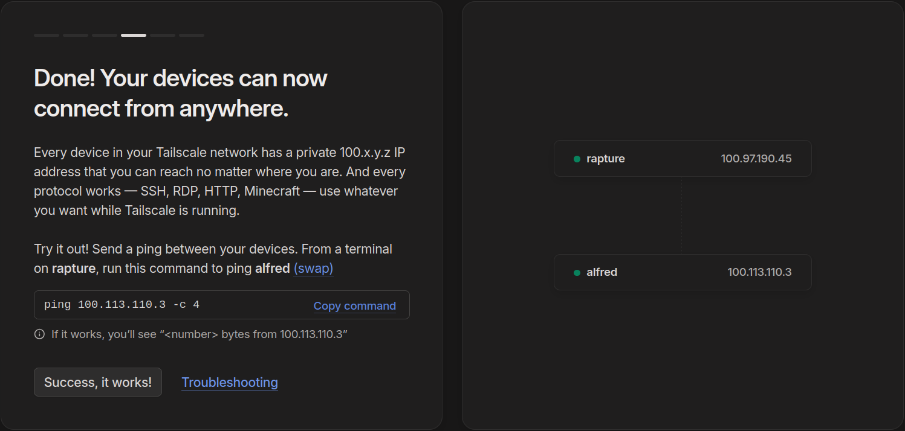
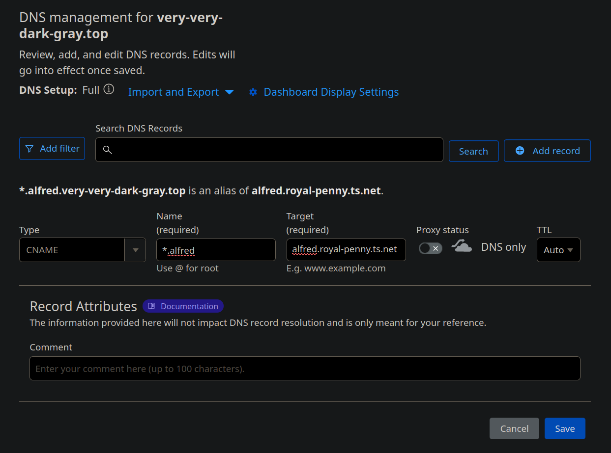
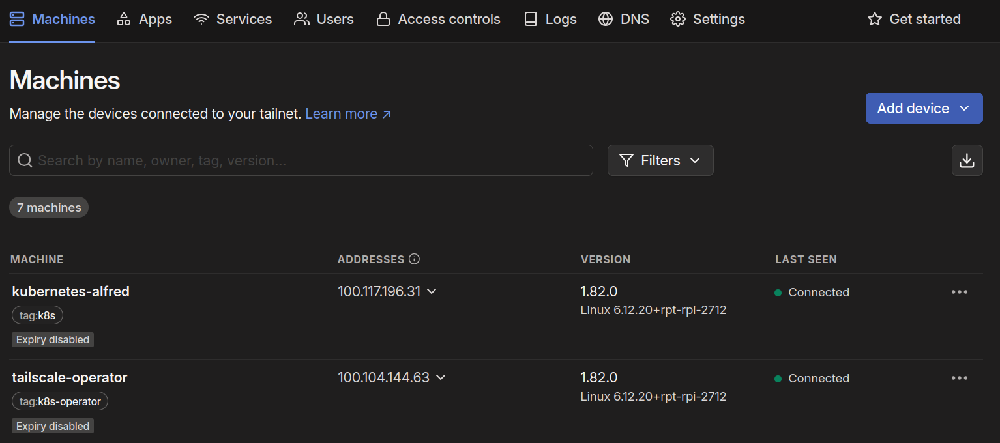

Running self-hosted services behind a router that allows port forwarding is *mostly* as
simple as forwarding a few ports, mainly 443 for everything over HTTP**S** and port 80 for
[automatically renewing Let's Encrypt certificates](./2025-02-22-home-assistant-on-kubernetes-on-raspberry-pi-5-alfred.md#automatic-renovation).

Otherwise, being behind a router that either doens't allow port forwarding, or just doesn't
work well, or being behind [CGNAT](https://en.wikipedia.org/wiki/Carrier-grade_NAT),
may require the use of some sort of tunnels to route inbound traffic using outbound
connections. This can also be useful even in the above case, when multiple systems need to
be reachable *on port 80*.

??? note "Cloudflare tunnels do not enable access on port 80."

    Cloudflare redirects port 80 to 443, to upgrade HTTP connections to HTTPS. That means
    ACME HTTP-01 challenges to renew Let's Encrypt certificates need to be routed to the
    relevant port (80 or 32080) based on the request **path**; see
    [Let's Encrypt via tunnel](./2025-02-22-home-assistant-on-kubernetes-on-raspberry-pi-5-alfred.md#lets-encrypt-via-tunnel).

<!-- more -->

## Options considered

Making applications (ports) reachable from outside will require a different approach and
implementation depending on the type of traffic served by the application behind each port:

- **HTML *non-sensitive* content** can easibly be made available through a
  [Cloudflare Tunnel](https://developers.cloudflare.com/cloudflare-one/connections/connect-networks/).
  These are free to use and easy to setup, with the caveats that

    * Traffic **must** be decrypted by Cloudflare, to apply certain traffic filters, even
      if everything is then (re-)encrypted between Cloudflare and each service.
    * Traffic **must** be *either* HTML content or **low-bandwidth** non-HTML content.
      Cloudflare does not allow, at least when using their tunnels for free, to stream
      high-bandwidth multi-media content: audio, video, photos, videogame client-to-server
      communication, etc.

- **HTML *sensitive* content** may also be made available through a
  [Cloudflare Tunnel](https://developers.cloudflare.com/cloudflare-one/connections/connect-networks/);
  [Zero Trust Access](https://developers.cloudflare.com/cloudflare-one/policies/access/)
  can be used to limit access to each application (port) based on a number of rules,
  including user's identity as verified by 3P SSO providers (e.g. Google account).

- **Non-HTML *sensitive* content** may also be made available through a
  [Cloudflare Tunnel](https://developers.cloudflare.com/cloudflare-one/connections/connect-networks/);
  [Non-HTTP applications](https://developers.cloudflare.com/cloudflare-one/applications/non-http/)
  [require connecting your private network to Cloudflare](https://developers.cloudflare.com/cloudflare-one/connections/connect-networks/private-net/)
  which, again, means that Cloudflare is decrypting traffic (to inspected it and apply
  filters) to then re-encrypt it again. Then again, this may only be used for
  **low-bandwidth** non-HTML content, e.g. SSH sessions. Ideally with password
  authentication disabled!

- **Non-HTML *sensitive* ~~or *high-bandwidth*~~ content** can also be made *reachable*
  externally, through the use of  [Tailscale Funnel](https://tailscale.com/kb/1223/funnel)
  (or similar) to establish [fully-encrypted](https://tailscale.com/kb/1504/encryption)
  (TLS passthrough) tunnels between *sites* (LANs) and a few trusted clients. However,
  [this is only suitable for low-bandwidth applications](https://www.reddit.com/r/Tailscale/comments/188jvlr/is_funnels_really_slow/),
  and there is no way of knowing how tightly bandwidth is restricted.

- **Non-HTML *high-bandwidth* content** (sensitive or not) seems to be only practical to
  expose by opening and forwarding ports; as much as this seems to be the method most
  people recommend *against*. This is also the method that *just won't work* when working
  with a defective or restriced router, or behind CGNAT.

## Options chosen

With the above considerations, each of those options would seem to best match the
relevant self-hosted services as follows:

- [Cloudflare Tunnel](https://developers.cloudflare.com/cloudflare-one/connections/connect-networks/) 
  can be used for non-sensitive, or at least *not-too-sensitive*, HTML content:
    * [automatically renewing Let's Encrypt certificates](./2025-02-22-home-assistant-on-kubernetes-on-raspberry-pi-5-alfred.md#automatic-renovation.md) 
      over plain HTTP on port 80.
    * [InfluxDB](./2024-04-20-monitoring-with-influxdb-and-grafana-on-kubernetes.md)
      already serving over HTTPS and *not-too-sensitive*; basic PC monitoring.

- [Cloudflare Tunnel](https://developers.cloudflare.com/cloudflare-one/connections/connect-networks/) 
  can also be used for sensitive HTML content, when combined with
  [Zero Trust Access](https://developers.cloudflare.com/cloudflare-one/policies/access/)
  to restrict access to each service:
    * [Grafana](./2024-04-20-monitoring-with-influxdb-and-grafana-on-kubernetes.md)
    * [UniFi Controller](./2024-12-31-migrating-unifi-controller-to-kubernetes.md)
    * [Visual Studio Code Server](./2023-05-29-running-vs-code-server-on-kubernetes.md)
    * [Kubernetes Dashboard](https://kubernetes.io/docs/tasks/access-application-cluster/web-ui-dashboard/)
    * [Firefly III](./2024-05-19-self-hosted-accountancy-with-firefly-iii.md)
    * [Homebox](./2024-07-10-self-hosted-inventory-with-homebox.md)

- [Tailscale Funnel](https://tailscale.com/kb/1223/funnel)
  must be used for those applications that transfer mostly non-HTML content:
    * [Audiobookshelf](./2024-02-28-audiobookshelf-on-kubernetes.md)
    * [Komga: eBook library](./2024-05-26-self-hosted-ebook-library-with-komga.md)
    * [Navidrome](./2024-10-26-self-hosted-music-streaming-with-navidrome.md)
    * [Plex Media Server](./2023-09-16-migrating-a-plex-media-server-to-kubernetes.md)
    * SSH

- Port forwarding may still be needed for **non-HTTP** services that are meant to be
  accessible by *technically not trusted* clients, i.e. without Tailscale. This would
  be mostl video game servers, of which there is so far only
    * [Minecraft Server](./2023-08-10-running-minecraft-java-server-for-bedrock-clients-on-kubernetes.md)

DNS records are setup to point the various `<service>.<node>.uu.am` to the external IP
address of the router, with port 80 redirected to **one** node's port `32080`, so that
HTTPS certificates can be renewed automatically, and port 443 pointing to Nginx on **one**
node. While it is possible to access Nginx on additional nodes by forwarding a different
port, the automated renewals of HTTPS certificates is only possible over port 80.

This limitation may mean the node that is rechable through the external port 80 is the
only one that can serve high-bandwidth content directly via port forwarding. All other
nodes will need to use Cloudflare tunnels, and thus be restricted to HTML-only or
low-bandwidth traffic, or use Tailscale Funnel to serve high-bandwidth traffic, and
thus be restricted to specific clients.

## Cloudflare

To get started with Cloudflare, create account and a team (e.g. `high-energy-building`),
select the **Free plan**, enter billing details and checkout. Make sure to enable 2FA
authentiction and take a look around for other settings to personalize.

### Add the first site

[Adding a site](https://developers.cloudflare.com/fundamentals/setup/manage-domains/add-site/)
is required before creating a tunnel. This can be an external domain, although it requires
replacing that domain's DNS with the one from Cloudflare. It seems most convenient to have
a dedicated domain for self-hosted applications, to be used mostly, if not exclusively,
through Cloudflare tunnels. For this purpose, I've registered `very-very-dark-gray.top`
with Porkbun and cleared the default DNS records, which removed their
[parking domain](https://kb.porkbun.com/article/239-cname-alias-record-with-that-host-already-exists-error).

Start at the **Account Home** in
[dash.cloudflare.com](https://dash.cloudflare.com/0041a4dbd1c161fe785c4f63fa8fcc06/home),
enter the new domain and select the option to *Manually enter DNS records* since
there is none anyway. Scroll down to select the **Free plan** and continue to
start adding DNS records.

Having no DNS records yet, 3 warnings are shown about missing an MX record to for
emails to `@very-very-dark-gray.top` addresses and missing A/AAAA/CNAME records
for the root domain and `www`. All that is fine, there is no need for those.

As a quick test, add a subdomain for `alfred` pointing to the router's external
IPv4 address and let it be proxied by Cloudflare to see how that goes. Then
replace the DNS for this domain with the ones from Cloudflare's, and wait.

Once the change is live, go under **DNS > Settings** in Cloudflare and
[Enable DNSSEC](https://developers.cloudflare.com/dns/dnssec/).

### Cloudflare Tunnels

Tunnels are very easy to setup; accessing applications behind them not necessarily so much.
[Cloudflare Tunnels in Alfred](./2025-02-22-home-assistant-on-kubernetes-on-raspberry-pi-5-alfred.md#cloudflare-tunnel)
involved an *unfair* amount of troubleshooting to get the Kubernetes dashboard to work at
[https://kubernetes-alfred.very-very-dark-gray.top/](https://kubernetes-alfred.very-very-dark-gray.top/),
eventually using it's own Let's Encrypt certificates.

### Cloudflare Access

[Zero Trust Web Access](https://developers.cloudflare.com/learning-paths/zero-trust-web-access/)
builds on top of the previous setup; once an applications is made available through a
tunnel, restricting access to a fixed set of users (e.g. Google accounts) requires only
a few more steps:

1.  [Set up Google as an identity provider](https://developers.cloudflare.com/cloudflare-one/identity/idp-integration/google/),
    which requires creating an OAuth Client ID in the Google Cloud Console.

    The OAuth client will be limited to a list of (max 100) test users, which is more than
    enough but those users have to be manually added in the Google Cloud Console, under
    [/auth/audience?project=very-very-dark-gray](https://console.cloud.google.com/auth/audience?project=very-very-dark-gray).

1.  Create a **Policy** (e.g *Google Account*) to **Allow** only a few users, with
    **only one Include rule** to match those users' email addresses.

1.  [Create an Access application](https://developers.cloudflare.com/learning-paths/zero-trust-web-access/access-application/create-access-app/); more precisely a
    **self-hosted** application (e.g. `kubernetes-alfred`) for a **Public hostname**
    ([https://kubernetes-alfred.very-very-dark-gray.top/](https://kubernetes-alfred.very-very-dark-gray.top/)) and add **only** the **Google Account** policy, so that
    only users that match that policy are allowed. To authenicate those users, enable
    **only** the *Google* authentication in **Login methods** ane enable **Instant Auth**.

So long as **only one policy** is added to the applications *and* that policy has
**only one Include rule**, only those users added to that Include rule are allowed in.

Additional sources of inspiration (not reference):

- [Cloudflare Tunnels with SSO/OAuth working for immich](https://github.com/immich-app/immich/discussions/8299)
- [HOWTO: Secure Cloudflare Tunnels remote access](https://community.home-assistant.io/t/howto-secure-cloudflare-tunnels-remote-access/570837/1)

## Tailscale

[Tailscale quickstart](https://tailscale.com/kb/1017/install) explains the basics and how to
get started as a [personal user](https://tailscale.com/kb/1017/install#personal-users).

### Create a tailnet

[Create a tailnet](https://tailscale.com/kb/1017/install#create-a-tailnet)
by singing up with your choice of identity provider; e.g. signging up with a `@gmail.com`
account automatically set the tailnet up so that other `@gmail.com` users can be invited
to form part of the "team". Choosing the **Personal Plan** keeps the service free of charge,
there is not even a requirement to setup a valid billing method (e.g. credit card).

The quickstart wizard will wait until **Tailscale** is installed on 2 systems, e.g. a
server and a PC. The installation process is as simple as running their `install.sh` script:

??? terminal "Installation of Tailscale on **alfred**"

    ``` console
    pi@alfred:~ $ curl -fsSL https://tailscale.com/install.sh | sh
    Installing Tailscale for debian bookworm, using method apt
    + sudo mkdir -p --mode=0755 /usr/share/keyrings
    + curl -fsSL https://pkgs.tailscale.com/stable/debian/bookworm.noarmor.gpg
    + sudo tee /usr/share/keyrings/tailscale-archive-keyring.gpg
    + sudo chmod 0644 /usr/share/keyrings/tailscale-archive-keyring.gpg
    + curl -fsSL https://pkgs.tailscale.com/stable/debian/bookworm.tailscale-keyring.list
    + sudo tee /etc/apt/sources.list.d/tailscale.list
    # Tailscale packages for debian bookworm
    deb [signed-by=/usr/share/keyrings/tailscale-archive-keyring.gpg] https://pkgs.tailscale.com/stable/debian bookworm main
    + sudo chmod 0644 /etc/apt/sources.list.d/tailscale.list
    + sudo apt-get update
    Hit:1 http://deb.debian.org/debian bookworm InRelease
    Hit:2 http://archive.raspberrypi.com/debian bookworm InRelease                                               
    Hit:3 https://download.docker.com/linux/debian bookworm InRelease                                            
    Hit:4 http://deb.debian.org/debian-security bookworm-security InRelease                                      
    Hit:5 http://deb.debian.org/debian bookworm-updates InRelease                                                
    Hit:6 https://baltocdn.com/helm/stable/debian all InRelease                                                  
    Hit:7 https://prod-cdn.packages.k8s.io/repositories/isv:/kubernetes:/core:/stable:/v1.32/deb  InRelease
    Get:8 https://pkgs.tailscale.com/stable/debian bookworm InRelease               
    Get:9 https://pkgs.tailscale.com/stable/debian bookworm/main armhf Packages [12.2 kB]
    Get:10 https://pkgs.tailscale.com/stable/debian bookworm/main arm64 Packages [12.3 kB]
    Get:11 https://pkgs.tailscale.com/stable/debian bookworm/main all Packages [354 B]
    Fetched 31.4 kB in 1s (29.4 kB/s)  
    Reading package lists... Done
    + sudo apt-get install -y tailscale tailscale-archive-keyring
    Reading package lists... Done
    Building dependency tree... Done
    Reading state information... Done
    The following packages were automatically installed and are no longer required:
      linux-headers-6.6.51+rpt-common-rpi linux-kbuild-6.6.51+rpt
    Use 'sudo apt autoremove' to remove them.
    The following NEW packages will be installed:
      tailscale tailscale-archive-keyring
    0 upgraded, 2 newly installed, 0 to remove and 0 not upgraded.
    Need to get 29.6 MB of archives.
    After this operation, 56.1 MB of additional disk space will be used.
    Get:2 https://pkgs.tailscale.com/stable/debian bookworm/main all tailscale-archive-keyring all 1.35.181 [3,082 B]
    Get:1 https://pkgs.tailscale.com/stable/debian bookworm/main arm64 tailscale arm64 1.82.0 [29.6 MB]   
    Fetched 29.6 MB in 15s (2,040 kB/s)                                                                          
    Selecting previously unselected package tailscale.
    (Reading database ... 91338 files and directories currently installed.)
    Preparing to unpack .../tailscale_1.82.0_arm64.deb ...
    Unpacking tailscale (1.82.0) ...
    Selecting previously unselected package tailscale-archive-keyring.
    Preparing to unpack .../tailscale-archive-keyring_1.35.181_all.deb ...
    Unpacking tailscale-archive-keyring (1.35.181) ...
    Setting up tailscale-archive-keyring (1.35.181) ...
    Setting up tailscale (1.82.0) ...
    Created symlink /etc/systemd/system/multi-user.target.wants/tailscaled.service → /lib/systemd/system/tailscaled.service.
    + [ false = true ]
    + set +x
    Installation complete! Log in to start using Tailscale by running:

    sudo tailscale up
    ```

??? terminal "Installation of Tailscale on **rapture**"

    ``` console
    $ curl -fsSL https://tailscale.com/install.sh | sh
    Installing Tailscale for ubuntu noble, using method apt
    + sudo mkdir -p --mode=0755 /usr/share/keyrings
    + curl -fsSL https://pkgs.tailscale.com/stable/ubuntu/noble.noarmor.gpg
    + sudo tee /usr/share/keyrings/tailscale-archive-keyring.gpg
    + sudo chmod 0644 /usr/share/keyrings/tailscale-archive-keyring.gpg
    + curl -fsSL https://pkgs.tailscale.com/stable/ubuntu/noble.tailscale-keyring.list
    + sudo tee /etc/apt/sources.list.d/tailscale.list
    # Tailscale packages for ubuntu noble
    deb [signed-by=/usr/share/keyrings/tailscale-archive-keyring.gpg] https://pkgs.tailscale.com/stable/ubuntu noble main
    + sudo chmod 0644 /etc/apt/sources.list.d/tailscale.list
    + sudo apt-get update
    Hit:1 http://ch.archive.ubuntu.com/ubuntu noble InRelease
    Hit:2 https://brave-browser-apt-release.s3.brave.com stable InRelease                                        
    Hit:3 https://repo.steampowered.com/steam stable InRelease                                                   
    Hit:4 http://ch.archive.ubuntu.com/ubuntu noble-updates InRelease                                            
    Hit:5 http://archive.ubuntu.com/ubuntu noble InRelease                                                       
    Hit:6 http://ch.archive.ubuntu.com/ubuntu noble-backports InRelease                                          
    Hit:7 https://packages.microsoft.com/repos/code stable InRelease                                             
    Hit:8 https://dl.google.com/linux/chrome/deb stable InRelease                                                
    Hit:9 http://archive.ubuntu.com/ubuntu noble-updates InRelease                                               
    Hit:10 https://esm.ubuntu.com/apps/ubuntu noble-apps-security InRelease                                      
    Hit:11 https://esm.ubuntu.com/apps/ubuntu noble-apps-updates InRelease                                       
    Hit:12 https://esm.ubuntu.com/infra/ubuntu noble-infra-security InRelease                        
    Hit:13 https://esm.ubuntu.com/infra/ubuntu noble-infra-updates InRelease                         
    Hit:14 http://security.ubuntu.com/ubuntu noble-security InRelease          
    Get:15 https://pkgs.tailscale.com/stable/ubuntu noble InRelease
    Get:16 https://pkgs.tailscale.com/stable/ubuntu noble/main all Packages [354 B]
    Get:17 https://pkgs.tailscale.com/stable/ubuntu noble/main i386 Packages [12.2 kB]
    Get:18 https://pkgs.tailscale.com/stable/ubuntu noble/main amd64 Packages [12.7 kB]
    Fetched 31.8 kB in 1s (23.3 kB/s)                
    Reading package lists... Done
    N: Skipping acquire of configured file 'main/binary-i386/Packages' as repository 'https://brave-browser-apt-release.s3.brave.com stable InRelease' doesn't support architecture 'i386'
    + sudo apt-get install -y tailscale tailscale-archive-keyring
    Reading package lists... Done
    Building dependency tree... Done
    Reading state information... Done
    The following NEW packages will be installed:
      tailscale tailscale-archive-keyring
    0 upgraded, 2 newly installed, 0 to remove and 0 not upgraded.
    Need to get 31.5 MB of archives.
    After this operation, 59.1 MB of additional disk space will be used.
    Get:2 https://pkgs.tailscale.com/stable/ubuntu noble/main all tailscale-archive-keyring all 1.35.181 [3,082 B]
    Get:1 https://pkgs.tailscale.com/stable/ubuntu noble/main amd64 tailscale amd64 1.82.0 [31.5 MB]       
    Fetched 31.5 MB in 14s (2,258 kB/s)                                                                          
    Selecting previously unselected package tailscale.
    (Reading database ... 491341 files and directories currently installed.)
    Preparing to unpack .../tailscale_1.82.0_amd64.deb ...
    Unpacking tailscale (1.82.0) ...
    Selecting previously unselected package tailscale-archive-keyring.
    Preparing to unpack .../tailscale-archive-keyring_1.35.181_all.deb ...
    Unpacking tailscale-archive-keyring (1.35.181) ...
    Setting up tailscale-archive-keyring (1.35.181) ...
    Setting up tailscale (1.82.0) ...
    Created symlink /etc/systemd/system/multi-user.target.wants/tailscaled.service → /usr/lib/systemd/system/tailscaled.service.
    + [ false = true ]
    + set +x
    Installation complete! Log in to start using Tailscale by running:

    sudo tailscale up
    ```

After installing the software, running `sudo tailscale up` will provide a URL to 
authenticate and the system will show up as ready in the wizard:

``` console
$ sudo tailscale up

To authenticate, visit:

        https://login.tailscale.com/a/______________

Success.
```

Repeat the process with the second system and the wizzard will show both as active;
along with a useful test to check that all is working well:

> Every device in your Tailscale network has a private 100.x.y.z IP address
> that you can reach no matter where you are. And every protocol works —
> SSH, RDP, HTTP, Minecraft — use whatever you want while Tailscale is running.



And indeed that *just works*; an SSH connection to `pi@100.113.110.3` instantly connects to
`alfred` and SSH key authentication just works (after accepting this new hostname).

From this point on, one can connect more devices, by repeating the above 2 steps:
install Tailscale, then authenticate it to join this tailnet. It may be a good idea to add
all desired devices before proceeding to additional configuration changes, such as

*   [Set up DNS](https://login.tailscale.com/admin/dns), to more easily connect to devices.
*   [Share a node](https://tailscale.com/kb/1084/sharing) with users on other networks.
*   [Set up access controls](https://login.tailscale.com/admin/acls) to limit which devices
    can talk to each other.

### Set up DNS

The first step when setting up DNS, although optional, should be to rename the tailnet to a
more memorable ("fun") name. There is a limited number of 4 randomly generated names to pick
from, which one can reroll many times but will never, probably by design, contain only
dictionary words. Some of the "funniest" names offered were:

*   `blenny-godzilla.ts.net`
*   `chicken-fujita.ts.net`
*   `ocelot-betelgeuse.ts.net`
*   `raptor-penny.ts.net`
*   `royal-penny.ts.net`
*   `risk-truck.ts.net`
*   `xantu-lizard.ts.net`

The tailnet name is not too important, so just pick the first one that isn't too long or
hard to spell, then try re-rolling a few times just in a case a better one shows up.

[MagicDNS](https://tailscale.com/kb/1081/magicdns) being enabled by default, it should be
possible to ping or SSH directly to `alfred.royal-penny.ts.net`, etc.

``` console
$ ping alfred.royal-penny.ts.net
PING alfred.royal-penny.ts.net (100.113.110.3) 56(84) bytes of data.
64 bytes from alfred.royal-penny.ts.net (100.113.110.3): icmp_seq=1 ttl=64 time=5.51 ms
64 bytes from alfred.royal-penny.ts.net (100.113.110.3): icmp_seq=2 ttl=64 time=4.92 ms
64 bytes from alfred.royal-penny.ts.net (100.113.110.3): icmp_seq=3 ttl=64 time=5.37 ms
^C
--- alfred.royal-penny.ts.net ping statistics ---
3 packets transmitted, 3 received, 0% packet loss, time 2002ms
rtt min/avg/max/mdev = 4.921/5.264/5.505/0.249 ms
```

!!! note

    MagicDNS seems to need some time to propagate, so that for several minutes (possibly a
    few hours) after connecting each host, its name will not resolve.

Once DNS has propagated, it is also possible to SSH directly to any host by its FQDN.

To make web services more easily available, one can add a `CNAME` record for a publicly
reachable domain to redirect every hostname under a subdomain to a specirfic host (node)
in the tailnet, e.g. redirect everything under `.alfred.very-very-dark-gray.top` to the
`alfred` node, **disabling** traffic proxying so that this is only a **DNS only** redirect:



Unfortunately, this does not support adding a port number, so the services would only be available when listening on standard ports, e.g. when using a `LoadBalancer` IP in
Kubernetes nodes. However, whether it's because a `LoadBalancer` IP is not the same as the
node's IP, or something else, HTTPS connections are rejected on port 443 (but not 22):

``` console
$ telnet 100.113.110.3 443
Trying 100.113.110.3...
telnet: Unable to connect to remote host: Connection refused

$ telnet 100.113.110.3 22
Trying 100.113.110.3...
Connected to 100.113.110.3.
Escape character is '^]'.
SSH-2.0-OpenSSH_9.2p1 Debian-2+deb12u5
^]
telnet> 
Connection closed.
```

It seems services can only be accessed through `NodePort` ports, 

``` console
$ curl -k https://kubernetes.alfred.very-very-dark-gray.top/
curl: (7) Failed to connect to kubernetes.alfred.very-very-dark-gray.top port 443 after 1 ms: Couldn't connect to server

$ curl 2>/dev/null \
  -H "Host: kubernetes-alfred.very-very-dark-gray.top" \
  -k https://kubernetes.alfred.very-very-dark-gray.top:32035/ \
| head
<!--
Copyright 2017 The Kubernetes Authors.

Licensed under the Apache License, Version 2.0 (the "License");
you may not use this file except in compliance with the License.
You may obtain a copy of the License at

    http://www.apache.org/licenses/LICENSE-2.0

Unless required by applicable law or agreed to in writing, software
```

However, exposing port 80 *and* redirecting it to a different `NodePort`, as needed for
[automatically renewing Let's Encrypt certificates](./2025-02-22-home-assistant-on-kubernetes-on-raspberry-pi-5-alfred.md#automatic-renovation),
does not seem to be possible. HTTPS access should be setup differently, as follows.

### Set up HTTPS access

Exposing **Kubernetes** services throuth Tailscale requires the use of the
[Kubernetes operator](https://tailscale.com/kb/1236/kubernetes-operator), which involves
the following one-time (per node/host) setup and one additional `Ingress` per service.

#### Tailscale Kubernetes operator

[Securely Exposing Applications on Kubernetes With Tailscale](https://joshrnoll.com/securely-exposing-applications-on-kubernetes-with-tailscale/)
using the **Tailscale Kubernetes operator** and the *Tailscale Ingress Controller*
enables access over HTTPS with valid (signed) SSL certificates from within your tailnet.

Create a `tailscale` namespace and **allow privilege escalation** via a namespace label:

``` console
$ kubectl create namespace tailscale
namespace/tailscale created

$ kubectl label namespace tailscale pod-security.kubernetes.io/enforce=privileged
namespace/tailscale labeled
```

[Edit Tailscale ACL](https://login.tailscale.com/admin/acls/file) to set the following
`tagOwners`:

``` json
"tagOwners": {
   "tag:k8s-operator": [],
   "tag:k8s": ["tag:k8s-operator"],
}
```

Create an [Oauth Client](https://login.tailscale.com/admin/settings/oauth), with a unique
name (e.g. `k8s-operator` or `k8s-operator-alfred`) and read/write access to
**Devices > Core** and **Keys > Auth Keys**, with the `k8s-operator` **tag** in both.
**Copy the Client ID and secret**, keep them safe because these will never be provided
again. Then install the Tailscale Kubernetes operator with Helm using these:

``` console
$ helm repo add tailscale https://pkgs.tailscale.com/helmcharts && helm repo update
"tailscale" has been added to your repositories
Hang tight while we grab the latest from your chart repositories...
...Successfully got an update from the "kubernetes-dashboard" chart repository
...Successfully got an update from the "ingress-nginx" chart repository
...Successfully got an update from the "jetstack" chart repository
...Successfully got an update from the "tailscale" chart repository
Update Complete. ⎈Happy Helming!⎈

$ helm upgrade \
  --install \
  tailscale-operator \
  tailscale/tailscale-operator \
  --namespace=tailscale \
  --create-namespace \
  --set-string oauth.clientId="_________________" \
  --set-string oauth.clientSecret="tskey-client-_________________-__________________________________" \
  --wait
Release "tailscale-operator" does not exist. Installing it now.
NAME: tailscale-operator
LAST DEPLOYED: Sun Apr 13 16:58:26 2025
NAMESPACE: tailscale
STATUS: deployed
REVISION: 1
TEST SUITE: None
```

Before proceeding further,
[enabling HTTPS](https://tailscale.com/kb/1153/enabling-https#configure-https)
is required to make Kubernetes accessible over Tailscale Ingress operator.
After enabling HTTPS in the Tailscale console, a certificate must be requested from each
server by running `tailscale cert`:

``` console
$ sudo tailscale cert alfred.royal-penny.ts.net
Wrote public cert to alfred.royal-penny.ts.net.crt
Wrote private key to alfred.royal-penny.ts.net.key
```

Using the Tailscale Ingress Controller is now possible by adding a new `Ingress`, e.g.
[the Kubernetes dashboard in `alfred`](2025-02-22-home-assistant-on-kubernetes-on-raspberry-pi-5-alfred.md#kubernetes#dashboard-ingress)
can be now exposed at <https://kubernetes-alfred.royal-penny.ts.net> by adding this
`Ingress` in `nginx-ingress.yaml`:

``` yaml title="dashboard/nginx-ingress.yaml" linenums="44" hl_lines="5 7-16"
---
apiVersion: networking.k8s.io/v1
kind: Ingress
metadata:
  name: kubernetes-dashboard-ingress-tailscale
  namespace: kubernetes-dashboard
spec:
  defaultBackend:
    service:
      name: kubernetes-dashboard-kong-proxy
      port:
        number: 443
  ingressClassName: tailscale
  tls:
    - hosts:
        - kubernetes-alfred
```

??? warning "This new `Ingress` needs its own **unique** `metadata.name`."

    This new `Ingress` needs its own **unique** `name`, hence the addition of
    `-tailscale` to the `name` above.

    Otherwise, while DNS takes ~~hours~~ **about 2 days** to propagate access to the Tailscale Ingress, the previously working setup to access the Ingress for
    <https://kubernetes-alfred.very-very-dark-gray.top/> starts
    returning 404 Not Found immediately. The reason could not be determined even by
    [adding `error-log-level: debug` to `nginx-baremetal.yaml`](./2025-02-22-home-assistant-on-kubernetes-on-raspberry-pi-5-alfred.md#troubleshooting-public-hostnames), but the issue becomes apparent when listing
    all `Ingress` before and after adding the Tailscale `Ingress`:

    **Before:**  
    ``` console
    $ kubectl get ingress -A
    NAMESPACE              NAME                           CLASS            HOSTS                                                             ADDRESS         PORTS     AGE
    kubernetes-dashboard   kubernetes-dashboard           internal-nginx   localhost                                                                         80, 443   53d
    kubernetes-dashboard   kubernetes-dashboard-ingress   nginx            kubernetes-alfred.very-very-dark-gray.top,k8s.alfred.uu.am        192.168.0.121   80, 443   26d
    ```

    **After:**  
    ``` console
    $ kubectl get ingress -A
    NAMESPACE              NAME                           CLASS            HOSTS       ADDRESS                                 PORTS     AGE
    kubernetes-dashboard   kubernetes-dashboard           internal-nginx   localhost                                           80, 443   53d
    kubernetes-dashboard   kubernetes-dashboard-ingress   tailscale        *           kubernetes-alfred.royal-penny.ts.net    80, 443   26d
    ```

    The `nginx` (class) `Ingress` is **replaced** by the `tailscale` (class) `Ingress`
    and thus <https://kubernetes-alfred.very-very-dark-gray.top/> is no longer mapped.
    Avoid this by using **unique `metadata.name` values within each `namespace`**.
    
    **Removing** the Tailscale Ingress immediately restored access to the previously
    setup Nginx Ingress **the first time**, but doing the same 2 days later did not have
    the same effect; the Dashboard at the Cloudflare subdomain did not became available
    again, while the Dashboard *finally* available on the Tailscale subdomain also became
    unavailable.

    To make this *even worse*, removing the Ingress and adding it back later will result
    in a different Tailscale IP address being assigned to it, so that's another 2 days of
    waiting until DNS records propagate.

``` console
$ kubectl apply -f dashboard/nginx-ingress.yaml 
ingress.networking.k8s.io/kubernetes-dashboard-ingress unchanged
ingress.networking.k8s.io/kubernetes-dashboard-ingress configured

$ kubectl get ingress -A
NAMESPACE              NAME                                     CLASS            HOSTS                                                             ADDRESS                                 PORTS     AGE
kubernetes-dashboard   kubernetes-dashboard                     internal-nginx   localhost                                                                                                 80, 443   53d
kubernetes-dashboard   kubernetes-dashboard-ingress             nginx            kubernetes-alfred.very-very-dark-gray.top,k8s.alfred.uu.am        192.168.0.121                           80, 443   26d
kubernetes-dashboard   kubernetes-dashboard-ingress-tailscale   tailscale        *                                                                 kubernetes-alfred.royal-penny.ts.net    80, 443   54s
```

After applying this change, the new service `kubernetes-alfred` shows up in the list of
**Machines** in the Tailscale console:



Access can be tested with `curl` (from within the tailnet):

``` console
$ curl 2>/dev/null \
  -k https://kubernetes-alfred.royal-penny.ts.net/ \
| head
<!--
Copyright 2017 The Kubernetes Authors.

Licensed under the Apache License, Version 2.0 (the "License");
you may not use this file except in compliance with the License.
You may obtain a copy of the License at

    http://www.apache.org/licenses/LICENSE-2.0

Unless required by applicable law or agreed to in writing, software
```

??? note "Then again, MagicDNS takes a while to propagate to public DNS."

    Even from another host in the same tailnet, this test will fail for the
    first few hours:

    ``` console
    $ curl -k https://kubernetes-alfred.royal-penny.ts.net/ 
    curl: (6) Could not resolve host: kubernetes-alfred.royal-penny.ts.net
    ```

    This is because, even when querying the tailnet DNS server, the new host
    is not yet resolved:

    ``` console hl_lines="7"
    $ dig kubernetes-alfred.royal-penny.ts.net 100.100.100.100  

    ; <<>> DiG 9.18.30-0ubuntu0.24.04.2-Ubuntu <<>> kubernetes-alfred.royal-penny.ts.net 100.100.100.100
    ;; global options: +cmd
    ;; Got answer:
    ;; ->>HEADER<<- opcode: QUERY, status: NXDOMAIN, id: 57292
    ;; flags: qr rd ra; QUERY: 1, ANSWER: 0, AUTHORITY: 0, ADDITIONAL: 1

    ;; OPT PSEUDOSECTION:
    ; EDNS: version: 0, flags:; udp: 65494
    ;; QUESTION SECTION:
    ;kubernetes-alfred.royal-penny.ts.net. IN A
    ```

    In the meantime, only in the tailnet node where the Tailscale Kubernetes operator
    is running, the new host is already resolved:

    ``` console hl_lines="7 13"
    $ dig kubernetes-alfred.royal-penny.ts.net 100.100.100.100  

    ; <<>> DiG 9.18.33-1~deb12u2-Debian <<>> kubernetes-alfred.royal-penny.ts.net 100.100.100.100
    ;; global options: +cmd
    ;; Got answer:
    ;; ->>HEADER<<- opcode: QUERY, status: NOERROR, id: 41209
    ;; flags: qr aa rd ra ad; QUERY: 1, ANSWER: 1, AUTHORITY: 0, ADDITIONAL: 0

    ;; QUESTION SECTION:
    ;kubernetes-alfred.royal-penny.ts.net. IN A

    ;; ANSWER SECTION:
    kubernetes-alfred.royal-penny.ts.net. 600 IN A 100.74.213.20
    ```

    From that host, even querying the default (system) DNS already resolves the new host:

    ``` console hl_lines="7 13"
    $ dig kubernetes-alfred.royal-penny.ts.net

    ; <<>> DiG 9.18.33-1~deb12u2-Debian <<>> kubernetes-alfred.royal-penny.ts.net
    ;; global options: +cmd
    ;; Got answer:
    ;; ->>HEADER<<- opcode: QUERY, status: NOERROR, id: 22456
    ;; flags: qr aa rd ra ad; QUERY: 1, ANSWER: 1, AUTHORITY: 0, ADDITIONAL: 0

    ;; QUESTION SECTION:
    ;kubernetes-alfred.royal-penny.ts.net. IN A

    ;; ANSWER SECTION:
    kubernetes-alfred.royal-penny.ts.net. 600 IN A 100.74.213.20
    ```

*Eventually*, after **2 days**, the new host is finally resolved:

``` console hl_lines="7 15"
$ dig kubernetes-alfred.royal-penny.ts.net

; <<>> DiG 9.18.30-0ubuntu0.24.04.2-Ubuntu <<>> kubernetes-alfred.royal-penny.ts.net
;; global options: +cmd
;; Got answer:
;; ->>HEADER<<- opcode: QUERY, status: NOERROR, id: 10204
;; flags: qr rd ra; QUERY: 1, ANSWER: 1, AUTHORITY: 0, ADDITIONAL: 1

;; OPT PSEUDOSECTION:
; EDNS: version: 0, flags:; udp: 65494
;; QUESTION SECTION:
;kubernetes-alfred.royal-penny.ts.net. IN A

;; ANSWER SECTION:
kubernetes-alfred.royal-penny.ts.net. 600 IN A 100.74.213.20

;; Query time: 1 msec
;; SERVER: 127.0.0.53#53(127.0.0.53) (UDP)
;; WHEN: Tue Apr 15 23:54:58 CEST 2025
;; MSG SIZE  rcvd: 82
```

At that point the Kubernetes dashboard is finally accessible at
<https://kubernetes-alfred.royal-penny.ts.net/>
from hosts in the same tailnet:

``` console
$ curl 2>/dev/null -k https://kubernetes-alfred.royal-penny.ts.net/ | head
<!--
Copyright 2017 The Kubernetes Authors.

Licensed under the Apache License, Version 2.0 (the "License");
you may not use this file except in compliance with the License.
You may obtain a copy of the License at

    http://www.apache.org/licenses/LICENSE-2.0

Unless required by applicable law or agreed to in writing, software
```

#### Private access through invite

Once a node is reachable by using a public FQDN, other users (e.g. friends and familiy)
can be [invited through Tailscale](https://youtu.be/Vt4PDUXB_fg?t=646) to access that one
service from their computers or phones.

#### Public access through Funnel

[Tailscale Funnel](https://tailscale.com/kb/1223/funnel) lets you route traffic from the
broader internet to a local service, like a web app, for anyone to access—even if they
don't use Tailscale. This can be used to expose **low-bandwidth** sensitive applications over **HTTPS**, with the caveat that traffic is not protected from abuse as with Cloudflare.
[Tailscale Funnel are slow by design](https://www.reddit.com/r/Tailscale/comments/188jvlr/is_funnels_really_slow/),
so this method only really works well for non-HTTP applications that are low-bandwidth,
e.g. SSH or perhaps gaming servers.

[Exposing a Service **to the public internet** using Ingress and Tailscale Funnel](https://tailscale.com/kb/1439/kubernetes-operator-cluster-ingress#exposing-a-service-to-the-public-internet-using-ingress-and-tailscale-funnel)
enables access to local (Kubernetes) services also to clients that are not in the same
tailnet, or even in their own tailnet. This is *as simple* as adding the following
annotation to the Tailscale `Ingress` for a Kubernetes service:

``` yaml title="dashboard/nginx-ingress.yaml" linenums="44" hl_lines="5-6"
---
apiVersion: networking.k8s.io/v1
kind: Ingress
metadata:
  annotations:
    tailscale.com/funnel: "true"
  name: kubernetes-dashboard-ingress-tailscale
  namespace: kubernetes-dashboard
spec:
  defaultBackend:
    service:
      name: kubernetes-dashboard-kong-proxy
      port:
        number: 443
  ingressClassName: tailscale
  tls:
    - hosts:
        - kubernetes-alfred
```

**Before** applying this change,
[Edit Tailscale ACL](https://login.tailscale.com/admin/acls/file)
to allow Kubernetes Operator proxy services to use Tailscale Funnel:

1. Expand the **Funnel** section and select **Add Funnel to policy**.
2. Edit the `nodeAttrs` to allow nodes created by the Kubernetes operator to use Funnel:

``` json linenums="61" hl_lines="6"
  "nodeAttrs": [
    {
      // Funnel policy, which lets tailnet members control Funnel
      // for their own devices.
      // Learn more at https://tailscale.com/kb/1223/tailscale-funnel/
      "target": ["tag:k8s"], // tag that Tailscale Operator uses to tag proxies; defaults to 'tag:k8s'
      "attr":   ["funnel"],
    },
  ],
```

Then applying the change to the `Ingress` manifest:

``` console
$ kubectl apply -f dashboard/nginx-ingress.yaml 
ingress.networking.k8s.io/kubernetes-dashboard-ingress unchanged
ingress.networking.k8s.io/kubernetes-dashboard-ingress configured
```

Once DNS has propagated to resolve <https://kubernetes-alfred.royal-penny.ts.net> to the
machine's Tailscale IP address (`100.74.213.20`); enabling the `funnel` annotation and
applying the change results in yet another Tailscale IP address begin assigned to it, so
there we go to wait for DNS to propagate *again* to test access using this method.

Eventually, after another couple of days for DNS to propagate, the Kubernetes dashboard
is available at <https://kubernetes-alfred.royal-penny.ts.net> also for computers **not**
in the same tailnet.
