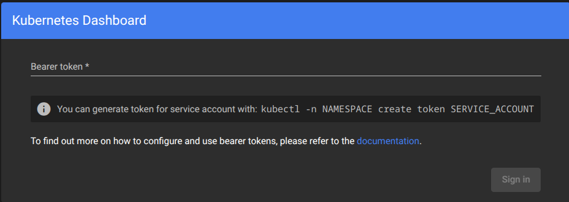
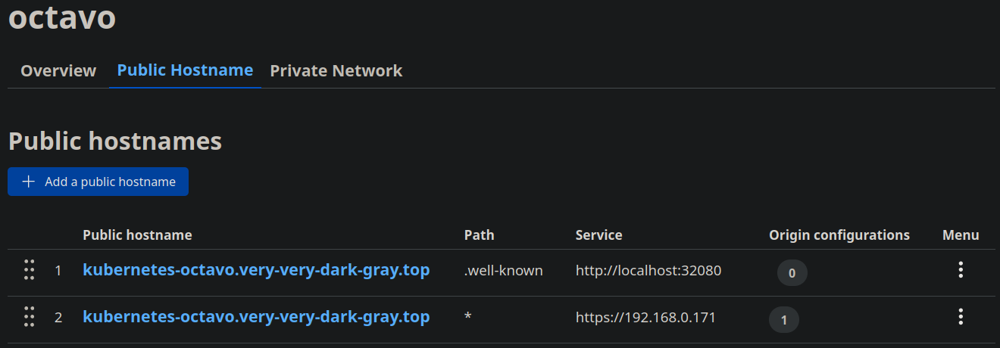
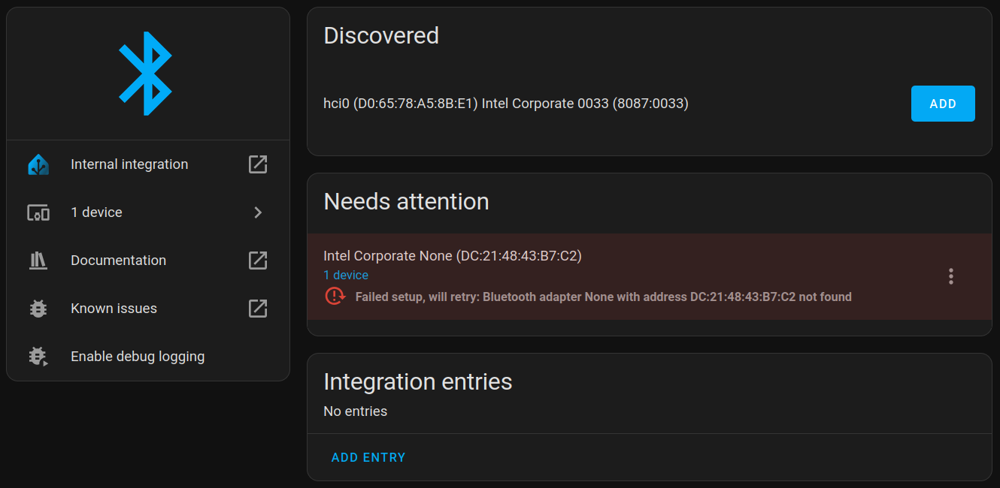
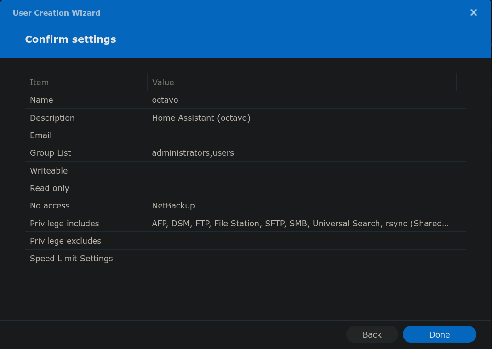

*Need. More. Server. Need. More. POWER!!!*

Just a bit more, maybe *quite a bit* more, to run services that are more
CPU-intensive than those already running in the current 
[Single-node Kubernetes cluster on an Intel NUC: lexicon](./2023-03-25-single-node-kubernetes-cluster-on-ubuntu-server-lexicon.md).

<!-- more --> 

## Hardware

Ubuntu's list of
[Recommended and Certified Hardware](https://ubuntu.com/appliance/hardware#intel-nuc)
is just as short and *ancient* as it was 2 years ago, but NUC systems have a now
long history of being well suppored under Linux, so this time I'm taking chances:

*  [ASUS NUC 13 Pro Tall PC Kit RNUC13ANHI700000I w/ Intel Core i7-1360P](https://webshop.asus.com/de/Mini-PCs/ASUS-NUC-13-Pro-Tall-PC-Kit-RNUC13ANHI700000I/90AR00C1-M000F0) ($570)
*  [Kingston FURY Impact 1x 32GB, 3200 MHz, DDR4-RAM, SODIMM](https://www.kingston.com/en/memory/gaming/kingston-fury-impact-ddr4-memory?speed=3200mt%2Fs&total%20(kit)%20capacity=32gb&kit=single%20module&dram%20density=16gbit) ($110)
*  [Kingston FURY Renegade 4000 GB, M.2 2280](https://www.kingston.com/en/ssd/gaming/kingston-fury-renegade-nvme-m2-ssd) ($250)

### Bootable USB stick

[Get Ubuntu Server](https://ubuntu.com/download/server) (24.04.**2** LTS) and 
[create a bootable USB stick on Ubuntu](https://ubuntu.com/tutorials/create-a-usb-stick-on-ubuntu#1-overview).

## Install Ubuntu Server 24.04

[Installing Ubuntu Server 24.04](https://ubuntu.com/tutorials/install-ubuntu-server)
went smoothly and without any problems, the NUC booted from the USB stick and secure
boot, enabled by default, never presented any problem. Screen and USB keyword worked
seamlessly through a DisplayPort+USB+Ethernet
[Cable Matters Hub](https://www.cablematters.com/pc-940-126-usb-c-dual-monitor-hub-with-dual-4k-displayport-2x-usb-20-fast-ethernet-and-60w-power-delivery.aspx#)
on a Thunderbolt port in the NUC.

Once the intaller boots, the installation steps were:

1.  Choose language and keyboard layout.
1.  Choose **Ubuntu Server** (default, not *(minimized)*).
    *  Checked the option to *Search for third-party drivers*.
1.  Networking: DHCP on wired network.
    *  IP address `.155` is assgined to the `enx5c857e3e1129` interface, the
       RTL8153 Gigabit Ethernet NIC in the Cable Matters Hub.
    *  The `enp86s0` interface is the NUC's integrated 2.5Gbps NIC (Intel I226-V),
       which during the installation had no network cable attached.
1.  Pick a local Ubuntu mirror to install packages from.
1.  Setup a **Custom storage layout** as follows
    1.  Select the disk (Kingston FURY Renegade 4000 GB) to **Use As Boot Device**.
        This automatically creates a 1GB partition for `/boot/efi` (formatted as `btrfs`).
    1.  Create a 60G partition to mount as `/` (formatted as `btrfs`).
    1.  Create a 60G partition to reverse for a future OS.
    1.  Create a 60G partition to mount as `/var/lib` (formatted as `btrfs`).
    1.  Create a  partition using all remaining space (3.46T) to mount as `/home`
        (formatted as `btrfs`).
1.  Confirm partitions & changes.
1.  Set up a Profile: username (`ponder`), hostname (`octavo`) and password.
1.  Skip Upgrade to Ubuntu Pro (to be done later).
1.  Install OpenSSH server and allow password authentication (for now).
1.  A selection of snap packages is available at this point, none were selected.
1.  Confirm all previous choices and start to **install software**.
1.  Once the installation is complete, remove the UBS stick and hit Enter to reboot.

### Disable swap

With 32 GB on a single DIMM and the possiblity to double that in the future, there is
no need for `swap` and it can be
[problematic for Kubernetes](#troubleshooting-kubeadm-init) later, so this should be
disabled: remove the relevant line in `/etc/fstab`, reboot and delete the swap file
(typically `/swap.img` or `/swapfile`).

### Tweak OpenSSH server

Set the `root` password by first escalating with `sudo su -` and then using the
`passwd` command to set the password. This password will hardly ever be used, but
should be set so that it can be use in case of emergency.

Copy SSH public keys into the `.ssh/authorized_keys` of both `ponder` and `root`,
then disable password authentication in the OpenSSH server:

``` console
# vi /etc/ssh/sshd_config
PasswordAuthentication no
# systemctl restart ssh
```

Test SSH connections as both `ponder` and `root` from all the relevant hosts in the LAN.

#### Setup Fail2Ban

On top of disabling password authentication, the SSH server will be less busy is those
pesky *bad actors* are blocked from reaching it's port. To do this, install
[fail2ban](https://github.com/fail2ban/fail2ban):

??? terminal "`apt install fail2ban -y`"

    ``` console
    # apt install fail2ban -y
    Reading package lists... Done
    Building dependency tree... Done
    Reading state information... Done
    The following additional packages will be installed:
      python3-pyasyncore python3-pyinotify whois
    Suggested packages:
      mailx monit sqlite3 python-pyinotify-doc
    The following NEW packages will be installed:
      fail2ban python3-pyasyncore python3-pyinotify whois
    0 upgraded, 4 newly installed, 0 to remove and 1 not upgraded.
    Need to get 496 kB of archives.
    After this operation, 2,572 kB of additional disk space will be used.
    Get:1 http://ch.archive.ubuntu.com/ubuntu noble/main amd64 python3-pyasyncore all 1.0.2-2 [10.1 kB]
    Get:2 http://ch.archive.ubuntu.com/ubuntu noble-updates/universe amd64 fail2ban all 1.0.2-3ubuntu0.1 [409 kB]
    Get:3 http://ch.archive.ubuntu.com/ubuntu noble/main amd64 python3-pyinotify all 0.9.6-2ubuntu1 [25.0 kB]
    Get:4 http://ch.archive.ubuntu.com/ubuntu noble/main amd64 whois amd64 5.5.22 [51.7 kB]
    Fetched 496 kB in 0s (2,059 kB/s) 
    Selecting previously unselected package python3-pyasyncore.
    (Reading database ... 86910 files and directories currently installed.)
    Preparing to unpack .../python3-pyasyncore_1.0.2-2_all.deb ...
    Unpacking python3-pyasyncore (1.0.2-2) ...
    Selecting previously unselected package fail2ban.
    Preparing to unpack .../fail2ban_1.0.2-3ubuntu0.1_all.deb ...
    Unpacking fail2ban (1.0.2-3ubuntu0.1) ...
    Selecting previously unselected package python3-pyinotify.
    Preparing to unpack .../python3-pyinotify_0.9.6-2ubuntu1_all.deb ...
    Unpacking python3-pyinotify (0.9.6-2ubuntu1) ...
    Selecting previously unselected package whois.
    Preparing to unpack .../whois_5.5.22_amd64.deb ...
    Unpacking whois (5.5.22) ...
    Setting up whois (5.5.22) ...
    Setting up python3-pyasyncore (1.0.2-2) ...
    Setting up fail2ban (1.0.2-3ubuntu0.1) ...
    /usr/lib/python3/dist-packages/fail2ban/tests/fail2banregextestcase.py:224: SyntaxWarning: invalid escape sequence '\s'
      "1490349000 test failed.dns.ch", "^\s*test <F-ID>\S+</F-ID>"
    /usr/lib/python3/dist-packages/fail2ban/tests/fail2banregextestcase.py:435: SyntaxWarning: invalid escape sequence '\S'
      '^'+prefix+'<F-ID>User <F-USER>\S+</F-USER></F-ID> not allowed\n'
    /usr/lib/python3/dist-packages/fail2ban/tests/fail2banregextestcase.py:443: SyntaxWarning: invalid escape sequence '\S'
      '^'+prefix+'User <F-USER>\S+</F-USER> not allowed\n'
    /usr/lib/python3/dist-packages/fail2ban/tests/fail2banregextestcase.py:444: SyntaxWarning: invalid escape sequence '\d'
      '^'+prefix+'Received disconnect from <F-ID><ADDR> port \d+</F-ID>'
    /usr/lib/python3/dist-packages/fail2ban/tests/fail2banregextestcase.py:451: SyntaxWarning: invalid escape sequence '\s'
      _test_variants('common', prefix="\s*\S+ sshd\[<F-MLFID>\d+</F-MLFID>\]:\s+")
    /usr/lib/python3/dist-packages/fail2ban/tests/fail2banregextestcase.py:537: SyntaxWarning: invalid escape sequence '\['
      'common[prefregex="^svc\[<F-MLFID>\d+</F-MLFID>\] connect <F-CONTENT>.+</F-CONTENT>$"'
    /usr/lib/python3/dist-packages/fail2ban/tests/servertestcase.py:1375: SyntaxWarning: invalid escape sequence '\s'
      "`{ nft -a list chain inet f2b-table f2b-chain | grep -oP '@addr-set-j-w-nft-mp\s+.*\s+\Khandle\s+(\d+)$'; } | while read -r hdl; do`",
    /usr/lib/python3/dist-packages/fail2ban/tests/servertestcase.py:1378: SyntaxWarning: invalid escape sequence '\s'
      "`{ nft -a list chain inet f2b-table f2b-chain | grep -oP '@addr6-set-j-w-nft-mp\s+.*\s+\Khandle\s+(\d+)$'; } | while read -r hdl; do`",
    /usr/lib/python3/dist-packages/fail2ban/tests/servertestcase.py:1421: SyntaxWarning: invalid escape sequence '\s'
      "`{ nft -a list chain inet f2b-table f2b-chain | grep -oP '@addr-set-j-w-nft-ap\s+.*\s+\Khandle\s+(\d+)$'; } | while read -r hdl; do`",
    /usr/lib/python3/dist-packages/fail2ban/tests/servertestcase.py:1424: SyntaxWarning: invalid escape sequence '\s'
      "`{ nft -a list chain inet f2b-table f2b-chain | grep -oP '@addr6-set-j-w-nft-ap\s+.*\s+\Khandle\s+(\d+)$'; } | while read -r hdl; do`",
    Created symlink /etc/systemd/system/multi-user.target.wants/fail2ban.service → /usr/lib/systemd/system/fail2ban.service.
    Setting up python3-pyinotify (0.9.6-2ubuntu1) ...
    Processing triggers for man-db (2.12.0-4build2) ...
    Scanning processes...                                                                                         
    Scanning processor microcode...                                                                               
    Scanning linux images...                                                                                      

    Running kernel seems to be up-to-date.

    The processor microcode seems to be up-to-date.

    No services need to be restarted.

    No containers need to be restarted.

    No user sessions are running outdated binaries.

    No VM guests are running outdated hypervisor (qemu) binaries on this host.
    ```

Enable the service so it starts after each system restart:

``` console
# systemctl enable --now fail2ban
Synchronizing state of fail2ban.service with SysV service script with /usr/lib/systemd/systemd-sysv-install.
```

The default configuration should be enough because this system will probably not expose
its port 22 to the Internet, but instead accessed remotely via [Tailscale](#tailscale).
If port 22 is later expoed to the Internet, see
[lexicon's Fail2ban setup](./2022-07-03-low-effort-homelab-server-with-ubuntu-server-on-intel-nuc.md#setup-fail2ban).

### Tweak network config

This system will use static IP addresses `.8` so they can be added to the `/etc/hosts`
file of the relevant hosts in the LAN, then the file can be copied into the new server,
preserving the line that points `127.0.0.1` to itself.

While using the Cable Matters hub, the LAN IP address is setup on the `enx5c857e3e1129`
interface:

``` console hl_lines="10 12"
# ip a
1: lo: <LOOPBACK,UP,LOWER_UP> mtu 65536 qdisc noqueue state UNKNOWN group default qlen 1000
    link/loopback 00:00:00:00:00:00 brd 00:00:00:00:00:00
    inet 127.0.0.1/8 scope host lo
       valid_lft forever preferred_lft forever
    inet6 ::1/128 scope host noprefixroute 
       valid_lft forever preferred_lft forever
2: enp86s0: <BROADCAST,MULTICAST> mtu 1500 qdisc noop state DOWN group default qlen 1000
    link/ether 48:21:0b:6d:3e:9b brd ff:ff:ff:ff:ff:ff
3: enx5c857e3e1129: <BROADCAST,MULTICAST,UP,LOWER_UP> mtu 1500 qdisc fq_codel state UP group default qlen 1000
    link/ether 5c:85:7e:3e:11:29 brd ff:ff:ff:ff:ff:ff
    inet 192.168.0.155/24 metric 100 brd 192.168.0.255 scope global dynamic enx5c857e3e1129
       valid_lft 85920sec preferred_lft 85920sec
    inet6 fe80::5e85:7eff:fe3e:1129/64 scope link 
       valid_lft forever preferred_lft forever
4: wlo1: <BROADCAST,MULTICAST> mtu 1500 qdisc noop state DOWN group default qlen 1000
    link/ether d0:65:78:a5:8b:dd brd ff:ff:ff:ff:ff:ff
    altname wlp0s20f3
```

??? terminal "`dmesg` lines for Intel I226-V 2.5Gbps NIC (`igc`) and USB NIC (`r8152`):"

    ``` dmesg
    [    1.736823] Intel(R) 2.5G Ethernet Linux Driver
    [    1.738154] Copyright(c) 2018 Intel Corporation.
    [    1.741460] igc 0000:56:00.0: enabling device (0000 -> 0002)
    [    1.744312] igc 0000:56:00.0: PTM enabled, 4ns granularity
    [    1.756421] ahci 0000:00:17.0: version 3.0
    [    1.756759] xhci_hcd 0000:00:0d.0: xHCI Host Controller
    --
    [    1.821412] intel-lpss 0000:00:15.1: enabling device (0004 -> 0006)
    [    1.823953] idma64 idma64.1: Found Intel integrated DMA 64-bit
    [    1.842492] igc 0000:56:00.0: 4.000 Gb/s available PCIe bandwidth (5.0 GT/s PCIe x1 link)
    [    1.843094] igc 0000:56:00.0 eth0: MAC: 48:21:0b:6d:3e:9b
    [    2.056525] typec port0: bound usb3-port6 (ops connector_ops)
    [    2.058975] typec port0: bound usb2-port1 (ops connector_ops)
    [    2.061054] usb 3-1: new full-speed USB device number 2 using xhci_hcd
    [    2.086270] ata2: SATA link down (SStatus 4 SControl 300)
    [    2.092729] igc 0000:56:00.0 enp86s0: renamed from eth0
    [    2.100868] ucsi_acpi USBC000:00: UCSI_GET_PDOS failed (-95)
    [    2.114965] nvme 0000:01:00.0: platform quirk: setting simple suspend
    [    2.116031] nvme nvme0: pci function 0000:01:00.0
    [    2.125670] nvme nvme0: Shutdown timeout set to 10 seconds
    [    2.129358] nvme nvme0: 16/0/0 default/read/poll queues
    --
    [    4.164720] usbcore: registered new device driver r8152-cfgselector
    [    4.352207] r8152-cfgselector 3-6.2: reset high-speed USB device number 6 using xhci_hcd
    [    4.581005] r8152 3-6.2:1.0: load rtl8153a-4 v2 02/07/20 successfully
    [    4.621215] r8152 3-6.2:1.0 eth0: v1.12.13
    [    4.624728] usbcore: registered new interface driver r8152
    [    4.660226] usbcore: registered new interface driver cdc_ether
    [    4.669749] r8152 3-6.2:1.0 enx5c857e3e1129: renamed from eth0
    [    4.720488] usb 3-6.4.1: new high-speed USB device number 8 using xhci_hcd
    [    4.808357] raid6: avx2x4   gen() 29500 MB/s
    [    4.825355] raid6: avx2x2   gen() 36875 MB/s
    [    4.842356] raid6: avx2x1   gen() 35157 MB/s
    [    4.842362] raid6: using algorithm avx2x2 gen() 36875 MB/s
    ```

Servers are better setup with static IP addresses in a know range, and for this system
the `.8 `addresses have been reserved and can be setup in the Netplan configuration:

``` yaml title="/etc/netplan/50-cloud-init.yaml" hl_lines="4 8 16 20"
network:
  version: 2
  ethernets:
    enx5c857e3e1129:
      dhcp4: no
      dhcp6: no
      # Ser IP address & subnet mask
      addresses: [ 10.0.0.7/24, 192.168.0.7/24 ]
      # Set default gateway
      routes:
       - to: default
         via: 192.168.0.1
      # Set DNS name servers
      nameservers:
        addresses: [62.2.24.158, 62.2.17.61]
    enp86s0:
      dhcp4: no
      dhcp6: no
      # Ser IP address & subnet mask
      addresses: [ 10.0.0.8/24, 192.168.0.8/24 ]
      # Set default gateway
      # Set DNS name servers
      nameservers:
        addresses: [62.2.24.158, 62.2.17.61]
```

!!! note
    
    Adding `routes` to both Ethernet interfaces will result in warnings, and is not
    necessary so long as one can SSH in from another host in the LAN.

After applying the configuration with `netplan apply` both Ethernet NICs will always have
static IP addresses:

``` console hl_lines="10 14"
# ip a
1: lo: <LOOPBACK,UP,LOWER_UP> mtu 65536 qdisc noqueue state UNKNOWN group default qlen 1000
    link/loopback 00:00:00:00:00:00 brd 00:00:00:00:00:00
    inet 127.0.0.1/8 scope host lo
       valid_lft forever preferred_lft forever
    inet6 ::1/128 scope host noprefixroute 
       valid_lft forever preferred_lft forever
2: enp86s0: <NO-CARRIER,BROADCAST,MULTICAST,UP> mtu 1500 qdisc mq state DOWN group default qlen 1000
    link/ether 48:21:0b:6d:3e:9b brd ff:ff:ff:ff:ff:ff
3: enx5c857e3e1129: <BROADCAST,MULTICAST,UP,LOWER_UP> mtu 1500 qdisc fq_codel state UP group default qlen 1000
    link/ether 5c:85:7e:3e:11:29 brd ff:ff:ff:ff:ff:ff
    inet 10.0.0.7/24 brd 10.0.0.255 scope global enx5c857e3e1129
       valid_lft forever preferred_lft forever
    inet 192.168.0.7/24 brd 192.168.0.255 scope global enx5c857e3e1129
       valid_lft forever preferred_lft forever
    inet6 fe80::5e85:7eff:fe3e:1129/64 scope link 
       valid_lft forever preferred_lft forever
4: wlo1: <BROADCAST,MULTICAST> mtu 1500 qdisc noop state DOWN group default qlen 1000
    link/ether d0:65:78:a5:8b:dd brd ff:ff:ff:ff:ff:ff
    altname wlp0s20f3
```

The server can now be relocated to the **2.5Gbps** network, where no screen is available.
Once relocated to the 2.5Gbps network, no longer using the Cable Matters hub, and finished
booting, SSH back into the server using the `.8` address:

``` console hl_lines="8 10"
# ip a
1: lo: <LOOPBACK,UP,LOWER_UP> mtu 65536 qdisc noqueue state UNKNOWN group default qlen 1000
    link/loopback 00:00:00:00:00:00 brd 00:00:00:00:00:00
    inet 127.0.0.1/8 scope host lo
       valid_lft forever preferred_lft forever
    inet6 ::1/128 scope host noprefixroute 
       valid_lft forever preferred_lft forever
2: enp86s0: <BROADCAST,MULTICAST,UP,LOWER_UP> mtu 1500 qdisc mq state UP group default qlen 1000
    link/ether 48:21:0b:6d:3e:9b brd ff:ff:ff:ff:ff:ff
    inet 10.0.0.8/24 brd 10.0.0.255 scope global enp86s0
       valid_lft forever preferred_lft forever
    inet 192.168.0.8/24 brd 192.168.0.255 scope global enp86s0
       valid_lft forever preferred_lft forever
    inet6 fe80::4a21:bff:fe6d:3e9b/64 scope link 
       valid_lft forever preferred_lft forever
3: wlo1: <BROADCAST,MULTICAST> mtu 1500 qdisc noop state DOWN group default qlen 1000
    link/ether d0:65:78:a5:8b:dd brd ff:ff:ff:ff:ff:ff
    altname wlp0s20f3
```

To re-enable the server's access to the Internet, move the `routes` to the `enp86s0`
interface and `netplan apply` once again:

``` yaml title="/etc/netplan/50-cloud-init.yaml"
network:
  version: 2
  ethernets:
    enx5c857e3e1129:
      dhcp4: no
      dhcp6: no
      # Ser IP address & subnet mask
      addresses: [ 10.0.0.7/24, 192.168.0.7/24 ]
    enp86s0:
      dhcp4: no
      dhcp6: no
      # Ser IP address & subnet mask
      addresses: [ 10.0.0.8/24, 192.168.0.8/24 ]
      # Set default gateway
      routes:
       - to: default
         via: 192.168.0.1
      # Set DNS name servers
      nameservers:
        addresses: [62.2.24.158, 62.2.17.61]
```

At this point the network configuration is finalized.

### Set correct timezone

The installation process does not offer setting the system timezone and defaults to UTC:

``` console
# timedatectl
               Local time: Sun 2025-04-13 20:47:28 UTC
           Universal time: Sun 2025-04-13 20:47:28 UTC
                 RTC time: Sun 2025-04-13 20:47:28
                Time zone: Etc/UTC (UTC, +0000)
System clock synchronized: yes
              NTP service: active
          RTC in local TZ: no
```

Since this is not the local timezone anywhere, it is better (more convenient) to set the
local timezone, e.g.

``` console
# timedatectl set-timezone "Europe/Amsterdam"

# timedatectl
               Local time: Sun 2025-04-13 22:48:45 CEST
           Universal time: Sun 2025-04-13 20:48:45 UTC
                 RTC time: Sun 2025-04-13 20:48:45
                Time zone: Europe/Amsterdam (CEST, +0200)
System clock synchronized: yes
              NTP service: active
          RTC in local TZ: no
```

### Update system packages

Updating system packages is recommended after installing from USB media:

``` console
# apt update && apt full-upgrade -y
```

### Tweak Bash prompt

Tweak Bash prompt for `root` to make user name
<span style="color: red">red</span>,
host name
<span style="color: blue">blue</span>
and path
<span style="color: green">green</span>;
with this in `.bashrc`:


``` bash title=".bashrc" linenums="36" hl_lines="4 18 20"
# uncomment for a colored prompt, if the terminal has the capability; turned
# off by default to not distract the user: the focus in a terminal window
# should be on the output of commands, not on the prompt
force_color_prompt=yes

if [ -n "$force_color_prompt" ]; then
    if [ -x /usr/bin/tput ] && tput setaf 1 >&/dev/null; then
        # We have color support; assume it's compliant with Ecma-48
        # (ISO/IEC-6429). (Lack of such support is extremely rare, and such
        # a case would tend to support setf rather than setaf.)
        color_prompt=yes
    else
        color_prompt=
    fi
fi

if [ "$color_prompt" = yes ]; then
    PS1='\[\e]0;\u@\h: \w\a\]${debian_chroot:+($debian_chroot)}\[\033[01;31m\]\u@\[\033[01;34m\]\h\[\033[00m\] \[\033[01;32m\]\w \$\[\033[00m\] '
else
    PS1='${debian_chroot:+($debian_chroot)}\u@\h \w \$ '
fi
unset color_prompt force_color_prompt
```

Other users' Bash prompt is left as default, which renders all
green. The idea is that `root`'s prompt is visually different,
to remind me that *with great power comes great responsibility*.

### Upgrade to Ubuntu Pro

This step was skipped during the
[installation process](#install-ubuntu-server-2404)
so the server is not attached to an Ubuntu Pro account:

``` console
# pro security-status
684 packages installed:
    684 packages from Ubuntu Main/Restricted repository

To get more information about the packages, run
    pro security-status --help
for a list of available options.

This machine is receiving security patching for Ubuntu Main/Restricted
repository until 2029.
This machine is NOT attached to an Ubuntu Pro subscription.

Ubuntu Pro with 'esm-infra' enabled provides security updates for
Main/Restricted packages until 2034.

Try Ubuntu Pro with a free personal subscription on up to 5 machines.
Learn more at https://ubuntu.com/pro
```

Take the command and token from <https://ubuntu.com/pro/dashboard> and
attach the server to an active Ubuntu Pro account:

``` console
# pro attach ______________________________
Enabling Ubuntu Pro: ESM Apps
Ubuntu Pro: ESM Apps enabled
Enabling Ubuntu Pro: ESM Infra
Ubuntu Pro: ESM Infra enabled
Enabling Livepatch
Livepatch enabled
This machine is now attached to 'Ubuntu Pro - free personal subscription'

SERVICE          ENTITLED  STATUS       DESCRIPTION
anbox-cloud      yes       disabled     Scalable Android in the cloud
esm-apps         yes       enabled      Expanded Security Maintenance for Applications
esm-infra        yes       enabled      Expanded Security Maintenance for Infrastructure
landscape        yes       disabled     Management and administration tool for Ubuntu
livepatch        yes       enabled      Canonical Livepatch service
realtime-kernel* yes       disabled     Ubuntu kernel with PREEMPT_RT patches integrated
usg              yes       disabled     Security compliance and audit tools

 * Service has variants

NOTICES
Operation in progress: pro attach

For a list of all Ubuntu Pro services and variants, run 'pro status --all'
Enable services with: pro enable <service>

     Account: ponder.stibbons@uu.am
Subscription: Ubuntu Pro - free personal subscription
```

### Weekly btrfs scrub

To keep BTRFS file systems healthy, it is recommended to
[run a weekly scrub](http://marc.merlins.org/perso/btrfs/post_2014-03-19_Btrfs-Tips_-Btrfs-Scrub-and-Btrfs-Filesystem-Repair.html)
to check everything for consistency. For this, run
[the script](https://marc.merlins.org/linux/scripts/btrfs-scrub)
from `crontab` every Saturday morning, early enough that it will
be done by the time anyone wakes up:

??? code "`/usr/local/bin/btrfs-scrub-all`"

    ``` bash
    #! /bin/bash

    # By Marc MERLIN <marc_soft@merlins.org> 2014/03/20
    # License: Apache-2.0
    # http://marc.merlins.org/perso/btrfs/post_2014-03-19_Btrfs-Tips_-Btrfs-Scrub-and-Btrfs-Filesystem-Repair.html

    which btrfs >/dev/null || exit 0
    export PATH=/usr/local/bin:/sbin:$PATH

    FILTER='(^Dumping|balancing, usage)'
    test -n "$DEVS" || DEVS=$(grep '\<btrfs\>' /proc/mounts | awk '{ print $1 }' | sort -u)
    for btrfs in $DEVS
    do
        tail -n 0 -f /var/log/syslog | grep -i "BTRFS" | grep -Evi '(disk space caching is enabled|unlinked .* orphans|turning on discard|device label .* devid .* transid|enabling SSD mode|BTRFS: has skinny extents|BTRFS: device label)' &
        mountpoint="$(grep "$btrfs" /proc/mounts | awk '{ print $2 }' | sort | head -1)"
        logger -s "Quick Metadata and Data Balance of $mountpoint ($btrfs)" >&2
        # Even in 4.3 kernels, you can still get in places where balance
        # won't work (no place left, until you run a -m0 one first)
        btrfs balance start -musage=0 -v $mountpoint 2>&1 | grep -Ev "$FILTER"
        btrfs balance start -musage=20 -v $mountpoint 2>&1 | grep -Ev "$FILTER"
        # After metadata, let's do data:
        btrfs balance start -dusage=0 -v $mountpoint 2>&1 | grep -Ev "$FILTER"
        btrfs balance start -dusage=20 -v $mountpoint 2>&1 | grep -Ev "$FILTER"
        # And now we do scrub. Note that scrub can fail with "no space left
        # on device" if you're very out of balance.
        logger -s "Starting scrub of $mountpoint" >&2
        echo btrfs scrub start -Bd $mountpoint
        ionice -c 3 nice -10 btrfs scrub start -Bd $mountpoint
        pkill -f 'tail -n 0 -f /var/log/syslog'
        logger "Ended scrub of $mountpoint" >&2
    done
    ```

``` console
# crontab -l | grep btrfs
# m h  dom mon dow   command
50 5 * * 6 /usr/local/bin/btrfs-scrub-all
```

### Stop `apparmor` spew in the logs

As seen in previous installs of Ubuntu 24.04 on Rapture and Raven, there is some
log spam from `audit` in the `dmesg` logs.
[To stop this](./2024-11-03-ubuntu-studio-24-04-on-rapture-gaming-pc-and-more.md#stop-apparmor-spew-in-the-logs) 
simply install `auditd`:

??? terminal "`apt install auditd`"

    ``` console
    # apt install auditd -y
    Reading package lists... Done
    Building dependency tree... Done
    Reading state information... Done
    The following additional packages will be installed:
      libauparse0t64
    Suggested packages:
      audispd-plugins
    The following NEW packages will be installed:
      auditd libauparse0t64
    0 upgraded, 2 newly installed, 0 to remove and 1 not upgraded.
    Need to get 274 kB of archives.
    After this operation, 893 kB of additional disk space will be used.
    Get:1 http://ch.archive.ubuntu.com/ubuntu noble-updates/main amd64 libauparse0t64 amd64 1:3.1.2-2.1build1.1 [58.9 kB]
    Get:2 http://ch.archive.ubuntu.com/ubuntu noble-updates/main amd64 auditd amd64 1:3.1.2-2.1build1.1 [215 kB]
    Fetched 274 kB in 0s (1,148 kB/s)
    Selecting previously unselected package libauparse0t64:amd64.
    (Reading database ... 87398 files and directories currently installed.)
    Preparing to unpack .../libauparse0t64_1%3a3.1.2-2.1build1.1_amd64.deb ...
    Adding 'diversion of /lib/x86_64-linux-gnu/libauparse.so.0 to /lib/x86_64-linux-gnu/libauparse.so.0.usr-is-merged by libauparse0t64'
    Adding 'diversion of /lib/x86_64-linux-gnu/libauparse.so.0.0.0 to /lib/x86_64-linux-gnu/libauparse.so.0.0.0.usr-is-merged by libauparse0t64'
    Unpacking libauparse0t64:amd64 (1:3.1.2-2.1build1.1) ...
    Selecting previously unselected package auditd.
    Preparing to unpack .../auditd_1%3a3.1.2-2.1build1.1_amd64.deb ...
    Unpacking auditd (1:3.1.2-2.1build1.1) ...
    Setting up libauparse0t64:amd64 (1:3.1.2-2.1build1.1) ...
    Setting up auditd (1:3.1.2-2.1build1.1) ...
    Created symlink /etc/systemd/system/multi-user.target.wants/auditd.service → /usr/lib/systemd/system/auditd.service.
    Processing triggers for man-db (2.12.0-4build2) ...
    Processing triggers for libc-bin (2.39-0ubuntu8.4) ...
    Scanning processes...                                                                                         
    Scanning processor microcode...                                                                               
    Scanning linux images...                                                                                      

    Running kernel seems to be up-to-date.

    The processor microcode seems to be up-to-date.

    No services need to be restarted.

    No containers need to be restarted.

    No user sessions are running outdated binaries.

    No VM guests are running outdated hypervisor (qemu) binaries on this host.
    ```

### NAS NFS mount

Add the [NFS mount](./2025-04-18-synology-ds423-for-the-homelab-luggage.md#nfs)
in `/etc/fstab` to mount `/home/nas`, create the directory and mount it.

### Continuous Monitoring

[Install Continuous Monitoring](../../projects/conmon.md#install-conmon) and
report metrics to `lexicon` on its `NodePort` (30086).

## Remote Access

[Remote access options for self-hosted services](./2025-03-23-remote-access-options-for-self-hosted-services.md)
may no longer require opening any ports in the router for this server,
although that option remains available should it become necessary.

### Cloudflare Tunnel

[Cloudflare Tunnels in Alfred](./2025-02-22-home-assistant-on-kubernetes-on-raspberry-pi-5-alfred.md#cloudflare-tunnel)
proved to be a good solution for making web sites externally available but still
[protected behind SSO with Zero Trust Web Access](./2025-03-23-remote-access-options-for-self-hosted-services.md#cloudflare-access).
Since all that was already setup, and there are no services running in this server yet,
all there is to do here and now is just install `cloudflared` and join.

Install the latest `cloudflared` using the instructions provided for
[Ubuntu 24.04](https://pkg.cloudflare.com/index.html#debian-any):

``` console
# curl -fsSL https://pkg.cloudflare.com/cloudflare-main.gpg \
  | tee /usr/share/keyrings/cloudflare-main.gpg >/dev/null

# echo 'deb [signed-by=/usr/share/keyrings/cloudflare-main.gpg] https://pkg.cloudflare.com/cloudflared noble main' \
  | tee /etc/apt/sources.list.d/cloudflared.list

# install cloudflared
sudo apt-get update && sudo apt-get install cloudflared
```

Then run the command to connect to the new tunnel:

``` console
# cloudflared service install eyJhIjoiMD...
2025-04-18T21:45:27Z INF Using Systemd
2025-04-18T21:45:27Z INF Linux service for cloudflared installed successfully
```

Although a public hostname is not yet necessary for this tunnel, create one for
<https://kubernetes-octavo.very-very-dark-gray.top/> to be used later for the
Kubernetes Dashboard, just pointing to <https://localhost> for now. Make sure to **enable** the **TLS** option **No TLS Verify**, so the tunnel can be used **without**
[HTTPS certificates](./2025-02-22-home-assistant-on-kubernetes-on-raspberry-pi-5-alfred.md#https-certificates)
since they do not seem to be necessary when using Cloudflare tunnels.

### Tailscale

[Install Tailscale](./2025-03-23-remote-access-options-for-self-hosted-services.md#tailscale)
and connect the server to the alredy existing tailnet:

??? terminal "Installation of Tailscale on **octavo**"

    ``` console
    # curl -fsSL https://tailscale.com/install.sh | sh
    Installing Tailscale for ubuntu noble, using method apt
    + mkdir -p --mode=0755 /usr/share/keyrings
    + curl -fsSL https://pkgs.tailscale.com/stable/ubuntu/noble.noarmor.gpg
    + tee /usr/share/keyrings/tailscale-archive-keyring.gpg
    + chmod 0644 /usr/share/keyrings/tailscale-archive-keyring.gpg
    + curl -fsSL https://pkgs.tailscale.com/stable/ubuntu/noble.tailscale-keyring.list
    + tee /etc/apt/sources.list.d/tailscale.list
    # Tailscale packages for ubuntu noble
    deb [signed-by=/usr/share/keyrings/tailscale-archive-keyring.gpg] https://pkgs.tailscale.com/stable/ubuntu noble main
    + chmod 0644 /etc/apt/sources.list.d/tailscale.list
    + apt-get update
    Hit:1 http://ch.archive.ubuntu.com/ubuntu noble InRelease
    Get:2 http://ch.archive.ubuntu.com/ubuntu noble-updates InRelease [126 kB]                                   
    Hit:3 https://pkg.cloudflare.com/cloudflared noble InRelease                                                 
    Hit:4 http://ch.archive.ubuntu.com/ubuntu noble-backports InRelease                                          
    Hit:5 http://security.ubuntu.com/ubuntu noble-security InRelease                                             
    Get:6 https://pkgs.tailscale.com/stable/ubuntu noble InRelease                                            
    Get:7 https://pkgs.tailscale.com/stable/ubuntu noble/main all Packages [354 B]
    Get:8 https://pkgs.tailscale.com/stable/ubuntu noble/main amd64 Packages [12.8 kB]
    Get:9 https://esm.ubuntu.com/apps/ubuntu noble-apps-security InRelease [7,595 B]
    Get:10 https://esm.ubuntu.com/apps/ubuntu noble-apps-updates InRelease [7,480 B]
    Get:11 https://esm.ubuntu.com/infra/ubuntu noble-infra-security InRelease [7,474 B]
    Get:12 https://esm.ubuntu.com/infra/ubuntu noble-infra-updates InRelease [7,473 B]
    Fetched 176 kB in 3s (64.1 kB/s)      
    Reading package lists... Done
    + apt-get install -y tailscale tailscale-archive-keyring
    Reading package lists... Done
    Building dependency tree... Done
    Reading state information... Done
    The following NEW packages will be installed:
      tailscale tailscale-archive-keyring
    0 upgraded, 2 newly installed, 0 to remove and 1 not upgraded.
    Need to get 31.5 MB of archives.
    After this operation, 59.1 MB of additional disk space will be used.
    Get:2 https://pkgs.tailscale.com/stable/ubuntu noble/main all tailscale-archive-keyring all 1.35.181 [3,082 B]
    Get:1 https://pkgs.tailscale.com/stable/ubuntu noble/main amd64 tailscale amd64 1.82.5 [31.5 MB]
    Fetched 31.5 MB in 13s (2,462 kB/s)                                                                          
    Selecting previously unselected package tailscale.
    (Reading database ... 125870 files and directories currently installed.)
    Preparing to unpack .../tailscale_1.82.5_amd64.deb ...
    Unpacking tailscale (1.82.5) ...
    Selecting previously unselected package tailscale-archive-keyring.
    Preparing to unpack .../tailscale-archive-keyring_1.35.181_all.deb ...
    Unpacking tailscale-archive-keyring (1.35.181) ...
    Setting up tailscale-archive-keyring (1.35.181) ...
    Setting up tailscale (1.82.5) ...
    Created symlink /etc/systemd/system/multi-user.target.wants/tailscaled.service → /usr/lib/systemd/system/tailscaled.service.
    Scanning processes...                                                                                         
    Scanning processor microcode...                                                                               
    Scanning linux images...                                                                                      

    Running kernel seems to be up-to-date.

    The processor microcode seems to be up-to-date.

    No services need to be restarted.

    No containers need to be restarted.

    No user sessions are running outdated binaries.

    No VM guests are running outdated hypervisor (qemu) binaries on this host.
    + [ false = true ]
    + set +x
    Installation complete! Log in to start using Tailscale by running:

    tailscale up
    ```

After installing the software, running `tailscale up` will provide a URL to 
authenticate and add the server to the tailnet:

``` console
# tailscale up

To authenticate, visit:

        https://login.tailscale.com/a/______________

Success.
```

Once added to the tailnet, an SSH connection to `octavo.royal-penny.ts.net` instantly
connects to `octavo` and SSH key authentication just works (after accepting this new
hostname).

Additional setup will be needed later on, once services are running on Kubernetes:

1.  Install the [Tailscale Kubernetes operator](./2025-03-23-remote-access-options-for-self-hosted-services.md#tailscale-kubernetes-operator)
    and add an `Ingress` to use it.
1.  Optional: enable [Public access through Funnel](./2025-03-23-remote-access-options-for-self-hosted-services.md#public-access-through-funnel)
    for services that need to be accessible from outside the tailnet.

## Kubernetes

[Kubernetes on Raspberry Pi 5 (Alfred)](./2025-02-22-home-assistant-on-kubernetes-on-raspberry-pi-5-alfred.md#kubernetes)
showed quite a few *new hurdles* caused by newer versions of Kubernetes (v1.32.2) and
a few components; this most recent installation will be the main guide this time. On top
of that, [Applications Installed](../../projects/self-hosting.md#applications-installed)
and each application-specific post linked from there, will provide most of the guidance
to install those applications to be *migrated* (here) to the new server. The old
[Single-node Kubernetes cluster on an Intel NUC: lexicon](./2023-03-25-single-node-kubernetes-cluster-on-ubuntu-server-lexicon.md)
may not add much at this point.

### GitHub Repository

Use the same [GitHub Repository](./2025-02-22-home-assistant-on-kubernetes-on-raspberry-pi-5-alfred.md#github-repository)
as before and create a new directory for the new server:

``` console
$ git clone git@github.com:xxxx/kubernetes-deployments.git
$ cd kubernetes-deployments/
$ mkdir octavo
```

??? note "Initial Git+SSH setup"

    Each new server requires an initial setup to authenticate with GitHub, using 
    [a new SSH key](https://docs.github.com/en/authentication/connecting-to-github-with-ssh/generating-a-new-ssh-key-and-adding-it-to-the-ssh-agent),
    adding to the authorized SSH keys in the GitHub account, and coping `.gitconfig`
    from a previous server.

### Storage Requirements

Docker and `containerd` store images under `/var/lib` by default, which is why the
[when installing Ubuntu Server](#install-ubuntu-server-2404) a dedicated partition
is created for `/var/lib`, so that it will (should) not be necessary to move images
to the `/home` partition.

### Install Helm

[Install helm from APT](https://helm.sh/docs/intro/install/#from-apt-debianubuntu)
because it will be required to install certain components later
(e.g. [Kubernetes Dashboard](#kubernets-dashboard)):

``` console
$ curl https://baltocdn.com/helm/signing.asc \
  | sudo gpg --dearmor -o /etc/apt/keyrings/helm.gpg
$ echo "deb [arch=$(dpkg --print-architecture) signed-by=/etc/apt/keyrings/helm.gpg] https://baltocdn.com/helm/stable/debian/ all main" \
  | sudo tee /etc/apt/sources.list.d/helm-stable-debian.list
$ sudo apt-get update
$ sudo apt-get install -y helm
```

### Install Kubernetes

[Kubernetes current stable release](https://cdn.dl.k8s.io/release/stable.txt) is now
v1.33.**0** which is only the **1st** patch in 1.33 and came out only a few days ago,
so instead install the more stable **v1.32**.
[Install kubeadm, kubelet and kubectl](https://kubernetes.io/docs/setup/production-environment/tools/kubeadm/install-kubeadm/#installing-kubeadm-kubelet-and-kubectl) from Debian packages:

``` console
$ curl -fsSL https://pkgs.k8s.io/core:/stable:/v1.32/deb/Release.key \
  | sudo gpg --dearmor -o /etc/apt/keyrings/kubernetes-apt-keyring.gpg
$ sudo chmod 644 /etc/apt/keyrings/kubernetes-apt-keyring.gpg
$ echo 'deb [signed-by=/etc/apt/keyrings/kubernetes-apt-keyring.gpg] https://pkgs.k8s.io/core:/stable:/v1.32/deb/ /' \
  | sudo tee /etc/apt/sources.list.d/kubernetes.list
$ sudo apt-get update
```

Once the APT repository is ready, install the packages:

??? terminal "`$ sudo apt-get install -y kubelet kubeadm kubectl`"

    ``` console
    $ sudo apt-get install -y kubelet kubeadm kubectl
    Reading package lists... Done
    Building dependency tree... Done
    Reading state information... Done
    The following additional packages will be installed:
      conntrack cri-tools kubernetes-cni
    The following NEW packages will be installed:
      conntrack cri-tools kubeadm kubectl kubelet kubernetes-cni
    0 upgraded, 6 newly installed, 0 to remove and 1 not upgraded.
    Need to get 92.7 MB of archives.
    After this operation, 338 MB of additional disk space will be used.
    Get:1 http://ch.archive.ubuntu.com/ubuntu noble/main amd64 conntrack amd64 1:1.4.8-1ubuntu1 [37.9 kB]
    Get:2 https://prod-cdn.packages.k8s.io/repositories/isv:/kubernetes:/core:/stable:/v1.32/deb  cri-tools 1.32.0-1.1 [16.3 MB]
    Get:3 https://prod-cdn.packages.k8s.io/repositories/isv:/kubernetes:/core:/stable:/v1.32/deb  kubeadm 1.32.4-1.1 [12.2 MB]
    Get:4 https://prod-cdn.packages.k8s.io/repositories/isv:/kubernetes:/core:/stable:/v1.32/deb  kubectl 1.32.4-1.1 [11.2 MB]
    Get:5 https://prod-cdn.packages.k8s.io/repositories/isv:/kubernetes:/core:/stable:/v1.32/deb  kubernetes-cni 1.6.0-1.1 [37.8 MB]
    Get:6 https://prod-cdn.packages.k8s.io/repositories/isv:/kubernetes:/core:/stable:/v1.32/deb  kubelet 1.32.4-1.1 [15.2 MB]
    Fetched 92.7 MB in 1s (66.3 MB/s)
    Selecting previously unselected package conntrack.
    (Reading database ... 140718 files and directories currently installed.)
    Preparing to unpack .../0-conntrack_1%3a1.4.8-1ubuntu1_amd64.deb ...
    Unpacking conntrack (1:1.4.8-1ubuntu1) ...
    Selecting previously unselected package cri-tools.
    Preparing to unpack .../1-cri-tools_1.32.0-1.1_amd64.deb ...
    Unpacking cri-tools (1.32.0-1.1) ...
    Selecting previously unselected package kubeadm.
    Preparing to unpack .../2-kubeadm_1.32.4-1.1_amd64.deb ...
    Unpacking kubeadm (1.32.4-1.1) ...
    Selecting previously unselected package kubectl.
    Preparing to unpack .../3-kubectl_1.32.4-1.1_amd64.deb ...
    Unpacking kubectl (1.32.4-1.1) ...
    Selecting previously unselected package kubernetes-cni.
    Preparing to unpack .../4-kubernetes-cni_1.6.0-1.1_amd64.deb ...
    Unpacking kubernetes-cni (1.6.0-1.1) ...
    Selecting previously unselected package kubelet.
    Preparing to unpack .../5-kubelet_1.32.4-1.1_amd64.deb ...
    Unpacking kubelet (1.32.4-1.1) ...
    Setting up conntrack (1:1.4.8-1ubuntu1) ...
    Setting up kubectl (1.32.4-1.1) ...
    Setting up cri-tools (1.32.0-1.1) ...
    Setting up kubernetes-cni (1.6.0-1.1) ...
    Setting up kubeadm (1.32.4-1.1) ...
    Setting up kubelet (1.32.4-1.1) ...
    Processing triggers for man-db (2.12.0-4build2) ...
    Scanning processes...                                                                                         
    Scanning processor microcode...                                                                               
    Scanning linux images...                                                                                      

    Running kernel seems to be up-to-date.

    The processor microcode seems to be up-to-date.

    No services need to be restarted.

    No containers need to be restarted.

    No user sessions are running outdated binaries.

    No VM guests are running outdated hypervisor (qemu) binaries on this host.
    ```

And then, because updating Kubernetes is a rather involved process, hold them:

``` console
$ sudo apt-mark hold kubelet kubeadm kubectl
kubelet set on hold.
kubeadm set on hold.
kubectl set on hold.
```

Note that the latest patch at this time is v1.32.**4**:

``` console hl_lines="7"
# kubectl version --output=yaml
clientVersion:
  buildDate: "2025-04-22T16:03:58Z"
  compiler: gc
  gitCommit: 59526cd4867447956156ae3a602fcbac10a2c335
  gitTreeState: clean
  gitVersion: v1.32.4
  goVersion: go1.23.6
  major: "1"
  minor: "32"
  platform: linux/amd64
kustomizeVersion: v5.5.0

The connection to the server localhost:8080 was refused - did you specify the right host or port?
```

[Enabling shell autocompletion](https://kubernetes.io/docs/tasks/tools/install-kubectl-linux/#enable-kubectl-autocompletion)
for `kubectl` is very easy, since bash-completion is already installed:

``` console
$ kubectl completion bash | sudo tee /etc/bash_completion.d/kubectl > /dev/null
$ sudo chmod a+r /etc/bash_completion.d/kubectl
```

#### Enable the kubelet service

This step is only really necessary later, before 
[bootstrapping the cluster with `kubeadm`](#bootstrap-with-kubeadm),
but it can be done any time; the service will just be waiting:

``` console
$ sudo systemctl enable --now kubelet
```

### Install container runtime

#### Networking setup

[Enabling IPv4 packet forwarding](https://kubernetes.io/docs/setup/production-environment/container-runtimes/#prerequisite-ipv4-forwarding-optional)
is required for Kubernetes network and is **not** enabled by default:

``` console hl_lines="2 41"
$ sudo sysctl net.ipv4.ip_forward
net.ipv4.ip_forward = 0

$ cat <<EOF | sudo tee /etc/sysctl.d/k8s.conf
net.ipv4.ip_forward = 1
EOF

$ sudo sysctl --system
* Applying /usr/lib/sysctl.d/10-apparmor.conf ...
* Applying /etc/sysctl.d/10-bufferbloat.conf ...
* Applying /etc/sysctl.d/10-console-messages.conf ...
* Applying /etc/sysctl.d/10-ipv6-privacy.conf ...
* Applying /etc/sysctl.d/10-kernel-hardening.conf ...
* Applying /etc/sysctl.d/10-magic-sysrq.conf ...
* Applying /etc/sysctl.d/10-map-count.conf ...
* Applying /etc/sysctl.d/10-network-security.conf ...
* Applying /etc/sysctl.d/10-ptrace.conf ...
* Applying /etc/sysctl.d/10-zeropage.conf ...
* Applying /usr/lib/sysctl.d/50-pid-max.conf ...
* Applying /usr/lib/sysctl.d/99-protect-links.conf ...
* Applying /etc/sysctl.d/99-sysctl.conf ...
* Applying /etc/sysctl.d/k8s.conf ...
* Applying /etc/sysctl.conf ...
kernel.apparmor_restrict_unprivileged_userns = 1
net.core.default_qdisc = fq_codel
kernel.printk = 4 4 1 7
net.ipv6.conf.all.use_tempaddr = 2
net.ipv6.conf.default.use_tempaddr = 2
kernel.kptr_restrict = 1
kernel.sysrq = 176
vm.max_map_count = 1048576
net.ipv4.conf.default.rp_filter = 2
net.ipv4.conf.all.rp_filter = 2
kernel.yama.ptrace_scope = 1
vm.mmap_min_addr = 65536
kernel.pid_max = 4194304
fs.protected_fifos = 1
fs.protected_hardlinks = 1
fs.protected_regular = 2
fs.protected_symlinks = 1
net.ipv4.ip_forward = 1
```

This alone *was not enough* for the successful deployment of the 
[Network plugin in `alfred`](./2025-02-22-home-assistant-on-kubernetes-on-raspberry-pi-5-alfred.md#network-plugin)
required after bootstraping the cluster. Additional setup proved to be required to
[let iptables see bridged traffic](https://v1-29.docs.kubernetes.io/docs/setup/production-environment/container-runtimes/#forwarding-ipv4-and-letting-iptables-see-bridged-traffic),
supposedly required only up to **v1.29**, when omitting these steps led to
[the `kube-flannel` deployment failing to start up](./2025-02-22-home-assistant-on-kubernetes-on-raspberry-pi-5-alfred.md#troubleshooting-flannel)
(stuck in a crash loop):

``` console
$ sudo modprobe overlay
$ sudo modprobe br_netfilter
$ sudo tee /etc/modules-load.d/k8s.conf<<EOF
br_netfilter
overlay
EOF

$ sudo tee /etc/sysctl.d/k8s.conf<<EOF
net.bridge.bridge-nf-call-ip6tables = 1
net.bridge.bridge-nf-call-iptables = 1
net.ipv4.ip_forward = 1
EOF
```

Reboot the system to make sure that the changes are permanent:

``` console
$ sudo sysctl -a | egrep 'net.ipv4.ip_forward |net.bridge.bridge-nf-call-ip'
net.bridge.bridge-nf-call-ip6tables = 1
net.bridge.bridge-nf-call-iptables = 1
net.ipv4.ip_forward = 1

$ lsmod | egrep 'overlay|bridge'
overlay               212992  0
bridge                421888  1 br_netfilter
stp                    12288  1 bridge
llc                    16384  2 bridge,stp
```

#### Install containerd

[Installing a container runtime](https://kubernetes.io/docs/setup/production-environment/tools/kubeadm/install-kubeadm/#installing-runtime)
comes next, with `containerd` being the runtime of choice.
[Install using the apt repository](https://docs.docker.com/engine/install/ubuntu/#install-using-the-repository):

``` console
$ sudo curl -fsSL https://download.docker.com/linux/ubuntu/gpg \
  -o /etc/apt/keyrings/docker.asc
$ sudo chmod a+r /etc/apt/keyrings/docker.asc
$ echo \
  "deb [arch=$(dpkg --print-architecture) signed-by=/etc/apt/keyrings/docker.asc] https://download.docker.com/linux/ubuntu \
  $(. /etc/os-release && echo "$VERSION_CODENAME") stable" | \
  sudo tee /etc/apt/sources.list.d/docker.list > /dev/null
$ sudo apt-get update
```

Once the APT repository is ready, install the packages:

??? terminal "`$ sudo apt-get install -y docker-ce docker-ce-cli containerd.io docker-buildx-plugin docker-compose-plugin`"

    ``` console
    $ sudo apt-get install -y docker-ce docker-ce-cli containerd.io docker-buildx-plugin docker-compose-plugin
    Reading package lists... Done
    Building dependency tree... Done
    Reading state information... Done
    The following additional packages will be installed:
      docker-ce-rootless-extras libltdl7 libslirp0 pigz slirp4netns
    Suggested packages:
      cgroupfs-mount | cgroup-lite
    The following NEW packages will be installed:
      containerd.io docker-buildx-plugin docker-ce docker-ce-cli docker-ce-rootless-extras docker-compose-plugin
      libltdl7 libslirp0 pigz slirp4netns
    0 upgraded, 10 newly installed, 0 to remove and 1 not upgraded.
    Need to get 120 MB of archives.
    After this operation, 440 MB of additional disk space will be used.
    Get:1 http://ch.archive.ubuntu.com/ubuntu noble/universe amd64 pigz amd64 2.8-1 [65.6 kB]
    Get:2 https://download.docker.com/linux/ubuntu noble/stable amd64 containerd.io amd64 1.7.27-1 [30.5 MB]
    Get:3 http://ch.archive.ubuntu.com/ubuntu noble/main amd64 libltdl7 amd64 2.4.7-7build1 [40.3 kB]
    Get:4 http://ch.archive.ubuntu.com/ubuntu noble/main amd64 libslirp0 amd64 4.7.0-1ubuntu3 [63.8 kB]
    Get:5 http://ch.archive.ubuntu.com/ubuntu noble/universe amd64 slirp4netns amd64 1.2.1-1build2 [34.9 kB]
    Get:6 https://download.docker.com/linux/ubuntu noble/stable amd64 docker-buildx-plugin amd64 0.23.0-1~ubuntu.24.04~noble [34.6 MB]
    Get:7 https://download.docker.com/linux/ubuntu noble/stable amd64 docker-ce-cli amd64 5:28.1.1-1~ubuntu.24.04~noble [15.8 MB]
    Get:8 https://download.docker.com/linux/ubuntu noble/stable amd64 docker-ce amd64 5:28.1.1-1~ubuntu.24.04~noble [19.2 MB]
    Get:9 https://download.docker.com/linux/ubuntu noble/stable amd64 docker-ce-rootless-extras amd64 5:28.1.1-1~ubuntu.24.04~noble [6,092 kB]
    Get:10 https://download.docker.com/linux/ubuntu noble/stable amd64 docker-compose-plugin amd64 2.35.1-1~ubuntu.24.04~noble [13.8 MB]
    Fetched 120 MB in 1s (94.1 MB/s)             
    Selecting previously unselected package pigz.
    (Reading database ... 140777 files and directories currently installed.)
    Preparing to unpack .../0-pigz_2.8-1_amd64.deb ...
    Unpacking pigz (2.8-1) ...
    Selecting previously unselected package containerd.io.
    Preparing to unpack .../1-containerd.io_1.7.27-1_amd64.deb ...
    Unpacking containerd.io (1.7.27-1) ...
    Selecting previously unselected package docker-buildx-plugin.
    Preparing to unpack .../2-docker-buildx-plugin_0.23.0-1~ubuntu.24.04~noble_amd64.deb ...
    Unpacking docker-buildx-plugin (0.23.0-1~ubuntu.24.04~noble) ...
    Selecting previously unselected package docker-ce-cli.
    Preparing to unpack .../3-docker-ce-cli_5%3a28.1.1-1~ubuntu.24.04~noble_amd64.deb ...
    Unpacking docker-ce-cli (5:28.1.1-1~ubuntu.24.04~noble) ...
    Selecting previously unselected package docker-ce.
    Preparing to unpack .../4-docker-ce_5%3a28.1.1-1~ubuntu.24.04~noble_amd64.deb ...
    Unpacking docker-ce (5:28.1.1-1~ubuntu.24.04~noble) ...
    Selecting previously unselected package docker-ce-rootless-extras.
    Preparing to unpack .../5-docker-ce-rootless-extras_5%3a28.1.1-1~ubuntu.24.04~noble_amd64.deb ...
    Unpacking docker-ce-rootless-extras (5:28.1.1-1~ubuntu.24.04~noble) ...
    Selecting previously unselected package docker-compose-plugin.
    Preparing to unpack .../6-docker-compose-plugin_2.35.1-1~ubuntu.24.04~noble_amd64.deb ...
    Unpacking docker-compose-plugin (2.35.1-1~ubuntu.24.04~noble) ...
    Selecting previously unselected package libltdl7:amd64.
    Preparing to unpack .../7-libltdl7_2.4.7-7build1_amd64.deb ...
    Unpacking libltdl7:amd64 (2.4.7-7build1) ...
    Selecting previously unselected package libslirp0:amd64.
    Preparing to unpack .../8-libslirp0_4.7.0-1ubuntu3_amd64.deb ...
    Unpacking libslirp0:amd64 (4.7.0-1ubuntu3) ...
    Selecting previously unselected package slirp4netns.
    Preparing to unpack .../9-slirp4netns_1.2.1-1build2_amd64.deb ...
    Unpacking slirp4netns (1.2.1-1build2) ...
    Setting up docker-buildx-plugin (0.23.0-1~ubuntu.24.04~noble) ...
    Setting up containerd.io (1.7.27-1) ...
    Created symlink /etc/systemd/system/multi-user.target.wants/containerd.service → /usr/lib/systemd/system/containerd.service.
    Setting up docker-compose-plugin (2.35.1-1~ubuntu.24.04~noble) ...
    Setting up libltdl7:amd64 (2.4.7-7build1) ...
    Setting up docker-ce-cli (5:28.1.1-1~ubuntu.24.04~noble) ...
    Setting up libslirp0:amd64 (4.7.0-1ubuntu3) ...
    Setting up pigz (2.8-1) ...
    Setting up docker-ce-rootless-extras (5:28.1.1-1~ubuntu.24.04~noble) ...
    Setting up slirp4netns (1.2.1-1build2) ...
    Setting up docker-ce (5:28.1.1-1~ubuntu.24.04~noble) ...
    Created symlink /etc/systemd/system/multi-user.target.wants/docker.service → /usr/lib/systemd/system/docker.service.
    Created symlink /etc/systemd/system/sockets.target.wants/docker.socket → /usr/lib/systemd/system/docker.socket.
    Processing triggers for man-db (2.12.0-4build2) ...
    Processing triggers for libc-bin (2.39-0ubuntu8.4) ...
    Scanning processes...                                                                                         
    Scanning processor microcode...                                                                               
    Scanning linux images...                                                                                      

    Running kernel seems to be up-to-date.

    The processor microcode seems to be up-to-date.

    No services need to be restarted.

    No containers need to be restarted.

    No user sessions are running outdated binaries.

    No VM guests are running outdated hypervisor (qemu) binaries on this host.
    ```

In just a few moments `docker` is already running:

??? terminal "`$ systemctl status docker`"

    ``` console
    $ systemctl status docker
    ● docker.service - Docker Application Container Engine
        Loaded: loaded (/usr/lib/systemd/system/docker.service; enabled; preset: enabled)
        Active: active (running) since Sat 2025-04-26 15:17:27 CEST; 52s ago
    TriggeredBy: ● docker.socket
          Docs: https://docs.docker.com
      Main PID: 198205 (dockerd)
          Tasks: 22
        Memory: 25.1M (peak: 27.5M)
            CPU: 335ms
        CGroup: /system.slice/docker.service
                └─198205 /usr/bin/dockerd -H fd:// --containerd=/run/containerd/containerd.sock

    Apr 26 15:17:27 octavo dockerd[198205]: time="2025-04-26T15:17:27.329995883+02:00" level=info msg="detected 127.0.0.53 nameserver, assuming systemd-resolved, so using resolv.conf: /run/systemd/resolve/resolv.conf"
    Apr 26 15:17:27 octavo dockerd[198205]: time="2025-04-26T15:17:27.356938837+02:00" level=info msg="Creating a containerd client" address=/run/containerd/containerd.sock timeout=1m0s
    Apr 26 15:17:27 octavo dockerd[198205]: time="2025-04-26T15:17:27.391167891+02:00" level=info msg="Loading containers: start."
    Apr 26 15:17:27 octavo dockerd[198205]: time="2025-04-26T15:17:27.623474369+02:00" level=info msg="Loading containers: done."
    Apr 26 15:17:27 octavo dockerd[198205]: time="2025-04-26T15:17:27.651891549+02:00" level=info msg="Docker daemon" commit=01f442b containerd-snapshotter=false storage-driver=overlay2 version=28.1.1
    Apr 26 15:17:27 octavo dockerd[198205]: time="2025-04-26T15:17:27.652003229+02:00" level=info msg="Initializing buildkit"
    Apr 26 15:17:27 octavo dockerd[198205]: time="2025-04-26T15:17:27.686521864+02:00" level=info msg="Completed buildkit initialization"
    Apr 26 15:17:27 octavo dockerd[198205]: time="2025-04-26T15:17:27.694113345+02:00" level=info msg="Daemon has completed initialization"
    Apr 26 15:17:27 octavo dockerd[198205]: time="2025-04-26T15:17:27.694180217+02:00" level=info msg="API listen on /run/docker.sock"
    Apr 26 15:17:27 octavo systemd[1]: Started docker.service - Docker Application Container Engine.
    ```

The server is indeed reachable and its version can be checked:

??? terminal "`$ sudo docker version`"

    ``` console
    $ sudo docker version
    Client: Docker Engine - Community
    Version:           28.1.1
    API version:       1.49
    Go version:        go1.23.8
    Git commit:        4eba377
    Built:             Fri Apr 18 09:52:14 2025
    OS/Arch:           linux/amd64
    Context:           default

    Server: Docker Engine - Community
    Engine:
      Version:          28.1.1
      API version:      1.49 (minimum version 1.24)
      Go version:       go1.23.8
      Git commit:       01f442b
      Built:            Fri Apr 18 09:52:14 2025
      OS/Arch:          linux/amd64
      Experimental:     false
    containerd:
      Version:          1.7.27
      GitCommit:        05044ec0a9a75232cad458027ca83437aae3f4da
    runc:
      Version:          1.2.5
      GitCommit:        v1.2.5-0-g59923ef
    docker-init:
      Version:          0.19.0
      GitCommit:        de40ad0
    ```

And the basic `hello-world` example just works:

??? terminal "`$ sudo docker run hello-world`"

    ``` console
    $ sudo docker run hello-world
    Unable to find image 'hello-world:latest' locally
    latest: Pulling from library/hello-world
    e6590344b1a5: Pull complete 
    Digest: sha256:c41088499908a59aae84b0a49c70e86f4731e588a737f1637e73c8c09d995654
    Status: Downloaded newer image for hello-world:latest

    Hello from Docker!
    This message shows that your installation appears to be working correctly.

    To generate this message, Docker took the following steps:
    1. The Docker client contacted the Docker daemon.
    2. The Docker daemon pulled the "hello-world" image from the Docker Hub.
        (amd64)
    3. The Docker daemon created a new container from that image which runs the
        executable that produces the output you are currently reading.
    4. The Docker daemon streamed that output to the Docker client, which sent it
        to your terminal.

    To try something more ambitious, you can run an Ubuntu container with:
     $ docker run -it ubuntu bash

    Share images, automate workflows, and more with a free Docker ID:
     https://hub.docker.com/

    For more examples and ideas, visit:
     https://docs.docker.com/get-started/

    ```

#### Configure containerd for Kubernetes

The default configutation that comes with `containerd`, at least when installed from
the APT repository, needs two adjustments to work with Kubernetes:

1.   Enable the use of
     [`systemd` cgroup driver](https://kubernetes.io/docs/setup/production-environment/container-runtimes/#systemd-cgroup-driver),
     because Ubuntu (22.04+) uses both `systemd` and
     [cgroup v2](https://kubernetes.io/docs/concepts/architecture/cgroups/#using-cgroupv2).
1.   Enable CRI integration, disabled in `/etc/containerd/config.toml`,
     but needed to use `containerd` with Kubernetes.

The safest method to set these configurations is to do it based off of the default configuration:

``` console
$ containerd config default \
 | sed 's/disabled_plugins.*/disabled_plugins = []/' \
 | sed 's/SystemdCgroup = false/SystemdCgroup = true/' \
 | sudo tee /etc/containerd/config.toml > /dev/null

$ sudo systemctl restart containerd
$ sudo systemctl restart kubelet
```

??? code "Resulting `/etc/containerd/config.toml`"

    The resulting configuration enables `SystemdCgroup` under
    `plugins."io.containerd.grpc.v1.cri".containerd.runtimes.runc.options`:

    ``` ini hl_lines="1 45 73 128 139"
    disabled_plugins = []
    imports = []
    oom_score = 0
    plugin_dir = ""
    required_plugins = []
    root = "/var/lib/containerd"
    state = "/run/containerd"
    temp = ""
    version = 2

    [cgroup]
      path = ""

    [debug]
      address = ""
      format = ""
      gid = 0
      level = ""
      uid = 0

    [grpc]
      address = "/run/containerd/containerd.sock"
      gid = 0
      max_recv_message_size = 16777216
      max_send_message_size = 16777216
      tcp_address = ""
      tcp_tls_ca = ""
      tcp_tls_cert = ""
      tcp_tls_key = ""
      uid = 0

    [metrics]
      address = ""
      grpc_histogram = false

    [plugins]

      [plugins."io.containerd.gc.v1.scheduler"]
        deletion_threshold = 0
        mutation_threshold = 100
        pause_threshold = 0.02
        schedule_delay = "0s"
        startup_delay = "100ms"

      [plugins."io.containerd.grpc.v1.cri"]
        cdi_spec_dirs = ["/etc/cdi", "/var/run/cdi"]
        device_ownership_from_security_context = false
        disable_apparmor = false
        disable_cgroup = false
        disable_hugetlb_controller = true
        disable_proc_mount = false
        disable_tcp_service = true
        drain_exec_sync_io_timeout = "0s"
        enable_cdi = false
        enable_selinux = false
        enable_tls_streaming = false
        enable_unprivileged_icmp = false
        enable_unprivileged_ports = false
        ignore_deprecation_warnings = []
        ignore_image_defined_volumes = false
        image_pull_progress_timeout = "5m0s"
        image_pull_with_sync_fs = false
        max_concurrent_downloads = 3
        max_container_log_line_size = 16384
        netns_mounts_under_state_dir = false
        restrict_oom_score_adj = false
        sandbox_image = "registry.k8s.io/pause:3.8"
        selinux_category_range = 1024
        stats_collect_period = 10
        stream_idle_timeout = "4h0m0s"
        stream_server_address = "127.0.0.1"
        stream_server_port = "0"
        systemd_cgroup = false
        tolerate_missing_hugetlb_controller = true
        unset_seccomp_profile = ""

        [plugins."io.containerd.grpc.v1.cri".cni]
          bin_dir = "/opt/cni/bin"
          conf_dir = "/etc/cni/net.d"
          conf_template = ""
          ip_pref = ""
          max_conf_num = 1
          setup_serially = false

        [plugins."io.containerd.grpc.v1.cri".containerd]
          default_runtime_name = "runc"
          disable_snapshot_annotations = true
          discard_unpacked_layers = false
          ignore_blockio_not_enabled_errors = false
          ignore_rdt_not_enabled_errors = false
          no_pivot = false
          snapshotter = "overlayfs"

          [plugins."io.containerd.grpc.v1.cri".containerd.default_runtime]
            base_runtime_spec = ""
            cni_conf_dir = ""
            cni_max_conf_num = 0
            container_annotations = []
            pod_annotations = []
            privileged_without_host_devices = false
            privileged_without_host_devices_all_devices_allowed = false
            runtime_engine = ""
            runtime_path = ""
            runtime_root = ""
            runtime_type = ""
            sandbox_mode = ""
            snapshotter = ""

            [plugins."io.containerd.grpc.v1.cri".containerd.default_runtime.options]

          [plugins."io.containerd.grpc.v1.cri".containerd.runtimes]

            [plugins."io.containerd.grpc.v1.cri".containerd.runtimes.runc]
              base_runtime_spec = ""
              cni_conf_dir = ""
              cni_max_conf_num = 0
              container_annotations = []
              pod_annotations = []
              privileged_without_host_devices = false
              privileged_without_host_devices_all_devices_allowed = false
              runtime_engine = ""
              runtime_path = ""
              runtime_root = ""
              runtime_type = "io.containerd.runc.v2"
              sandbox_mode = "podsandbox"
              snapshotter = ""

              [plugins."io.containerd.grpc.v1.cri".containerd.runtimes.runc.options]
                BinaryName = ""
                CriuImagePath = ""
                CriuPath = ""
                CriuWorkPath = ""
                IoGid = 0
                IoUid = 0
                NoNewKeyring = false
                NoPivotRoot = false
                Root = ""
                ShimCgroup = ""
                SystemdCgroup = true

          [plugins."io.containerd.grpc.v1.cri".containerd.untrusted_workload_runtime]
            base_runtime_spec = ""
            cni_conf_dir = ""
            cni_max_conf_num = 0
            container_annotations = []
            pod_annotations = []
            privileged_without_host_devices = false
            privileged_without_host_devices_all_devices_allowed = false
            runtime_engine = ""
            runtime_path = ""
            runtime_root = ""
            runtime_type = ""
            sandbox_mode = ""
            snapshotter = ""

            [plugins."io.containerd.grpc.v1.cri".containerd.untrusted_workload_runtime.options]

        [plugins."io.containerd.grpc.v1.cri".image_decryption]
          key_model = "node"

        [plugins."io.containerd.grpc.v1.cri".registry]
          config_path = ""

          [plugins."io.containerd.grpc.v1.cri".registry.auths]

          [plugins."io.containerd.grpc.v1.cri".registry.configs]

          [plugins."io.containerd.grpc.v1.cri".registry.headers]

          [plugins."io.containerd.grpc.v1.cri".registry.mirrors]

        [plugins."io.containerd.grpc.v1.cri".x509_key_pair_streaming]
          tls_cert_file = ""
          tls_key_file = ""

      [plugins."io.containerd.internal.v1.opt"]
        path = "/opt/containerd"

      [plugins."io.containerd.internal.v1.restart"]
        interval = "10s"

      [plugins."io.containerd.internal.v1.tracing"]

      [plugins."io.containerd.metadata.v1.bolt"]
        content_sharing_policy = "shared"

      [plugins."io.containerd.monitor.v1.cgroups"]
        no_prometheus = false

      [plugins."io.containerd.nri.v1.nri"]
        disable = true
        disable_connections = false
        plugin_config_path = "/etc/nri/conf.d"
        plugin_path = "/opt/nri/plugins"
        plugin_registration_timeout = "5s"
        plugin_request_timeout = "2s"
        socket_path = "/var/run/nri/nri.sock"

      [plugins."io.containerd.runtime.v1.linux"]
        no_shim = false
        runtime = "runc"
        runtime_root = ""
        shim = "containerd-shim"
        shim_debug = false

      [plugins."io.containerd.runtime.v2.task"]
        platforms = ["linux/amd64"]
        sched_core = false

      [plugins."io.containerd.service.v1.diff-service"]
        default = ["walking"]
        sync_fs = false

      [plugins."io.containerd.service.v1.tasks-service"]
        blockio_config_file = ""
        rdt_config_file = ""

      [plugins."io.containerd.snapshotter.v1.aufs"]
        root_path = ""

      [plugins."io.containerd.snapshotter.v1.blockfile"]
        fs_type = ""
        mount_options = []
        root_path = ""
        scratch_file = ""

      [plugins."io.containerd.snapshotter.v1.btrfs"]
        root_path = ""

      [plugins."io.containerd.snapshotter.v1.devmapper"]
        async_remove = false
        base_image_size = ""
        discard_blocks = false
        fs_options = ""
        fs_type = ""
        pool_name = ""
        root_path = ""

      [plugins."io.containerd.snapshotter.v1.native"]
        root_path = ""

      [plugins."io.containerd.snapshotter.v1.overlayfs"]
        mount_options = []
        root_path = ""
        sync_remove = false
        upperdir_label = false

      [plugins."io.containerd.snapshotter.v1.zfs"]
        root_path = ""

      [plugins."io.containerd.tracing.processor.v1.otlp"]

      [plugins."io.containerd.transfer.v1.local"]
        config_path = ""
        max_concurrent_downloads = 3
        max_concurrent_uploaded_layers = 3

        [[plugins."io.containerd.transfer.v1.local".unpack_config]]
          differ = ""
          platform = "linux/amd64"
          snapshotter = "overlayfs"

    [proxy_plugins]

    [stream_processors]

      [stream_processors."io.containerd.ocicrypt.decoder.v1.tar"]
        accepts = ["application/vnd.oci.image.layer.v1.tar+encrypted"]
        args = ["--decryption-keys-path", "/etc/containerd/ocicrypt/keys"]
        env = ["OCICRYPT_KEYPROVIDER_CONFIG=/etc/containerd/ocicrypt/ocicrypt_keyprovider.conf"]
        path = "ctd-decoder"
        returns = "application/vnd.oci.image.layer.v1.tar"

      [stream_processors."io.containerd.ocicrypt.decoder.v1.tar.gzip"]
        accepts = ["application/vnd.oci.image.layer.v1.tar+gzip+encrypted"]
        args = ["--decryption-keys-path", "/etc/containerd/ocicrypt/keys"]
        env = ["OCICRYPT_KEYPROVIDER_CONFIG=/etc/containerd/ocicrypt/ocicrypt_keyprovider.conf"]
        path = "ctd-decoder"
        returns = "application/vnd.oci.image.layer.v1.tar+gzip"

    [timeouts]
      "io.containerd.timeout.bolt.open" = "0s"
      "io.containerd.timeout.metrics.shimstats" = "2s"
      "io.containerd.timeout.shim.cleanup" = "5s"
      "io.containerd.timeout.shim.load" = "5s"
      "io.containerd.timeout.shim.shutdown" = "3s"
      "io.containerd.timeout.task.state" = "2s"

    [ttrpc]
      address = ""
      gid = 0
      uid = 0
    ```

### Bootstrap with `kubeadm`

[Creating a cluster with `kubeadm`](https://kubernetes.io/docs/setup/production-environment/tools/kubeadm/create-cluster-kubeadm/)
is the next big step towards creating the Kubernetes cluster.

#### Initialize the control-plane

Having reviewed the requirements and installed all the components already,
[initialize the control-plane node](https://kubernetes.io/docs/setup/production-environment/tools/kubeadm/create-cluster-kubeadm/#initializing-your-control-plane-node)
with flags:

*   `--cri-socket=unix:/run/containerd/containerd.sock` to make sure Kubernetes uses the containerd runtime.
*   `--pod-network-cidr=10.244.0.0/16` as 
    [required by flannel](https://github.com/flannel-io/flannel/blob/master/Documentation/kubernetes.md),
    which is the [network plugin](#network-plugin) to be installed later.

??? terminal "`$ sudo kubeadm init`"

    ``` console
    $ sudo kubeadm init \
      --cri-socket=unix:/run/containerd/containerd.sock \
      --pod-network-cidr=10.244.0.0/16
    I0426 16:55:42.979255   33862 version.go:261] remote version is much newer: v1.33.0; falling back to: stable-1.32
    [init] Using Kubernetes version: v1.32.4
    [preflight] Running pre-flight checks
    [preflight] Pulling images required for setting up a Kubernetes cluster
    [preflight] This might take a minute or two, depending on the speed of your internet connection
    [preflight] You can also perform this action beforehand using 'kubeadm config images pull'
    W0426 16:55:43.482424   33862 checks.go:846] detected that the sandbox image "registry.k8s.io/pause:3.8" of the container runtime is inconsistent with that used by kubeadm.It is recommended to use "registry.k8s.io/pause:3.10" as the CRI sandbox image.
    [certs] Using certificateDir folder "/etc/kubernetes/pki"
    [certs] Generating "ca" certificate and key
    [certs] Generating "apiserver" certificate and key
    [certs] apiserver serving cert is signed for DNS names [kubernetes kubernetes.default kubernetes.default.svc kubernetes.default.svc.cluster.local octavo] and IPs [10.96.0.1 10.0.0.8]
    [certs] Generating "apiserver-kubelet-client" certificate and key
    [certs] Generating "front-proxy-ca" certificate and key
    [certs] Generating "front-proxy-client" certificate and key
    [certs] Generating "etcd/ca" certificate and key
    [certs] Generating "etcd/server" certificate and key
    [certs] etcd/server serving cert is signed for DNS names [localhost octavo] and IPs [10.0.0.8 127.0.0.1 ::1]
    [certs] Generating "etcd/peer" certificate and key
    [certs] etcd/peer serving cert is signed for DNS names [localhost octavo] and IPs [10.0.0.8 127.0.0.1 ::1]
    [certs] Generating "etcd/healthcheck-client" certificate and key
    [certs] Generating "apiserver-etcd-client" certificate and key
    [certs] Generating "sa" key and public key
    [kubeconfig] Using kubeconfig folder "/etc/kubernetes"
    [kubeconfig] Writing "admin.conf" kubeconfig file
    [kubeconfig] Writing "super-admin.conf" kubeconfig file
    [kubeconfig] Writing "kubelet.conf" kubeconfig file
    [kubeconfig] Writing "controller-manager.conf" kubeconfig file
    [kubeconfig] Writing "scheduler.conf" kubeconfig file
    [etcd] Creating static Pod manifest for local etcd in "/etc/kubernetes/manifests"
    [control-plane] Using manifest folder "/etc/kubernetes/manifests"
    [control-plane] Creating static Pod manifest for "kube-apiserver"
    [control-plane] Creating static Pod manifest for "kube-controller-manager"
    [control-plane] Creating static Pod manifest for "kube-scheduler"
    [kubelet-start] Writing kubelet environment file with flags to file "/var/lib/kubelet/kubeadm-flags.env"
    [kubelet-start] Writing kubelet configuration to file "/var/lib/kubelet/config.yaml"
    [kubelet-start] Starting the kubelet
    [wait-control-plane] Waiting for the kubelet to boot up the control plane as static Pods from directory "/etc/kubernetes/manifests"
    [kubelet-check] Waiting for a healthy kubelet at http://127.0.0.1:10248/healthz. This can take up to 4m0s
    [kubelet-check] The kubelet is healthy after 501.89299ms
    [api-check] Waiting for a healthy API server. This can take up to 4m0s
    [api-check] The API server is healthy after 3.503255484s
    [upload-config] Storing the configuration used in ConfigMap "kubeadm-config" in the "kube-system" Namespace
    [kubelet] Creating a ConfigMap "kubelet-config" in namespace kube-system with the configuration for the kubelets in the cluster
    [upload-certs] Skipping phase. Please see --upload-certs
    [mark-control-plane] Marking the node octavo as control-plane by adding the labels: [node-role.kubernetes.io/control-plane node.kubernetes.io/exclude-from-external-load-balancers]
    [mark-control-plane] Marking the node octavo as control-plane by adding the taints [node-role.kubernetes.io/control-plane:NoSchedule]
    [bootstrap-token] Using token: 7k3y4k.r8ebhonqgtm6anyr
    [bootstrap-token] Configuring bootstrap tokens, cluster-info ConfigMap, RBAC Roles
    [bootstrap-token] Configured RBAC rules to allow Node Bootstrap tokens to get nodes
    [bootstrap-token] Configured RBAC rules to allow Node Bootstrap tokens to post CSRs in order for nodes to get long term certificate credentials
    [bootstrap-token] Configured RBAC rules to allow the csrapprover controller automatically approve CSRs from a Node Bootstrap Token
    [bootstrap-token] Configured RBAC rules to allow certificate rotation for all node client certificates in the cluster
    [bootstrap-token] Creating the "cluster-info" ConfigMap in the "kube-public" namespace
    [kubelet-finalize] Updating "/etc/kubernetes/kubelet.conf" to point to a rotatable kubelet client certificate and key
    [addons] Applied essential addon: CoreDNS
    [addons] Applied essential addon: kube-proxy

    Your Kubernetes control-plane has initialized successfully!

    To start using your cluster, you need to run the following as a regular user:

      mkdir -p $HOME/.kube
      sudo cp -i /etc/kubernetes/admin.conf $HOME/.kube/config
      sudo chown $(id -u):$(id -g) $HOME/.kube/config

    Alternatively, if you are the root user, you can run:

      export KUBECONFIG=/etc/kubernetes/admin.conf

    You should now deploy a pod network to the cluster.
    Run "kubectl apply -f [podnetwork].yaml" with one of the options listed at:
      https://kubernetes.io/docs/concepts/cluster-administration/addons/

    Then you can join any number of worker nodes by running the following on each as root:

    kubeadm join 10.0.0.8:6443 --token 7k3y4k.r8ebhonqgtm6anyr \
            --discovery-token-ca-cert-hash sha256:18d968e92516e1a2808166d90a7d7c8b6f7b37cbac6328c49793863f9ae2b982 
    ```

Once this is done, Kubernetes control plane is running at `10.0.0.8:6443`

``` console
# export KUBECONFIG=/etc/kubernetes/admin.conf

# kubectl cluster-info
Kubernetes control plane is running at https://10.0.0.8:6443
CoreDNS is running at https://10.0.0.8:6443/api/v1/namespaces/kube-system/services/kube-dns:dns/proxy

To further debug and diagnose cluster problems, use 'kubectl cluster-info dump'.

# kubectl version --output=yaml
clientVersion:
  buildDate: "2025-04-22T16:03:58Z"
  compiler: gc
  gitCommit: 59526cd4867447956156ae3a602fcbac10a2c335
  gitTreeState: clean
  gitVersion: v1.32.4
  goVersion: go1.23.6
  major: "1"
  minor: "32"
  platform: linux/amd64
kustomizeVersion: v5.5.0
serverVersion:
  buildDate: "2025-04-22T15:56:15Z"
  compiler: gc
  gitCommit: 59526cd4867447956156ae3a602fcbac10a2c335
  gitTreeState: clean
  gitVersion: v1.32.4
  goVersion: go1.23.6
  major: "1"
  minor: "32"
  platform: linux/amd6
```

#### Setup `kubectl` access

To run `kubectl` as a non-root user, copy the Kubernetes config file under the
`~/.kube` directory and set the right permissions to it:

``` console
$ mkdir $HOME/.kube
$ sudo cp -f /etc/kubernetes/admin.conf $HOME/.kube/config
[sudo] password for ponder: 
$ sudo chown $(id -u):$(id -g) $HOME/.kube/config
$ ls -l $HOME/.kube/config
-rw------- 1 ponder ponder 5648 Apr 26 17:03 /home/ponder/.kube/config
$ kubectl cluster-info
Kubernetes control plane is running at https://10.0.0.8:6443
CoreDNS is running at https://10.0.0.8:6443/api/v1/namespaces/kube-system/services/kube-dns:dns/proxy

To further debug and diagnose cluster problems, use 'kubectl cluster-info dump'.
```

##### Troubleshooting bootstrap

The first time around, `sudo kubeadm init` failed. This *didn't seem* to have been
[swap not being disabled](#disable-swap)
at first, but in the end disabling swap seems to have been the (only) solution.

??? terminal "`$ sudo kubeadm init`"

    ``` console
    $ sudo kubeadm init \
      --cri-socket=unix:/run/containerd/containerd.sock \
      --pod-network-cidr=10.244.0.0/16

    I0426 15:49:34.806666  537229 version.go:261] remote version is much newer: v1.33.0; falling back to: stable-1.32
    [init] Using Kubernetes version: v1.32.4
    [preflight] Running pre-flight checks
            [WARNING Swap]: swap is supported for cgroup v2 only. The kubelet must be properly configured to use swap. Please refer to https://kubernetes.io/docs/concepts/architecture/nodes/#swap-memory, or disable swap on the node
    [preflight] Pulling images required for setting up a Kubernetes cluster
    [preflight] This might take a minute or two, depending on the speed of your internet connection
    [preflight] You can also perform this action beforehand using 'kubeadm config images pull'
    W0426 15:49:35.293520  537229 checks.go:846] detected that the sandbox image "registry.k8s.io/pause:3.8" of the container runtime is inconsistent with that used by kubeadm.It is recommended to use "registry.k8s.io/pause:3.10" as the CRI sandbox image.
    [certs] Using certificateDir folder "/etc/kubernetes/pki"
    [certs] Generating "ca" certificate and key
    [certs] Generating "apiserver" certificate and key
    [certs] apiserver serving cert is signed for DNS names [kubernetes kubernetes.default kubernetes.default.svc kubernetes.default.svc.cluster.local octavo] and IPs [10.96.0.1 10.0.0.8]
    [certs] Generating "apiserver-kubelet-client" certificate and key
    [certs] Generating "front-proxy-ca" certificate and key
    [certs] Generating "front-proxy-client" certificate and key
    [certs] Generating "etcd/ca" certificate and key
    [certs] Generating "etcd/server" certificate and key
    [certs] etcd/server serving cert is signed for DNS names [localhost octavo] and IPs [10.0.0.8 127.0.0.1 ::1]
    [certs] Generating "etcd/peer" certificate and key
    [certs] etcd/peer serving cert is signed for DNS names [localhost octavo] and IPs [10.0.0.8 127.0.0.1 ::1]
    [certs] Generating "etcd/healthcheck-client" certificate and key
    [certs] Generating "apiserver-etcd-client" certificate and key
    [certs] Generating "sa" key and public key
    [kubeconfig] Using kubeconfig folder "/etc/kubernetes"
    [kubeconfig] Writing "admin.conf" kubeconfig file
    [kubeconfig] Writing "super-admin.conf" kubeconfig file
    [kubeconfig] Writing "kubelet.conf" kubeconfig file
    [kubeconfig] Writing "controller-manager.conf" kubeconfig file
    [kubeconfig] Writing "scheduler.conf" kubeconfig file
    [etcd] Creating static Pod manifest for local etcd in "/etc/kubernetes/manifests"
    [control-plane] Using manifest folder "/etc/kubernetes/manifests"
    [control-plane] Creating static Pod manifest for "kube-apiserver"
    [control-plane] Creating static Pod manifest for "kube-controller-manager"
    [control-plane] Creating static Pod manifest for "kube-scheduler"
    [kubelet-start] Writing kubelet environment file with flags to file "/var/lib/kubelet/kubeadm-flags.env"
    [kubelet-start] Writing kubelet configuration to file "/var/lib/kubelet/config.yaml"
    [kubelet-start] Starting the kubelet
    [wait-control-plane] Waiting for the kubelet to boot up the control plane as static Pods from directory "/etc/kubernetes/manifests"
    [kubelet-check] Waiting for a healthy kubelet at http://127.0.0.1:10248/healthz. This can take up to 4m0s
    [kubelet-check] The kubelet is not healthy after 4m0.000397441s

    Unfortunately, an error has occurred:
            The HTTP call equal to 'curl -sSL http://127.0.0.1:10248/healthz' returned error: Get "http://127.0.0.1:10248/healthz": context deadline exceeded


    This error is likely caused by:
            - The kubelet is not running
            - The kubelet is unhealthy due to a misconfiguration of the node in some way (required cgroups disabled)

    If you are on a systemd-powered system, you can try to troubleshoot the error with the following commands:
            - 'systemctl status kubelet'
            - 'journalctl -xeu kubelet'

    Additionally, a control plane component may have crashed or exited when started by the container runtime.
    To troubleshoot, list all containers using your preferred container runtimes CLI.
    Here is one example how you may list all running Kubernetes containers by using crictl:
            - 'crictl --runtime-endpoint unix:/run/containerd/containerd.sock ps -a | grep kube | grep -v pause'
            Once you have found the failing container, you can inspect its logs with:
            - 'crictl --runtime-endpoint unix:/run/containerd/containerd.sock logs CONTAINERID'
    error execution phase wait-control-plane: could not initialize a Kubernetes cluster
    To see the stack trace of this error execute with --v=5 or higher
    ```

Swap was disabled (and the server was restarted) only after this happened, but it
does not seem likely to have been the cause.

The kubelet is running but possibly unhealthy, `systemctl status kubelet` shows the
same line every 5 seconds:

```
Apr 26 16:11:29 octavo kubelet[3081]: E0426 16:11:29.654554    3081 kubelet.go:3002] "Container runtime network not ready" networkReady="NetworkReady=false reason:NetworkPluginNotReady message:Network plugin returns error: cni plugin not initialized"
```

Many errors and warning are logged and shown by `journalctl -xeu kubelet`, up to the
point where the above error is repeated every 5 seconds:

??? terminal "`$ journalctl -xeu kubelet`"

    ``` console hl_lines="10-11 19 30-31"
    $ journalctl -xeu kubelet
    Apr 26 16:00:24 octavo systemd[1]: Started kubelet.service - kubelet: The Kubernetes Node Agent.
    ░░ Subject: A start job for unit kubelet.service has finished successfully
    ░░ Defined-By: systemd
    ░░ Support: http://www.ubuntu.com/support
    ░░ 
    ░░ A start job for unit kubelet.service has finished successfully.
    ░░ 
    ░░ The job identifier is 192.
    Apr 26 16:00:24 octavo kubelet[3081]: Flag --container-runtime-endpoint has been deprecated, This parameter should be set via the config file specified by the Kubelet's --config flag. See https://kubernetes.io/docs/tasks/administer-cluster/kubelet-config-file/ for more information.
    Apr 26 16:00:24 octavo kubelet[3081]: Flag --pod-infra-container-image has been deprecated, will be removed in 1.35. Image garbage collector will get sandbox image information from CRI.
    Apr 26 16:00:24 octavo kubelet[3081]: I0426 16:00:24.873338    3081 server.go:215] "--pod-infra-container-image will not be pruned by the image garbage collector in kubelet and should also be set in the remote runtime"
    Apr 26 16:00:24 octavo kubelet[3081]: I0426 16:00:24.878116    3081 server.go:520] "Kubelet version" kubeletVersion="v1.32.4"
    Apr 26 16:00:24 octavo kubelet[3081]: I0426 16:00:24.878137    3081 server.go:522] "Golang settings" GOGC="" GOMAXPROCS="" GOTRACEBACK=""
    Apr 26 16:00:24 octavo kubelet[3081]: I0426 16:00:24.878359    3081 server.go:954] "Client rotation is on, will bootstrap in background"
    Apr 26 16:00:24 octavo kubelet[3081]: I0426 16:00:24.879746    3081 certificate_store.go:130] Loading cert/key pair from "/var/lib/kubelet/pki/kubelet-client-current.pem".
    Apr 26 16:00:24 octavo kubelet[3081]: I0426 16:00:24.881693    3081 dynamic_cafile_content.go:161] "Starting controller" name="client-ca-bundle::/etc/kubernetes/pki/ca.crt"
    Apr 26 16:00:24 octavo kubelet[3081]: E0426 16:00:24.884220    3081 log.go:32] "RuntimeConfig from runtime service failed" err="rpc error: code = Unimplemented desc = unknown method RuntimeConfig for service runtime.v1.RuntimeService"
    Apr 26 16:00:24 octavo kubelet[3081]: I0426 16:00:24.884242    3081 server.go:1421] "CRI implementation should be updated to support RuntimeConfig when KubeletCgroupDriverFromCRI feature gate has been enabled. Falling back to using cgroupDriver from kubelet config."
    Apr 26 16:00:24 octavo kubelet[3081]: I0426 16:00:24.892519    3081 server.go:772] "--cgroups-per-qos enabled, but --cgroup-root was not specified.  defaulting to /"
    Apr 26 16:00:24 octavo kubelet[3081]: I0426 16:00:24.892745    3081 container_manager_linux.go:268] "Container manager verified user specified cgroup-root exists" cgroupRoot=[]
    Apr 26 16:00:24 octavo kubelet[3081]: I0426 16:00:24.892782    3081 container_manager_linux.go:273] "Creating Container Manager object based on Node Config" nodeConfig={"NodeName":"octavo","RuntimeCgroupsName":"","SystemCgroupsName":"","KubeletCgroupsName":"","KubeletOOMScoreAdj":-999,"ContainerRuntime":"","CgroupsPerQOS":true,"CgroupRoot":"/","CgroupDriver":"systemd","Kubele>
    Apr 26 16:00:24 octavo kubelet[3081]: I0426 16:00:24.892963    3081 topology_manager.go:138] "Creating topology manager with none policy"
    Apr 26 16:00:24 octavo kubelet[3081]: I0426 16:00:24.892973    3081 container_manager_linux.go:304] "Creating device plugin manager"
    Apr 26 16:00:24 octavo kubelet[3081]: I0426 16:00:24.893096    3081 state_mem.go:36] "Initialized new in-memory state store"
    Apr 26 16:00:24 octavo kubelet[3081]: I0426 16:00:24.893362    3081 kubelet.go:446] "Attempting to sync node with API server"
    Apr 26 16:00:24 octavo kubelet[3081]: I0426 16:00:24.893383    3081 kubelet.go:341] "Adding static pod path" path="/etc/kubernetes/manifests"
    Apr 26 16:00:24 octavo kubelet[3081]: I0426 16:00:24.893401    3081 kubelet.go:352] "Adding apiserver pod source"
    Apr 26 16:00:24 octavo kubelet[3081]: I0426 16:00:24.893412    3081 apiserver.go:42] "Waiting for node sync before watching apiserver pods"
    Apr 26 16:00:24 octavo kubelet[3081]: W0426 16:00:24.893859    3081 reflector.go:569] k8s.io/client-go/informers/factory.go:160: failed to list *v1.Service: Get "https://10.0.0.8:6443/api/v1/services?fieldSelector=spec.clusterIP%21%3DNone&limit=500&resourceVersion=0": dial tcp 10.0.0.8:6443: connect: connection refused
    Apr 26 16:00:24 octavo kubelet[3081]: W0426 16:00:24.893887    3081 reflector.go:569] k8s.io/client-go/informers/factory.go:160: failed to list *v1.Node: Get "https://10.0.0.8:6443/api/v1/nodes?fieldSelector=metadata.name%3Doctavo&limit=500&resourceVersion=0": dial tcp 10.0.0.8:6443: connect: connection refused
    Apr 26 16:00:24 octavo kubelet[3081]: E0426 16:00:24.893911    3081 reflector.go:166] "Unhandled Error" err="k8s.io/client-go/informers/factory.go:160: Failed to watch *v1.Service: failed to list *v1.Service: Get \"https://10.0.0.8:6443/api/v1/services?fieldSelector=spec.clusterIP%21%3DNone&limit=500&resourceVersion=0\": dial tcp 10.0.0.8:6443: connect: connection refused" lo>
    Apr 26 16:00:24 octavo kubelet[3081]: E0426 16:00:24.893993    3081 reflector.go:166] "Unhandled Error" err="k8s.io/client-go/informers/factory.go:160: Failed to watch *v1.Node: failed to list *v1.Node: Get \"https://10.0.0.8:6443/api/v1/nodes?fieldSelector=metadata.name%3Doctavo&limit=500&resourceVersion=0\": dial tcp 10.0.0.8:6443: connect: connection refused" logger="Unhan>
    Apr 26 16:00:24 octavo kubelet[3081]: I0426 16:00:24.894044    3081 kuberuntime_manager.go:269] "Container runtime initialized" containerRuntime="containerd" version="1.7.27" apiVersion="v1"
    Apr 26 16:00:24 octavo kubelet[3081]: I0426 16:00:24.894351    3081 kubelet.go:890] "Not starting ClusterTrustBundle informer because we are in static kubelet mode"
    Apr 26 16:00:24 octavo kubelet[3081]: W0426 16:00:24.894385    3081 probe.go:272] Flexvolume plugin directory at /usr/libexec/kubernetes/kubelet-plugins/volume/exec/ does not exist. Recreating.
    Apr 26 16:00:24 octavo kubelet[3081]: I0426 16:00:24.894658    3081 watchdog_linux.go:99] "Systemd watchdog is not enabled"
    Apr 26 16:00:24 octavo kubelet[3081]: I0426 16:00:24.894673    3081 server.go:1287] "Started kubelet"
    Apr 26 16:00:24 octavo kubelet[3081]: I0426 16:00:24.894770    3081 server.go:169] "Starting to listen" address="0.0.0.0" port=10250
    Apr 26 16:00:24 octavo kubelet[3081]: I0426 16:00:24.894761    3081 ratelimit.go:55] "Setting rate limiting for endpoint" service="podresources" qps=100 burstTokens=10
    Apr 26 16:00:24 octavo kubelet[3081]: I0426 16:00:24.895021    3081 server.go:243] "Starting to serve the podresources API" endpoint="unix:/var/lib/kubelet/pod-resources/kubelet.sock"
    Apr 26 16:00:24 octavo kubelet[3081]: E0426 16:00:24.895066    3081 event.go:368] "Unable to write event (may retry after sleeping)" err="Post \"https://10.0.0.8:6443/api/v1/namespaces/default/events\": dial tcp 10.0.0.8:6443: connect: connection refused" event="&Event{ObjectMeta:{octavo.1839e3187cc326ed  default    0 0001-01-01 00:00:00 +0000 UTC <nil> <nil> map[] map[] [] [>
    Apr 26 16:00:24 octavo kubelet[3081]: I0426 16:00:24.895314    3081 fs_resource_analyzer.go:67] "Starting FS ResourceAnalyzer"
    Apr 26 16:00:24 octavo kubelet[3081]: I0426 16:00:24.895343    3081 dynamic_serving_content.go:135] "Starting controller" name="kubelet-server-cert-files::/var/lib/kubelet/pki/kubelet.crt::/var/lib/kubelet/pki/kubelet.key"
    Apr 26 16:00:24 octavo kubelet[3081]: I0426 16:00:24.895416    3081 volume_manager.go:297] "Starting Kubelet Volume Manager"
    Apr 26 16:00:24 octavo kubelet[3081]: I0426 16:00:24.895449    3081 desired_state_of_world_populator.go:150] "Desired state populator starts to run"
    Apr 26 16:00:24 octavo kubelet[3081]: E0426 16:00:24.895492    3081 kubelet_node_status.go:466] "Error getting the current node from lister" err="node \"octavo\" not found"
    Apr 26 16:00:24 octavo kubelet[3081]: I0426 16:00:24.895521    3081 reconciler.go:26] "Reconciler: start to sync state"
    Apr 26 16:00:24 octavo kubelet[3081]: E0426 16:00:24.896004    3081 controller.go:145] "Failed to ensure lease exists, will retry" err="Get \"https://10.0.0.8:6443/apis/coordination.k8s.io/v1/namespaces/kube-node-lease/leases/octavo?timeout=10s\": dial tcp 10.0.0.8:6443: connect: connection refused" interval="200ms"
    Apr 26 16:00:24 octavo kubelet[3081]: I0426 16:00:24.896248    3081 factory.go:219] Registration of the crio container factory failed: Get "http://%2Fvar%2Frun%2Fcrio%2Fcrio.sock/info": dial unix /var/run/crio/crio.sock: connect: no such file or directory
    Apr 26 16:00:24 octavo kubelet[3081]: W0426 16:00:24.897181    3081 reflector.go:569] k8s.io/client-go/informers/factory.go:160: failed to list *v1.CSIDriver: Get "https://10.0.0.8:6443/apis/storage.k8s.io/v1/csidrivers?limit=500&resourceVersion=0": dial tcp 10.0.0.8:6443: connect: connection refused
    Apr 26 16:00:24 octavo kubelet[3081]: E0426 16:00:24.897377    3081 reflector.go:166] "Unhandled Error" err="k8s.io/client-go/informers/factory.go:160: Failed to watch *v1.CSIDriver: failed to list *v1.CSIDriver: Get \"https://10.0.0.8:6443/apis/storage.k8s.io/v1/csidrivers?limit=500&resourceVersion=0\": dial tcp 10.0.0.8:6443: connect: connection refused" logger="UnhandledEr>
    Apr 26 16:00:24 octavo kubelet[3081]: I0426 16:00:24.897627    3081 server.go:479] "Adding debug handlers to kubelet server"
    Apr 26 16:00:24 octavo kubelet[3081]: I0426 16:00:24.898015    3081 factory.go:221] Registration of the containerd container factory successfully
    Apr 26 16:00:24 octavo kubelet[3081]: I0426 16:00:24.898031    3081 factory.go:221] Registration of the systemd container factory successfully
    Apr 26 16:00:24 octavo kubelet[3081]: E0426 16:00:24.898126    3081 kubelet.go:1555] "Image garbage collection failed once. Stats initialization may not have completed yet" err="invalid capacity 0 on image filesystem"
    Apr 26 16:00:24 octavo kubelet[3081]: I0426 16:00:24.907984    3081 cpu_manager.go:221] "Starting CPU manager" policy="none"
    Apr 26 16:00:24 octavo kubelet[3081]: I0426 16:00:24.907991    3081 cpu_manager.go:222] "Reconciling" reconcilePeriod="10s"
    Apr 26 16:00:24 octavo kubelet[3081]: I0426 16:00:24.908003    3081 state_mem.go:36] "Initialized new in-memory state store"
    Apr 26 16:00:24 octavo kubelet[3081]: I0426 16:00:24.909090    3081 policy_none.go:49] "None policy: Start"
    Apr 26 16:00:24 octavo kubelet[3081]: I0426 16:00:24.909098    3081 memory_manager.go:186] "Starting memorymanager" policy="None"
    Apr 26 16:00:24 octavo kubelet[3081]: I0426 16:00:24.909104    3081 state_mem.go:35] "Initializing new in-memory state store"
    Apr 26 16:00:24 octavo kubelet[3081]: I0426 16:00:24.948672    3081 manager.go:519] "Failed to read data from checkpoint" checkpoint="kubelet_internal_checkpoint" err="checkpoint is not found"
    Apr 26 16:00:24 octavo kubelet[3081]: I0426 16:00:24.948805    3081 eviction_manager.go:189] "Eviction manager: starting control loop"
    Apr 26 16:00:24 octavo kubelet[3081]: I0426 16:00:24.948817    3081 container_log_manager.go:189] "Initializing container log rotate workers" workers=1 monitorPeriod="10s"
    Apr 26 16:00:24 octavo kubelet[3081]: I0426 16:00:24.948983    3081 plugin_manager.go:118] "Starting Kubelet Plugin Manager"
    Apr 26 16:00:24 octavo kubelet[3081]: E0426 16:00:24.949523    3081 eviction_manager.go:267] "eviction manager: failed to check if we have separate container filesystem. Ignoring." err="no imagefs label for configured runtime"
    Apr 26 16:00:24 octavo kubelet[3081]: E0426 16:00:24.949568    3081 eviction_manager.go:292] "Eviction manager: failed to get summary stats" err="failed to get node info: node \"octavo\" not found"
    Apr 26 16:00:24 octavo kubelet[3081]: I0426 16:00:24.952661    3081 kubelet_network_linux.go:50] "Initialized iptables rules." protocol="IPv4"
    Apr 26 16:00:24 octavo kubelet[3081]: I0426 16:00:24.953773    3081 kubelet_network_linux.go:50] "Initialized iptables rules." protocol="IPv6"
    Apr 26 16:00:24 octavo kubelet[3081]: I0426 16:00:24.953793    3081 status_manager.go:227] "Starting to sync pod status with apiserver"
    Apr 26 16:00:24 octavo kubelet[3081]: I0426 16:00:24.953815    3081 watchdog_linux.go:127] "Systemd watchdog is not enabled or the interval is invalid, so health checking will not be started."
    Apr 26 16:00:24 octavo kubelet[3081]: I0426 16:00:24.953821    3081 kubelet.go:2382] "Starting kubelet main sync loop"
    Apr 26 16:00:24 octavo kubelet[3081]: E0426 16:00:24.953861    3081 kubelet.go:2406] "Skipping pod synchronization" err="PLEG is not healthy: pleg has yet to be successful"
    Apr 26 16:00:24 octavo kubelet[3081]: W0426 16:00:24.954293    3081 reflector.go:569] k8s.io/client-go/informers/factory.go:160: failed to list *v1.RuntimeClass: Get "https://10.0.0.8:6443/apis/node.k8s.io/v1/runtimeclasses?limit=500&resourceVersion=0": dial tcp 10.0.0.8:6443: connect: connection refused
    Apr 26 16:00:24 octavo kubelet[3081]: E0426 16:00:24.954314    3081 reflector.go:166] "Unhandled Error" err="k8s.io/client-go/informers/factory.go:160: Failed to watch *v1.RuntimeClass: failed to list *v1.RuntimeClass: Get \"https://10.0.0.8:6443/apis/node.k8s.io/v1/runtimeclasses?limit=500&resourceVersion=0\": dial tcp 10.0.0.8:6443: connect: connection refused" logger="Unha>
    Apr 26 16:00:25 octavo kubelet[3081]: I0426 16:00:25.051160    3081 kubelet_node_status.go:75] "Attempting to register node" node="octavo"
    Apr 26 16:00:25 octavo kubelet[3081]: E0426 16:00:25.051955    3081 kubelet_node_status.go:107] "Unable to register node with API server" err="Post \"https://10.0.0.8:6443/api/v1/nodes\": dial tcp 10.0.0.8:6443: connect: connection refused" node="octavo"
    Apr 26 16:00:25 octavo kubelet[3081]: I0426 16:00:25.096663    3081 reconciler_common.go:251] "operationExecutor.VerifyControllerAttachedVolume started for volume \"ca-certs\" (UniqueName: \"kubernetes.io/host-path/ad9e0985cbbefcb442de36a1fa2a7651-ca-certs\") pod \"kube-controller-manager-octavo\" (UID: \"ad9e0985cbbefcb442de36a1fa2a7651\") " pod="kube-system/kube-controller->
    Apr 26 16:00:25 octavo kubelet[3081]: I0426 16:00:25.096703    3081 reconciler_common.go:251] "operationExecutor.VerifyControllerAttachedVolume started for volume \"usr-local-share-ca-certificates\" (UniqueName: \"kubernetes.io/host-path/ad9e0985cbbefcb442de36a1fa2a7651-usr-local-share-ca-certificates\") pod \"kube-controller-manager-octavo\" (UID: \"ad9e0985cbbefcb442de36a1f>
    Apr 26 16:00:25 octavo kubelet[3081]: I0426 16:00:25.096736    3081 reconciler_common.go:251] "operationExecutor.VerifyControllerAttachedVolume started for volume \"ca-certs\" (UniqueName: \"kubernetes.io/host-path/9143a118ddce4da18128e4a82a4a703f-ca-certs\") pod \"kube-apiserver-octavo\" (UID: \"9143a118ddce4da18128e4a82a4a703f\") " pod="kube-system/kube-apiserver-octavo"
    Apr 26 16:00:25 octavo kubelet[3081]: I0426 16:00:25.096755    3081 reconciler_common.go:251] "operationExecutor.VerifyControllerAttachedVolume started for volume \"k8s-certs\" (UniqueName: \"kubernetes.io/host-path/9143a118ddce4da18128e4a82a4a703f-k8s-certs\") pod \"kube-apiserver-octavo\" (UID: \"9143a118ddce4da18128e4a82a4a703f\") " pod="kube-system/kube-apiserver-octavo"
    Apr 26 16:00:25 octavo kubelet[3081]: I0426 16:00:25.096790    3081 reconciler_common.go:251] "operationExecutor.VerifyControllerAttachedVolume started for volume \"usr-local-share-ca-certificates\" (UniqueName: \"kubernetes.io/host-path/9143a118ddce4da18128e4a82a4a703f-usr-local-share-ca-certificates\") pod \"kube-apiserver-octavo\" (UID: \"9143a118ddce4da18128e4a82a4a703f\">
    Apr 26 16:00:25 octavo kubelet[3081]: I0426 16:00:25.096824    3081 reconciler_common.go:251] "operationExecutor.VerifyControllerAttachedVolume started for volume \"etc-ca-certificates\" (UniqueName: \"kubernetes.io/host-path/ad9e0985cbbefcb442de36a1fa2a7651-etc-ca-certificates\") pod \"kube-controller-manager-octavo\" (UID: \"ad9e0985cbbefcb442de36a1fa2a7651\") " pod="kube-s>
    Apr 26 16:00:25 octavo kubelet[3081]: I0426 16:00:25.096849    3081 reconciler_common.go:251] "operationExecutor.VerifyControllerAttachedVolume started for volume \"flexvolume-dir\" (UniqueName: \"kubernetes.io/host-path/ad9e0985cbbefcb442de36a1fa2a7651-flexvolume-dir\") pod \"kube-controller-manager-octavo\" (UID: \"ad9e0985cbbefcb442de36a1fa2a7651\") " pod="kube-system/kube>
    Apr 26 16:00:25 octavo kubelet[3081]: I0426 16:00:25.096876    3081 reconciler_common.go:251] "operationExecutor.VerifyControllerAttachedVolume started for volume \"k8s-certs\" (UniqueName: \"kubernetes.io/host-path/ad9e0985cbbefcb442de36a1fa2a7651-k8s-certs\") pod \"kube-controller-manager-octavo\" (UID: \"ad9e0985cbbefcb442de36a1fa2a7651\") " pod="kube-system/kube-controlle>
    Apr 26 16:00:25 octavo kubelet[3081]: I0426 16:00:25.096896    3081 reconciler_common.go:251] "operationExecutor.VerifyControllerAttachedVolume started for volume \"etcd-certs\" (UniqueName: \"kubernetes.io/host-path/6a67e3805915a015cc4032245f92dbab-etcd-certs\") pod \"etcd-octavo\" (UID: \"6a67e3805915a015cc4032245f92dbab\") " pod="kube-system/etcd-octavo"
    Apr 26 16:00:25 octavo kubelet[3081]: I0426 16:00:25.096920    3081 reconciler_common.go:251] "operationExecutor.VerifyControllerAttachedVolume started for volume \"etcd-data\" (UniqueName: \"kubernetes.io/host-path/6a67e3805915a015cc4032245f92dbab-etcd-data\") pod \"etcd-octavo\" (UID: \"6a67e3805915a015cc4032245f92dbab\") " pod="kube-system/etcd-octavo"
    Apr 26 16:00:25 octavo kubelet[3081]: E0426 16:00:25.096941    3081 controller.go:145] "Failed to ensure lease exists, will retry" err="Get \"https://10.0.0.8:6443/apis/coordination.k8s.io/v1/namespaces/kube-node-lease/leases/octavo?timeout=10s\": dial tcp 10.0.0.8:6443: connect: connection refused" interval="400ms"
    Apr 26 16:00:25 octavo kubelet[3081]: I0426 16:00:25.096967    3081 reconciler_common.go:251] "operationExecutor.VerifyControllerAttachedVolume started for volume \"kubeconfig\" (UniqueName: \"kubernetes.io/host-path/ad9e0985cbbefcb442de36a1fa2a7651-kubeconfig\") pod \"kube-controller-manager-octavo\" (UID: \"ad9e0985cbbefcb442de36a1fa2a7651\") " pod="kube-system/kube-control>
    Apr 26 16:00:25 octavo kubelet[3081]: I0426 16:00:25.097001    3081 reconciler_common.go:251] "operationExecutor.VerifyControllerAttachedVolume started for volume \"usr-share-ca-certificates\" (UniqueName: \"kubernetes.io/host-path/ad9e0985cbbefcb442de36a1fa2a7651-usr-share-ca-certificates\") pod \"kube-controller-manager-octavo\" (UID: \"ad9e0985cbbefcb442de36a1fa2a7651\") ">
    Apr 26 16:00:25 octavo kubelet[3081]: I0426 16:00:25.097020    3081 reconciler_common.go:251] "operationExecutor.VerifyControllerAttachedVolume started for volume \"kubeconfig\" (UniqueName: \"kubernetes.io/host-path/9a50c799dacb081ee9c958350b51d8ec-kubeconfig\") pod \"kube-scheduler-octavo\" (UID: \"9a50c799dacb081ee9c958350b51d8ec\") " pod="kube-system/kube-scheduler-octavo"
    Apr 26 16:00:25 octavo kubelet[3081]: I0426 16:00:25.097037    3081 reconciler_common.go:251] "operationExecutor.VerifyControllerAttachedVolume started for volume \"etc-ca-certificates\" (UniqueName: \"kubernetes.io/host-path/9143a118ddce4da18128e4a82a4a703f-etc-ca-certificates\") pod \"kube-apiserver-octavo\" (UID: \"9143a118ddce4da18128e4a82a4a703f\") " pod="kube-system/kub>
    Apr 26 16:00:25 octavo kubelet[3081]: I0426 16:00:25.097054    3081 reconciler_common.go:251] "operationExecutor.VerifyControllerAttachedVolume started for volume \"usr-share-ca-certificates\" (UniqueName: \"kubernetes.io/host-path/9143a118ddce4da18128e4a82a4a703f-usr-share-ca-certificates\") pod \"kube-apiserver-octavo\" (UID: \"9143a118ddce4da18128e4a82a4a703f\") " pod="kub>
    Apr 26 16:00:25 octavo kubelet[3081]: E0426 16:00:25.247411    3081 kubelet.go:3190] "No need to create a mirror pod, since failed to get node info from the cluster" err="node \"octavo\" not found" node="octavo"
    Apr 26 16:00:25 octavo kubelet[3081]: E0426 16:00:25.251941    3081 kubelet.go:3190] "No need to create a mirror pod, since failed to get node info from the cluster" err="node \"octavo\" not found" node="octavo"
    Apr 26 16:00:25 octavo kubelet[3081]: I0426 16:00:25.253846    3081 kubelet_node_status.go:75] "Attempting to register node" node="octavo"
    Apr 26 16:00:25 octavo kubelet[3081]: E0426 16:00:25.254394    3081 kubelet_node_status.go:107] "Unable to register node with API server" err="Post \"https://10.0.0.8:6443/api/v1/nodes\": dial tcp 10.0.0.8:6443: connect: connection refused" node="octavo"
    Apr 26 16:00:25 octavo kubelet[3081]: E0426 16:00:25.275473    3081 kubelet.go:3190] "No need to create a mirror pod, since failed to get node info from the cluster" err="node \"octavo\" not found" node="octavo"
    Apr 26 16:00:25 octavo kubelet[3081]: E0426 16:00:25.301544    3081 kubelet.go:3190] "No need to create a mirror pod, since failed to get node info from the cluster" err="node \"octavo\" not found" node="octavo"
    Apr 26 16:00:24 octavo kubelet[3081]: E0426 16:00:24.974201    3081 controller.go:145] "Failed to ensure lease exists, will retry" err="Get \"https://10.0.0.8:6443/apis/coordination.k8s.io/v1/namespaces/kube-node-lease/leases/octavo?timeout=10s\": dial tcp 10.0.0.8:6443: connect: connection refused" interval="800ms"
    Apr 26 16:00:25 octavo kubelet[3081]: I0426 16:00:25.134490    3081 kubelet_node_status.go:75] "Attempting to register node" node="octavo"
    Apr 26 16:00:25 octavo kubelet[3081]: E0426 16:00:25.135362    3081 kubelet_node_status.go:107] "Unable to register node with API server" err="Post \"https://10.0.0.8:6443/api/v1/nodes\": dial tcp 10.0.0.8:6443: connect: connection refused" node="octavo"
    Apr 26 16:00:25 octavo kubelet[3081]: W0426 16:00:25.220172    3081 reflector.go:569] k8s.io/client-go/informers/factory.go:160: failed to list *v1.Node: Get "https://10.0.0.8:6443/api/v1/nodes?fieldSelector=metadata.name%3Doctavo&limit=500&resourceVersion=0": dial tcp 10.0.0.8:6443: connect: connection refused
    Apr 26 16:00:25 octavo kubelet[3081]: E0426 16:00:25.220349    3081 reflector.go:166] "Unhandled Error" err="k8s.io/client-go/informers/factory.go:160: Failed to watch *v1.Node: failed to list *v1.Node: Get \"https://10.0.0.8:6443/api/v1/nodes?fieldSelector=metadata.name%3Doctavo&limit=500&resourceVersion=0\": dial tcp 10.0.0.8:6443: connect: connection refused" logger="Unhan>
    Apr 26 16:00:25 octavo kubelet[3081]: W0426 16:00:25.451675    3081 reflector.go:569] k8s.io/client-go/informers/factory.go:160: failed to list *v1.Service: Get "https://10.0.0.8:6443/api/v1/services?fieldSelector=spec.clusterIP%21%3DNone&limit=500&resourceVersion=0": dial tcp 10.0.0.8:6443: connect: connection refused
    Apr 26 16:00:25 octavo kubelet[3081]: E0426 16:00:25.451792    3081 reflector.go:166] "Unhandled Error" err="k8s.io/client-go/informers/factory.go:160: Failed to watch *v1.Service: failed to list *v1.Service: Get \"https://10.0.0.8:6443/api/v1/services?fieldSelector=spec.clusterIP%21%3DNone&limit=500&resourceVersion=0\": dial tcp 10.0.0.8:6443: connect: connection refused" lo>
    Apr 26 16:00:25 octavo kubelet[3081]: W0426 16:00:25.487336    3081 reflector.go:569] k8s.io/client-go/informers/factory.go:160: failed to list *v1.RuntimeClass: Get "https://10.0.0.8:6443/apis/node.k8s.io/v1/runtimeclasses?limit=500&resourceVersion=0": dial tcp 10.0.0.8:6443: connect: connection refused
    Apr 26 16:00:25 octavo kubelet[3081]: E0426 16:00:25.487463    3081 reflector.go:166] "Unhandled Error" err="k8s.io/client-go/informers/factory.go:160: Failed to watch *v1.RuntimeClass: failed to list *v1.RuntimeClass: Get \"https://10.0.0.8:6443/apis/node.k8s.io/v1/runtimeclasses?limit=500&resourceVersion=0\": dial tcp 10.0.0.8:6443: connect: connection refused" logger="Unha>
    Apr 26 16:00:25 octavo kubelet[3081]: W0426 16:00:25.504868    3081 reflector.go:569] k8s.io/client-go/informers/factory.go:160: failed to list *v1.CSIDriver: Get "https://10.0.0.8:6443/apis/storage.k8s.io/v1/csidrivers?limit=500&resourceVersion=0": dial tcp 10.0.0.8:6443: connect: connection refused
    Apr 26 16:00:25 octavo kubelet[3081]: E0426 16:00:25.504969    3081 reflector.go:166] "Unhandled Error" err="k8s.io/client-go/informers/factory.go:160: Failed to watch *v1.CSIDriver: failed to list *v1.CSIDriver: Get \"https://10.0.0.8:6443/apis/storage.k8s.io/v1/csidrivers?limit=500&resourceVersion=0\": dial tcp 10.0.0.8:6443: connect: connection refused" logger="UnhandledEr>
    Apr 26 16:00:25 octavo kubelet[3081]: E0426 16:00:25.775421    3081 controller.go:145] "Failed to ensure lease exists, will retry" err="Get \"https://10.0.0.8:6443/apis/coordination.k8s.io/v1/namespaces/kube-node-lease/leases/octavo?timeout=10s\": dial tcp 10.0.0.8:6443: connect: connection refused" interval="1.6s"
    Apr 26 16:00:25 octavo kubelet[3081]: I0426 16:00:25.938373    3081 kubelet_node_status.go:75] "Attempting to register node" node="octavo"
    Apr 26 16:00:25 octavo kubelet[3081]: E0426 16:00:25.939217    3081 kubelet_node_status.go:107] "Unable to register node with API server" err="Post \"https://10.0.0.8:6443/api/v1/nodes\": dial tcp 10.0.0.8:6443: connect: connection refused" node="octavo"
    Apr 26 16:00:26 octavo kubelet[3081]: E0426 16:00:26.436928    3081 kubelet.go:3190] "No need to create a mirror pod, since failed to get node info from the cluster" err="node \"octavo\" not found" node="octavo"
    Apr 26 16:00:26 octavo kubelet[3081]: E0426 16:00:26.438217    3081 kubelet.go:3190] "No need to create a mirror pod, since failed to get node info from the cluster" err="node \"octavo\" not found" node="octavo"
    Apr 26 16:00:26 octavo kubelet[3081]: E0426 16:00:26.439369    3081 kubelet.go:3190] "No need to create a mirror pod, since failed to get node info from the cluster" err="node \"octavo\" not found" node="octavo"
    Apr 26 16:00:26 octavo kubelet[3081]: E0426 16:00:26.440112    3081 kubelet.go:3190] "No need to create a mirror pod, since failed to get node info from the cluster" err="node \"octavo\" not found" node="octavo"
    Apr 26 16:00:27 octavo kubelet[3081]: E0426 16:00:27.442281    3081 kubelet.go:3190] "No need to create a mirror pod, since failed to get node info from the cluster" err="node \"octavo\" not found" node="octavo"
    Apr 26 16:00:27 octavo kubelet[3081]: E0426 16:00:27.442300    3081 kubelet.go:3190] "No need to create a mirror pod, since failed to get node info from the cluster" err="node \"octavo\" not found" node="octavo"
    Apr 26 16:00:27 octavo kubelet[3081]: E0426 16:00:27.442354    3081 kubelet.go:3190] "No need to create a mirror pod, since failed to get node info from the cluster" err="node \"octavo\" not found" node="octavo"
    Apr 26 16:00:27 octavo kubelet[3081]: I0426 16:00:27.540869    3081 kubelet_node_status.go:75] "Attempting to register node" node="octavo"
    Apr 26 16:00:27 octavo kubelet[3081]: E0426 16:00:27.804881    3081 nodelease.go:49] "Failed to get node when trying to set owner ref to the node lease" err="nodes \"octavo\" not found" node="octavo"
    Apr 26 16:00:27 octavo kubelet[3081]: I0426 16:00:27.998050    3081 kubelet_node_status.go:78] "Successfully registered node" node="octavo"
    Apr 26 16:00:28 octavo kubelet[3081]: I0426 16:00:28.072723    3081 kubelet.go:3194] "Creating a mirror pod for static pod" pod="kube-system/etcd-octavo"
    Apr 26 16:00:28 octavo kubelet[3081]: E0426 16:00:28.079480    3081 kubelet.go:3196] "Failed creating a mirror pod" err="pods \"etcd-octavo\" is forbidden: no PriorityClass with name system-node-critical was found" pod="kube-system/etcd-octavo"
    Apr 26 16:00:28 octavo kubelet[3081]: I0426 16:00:28.079531    3081 kubelet.go:3194] "Creating a mirror pod for static pod" pod="kube-system/kube-apiserver-octavo"
    Apr 26 16:00:28 octavo kubelet[3081]: E0426 16:00:28.086877    3081 kubelet.go:3196] "Failed creating a mirror pod" err="pods \"kube-apiserver-octavo\" is forbidden: no PriorityClass with name system-node-critical was found" pod="kube-system/kube-apiserver-octavo"
    Apr 26 16:00:28 octavo kubelet[3081]: I0426 16:00:28.086955    3081 kubelet.go:3194] "Creating a mirror pod for static pod" pod="kube-system/kube-controller-manager-octavo"
    Apr 26 16:00:28 octavo kubelet[3081]: E0426 16:00:28.092824    3081 kubelet.go:3196] "Failed creating a mirror pod" err="pods \"kube-controller-manager-octavo\" is forbidden: no PriorityClass with name system-node-critical was found" pod="kube-system/kube-controller-manager-octavo"
    Apr 26 16:00:28 octavo kubelet[3081]: I0426 16:00:28.092885    3081 kubelet.go:3194] "Creating a mirror pod for static pod" pod="kube-system/kube-scheduler-octavo"
    Apr 26 16:00:28 octavo kubelet[3081]: E0426 16:00:28.094961    3081 kubelet.go:3196] "Failed creating a mirror pod" err="pods \"kube-scheduler-octavo\" is forbidden: no PriorityClass with name system-node-critical was found" pod="kube-system/kube-scheduler-octavo"
    Apr 26 16:00:28 octavo kubelet[3081]: I0426 16:00:28.372556    3081 apiserver.go:52] "Watching apiserver"
    Apr 26 16:00:28 octavo kubelet[3081]: I0426 16:00:28.442538    3081 kubelet.go:3194] "Creating a mirror pod for static pod" pod="kube-system/kube-apiserver-octavo"
    Apr 26 16:00:28 octavo kubelet[3081]: E0426 16:00:28.444604    3081 kubelet.go:3196] "Failed creating a mirror pod" err="pods \"kube-apiserver-octavo\" is forbidden: no PriorityClass with name system-node-critical was found" pod="kube-system/kube-apiserver-octavo"
    Apr 26 16:00:28 octavo kubelet[3081]: I0426 16:00:28.472896    3081 desired_state_of_world_populator.go:158] "Finished populating initial desired state of world"
    Apr 26 16:00:29 octavo kubelet[3081]: I0426 16:00:29.338842    3081 kubelet.go:3194] "Creating a mirror pod for static pod" pod="kube-system/etcd-octavo"
    Apr 26 16:00:31 octavo kubelet[3081]: I0426 16:00:31.031022    3081 kubelet.go:3194] "Creating a mirror pod for static pod" pod="kube-system/kube-controller-manager-octavo"
    Apr 26 16:00:32 octavo kubelet[3081]: I0426 16:00:32.884678    3081 kubelet.go:3194] "Creating a mirror pod for static pod" pod="kube-system/kube-scheduler-octavo"
    Apr 26 16:00:34 octavo kubelet[3081]: I0426 16:00:34.459610    3081 pod_startup_latency_tracker.go:104] "Observed pod startup duration" pod="kube-system/etcd-octavo" podStartSLOduration=5.459582191 podStartE2EDuration="5.459582191s" podCreationTimestamp="2025-04-26 16:00:29 +0200 CEST" firstStartedPulling="0001-01-01 00:00:00 +0000 UTC" lastFinishedPulling="0001-01-01 00:00:0>
    Apr 26 16:00:34 octavo kubelet[3081]: I0426 16:00:34.483008    3081 pod_startup_latency_tracker.go:104] "Observed pod startup duration" pod="kube-system/kube-controller-manager-octavo" podStartSLOduration=3.482988267 podStartE2EDuration="3.482988267s" podCreationTimestamp="2025-04-26 16:00:31 +0200 CEST" firstStartedPulling="0001-01-01 00:00:00 +0000 UTC" lastFinishedPulling=>
    Apr 26 16:00:34 octavo kubelet[3081]: I0426 16:00:34.483102    3081 pod_startup_latency_tracker.go:104] "Observed pod startup duration" pod="kube-system/kube-scheduler-octavo" podStartSLOduration=2.483094445 podStartE2EDuration="2.483094445s" podCreationTimestamp="2025-04-26 16:00:32 +0200 CEST" firstStartedPulling="0001-01-01 00:00:00 +0000 UTC" lastFinishedPulling="0001-01->
    Apr 26 16:00:35 octavo kubelet[3081]: I0426 16:00:35.015311    3081 kuberuntime_manager.go:1702] "Updating runtime config through cri with podcidr" CIDR="10.244.0.0/24"
    Apr 26 16:00:35 octavo kubelet[3081]: I0426 16:00:35.016020    3081 kubelet_network.go:61] "Updating Pod CIDR" originalPodCIDR="" newPodCIDR="10.244.0.0/24"
    Apr 26 16:00:36 octavo kubelet[3081]: I0426 16:00:36.698529    3081 kubelet.go:3194] "Creating a mirror pod for static pod" pod="kube-system/kube-apiserver-octavo"
    Apr 26 16:00:36 octavo kubelet[3081]: I0426 16:00:36.724746    3081 pod_startup_latency_tracker.go:104] "Observed pod startup duration" pod="kube-system/kube-apiserver-octavo" podStartSLOduration=0.724721039 podStartE2EDuration="724.721039ms" podCreationTimestamp="2025-04-26 16:00:36 +0200 CEST" firstStartedPulling="0001-01-01 00:00:00 +0000 UTC" lastFinishedPulling="0001-01->
    Apr 26 16:02:24 octavo kubelet[3081]: E0426 16:02:24.440322    3081 kubelet_node_status.go:460] "Node not becoming ready in time after startup"
    Apr 26 16:02:24 octavo kubelet[3081]: E0426 16:02:24.460985    3081 kubelet.go:3002] "Container runtime network not ready" networkReady="NetworkReady=false reason:NetworkPluginNotReady message:Network plugin returns error: cni plugin not initialized"
    Apr 26 16:02:29 octavo kubelet[3081]: E0426 16:02:29.463219    3081 kubelet.go:3002] "Container runtime network not ready" networkReady="NetworkReady=false reason:NetworkPluginNotReady message:Network plugin returns error: cni plugin not initialized"
    Apr 26 16:02:34 octavo kubelet[3081]: E0426 16:02:34.465049    3081 kubelet.go:3002] "Container runtime network not ready" networkReady="NetworkReady=false reason:NetworkPluginNotReady message:Network plugin returns error: cni plugin not initialized"
    Apr 26 16:02:39 octavo kubelet[3081]: E0426 16:02:39.467066    3081 kubelet.go:3002] "Container runtime network not ready" networkReady="NetworkReady=false reason:NetworkPluginNotReady message:Network plugin returns error: cni plugin not initialized"
    Apr 26 16:02:44 octavo kubelet[3081]: E0426 16:02:44.468109    3081 kubelet.go:3002] "Container runtime network not ready" networkReady="NetworkReady=false reason:NetworkPluginNotReady message:Network plugin returns error: cni plugin not initialized"
    ...
    ```

Despite all these errors, `kubelet` and `containerd` are running, and *something* is
listening on port 6443, but the `kubernetes-admin` has no access in any way.
[Regenerating `kubeconfig` file for the admin user](https://stackoverflow.com/a/70892009)
did not help either. Running `kubectl proxy` starts serving on port 8001 but all
requests are still denied:

``` console
$ curl 2>/dev/null -X GET \
  http://127.0.0.1:8001/api/v1/nodes/octavo/proxy/configz \
| jq .
{
  "kind": "Status",
  "apiVersion": "v1",
  "metadata": {},
  "status": "Failure",
  "message": "nodes \"octavo\" is forbidden: User \"kubernetes-admin\" cannot get resource \"nodes/proxy\" in API group \"\" at the cluster scope",
  "reason": "Forbidden",
  "details": {
    "name": "octavo",
    "kind": "nodes"
  },
  "code": 403
}
```

At this point all that was left to do was
[*tear down* the cluster](https://kubernetes.io/docs/setup/production-environment/tools/kubeadm/create-cluster-kubeadm/#tear-down):

??? terminal "`$ sudo kubeadm reset`"

    ``` console
    $ sudo kubeadm reset -f \
      --cri-socket=unix:/run/containerd/containerd.sock \
      --cleanup-tmp-dir
    [reset] Reading configuration from the "kubeadm-config" ConfigMap in namespace "kube-system"...
    [reset] Use 'kubeadm init phase upload-config --config your-config.yaml' to re-upload it.
    W0426 16:44:31.464050  537333 reset.go:143] [reset] Unable to fetch the kubeadm-config ConfigMap from cluster: failed to get config map: configmaps "kubeadm-config" is forbidden: User "kubernetes-admin" cannot get resource "configmaps" in API group "" in the namespace "kube-system"
    [preflight] Running pre-flight checks
    W0426 16:44:31.464336  537333 removeetcdmember.go:106] [reset] No kubeadm config, using etcd pod spec to get data directory
    [reset] Deleted contents of the etcd data directory: /var/lib/etcd
    [reset] Stopping the kubelet service
    [reset] Unmounting mounted directories in "/var/lib/kubelet"
    [reset] Deleting contents of directories: [/etc/kubernetes/manifests /var/lib/kubelet /etc/kubernetes/pki /etc/kubernetes/tmp]
    [reset] Deleting files: [/etc/kubernetes/admin.conf /etc/kubernetes/super-admin.conf /etc/kubernetes/kubelet.conf /etc/kubernetes/bootstrap-kubelet.conf /etc/kubernetes/controller-manager.conf /etc/kubernetes/scheduler.conf]

    The reset process does not clean CNI configuration. To do so, you must remove /etc/cni/net.d

    The reset process does not reset or clean up iptables rules or IPVS tables.
    If you wish to reset iptables, you must do so manually by using the "iptables" command.

    If your cluster was setup to utilize IPVS, run ipvsadm --clear (or similar)
    to reset your system's IPVS tables.

    The reset process does not clean your kubeconfig files and you must remove them manually.
    Please, check the contents of the $HOME/.kube/config file.

    $ sudo mv /etc/kubernetes/ /etc/bad-kubernetes/
    $ sudo mv /etc/cni /etc/bad-cni

    $ sudo iptables -L
    Chain INPUT (policy ACCEPT)
    target     prot opt source               destination         
    ts-input   all  --  anywhere             anywhere            
    KUBE-FIREWALL  all  --  anywhere             anywhere            

    Chain FORWARD (policy ACCEPT)
    target     prot opt source               destination         
    ts-forward  all  --  anywhere             anywhere            
    DOCKER-USER  all  --  anywhere             anywhere            
    DOCKER-FORWARD  all  --  anywhere             anywhere            

    Chain OUTPUT (policy ACCEPT)
    target     prot opt source               destination         
    KUBE-FIREWALL  all  --  anywhere             anywhere            

    Chain DOCKER (1 references)
    target     prot opt source               destination         
    DROP       all  --  anywhere             anywhere            

    Chain DOCKER-BRIDGE (1 references)
    target     prot opt source               destination         
    DOCKER     all  --  anywhere             anywhere            

    Chain DOCKER-CT (1 references)
    target     prot opt source               destination         
    ACCEPT     all  --  anywhere             anywhere             ctstate RELATED,ESTABLISHED

    Chain DOCKER-FORWARD (1 references)
    target     prot opt source               destination         
    DOCKER-CT  all  --  anywhere             anywhere            
    DOCKER-ISOLATION-STAGE-1  all  --  anywhere             anywhere            
    DOCKER-BRIDGE  all  --  anywhere             anywhere            
    ACCEPT     all  --  anywhere             anywhere            

    Chain DOCKER-ISOLATION-STAGE-1 (1 references)
    target     prot opt source               destination         
    DOCKER-ISOLATION-STAGE-2  all  --  anywhere             anywhere            

    Chain DOCKER-ISOLATION-STAGE-2 (1 references)
    target     prot opt source               destination         
    DROP       all  --  anywhere             anywhere            

    Chain DOCKER-USER (1 references)
    target     prot opt source               destination         
    RETURN     all  --  anywhere             anywhere            

    Chain KUBE-FIREWALL (2 references)
    target     prot opt source               destination         
    DROP       all  -- !localhost/8          localhost/8          /* block incoming localnet connections */ ! ctstate RELATED,ESTABLISHED,DNAT

    Chain KUBE-KUBELET-CANARY (0 references)
    target     prot opt source               destination         

    Chain ts-forward (1 references)
    target     prot opt source               destination         
    MARK       all  --  anywhere             anywhere             MARK xset 0x40000/0xff0000
    ACCEPT     all  --  anywhere             anywhere             mark match 0x40000/0xff0000
    DROP       all  --  100.64.0.0/10        anywhere            
    ACCEPT     all  --  anywhere             anywhere            

    Chain ts-input (1 references)
    target     prot opt source               destination         
    ACCEPT     all  --  octavo.royal-penny.ts.net  anywhere            
    RETURN     all  --  100.115.92.0/23      anywhere            
    DROP       all  --  100.64.0.0/10        anywhere            
    ACCEPT     all  --  anywhere             anywhere            
    ACCEPT     udp  --  anywhere             anywhere             udp dpt:41641

    $ sudo iptables -L -t nat
    Chain PREROUTING (policy ACCEPT)
    target     prot opt source               destination         
    DOCKER     all  --  anywhere             anywhere             ADDRTYPE match dst-type LOCAL

    Chain INPUT (policy ACCEPT)
    target     prot opt source               destination         

    Chain OUTPUT (policy ACCEPT)
    target     prot opt source               destination         
    DOCKER     all  --  anywhere            !localhost/8          ADDRTYPE match dst-type LOCAL

    Chain POSTROUTING (policy ACCEPT)
    target     prot opt source               destination         
    ts-postrouting  all  --  anywhere             anywhere            
    MASQUERADE  all  --  172.17.0.0/16        anywhere            

    Chain DOCKER (2 references)
    target     prot opt source               destination         
    RETURN     all  --  anywhere             anywhere            

    Chain KUBE-KUBELET-CANARY (0 references)
    target     prot opt source               destination         

    Chain ts-postrouting (1 references)
    target     prot opt source               destination         
    MASQUERADE  all  --  anywhere             anywhere             mark match 0x40000/0xff0000

    $ sudo iptables -L -t mangle
    Chain PREROUTING (policy ACCEPT)
    target     prot opt source               destination         

    Chain INPUT (policy ACCEPT)
    target     prot opt source               destination         

    Chain FORWARD (policy ACCEPT)
    target     prot opt source               destination         

    Chain OUTPUT (policy ACCEPT)
    target     prot opt source               destination         

    Chain POSTROUTING (policy ACCEPT)
    target     prot opt source               destination         

    Chain KUBE-IPTABLES-HINT (0 references)
    target     prot opt source               destination         

    Chain KUBE-KUBELET-CANARY (0 references)
    target     prot opt source               destination         


    $ sudo iptables -F
    $ sudo iptables -t nat -F
    $ sudo iptables -t mangle -F
    $ sudo iptables -X


    $ sudo iptables -L
    Chain INPUT (policy ACCEPT)
    target     prot opt source               destination         

    Chain FORWARD (policy ACCEPT)
    target     prot opt source               destination         

    Chain OUTPUT (policy ACCEPT)
    target     prot opt source               destination         

    $ sudo iptables -t nat
    Chain PREROUTING (policy ACCEPT)
    target     prot opt source               destination         

    Chain INPUT (policy ACCEPT)
    target     prot opt source               destination         

    Chain OUTPUT (policy ACCEPT)
    target     prot opt source               destination         

    Chain POSTROUTING (policy ACCEPT)
    target     prot opt source               destination         

    Chain DOCKER (0 references)
    target     prot opt source               destination         

    Chain KUBE-KUBELET-CANARY (0 references)
    target     prot opt source               destination         

    Chain ts-postrouting (0 references)
    target     prot opt source               destination         

    $ sudo iptables -t mangle
    Chain PREROUTING (policy ACCEPT)
    target     prot opt source               destination         

    Chain INPUT (policy ACCEPT)
    target     prot opt source               destination         

    Chain FORWARD (policy ACCEPT)
    target     prot opt source               destination         

    Chain OUTPUT (policy ACCEPT)
    target     prot opt source               destination         

    Chain POSTROUTING (policy ACCEPT)
    target     prot opt source               destination         

    Chain KUBE-IPTABLES-HINT (0 references)
    target     prot opt source               destination         

    Chain KUBE-KUBELET-CANARY (0 references)
    target     prot opt source               destination
    ```

### Network plugin

[Installing a Pod network add-on](https://kubernetes.io/docs/setup/production-environment/tools/kubeadm/create-cluster-kubeadm/#pod-network)
is the next required step and, once again, in lack of other suggestions,
[deploying flannel manually](https://github.com/flannel-io/flannel#deploying-flannel-manually)
like in previous clusters seems the way to go:

``` console
$ wget \
  https://github.com/flannel-io/flannel/releases/latest/download/kube-flannel.yml

$ kubectl apply -f kube-flannel.yml
namespace/kube-flannel created
serviceaccount/flannel created
clusterrole.rbac.authorization.k8s.io/flannel created
clusterrolebinding.rbac.authorization.k8s.io/flannel created
configmap/kube-flannel-cfg created
daemonset.apps/kube-flannel-ds created

$ kubectl get all -n kube-flannel 
NAME                        READY   STATUS    RESTARTS   AGE
pod/kube-flannel-ds-m8h8n   1/1     Running   0          8s

NAME                             DESIRED   CURRENT   READY   UP-TO-DATE   AVAILABLE   NODE SELECTOR   AGE
daemonset.apps/kube-flannel-ds   1         1         1       1            1           <none>          8s
```

### Enable single-node cluster

[Control plane node isolation](https://kubernetes.io/docs/setup/production-environment/tools/kubeadm/create-cluster-kubeadm/#control-plane-node-isolation)
is required for a single-node cluster, because otherwise a cluster will not schedule
Pods on the control plane nodes for security reasons.
This is reflected in the **`Taints`** found in the node details:

``` console hl_lines="14 23"
$ kubectl get nodes -o wide
NAME     STATUS   ROLES           AGE   VERSION   INTERNAL-IP   EXTERNAL-IP   OS-IMAGE             KERNEL-VERSION     CONTAINER-RUNTIME
octavo   Ready    control-plane   14m   v1.32.4   192.168.0.8   <none>        Ubuntu 24.04.2 LTS   6.8.0-58-generic   containerd://1.7.27

$ kubectl describe node octavo
Name:               octavo
Roles:              control-plane
Labels:             beta.kubernetes.io/arch=amd64
                    beta.kubernetes.io/os=linux
                    kubernetes.io/arch=amd64
                    kubernetes.io/hostname=octavo
                    kubernetes.io/os=linux
                    node-role.kubernetes.io/control-plane=
                    node.kubernetes.io/exclude-from-external-load-balancers=
Annotations:        flannel.alpha.coreos.com/backend-data: {"VNI":1,"VtepMAC":"0a:7f:28:09:c7:77"}
                    flannel.alpha.coreos.com/backend-type: vxlan
                    flannel.alpha.coreos.com/kube-subnet-manager: true
                    flannel.alpha.coreos.com/public-ip: 10.0.0.8
                    kubeadm.alpha.kubernetes.io/cri-socket: unix:/run/containerd/containerd.sock
                    node.alpha.kubernetes.io/ttl: 0
                    volumes.kubernetes.io/controller-managed-attach-detach: true
CreationTimestamp:  Sat, 26 Apr 2025 16:55:47 +0200
Taints:             node-role.kubernetes.io/control-plane:NoSchedule
Unschedulable:      false
```

Remove this taint to allow other pods to be scheduled:

``` console
$ kubectl taint nodes --all node-role.kubernetes.io/control-plane-
node/octavo untainted

$ kubectl describe node octavo | grep -i taint
Taints:             <none>
```

#### Allow external load balancers

The `node.kubernetes.io/exclude-from-external-load-balancers` label highlighted
above will later lead to the problem of
[MetalLB is not advertising my service from my control-plane nodes or from my single node cluster](https://metallb.universe.tf/troubleshooting/#metallb-is-not-advertising-my-service-from-my-control-plane-nodes-or-from-my-single-node-cluster);
the recommened solution is to remove this label:

``` console
$ kubectl label nodes octavo \
  node.kubernetes.io/exclude-from-external-load-balancers-
node/octavo unlabeled
```

#### Test pod scheduling

Before moving forward, run a test pod to confirm that pods can be scheduled:

``` console
$ kubectl apply -f https://k8s.io/examples/pods/commands.yaml
pod/command-demo created

$ kubectl get all
NAME               READY   STATUS              RESTARTS   AGE
pod/command-demo   0/1     ContainerCreating   0          1s

NAME                 TYPE        CLUSTER-IP   EXTERNAL-IP   PORT(S)   AGE
service/kubernetes   ClusterIP   10.96.0.1    <none>        443/TCP   24m
```

After a minute or two, the pod becomes `Completed`, indicating a successful run.
With the cluster now ready to run pods and services, move on to installing more components that will be used by the actual services:
[MetalLB Load Balancer](#metallb-load-balancer),
[Kubernets Dashboard](#kubernets-dashboard),
[Ingress Controller](#ingress-controller),
[HTTPS certificates](#https-certificates)
with Let’s Encrypt, including [automatic renewal](#automatic-renewal).
[LocalPath PV provisioner](./2023-03-25-single-node-kubernetes-cluster-on-ubuntu-server-lexicon.md#localpath-pv-provisioner)
for simple persistent storage in local file systems would seem unnecessary,
based on experience with previous clusters.

#### Logs reader helper

Troubleshooting podcs and services often involves reading or *watching* the logs,
which involves combining two `kubectl` commands to find the relevant pod/service
and requesting the logs. To makes this easier, put the following in `~/bin/klogs`
(and add `~/bin/` to your path if not there already):

``` bash title="bin/klogs"
#!/bin/bash
#
# Watch logs from Kubernetes pod/service.
#
# Usage: klogs <namespace> <pod/service>

ns=$1
pd=$2
kubectl logs -n $ns \
  $(kubectl get pods -n $ns | grep $pd | cut -f1 -d' ') -f
```

### MetalLB Load Balancer

A Load Balancer is going to be necessary for the [Dashboard](#kubernets-dashboard)
and other services, to expose individual services via open ports on the server
(`NodePort`) or virtual IP addresses.
[Installation By Manifest](https://metallb.universe.tf/installation/#installation-by-manifest)
is as simple as applying the provided manifest:

``` console
$ wget \
  https://raw.githubusercontent.com/metallb/metallb/v0.14.9/config/manifests/metallb-native.yaml

$ kubectl apply -f metallb/metallb-native.yaml
namespace/metallb-system created
customresourcedefinition.apiextensions.k8s.io/bfdprofiles.metallb.io created
customresourcedefinition.apiextensions.k8s.io/bgpadvertisements.metallb.io created
customresourcedefinition.apiextensions.k8s.io/bgppeers.metallb.io created
customresourcedefinition.apiextensions.k8s.io/communities.metallb.io created
customresourcedefinition.apiextensions.k8s.io/ipaddresspools.metallb.io created
customresourcedefinition.apiextensions.k8s.io/l2advertisements.metallb.io created
customresourcedefinition.apiextensions.k8s.io/servicel2statuses.metallb.io created
serviceaccount/controller created
serviceaccount/speaker created
role.rbac.authorization.k8s.io/controller created
role.rbac.authorization.k8s.io/pod-lister created
clusterrole.rbac.authorization.k8s.io/metallb-system:controller created
clusterrole.rbac.authorization.k8s.io/metallb-system:speaker created
rolebinding.rbac.authorization.k8s.io/controller created
rolebinding.rbac.authorization.k8s.io/pod-lister created
clusterrolebinding.rbac.authorization.k8s.io/metallb-system:controller created
clusterrolebinding.rbac.authorization.k8s.io/metallb-system:speaker created
configmap/metallb-excludel2 created
secret/metallb-webhook-cert created
service/metallb-webhook-service created
deployment.apps/controller created
daemonset.apps/speaker created
validatingwebhookconfiguration.admissionregistration.k8s.io/metallb-webhook-configuration created
```

Soon enough the deployment should have the controller and speaker running:

``` console
$ kubectl get all -n metallb-system
NAME                             READY   STATUS    RESTARTS   AGE
pod/controller-bb5f47665-vt57w   1/1     Running   0          62s
pod/speaker-92c2g                1/1     Running   0          62s

NAME                              TYPE        CLUSTER-IP      EXTERNAL-IP   PORT(S)   AGE
service/metallb-webhook-service   ClusterIP   10.98.162.115   <none>        443/TCP   62s

NAME                     DESIRED   CURRENT   READY   UP-TO-DATE   AVAILABLE   NODE SELECTOR            AGE
daemonset.apps/speaker   1         1         1       1            1           kubernetes.io/os=linux   62s

NAME                         READY   UP-TO-DATE   AVAILABLE   AGE
deployment.apps/controller   1/1     1            1           62s

NAME                                   DESIRED   CURRENT   READY   AGE
replicaset.apps/controller-bb5f47665   1         1         1       62s
```

MetalLB remains idle until configured, which is done by deploying resources into its
namespace. A small range of IP addresses is advertised via
[Layer 2 Configuration](https://metallb.universe.tf/configuration/#layer-2-configuration),
which does not not require the IPs to be bound to the network interfaces:

``` yaml hl_lines="8" title="metallb/ipaddress-pool-octavo.yaml"
apiVersion: metallb.io/v1beta1
kind: IPAddressPool
metadata:
  name: production
  namespace: metallb-system
spec:
  addresses:
    - 192.168.0.171-192.168.0.180
---
apiVersion: metallb.io/v1beta1
kind: L2Advertisement
metadata:
  name: l2-advert
  namespace: metallb-system
```

The range is based on the local DHCP server configuration and which IPs are 
currently in use; this range has just not been leased so far. The reason to
use IPs from the leased range is that the router only allows adding port
forwarding rules for those. This range is intentionally on the same network
range and subnet as the DHCP server so that no routing is needed to reach
MetalLB IPs.

``` console hl_lines="7 28"
$ kubectl apply -f metallb/ipaddress-pool-octavo.yaml
ipaddresspool.metallb.io/production created
l2advertisement.metallb.io/l2-advert created

$ kubectl get ipaddresspool.metallb.io -n metallb-system 
NAME         AUTO ASSIGN   AVOID BUGGY IPS   ADDRESSES
production   true          false             ["192.168.0.171-192.168.0.180"]

$ kubectl get l2advertisement.metallb.io -n metallb-system 
NAME        IPADDRESSPOOLS   IPADDRESSPOOL SELECTORS   INTERFACES
l2-advert

$ kubectl describe ipaddresspool.metallb.io production -n metallb-system 
stem
Name:         production
Namespace:    metallb-system
Labels:       <none>
Annotations:  <none>
API Version:  metallb.io/v1beta1
Kind:         IPAddressPool
Metadata:
  Creation Timestamp:  2025-04-26T15:40:23Z
  Generation:          1
  Resource Version:    3974
  UID:                 3a7c5d52-ab54-4cb8-b339-2a81930bf199
Spec:
  Addresses:
    192.168.0.171-192.168.0.180
  Auto Assign:       true
  Avoid Buggy I Ps:  false
Events:              <none>
```

### Kubernets Dashboard

[Install the Helm repository](https://github.com/kubernetes/dashboard?tab=readme-ov-file#installation)
for the Kubernetes dashboard (this requires having previously
[installed Helm](#install-helm)):

``` console
$ helm repo add \
  kubernetes-dashboard \
  https://kubernetes.github.io/dashboard/
"kubernetes-dashboard" has been added to your repositories
```

And install the Kubernetes dashboard without any customization:

``` console
$ helm upgrade \
  --install kubernetes-dashboard \
    kubernetes-dashboard/kubernetes-dashboard \
  --create-namespace \
  --namespace kubernetes-dashboard
Release "kubernetes-dashboard" does not exist. Installing it now.
NAME: kubernetes-dashboard
LAST DEPLOYED: Sat Apr 26 17:56:44 2025
NAMESPACE: kubernetes-dashboard
STATUS: deployed
REVISION: 1
TEST SUITE: None
NOTES:
*************************************************************************************************
*** PLEASE BE PATIENT: Kubernetes Dashboard may need a few minutes to get up and become ready ***
*************************************************************************************************

Congratulations! You have just installed Kubernetes Dashboard in your cluster.

To access Dashboard run:
  kubectl -n kubernetes-dashboard port-forward svc/kubernetes-dashboard-kong-proxy 8443:443

NOTE: In case port-forward command does not work, make sure that kong service name is correct.
      Check the services in Kubernetes Dashboard namespace using:
        kubectl -n kubernetes-dashboard get svc

Dashboard will be available at:
  https://localhost:8443
```

After a minute or two, all services are running:

``` console
$ kubectl get all -n kubernetes-dashboard
NAME                                                        READY   STATUS    RESTARTS   AGE
pod/kubernetes-dashboard-api-64c997cbcc-cxbjt               1/1     Running   0          30s
pod/kubernetes-dashboard-auth-5cf6848ffd-5vcm7              1/1     Running   0          30s
pod/kubernetes-dashboard-kong-79867c9c48-dwncj              1/1     Running   0          30s
pod/kubernetes-dashboard-metrics-scraper-76df4956c4-bx6wj   1/1     Running   0          30s
pod/kubernetes-dashboard-web-56df7655d9-jc8ss               1/1     Running   0          30s

NAME                                           TYPE        CLUSTER-IP      EXTERNAL-IP   PORT(S)    AGE
service/kubernetes-dashboard-api               ClusterIP   10.96.67.106    <none>        8000/TCP   30s
service/kubernetes-dashboard-auth              ClusterIP   10.110.81.112   <none>        8000/TCP   30s
service/kubernetes-dashboard-kong-proxy        ClusterIP   10.97.89.215    <none>        443/TCP    30s
service/kubernetes-dashboard-metrics-scraper   ClusterIP   10.111.10.215   <none>        8000/TCP   30s
service/kubernetes-dashboard-web               ClusterIP   10.99.213.93    <none>        8000/TCP   30s

NAME                                                   READY   UP-TO-DATE   AVAILABLE   AGE
deployment.apps/kubernetes-dashboard-api               1/1     1            1           30s
deployment.apps/kubernetes-dashboard-auth              1/1     1            1           30s
deployment.apps/kubernetes-dashboard-kong              1/1     1            1           30s
deployment.apps/kubernetes-dashboard-metrics-scraper   1/1     1            1           30s
deployment.apps/kubernetes-dashboard-web               1/1     1            1           30s

NAME                                                              DESIRED   CURRENT   READY   AGE
replicaset.apps/kubernetes-dashboard-api-64c997cbcc               1         1         1       30s
replicaset.apps/kubernetes-dashboard-auth-5cf6848ffd              1         1         1       30s
replicaset.apps/kubernetes-dashboard-kong-79867c9c48              1         1         1       30s
replicaset.apps/kubernetes-dashboard-metrics-scraper-76df4956c4   1         1         1       30s
replicaset.apps/kubernetes-dashboard-web-56df7655d9               1         1         1       30s
```

The dashboard is now behind the `kubernetes-dashboard-kong-proxy` service, and
the suggested `kubectl port-forward` command.can be used to map port 8443 to it:

``` console
$ kubectl -n kubernetes-dashboard port-forward \
  svc/kubernetes-dashboard-kong-proxy 8443:443 \
  --address 0.0.0.0
Forwarding from 0.0.0.0:8443 -> 8443

```

The dasboard is then available at <https://octavo:8443/>:

{: style="height:342px;width:964px"}

!!! note

    Documentation pages omit the `--address 0.0.0.0` flag, but without it the
    dashboard is either unreachable or non-functional, see
    [Troubleshooting Dashboard](./2025-02-22-home-assistant-on-kubernetes-on-raspberry-pi-5-alfred.md#troubleshooting-dashboard)
    for details of how this issue was encountered before.

[Accessing the Dashboard UI](https://kubernetes.io/docs/tasks/access-application-cluster/web-ui-dashboard/)
requires
[creating a sample user](https://github.com/kubernetes/dashboard/blob/master/docs/user/access-control/creating-sample-user.md);
the setup in the tutorial creates an example admin user with all privileges,
good enough for now:

``` yaml title="dashboard/admin-sa-rbac.yaml"
apiVersion: v1
kind: ServiceAccount
metadata:
  name: admin-user
  namespace: kubernetes-dashboard
---
apiVersion: rbac.authorization.k8s.io/v1
kind: ClusterRoleBinding
metadata:
  namespace: kubernetes-dashboard
  name: admin-user
roleRef:
  apiGroup: rbac.authorization.k8s.io
  kind: ClusterRole
  name: cluster-admin
subjects:
- kind: ServiceAccount
  name: admin-user
  namespace: kubernetes-dashboard
---
apiVersion: v1
kind: Secret
metadata:
  name: admin-user
  namespace: kubernetes-dashboard
  annotations:
    kubernetes.io/service-account.name: "admin-user"   
type: kubernetes.io/service-account-token
```

``` console
$ kubectl apply -f dashboard/admin-sa-rbac.yaml
serviceaccount/admin-user created
clusterrolebinding.rbac.authorization.k8s.io/admin-user created
secret/admin-user created
```

To login on the dashboard as the `admin` user, each time, generate a new
tokenw with:

``` console
$ kubectl -n kubernetes-dashboard create token admin-user
```

The next step is to make the dashboard available at a stable URL, without running
the `kubectl port-forward` command.

### Ingress Controller

An Nginx Ingress Controller will be used to redirect HTTPS requests to different services depending on the `Host` header, while all those requests will be hitting
the same IP address. The current Nginx
[Installation Guide](https://kubernetes.github.io/ingress-nginx/deploy/)
essentially suggests several methods to install Nginx, of which the first is Helm:

``` console
$ helm repo add \
  ingress-nginx \
  https://kubernetes.github.io/ingress-nginx
"ingress-nginx" has been added to your repositories
```

To enable the use of snippets annotations, used to hide server headers, override
[`allow-snippet-annotations`](https://kubernetes.github.io/ingress-nginx/user-guide/nginx-configuration/configmap/#allow-snippet-annotations)
which is set to `false` by default to mitigate known vulnerability
[CVE-2021-25742](https://nvd.nist.gov/vuln/detail/CVE-2021-25742).
The `nginx.ingress.kubernetes.io/configuration-snippet` is rated `Critical`, so the
annotation also requires raisig the `annotations-risk-level`. To tweak both of these
in the Helm chart, use the following `nginx-values.yaml`:

``` yaml title="nginx-values.yaml"
controller:
  allowSnippetAnnotations: true
  config:
    annotations-risk-level: "Critical"
```

``` console
$ helm upgrade \
  --install ingress-nginx \
  ingress-nginx/ingress-nginx \
  --create-namespace \
  --namespace ingress-nginx \
  --values nginx-values.yaml
Release "ingress-nginx" does not exist. Installing it now.
NAME: ingress-nginx
LAST DEPLOYED: Sat Apr 26 19:31:25 2025
NAMESPACE: ingress-nginx
STATUS: deployed
REVISION: 1
TEST SUITE: None
NOTES:
The ingress-nginx controller has been installed.
It may take a few minutes for the load balancer IP to be available.
You can watch the status by running 'kubectl get service --namespace ingress-nginx ingress-nginx-controller --output wide --watch'

An example Ingress that makes use of the controller:
  apiVersion: networking.k8s.io/v1
  kind: Ingress
  metadata:
    name: example
    namespace: foo
  spec:
    ingressClassName: nginx
    rules:
      - host: www.example.com
        http:
          paths:
            - pathType: Prefix
              backend:
                service:
                  name: exampleService
                  port:
                    number: 80
              path: /
    # This section is only required if TLS is to be enabled for the Ingress
    tls:
      - hosts:
        - www.example.com
        secretName: example-tls

If TLS is enabled for the Ingress, a Secret containing the certificate and key must also be provided:

  apiVersion: v1
  kind: Secret
  metadata:
    name: example-tls
    namespace: foo
  data:
    tls.crt: <base64 encoded cert>
    tls.key: <base64 encoded key>
  type: kubernetes.io/tls
```

After just half a minute the service is available on the `LoadBalancer` IP address:

``` console
$ kubectl get all -n ingress-nginx
NAME                                           READY   STATUS    RESTARTS   AGE
pod/ingress-nginx-controller-b49d9c7b9-w26hb   1/1     Running   0          25s

NAME                                         TYPE           CLUSTER-IP      EXTERNAL-IP     PORT(S)                      AGE
service/ingress-nginx-controller             LoadBalancer   10.99.252.250   192.168.0.171   80:30278/TCP,443:30974/TCP   25s
service/ingress-nginx-controller-admission   ClusterIP      10.96.96.221    <none>          443/TCP                      25s

NAME                                       READY   UP-TO-DATE   AVAILABLE   AGE
deployment.apps/ingress-nginx-controller   1/1     1            1           25s

NAME                                                 DESIRED   CURRENT   READY   AGE
replicaset.apps/ingress-nginx-controller-b49d9c7b9   1         1         1       25
```

The first virtual IP address is assigned to the `ingress-nginx-controller` service and
there is NGinx happily returning `404 Not found` *and* reachable from other hosts:

``` console
$ curl -k https://192.168.0.171/
<html>
<head><title>404 Not Found</title></head>
<body>
<center><h1>404 Not Found</h1></center>
<hr><center>nginx</center>
</body>
</html>
```

#### Kubernetes Dashboard Ingress

With both Ngnix and the Kubernetes dashboard up and running, it is now possible to make
the dashboard more conveniently accessible via Nginx. This `Ingress` is a slightly more
complete one based on the example above, 

``` yaml title="dashboard/octavo-ingress.yaml"
apiVersion: networking.k8s.io/v1
kind: Ingress
metadata:
  name: kubernetes-dashboard-ingress
  namespace: kubernetes-dashboard
  annotations:
    nginx.ingress.kubernetes.io/backend-protocol: HTTPS
    nginx.ingress.kubernetes.io/auth-tls-verify-client: "false"
    nginx.ingress.kubernetes.io/whitelist-source-range: 10.244.0.0/16
    nginx.ingress.kubernetes.io/configuration-snippet: |
      more_set_headers "server: hide";
spec:
  ingressClassName: nginx
  rules:
    - host: k8s.octavo
      http:
        paths:
          - path: /
            pathType: Prefix
            backend:
              service:
                name: kubernetes-dashboard-kong-proxy
                port:
                  number: 443
```

This points to the `kubernetes-dashboard-kong-proxy` service which is the one listening
on the standard HTTPS port 443, and the one previously targeted by the
`kubectl port-forward` command above. After applying this `Ingress`, adding the
`Host: k8s.octavo` header will get the request correctly reach the dashboard:

``` console
$ kubectl apply -f dashboard/octavo-ingress.yaml
ingress.networking.k8s.io/kubernetes-dashboard-ingress created

$ curl 2>/dev/null \
  -H "Host: k8s.octavo" \
  -k https://192.168.0.171/ \
| head -2
<!--
Copyright 2017 The Kubernetes Authors.
```

#### Cloudflare Ingress

Having a [Cloudflare Tunnel](#cloudflare-tunnel) already setup with 
<https://kubernetes-octavo.very-very-dark-gray.top/> (pointing to `https://localhost`),
updating this to point to `https://192.168.0.171/` will make requests reach Nginx, and
updating the `host` value above to the `kubernetes-octavo.very-very-dark-gray.top`
makes the dashboard available at that address.

#### Tailscale Ingress

To make the dashboard available over [Tailscale](#tailscale), start by installing the
[Tailscale Kubernetes operator](./2025-03-23-remote-access-options-for-self-hosted-services.md#tailscale-kubernetes-operator):

``` console
$ helm repo add tailscale https://pkgs.tailscale.com/helmcharts && \
  helm repo update
"tailscale" has been added to your repositories
Hang tight while we grab the latest from your chart repositories...
...Successfully got an update from the "kubernetes-dashboard" chart repository
...Successfully got an update from the "ingress-nginx" chart repository
...Successfully got an update from the "tailscale" chart repository
Update Complete. ⎈Happy Helming!⎈

$ kubectl create namespace tailscale
namespace/tailscale created

$ kubectl label namespace tailscale pod-security.kubernetes.io/enforce=privileged
namespace/tailscale labeled

$ helm upgrade \
  --install \
  tailscale-operator \
  tailscale/tailscale-operator \
  --namespace=tailscale \
  --create-namespace \
  --set-string oauth.clientId="_________________" \
  --set-string oauth.clientSecret="tskey-client-_________________-__________________________________" \
  --wait
Release "tailscale-operator" does not exist. Installing it now.
NAME: tailscale-operator
LAST DEPLOYED: Sat Apr 26 20:15:26 2025
NAMESPACE: tailscale
STATUS: deployed
REVISION: 1
TEST SUITE: None

$ sudo tailscale cert octavo.royal-penny.ts.net
Wrote public cert to octavo.royal-penny.ts.net.crt
Wrote private key to octavo.royal-penny.ts.net.key
```

Using the Tailscale Ingress Controller, it is now possible to make the dashboard available at https://kubernetes-octavo.royal-penny.ts.net by adding a new `Ingress`
(*with its own unique `metadata.name`*) in `octavo-ingress.yaml`:

``` yaml title="dashboard/octavo-ingress.yaml" hl_lines="15 29 31-40"
apiVersion: networking.k8s.io/v1
kind: Ingress
metadata:
  name: kubernetes-dashboard-ingress
  namespace: kubernetes-dashboard
  annotations:
    nginx.ingress.kubernetes.io/backend-protocol: HTTPS
    nginx.ingress.kubernetes.io/auth-tls-verify-client: "false"
    nginx.ingress.kubernetes.io/whitelist-source-range: 10.244.0.0/16
    nginx.ingress.kubernetes.io/configuration-snippet: |
      more_set_headers "server: hide";
spec:
  ingressClassName: nginx
  rules:
    - host: kubernetes-octavo.very-very-dark-gray.top
      http:
        paths:
          - path: /
            pathType: Prefix
            backend:
              service:
                name: kubernetes-dashboard-kong-proxy
                port:
                  number: 443
---
apiVersion: networking.k8s.io/v1
kind: Ingress
metadata:
  name: kubernetes-dashboard-ingress-tailscale
  namespace: kubernetes-dashboard
spec:
  defaultBackend:
    service:
      name: kubernetes-dashboard-kong-proxy
      port:
        number: 443
  ingressClassName: tailscale
  tls:
    - hosts:
        - kubernetes-octavo
```

``` console
$ kubectl apply -f dashboard/octavo-ingress.yaml
ingress.networking.k8s.io/kubernetes-dashboard-ingress unchanged
ingress.networking.k8s.io/kubernetes-dashboard-ingress-tailscale created

$ kubectl get ingress -A
NAMESPACE              NAME                                     CLASS       HOSTS                                       ADDRESS                                PORTS     AGE
kubernetes-dashboard   kubernetes-dashboard-ingress             nginx       kubernetes-octavo.very-very-dark-gray.top   192.168.0.171                          80        39m
kubernetes-dashboard   kubernetes-dashboard-ingress-tailscale   tailscale   *                                           kubernetes-octavo.royal-penny.ts.net   80, 443   31s
```

After *some time* the dashboard is available also at
<https://kubernetes-octavo.royal-penny.ts.net/>.

### HTTPS certificates

The Kubernetes dashboard uses a self-signed certificate, and so does Nginx by default,
which works in so far as encrypting traffic, but provides no guarantee that the traffic
is coming from the actual servers and is just very annoying when browsers complain
every time accessing the service. It is now time to get properly signed HTTPS
certificates. *This is the way*.

#### Install `cert-manager`

[cert-manager](https://cert-manager.io/)
is the native Kubernetes certificate management controller of choice to issue certificates from Let's Encrypt to
[secure NGINX-ingress](https://cert-manager.io/docs/tutorials/acme/nginx-ingress/).

Having already installed Helm (3.17), deployed the NGINX
[Ingress Controller](#ingress-controller),
assigned `octavo.uu.am` to the router's external IP address, and deployed the
[Kubernetes dashboard](#kubernets-dashboard)
service, the system is ready for
[Step 5 - Deploy cert-manager](https://cert-manager.io/docs/tutorials/acme/nginx-ingress/#step-5---deploy-cert-manager),
starting with the
[installation with Helm](https://cert-manager.io/docs/installation/helm/):

``` console
$ helm repo add jetstack https://charts.jetstack.io --force-update
"jetstack" has been added to your repositories

$ helm install \
    cert-manager jetstack/cert-manager \
    --namespace cert-manager \
    --create-namespace \
    --version v1.17.2 \
    --set crds.enabled=true
NAME: cert-manager
LAST DEPLOYED: Sat Apr 26 21:05:57 2025
NAMESPACE: cert-manager
STATUS: deployed
REVISION: 1
TEST SUITE: None
NOTES:
cert-manager v1.17.2 has been deployed successfully!

In order to begin issuing certificates, you will need to set up a ClusterIssuer
or Issuer resource (for example, by creating a 'letsencrypt-staging' issuer).

More information on the different types of issuers and how to configure them
can be found in our documentation:

https://cert-manager.io/docs/configuration/

For information on how to configure cert-manager to automatically provision
Certificates for Ingress resources, take a look at the `ingress-shim`
documentation:

https://cert-manager.io/docs/usage/ingress/
```

The `helm install` command takes several seconds to come back with the above output,
at which point the pods and services are all up and running:

``` console
$ kubectl get all -n cert-manager
NAME                                           READY   STATUS    RESTARTS   AGE
pod/cert-manager-7d67448f59-c2fgn              1/1     Running   0          102s
pod/cert-manager-cainjector-666b8b6b66-fl6rp   1/1     Running   0          102s
pod/cert-manager-webhook-78cb4cf989-wb4wz      1/1     Running   0          102s

NAME                              TYPE        CLUSTER-IP      EXTERNAL-IP   PORT(S)            AGE
service/cert-manager              ClusterIP   10.103.213.89   <none>        9402/TCP           102s
service/cert-manager-cainjector   ClusterIP   10.108.222.22   <none>        9402/TCP           102s
service/cert-manager-webhook      ClusterIP   10.108.56.97    <none>        443/TCP,9402/TCP   102s

NAME                                      READY   UP-TO-DATE   AVAILABLE   AGE
deployment.apps/cert-manager              1/1     1            1           102s
deployment.apps/cert-manager-cainjector   1/1     1            1           102s
deployment.apps/cert-manager-webhook      1/1     1            1           102s

NAME                                                 DESIRED   CURRENT   READY   AGE
replicaset.apps/cert-manager-7d67448f59              1         1         1       102s
replicaset.apps/cert-manager-cainjector-666b8b6b66   1         1         1       102s
replicaset.apps/cert-manager-webhook-78cb4cf989      1         1         1       102s
```

#### Test `cert-manager`

[Verify the installation](https://cert-manager.io/docs/installation/kubectl/#2-optional-end-to-end-verify-the-installation)
by creating a simple self-signed certificate:

??? k8s "Test certificate: `test-resources.yaml`"

    ``` yaml title="test-resources.yaml"
    apiVersion: v1
    kind: Namespace
    metadata:
      name: cert-manager-test
    ---
    apiVersion: cert-manager.io/v1
    kind: Issuer
    metadata:
      name: test-selfsigned
      namespace: cert-manager-test
    spec:
      selfSigned: {}
    ---
    apiVersion: cert-manager.io/v1
    kind: Certificate
    metadata:
      name: selfsigned-cert
      namespace: cert-manager-test
    spec:
      dnsNames:
        - example.com
      secretName: selfsigned-cert-tls
      issuerRef:
        name: test-selfsigned
    ```

Deploying this succeeds withing seconds, after which it can be cleaned up:

??? terminal "`kubectl apply -f test-resources.yaml`"

    ``` console hl_lines="42"
    $ kubectl apply -f test-resources.yaml
    namespace/cert-manager-test created
    issuer.cert-manager.io/test-selfsigned created
    certificate.cert-manager.io/selfsigned-cert created

    $ kubectl describe certificate -n cert-manager-test
    Name:         selfsigned-cert
    Namespace:    cert-manager-test
    Labels:       <none>
    Annotations:  <none>
    API Version:  cert-manager.io/v1
    Kind:         Certificate
    Metadata:
      Creation Timestamp:  2025-04-26T19:11:05Z
      Generation:          1
      Resource Version:    21857
      UID:                 e16b3f4e-494b-4866-b328-bb92759fd482
    Spec:
      Dns Names:
        example.com
      Issuer Ref:
        Name:       test-selfsigned
      Secret Name:  selfsigned-cert-tls
    Status:
      Conditions:
        Last Transition Time:  2025-04-26T19:11:05Z
        Message:               Certificate is up to date and has not expired
        Observed Generation:   1
        Reason:                Ready
        Status:                True
        Type:                  Ready
      Not After:               2025-07-25T19:11:05Z
      Not Before:              2025-04-26T19:11:05Z
      Renewal Time:            2025-06-25T19:11:05Z
      Revision:                1
    Events:
      Type    Reason     Age   From                                       Message
      ----    ------     ----  ----                                       -------
      Normal  Issuing    8s    cert-manager-certificates-trigger          Issuing certificate as Secret does not exist
      Normal  Generated  8s    cert-manager-certificates-key-manager      Stored new private key in temporary Secret resource "selfsigned-cert-fzsgh"
      Normal  Requested  8s    cert-manager-certificates-request-manager  Created new CertificateRequest resource "selfsigned-cert-1"
      Normal  Issuing    8s    cert-manager-certificates-issuing          The certificate has been successfully issued
    ```

#### Configure Let's Encrypt

[Step 6 - Configure a Let's Encrypt Issuer](https://cert-manager.io/docs/tutorials/acme/nginx-ingress/#step-6---configure-a-lets-encrypt-issuer)
shows how to create an `Issuer`, but in this system with multiple services running in
different namespaces, a `ClusterIssuer` is needed instead:

``` yaml title="cert-manager-issuer.yaml"
apiVersion: cert-manager.io/v1
kind: ClusterIssuer
metadata:
  name: letsencrypt-prod
spec:
  acme:
    server: https://acme-v02.api.letsencrypt.org/directory
    email: stibbons@uu.am
    privateKeySecretRef:
      name: letsencrypt-prod
    solvers:
      - http01:
          ingress:
            class: nginx
```

``` console
$ kubectl create -f cert-manager-issuer.yaml
clusterissuer.cert-manager.io/letsencrypt-prod created

$ kubectl describe clusterissuer.cert-manager.io/letsencrypt-prod
Name:         letsencrypt-prod
Namespace:    
Labels:       <none>
Annotations:  <none>
API Version:  cert-manager.io/v1
Kind:         ClusterIssuer
Metadata:
  Creation Timestamp:  2025-04-26T19:18:14Z
  Generation:          1
  Resource Version:    22532
  UID:                 c7063ffb-d530-4f72-8b0a-7f323b39c593
Spec:
  Acme:
    Email:  stibbons@uu.am
    Private Key Secret Ref:
      Name:  letsencrypt-prod
    Server:  https://acme-v02.api.letsencrypt.org/directory
    Solvers:
      http01:
        Ingress:
          Class:  nginx
Status:
  Acme:
    Last Private Key Hash:  Qb3v8RLD0ixqgBLKVsI/tEgX16kauzYTQXAaC3pdqCE=
    Last Registered Email:  stibbons@uu.am
    Uri:                    https://acme-v02.api.letsencrypt.org/acme/acct/2364237637
  Conditions:
    Last Transition Time:  2025-04-26T19:18:15Z
    Message:               The ACME account was registered with the ACME server
    Observed Generation:   1
    Reason:                ACMEAccountRegistered
    Status:                True
    Type:                  Ready
Events:                    <none>
```

#### End-to-end test Let's Encrypt

[Step 7 - Deploy a TLS Ingress Resource](https://cert-manager.io/docs/tutorials/acme/nginx-ingress/#step-7---deploy-a-tls-ingress-resource)
is the last step left to actually make pratical use of all the above. Based on the
provided example, apply the equivalent changes to `dashboard/nginx-ingress.yaml`,
using `cert-manager.io/cluster-issuer` instead of `cert-manager.io/issuer` and adding
the `tls` section with just the relevant FQDN under `hosts`:

``` yaml title="dashboard/nginx-ingress.yaml" hl_lines="7 26-29"
apiVersion: networking.k8s.io/v1
kind: Ingress
metadata:
  name: kubernetes-dashboard-ingress
  namespace: kubernetes-dashboard
  annotations:
    cert-manager.io/cluster-issuer: letsencrypt-prod
    nginx.ingress.kubernetes.io/backend-protocol: HTTPS
    nginx.ingress.kubernetes.io/auth-tls-verify-client: "false"
    nginx.ingress.kubernetes.io/whitelist-source-range: 10.244.0.0/16
    nginx.ingress.kubernetes.io/configuration-snippet: |
      more_set_headers "server: hide";
spec:
  ingressClassName: nginx
  rules:
    - host: kubernetes-octavo.very-very-dark-gray.top
      http:
        paths:
          - path: /
            pathType: Prefix
            backend:
              service:
                name: kubernetes-dashboard-kong-proxy
                port:
                  number: 443
  tls:
    - secretName: tls-secret-cloudflare
      hosts:
        - kubernetes-octavo.very-very-dark-gray.top
```

!!! note

    The Tailscale `Ingress` is omitted here because it needs no change; there is
    no way to obtain and renew Let's Encrypt certificates on Tailscale hostnames.

Applying the changes to this `Ingress` triggers the request for a certificate signed by
Let's Encrypt; there will be a pending order and challenge for a new certificate:

``` console
$ kubectl apply -f dashboard/octavo-ingress.yaml
ingress.networking.k8s.io/kubernetes-dashboard-ingress configured
ingress.networking.k8s.io/kubernetes-dashboard-ingress-tailscale unchanged

$ kubectl get svc -A | grep acme
kubernetes-dashboard   cm-acme-http-solver-pg4lj                         NodePort       10.105.119.248   <none>          8089:31654/TCP               40s
```

The pod behind the service is listening and the logs can be monitored in real time:

``` console
$ klogs kubernetes-dashboard kubernetes-dashboard | grep acme | cut -f1 -d' ') -f
I0426 19:51:06.525439       1 solver.go:52] "starting listener" logger="cert-manager.acmesolver" expected_domain="kubernetes-octavo.very-very-dark-gray.top" expected_token="A8NepZWnfMUnjHcB01FaBct-OtTlyevnybrzEu2d2lo" expected_key="A8NepZWnfMUnjHcB01FaBct-OtTlyevnybrzEu2d2lo.iqPqqTpFo6Xc2HKxELaaa6msFZd96MSHPdgrxtrPdwM" listen_port=8089
```

Now, instead of routing requests to the *different* `NodePort` assigned each time,
it is more convinient to update route requests always to a fixed port **32080**,
and then `patch` the ACME resolve service to
[change the service's NodePort](https://stackoverflow.com/questions/65789509/kubernetes-how-to-change-service-ports-using-patch).

The `patch` command is directed at the specific ACME resolver service in each namespace:

``` console
$ kubectl -n kubernetes-dashboard patch \
    service cm-acme-http-solver-pg4lj \
     -p '{"spec":{"ports": [{"port": 8089, "nodePort": 32080}]}}'
service/cm-acme-http-solver-pg4lj patched

$ kubectl get svc -A | grep acme
kubernetes-dashboard   cm-acme-http-solver-pg4lj                         NodePort       10.105.119.248   <none>          8089:32080/TCP               2m47s
```

Once the service is patched, external connections can be *selectivel*y routed to this
port by adding a **public hostname** to route *only* requests for paths under
`/.well-known` to port **32080** over plain **HTTP**. Combined with the patching of
the ACME solver above, this makes solvers for `HTTP01` challenges reachable, so
certificates can be issued and renewed.

{: style="height:230px;width:660px"}

Very soon after making the ACME solver reachable, the challenge is resolved and a
valid certificate is obtained and installed.

At this point it is no longer necessary to have **No TLS Verify** enable under
because Nginx is now using a certificate signed by Let's Encrypt. To complete the
end-to-end test, disable **No TLS Verify** and set **Origin Server Name**
to the FQDN (`kubernetes-octavo.very-very-dark-gray.top`) so that Cloudflare accepts
the new certificate.

Although this is not really necessary when accessing services through a
[Cloudflare Tunnel](#cloudflare-tunnel), it does serve as a good end-to-end test
and secures the communication between the Cloudflare connector and Nginx. Later,
the same mechanism will make it possible to obtain and renew Let's Encrypt certificates
for services exposed externally by means of forwarding the router's external port 443
to the `LoadBalancer` IP address of Nginx on this server, so that services can be
accessed directly, securely and **without bandwidth contraints** through a different
domain, e.g. <https://k8s.octavo.uu.am>.

#### Automatic renewal

The above `patch` operation can be automated to update *each* ACME resolver service
when it starts:

``` bash title="cert-renewal-port-fwd.sh"
#!/bin/bash
#
# Patch the nodePort of running cert-manager renewal challenge, to listen
# on port 32080 which is the one the router is forwarding port 80 to.

# Check if there is a LetsEncrypt challenge resolver (acme) running.
export KUBECONFIG=/etc/kubernetes/admin.conf
namespace=$(kubectl get svc -A | grep acme | awk '{print $1}' | head -1)
service=$(kubectl get svc -A | grep acme | awk '{print $2}' | head -1)

# Patch the service to listen on port 32080 (set up in router).
if [ -n "${namespace}" ] && [ -n "${service}" ]; then
    kubectl \
      -n "${namespace}" patch service "${service}" \
      -p '{"spec":{"ports": [{"port": 8089, "nodePort":32080}]}}'
fi
```

Install this script in a convenient location and setup `crontab` to run it every minute:

``` cron
# Hourly patch montly cert renewal solvers.
* * * * * /home/pi/cert-renewal-port-fwd.sh
```

#### Test automatic renewal

Expose the [Kubernetes dashboard](#kubernets-dashboard) at <https://k8s.octavo.uu.am>
to test the automatic renewal of Let's Encrypt certificates end-to-end. More generally,
this is the process to expose services directly without tunnels for high-bandwidth
applications:

1.  Add a DNS record to point `k8s.octavo.uu.am` to the router's external IP address.
1.  Add a port forwarding rule to redirect port 80 to port 32080 on the server. 
1.  Add a port forwarding rule to redirect port 443 to the IP address of Nginx.
1.  In the `kubernetes-dashboard-ingress` (not a new one),
    *  **duplicate** the `host` and `tls` objects,
    *  replace the `.top` FQDN with the `k8s.octavo.uu.am` *and*
    *  **rename** the new `tls.secretName` to avoid hitting Let's Encrypt rate limits.

``` yaml title="dashboard/nginx-ingress.yaml" hl_lines="26-35 40-42"
apiVersion: networking.k8s.io/v1
kind: Ingress
metadata:
  name: kubernetes-dashboard-ingress
  namespace: kubernetes-dashboard
  annotations:
    cert-manager.io/cluster-issuer: letsencrypt-prod
    nginx.ingress.kubernetes.io/backend-protocol: HTTPS
    nginx.ingress.kubernetes.io/auth-tls-verify-client: "false"
    nginx.ingress.kubernetes.io/whitelist-source-range: 10.244.0.0/16
    nginx.ingress.kubernetes.io/configuration-snippet: |
      more_set_headers "server: hide";
spec:
  ingressClassName: nginx
  rules:
    - host: kubernetes-octavo.very-very-dark-gray.top
      http:
        paths:
          - path: /
            pathType: Prefix
            backend:
              service:
                name: kubernetes-dashboard-kong-proxy
                port:
                  number: 443
    - host: k8s.octavo.uu.am
      http:
        paths:
          - path: /
            pathType: Prefix
            backend:
              service:
                name: kubernetes-dashboard-kong-proxy
                port:
                  number: 443
  tls:
    - secretName: tls-secret-cloudflare
      hosts:
        - kubernetes-octavo.very-very-dark-gray.top
    - secretName: tls-secret-uu-am
      hosts:
        - k8s.octavo.uu.am
```

Once the DNS record has propagated and port 443 is redirected, the dashboard
is reachable only by adding the `Host` and ignoring SSL verifycation (`-k`):

``` console
$ curl 2>/dev/null -k \
  -H "Host: kubernetes-octavo.very-very-dark-gray.top"\
  https://k8s.octavo.uu.am/ \
  | head -2
<!--
Copyright 2017 The Kubernetes Authors.

$ curl \
  -H "Host: kubernetes-octavo.very-very-dark-gray.top"\
  https://k8s.octavo.uu.am/
curl: (60) SSL certificate problem: self-signed certificate
More details here: https://curl.se/docs/sslcerts.html

curl failed to verify the legitimacy of the server and therefore could not
establish a secure connection to it. To learn more about this situation and
how to fix it, please visit the web page mentioned above.
```

Applying the changes to the `Ingress` will trigger the requests for a new certifiate
and the automatic patching of the service will get the process completed within a couple
of minmutes (provided port 80 is correctly redirected):

``` console
$ kubectl apply -f dashboard/octavo-ingress.yaml
ingress.networking.k8s.io/kubernetes-dashboard-ingress configured
ingress.networking.k8s.io/kubernetes-dashboard-ingress-tailscale unchanged

$ kubectl get svc -A | grep acme
kubernetes-dashboard   cm-acme-http-solver-wlk2b                         NodePort       10.102.244.182   <none>          8089:32562/TCP               0s

$ klogs kubernetes-dashboard kubernetes-dashboard | grep acme | cut -f1 -d' ') -f
I0427 06:42:50.918410       1 solver.go:52] "starting listener" logger="cert-manager.acmesolver" expected_domain="k8s.octavo.uu.am" expected_token="NtYo8LxQxMIGK78bsXvv65RwI4skIolgdtSrWNuLeRs" expected_key="NtYo8LxQxMIGK78bsXvv65RwI4skIolgdtSrWNuLeRs.iqPqqTpFo6Xc2HKxELaaa6msFZd96MSHPdgrxtrPdwM" listen_port=8089
I0427 06:43:09.789648       1 solver.go:89] "validating request" logger="cert-manager.acmesolver" host="k8s.octavo.uu.am" path="/.well-known/acme-challenge/NtYo8LxQxMIGK78bsXvv65RwI4skIolgdtSrWNuLeRs" base_path="/.well-known/acme-challenge" token="NtYo8LxQxMIGK78bsXvv65RwI4skIolgdtSrWNuLeRs" headers={"Accept-Encoding":["gzip"],"Connection":["close"],"User-Agent":["cert-manager-challenges/v1.17.2 (linux/amd64) cert-manager/f3ffb86641f75d94d01e5a2606b9871ff89645ef"]}
...
I0427 06:43:18.934689       1 solver.go:112] "got successful challenge request, writing key" logger="cert-manager.acmesolver" host="k8s.octavo.uu.am" path="/.well-known/acme-challenge/NtYo8LxQxMIGK78bsXvv65RwI4skIolgdtSrWNuLeRs" base_path="/.well-known/acme-challenge" token="NtYo8LxQxMIGK78bsXvv65RwI4skIolgdtSrWNuLeRs" headers={"Accept":["*/*"],"Accept-Encoding":["gzip"],"Connection":["close"],"User-Agent":["Mozilla/5.0 (compatible; Let's Encrypt validation server; +https://www.letsencrypt.org)"]}
E0427 06:43:20.531057       1 main.go:42] "error executing command" err="http: Server closed" logger="cert-manager"
```

With the new certificate installed, the dashboard is now reachable at 
<https://k8s.octavo.uu.am/> without ignoring SSL verifycation (`-k`):

``` console
$ curl 2>/dev/null \
  https://k8s.octavo.uu.am/ \
| head -2
<!--
Copyright 2017 The Kubernetes Authors.
```

## Migration from Lexicon

With the new cluster up and running, the next step is to migrate (most of) the
[applications installed](../../projects/self-hosting.md#applications-installed)
previously in `lexicon` over to `octavo`, while preserving their storage and status. 

### Audiobookshelf

[Audiobookshelf](../../projects/self-hosting.md#audiobookshelf) has been *easily* my
most used application for over a year, and already migrated it to `rapture` once as a
[test](./2024-05-12-single-node-kubernetes-cluster-on-ubuntu-studio-desktop-rapture.md#migration-from-lexicon),
so the process here is essentially the same. The deployment is only different in the
`securityContext` UID/GID and FQDN where the service will be available at:

??? k8s "Kubernetes deployment: `audiobookshelf.yaml`"

    ``` yaml linenums="1" title="audiobookshelf.yaml"
    apiVersion: v1
    kind: Namespace
    metadata:
      name: audiobookshelf
    ---
    apiVersion: v1
    kind: PersistentVolume
    metadata:
      name: audiobookshelf-pv-config
      namespace: audiobookshelf
    spec:
      storageClassName: manual
      capacity:
        storage: 1Gi
      accessModes:
        - ReadWriteOnce
      persistentVolumeReclaimPolicy: Retain
      hostPath:
        path: /home/k8s/audiobookshelf/config
    ---
    apiVersion: v1
    kind: PersistentVolume
    metadata:
      name: audiobookshelf-pv-metadata
      namespace: audiobookshelf
    spec:
      storageClassName: manual
      capacity:
        storage: 1Gi
      accessModes:
        - ReadWriteOnce
      persistentVolumeReclaimPolicy: Retain
      hostPath:
        path: /home/k8s/audiobookshelf/metadata
    ---
    apiVersion: v1
    kind: PersistentVolume
    metadata:
      name: audiobookshelf-pv-audiobooks
      namespace: audiobookshelf
    spec:
      storageClassName: manual
      capacity:
        storage: 1Gi
      accessModes:
        - ReadWriteOnce
      persistentVolumeReclaimPolicy: Retain
      hostPath:
        path: /home/nas/public/audio/Audiobooks
    ---
    apiVersion: v1
    kind: PersistentVolume
    metadata:
      name: audiobookshelf-pv-podcasts
      namespace: audiobookshelf
    spec:
      storageClassName: manual
      capacity:
        storage: 1Gi
      accessModes:
        - ReadWriteOnce
      persistentVolumeReclaimPolicy: Retain
      hostPath:
        path: /home/nas/public/audio/Podcasts
    ---
    apiVersion: v1
    kind: PersistentVolumeClaim
    metadata:
      name: audiobookshelf-pvc-config
      namespace: audiobookshelf
    spec:
      storageClassName: manual
      volumeName: audiobookshelf-pv-config
      accessModes:
        - ReadWriteOnce
      volumeMode: Filesystem
      resources:
        requests:
          storage: 1Gi
    ---
    apiVersion: v1
    kind: PersistentVolumeClaim
    metadata:
      name: audiobookshelf-pvc-metadata
      namespace: audiobookshelf
    spec:
      storageClassName: manual
      volumeName: audiobookshelf-pv-metadata
      accessModes:
        - ReadWriteOnce
      volumeMode: Filesystem
      resources:
        requests:
          storage: 1Gi
    ---
    apiVersion: v1
    kind: PersistentVolumeClaim
    metadata:
      name: audiobookshelf-pvc-audiobooks
      namespace: audiobookshelf
    spec:
      storageClassName: manual
      volumeName: audiobookshelf-pv-audiobooks
      accessModes:
        - ReadWriteOnce
      volumeMode: Filesystem
      resources:
        requests:
          storage: 1Gi
    ---
    apiVersion: v1
    kind: PersistentVolumeClaim
    metadata:
      name: audiobookshelf-pvc-podcasts
      namespace: audiobookshelf
    spec:
      storageClassName: manual
      volumeName: audiobookshelf-pv-podcasts
      accessModes:
        - ReadWriteOnce
      volumeMode: Filesystem
      resources:
        requests:
          storage: 1Gi
    ---
    apiVersion: apps/v1
    kind: Deployment
    metadata:
      labels:
        app: audiobookshelf
      name: audiobookshelf
      namespace: audiobookshelf
    spec:
      replicas: 1
      revisionHistoryLimit: 0
      selector:
        matchLabels:
          app: audiobookshelf
      strategy:
        rollingUpdate:
          maxSurge: 0
          maxUnavailable: 1
        type: RollingUpdate
      template:
        metadata:
          labels:
            app: audiobookshelf
        spec:
          containers:
            - image: ghcr.io/advplyr/audiobookshelf:latest
              imagePullPolicy: Always
              name: audiobookshelf
              env:
              - name: PORT
                value: "13378"
              ports:
              - containerPort: 13378
              resources: {}
              stdin: true
              tty: true
              volumeMounts:
              - mountPath: /config
                name: audiobookshelf-config
              - mountPath: /metadata
                name: audiobookshelf-metadata
              - mountPath: /audiobooks
                name: audiobookshelf-audiobooks
              - mountPath: /podcasts
                name: audiobookshelf-podcasts
              securityContext:
                allowPrivilegeEscalation: false
                runAsUser: 117
                runAsGroup: 117
          restartPolicy: Always
          volumes:
          - name: audiobookshelf-config
            persistentVolumeClaim:
              claimName: audiobookshelf-pvc-config
          - name: audiobookshelf-metadata
            persistentVolumeClaim:
              claimName: audiobookshelf-pvc-metadata
          - name: audiobookshelf-audiobooks
            persistentVolumeClaim:
              claimName: audiobookshelf-pvc-audiobooks
          - name: audiobookshelf-podcasts
            persistentVolumeClaim:
              claimName: audiobookshelf-pvc-podcasts
    ---
    kind: Service
    apiVersion: v1
    metadata:
      name: audiobookshelf-svc
      namespace: audiobookshelf
    spec:
      type: NodePort
      ports:
      - port: 13388
        nodePort: 31378
        targetPort: 13378
      selector:
        app: audiobookshelf
    ---
    apiVersion: networking.k8s.io/v1
    kind: Ingress
    metadata:
      name: audiobookshelf-ingress
      namespace: audiobookshelf
      annotations:
        acme.cert-manager.io/http01-edit-in-place: "true"
        cert-manager.io/issue-temporary-certificate: "true"
        cert-manager.io/cluster-issuer: letsencrypt-prod
        nginx.ingress.kubernetes.io/websocket-services: audiobookshelf-svc
    spec:
      ingressClassName: nginx
      rules:
        - host: audiobookshelf.very-very-dark-gray.top
          http:
            paths:
              - path: /
                pathType: Prefix
                backend:
                  service:
                    name: audiobookshelf-svc
                    port:
                      number: 13378
      tls:
        - secretName: tls-secret
          hosts:
            - audiobookshelf.very-very-dark-gray.top
    ```

First, stop Audiobookshelf in `lexicon` (it won't be used moving forward):

``` console
$ kubectl scale -n audiobookshelf deployment audiobookshelf --replicas=0
deployment.apps/audiobookshelf scaled
```

Then copy the `/config` and `/metadata` directories over from `lexicon` to `octavo`:

``` console
root@octavo ~ # groupadd audiobookshelf -g 117
root@octavo ~ # useradd  audiobookshelf -u 117 -g 117 -s /usr/sbin/nologin
root@octavo ~ # rsync -ua lexicon:/home/k8s/audiobookshelf /home/k8s/
root@octavo ~ # chown -R audiobookshelf:audiobookshelf /home/k8s/audiobookshelf
root@octavo ~ # ls -hal /home/k8s/audiobookshelf
drwxr-xr-x 1 audiobookshelf audiobookshelf  28 Feb 27  2024 .
drwxr-xr-x 1 root           root           104 Apr 28 22:22 ..
drwxr-xr-x 1 audiobookshelf audiobookshelf 102 Apr 28 21:27 config
drwxr-xr-x 1 audiobookshelf audiobookshelf 230 Jan 14 20:54 metadata
```

Finally, start the deployment in `octavo`:

``` console
$ kubectl apply -f audiobookshelf.yaml
namespace/audiobookshelf created
persistentvolume/audiobookshelf-pv-config created
persistentvolume/audiobookshelf-pv-metadata created
persistentvolume/audiobookshelf-pv-audiobooks created
persistentvolume/audiobookshelf-pv-podcasts created
persistentvolumeclaim/audiobookshelf-pvc-config created
persistentvolumeclaim/audiobookshelf-pvc-metadata created
persistentvolumeclaim/audiobookshelf-pvc-audiobooks created
persistentvolumeclaim/audiobookshelf-pvc-podcasts created
deployment.apps/audiobookshelf created
service/audiobookshelf-svc created
ingress.networking.k8s.io/audiobookshelf-ingress created

$ kubectl get all -n audiobookshelf
NAME                                  READY   STATUS    RESTARTS   AGE
pod/audiobookshelf-5b486f64b4-8zd2g   1/1     Running   0          20s
pod/cm-acme-http-solver-wd8rk         1/1     Running   0          16s

NAME                                TYPE       CLUSTER-IP      EXTERNAL-IP   PORT(S)           AGE
service/audiobookshelf-svc          NodePort   10.108.231.47   <none>        13388:31378/TCP   20s
service/cm-acme-http-solver-vblgl   NodePort   10.105.105.53   <none>        8089:31546/TCP    16s

NAME                             READY   UP-TO-DATE   AVAILABLE   AGE
deployment.apps/audiobookshelf   1/1     1            1           20s

NAME                                        DESIRED   CURRENT   READY   AGE
replicaset.apps/audiobookshelf-5b486f64b4   1         1         1       20s

$ kubectl get svc -n audiobookshelf
NAME                        TYPE       CLUSTER-IP      EXTERNAL-IP   PORT(S)           AGE
audiobookshelf-svc          NodePort   10.108.231.47   <none>        13388:31378/TCP   13s
cm-acme-http-solver-vblgl   NodePort   10.105.105.53   <none>        8089:31546/TCP    9s

$ kubectl get ingress -n audiobookshelf
NAME                     CLASS   HOSTS                                    ADDRESS         PORTS     AGE
audiobookshelf-ingress   nginx   audiobookshelf.very-very-dark-gray.top   192.168.0.171   80, 443   60s
```

After a couple for minutes Audiobookshelf is available at
<https://audiobookshelf.very-very-dark-gray.top/> and works fine.

### Home Assistant

[Home Assistant](https://www.home-assistant.io/)
can be deployed in `octavo` in very much the same way it was on `lexicon`, using
[the same base manifests](./2025-02-22-home-assistant-on-kubernetes-on-raspberry-pi-5-alfred.md#base-deployment)
and a new `kustomization.yaml` file just to set different hostnames:

``` yaml title="home-assistant/octavo/kustomization.yaml" linenums="1" hl_lines="19 22 29"
apiVersion: kustomize.config.k8s.io/v1beta1
kind: Kustomization
resources:
- ../base

configMapGenerator:
- name: home-assistant-config
  behavior: replace
  literals:
  - TZ="Europe/Amsterdam"

patches:
  - target: #FQDN for Cloudflare Tunnel or port-forwarded
      kind: Ingress
      name: home-assistant-nginx
    patch: |-
      - op: replace
        path: /spec/rules/0/host
        value: home-assistant-octavo.very-very-dark-gray.top
      - op: replace
        path: /spec/tls/0/hosts/0
        value: home-assistant-octavo.very-very-dark-gray.top
  - target: # Hostname-only for Tailscale [Funnel]
      kind: Ingress
      name: home-assistant-tailscale
    patch: |-
      - op: replace
        path: /spec/tls/0/hosts/0
        value: home-assistant-octavo
```

[Prepare remote access](./2025-02-22-home-assistant-on-kubernetes-on-raspberry-pi-5-alfred.md#prepare-remote-access) 
first, then create `/home/k8s/home-assistant/` anew and apply the deployment.

``` console
$ sudo mkdir /home/k8s/home-assistant
$ ls -lah /home/k8s/home-assistant
total 0
drwxr-xr-x 1 root root  0 Apr 27 14:03 .
drwxr-xr-x 1 root root 28 Apr 27 14:03 ..

$ kubectl apply -k octavo
namespace/home-assistant created
configmap/home-assistant-config-59kccc4bcd created
configmap/home-assistant-configmap created
service/home-assistant-svc created
persistentvolume/home-assistant-pv-config created
persistentvolumeclaim/home-assistant-config-root created
deployment.apps/home-assistant created
ingress.networking.k8s.io/home-assistant-nginx created
ingress.networking.k8s.io/home-assistant-tailscale created

$ kubectl get all -n home-assistant
NAME                                  READY   STATUS    RESTARTS   AGE
pod/cm-acme-http-solver-ssftt         1/1     Running   0          54s
pod/home-assistant-77bf44c47b-tqz2s   1/1     Running   0          59s

NAME                                TYPE        CLUSTER-IP       EXTERNAL-IP   PORT(S)          AGE
service/cm-acme-http-solver-f7jbv   NodePort    10.110.189.111   <none>        8089:31135/TCP   54s
service/home-assistant-svc          ClusterIP   10.107.114.233   <none>        8123/TCP         59s

NAME                             READY   UP-TO-DATE   AVAILABLE   AGE
deployment.apps/home-assistant   1/1     1            1           59s

NAME                                        DESIRED   CURRENT   READY   AGE
replicaset.apps/home-assistant-77bf44c47b   1         1         1       59s

$ sudo ls -lah /home/k8s/home-assistant
total 916K
drwxr-xr-x 1 root root  372 Apr 27 14:14 .
drwxr-xr-x 1 root root   28 Apr 27 14:03 ..
drwxr-xr-x 1 root root   32 Apr 27 14:14 blueprints
drwxr-xr-x 1 root root    0 Apr 27 14:14 .cloud
-rw-r--r-- 1 root root    0 Apr 27 14:14 configuration.yaml
-rw-r--r-- 1 root root    8 Apr 27 14:14 .HA_VERSION
-rw-r--r-- 1 root root    0 Apr 27 14:14 home-assistant.log
-rw-r--r-- 1 root root    0 Apr 27 14:14 home-assistant.log.1
-rw-r--r-- 1 root root    0 Apr 27 14:14 home-assistant.log.fault
-rw-r--r-- 1 root root 4.0K Apr 27 14:14 home-assistant_v2.db
-rw-r--r-- 1 root root  32K Apr 27 14:30 home-assistant_v2.db-shm
-rw-r--r-- 1 root root 866K Apr 27 14:30 home-assistant_v2.db-wal
drwxr-xr-x 1 root root  428 Apr 27 14:29 .storage
drwxr-xr-x 1 root root    0 Apr 27 14:14 tts
```

After less than a minute, the ACME solver is patched to listen on port `32080`,
and after just about another minute the solver is gone. At that point Home Assistant
is available at both <https://home-assistant-octavo.royal-penny.ts.net/> and
<https://home-assistant-octavo.very-very-dark-gray.top/> ready to start the
onboarding process.

#### Bluetooth setup

[Bluetooth failed setup](./2025-02-22-home-assistant-on-kubernetes-on-raspberry-pi-5-alfred.md#bluetooth-failed-setup)
in `lexicon` and the same is bound to repeat in `octavo` now; even though the base
deployment manifests already mount `/run/dbus` it is also required to
*switch from dbus-daemon to dbus-broker* and *install BlueZ*:

``` console
$ sudo apt install bluez dbus-broker -y

$ sudo systemctl --global enable dbus-broker.service
```

#### Restore backup

At this point a fresh backup from `lexicon` could be restored in `octavo` to
initialize Home Assistant, including the tweaked `configuration.yaml` file,
[Home Assistant Community Store](./2025-02-22-home-assistant-on-kubernetes-on-raspberry-pi-5-alfred.md#home-assistant-community-store)
and all the cards and dashboards.

However, restoring a backup **fails consistently** with an OS-level error that
doesn't seem to make sense; the logs for the pod show that a process was unable
to open the main `configuration.yaml` file, even though there was definitely
nothing accessing it at the time:

``` console hl_lines="42"
$ klogs home-assistant home-assistant
s6-rc: info: service s6rc-oneshot-runner: starting
s6-rc: info: service s6rc-oneshot-runner successfully started
s6-rc: info: service fix-attrs: starting
s6-rc: info: service fix-attrs successfully started
s6-rc: info: service legacy-cont-init: starting
s6-rc: info: service legacy-cont-init successfully started
s6-rc: info: service legacy-services: starting
services-up: info: copying legacy longrun home-assistant (no readiness notification)
s6-rc: info: service legacy-services successfully started


[12:58:06] INFO: Home Assistant Core finish process exit code 100
INFO:homeassistant.backup_restore:Restoring /config/backups/lexicon-last_2025-04-27_14.40_32799259.tar
Traceback (most recent call last):
  File "<frozen runpy>", line 198, in _run_module_as_main
  File "<frozen runpy>", line 88, in _run_code
  File "/usr/src/homeassistant/homeassistant/__main__.py", line 227, in <module>
    sys.exit(main())
             ~~~~^^
  File "/usr/src/homeassistant/homeassistant/__main__.py", line 186, in main
    if restore_backup(config_dir):
       ~~~~~~~~~~~~~~^^^^^^^^^^^^
  File "/usr/src/homeassistant/homeassistant/backup_restore.py", line 197, in restore_backup
    _extract_backup(
    ~~~~~~~~~~~~~~~^
        config_dir=config_dir,
        ^^^^^^^^^^^^^^^^^^^^^^
        restore_content=restore_content,
        ^^^^^^^^^^^^^^^^^^^^^^^^^^^^^^^^
    )
    ^
  File "/usr/src/homeassistant/homeassistant/backup_restore.py", line 143, in _extract_backup
    _clear_configuration_directory(config_dir, keep)
    ~~~~~~~~~~~~~~~~~~~~~~~~~~~~~~^^^^^^^^^^^^^^^^^^
  File "/usr/src/homeassistant/homeassistant/backup_restore.py", line 87, in _clear_configuration_directory
    entrypath.unlink()
    ~~~~~~~~~~~~~~~~^^
  File "/usr/local/lib/python3.13/pathlib/_local.py", line 746, in unlink
    os.unlink(self)
    ~~~~~~~~~^^^^^^
OSError: [Errno 16] Resource busy: '/config/configuration.yaml'
[12:58:08] INFO: Home Assistant Core finish process exit code 1
[12:58:08] INFO: Home Assistant Core service shutdown
s6-rc: info: service legacy-services: stopping
s6-rc: info: service legacy-services successfully stopped
s6-rc: info: service legacy-cont-init: stopping
s6-rc: info: service legacy-cont-init successfully stopped
s6-rc: info: service fix-attrs: stopping
s6-rc: info: service fix-attrs successfully stopped
s6-rc: info: service s6rc-oneshot-runner: stopping
s6-rc: info: service s6rc-oneshot-runner successfully stopped
```

The error persists after Home Assistant (pod) is restarted:

``` console hl_lines="12"
$ klogs home-assistant home-assistant
s6-rc: info: service s6rc-oneshot-runner: starting
s6-rc: info: service s6rc-oneshot-runner successfully started
s6-rc: info: service fix-attrs: starting
s6-rc: info: service fix-attrs successfully started
s6-rc: info: service legacy-cont-init: starting
s6-rc: info: service legacy-cont-init successfully started
s6-rc: info: service legacy-services: starting
services-up: info: copying legacy longrun home-assistant (no readiness notification)
s6-rc: info: service legacy-services successfully started
2025-04-27 14:58:16.784 WARNING (MainThread) [homeassistant.components.backup]
  Backup restore failed with OSError: [Errno 16] Resource busy: '/config/configuration.yaml'
```

In the meantime, the Home Assistant onboarding page keeps *waiting* even though nothing
is happening in the backend. Opening the same page on a new browser tab and selecting
the option to restore the backup shows the same error:

    The backup could not be restored. Please try again.

    Error:  
    [Errno 16] Resource busy: '/config/configuration.yaml'

Trying again *consistently* leads to the same error time and again, even after stopping
the pods, deleting the entire `/home/k8s/home-assistant` directory and starting anew
with a fresh empty one.

#### Hardcore migration

The solution turned out to be to simply copy over the `/home/k8s/home-assistant`
directory at the rigth time between stopping and starting the relevant services:

1.  Stop Home Assistant **on both servers** by *scaling* the deployment to 0 replicas:

    ``` console
    $ kubectl scale -n home-assistant deployment home-assistant --replicas=0
    deployment.apps/home-assistant scaled
    ```

1.  Copy `/home/k8s/home-assistant` over from `lexicon` to `octavo`:

    ``` console
    root@octavo ~ # rm -rf /home/k8s/home-assistant
    root@octavo ~ # rsync -ua lexicon:/home/k8s/home-assistant /home/k8s/
    root@octavo ~ # ls -hal /home/k8s/home-assistant
    total 110M
    drwxr-xr-x 1 root root  570 Apr 27 23:28 .
    drwxr-xr-x 1 root root   76 Apr 28 21:14 ..
    -rw-r--r-- 1 root root    0 Apr 25 22:39 automations.yaml
    drwxr-xr-x 1 root root  484 Apr 28 05:37 backups
    drwxr-xr-x 1 root root   48 Apr 25 22:42 blueprints
    drwxr-xr-x 1 root root    0 Apr 21 11:13 .cloud
    -rw-r--r-- 1 root root  670 Apr 27 19:37 configuration.yaml
    drwxr-xr-x 1 root root   26 Apr 24 21:04 custom_components
    drwxr-xr-x 1 root root    0 Apr 21 17:58 deps
    -rw-r--r-- 1 root root    8 Apr 26 05:08 .HA_VERSION
    -rw-r--r-- 1 root root 2.2M Apr 28 22:20 home-assistant.log
    -rw-r--r-- 1 root root 5.8K Apr 27 23:28 home-assistant.log.1
    -rw-r--r-- 1 root root    0 Apr 27 23:28 home-assistant.log.fault
    -rw-r--r-- 1 root root 103M Apr 28 22:18 home-assistant_v2.db
    -rw-r--r-- 1 root root  32K Apr 28 22:20 home-assistant_v2.db-shm
    -rw-r--r-- 1 root root 4.4M Apr 28 22:20 home-assistant_v2.db-wal
    drwxr-xr-x 1 root root  448 Apr 23 21:07 image
    -rw-r--r-- 1 root root 4.9K Apr 22 22:59 install-hacs.sh
    -rw-r--r-- 1 root root    0 Apr 25 22:39 scenes.yaml
    -rw-r--r-- 1 root root    0 Apr 25 22:39 scripts.yaml
    drwxr-xr-x 1 root root 1.3K Apr 28 22:13 .storage
    drwxr-xr-x 1 root root   14 Apr 25 22:29 templates
    drwxr-xr-x 1 root root    0 Apr 21 11:13 tts
    drwxr-xr-x 1 root root   18 Apr 23 22:58 www
    ```

1.  Start Home Assistant **on `octavo` only** (*scaling* back to 1 replica):

    ``` console
    $ kubectl scale -n home-assistant deployment home-assistant --replicas=1
    deployment.apps/home-assistant scaled
    ```

Now Home Assistant is available at <https://home-assistant-octavo.royal-penny.ts.net/>
and <https://home-assistant-octavo.very-very-dark-gray.top/> and working flawlessly,
with the same user credentails, except for just one little quirk:

{: style="height:325px;width:675px"}

`DC:21:48:43:B7:C2` is the Bluetooth adapter in `lexicon`, so it can be removed, and
`D0:65:78:A5:8B:E1` is the Bluetooth adapter in `octavo` so that's the one to add.

#### Synology DSM

Another little surprise from Home Assistant after moving to `octavo` is
[Synology DSM](https://www.home-assistant.io/integrations/synology_dsm/) discovering the
[Synology DS423+ (luggage)](./2025-04-18-synology-ds423-for-the-homelab-luggage.md).
Create a new NAS user in the admin group but without access to any files, but with
access to all services:

{: style="height:380px;width:535px"}

Then add this user's credentials to the Synology DSM integration and specify port
**5001** to use HTTP**S**, **check** the option for *Uses an SSL certificate* but
**uncheck** the one for *Verify SSL certificate*. After sumitting, Home Assistant
creates devices for the NAS, each volume and each drive. This adds 5 devides and
43 entities, to be used later to create a
[cool dashboard](https://www.reddit.com/r/synology/comments/1gwpq15/home_assistant_synology_integration_dashboard/).

### InfluxDB and Grafana

[InfluxDB and Grafana](./2024-04-20-monitoring-with-influxdb-and-grafana-on-kubernetes.md)
running in `lexicon` collect data from all sources reporting through
[Continuous Monitoring](../../projects/conmon.md) and serves the dashboards.
This setup is about a year old and runing Grafana 10.4.2 and InfluxDB 1.8.
Seems like time to update these:

*   [*Upgrading InfluxDB from v1.8.10 to v1.11.7 is a large jump*](https://docs.influxdata.com/influxdb/v1/about_the_project/release-notes/#v1117)
    and there is no reason to switch to v2 given
    [the future of Flux](../../projects/conmon.md#the-future-of-flux)
    (deprecated and not planned for InfluxDB v3).
*   [Breaking changes in Grafana v11.0](https://grafana.com/docs/grafana/latest/breaking-changes/breaking-changes-v11-0/)
    looks like it *should be fine* to update from 10.4.2, at least worth a try.

At this time the latest versions available in Docker images are
[InfluxDB 1.11.8](https://hub.docker.com/_/influxdb/tags) and
[Grafana 11.6.1](https://hub.docker.com/r/grafana/grafana/tags).

??? k8s "Combined deployment for InfluxDB and Grafana"

    ``` yaml title="monitoring.yaml"
    apiVersion: v1
    kind: Namespace
    metadata:
      name: monitoring
    ---
    apiVersion: v1
    kind: PersistentVolume
    metadata:
      name: influxdb-pv
      labels:
        type: local
      namespace: monitoring
    spec:
      storageClassName: manual
      capacity:
        storage: 30Gi
      accessModes:
        - ReadWriteOnce
      hostPath:
        path: /home/k8s/influxdb
    ---
    apiVersion: v1
    kind: PersistentVolumeClaim
    metadata:
      name: influxdb-pv-claim
      namespace: monitoring
    spec:
      storageClassName: manual
      volumeName: influxdb-pv
      accessModes:
        - ReadWriteOnce
      resources:
        requests:
          storage: 30Gi
    ---
    apiVersion: apps/v1
    kind: Deployment
    metadata:
      namespace: monitoring
      labels:
        app: influxdb
      name: influxdb
    spec:
      replicas: 1
      selector:
        matchLabels:
          app: influxdb
      template:
        metadata:
          labels:
            app: influxdb
        spec:
          hostname: influxdb
          containers:
          - image: docker.io/influxdb:1.11.8
            env:
            - name: "INFLUXDB_HTTP_AUTH_ENABLED"
              value: "true"
            name: influxdb
            volumeMounts:
            - mountPath: /var/lib/influxdb
              name: influxdb-data
          securityContext:
            runAsUser: 114
            runAsGroup: 114
          volumes:
          - name: influxdb-data
            persistentVolumeClaim:
              claimName: influxdb-pv-claim
    ---
    apiVersion: v1
    kind: Service
    metadata:
      labels:
        app: influxdb
      name: influxdb-svc
      namespace: monitoring
    spec:
      ports:
      - port: 18086
        protocol: TCP
        targetPort: 8086
        nodePort: 30086
      selector:
        app: influxdb
      type: NodePort
    ---
    apiVersion: v1
    kind: PersistentVolume
    metadata:
      name: grafana-pv
      labels:
        type: local
      namespace: monitoring
    spec:
      storageClassName: manual
      capacity:
        storage: 3Gi
      accessModes:
        - ReadWriteOnce
      hostPath:
        path: /home/k8s/grafana
    ---
    apiVersion: v1
    kind: PersistentVolumeClaim
    metadata:
      name: grafana-pv-claim
      namespace: monitoring
    spec:
      storageClassName: manual
      volumeName: grafana-pv
      accessModes:
        - ReadWriteOnce
      resources:
        requests:
          storage: 3Gi
    ---
    apiVersion: apps/v1
    kind: Deployment
    metadata:
      namespace: monitoring
      labels:
        app: grafana
      name: grafana
    spec:
      replicas: 1
      selector:
        matchLabels:
          app: grafana
      template:
        metadata:
          labels:
            app: grafana
        spec:
          containers:
          - image: docker.io/grafana/grafana:11.6.1
            env:
            - name: HOSTNAME
              valueFrom:
                fieldRef:
                  fieldPath: spec.nodeName
            - name: "GF_AUTH_ANONYMOUS_ENABLED"
              value: "true"
            - name: "GF_SECURITY_ADMIN_USER"
              value: "admin"
            - name: "GF_SECURITY_ADMIN_PASSWORD"
              value: "__________________________"
            name: grafana
            volumeMounts:
              - name: grafana-data
                mountPath: /var/lib/grafana
          securityContext:
            runAsUser: 115
            runAsGroup: 115
            fsGroup: 115
          volumes:
          - name: grafana-data
            persistentVolumeClaim:
              claimName: grafana-pv-claim
    ---
    apiVersion: v1
    kind: Service
    metadata:
      labels:
        app: grafana
      name: grafana-svc
      namespace: monitoring
    spec:
      ports:
      - port: 13000
        protocol: TCP
        targetPort: 3000
        nodePort: 30300
      selector:
        app: grafana
      type: NodePort
    ---
    apiVersion: networking.k8s.io/v1
    kind: Ingress
    metadata:
      name: grafana-ingress
      namespace: monitoring
      annotations:
        acme.cert-manager.io/http01-edit-in-place: "true"
        cert-manager.io/issue-temporary-certificate: "true"
        cert-manager.io/cluster-issuer: letsencrypt-prod
    spec:
      ingressClassName: nginx
      rules:
        - host: grafana.very-very-dark-gray.top
          http:
            paths:
              - path: /
                pathType: Prefix
                backend:
                  service:
                    name: grafana-svc
                    port:
                      number: 3000
      tls:
        - secretName: tls-secret-grafana
          hosts:
            - grafana.very-very-dark-gray.top
    ---
    apiVersion: networking.k8s.io/v1
    kind: Ingress
    metadata:
      name: influxdb-ingress
      namespace: monitoring
      annotations:
        acme.cert-manager.io/http01-edit-in-place: "true"
        cert-manager.io/issue-temporary-certificate: "true"
        cert-manager.io/cluster-issuer: letsencrypt-prod
    spec:
      ingressClassName: nginx
      rules:
        - host: influxdb.very-very-dark-gray.top
          http:
            paths:
              - path: /
                pathType: Prefix
                backend:
                  service:
                    name: influxdb-svc
                    port:
                      number: 8086
      tls:
        - secretName: tls-secret-influxdb
          hosts:
            - influxdb.very-very-dark-gray.top
    ```

Before deploying the above, dedicated users and home directories must be created for
`influxdb` and `grafana:

``` console
root@octavo ~ # groupadd influxdb -g 114
root@octavo ~ # groupadd grafana  -g 115
root@octavo ~ # useradd  influxdb -u 114 -g 114 -s /usr/sbin/nologin
root@octavo ~ # useradd  grafana  -u 115 -g 115 -s /usr/sbin/nologin
```

Then files need to be copied over at the right time between stopping the services
in `lexicon` and starting them again:

1.  Stop Grafana and InfluxDB (in this **order) in `lexicon`**:

    ``` console
    $ kubectl scale -n monitoring deployment grafana  --replicas=0
    deployment.apps/grafana scaled
    $ kubectl scale -n monitoring deployment influxdb --replicas=0
    deployment.apps/influxdb scaled
    ```

1.  Copy data over from `lexicon` to `octavo`:

    ``` console
    root@octavo ~ # rsync -ua lexicon:/home/k8s/influxdb /home/k8s/
    root@octavo ~ # rsync -ua lexicon:/home/k8s/grafana  /home/k8s/
    root@octavo ~ # chown -R influxdb:influxdb /home/k8s/influxdb
    root@octavo ~ # chown -R  grafana:grafana  /home/k8s/grafana
    root@octavo ~ # ls -hal /home/k8s/influxdb /home/k8s/grafana
    /home/k8s/grafana:
    total 3.9M
    drwxr-xr-x 1 grafana grafana   68 Apr 27 19:08 .
    drwxr-xr-x 1 root    root      58 Apr 27 19:10 ..
    drwxr-x--- 1 grafana grafana    2 Apr 20  2024 alerting
    drwx------ 1 grafana grafana    0 Apr 20  2024 csv
    -rw-r----- 1 grafana grafana 3.9M Apr 27 19:08 grafana.db
    drwx------ 1 grafana grafana    0 Apr 20  2024 pdf
    drwxr-xr-x 1 grafana grafana    0 Apr 20  2024 plugins
    drwx------ 1 grafana grafana    0 Apr 20  2024 png

    /home/k8s/influxdb:
    total 0
    drwxr-xr-x 1 influxdb influxdb 22 Apr 20  2024 .
    drwxr-xr-x 1 root     root     58 Apr 27 19:10 ..
    drwxr-xr-x 1 influxdb influxdb 90 Apr 26 08:20 data
    drwxr-xr-x 1 influxdb influxdb 14 Apr 27 02:08 meta
    drwx------ 1 influxdb influxdb 90 Apr 26 08:20 wal
    ```

1.  Start InfluxDB and Grafana (in this **order) in `lexicon`**:

    ``` console
    $ kubectl scale -n monitoring deployment influxdb --replicas=1
    deployment.apps/influxdb scaled
    $ kubectl scale -n monitoring deployment grafana  --replicas=1
    deployment.apps/grafana scaled
    ```

Finally, start the deployment in `octavo`:

``` console
$ kubectl apply -f monitoring.yaml
namespace/monitoring created
persistentvolume/influxdb-pv created
persistentvolumeclaim/influxdb-pv-claim created
deployment.apps/influxdb created
service/influxdb-svc created
persistentvolume/grafana-pv created
persistentvolumeclaim/grafana-pv-claim created
deployment.apps/grafana created
service/grafana-svc created
ingress.networking.k8s.io/grafana-ingress created
ingress.networking.k8s.io/influxdb-ingress created

$ kubectl get all -n monitoring
NAME                            READY   STATUS    RESTARTS   AGE
pod/cm-acme-http-solver-dkgn5   1/1     Running   0          59s
pod/grafana-6fff9dbb6c-v22hg    1/1     Running   0          62s
pod/influxdb-5974bf664f-8r5mf   1/1     Running   0          62s

NAME                                TYPE       CLUSTER-IP      EXTERNAL-IP   PORT(S)           AGE
service/cm-acme-http-solver-n8l8h   NodePort   10.98.3.183     <none>        8089:30378/TCP    59s
service/grafana-svc                 NodePort   10.110.29.239   <none>        13000:30300/TCP   62s
service/influxdb-svc                NodePort   10.110.65.108   <none>        18086:30086/TCP   62s

NAME                       READY   UP-TO-DATE   AVAILABLE   AGE
deployment.apps/grafana    1/1     1            1           62s
deployment.apps/influxdb   1/1     1            1           62s

NAME                                  DESIRED   CURRENT   READY   AGE
replicaset.apps/grafana-6fff9dbb6c    1         1         1       62s
replicaset.apps/influxdb-5974bf664f   1         1         1       62s

$ kubectl get svc -n monitoring
NAME                        TYPE       CLUSTER-IP      EXTERNAL-IP   PORT(S)           AGE
cm-acme-http-solver-n8l8h   NodePort   10.98.3.183     <none>        8089:30378/TCP    63s
grafana-svc                 NodePort   10.110.29.239   <none>        13000:30300/TCP   66s
influxdb-svc                NodePort   10.110.65.108   <none>        18086:30086/TCP   66s

$ kubectl get ingress -n monitoring
NAME               CLASS   HOSTS                              ADDRESS         PORTS     AGE
grafana-ingress    nginx   grafana.very-very-dark-gray.top    192.168.0.171   80, 443   69s
influxdb-ingress   nginx   influxdb.very-very-dark-gray.top   192.168.0.171   80, 443   69s
```

This worked *surprisingly* well, both services became quickly available at their
assigned URLs, with authentication working as intended and all dashboards working
as before. The only other change needed was getting data flowing into the new InfluxDB
server, by updating the `conmon` scripts in all the reporting systems.

### Komga

[Komga (eBook library)](./2024-05-26-self-hosted-ebook-library-with-komga.md)
was very easy to migrate from `lexicon`, with only the minor quirk that its `/config`
directory had been inadvertently placed *inside itself*; fixing this, and the location
of eBooks, are the only changes in this deployment:

??? k8s "Kubernetes deployment: `komga.yaml`"

    ``` yaml linenums="1" title="komga.yaml"
    apiVersion: v1
    kind: Namespace
    metadata:
      name: komga
    ---
    apiVersion: v1
    kind: PersistentVolume
    metadata:
      name: komga-pv-config
      namespace: komga
    spec:
      storageClassName: manual
      capacity:
        storage: 1Gi
      accessModes:
        - ReadWriteOnce
      persistentVolumeReclaimPolicy: Retain
      hostPath:
        path: /home/k8s/komga
    ---
    apiVersion: v1
    kind: PersistentVolume
    metadata:
      name: komga-pv-books
      namespace: komga
    spec:
      storageClassName: manual
      capacity:
        storage: 1Gi
      accessModes:
        - ReadWriteOnce
      persistentVolumeReclaimPolicy: Retain
      hostPath:
        path: /home/nas/public/ebooks
    ---
    apiVersion: v1
    kind: PersistentVolumeClaim
    metadata:
      name: komga-pvc-config
      namespace: komga
    spec:
      storageClassName: manual
      volumeName: komga-pv-config
      accessModes:
        - ReadWriteOnce
      volumeMode: Filesystem
      resources:
        requests:
          storage: 1Gi
    ---
    apiVersion: v1
    kind: PersistentVolumeClaim
    metadata:
      name: komga-pvc-books
      namespace: komga
    spec:
      storageClassName: manual
      volumeName: komga-pv-books
      accessModes:
        - ReadWriteOnce
      volumeMode: Filesystem
      resources:
        requests:
          storage: 1Gi
    ---
    apiVersion: apps/v1
    kind: Deployment
    metadata:
      labels:
        app: komga
      name: komga
      namespace: komga
    spec:
      replicas: 1
      revisionHistoryLimit: 0
      selector:
        matchLabels:
          app: komga
      strategy:
        rollingUpdate:
          maxSurge: 0
          maxUnavailable: 1
        type: RollingUpdate
      template:
        metadata:
          labels:
            app: komga
        spec:
          containers:
            - image: gotson/komga
              imagePullPolicy: Always
              name: komga
              args: ["user", "118:118"]
              env:
              - name: TZ
                value: "Europe/Amsterdam"
              ports:
              - containerPort: 25600
              resources: {}
              stdin: true
              tty: true
              volumeMounts:
              - mountPath: /config
                name: komga-config
              - mountPath: /data
                name: komga-books
              securityContext:
                allowPrivilegeEscalation: false
                runAsUser: 118
                runAsGroup: 118
          restartPolicy: Always
          volumes:
          - name: komga-config
            persistentVolumeClaim:
              claimName: komga-pvc-config
          - name: komga-books
            persistentVolumeClaim:
              claimName: komga-pvc-books
    ---
    kind: Service
    apiVersion: v1
    metadata:
      name: komga-svc
      namespace: komga
    spec:
      type: NodePort
      ports:
      - port: 25600
        nodePort: 30600
        targetPort: 25600
      selector:
        app: komga
    ---
    apiVersion: networking.k8s.io/v1
    kind: Ingress
    metadata:
      name: komga-ingress
      namespace: komga
      annotations:
        acme.cert-manager.io/http01-edit-in-place: "true"
        cert-manager.io/issue-temporary-certificate: "true"
        cert-manager.io/cluster-issuer: letsencrypt-prod
        nginx.ingress.kubernetes.io/websocket-services: komga-svc
    spec:
      ingressClassName: nginx
      rules:
        - host: komga.very-very-dark-gray.top
          http:
            paths:
              - path: /
                pathType: Prefix
                backend:
                  service:
                    name: komga-svc
                    port:
                      number: 25600
      tls:
        - secretName: tls-secret
          hosts:
            - komga.very-very-dark-gray.top
    ```

Then again, the trick is to copy the `/config` directory between stopping the service
in `lexicon` and starting it in `octavo`.

First, stop komga in `lexicon` (it won't be used moving forward):

``` console
$ kubectl scale -n komga deployment komga --replicas=0
deployment.apps/komga scaled
```

Copy data over from `lexicon` to `octavo`, moving the `/config` directory one level up:

``` console hl_lines="3"
root@octavo ~ # groupadd komga -g 118
root@octavo ~ # useradd  komga -u 118 -g 118 -s /usr/sbin/nologin
root@octavo ~ # rsync -ua lexicon:/home/k8s/komga/config/ /home/k8s/komga
root@octavo ~ # chown -R komga:komga /home/k8s/komga
root@octavo ~ # ls -hal /home/k8s/komga
total 14M
drwxr-xr-x 1 komga komga   74 Apr 28 23:09 .
drwxr-xr-x 1 root  root   114 Apr 28 23:26 ..
-rw-r--r-- 1 komga komga  14M Apr 28 23:09 database.sqlite
drwxr-xr-x 1 komga komga  368 Apr 28 05:05 logs
drwxr-xr-x 1 komga komga  668 Mar 16 06:08 lucene
-rw-r--r-- 1 komga komga 156K Apr 28 23:09 tasks.sqlite
```

!!! warning

    The trailing `/` in `lexicon:/home/k8s/komga/config/` is **critical** to make
    the destination directory `/home/k8s/komga` in `octavo` **be** that `data`
    directory, instead of *containing* it.

Finally, start the deployment in `octavo`:

``` console
$ kubectl apply -f komga.yaml
namespace/komga created
persistentvolume/komga-pv-config created
persistentvolume/komga-pv-books created
persistentvolumeclaim/komga-pvc-config created
persistentvolumeclaim/komga-pvc-books created
deployment.apps/komga created
service/komga-svc created
ingress.networking.k8s.io/komga-ingress created

$ kubectl get all -n komga
NAME                            READY   STATUS    RESTARTS   AGE
pod/cm-acme-http-solver-v8rp6   1/1     Running   0          21s
pod/komga-5cc699fdcd-xwqlh      1/1     Running   0          24s

NAME                                TYPE       CLUSTER-IP       EXTERNAL-IP   PORT(S)           AGE
service/cm-acme-http-solver-m625s   NodePort   10.108.18.62     <none>        8089:31587/TCP    21s
service/komga-svc                   NodePort   10.105.251.174   <none>        25600:30600/TCP   24s

NAME                    READY   UP-TO-DATE   AVAILABLE   AGE
deployment.apps/komga   1/1     1            1           24s

NAME                               DESIRED   CURRENT   READY   AGE
replicaset.apps/komga-5cc699fdcd   1         1         1       24s

$ kubectl get svc -n komga
NAME        TYPE       CLUSTER-IP       EXTERNAL-IP   PORT(S)           AGE
komga-svc   NodePort   10.105.251.174   <none>        25600:30600/TCP   67s

$ kubectl get ingress -n komga
NAME            CLASS   HOSTS                           ADDRESS         PORTS     AGE
komga-ingress   nginx   komga.very-very-dark-gray.top   192.168.0.171   80, 443   72s

```

After a couple for minutes Komga is available at
<https://komga.very-very-dark-gray.top/> and everything works fine.

### Navidrome

[Navidrome (music streaming)](./2024-10-26-self-hosted-music-streaming-with-navidrome.md)
was very easy to migrate from `lexicon`, with only the minor quirk that its `/data`
directory had been inadvertently placed *inside itself*; fixing this, and the location
of music files, are the only changes in this deployment:

??? k8s "Kubernetes deployment: `navidrome.yaml`"

    ``` yaml linenums="1" title="navidrome.yaml"
    apiVersion: v1
    kind: Namespace
    metadata:
      name: navidrome
    ---
    apiVersion: v1
    kind: PersistentVolume
    metadata:
      name: navidrome-pv-data
      namespace: navidrome
    spec:
      storageClassName: manual
      capacity:
        storage: 1Gi
      accessModes:
        - ReadWriteOnce
      persistentVolumeReclaimPolicy: Retain
      hostPath:
        path: /home/k8s/navidrome
    ---
    apiVersion: v1
    kind: PersistentVolume
    metadata:
      name: navidrome-pv-music
      namespace: navidrome
    spec:
      storageClassName: manual
      capacity:
        storage: 100Gi
      accessModes:
        - ReadWriteOnce
      persistentVolumeReclaimPolicy: Retain
      hostPath:
        path: /home/nas/public/audio/Music
    ---
    apiVersion: v1
    kind: PersistentVolumeClaim
    metadata:
      name: navidrome-pvc-data
      namespace: navidrome
    spec:
      storageClassName: manual
      volumeName: navidrome-pv-data
      accessModes:
        - ReadWriteOnce
      volumeMode: Filesystem
      resources:
        requests:
          storage: 1Gi
    ---
    apiVersion: v1
    kind: PersistentVolumeClaim
    metadata:
      name: navidrome-pvc-music
      namespace: navidrome
    spec:
      storageClassName: manual
      volumeName: navidrome-pv-music
      accessModes:
        - ReadWriteOnce
      volumeMode: Filesystem
      resources:
        requests:
          storage: 1Gi
    ---
    apiVersion: apps/v1
    kind: Deployment
    metadata:
      labels:
        app: navidrome
      name: navidrome
      namespace: navidrome
    spec:
      replicas: 1
      revisionHistoryLimit: 0
      selector:
        matchLabels:
          app: navidrome
      strategy:
        rollingUpdate:
          maxSurge: 0
          maxUnavailable: 1
        type: RollingUpdate
      template:
        metadata:
          labels:
            app: navidrome
        spec:
          containers:
            - image: deluan/navidrome:latest
              imagePullPolicy: Always
              name: navidrome
              env:
              - name: ND_BASEURL
                value: "https://navidrome.very-very-dark-gray.top/"
              - name: ND_LOGLEVEL
                value: "info"
              - name: ND_SCANSCHEDULE
                value: "1h"
              - name: ND_SESSIONTIMEOUT
                value: "24h"
              ports:
              - containerPort: 4533
              resources: {}
              stdin: true
              tty: true
              volumeMounts:
              - mountPath: /data
                name: navidrome-data
              - mountPath: /music
                name: navidrome-music
              securityContext:
                allowPrivilegeEscalation: false
                runAsUser: 116
                runAsGroup: 116
          restartPolicy: Always
          volumes:
          - name: navidrome-data
            persistentVolumeClaim:
              claimName: navidrome-pvc-data
          - name: navidrome-music
            persistentVolumeClaim:
              claimName: navidrome-pvc-music
    ---
    kind: Service
    apiVersion: v1
    metadata:
      name: navidrome-svc
      namespace: navidrome
    spec:
      type: NodePort
      ports:
      - port: 4533
        nodePort: 30533
        targetPort: 4533
      selector:
        app: navidrome
    ---
    apiVersion: networking.k8s.io/v1
    kind: Ingress
    metadata:
      name: navidrome-ingress
      namespace: navidrome
      annotations:
        acme.cert-manager.io/http01-edit-in-place: "true"
        cert-manager.io/issue-temporary-certificate: "true"
        cert-manager.io/cluster-issuer: letsencrypt-prod
        nginx.ingress.kubernetes.io/websocket-services: navidrome-svc
    spec:
      ingressClassName: nginx
      rules:
        - host: navidrome.very-very-dark-gray.top
          http:
            paths:
              - path: /
                pathType: Prefix
                backend:
                  service:
                    name: navidrome-svc
                    port:
                      number: 4533
      tls:
        - secretName: tls-secret
          hosts:
            - navidrome.very-very-dark-gray.top
    ```

Then again, the trick is to copy the `/data` directory between stopping the service
in `lexicon` and starting it in `octavo`.

First, stop Navidrome in `lexicon` (it won't be used moving forward):

``` console
$ kubectl scale -n navidrome deployment navidrome --replicas=0
deployment.apps/navidrome scaled
```

Copy data over from `lexicon` to `octavo`, moving the `/data` directory one level up:

``` console hl_lines="3"
root@octavo ~ # groupadd navidrome -g 116
root@octavo ~ # useradd  navidrome -u 116 -g 116 -s /usr/sbin/nologin
root@octavo ~ # rsync -ua lexicon:/home/k8s/navidrome/data/ /home/k8s/navidrome
root@octavo ~ # chown -R navidrome:navidrome /home/k8s/navidrome
root@octavo ~ # ls -hal /home/k8s/navidrome
total 33M
drwxr-xr-x 1 navidrome navidrome   98 Apr 28 21:22 .
drwxr-xr-x 1 root      root        76 Apr 28 21:14 ..
drwxr-xr-x 1 navidrome navidrome   56 Dec 23 06:09 cache
-rw-r--r-- 1 navidrome navidrome  32M Apr 28 21:08 navidrome.db
-rw-r--r-- 1 navidrome navidrome  32K Apr 28 22:18 navidrome.db-shm
-rw-r--r-- 1 navidrome navidrome 620K Apr 28 22:18 navidrome.db-wal
```

!!! warning

    The trailing `/` in `lexicon:/home/k8s/navidrome/data/` is **critical** to make
    the destination directory `/home/k8s/navidrome` in `octavo` **be** that `data`
    directory, instead of *containing* it.

Finally, start the deployment in `octavo`:

``` console
$ kubectl apply -f navidrome.yaml
NAME                             READY   STATUS              RESTARTS   AGE
pod/cm-acme-http-solver-tq8wv    1/1     Running             0          6s
pod/navidrome-588d4d77c7-pcxqm   0/1     ContainerCreating   0          9s

NAME                                TYPE       CLUSTER-IP      EXTERNAL-IP   PORT(S)          AGE
service/cm-acme-http-solver-l9wp2   NodePort   10.97.50.141    <none>        8089:31185/TCP   6s
service/navidrome-svc               NodePort   10.110.51.110   <none>        4533:30533/TCP   9s

NAME                        READY   UP-TO-DATE   AVAILABLE   AGE
deployment.apps/navidrome   0/1     1            0           9s

NAME                                   DESIRED   CURRENT   READY   AGE
replicaset.apps/navidrome-588d4d77c7   1         1         0       9s

$ kubectl get svc -n navidrome 
NAME                        TYPE       CLUSTER-IP      EXTERNAL-IP   PORT(S)          AGE
cm-acme-http-solver-l9wp2   NodePort   10.97.50.141    <none>        8089:31185/TCP   10s
navidrome-svc               NodePort   10.110.51.110   <none>        4533:30533/TCP   13s

$ kubectl get ingress -n navidrome 
NAME                CLASS   HOSTS                               ADDRESS         PORTS     AGE
navidrome-ingress   nginx   navidrome.very-very-dark-gray.top   192.168.0.171   80, 443   17
```

After a couple for minutes Navidrome is available at
<https://navidrome.very-very-dark-gray.top/> and everything works fine.
