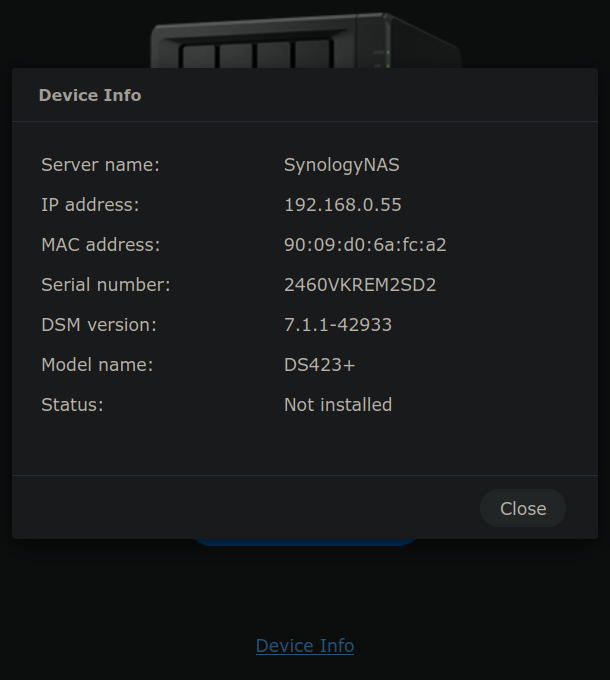
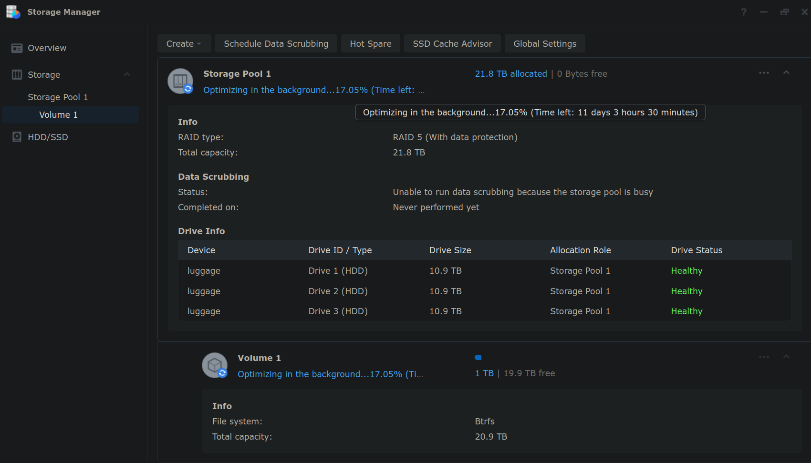
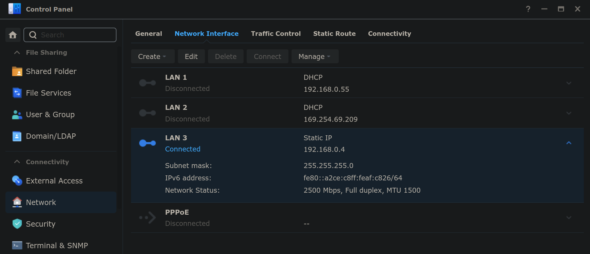
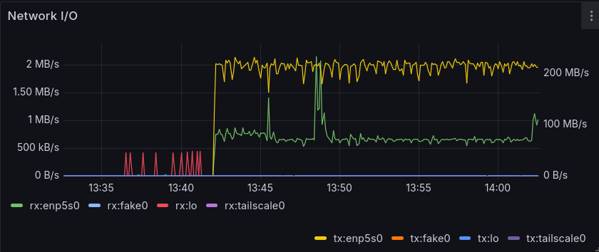

*SPAAAAACE!!! I like Space.*

Despite all my efforts, hard drives keep filling up. Producing videos
definitely does not help keeping drives from filling up and these days it's
rather hard not to produce videos even accidentally. Besides that, having a
single **large** storage unit allows making all the backups to a single place,
at least once. Important data is already replicated in multiple disks and/or
machines, having an additional large storage allows replacing one of those
copies and thus alleviating disk pressure.

<!-- more --> 

## Hardware

The machine of choice has been a
[Synology DiskStation DS423+](https://www.synology.com/en-global/products/DS423+#specs)
with, for now, just **3x 12TB**
[WD Red Plus Internal NAS HDD 3.5"](https://www.westerndigital.com/products/internal-drives/wd-red-plus-sata-3-5-hdd?sku=WD120EFBX)
in a RAID 5 configuration, which provides ~20 TB of usable space.
This is about *tripple* the amount of space needed *right now*, but those
disks were on offer and, according to
[WD's product brief](https://documents.westerndigital.com/content/dam/doc-library/en_us/assets/public/western-digital/product/internal-drives/wd-red-plus-hdd/product-brief-western-digital-wd-red-plus-hdd.pdf)
they should be *mostly quiet*.

### Memory expansion

Performance of this NAS may be improved by 
[adding third-party memory](https://www.reddit.com/r/synology/comments/1404xap/third_party_memory_in_ds423/)
like the [CT4G4SFS8266](https://www.crucial.com/memory/ddr4/ct4g4sfs8266),
although based on the
[community database](https://docs.google.com/spreadsheets/d/13pJDfDot_7CmSWeo1jjbegM82QwQNIW0gFQ9o_4xhXA/edit?gid=1974572930#gid=1974572930)
from the
[Synology RAM Megathread](https://www.reddit.com/r/synology/comments/zxcy8m/the_synology_ram_megathread/)
it may be problematic, a better option reportedly being
[M471A5244CB0-CTD](https://semiconductor.samsung.com/dram/module/sodimm/m471a5244cb0-ctd/)
although this one seems harder to find. For now, this seems unnecessary.

### Hardware transcoding

Hardware transcoding should be possible
[with Jellyfin on Docker](https://www.reddit.com/r/synology/comments/17j7u6d/synology_docker_jellyfin_how_to_enable_hardware/)
as well as with Plex Media Server. Then again, this will likely not be necessary,
since there is a much more capable server to run these services on.

### Future of hard-drive compatiblity

[As reported by Tom's Hardware](https://www.tomshardware.com/pc-components/nas/synology-requires-self-branded-drives-for-some-consumer-nas-systems-drops-full-functionality-and-support-for-third-party-hdds)
just two days ago:

!!! quote

    Synology's new Plus Series NAS systems, designed for small and medium enterprises
    and advanced home users, can no longer use non-Synology or non-certified hard drives
    and get the full feature set of their device. Instead, Synology customers will have
    to use the company's self-branded hard drives. While you can still use non-supported
    drives for storage, Hardwareluxx [machine translated] reports that you’ll lose
    several critical functions, including estimated hard drive health reports,
    volume-wide deduplication, lifespan analyses, and automatic firmware updates.
    The company also restricts storage pools and provides limited or zero support for
    third-party drives.

This sounds pretty bad, but the situation is not so dire *just yet*,
[as reported by NAS Compares](https://nascompares.com/2025/04/16/synology-2025-nas-hard-drive-and-ssd-lock-in-confirmed-bye-bye-seagate-and-wd/):

!!! quote

    There will be **no changes for Plus models released up to and including 2024**
    (excluding the XS Plus series and rack models). Furthermore, **migrating hard drives
    from existing Synology NAS to a new Plus model will continue to be possible without
    restrictions**. The use of compatible and unlisted hard drives will be subject to
    certain restrictions in the future, such as pool creation and support for issues and
    failures caused by the use of incompatible storage media. Volume-wide deduplication,
    lifespan analysis, and automatic hard drive firmware updates will only be available
    for Synology hard drives in the future. Tight integration of Synology NAS systems
    and hard drives reduces compatibility issues and increases system reliability and
    performance. At the same time, firmware updates and security patches can be deployed
    more efficiently, ensuring a high level of data security and more efficient support
    for Synology customers.

It would seems building a NAS setup right now is just about the best time, as it would
soon become no longer possible or supported, but by the time the current disks start
failing it should be possible to **replace** them with the same brand of disks (not
creating new volumes) and it should still be possible to even migrate them to a new NAS.

However, given the increasing degree of vendor lock-in going on with Synology, the next
NAS may well be a custom-built [FreeNAS](https://www.truenas.com/freenas/) or, possibly
better, [openmediavault](https://www.openmediavault.org/), which might as well run on
the Kubernetes servers in the meantime.

## Basic Setup

Find the IP address assigned to the NAS and add it in `/etc/hosts` with a fun
name, then open its port **5000** over *plain* HTTP, e.g.
<https://luggage:5001/>



After checking Device Info, the first (apparently not optional) step is to
upgrade the DSM software to the latest version, which as of now is
[Version: 7.2.2-72806 Update 3](https://www.synology.com/en-global/releaseNote/DSM?model=DS423%2B#7_2)
from 2025-02-04. The update process takes *up to* 10 minutes to complete,
in fact it finished in less than 5.

Setup an admin account with a non-obvious admin name and a very long and
strong passwword, then select the option to be notified about DSM updates,
to retain control over which updates are installed and when.

Skip the options to create a Synology Account and install Synology apps,
these can be revisited later. Skip also all the options to enable 2FA and MFA
for now; this NAS will not be exposed externally.

### Storage Pool and Volume

Create a **RAID 5** volume with the 3 disks available; they show up with only
10.9TB of *usage* capacity, so the volume would have 21.8TB of capacity.
Set the volume capacity to the **Max** value (22331 GB) and formated as Btrfs.

Leave the volume unencrypted, there is no need here to compromise performance,
but above all this should allow recovering data by moving these disks to another NAS
or even a PC, as it was the case years ago with the previous Synology NAS that died
with 4x 1TB disks in it (about 15 years ago).

The volume is now healthy, with a background job *Optimizing in the background* 
that initially estimates about 21 hours but then updates it's ETA to **11 days**
once the volume has about 1 TB in it.



## Advanced Setup

### File Services

[SMB Service](https://kb.synology.com/en-me/DSM/help/DSM/AdminCenter/file_winmacnfs_desc?version=7)
is enabled by default. Although this may be useful, there are no plans to use it.
At the very least, one should change the workgroup name. The services that would
be more useful in this homelab environment would be [NFS](#nfs) and [Rsync](#rsync).

#### NFS

[Enable NFS service](https://kb.synology.com/en-me/DSM/help/DSM/AdminCenter/file_winmacnfs_nfs?version=7)
under **File Services** in the Control Panel. Then,
[add NFS permissions](https://kb.synology.com/en-br/DSM/tutorial/I_cannot_mount_shared_folders_via_NFS_what_should_I_do#x_anchor_idefeb417a7d)
to actually allow access, to either specific IPs or all (`*`), to mount NFS volumes.
Install `nfs-common` and mount the **shared folder** (e.g. `NetBackup`)
rather than the entire volume (which has no NFS permissions):

``` console
$ sudo apt install nfs-common

$ sudo mount -t nfs luggage:/volume1/ /mnt/
mount.nfs: access denied by server while mounting luggage:/volume1/

$ sudo mount -t nfs luggage:/volume1/NetBackup /mnt/
$ sudo ls /mnt/ -lah
total 4.0K
drwxr-xr-x 1 root   root    22 Apr 18 17:05 .
drwxr-xr-x 1 root   root   132 Apr 18 16:13 ..
```

To mount the NAS after each restart, add a line in `/etc/fstab` with the default options:

``` fstab
luggage:/volume1/NetBackup /home/nas nfs defaults 0 0
```

Create the mount point and mount it to check access is granted:

``` console
# mkdir /home/nas 
# mount /home/nas 
# df -h | grep nas
luggage:/volume1/NetBackup   21T  1.3T   20T   6% /home/nas
```

When mounting for the first time, `dmesg` should NFS **v4.1** could be used:

``` dmesg
[37905.532214] FS-Cache: Loaded
[37905.544295] RPC: Registered named UNIX socket transport module.
[37905.544298] RPC: Registered udp transport module.
[37905.544299] RPC: Registered tcp transport module.
[37905.544299] RPC: Registered tcp NFSv4.1 backchannel transport module.
[37905.562189] FS-Cache: Netfs 'nfs' registered for caching
[37937.422623] NFS: Registering the id_resolver key type
[37937.422635] Key type id_resolver registered
[37937.422636] Key type id_legacy registered
```

#### Rsync

[Enable Rsync](https://kb.synology.com/en-me/DSM/help/DSM/AdminCenter/file_rsync?version=7)
as an alternative service, to incrementally upload files without mounting entire
NFS volumes (shared folders).

Create a separate user account with a long password **without** special
characters (`!`, `$`, etc.), so it can be
[used with `sshpass`](https://community.synology.com/enu/forum/1/post/162316?reply=501445)
without the shell misinterpreting the password.

Then enable the Rsync service, change the port and enable this accounts.
Do not apply a speed limit.

Install `sshpass` and store the password in `~/.ssh/nas-secret` (and `chmod 600` it),
this way `rsync` can connect without a password promt. Files can be transfered only
to/from a **shared folder** (e.g. `NetBackup`) rather than the entire volume:

``` console
$ SECRET=$(cat ~/.ssh/nas-secret)
$ rsync -ahv --rsh="sshpass -p $SECRET ssh -p 2222" Music luggage:/volume1/NetBackup/
Could not chdir to home directory /var/services/homes/ponder: No such file or directory
```

### Remote access

#### Cloudflare Tunnel

[Cloudflare Tunnels in Alfred](./2025-02-22-home-assistant-on-kubernetes-on-raspberry-pi-5-alfred.md#cloudflare-tunnel)
proved to be a good solution for making web sites externally available but
still protected behind SSO with **Zero Trust Web Access**.
Instead of installing and running `cloudflared` in the NAS (which
[should be possible](https://community.cloudflare.com/t/access-synology-nas-portal-via-cloudflared/497798/3)),
simply create a tunnel using the connector already running in the new
[Kubernetes homelab server (octavo)](./2025-04-12-kubernetes-homelab-server-with-ubuntu-server-24-04-octavo.md).

Directly create a public hostname for this tunnel, to point
<https://luggage.very-very-dark-gray.top/> to the HTTP**S** endpoint on
port **5001** using the static IP address. Make sure to **enable** the
**TLS** option **No TLS Verify**, so the tunnel can be used **without**
HTTPS certificates, because setting that up in the NAS isn't necessary.

Then setup [Cloudflare Access](./2025-03-23-remote-access-options-for-self-hosted-services.md#cloudflare-access)
by adding a new application for the new public hostname, protected by
a single identity provider (e.g. Google account). While not strictly
necessary, this means only a few trusted users can even reach the login
page of the NAS, after passing the identity check through Cloudflare,
before having a chance to try to log in.

#### Setup SSH

[To SSH into a Synology NAS](https://mariushosting.com/how-to-ssh-into-a-synology-nas/)
go to **Terminal & SNMP** under the Control Panel and **Enable SSH service**. Once
enabled, login is available **only to users in the admin group**:

``` console
$ ssh -l rincewind luggage
The authenticity of host 'luggage (192.168.0.55)' can't be established.
ED25519 key fingerprint is SHA256:atWMDkF65MUI0hieTZdRChhwEVclgIaYaL491X2gGyc.
This host key is known by the following other names/addresses:
    ~/.ssh/known_hosts:140: [hashed name]
    ~/.ssh/known_hosts:141: [hashed name]
Are you sure you want to continue connecting (yes/no/[fingerprint])? yes
Warning: Permanently added 'luggage' (ED25519) to the list of known hosts.
rincewind@luggage's password: 

Using terminal commands to modify system configs, execute external binary
files, add files, or install unauthorized third-party apps may lead to system
damages or unexpected behavior, or cause data loss. Make sure you are aware of
the consequences of each command and proceed at your own risk.

Warning: Data should only be stored in shared folders. Data stored elsewhere
may be deleted when the system is updated/restarted.

Could not chdir to home directory /var/services/homes/rincewind: No such file or directory
```

This user has `sudo` access, which of course comes with warnings:

``` console
rincewind@luggage:/$ sudo ls -l /volume1/

We trust you have received the usual lecture from the local System
Administrator. It usually boils down to these three things:

    #1) Respect the privacy of others.
    #2) Think before you type.
    #3) With great power comes great responsibility.

Password: 
total 0
drwxr-xr-x  1 root       root       120 Apr 18 10:42 @database
drwxrwxrwx+ 1 root       root        56 Apr 18 10:57 @eaDir
d---------+ 1 root       root        22 Apr 18 12:48 NetBackup
drwxr-xr-x  1 root       root        88 Apr 18 10:42 @S2S
drwxr-xr-x  1 SynoFinder SynoFinder  26 Apr 18 10:42 @SynoFinder-etc-volume
drwxr-xr-x  1 SynoFinder SynoFinder  84 Apr 18 10:42 @SynoFinder-log
drwxrwxrwt  1 root       root        40 Apr 18 10:57 @tmp
drwxr-xr-x  1 root       root        94 Apr 18 10:42 @userpreference
```

The warning seen above from `rsync` about home directory `/var/services/homes/ponder`
not existing is due to `/var/services/homes` being a symlink to a non-existing file:

``` console
rincewind@luggage:/$ ls -l /var/services/homes 
lrwxrwxrwx 1 root root 24 Apr 18 10:20 /var/services/homes -> /volume1/@fake_home_link
```

It might be possibly to change this, but the more intersting use of SSH access is to
run commands as `root`. To do this more efficiently (without having to enter a very
long password twice), it is actually possible to add SSH public keys for `root`:

``` console
rincewind@luggage:/$ echo 'ssh-rsa AAAAB3NzaC1yc2EAAAADAQABAAABAQDJC+vAO4ee18xVgXIp1l4upf0UJeigD1nd4uruntVcFNfgrYo3UK0QsybYvQ+G+88Yr8GQ+oIdRUe8hz5CVMBxhf5QwQ/wdnJS+gcLNGvTqK/fq80aarRkmY+MP8XCEogVjUdTiSNY/cl7Ox7tqCLITacav94JKaMMM4oKf6pLe9rayg5wM8ycW0k0aurA2GIjCJm6eRDRhhjoiOFrBtg7hinMAfCz3Gv9UyMIhPopba2YkG4ojG9S19f8bF6kGEH7QC8C2CADatfc53lm3a+rQxbI/z5OvtYyqlJnei7DrpS0WmQF/R6jdqmVYcUIQM7gknF8YleJyhglE3FUSCA7 ponder@rapture' \
  | sudo tee -a /root/.ssh/authorized_keys
```

Once the key is in place, `ponder` can *just* SSH in:

``` console
[ponder@rapture ~]$ ssh root@luggage

Using terminal commands to modify system configs, execute external binary
files, add files, or install unauthorized third-party apps may lead to system
damages or unexpected behavior, or cause data loss. Make sure you are aware of
the consequences of each command and proceed at your own risk.

Warning: Data should only be stored in shared folders. Data stored elsewhere
may be deleted when the system is updated/restarted.

root@luggage:~# 
```

### Setup 2.5G NIC

[Follow these instructions](https://github.com/bb-qq/r8152?tab=readme-ov-file#how-to-install),
which require [SSH access](#setup-ssh), download the latest 7.2 release
for `geminilake` from [the releases page](https://github.com/bb-qq/r8152/releases)
and install via the Synology **Package Center**.

The trick is to **Manual Install** the drivers *twice*, running these commands via SSH
between the first (failed) attempt and the second (which then succeeds):

``` console
root@luggage:~# install -m 4755 -o root -D /var/packages/r8152/target/r8152/spk_su /opt/sbin/spk_su
root@luggage:~# chmod a+rx /opt /opt/sbin
```

Rebooting the NAS was not possible because the recently created volume is still in
the process of being optimized, but in any case the new RTL8152/RTL8153 driver is
already running so we can already setup a static IP address on the new NIC under
**Network Interfaces** in the Control panel, then switch the network cable to the
new card (and update the PC's /etc/hosts to the static IP, if different), and after
a few seconds the new card shows as Connected with a glorious **2500 Mbps**:



Copying the 400GB collection of Audiobooks over NFS gets the 2.5Gbps NICs to work it out!



## Conclusion

The installation was easy enough, even setting up the 2.5Gbps NIC was not too painful.
The worst part of this whole affair was dealing with [NFS permissions](#nfs-permissions)
not working properly at all for the first few hours.

While it is possibly to run many other applications in containers, having at least one
server with much more CPU (and GPU) and RAM available already makes this point moot;
better to run services in the server/s and let the NAS *just be the NAS*.

## Appendix: WTF NFS Permissions

NFS was problematic for the first few hours, specially around permissions. It seemed
there was **no way** to have the correct level of access to the NFS share for all users:

- `root` user able to create and write files, and set ownership and permissions.
- Other users (`ponder` and `pi`) able to *at least* read files.
- Ideally, **all** users able to create and write files, and set ownership and permissions.

This all eventually started working correctly, after a few hours of trying every
value of **Squash** from two separate systems.

By default, the filesystem is owned by `root` by default, but directories can be created
owned by other users:

``` console
$ sudo ls /mnt/ -lah
total 4.0K
drwxrwxrwx  1 root   root     24 Apr 18 11:44 .
drwxr-xr-x 24 root   root   4.0K Nov  4 00:04 ..
drwxrwxrwx  1 ponder ponder    0 Apr 18 11:44 ponder

$ sudo ls /mnt/ -lahn
total 4.0K
drwxrwxrwx  1    0    0   24 Apr 18 11:44 .
drwxr-xr-x 24    0    0 4.0K Nov  4 00:04 ..
drwxrwxrwx  1 1000 1000    0 Apr 18 11:44 ponder
```

However, any users other than `root` cannot even *see* what is in the mounted volume,
even if files show as owned by them:

``` console
$ ls -l /home/nas
ls: cannot open directory '/home/nas': Permission denied
$ ls -ld /home/nas
drwxrwxrwx 1 root root 22 Apr 18 16:16 /home/nas

# ls -l /home/nas/
total 0
drwxr-xr-x 1 ponder ponder  5902 Apr  2 19:58 Music
```

For `ponder` and other users to actually have access to NFS mounted shares, one can
[allow access to all users](https://kb.synology.com/en-global/DSM/tutorial/What_can_I_do_to_access_mounted_folders_NFS#x_anchor_id3), by 
[setting the **Squash** option](https://kb.synology.com/en-global/DSM/help/DSM/AdminCenter/file_share_privilege_nfs?version=7)
(for each **client host**) to one of the following values:

*   **No mapping**: 
    *   **Only** `root` has access (read *and* write).
    *   File ownership and permissions are visible on existing files.
    *   File ownership and permissions **can** be set on new files.
*   **Map root to admin**:
    *   **Only** `root` has access.
    *   File ownership and permissions are visible on existing files.
    *   File ownership and permissions **cannot** be set on new files.
*   **Map root to guest**:
    *   **Nobody** (not even `root`) gets **read** access!
*   **Map all users to admin**:
    *   **All** users get **read** access.
    *   File ownership and permissions **are** visible on existing files.
    *   **Nobody** (not even `root`) gets **write** access!
*   **Map all users to guest**:
    *   **Nobody** (not even `root`) gets **read** access!

In short:

*   **No mapping** is the only option that allows **write** access; for `root` only.
*   **Map all users to admin**: is the only option that allows access to all users;
    **read only**.

The following sections include more detailed testing.

### No mapping

This is the default option. As seen above:

- **only** `root` has access,
- `root` can set file ownership and permissons,
- nobody else can see anything.

However, *at least once*, this option did actually allow non-root users to **write**
new files and create directories, and even kept file ownership and permissions!

### Map root to admin

This does not grant access to any users other than `root` and it prevent `root` from
setting file ownership or permissions:

``` console
# chown 1000 /home/nas/audio/test/
chown: changing ownership of '/home/nas/audio/test/': Operation not permitted
```

### Map root to guest

This prevents even `root` from seeing anything inside the shared folder:

``` console
# ls -l /home/nas/audio
ls: cannot access '/home/nas/audio': Permission denied
```

### Map all users to admin

This enable all users to read **and write** files in the shared folder, but permissions
are set based on the `admin` user in the NAS (UID 1024):

``` console
$ ls -l /home/nas/
total 0
drwxr-xr-x 1 ponder ponder  5902 Apr  2 19:58 Music

$ mkdir /home/nas/test
$ ls -l /home/nas/
total 0
drwxr-xr-x 1 ponder ponder  5902 Apr  2 19:58 Music
drwxrwxrwx 1   1024 users      0 Apr 18 16:35 test
```

This also prevents *even `root`* from setting permissions on files and directories,
just as with [Map root to admin](#map-root-to-admin).

This doesn't prevent users from copying files into the NAS, but it does make it
impossible to make a *proper* backup preserving file permissions and ownership:

``` console
$ rsync -uva Music /mnt/ponder/
sending incremental file list
rsync: [generator] failed to set permissions on "/mnt/ponder/.": Operation not permitted (1)
./
...

$ sudo cp -av Music/ /mnt/ponder/
cp: failed to preserve ownership for '/mnt/ponder/Music/60.Christmas.Carols.for.Kids/01 Frosty the Snowman.mp3': Operation not permitted
...
```

Changing ownership of files seems to be out of the question, at least when allowing
access to all users. Going back to [No mapping](#no-mapping) only allows `root` to
**write** files with, albeit the correct permissions, but the setting is enforced
**per host** so there is no way to have a separate NAS user can be used for
**read-only** access.

### Map all users to guest

Just as useless as [Map root to guest](#map-root-to-guest).
