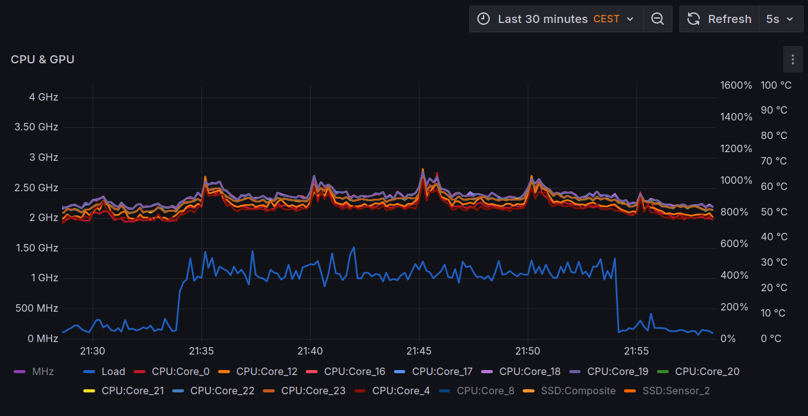
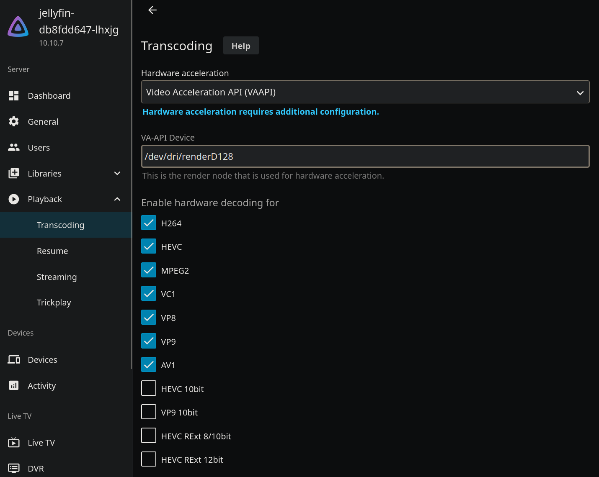

I don't often watch videos, but when I do, I find it useful to have them
all in one Plex... at least, I *did*, until the recent 
[*Important 2025 Plex Updates*](https://www.plex.tv/blog/important-2025-plex-updates/)
made it clear that it was going to have a significant cost; for a service
I *seldom* use.

The new pricing becomes effective today and, although I had a few weeks to
*ponder* the possibility of purchasing a lifetime subscription for a lot less
than it costs now, I decided to switch to [Jellyfin](https://jellyfin.org/)
and I'm glad I did!

<!-- more -->

There are a number of articles about combining Jellyfin with many other
components, such as NAS devices and other media-related applications:
[Deploying a Kubernetes-Based Media Server](https://merox.dev/blog/kubernetes-media-server/#jellyfin-br),
[Deploying Media Stack on Kubernetes with Longhorn and NFS Storage](https://docs.merox.dev/operations/containerization/k3s/manifests/media-stack/)
from about a year ago, and more complete although from 4 years ago
[Kubernetes Part 16: Deploy Jellyfin](https://www.debontonline.com/2021/11/kubernetes-part-16-deploy-jellyfin.html).

Those articles go too far beyond my very basic needs, I just want to (very
occassionally) watch videos that are neither movies nor TV shows; family
videos and lectures purchased directly from their producers, such as
[Logos By Nick](https://academy.logosbynick.com/) and
[Riley Brandt](https://www.rileybrandt.com/).
I am more interested in enabling
[Intel GPU acceleration on Kubernetes](https://jonathangazeley.com/2025/02/11/intel-gpu-acceleration-on-kubernetes/)
(a feature that was always locked behing the Plex subscription, but not so with
Jellyfin) in anticipation of *other* applications that may make *even better* use of it.

## Jellyfin

Deploying Jellyfin itself is relatively simple, the manifests are longer than
[those from Merox](https://merox.dev/blog/kubernetes-media-server/#jellyfin)
because three physical volumes (and claims) are included:

*  `/home/k8s/jellyfin` for Jellyfin's own files.
*  `/home/nas/public/videos` for those digital art courses from Nick and
    Riley, plus some old lessons from [Coursera](https://www.coursera.org/).
*  `/home/nas/public/ponder/Videos` for family videos. These can later be made
    accessible to specific users only.

??? k8s "Basic Jellyfin deployment: `jellyfin.yaml`"

    ``` yaml title="jellyfin.yaml"
    apiVersion: v1
    kind: Namespace
    metadata:
      name: media-center
    ---
    apiVersion: v1
    kind: PersistentVolume
    metadata:
      name: config-pv
      namespace: media-center
    spec:
      storageClassName: manual
      capacity:
        storage: 1Gi
      accessModes:
        - ReadWriteOnce
      hostPath:
        path: /home/k8s/jellyfin
      persistentVolumeReclaimPolicy: Retain
    ---
    apiVersion: v1
    kind: PersistentVolumeClaim
    metadata:
      name: config-pvc
      namespace: media-center
    spec:
      storageClassName: manual
      accessModes:
        - ReadWriteOnce
      resources:
        requests:
          storage: 1Gi
      volumeName: config-pv
      volumeMode: Filesystem
    ---
    apiVersion: v1
    kind: PersistentVolume
    metadata:
      name: public-video-pv
      namespace: media-center
    spec:
      storageClassName: manual
      capacity:
        storage: 1000Gi
      accessModes:
        - ReadWriteOnce
      hostPath:
        path: /home/nas/public/video
      persistentVolumeReclaimPolicy: Retain
    ---
    apiVersion: v1
    kind: PersistentVolumeClaim
    metadata:
      name: public-video-pvc
      namespace: media-center
    spec:
      storageClassName: manual
      accessModes:
        - ReadWriteOnce
      resources:
        requests:
          storage: 1000Gi
      volumeName: public-video-pv
      volumeMode: Filesystem
    ---
    apiVersion: v1
    kind: PersistentVolume
    metadata:
      name: ponder-video-pv
      namespace: media-center
    spec:
      storageClassName: manual
      capacity:
        storage: 1000Gi
      accessModes:
        - ReadWriteOnce
      hostPath:
        path: /home/nas/public/ponder/Videos
      persistentVolumeReclaimPolicy: Retain
    ---
    apiVersion: v1
    kind: PersistentVolumeClaim
    metadata:
      name: ponder-video-pvc
      namespace: media-center
    spec:
      storageClassName: manual
      accessModes:
        - ReadWriteOnce
      resources:
        requests:
          storage: 1000Gi
      volumeName: ponder-video-pv
      volumeMode: Filesystem
    ---
    apiVersion: apps/v1
    kind: Deployment
    metadata:
      name: jellyfin
      namespace: media-center
    spec:
      replicas: 1
      selector:
        matchLabels:
          app: jellyfin
      template:
        metadata:
          labels:
            app: jellyfin
        spec:
          containers:
          - name: jellyfin
            image: jellyfin/jellyfin
            ports:
            - containerPort: 8096
            securityContext:
              readOnlyRootFilesystem: true
              runAsNonRoot: false
              runAsUser: 1000
              runAsGroup: 1000
            resources:
              requests:
                cpu: 1000m
                memory: 1Gi
              limits:
                cpu: 3500m
                memory: 6Gi
            volumeMounts:
            - name: config
              mountPath: /config
            - name: family-videos
              mountPath: /data/family-videos
            - name: videos
              mountPath: /data/videos
          securityContext:
            runAsNonRoot: false
            fsGroup: 1000
            runAsUser: 1000
            runAsGroup: 1000
          volumes:
          - name: config
            persistentVolumeClaim:
              claimName: config-pvc
          - name: videos
            persistentVolumeClaim:
              claimName: public-video-pvc
          - name: family-videos
            persistentVolumeClaim:
              claimName: ponder-video-pvc
    ---
    apiVersion: v1
    kind: Service
    metadata:
      name: jellyfin-svc
      namespace: media-center
    spec:
      type: ClusterIP
      ports:
        - port: 80
          targetPort: 8096
      selector:
        app: jellyfin
    ---
    apiVersion: networking.k8s.io/v1
    kind: Ingress
    metadata:
      name: jellyfin-ingress
      namespace: media-center
      annotations:
        cert-manager.io/cluster-issuer: letsencrypt-prod
        nginx.ingress.kubernetes.io/websocket-services: jellyfin-svc
    spec:
      ingressClassName: nginx
      rules:
        - host: jellyfin.very-very-dark-gray.top
          http:
            paths:
              - path: /
                pathType: Prefix
                backend:
                  service:
                    name: jellyfin-svc
                    port:
                      number: 80
      tls:
        - secretName: tls-secret
          hosts:
            - jellyfin.very-very-dark-gray.top
    ```

Jellyfin will be running as the user that *owns* those not-so-public videos,
this user already exists but what does not yet exist is the
`/home/k8s/jellyfin` directory for Jellyfin's own files.

``` console
$ sudo mkdir /home/k8s/jellyfin
$ sudo chown 1000:1000 /home/k8s/jellyfin

$ kubectl apply -f jellyfin.yaml
namespace/media-center created
persistentvolume/config-pv created
persistentvolumeclaim/config-pvc created
persistentvolume/public-video-pv created
persistentvolumeclaim/public-video-pvc created
persistentvolume/ponder-video-pv created
persistentvolumeclaim/ponder-video-pvc created
deployment.apps/jellyfin created
service/jellyfin-svc created
ingress.networking.k8s.io/jellyfin-ingress created

$ kubectl get all -n media-center
NAME                            READY   STATUS    RESTARTS   AGE
pod/cm-acme-http-solver-qjwgz   1/1     Running   0          25s
pod/jellyfin-97f9fb4f8-6rgzz    0/1     Pending   0          28s

NAME                                TYPE        CLUSTER-IP      EXTERNAL-IP   PORT(S)          AGE
service/cm-acme-http-solver-nk5gr   NodePort    10.108.15.161   <none>        8089:32620/TCP   25s
service/jellyfin-svc                ClusterIP   10.98.226.91    <none>        80/TCP           28s

NAME                       READY   UP-TO-DATE   AVAILABLE   AGE
deployment.apps/jellyfin   0/1     1            0           28s

NAME                                 DESIRED   CURRENT   READY   AGE
replicaset.apps/jellyfin-97f9fb4f8   1         1         0       28s

$ kubectl get svc -n media-center
NAME                        TYPE        CLUSTER-IP      EXTERNAL-IP   PORT(S)          AGE
cm-acme-http-solver-nk5gr   NodePort    10.108.15.161   <none>        8089:32620/TCP   15s
jellyfin-svc                ClusterIP   10.98.226.91    <none>        80/TCP           18s

$ kubectl get ingress -n media-center
NAME                        CLASS    HOSTS                                   ADDRESS   PORTS     AGE
cm-acme-http-solver-hwpt7   <none>   jellyfin.very-very-dark-gray.top             80        17s
jellyfin-ingress            nginx    jellyfin.very-very-dark-gray.top             80, 443   20s
```

After a couple of minutes Jellyfin is available (and ready to be setup) at
<http://jellyfin.very-very-dark-gray.top>

### AV1 CPU transcoding

Playing a long AV1 video **no** hardware acceleration increases CPU load by
300-500% above the baseline, and raises core temperatures by 5-15 ºC:

{: style="height:335px;width:650px"}

All the while the GPU shows no load at all:

``` console
# intel_gpu_top -o - 
...
 Freq MHz      IRQ RC6     Power W             RCS             BCS             VCS            VECS 
 req  act       /s   %   gpu   pkg       %  se  wa       %  se  wa       %  se  wa       %  se  wa 
   0    0        0 100  0.00  9.17    0.00   0   0    0.00   0   0    0.00   0   0    0.00   0   0 
   0    0        0 100  0.00 11.49    0.00   0   0    0.00   0   0    0.00   0   0    0.00   0   0 
   0    0        0 100  0.00  7.03    0.00   0   0    0.00   0   0    0.00   0   0    0.00   0   0 
   0    0        0 100  0.00 10.03    0.00   0   0    0.00   0   0    0.00   0   0    0.00   0   0 
   0    0        0 100  0.00  8.41    0.00   0   0    0.00   0   0    0.00   0   0    0.00   0   0 
   0    0        0 100  0.00 10.59    0.00   0   0    0.00   0   0    0.00   0   0    0.00   0   0 
   0    0        0 100  0.00  8.42    0.00   0   0    0.00   0   0    0.00   0   0    0.00   0   0 
   0    0        0 100  0.00  9.60    0.00   0   0    0.00   0   0    0.00   0   0    0.00   0   0 
   0    0        0 100  0.00  8.22    0.00   0   0    0.00   0   0    0.00   0   0    0.00   0   0 
   0    0        0 100  0.00 10.36    0.00   0   0    0.00   0   0    0.00   0   0    0.00   0   0 
   0    0        0 100  0.00 10.82    0.00   0   0    0.00   0   0    0.00   0   0    0.00   0   0 
   0    0        0 100  0.00  8.38    0.00   0   0    0.00   0   0    0.00   0   0    0.00   0   0 
   0    0        0 100  0.00  8.60    0.00   0   0    0.00   0   0    0.00   0   0    0.00   0   0 
   0    0        0 100  0.00  9.88    0.00   0   0    0.00   0   0    0.00   0   0    0.00   0   0 
   0    0        0 100  0.00  8.54    0.00   0   0    0.00   0   0    0.00   0   0    0.00   0   0 
   0    0        0 100  0.00 10.19    0.00   0   0    0.00   0   0    0.00   0   0    0.00   0   0 
   0    0        0 100  0.00  8.08    0.00   0   0    0.00   0   0    0.00   0   0    0.00   0   0 
   0    0        0 100  0.00  9.63    0.00   0   0    0.00   0   0    0.00   0   0    0.00   0   0 
```

## Intel GPU

The above doesn't immediately suggest Jellyfin *needs* GPU support, but since
there a GPU in the server...

### Avaiilable hardware and codecs

This server is an
[ASUS NUC 13 Pro Tall PC Kit RNUC13ANHI700000I w/ Intel Core i7-1360P](https://webshop.asus.com/de/Mini-PCs/ASUS-NUC-13-Pro-Tall-PC-Kit-RNUC13ANHI700000I/90AR00C1-M000F0)
with an **13th** generation Intel Core i7 CPU and Intel **Iris Xe** GPU:

``` console
# cat /proc/cpuinfo 
processor       : 0
vendor_id       : GenuineIntel
cpu family      : 6
model           : 186
model name      : 13th Gen Intel(R) Core(TM) i7-1360P
stepping        : 2
microcode       : 0x4124
cpu MHz         : 538.627
cache size      : 18432 KB
physical id     : 0
siblings        : 16
core id         : 0
cpu cores       : 12
apicid          : 0
initial apicid  : 0
fpu             : yes
fpu_exception   : yes
cpuid level     : 32
wp              : yes
flags           : fpu vme de pse tsc msr pae mce cx8 apic sep mtrr pge mca cmov pat pse36 clflush dts acpi mmx fxsr sse sse2 ss ht tm pbe syscall nx pdpe1gb rdtscp lm constant_tsc art arch_perfmon pebs bts rep_good nopl xtopology nonstop_tsc cpuid aperfmperf tsc_known_freq pni pclmulqdq dtes64 monitor ds_cpl vmx smx est tm2 ssse3 sdbg fma cx16 xtpr pdcm sse4_1 sse4_2 x2apic movbe popcnt tsc_deadline_timer aes xsave avx f16c rdrand lahf_lm abm 3dnowprefetch cpuid_fault epb ssbd ibrs ibpb stibp ibrs_enhanced tpr_shadow flexpriority ept vpid ept_ad fsgsbase tsc_adjust bmi1 avx2 smep bmi2 erms invpcid rdseed adx smap clflushopt clwb intel_pt sha_ni xsaveopt xsavec xgetbv1 xsaves split_lock_detect user_shstk avx_vnni dtherm ida arat pln pts hwp hwp_notify hwp_act_window hwp_epp hwp_pkg_req hfi vnmi umip pku ospke waitpkg gfni vaes vpclmulqdq rdpid movdiri movdir64b fsrm md_clear serialize arch_lbr ibt flush_l1d arch_capabilities
vmx flags       : vnmi preemption_timer posted_intr invvpid ept_x_only ept_ad ept_1gb flexpriority apicv tsc_offset vtpr mtf vapic ept vpid unrestricted_guest vapic_reg vid ple shadow_vmcs ept_mode_based_exec tsc_scaling usr_wait_pause
bugs            : spectre_v1 spectre_v2 spec_store_bypass swapgs eibrs_pbrsb rfds bhi
bogomips        : 5222.40
clflush size    : 64
cache_alignment : 64
address sizes   : 39 bits physical, 48 bits virtual
power management:
```

The GPU is detected as a *Raptor Lake-P [**UHD Graphics**]*, except by `intel_gpu_top`:

``` console
# intel_gpu_top
intel-gpu-top: Intel Alderlake_p (Gen12) @ /dev/dri/card0 -    0/   0 MHz; 100% RC6;  0.00/ 5.97 W

# lspci -k | grep -EA3 'VGA|3D|Display'
00:02.0 VGA compatible controller: Intel Corporation Raptor Lake-P [UHD Graphics] (rev 04)
        DeviceName: Onboard - Video
        Subsystem: Intel Corporation Raptor Lake-P [UHD Graphics]
        Kernel driver in use: i915

# lshw -c video
  *-display                 
       description: VGA compatible controller
       product: Raptor Lake-P [UHD Graphics]
       vendor: Intel Corporation
       physical id: 2
       bus info: pci@0000:00:02.0
       version: 04
       width: 64 bits
       clock: 33MHz
       capabilities: pciexpress msi pm vga_controller bus_master cap_list rom
       configuration: driver=i915 latency=0
       resources: iomemory:610-60f iomemory:400-3ff irq:214 memory:6123000000-6123ffffff memory:4000000000-400fffffff ioport:3000(size=64) memory:c0000-dffff memory:611c000000-6122ffffff memory:6000000000-60dfffffff
```

The list of supported codes includes: AV1, H264, HEVC, JPEG, MPEG2, VC1, VC1 Advanced,
VC1 Simple, VP8, VP9.

??? terminal "Video codecs as reported by `vainfo`"

    ``` console
    # vainfo --display drm --device /dev/dri/renderD128
    libva info: VA-API version 1.20.0
    libva info: Trying to open /usr/lib/x86_64-linux-gnu/dri/iHD_drv_video.so
    libva info: Found init function __vaDriverInit_1_20
    libva info: va_openDriver() returns 0
    vainfo: VA-API version: 1.20 (libva 2.12.0)
    vainfo: Driver version: Intel iHD driver for Intel(R) Gen Graphics - 24.1.0 ()
    vainfo: Supported profile and entrypoints
          VAProfileNone                   : VAEntrypointVideoProc
          VAProfileNone                   : VAEntrypointStats
          VAProfileMPEG2Simple            : VAEntrypointVLD
          VAProfileMPEG2Simple            : VAEntrypointEncSlice
          VAProfileMPEG2Main              : VAEntrypointVLD
          VAProfileMPEG2Main              : VAEntrypointEncSlice
          VAProfileH264Main               : VAEntrypointVLD
          VAProfileH264Main               : VAEntrypointEncSlice
          VAProfileH264Main               : VAEntrypointFEI
          VAProfileH264Main               : VAEntrypointEncSliceLP
          VAProfileH264High               : VAEntrypointVLD
          VAProfileH264High               : VAEntrypointEncSlice
          VAProfileH264High               : VAEntrypointFEI
          VAProfileH264High               : VAEntrypointEncSliceLP
          VAProfileVC1Simple              : VAEntrypointVLD
          VAProfileVC1Main                : VAEntrypointVLD
          VAProfileVC1Advanced            : VAEntrypointVLD
          VAProfileJPEGBaseline           : VAEntrypointVLD
          VAProfileJPEGBaseline           : VAEntrypointEncPicture
          VAProfileH264ConstrainedBaseline: VAEntrypointVLD
          VAProfileH264ConstrainedBaseline: VAEntrypointEncSlice
          VAProfileH264ConstrainedBaseline: VAEntrypointFEI
          VAProfileH264ConstrainedBaseline: VAEntrypointEncSliceLP
          VAProfileVP8Version0_3          : VAEntrypointVLD
          VAProfileHEVCMain               : VAEntrypointVLD
          VAProfileHEVCMain               : VAEntrypointEncSlice
          VAProfileHEVCMain               : VAEntrypointFEI
          VAProfileHEVCMain               : VAEntrypointEncSliceLP
          VAProfileHEVCMain10             : VAEntrypointVLD
          VAProfileHEVCMain10             : VAEntrypointEncSlice
          VAProfileHEVCMain10             : VAEntrypointEncSliceLP
          VAProfileVP9Profile0            : VAEntrypointVLD
          VAProfileVP9Profile0            : VAEntrypointEncSliceLP
          VAProfileVP9Profile1            : VAEntrypointVLD
          VAProfileVP9Profile1            : VAEntrypointEncSliceLP
          VAProfileVP9Profile2            : VAEntrypointVLD
          VAProfileVP9Profile2            : VAEntrypointEncSliceLP
          VAProfileVP9Profile3            : VAEntrypointVLD
          VAProfileVP9Profile3            : VAEntrypointEncSliceLP
          VAProfileHEVCMain12             : VAEntrypointVLD
          VAProfileHEVCMain12             : VAEntrypointEncSlice
          VAProfileHEVCMain422_10         : VAEntrypointVLD
          VAProfileHEVCMain422_10         : VAEntrypointEncSlice
          VAProfileHEVCMain422_12         : VAEntrypointVLD
          VAProfileHEVCMain422_12         : VAEntrypointEncSlice
          VAProfileHEVCMain444            : VAEntrypointVLD
          VAProfileHEVCMain444            : VAEntrypointEncSliceLP
          VAProfileHEVCMain444_10         : VAEntrypointVLD
          VAProfileHEVCMain444_10         : VAEntrypointEncSliceLP
          VAProfileHEVCMain444_12         : VAEntrypointVLD
          VAProfileHEVCSccMain            : VAEntrypointVLD
          VAProfileHEVCSccMain            : VAEntrypointEncSliceLP
          VAProfileHEVCSccMain10          : VAEntrypointVLD
          VAProfileHEVCSccMain10          : VAEntrypointEncSliceLP
          VAProfileHEVCSccMain444         : VAEntrypointVLD
          VAProfileHEVCSccMain444         : VAEntrypointEncSliceLP
          VAProfileAV1Profile0            : VAEntrypointVLD
          VAProfileHEVCSccMain444_10      : VAEntrypointVLD
          VAProfileHEVCSccMain444_10      : VAEntrypointEncSliceLP
    ```

### Kubernetes GPU support

Follow this comprehensive guide to setup
[Intel GPU acceleration on Kubernetes](https://jonathangazeley.com/2025/02/11/intel-gpu-acceleration-on-kubernetes/);
start by installing the VA-API (Video Acceleration API) `non-free` drivers:

``` console
# apt install intel-media-va-driver-non-free libva-drm2 libva-x11-2 -y
```

#### Node Feature Discovery

[Node Feature Discovery](https://github.com/kubernetes-sigs/node-feature-discovery) is a Kubernetes add-on that collects details about
available hardware and exposes it as node labels. Initially, this node
`octavo` exposed only the following labels:

``` console
$ kubectl get node octavo -o json | jq .metadata.labels
{
  "beta.kubernetes.io/arch": "amd64",
  "beta.kubernetes.io/os": "linux",
  "kubernetes.io/arch": "amd64",
  "kubernetes.io/hostname": "octavo",
  "kubernetes.io/os": "linux",
  "node-role.kubernetes.io/control-plane": ""
}
```

Install NFD with the [official Helm chart](https://artifacthub.io/packages/helm/node-feature-discovery/node-feature-discovery), deploying it in its own
dedicated namespace:

``` console
$ helm repo add node-feature-discovery \
  https://kubernetes-sigs.github.io/node-feature-discovery/charts
"node-feature-discovery" has been added to your repositories

$ helm upgrade -i \
  --create-namespace \
  -n node-feature-discovery \
  node-feature-discovery \
  node-feature-discovery/node-feature-discovery
Release "node-feature-discovery" does not exist. Installing it now.
W0429 23:08:25.320035 1996504 warnings.go:70] spec.template.spec.affinity.nodeAffinity.preferredDuringSchedulingIgnoredDuringExecution[0].preference.matchExpressions[0].key: node-role.kubernetes.io/master is use "node-role.kubernetes.io/control-plane" instead
NAME: node-feature-discovery
LAST DEPLOYED: Tue Apr 29 23:08:24 2025
NAMESPACE: node-feature-discovery
STATUS: deployed
REVISION: 1
TEST SUITE: None
```

After installing this many more labels are exposed, including lots of
`feature.node.kubernetes.io` labels:

??? terminal "Node labels exposed after installing NFD"

    ``` console
    $ kubectl get node octavo -o json | jq .metadata.labels
    {
      "beta.kubernetes.io/arch": "amd64",
      "beta.kubernetes.io/os": "linux",
      "feature.node.kubernetes.io/cpu-cpuid.ADX": "true",
      "feature.node.kubernetes.io/cpu-cpuid.AESNI": "true",
      "feature.node.kubernetes.io/cpu-cpuid.AVX": "true",
      "feature.node.kubernetes.io/cpu-cpuid.AVX2": "true",
      "feature.node.kubernetes.io/cpu-cpuid.AVXVNNI": "true",
      "feature.node.kubernetes.io/cpu-cpuid.BHI_CTRL": "true",
      "feature.node.kubernetes.io/cpu-cpuid.CETIBT": "true",
      "feature.node.kubernetes.io/cpu-cpuid.CETSS": "true",
      "feature.node.kubernetes.io/cpu-cpuid.CMPXCHG8": "true",
      "feature.node.kubernetes.io/cpu-cpuid.FLUSH_L1D": "true",
      "feature.node.kubernetes.io/cpu-cpuid.FMA3": "true",
      "feature.node.kubernetes.io/cpu-cpuid.FSRM": "true",
      "feature.node.kubernetes.io/cpu-cpuid.FXSR": "true",
      "feature.node.kubernetes.io/cpu-cpuid.FXSROPT": "true",
      "feature.node.kubernetes.io/cpu-cpuid.GFNI": "true",
      "feature.node.kubernetes.io/cpu-cpuid.HRESET": "true",
      "feature.node.kubernetes.io/cpu-cpuid.HYBRID_CPU": "true",
      "feature.node.kubernetes.io/cpu-cpuid.IA32_ARCH_CAP": "true",
      "feature.node.kubernetes.io/cpu-cpuid.IA32_CORE_CAP": "true",
      "feature.node.kubernetes.io/cpu-cpuid.IBPB": "true",
      "feature.node.kubernetes.io/cpu-cpuid.IDPRED_CTRL": "true",
      "feature.node.kubernetes.io/cpu-cpuid.LAHF": "true",
      "feature.node.kubernetes.io/cpu-cpuid.MD_CLEAR": "true",
      "feature.node.kubernetes.io/cpu-cpuid.MOVBE": "true",
      "feature.node.kubernetes.io/cpu-cpuid.MOVDIR64B": "true",
      "feature.node.kubernetes.io/cpu-cpuid.MOVDIRI": "true",
      "feature.node.kubernetes.io/cpu-cpuid.OSXSAVE": "true",
      "feature.node.kubernetes.io/cpu-cpuid.PSFD": "true",
      "feature.node.kubernetes.io/cpu-cpuid.RRSBA_CTRL": "true",
      "feature.node.kubernetes.io/cpu-cpuid.SERIALIZE": "true",
      "feature.node.kubernetes.io/cpu-cpuid.SHA": "true",
      "feature.node.kubernetes.io/cpu-cpuid.SPEC_CTRL_SSBD": "true",
      "feature.node.kubernetes.io/cpu-cpuid.STIBP": "true",
      "feature.node.kubernetes.io/cpu-cpuid.STOSB_SHORT": "true",
      "feature.node.kubernetes.io/cpu-cpuid.SYSCALL": "true",
      "feature.node.kubernetes.io/cpu-cpuid.SYSEE": "true",
      "feature.node.kubernetes.io/cpu-cpuid.VAES": "true",
      "feature.node.kubernetes.io/cpu-cpuid.VMX": "true",
      "feature.node.kubernetes.io/cpu-cpuid.VPCLMULQDQ": "true",
      "feature.node.kubernetes.io/cpu-cpuid.WAITPKG": "true",
      "feature.node.kubernetes.io/cpu-cpuid.X87": "true",
      "feature.node.kubernetes.io/cpu-cpuid.XGETBV1": "true",
      "feature.node.kubernetes.io/cpu-cpuid.XSAVE": "true",
      "feature.node.kubernetes.io/cpu-cpuid.XSAVEC": "true",
      "feature.node.kubernetes.io/cpu-cpuid.XSAVEOPT": "true",
      "feature.node.kubernetes.io/cpu-cpuid.XSAVES": "true",
      "feature.node.kubernetes.io/cpu-cstate.enabled": "true",
      "feature.node.kubernetes.io/cpu-hardware_multithreading": "true",
      "feature.node.kubernetes.io/cpu-model.family": "6",
      "feature.node.kubernetes.io/cpu-model.id": "186",
      "feature.node.kubernetes.io/cpu-model.vendor_id": "Intel",
      "feature.node.kubernetes.io/cpu-pstate.scaling_governor": "powersave",
      "feature.node.kubernetes.io/cpu-pstate.status": "active",
      "feature.node.kubernetes.io/cpu-pstate.turbo": "true",
      "feature.node.kubernetes.io/kernel-config.NO_HZ": "true",
      "feature.node.kubernetes.io/kernel-config.NO_HZ_FULL": "true",
      "feature.node.kubernetes.io/kernel-version.full": "6.8.0-58-generic",
      "feature.node.kubernetes.io/kernel-version.major": "6",
      "feature.node.kubernetes.io/kernel-version.minor": "8",
      "feature.node.kubernetes.io/kernel-version.revision": "0",
      "feature.node.kubernetes.io/pci-0300_8086.present": "true",
      "feature.node.kubernetes.io/pci-0300_8086.sriov.capable": "true",
      "feature.node.kubernetes.io/storage-nonrotationaldisk": "true",
      "feature.node.kubernetes.io/system-os_release.ID": "ubuntu",
      "feature.node.kubernetes.io/system-os_release.VERSION_ID": "24.04",
      "feature.node.kubernetes.io/system-os_release.VERSION_ID.major": "24",
      "feature.node.kubernetes.io/system-os_release.VERSION_ID.minor": "04",
      "kubernetes.io/arch": "amd64",
      "kubernetes.io/hostname": "octavo",
      "kubernetes.io/os": "linux",
      "node-role.kubernetes.io/control-plane": ""
    }
    ```

Additional detection rules are required to detect Intel GPU hardware.
These can be downloaded from the
[intel/intel-device-plugins-for-kubernetes](https://github.com/intel/intel-device-plugins-for-kubernetes?tab=readme-ov-file#overview)
repository, in particular
[node-feature-rules.yaml](https://raw.githubusercontent.com/intel/intel-device-plugins-for-kubernetes/main/deployments/nfd/overlays/node-feature-rules/node-feature-rules.yaml)
is the file to be applied, albeit with a slight modification:
remove or comment out the `extendedResources` section under the rule
named `intel.sgx`:

``` yaml title="node-feature-rules.yaml" linenums="113" hl_lines="4 5"
    - name: "intel.sgx"
      labels:
        "intel.feature.node.kubernetes.io/sgx": "true"
      # extendedResources:
      #   sgx.intel.com/epc: "@cpu.security.sgx.epc"
```

Without this change, the original manifest cannot be applied:

``` console
$ kubectl apply -f node-feature-rules.yaml 
Error from server (BadRequest): error when creating "node-feature-rules.yaml": NodeFeatureRule in version "v1alpha1" cannot be handled as a NodeFeatureRule: strict decoding error: unknown field "spec.rules[6].extendedResources"
```

Apply the modified manifest:

``` console
$ kubectl apply -f node-feature-rules.yaml
nodefeaturerule.nfd.k8s-sigs.io/intel-dp-devices created
```

Then inspect node labels again to check that there is a new set of
`intel.feature.node.kubernetes.io` labels:

``` console
$ kubectl get node octavo -o json | jq .metadata.labels \
  | grep intel.feature.node.kubernetes.io
  "intel.feature.node.kubernetes.io/gpu": "true",
```

At this point node labels should include additional
[(missing) `gpu.intel.com` labels](#missing-gpuintelcom-labels),
but these not showing up does not necessarily mean trouble. Moving on to the next
section should prove whether the GPU becomes available to Kubernetes.

#### Intel Device Plugin

To install the Intel device plugin, first install Intel’s device plugins operator:

``` console
$ helm repo add intel https://intel.github.io/helm-charts/
"intel" has been added to your repositories

$ helm upgrade -i \
  --create-namespace \
  -n intel-device-plugins-gpu \
  intel-device-plugins-operator \
  intel/intel-device-plugins-operator
Release "intel-device-plugins-operator" does not exist. Installing it now.
NAME: intel-device-plugins-operator
LAST DEPLOYED: Wed Apr 30 00:31:06 2025
NAMESPACE: intel-device-plugins-gpu
STATUS: deployed
REVISION: 1
TEST SUITE: None
NOTES:
Thank you for installing intel-device-plugins-operator.

The next step would be to install the device (plugin) specific chart.

Friendly note about CRDs. Make sure to manually update CRDs if
they have changed. CRDs are not updated with helm by default.
```

With the operator running, use it to install Intel’s GPU plugin, providing the following
(minimal) values file:

``` yaml title="intel-gpu-values.yaml"
name: gpudeviceplugin

sharedDevNum: 1
logLevel: 2
resourceManager: false
enableMonitoring: true
allocationPolicy: "none"

nodeSelector:
  intel.feature.node.kubernetes.io/gpu: 'true'

nodeFeatureRule: true
```

``` console
$ helm upgrade -i \
  --create-namespace \
  -n intel-device-plugins-gpu \
  intel-device-plugins-gpu \
  -f intel-gpu-values.yaml \
  intel/intel-device-plugins-gpu
Release "intel-device-plugins-gpu" does not exist. Installing it now.
NAME: intel-device-plugins-gpu
LAST DEPLOYED: Wed Apr 30 00:34:32 2025
NAMESPACE: intel-device-plugins-gpu
STATUS: deployed
REVISION: 1
TEST SUITE: None
```

With the plugin running, confirm that the GPU is actually found and made available as
part of the node's `capacity`:

``` console hl_lines="5-6 17 19"
$ kubectl get node octavo -o json | jq .status.capacity
{
  "cpu": "16",
  "ephemeral-storage": "60Gi",
  "gpu.intel.com/i915": "1",
  "gpu.intel.com/i915_monitoring": "1",
  "hugepages-1Gi": "0",
  "hugepages-2Mi": "0",
  "memory": "32405188Ki",
  "pods": "110"
}

$ klogs intel-device-plugins-gpu intel-gpu-plugin-gpudeviceplugin
I0429 22:34:40.699725       1 gpu_plugin.go:799] GPU device plugin started with none preferred allocation policy
I0429 22:34:40.716600       1 gpu_plugin.go:518] GPU (i915/xe) resource share count = 1
I0429 22:34:40.718798       1 gpu_plugin.go:540] GPU scan update: 0->1 'i915_monitoring' resources found
I0429 22:34:40.718820       1 gpu_plugin.go:540] GPU scan update: 0->1 'i915' resources found
I0429 22:34:41.721633       1 server.go:285] Start server for i915 at: /var/lib/kubelet/device-plugins/gpu.intel.com-i915.sock
I0429 22:34:41.727203       1 server.go:303] Device plugin for i915 registered
I0429 22:34:41.817381       1 server.go:285] Start server for i915_monitoring at: /var/lib/kubelet/device-plugins/gpu.intel.com-i915_monitoring.sock
I0429 22:34:41.920991       1 server.go:303] Device plugin for i915_monitoring registered
I0430 17:06:14.422776       1 gpu_plugin.go:92] Select nonePolicy for GPU device allocation
I0430 17:06:14.422815       1 gpu_plugin.go:138] Allocate deviceIds: ["card0-0"]
```

This confirms the GPU is now available for Kubernetes workloads, despite the
[missing `gpu.intel.com` labels](#missing-gpuintelcom-labels).

### Jellyfin GPU support

To enable Jellyfin to use the GPU, several additional parameters need to be added to the
`Deployment` above, based on Jonathan Gazeley's own Helm chart for Jellyfin, (concretely
[`statefulset.yaml`](https://artifacthub.io/packages/helm/djjudas21/jellyfin?modal=template&template=statefulset.yaml))
and the `values.yaml` provided under the **Jellyfin** section in
[Intel GPU acceleration on Kubernetes](https://jonathangazeley.com/2025/02/11/intel-gpu-acceleration-on-kubernetes/).
Most of these relate to permissions and for this it is most critical to determine the
GID of the **`render`** group and add it to the pod's
`securityContext.supplementalGroups`:

```
$ grep render /etc/group
render:x:993:
```

??? k8s "Adding GPU support to Jellyfin deployment in `jellyfin.yaml`"

    ``` yaml title="jellyfin.yaml" linenums="97" hl_lines="22-26 35 39 41-42 52-53 56-57 59-61"
    apiVersion: apps/v1
    kind: Deployment
    metadata:
      name: jellyfin
      namespace: media-center
    spec:
      replicas: 1
      selector:
        matchLabels:
          app: jellyfin
      template:
        metadata:
          labels:
            app: jellyfin
        spec:
          containers:
          - name: jellyfin
            image: jellyfin/jellyfin
            ports:
            - containerPort: 8096
            securityContext:
              privileged: true
              allowPrivilegeEscalation: true
              capabilities:
                drop:
                  - ALL
              readOnlyRootFilesystem: true
              runAsNonRoot: false
              runAsUser: 1000
              runAsGroup: 1000
            resources:
              requests:
                cpu: 1000m
                memory: 1Gi
                gpu.intel.com/i915: "1"
              limits:
                cpu: 3500m
                memory: 6Gi
                gpu.intel.com/i915: "1"
            volumeMounts:
            - name: dev-dri-renderd128
              mountPath: /dev/dri/renderD128
            - name: config
              mountPath: /config
            - name: family-videos
              mountPath: /data/family-videos
            - name: videos
              mountPath: /data/videos
          securityContext:
            runAsNonRoot: false
            fsGroup: 1000
            seccompProfile:
              type: RuntimeDefault
            runAsUser: 1000
            runAsGroup: 1000
            supplementalGroups:
              - 993
          volumes:
          - name: dev-dri-renderd128
            hostPath:
              path: /dev/dri/renderD128
          - name: config
            persistentVolumeClaim:
              claimName: config-pvc
          - name: videos
            persistentVolumeClaim:
              claimName: public-video-pvc
          - name: family-videos
            persistentVolumeClaim:
              claimName: ponder-video-pvc
    ```

Applying this change will reconfigure only `deployment.apps/jellyfin`:

``` console hl_lines="9"
$ kubectl apply -f jellyfin.yaml
namespace/media-center unchanged
persistentvolume/config-pv unchanged
persistentvolumeclaim/config-pvc unchanged
persistentvolume/public-video-pv unchanged
persistentvolumeclaim/public-video-pvc unchanged
persistentvolume/ponder-video-pv unchanged
persistentvolumeclaim/ponder-video-pvc unchanged
deployment.apps/jellyfin configured
service/jellyfin-svc unchanged
ingress.networking.k8s.io/jellyfin-ingress unchanged
```

At this point the **Playback Transcoding** settings can be updated to enable hardware
transoding with **Video Acceleration API (VAAPI)** and enable the 
[available codecs](#avaiilable-hardware-and-codecs):

{: style="height:570px;width:715px"}

If video playback fails with client devices that require server-side transcoding,
[test GPU access from inside the Jellyfin pod](#gpu-access-from-the-pod).

## Troubleshooting

Such a deployment never works perfectly on the first try, so here are a few
troubleshooting tips learned along the way.

### Missing `gpu.intel.com` labels

The additional detection rules should also create some `gpu.intel.com` labels:

``` console
$ kubectl get node octavo -o json \
  | jq .metadata.labels \
  | grep gpu.intel.com
  "gpu.intel.com/device-id.0300-a720.count": "1",
  "gpu.intel.com/device-id.0300-a720.present": "true",
```

The `a720` device ID is found in `dmesg` logs:

``` dmesg
00:02.0 VGA compatible controller [0300]: Intel Corporation Raptor Lake-P [UHD Graphics] [8086:a720] (rev 04)
```

The same procedure did produce the expected lines in `lexicon`:

``` console
$ kubectl get node lexicon -o json \
  | jq .metadata.labels \
  | grep gpu.intel.com
  "gpu.intel.com/device-id.0300-9a78.count": "1",
  "gpu.intel.com/device-id.0300-9a78.present": "true",
```

Again, the `9a78` device ID is found in `dmesg` logs:

``` dmesg
00:02.0 VGA compatible controller [0300]: Intel Corporation Device [8086:9a78] (rev 01)
```

PCI ID `9a78` matches an entry for *Intel® UHD Graphics / Tiger Lake* in the
[GPUs with supported drivers](https://dgpu-docs.intel.com/devices/hardware-table.html#gpus-with-supported-drivers)
table. PCI ID `a720` is actually missing from the table, but the matching GPU
*Intel® UHD Graphics / Raptor Lake-P*  is there with PCI IDs `a721`.

Possibly due to this mismatch, [Node Feature Discovery](#node-feature-discovery) does
not seem to detect this GPU, even tough it should match the device `vendor` and `class`:

``` yaml title="node-feature-rules.yaml" linenums="52" hl_lines="7 8"
    - name: "intel.gpu"
      labels:
        "intel.feature.node.kubernetes.io/gpu": "true"
      matchFeatures:
        - feature: pci.device
          matchExpressions:
            vendor: {op: In, value: ["8086"]}
            class: {op: In, value: ["0300", "0380"]}
```

Even adding the specific `device` ID and more `class` values does not help:

``` yaml title="node-feature-rules.yaml" linenums="52" hl_lines="8 9"
    - name: "intel.gpu"
      labels:
        "intel.feature.node.kubernetes.io/gpu": "true"
      matchFeatures:
        - feature: pci.device
          matchExpressions:
            vendor: {op: In, value: ["8086"]}
            device: {op: In, value: ["0720"]}
            class: {op: In, value: ["0300", "0380", "0280", "1180", "0604"]}
```

But maybe those `gpu.intel.com` labels are simply not added until the
[Intel Device Plugin](#intel-device-plugin) is installed and running. This may be the
very reason why those node labels did show up in `lexicon` during previous tests.

### GPU access from the pod

If video playback fails with client devices that require server-side transcoding,
Jellyfin's own `ffmpeg` binary can be used to verify whether the GPU is in fact
available to the Jellyfin pod. Test as `root` to confirm the GPU can be initialized:

``` console hl_lines="18-20 25-27"
root@octavo ~ # ffmpeg -v verbose \
  -init_hw_device vaapi=va \
  -init_hw_device vaapi=foo:/dev/dri/renderD128
ffmpeg version 6.1.1-3ubuntu5+esm2 Copyright (c) 2000-2023 the FFmpeg developers
  built with gcc 13 (Ubuntu 13.2.0-23ubuntu4)
  configuration: --prefix=/usr --extra-version=3ubuntu5+esm2 --toolchain=hardened --libdir=/usr/lib/x86_64-linux-gnu --incdir=/usr/include/x86_64-linux-gnu --arch=amd64 --enable-gpl --disable-stripping --disable-omx --enable-gnutls --enable-libaom --enable-libass --enable-libbs2b --enable-libcaca --enable-libcdio --enable-libcodec2 --enable-libdav1d --enable-libflite --enable-libfontconfig --enable-libfreetype --enable-libfribidi --enable-libglslang --enable-libgme --enable-libgsm --enable-libharfbuzz --enable-libmp3lame --enable-libmysofa --enable-libopenjpeg --enable-libopenmpt --enable-libopus --enable-librubberband --enable-libshine --enable-libsnappy --enable-libsoxr --enable-libspeex --enable-libtheora --enable-libtwolame --enable-libvidstab --enable-libvorbis --enable-libvpx --enable-libwebp --enable-libx265 --enable-libxml2 --enable-libxvid --enable-libzimg --enable-openal --enable-opencl --enable-opengl --disable-sndio --enable-libvpl --disable-libmfx --enable-libdc1394 --enable-libdrm --enable-libiec61883 --enable-chromaprint --enable-frei0r --enable-ladspa --enable-libbluray --enable-libjack --enable-libpulse --enable-librabbitmq --enable-librist --enable-libsrt --enable-libssh --enable-libsvtav1 --enable-libx264 --enable-libzmq --enable-libzvbi --enable-lv2 --enable-sdl2 --enable-libplacebo --enable-librav1e --enable-pocketsphinx --enable-librsvg --enable-libjxl --enable-shared
  libavutil      58. 29.100 / 58. 29.100
  libavcodec     60. 31.102 / 60. 31.102
  libavformat    60. 16.100 / 60. 16.100
  libavdevice    60.  3.100 / 60.  3.100
  libavfilter     9. 12.100 /  9. 12.100
  libswscale      7.  5.100 /  7.  5.100
  libswresample   4. 12.100 /  4. 12.100
  libpostproc    57.  3.100 / 57.  3.100
[AVHWDeviceContext @ 0x5fc06da19640] Trying to use DRM render node for device 0.
[AVHWDeviceContext @ 0x5fc06da19640] libva: VA-API version 1.20.0
[AVHWDeviceContext @ 0x5fc06da19640] libva: Trying to open /usr/lib/x86_64-linux-gnu/dri/iHD_drv_video.so
[AVHWDeviceContext @ 0x5fc06da19640] libva: Found init function __vaDriverInit_1_20
[AVHWDeviceContext @ 0x5fc06da19640] libva: va_openDriver() returns 0
[AVHWDeviceContext @ 0x5fc06da19640] Initialised VAAPI connection: version 1.20
[AVHWDeviceContext @ 0x5fc06da19640] VAAPI driver: Intel iHD driver for Intel(R) Gen Graphics - 24.1.0 ().
[AVHWDeviceContext @ 0x5fc06da19640] Driver not found in known nonstandard list, using standard behaviour.
[AVHWDeviceContext @ 0x5fc06da47400] libva: VA-API version 1.20.0
[AVHWDeviceContext @ 0x5fc06da47400] libva: Trying to open /usr/lib/x86_64-linux-gnu/dri/iHD_drv_video.so
[AVHWDeviceContext @ 0x5fc06da47400] libva: Found init function __vaDriverInit_1_20
[AVHWDeviceContext @ 0x5fc06da47400] libva: va_openDriver() returns 0
[AVHWDeviceContext @ 0x5fc06da47400] Initialised VAAPI connection: version 1.20
[AVHWDeviceContext @ 0x5fc06da47400] VAAPI driver: Intel iHD driver for Intel(R) Gen Graphics - 24.1.0 ().
[AVHWDeviceContext @ 0x5fc06da47400] Driver not found in known nonstandard list, using standard behaviour.
Hyper fast Audio and Video encoder
usage: ffmpeg [options] [[infile options] -i infile]... {[outfile options] outfile}...

Use -h to get full help or, even better, run 'man ffmpeg'
```

Running Jellyfin's `ffmpeg` with the same arguments from inside the pod, if it fails,
can indicate the pod has not been correctly set up to have access to
`/dev/dri/renderD128`.

In this example, it was granted access to the wrong group `44(video)` instead of the
required one `993(render)`:

``` console hl_lines="5 21-22 29"
$ kubectl exec --stdin --tty \
  $(kubectl get pods -n media-center | tail -1 | awk '{print $1}') \
  -n media-center -- /bin/bash
I have no name!@jellyfin-798b466666-6l7bv:/$ id
uid=1000 gid=1000 groups=1000,44(video)

I have no name!@jellyfin-798b466666-6l7bv:/$ /usr/lib/jellyfin-ffmpeg/ffmpeg -v verbose \
  -init_hw_device vaapi=va \
  -init_hw_device vaapi=foo:/dev/dri/renderD128
ffmpeg version 7.0.2-Jellyfin Copyright (c) 2000-2024 the FFmpeg developers
  built with gcc 12 (Debian 12.2.0-14)
  configuration: --prefix=/usr/lib/jellyfin-ffmpeg --target-os=linux --extra-version=Jellyfin --disable-doc --disable-ffplay --disable-ptx-compression --disable-static --disable-libxcb --disable-sdl2 --disable-xlib --enable-lto=auto --enable-gpl --enable-version3 --enable-shared --enable-gmp --enable-gnutls --enable-chromaprint --enable-opencl --enable-libdrm --enable-libxml2 --enable-libass --enable-libfreetype --enable-libfribidi --enable-libfontconfig --enable-libharfbuzz --enable-libbluray --enable-libmp3lame --enable-libopus --enable-libtheora --enable-libvorbis --enable-libopenmpt --enable-libdav1d --enable-libsvtav1 --enable-libwebp --enable-libvpx --enable-libx264 --enable-libx265 --enable-libzvbi --enable-libzimg --enable-libfdk-aac --arch=amd64 --enable-libshaderc --enable-libplacebo --enable-vulkan --enable-vaapi --enable-amf --enable-libvpl --enable-ffnvcodec --enable-cuda --enable-cuda-llvm --enable-cuvid --enable-nvdec --enable-nvenc
  libavutil      59.  8.100 / 59.  8.100
  libavcodec     61.  3.100 / 61.  3.100
  libavformat    61.  1.100 / 61.  1.100
  libavdevice    61.  1.100 / 61.  1.100
  libavfilter    10.  1.100 / 10.  1.100
  libswscale      8.  1.100 /  8.  1.100
  libswresample   5.  1.100 /  5.  1.100
  libpostproc    58.  1.100 / 58.  1.100
[AVHWDeviceContext @ 0x5f7c1a5a90c0] Cannot open DRM render node for device 0.
[AVHWDeviceContext @ 0x5f7c1a5a90c0] Cannot open a VA display from DRM device (null).
Device creation failed: -542398533.
Failed to set value 'vaapi=va' for option 'init_hw_device': Generic error in an external library
Error parsing global options: Generic error in an external library

I have no name!@jellyfin-cff977878-tgm9h:/$ ls -l /dev/dri/*
crw-rw---- 1 root video 226,   0 Apr 30 19:17 /dev/dri/card0
crw-rw---- 1 root   993 226, 128 Apr 29 22:27 /dev/dri/renderD128

/dev/dri/by-path:
total 0
crw-rw---- 1 root video 226,   0 Apr 29 22:27 pci-0000:00:02.0-card
crw-rw---- 1 root   993 226, 128 Apr 29 22:27 pci-0000:00:02.0-render
```

This was fixed by adding the correct GID (`993`) in the pod's
`securityContext.supplementalGroups`.