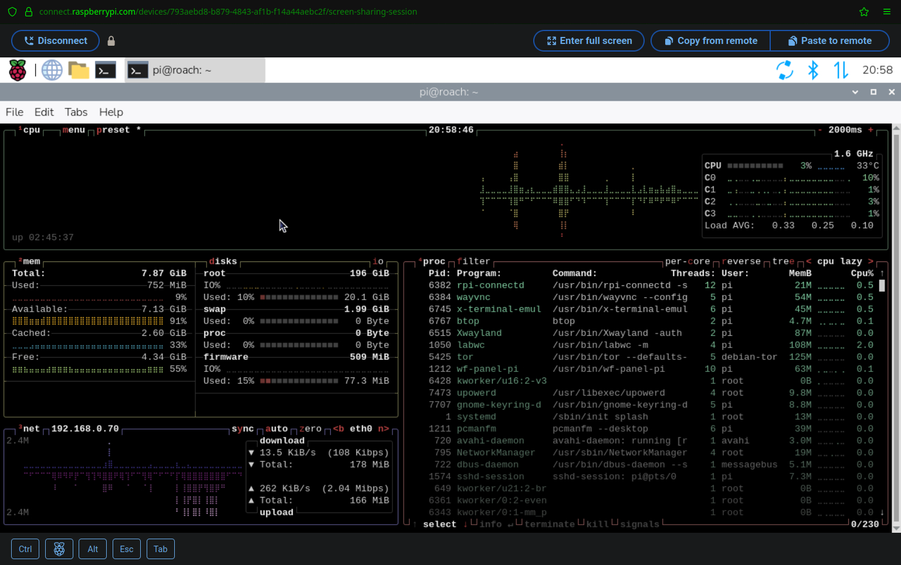

As a certain season approaches, I embarked in a little side quest: to setup a Raspberry
Pi 5 for a good bro who is learning to code and wants to learn more about Linux as well.
Since his goal is learning to code rather than (I hope) getting lost down the infinite
rabbit holes of tinkering with the OS and tools, I set this up so he doesn't have to,
but otherwise left it basic and uncomplicated.

<!-- more -->

## Hardware

As this setup has been working quite well for [Alfred](../posts/2025-02-22-home-assistant-on-kubernetes-on-raspberry-pi-5-alfred.md),
the hardware chosen is a the same except for the case, due to short-term availability:

*  [Raspberry Pi 5 8GB](https://www.raspberrypi.com/products/raspberry-pi-5/)
*  [Samsung 990 EVO Plus (2000 GB, M.2 2280)](https://www.samsung.com/ch/memory-storage/nvme-ssd/990-evo-plus-2tb-nvme-pcie-gen-4-mz-v9s2t0bw/)
*  [Argon NEO 5 M.2 NVME PCIE Case for Raspberry Pi 5](https://argon40.com/products/argon-neo-5-m-2-nvme-for-raspberry-pi-5)
*  [Raspberry Pi Official 5 power supply, 27W USB-C](https://www.raspberrypi.com/products/27w-power-supply/)

Argon cases with NVMe extensions are tricky to assemble, one has to follow instructions
carefully and make sure the PCIe cable is connected the right way and fully connected.
This case actually came with two PCIe cables and a couple of spare screws, which is nice.

See also this
[In-Depth Review Raspberry Pi 5 Argon NEO 5 Case](https://www.cytron.io/tutorial/in-depth-review-raspberry-pi-5-argon-neo-5-case).

## Install to NVMe SSD

To install Raspberry Pi Os directly on the NVMe drive, it goes first into an
[ICY BOX IB-1817M-C31 USB 3.1 NVMe enclosure](https://icybox.de/product/externe_speicherloesungen/IB-1817M-C31),
so the installation can be done on the SSD directl instead of using an Micro SD card.

*Only the best for my bro*, so I installed **Raspberry Pi OS Full** which is
*a port of Debian Trixie with desktop environment and recommended applications*
and came out only last month (Release date: 1 Oct 2025).

!!! tip
    **Always** download Raspberry Pi OS images from the official
    [Raspberry Pi OS downloads](https://www.raspberrypi.com/software/operating-systems/)
    **and check** its SHA256 against the profided integrity hash.

Using `rpi-imager` there is no need to even download images manually, the tool does it
automatically once the Raspberry Pi model (*device*) and OS version is chosen. The tool
also allows setting a few basic parameter such as the password, WiFi network, etc.


Once the installation is done, the original partitions are replaced with just two
(`bootfs`, `rootfs`):

``` dmesg
[104897.486810]  sdf: sdf1 sdf2
```

??? note "GPT would be necessary only if the disk is larger than 2TB."

    [Booting Pi from NVME greater than 2TB (GPT as opposed to MBR)](https://www.reddit.com/r/raspberry_pi/comments/19e0x42/booting_pi_from_nvme_greater_than_2tb_gpt_as/)
    includes manual instructions to install Raspberry Pi OS on a 4TB NVME using
    a GPT table. If you image a disk which is larger than 2TB with the
    Raspberry Pi tools or images, your disk will be limited to 2TB because they
    use MBR (Master Boot Record) instead of GPT (GUID partition table).

### Custom partitions

It always felt odd, if not wrong, to run a Raspberry Pi with a large SSD disk without
having most of the space allocated to a separate partition (e.g. `/home`), so I took
the liberty of resizing the `rootfs` partition to mount most of the 2TB disk as `/home`.

!!! note

    This may not be entirely useful when it comes to reinstalling the OS, since tools
    like `rpi-imager` will anyway wipe the entire device regardless of partitions, and
    in all honesty I am yet to reinstall the OS in any of my devices.

This involved deleting the root partitiona and then recreating it with a different size,
to then create a new primary partition taking the rest of the disk.

For reference, see also:

*  [Resizing a Partition with fdisk](https://docs.redhat.com/en/documentation/red_hat_enterprise_linux/7/html/storage_administration_guide/s2-disk-storage-parted-resize-part)
*  [How to Shrink an ext2/3/4 File system with resize2fs](https://access.redhat.com/articles/1196333)

Since the disk has old-fashined MBR partitions, `fdisk` can be used. Note that this
is done while the SSD is not yet installed in the Raspberry Pi, but on the USB adapter.

The starting point is that `rpi-imager` has created only a 512MB boot partition and a
8.5GB root partition:

``` console hl_lines="19"
# fdisk /dev/sdf 

Welcome to fdisk (util-linux 2.39.3).
Changes will remain in memory only, until you decide to write them.
Be careful before using the write command.


Command (m for help): p
Disk /dev/sdf: 1.82 TiB, 2000398934016 bytes, 3907029168 sectors
Disk model: SSD 990 EVO     
Units: sectors of 1 * 512 = 512 bytes
Sector size (logical/physical): 512 bytes / 4096 bytes
I/O size (minimum/optimal): 4096 bytes / 4096 bytes
Disklabel type: dos
Disk identifier: 0x796ebf23

Device     Boot   Start      End  Sectors  Size Id Type
/dev/sdf1         16384  1064959  1048576  512M  c W95 FAT32 (LBA)
/dev/sdf2       1064960 18792447 17727488  8.5G 83 Linux

Command (m for help): q
```

There is a small empty space before the first partition, which requires a bit of
*maneuviring around*. Attempting to create new partitions with default values will
first create a tiny 7MB partition at the start of the disk:

``` console hl_lines="1 7 8 10 12 19 20 22 36 37 41"
Command (m for help): n
Partition type
   p   primary (2 primary, 0 extended, 2 free)
   e   extended (container for logical partitions)
Select (default p): p
Partition number (3,4, default 3): 
First sector (2048-3907029167, default 2048): 
Last sector, +/-sectors or +/-size{K,M,G,T,P} (2048-16383, default 16383): 

Created a new partition 3 of type 'Linux' and of size 7 MiB.

Command (m for help): n
Partition type
   p   primary (3 primary, 0 extended, 1 free)
   e   extended (container for logical partitions)
Select (default e): p

Selected partition 4
First sector (18792448-3907029167, default 18792448): 
Last sector, +/-sectors or +/-size{K,M,G,T,P} (18792448-3907029167, default 3907029167): 

Created a new partition 4 of type 'Linux' and of size 1.8 TiB.

Command (m for help): p
Disk /dev/sdf: 1.82 TiB, 2000398934016 bytes, 3907029168 sectors
Disk model: SSD 990 EVO     
Units: sectors of 1 * 512 = 512 bytes
Sector size (logical/physical): 512 bytes / 4096 bytes
I/O size (minimum/optimal): 4096 bytes / 4096 bytes
Disklabel type: dos
Disk identifier: 0x796ebf23

Device     Boot    Start        End    Sectors  Size Id Type
/dev/sdf1          16384    1064959    1048576  512M  c W95 FAT32 (LBA)
/dev/sdf2        1064960   18792447   17727488  8.5G 83 Linux
/dev/sdf3           2048      16383      14336    7M 83 Linux
/dev/sdf4       18792448 3907029167 3888236720  1.8T 83 Linux

Partition table entries are not in disk order.

Command (m for help): q
```

To make things more interesting, consider that a root partition of 8.5 GB may not be
enough. Despite having all user data in another patition, there are scenarios where a
lot more than 10 GB of space is needed for system files, e.g. the
[Kubernetes cluster in `octavo`](../posts/2025-04-12-kubernetes-homelab-server-with-ubuntu-server-24-04-octavo.md)
has 45GB under `/var/lib/containerd`. In case this Raspberry Pi may developt such needs,
the root partition is **resized** to a generous 200MB; this involves the *nerve-racking*
operation of deleting that partition, to the re-created **starting on the same sector**:

1.  Start from the original 2 partitions; delete partitons 3 and 4 is previously created.
2.  Create partitioan 3 (7MB) to fill the odd gap at the stat of the disk.
3.  Delete partition 2 (root).
4.  Create new partition 2 **starting on the same sector** (1064960, which should be the
    default, thanks to partition 3 filling the gap) with the desired size (e.g. `+200G`).
    **Do not delete the `ext4` signature**.
5.  Create new partition 4 taking the rest of the space (default start and end).
6.  Delete partition 3; probably not necessary, just to reduce visual clutter.
7.  Write changes to the partition table, once 

``` console hl_lines="18 19 22 31 34-37 40 46-52 55 62-65 79 81 86-89 103 104 107-110"
# fdisk /dev/sdf 

Welcome to fdisk (util-linux 2.39.3).
Changes will remain in memory only, until you decide to write them.
Be careful before using the write command.


Command (m for help): p
Disk /dev/sdf: 1.82 TiB, 2000398934016 bytes, 3907029168 sectors
Disk model: SSD 990 EVO     
Units: sectors of 1 * 512 = 512 bytes
Sector size (logical/physical): 512 bytes / 4096 bytes
I/O size (minimum/optimal): 4096 bytes / 4096 bytes
Disklabel type: dos
Disk identifier: 0x796ebf23

Device     Boot   Start      End  Sectors  Size Id Type
/dev/sdf1         16384  1064959  1048576  512M  c W95 FAT32 (LBA)
/dev/sdf2       1064960 18792447 17727488  8.5G 83 Linux


Command (m for help): n
Partition type
   p   primary (2 primary, 0 extended, 2 free)
   e   extended (container for logical partitions)
Select (default p): p
Partition number (3,4, default 3): 
First sector (2048-3907029167, default 2048): 
Last sector, +/-sectors or +/-size{K,M,G,T,P} (2048-16383, default 16383): 

Created a new partition 3 of type 'Linux' and of size 7 MiB.


Command (m for help): d
Partition number (1-3, default 3): 2

Partition 2 has been deleted.


Command (m for help): n
Partition type
   p   primary (2 primary, 0 extended, 2 free)
   e   extended (container for logical partitions)
Select (default p): p
Partition number (2,4, default 2): 
First sector (1064960-3907029167, default 1064960): 
Last sector, +/-sectors or +/-size{K,M,G,T,P} (1064960-3907029167, default 3907029167): +200G

Created a new partition 2 of type 'Linux' and of size 200 GiB.
Partition #2 contains a ext4 signature.

Do you want to remove the signature? [Y]es/[N]o: n


Command (m for help): n
Partition type
   p   primary (3 primary, 0 extended, 1 free)
   e   extended (container for logical partitions)
Select (default e): p

Selected partition 4
First sector (420495360-3907029167, default 420495360): 
Last sector, +/-sectors or +/-size{K,M,G,T,P} (420495360-3907029167, default 3907029167): 

Created a new partition 4 of type 'Linux' and of size 1.6 TiB.


Command (m for help): p
Disk /dev/sdf: 1.82 TiB, 2000398934016 bytes, 3907029168 sectors
Disk model: SSD 990 EVO     
Units: sectors of 1 * 512 = 512 bytes
Sector size (logical/physical): 512 bytes / 4096 bytes
I/O size (minimum/optimal): 4096 bytes / 4096 bytes
Disklabel type: dos
Disk identifier: 0x796ebf23

Device     Boot     Start        End    Sectors  Size Id Type
/dev/sdf1           16384    1064959    1048576  512M  c W95 FAT32 (LBA)
/dev/sdf2         1064960  420495359  419430400  200G 83 Linux
/dev/sdf3            2048      16383      14336    7M 83 Linux
/dev/sdf4       420495360 3907029167 3486533808  1.6T 83 Linux

Partition table entries are not in disk order.


Command (m for help): d
Partition number (1-4, default 4): 3

Partition 3 has been deleted.


Command (m for help): p
Disk /dev/sdf: 1.82 TiB, 2000398934016 bytes, 3907029168 sectors
Disk model: SSD 990 EVO     
Units: sectors of 1 * 512 = 512 bytes
Sector size (logical/physical): 512 bytes / 4096 bytes
I/O size (minimum/optimal): 4096 bytes / 4096 bytes
Disklabel type: dos
Disk identifier: 0x796ebf23

Device     Boot     Start        End    Sectors  Size Id Type
/dev/sdf1           16384    1064959    1048576  512M  c W95 FAT32 (LBA)
/dev/sdf2         1064960  420495359  419430400  200G 83 Linux
/dev/sdf4       420495360 3907029167 3486533808  1.6T 83 Linux


Command (m for help): w
The partition table has been altered.
Calling ioctl() to re-read partition table.
Syncing disks.
```

One the root partition has the desired size, it is possible to resize the Ext4
**file system** in it; but *first* one has to run a file system check:

``` console hl_lines="1 3 5 14"
# resize2fs /dev/sdf2 200G
resize2fs 1.47.0 (5-Feb-2023)
Please run 'e2fsck -f /dev/sdf2' first.

# e2fsck -f /dev/sdf2
e2fsck 1.47.0 (5-Feb-2023)
Pass 1: Checking inodes, blocks, and sizes
Pass 2: Checking directory structure
Pass 3: Checking directory connectivity
Pass 4: Checking reference counts
Pass 5: Checking group summary information
rootfs: 183284/554880 files (0.1% non-contiguous), 1954143/2215936 blocks

# resize2fs /dev/sdf2 200G
resize2fs 1.47.0 (5-Feb-2023)
Resizing the filesystem on /dev/sdf2 to 52428800 (4k) blocks.
The filesystem on /dev/sdf2 is now 52428800 (4k) blocks long.

# e2fsck /dev/sdf2
e2fsck 1.47.0 (5-Feb-2023)
rootfs: clean, 183284/13056000 files, 2741779/52428800 blocks
# mkfs.ex /dev/sdf4
mkfs.exfat  mkfs.ext2   mkfs.ext3   mkfs.ext4   
# mkfs.ext4 /dev/sdf4
mke2fs 1.47.0 (5-Feb-2023)
Creating filesystem with 435816726 4k blocks and 108961792 inodes
Filesystem UUID: 95b56139-4931-4dac-ab92-859e0d576453
Superblock backups stored on blocks: 
        32768, 98304, 163840, 229376, 294912, 819200, 884736, 1605632, 2654208, 
        4096000, 7962624, 11239424, 20480000, 23887872, 71663616, 78675968, 
        102400000, 214990848

Allocating group tables: done                            
Writing inode tables: done                            
Creating journal (262144 blocks): done
Writing superblocks and filesystem accounting information: done       
```

At this point the resized file system can be mounted, which will come in handy later.

``` console
# mount /dev/sdf2 /mnt
# ls /mnt/
bin  boot  dev  etc  home  lib  lost+found  media  mnt  opt  proc  root  run  sbin  srv  sys  tmp  usr  var
# ls /mnt/home/
pi  rpi-first-boot-wizard
```

### Pre-boot tweaks

The following adjustments can be make by editing files in the boot partition (`sdf1`)
**before** booting the Raspberry Pi OS for the first time; mount it under `/mnt/boot`
once the root file system is mounted on `/mnt`.

``` console
# mount /dev/sdf1 /mnt/boot
```

!!! note

    This partition will be mounted as `/boot/firmware` **after** booting the Raspberry
    Pi OS for the first time.

#### PCIe Gen 3

[NVMe SSD boot with the Raspberry Pi 5](https://www.jeffgeerling.com/blog/2023/nvme-ssd-boot-raspberry-pi-5), at least with this Argon ONE case, turned out to
be easy. When using a HAT+-compliant NVMe adapter, there is no need to enable
the external PCIe port, it will be enabled automatically, but it is useful to
*force PCIe Gen 3 speeds* using these options in `/mnt/boot/config.txt`

``` ini
[all]
dtparam=pciex1
dtparam=pciex1_gen=3
```

#### Enable CGroups

[Troubleshooting Bootstrap](../posts/2025-02-22-home-assistant-on-kubernetes-on-raspberry-pi-5-alfred.md#troubleshooting-bootstrap)
for Kubernetes on the previous Raspberry Pi OS revealed that the required CGroups
are not enabled by default. Since these may be needed by popular development tools,
e.g. to run in Docker, enable these in `/mnt/boot/cmdline.txt`

```
cgroup_enable=cpuset cgroup_memory=1 cgroup_enable=memory console=serial0,115200 console=tty1 root=PARTUUID=796ebf23-02 rootfstype=ext4 fsck.repair=yes rootwait resize quiet splash plymouth.ignore-serial-consoles cfg80211.ieee80211_regdom=CH systemd.run=/boot/firstrun.sh systemd.run_success_action=reboot systemd.unit=kernel-command-line.target
```

## System Configuration

### WiFi (re)configuration

[Just as it happened with Alfred](../posts/2025-02-22-home-assistant-on-kubernetes-on-raspberry-pi-5-alfred.md#wifi-reconfiguration),
the WiFi connection was not established even though the system booted just fine the
first time. Instead of going through the menus with `raspi-config`, access via SSH was
gained by connecting the device to the LAN, which naturally worked like a charm:

``` console
pi@roach:~ $ ip a
1: lo: <LOOPBACK,UP,LOWER_UP> mtu 65536 qdisc noqueue state UNKNOWN group default qlen 1000
    link/loopback 00:00:00:00:00:00 brd 00:00:00:00:00:00
    inet 127.0.0.1/8 scope host lo
       valid_lft forever preferred_lft forever
    inet6 ::1/128 scope host noprefixroute 
       valid_lft forever preferred_lft forever
2: eth0: <BROADCAST,MULTICAST,UP,LOWER_UP> mtu 1500 qdisc fq_codel state UP group default qlen 1000
    link/ether 88:a2:9e:10:1b:5d brd ff:ff:ff:ff:ff:ff
    inet 192.168.0.70/24 brd 192.168.0.255 scope global dynamic noprefixroute eth0
       valid_lft 86268sec preferred_lft 86268sec
    inet6 fe80::6e5d:6e2d:f3cf:d040/64 scope link noprefixroute 
       valid_lft forever preferred_lft forever
3: wlan0: <NO-CARRIER,BROADCAST,MULTICAST,UP> mtu 1500 qdisc fq_codel state DOWN group default qlen 1000
    link/ether 88:a2:9e:10:1b:5e brd ff:ff:ff:ff:ff:ff
```

#### Additional WiFi networks

[How to add a second WiFi network to your Raspberry Pi (updated for OS Bookworm)](https://www.thedigitalpictureframe.com/how-to-add-a-second-wifi-network-to-your-raspberry-pi/)
explains how the wpa_supplicant.conf file is no longer used to configure Wi-Fi
connections and, instead, the current Raspberry Pi OS (based on Bookworm) uses
NetworkManager to manage network connections, including Wi-Fi.

There is a separate configuration file for each WiFi connection under
`/etc/NetworkManager/system-connections`, all it takes to configure additional
WiFi connections is to

1. Copy a working file with a new name (e.g. the SSID name).
1. Replace the SSID and password.
1. Replace the `id` with a new unique value of choice.
1. Replace the `uuid` with a new unique value from running `uuid`.
1. Set the permissions to `600`

This can be done in advance of replacing WiFi access points, etc.

WiFi connections are not effective *immediately* after rebooting, but after a couple of
minutes there is a new IP address assigned to the wireless device (`wlan0`):

``` console
pi@roach:~ $ ip a
1: lo: <LOOPBACK,UP,LOWER_UP> mtu 65536 qdisc noqueue state UNKNOWN group default qlen 1000
    link/loopback 00:00:00:00:00:00 brd 00:00:00:00:00:00
    inet 127.0.0.1/8 scope host lo
       valid_lft forever preferred_lft forever
    inet6 ::1/128 scope host noprefixroute 
       valid_lft forever preferred_lft forever
2: eth0: <BROADCAST,MULTICAST,UP,LOWER_UP> mtu 1500 qdisc fq_codel state UP group default qlen 1000
    link/ether 88:a2:9e:10:1b:5d brd ff:ff:ff:ff:ff:ff
    inet 192.168.0.70/24 brd 192.168.0.255 scope global dynamic noprefixroute eth0
       valid_lft 79805sec preferred_lft 79805sec
    inet6 fe80::6e5d:6e2d:f3cf:d040/64 scope link noprefixroute 
       valid_lft forever preferred_lft forever
3: wlan0: <BROADCAST,MULTICAST,UP,LOWER_UP> mtu 1500 qdisc fq_codel state UP group default qlen 1000
    link/ether 88:a2:9e:10:1b:5e brd ff:ff:ff:ff:ff:ff
    inet 192.168.0.71/24 brd 192.168.0.255 scope global dynamic noprefixroute wlan0
       valid_lft 84609sec preferred_lft 84609sec
    inet6 fe80::8194:2d69:f7fb:c23e/64 scope link noprefixroute 
       valid_lft forever preferred_lft forever
```

At this point the wired connecion to the LAN network can be removed.

### Disable power save for WiFi

Raspberry Pi enables power save on WiFi by default:

``` dmesg
[    5.598286] brcmfmac: F1 signature read @0x18000000=0x15264345
[    5.600446] brcmfmac: brcmf_fw_alloc_request: using brcm/brcmfmac43455-sdio for chip BCM4345/6
[    5.600754] usbcore: registered new interface driver brcmfmac
[    5.790052] brcmfmac: brcmf_c_process_txcap_blob: no txcap_blob available (err=-2)
[    5.790325] brcmfmac: brcmf_c_preinit_dcmds: Firmware: BCM4345/6 wl0: Aug 29 2023 01:47:08 version 7.45.265 (28bca26 CY) FWID 01-b677b91b
[    6.423812] brcmfmac: brcmf_cfg80211_set_power_mgmt: power save enabled
```

This can lead to losing connectivity in certain conditions, so disable power
save of WiFi to avoid having to deal with such problems like
[Reconnect on WiFi drop](https://forums.raspberrypi.com/viewtopic.php?f=91&t=16054).

``` console
$ sudo /sbin/iw dev wlan0 set power_save off
```

``` dmesg
[ 1767.061929] brcmfmac: brcmf_cfg80211_set_power_mgmt: power save disabled
```

### Fix locales

The above looks like rpi-imager took my PC’s locale settings:

``` console
-bash: warning: setlocale: LC_ALL: cannot change locale (en_US.UTF-8)
```

The solution is to generate `en_US.UTF-8` and set it as the system default. To do this,
run `raspi-config` and go into `5. Localisation Options` then `L1 Locale`, enable
`en_US.UTF-8` and set it as the `Default locale for the system environment`.

``` console
$ sudo raspi-config
...
Generating locales (this might take a while)...
  en_GB.UTF-8... done
  en_US.UTF-8... done
Generation complete.
```

### To Swap Or Not To Swap

With 8 GB of RAM there should be no reason to need disk swap, never mind that it
would be rather fast in this system. Besides, Kubernetes *doesn't like swap* and
similar issues may be encountered by other tools. On the other hand, running a
desktop environment and compilers could lead to actually neededing swap.

Therefore, instead of directly disabling swap entirely, lets leave its default setup.

Debian 13 (Trixie), on which Raspberry Pi OS is based, introduced a different mechanism
for enabling and disabling the swap file. View which swap units are running:

``` console
pi@roach:~ $ systemctl list-units --quiet --type=swap
  dev-zram0.swap loaded active active rpi-swap managed swap device (zram+file)
```

The default configuration is to automatically create swap when needed. To entirely
disable it, create `/etc/rpi/swap.conf.d/99-disable-swap.conf` with the contents:

``` ini
[Main]
Mechanism=none
```

Then stop the running swap unit:

``` console
pi@roach:~ $ sudo systemctl daemon-reload
pi@roach:~ $ systemctl list-units --quiet --type=swap
  dev-zram0.swap loaded active active Compressed Swap on /dev/zram0
pi@roach:~ $ sudo systemctl stop dev-zram0.swap
pi@roach:~ $ systemctl list-units --quiet --type=swap
```

But for now, let leave it at its default configuration. 

### Install latest updates

Before moving forward, make sure the system is up-to-date:

``` console
pi@roach:~ $ sudo apt update
Hit:1 http://deb.debian.org/debian trixie InRelease
Hit:2 http://deb.debian.org/debian trixie-updates InRelease
Hit:3 http://archive.raspberrypi.com/debian trixie InRelease
Hit:4 http://deb.debian.org/debian-security trixie-security InRelease
129 packages can be upgraded. Run 'apt list --upgradable' to see them.

$ sudo apt full-upgrade -y
Upgrading:                      
  agnostics         libssl3t64               raspi-utils          rpicam-apps-opencv-postprocess
  bluez-firmware    libswresample5           raspi-utils-core     rpicam-apps-preview
  chromium          libswscale8              raspi-utils-dt       rpinters
  chromium-common   libtiff6                 raspi-utils-eeprom   userconf-pi
  chromium-l10n     libvlc-bin               raspi-utils-otp      vlc
  chromium-sandbox  libvlc5                  raspinfo             vlc-bin
  ffmpeg            libvlccore9              rasputin             vlc-data
  firefox           lpplug-bluetooth         rc-gui               vlc-l10n
  ghostscript       lpplug-clock             rp-bookshelf         vlc-plugin-access-extra
  gui-pkinst        lpplug-ejecter           rp-prefapps          vlc-plugin-base
  gui-updater       lpplug-menu              rpcc                 vlc-plugin-notify
  libavcodec61      lpplug-netman            rpd-applications     vlc-plugin-qt
  libavdevice61     lpplug-power             rpd-common           vlc-plugin-samba
  libavfilter10     lpplug-updater           rpd-developer        vlc-plugin-skins2
  libavformat61     lpplug-volumepulse       rpd-graphics         vlc-plugin-video-output
  libavutil59       lxpanel-pi               rpd-preferences      vlc-plugin-video-splitter
  libcamera-ipa     mesa-libgallium          rpd-theme            vlc-plugin-visualization
  libcamera-tools   mesa-vulkan-drivers      rpd-utilities        wayvnc
  libcamera-v4l2    openjdk-21-jre           rpd-wayland-core     wf-panel-pi
  libcamera0.5      openjdk-21-jre-headless  rpd-wayland-extras   wfplug-bluetooth
  libdtovl0         openssl                  rpd-x-core           wfplug-clock
  libegl-mesa0      openssl-provider-legacy  rpd-x-extras         wfplug-connect
  libgbm1           pipanel                  rpi-chromium-mods    wfplug-ejecter
  libgl1-mesa-dri   piwiz                    rpi-connect          wfplug-menu
  libglx-mesa0      pplug-ejecter-data       rpi-eeprom           wfplug-netman
  libgpiolib0       pplug-netman-schema      rpi-firefox-mods     wfplug-power
  libgs-common      pplug-power-data         rpi-loop-utils       wfplug-updater
  libgs10           pplug-updater-data       rpi-swap             wfplug-volumepulse
  libgs10-common    pprompt                  rpi-userguide        xserver-common
  libpisp-common    python3-libcamera        rpicam-apps          xserver-xorg-core
  libpisp1          raindrop                 rpicam-apps-core
  libpostproc58     raspberrypi-sys-mods     rpicam-apps-encoder
  librpicam-app1    raspi-config             rpicam-apps-lite

Installing dependencies:
  alacarte  gir1.2-gmenu-3.0  gnome-menus  libgnome-menu-3-0  qt6ct

Summary:
  Upgrading: 129, Installing: 5, Removing: 0, Not Upgrading: 0
  Download size: 463 MB
  Space needed: 27.6 MB / 191 GB available
```

### Update EEPROM

Then again, before moving forward, and especially because it was necessary to fix a
[Failed Argon installation on Alfred](../posts/2025-02-22-home-assistant-on-kubernetes-on-raspberry-pi-5-alfred.md#failed-argon-installation),
[use `raspi-config` to update the bootloader](https://www.raspberrypi.com/documentation/computers/raspberry-pi.html#raspi-config)
and set it to `Latest` (**without resetting config**). This updated the EEPROM from a
May release to a November release, less than a week old:

``` console
pi@roach:~ $ sudo rpi-eeprom-update -l
/usr/lib/firmware/raspberrypi/bootloader-2712/default/pieeprom-2025-05-08.bin
pi@roach:~ $ ls -l /usr/lib/firmware/raspberrypi/bootloader-2712/default/
total 2152
-rw-r--r-- 1 root root 2097152 Nov  6 13:30 pieeprom-2025-05-08.bin
-rw-r--r-- 1 root root  102992 Nov  6 13:30 recovery.bin
pi@roach:~ $ sudo raspi-config
pi@roach:~ $ sudo rpi-eeprom-update -l
/usr/lib/firmware/raspberrypi/bootloader-2712/latest/pieeprom-2025-11-05.bin
```

**Reboot** after updating the EEPROM; and *definitely* **before moving forward**.

### Argon case scripts

The instructions in page 10 of the
[Argon NEO 5 M.2 NVME PCIE case manual](https://cdn.shopify.com/s/files/1/0556/1660/2177/files/FOR_WEB_INSTRUCTION_MANUAL_NEO_5_M.2_NVMe_20240909.pdf?v=1725870016)
to install the scripts for FAN control seem simple enough:


??? terminal "`curl https://download.argon40.com/argon-eeprom.sh | bash`"

    ``` console
    pi@roach:~ $ curl https://download.argon40.com/argon-eeprom.sh | bash
    % Total    % Received % Xferd  Average Speed   Time    Time     Time  Current
                                    Dload  Upload   Total   Spent    Left  Speed
    100  1059  100  1059    0     0  16607      0 --:--:-- --:--:-- --:--:-- 16809
    *************
    Argon Setup  
    *************
    Hit:1 http://deb.debian.org/debian trixie InRelease
    Get:2 http://deb.debian.org/debian trixie-updates InRelease [47.3 kB]
    Hit:3 http://archive.raspberrypi.com/debian trixie InRelease
    Hit:4 http://deb.debian.org/debian-security trixie-security InRelease
    Fetched 47.3 kB in 0s (485 kB/s)
    Reading package lists... Done
    Reading package lists... Done
    Building dependency tree... Done
    Reading state information... Done
    Calculating upgrade... Done
    0 upgraded, 0 newly installed, 0 to remove and 0 not upgraded.
    BOOTLOADER: up to date
      CURRENT: Wed Nov  5 05:37:18 PM UTC 2025 (1762364238)
      LATEST: Wed Nov  5 05:37:18 PM UTC 2025 (1762364238)
      RELEASE: latest (/usr/lib/firmware/raspberrypi/bootloader-2712/latest)
                Use raspi-config to change the release.
    Updating bootloader EEPROM
    image: /usr/lib/firmware/raspberrypi/bootloader-2712/latest/pieeprom-2025-11-05.bin
    config_src: blconfig device
    config: /tmp/tmp43cskz0p/boot.conf
    ################################################################################
    [all]
    WAKE_ON_GPIO=0
    POWER_OFF_ON_HALT=1
    PCIE_PROBE=1
    BOOT_UART=1
    BOOT_ORDER=0xf416
    NET_INSTALL_AT_POWER_ON=1

    ################################################################################

    *** To cancel this update run 'sudo rpi-eeprom-update -r' ***

    *** CREATED UPDATE /tmp/tmp43cskz0p/pieeprom.upd  ***

      CURRENT: Wed Nov  5 05:37:18 PM UTC 2025 (1762364238)
      UPDATE: Wed Nov  5 05:37:18 PM UTC 2025 (1762364238)
      BOOTFS: /boot/firmware
    '/tmp/tmp.rxzVUvjeh8' -> '/boot/firmware/pieeprom.upd'

    UPDATING bootloader. This could take up to a minute. Please wait

    *** Do not disconnect the power until the update is complete ***

    If a problem occurs then the Raspberry Pi Imager may be used to create
    a bootloader rescue SD card image which restores the default bootloader image.

    flashrom -p linux_spi:dev=/dev/spidev10.0,spispeed=16000 -w /boot/firmware/pieeprom.upd
    Verifying update
    VERIFY: SUCCESS
    UPDATE SUCCESSFUL
    ```

After a **required reboot**, run the `argonneo5.sh` script too:

??? terminal "`curl https://download.argon40.com/argonneo5.sh | bash`"

    ``` console
    pi@roach:~ $ curl https://download.argon40.com/argonneo5.sh | bash
      % Total    % Received % Xferd  Average Speed   Time    Time     Time  Current
                                    Dload  Upload   Total   Spent    Left  Speed
    100  2171  100  2171    0     0  46338      0 --:--:-- --:--:-- --:--:-- 47195
    *************
    Argon Setup  
    *************
    Hit:1 http://deb.debian.org/debian trixie InRelease
    Hit:2 http://archive.raspberrypi.com/debian trixie InRelease
    Hit:3 http://deb.debian.org/debian trixie-updates InRelease
    Hit:4 http://deb.debian.org/debian-security trixie-security InRelease
    Reading package lists... Done
    Reading package lists... Done
    Building dependency tree... Done
    Reading state information... Done
    Calculating upgrade... Done
    0 upgraded, 0 newly installed, 0 to remove and 0 not upgraded.
    BOOTLOADER: up to date
      CURRENT: Wed Nov  5 05:37:18 PM UTC 2025 (1762364238)
        LATEST: Wed Nov  5 05:37:18 PM UTC 2025 (1762364238)
      RELEASE: latest (/usr/lib/firmware/raspberrypi/bootloader-2712/latest)
                Use raspi-config to change the release.
    EEPROM settings up to date
    *********************
      Setup Completed 
    *********************

    Please reboot for changes to take effect
    ```

After *another* **required reboot**, the firware is ready and there is nothing to do.

## Essential Software

### Basic packages

Before moving forward, I like to install a few basics that make work easier,
or on which subsequent packages depend:

``` console
$ sudo apt install -y bc git iotop-c netcat-openbsd rename speedtest-cli sysstat \
  vim python3-pip python3-influxdb python3-numpy python3-absl python3-unidecode
```

### Fail2Ban

Just in case this system ever gets its port 22 exposed to the Internet,
[Fail2Ban](https://github.com/fail2ban/fail2ban?tab=readme-ov-file#fail2ban-ban-hosts-that-cause-multiple-authentication-errors)
scans log files and bans IP addresses conducting too many failed login attempts.
It is a rather basic protection mechanism, and this system is not intended to
have its SSH port open to the Internet, but it is so easy to install and enable
that there is no excuse not to.

``` console
$ sudo apt-get install iptables fail2ban -y
$ sudo systemctl enable --now fail2ban
```

The configuration in `/etc/fail2ban/jail.conf` can be spiced up to make a
little more trigger-happy:

``` ini
# "bantime" is the number of seconds that a host is banned.
bantime  = 12h
# A host is banned if it has generated "maxretry" during the last "findtime"
# seconds.
findtime  = 90m
# "maxretry" is the number of failures before a host get banned.
maxretry = 3
# "bantime.increment" allows to use database for searching of previously banned ip's to increase a 
# default ban time using special formula, default it is banTime * 1, 2, 4, 8, 16, 32...
bantime.increment = true
```

Then restart the service to pick the changes up:

``` console
$ sudo systemctl restart fail2ban
```

### SSH Server

As a general good practice, even if this system won't have its SSH port open to the
Internet, *and on top* of having [Fail2ban](#fail2ban) enabled, SSH authetication should
be allowed **only** with
[What is SSH Public Key Authentication?](https://www.ssh.com/academy/ssh/public-key-authentication).
Once the system arrives as it final destination, its final owner should add their own
public keys are added to `/home/pi/.ssh/authorized_keys` and disable password
authentication by setting `PasswordAuthentication no` in `/etc/ssh/sshd_config`.

This tutorial explains several concrete methods to the this on different platforms:
[Set up SSH public key authentication to connect to a remote system](https://servicenow.iu.edu/kb?id=kb_article_view&sysparm_article=KB0023919).


## Additional Software

### Additional Debian packages

The following packages are installed based on experience setting up desktop environments
in other PCs, most recently **Ubuntu Studio 24.04**
[for myself](./2024-11-03-ubuntu-studio-24-04-on-rapture-gaming-pc-and-more.md) and
[a young artist](./2024-09-14-ubuntu-studio-24-04-on-computer-for-a-young-artist.md).

``` console
$ sudo apt install -y gkrellm gkrellm-cpufreq geeqie id3v2 btop sox exiv2 rename \
  scrot python3-pip python3-selenium tor unrar ttf-mscorefonts-installer ffmpeg \
  iotop-c xdotool redshift-gtk inxi screen code
```

### Visual Studio Code
    
Installing the `code` package is the canonical method to install
[VS Code on Raspberry Pi](https://code.visualstudio.com/docs/setup/raspberry-pi).

VS Code is not officially supported on Raspberry Pi, so it pays to keep an eye on their
[community discussions](https://github.com/microsoft/vscode-discussions/discussions/2379)
for update and known issues and workarounds. One notorious known issue has been freezes
on Raspberry Pi 4, for which the workaround is to disable use of the GPU by adding this
flag in `/home/pi/.vscode/argv.json`

``` json hl_lines="2"
{
  "disable-hardware-acceleration": true
}
```

This workaround may not be necessay for the more recent versions of VS Code, and the
version installed at the time of writting is **1.105.1**.

## Raspberry Pi Connect

[Raspberry Pi Connect](https://www.raspberrypi.com/documentation/services/connect.html)
provides secure access to your Raspberry Pi from anywhere in the world. While it is
unsurprisingly a little laggy, it works well enough to use the desktop environment from
any web browser anywhere without a complicated setup.

Following the instructions is simple and quick enough to access the desktop environment
within a couple of minutes, it can be enabled *and disabled* any time through SSH and it
can also be added to (and remove from) a Raspberry Pi Connect account very easily.

To connect, start the `rpi-connect` service and create a URL to sing in, then visit
that URL with the browser with an active session on <https://connect.raspberrypi.com/>

``` console
pi@roach:~ $ rpi-connect on
✓ Raspberry Pi Connect started
pi@roach:~ $ rpi-connect signin
Complete sign in by visiting https://connect.raspberrypi.com/verify/XEKA-TPFN

✓ Signed in
```

Once the device is signed in, it shows up at <https://connect.raspberrypi.com/devices>
and it's just two clicks to open the desktop environment in a new browser window:




Once this access is no longer necessary, the service can be disabled on the Raspberry Pi
by simply running `rpi-connect off` and running `rpi-connect signout` before will
deassociated from the previously used Raspberry Pi Connect account.

``` console
pi@roach:~ $ rpi-connect signout
✓ Signed out
pi@roach:~ $ rpi-connect off
✓ Raspberry Pi Connect stopped
```
