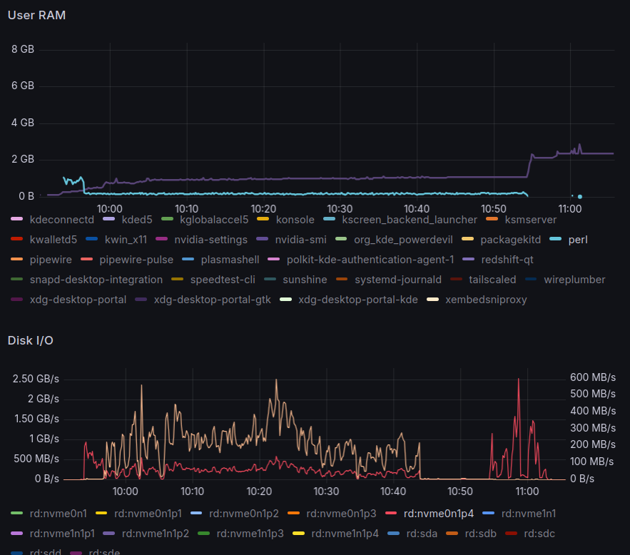

[Fotocx](https://kornelix.net/fotocx/fotocx.html) is a *free* Linux program for editing
photos or other images and managing a large collection. It is meant to manage very large
photo collections of *up to 1 million images on a strong PC*, meaning a computer with
4+ CPU cores and 16+ GB memory. Rapture should be quite strong enough, with 8 CPU cores
(16 threads) and 32 GB of RAM.

Ubuntu 24.04 responsitories include an older version of this application, formerly named
[foto**x**x](https://www.geeksforgeeks.org/installation-guide/how-to-install-fotoxx-on-ubuntu/),
but the application is quite easy to build from source to run the latest version.

<!-- more -->

## Installation

The source code of Fotocx is not hosted on GitHub or similar; instead,
it is distributed through the developer's website via
[tarball downloads](https://kornelix.net/downloads/downloads.html).
The source code can be browsed online in the Fossies archive at 
<https://fossies.org/linux/misc/fotocx-25.5-source.tar.gz/>

### Build Dependencies

Several libraries are required to build Fotocx that may not be already installed:

??? terminal "`apt install build-essential pkg-config libgtk-3-dev libjpeg-dev libtiff-dev liblcms2-dev libchamplain-0.12-dev libgtk-3-dev libchamplain-gtk-0.12-dev libclutter-gtk-1.0-dev`"

    ``` console
    # apt install liblcms2-dev libchamplain-0.12-dev libclutter-gtk-1.0-dev libchamplain-gtk-0.12-dev
    Reading package lists... Done
    Building dependency tree... Done
    Reading state information... Done
    The following additional packages will be installed:
      gir1.2-champlain-0.12 gir1.2-clutter-1.0 gir1.2-cogl-1.0 gir1.2-coglpango-1.0 gir1.2-gtkclutter-1.0
      gir1.2-json-1.0 libchamplain-0.12-0 libclutter-1.0-0 libclutter-1.0-common libclutter-1.0-dev
      libclutter-gtk-1.0-0 libcogl-common libcogl-dev libcogl-pango-dev libcogl-pango20 libcogl-path-dev
      libcogl-path20 libcogl20 libdrm-dev libevdev-dev libgbm-dev libgudev-1.0-dev libinput-dev libjson-glib-dev
      libmtdev-dev libnghttp2-dev libpciaccess-dev libpsl-dev libsoup-3.0-dev libsqlite3-dev
      libsysprof-capture-4-dev libudev-dev libwacom-dev
    Suggested packages:
      libchamplain-doc libclutter-1.0-doc libclutter-gtk-1.0-doc libcogl-doc libevdev-doc libjson-glib-doc
      libnghttp2-doc libsoup-3.0-doc sqlite3-doc
    The following NEW packages will be installed:
      gir1.2-champlain-0.12 gir1.2-clutter-1.0 gir1.2-cogl-1.0 gir1.2-coglpango-1.0 gir1.2-gtkclutter-1.0
      gir1.2-json-1.0 libchamplain-0.12-0 libchamplain-0.12-dev libclutter-1.0-0 libclutter-1.0-common
      libclutter-1.0-dev libclutter-gtk-1.0-0 libclutter-gtk-1.0-dev libcogl-common libcogl-dev libcogl-pango-dev
      libcogl-pango20 libcogl-path-dev libcogl-path20 libcogl20 libdrm-dev libevdev-dev libgbm-dev
      libgudev-1.0-dev libinput-dev libjson-glib-dev liblcms2-dev libmtdev-dev libnghttp2-dev libpciaccess-dev
      libpsl-dev libsoup-3.0-dev libsqlite3-dev libsysprof-capture-4-dev libudev-dev libwacom-dev
      gir1.2-gtkchamplain-0.12 libchamplain-gtk-0.12-0 libchamplain-gtk-0.12-dev
    0 upgraded, 36 newly installed, 0 to remove and 0 not upgraded.
    ```

Building and installing Fotocx is then very easy and fast:

??? terminal "`make && make install`"

    ```console
    $ wget https://kornelix.net/downloads/downloads/fotocx-25.5-source.tar.gz
    $ tar xfz fotocx-25.5-source.tar.gz
    $ cd fotocx/
    $ make
    g++ fotocx.cc -fpermissive -Wno-write-strings  -Wno-deprecated-declarations  -Wno-class-memaccess  -fno-omit-frame-pointer  -Wall -g2 -rdynamic -O2 -Wno-format-truncation -Wno-stringop-truncation  -c `pkg-config --cflags gtk+-3.0 --cflags champlain-gtk-0.12` -o fotocx.o \

    g++ f.widgets.cc -fpermissive -Wno-write-strings  -Wno-deprecated-declarations  -Wno-class-memaccess  -fno-omit-frame-pointer  -Wall -g2 -rdynamic -O2 -Wno-format-truncation -Wno-stringop-truncation  -c `pkg-config --cflags gtk+-3.0 --cflags champlain-gtk-0.12` \

    g++ f.file.cc -fpermissive -Wno-write-strings  -Wno-deprecated-declarations  -Wno-class-memaccess  -fno-omit-frame-pointer  -Wall -g2 -rdynamic -O2 -Wno-format-truncation -Wno-stringop-truncation  -c `pkg-config --cflags gtk+-3.0 --cflags champlain-gtk-0.12` \

    g++ f.gallery.cc -fpermissive -Wno-write-strings  -Wno-deprecated-declarations  -Wno-class-memaccess  -fno-omit-frame-pointer  -Wall -g2 -rdynamic -O2 -Wno-format-truncation -Wno-stringop-truncation  -c `pkg-config --cflags gtk+-3.0 --cflags champlain-gtk-0.12` \

    g++ f.albums.cc -fpermissive -Wno-write-strings  -Wno-deprecated-declarations  -Wno-class-memaccess  -fno-omit-frame-pointer  -Wall -g2 -rdynamic -O2 -Wno-format-truncation -Wno-stringop-truncation  -c `pkg-config --cflags gtk+-3.0 --cflags champlain-gtk-0.12` \

    g++ f.select.cc -fpermissive -Wno-write-strings  -Wno-deprecated-declarations  -Wno-class-memaccess  -fno-omit-frame-pointer  -Wall -g2 -rdynamic -O2 -Wno-format-truncation -Wno-stringop-truncation  -c `pkg-config --cflags gtk+-3.0 --cflags champlain-gtk-0.12` \

    g++ f.meta.cc -fpermissive -Wno-write-strings  -Wno-deprecated-declarations  -Wno-class-memaccess  -fno-omit-frame-pointer  -Wall -g2 -rdynamic -O2 -Wno-format-truncation -Wno-stringop-truncation  -c `pkg-config --cflags gtk+-3.0 --cflags champlain-gtk-0.12` \

    g++ f.edit.cc -fpermissive -Wno-write-strings  -Wno-deprecated-declarations  -Wno-class-memaccess  -fno-omit-frame-pointer  -Wall -g2 -rdynamic -O2 -Wno-format-truncation -Wno-stringop-truncation  -c `pkg-config --cflags gtk+-3.0 --cflags champlain-gtk-0.12` \

    g++ f.repair.cc -fpermissive -Wno-write-strings  -Wno-deprecated-declarations  -Wno-class-memaccess  -fno-omit-frame-pointer  -Wall -g2 -rdynamic -O2 -Wno-format-truncation -Wno-stringop-truncation  -c `pkg-config --cflags gtk+-3.0 --cflags champlain-gtk-0.12` \

    g++ f.refine.cc -fpermissive -Wno-write-strings  -Wno-deprecated-declarations  -Wno-class-memaccess  -fno-omit-frame-pointer  -Wall -g2 -rdynamic -O2 -Wno-format-truncation -Wno-stringop-truncation  -c `pkg-config --cflags gtk+-3.0 --cflags champlain-gtk-0.12` \

    g++ f.effects.cc -fpermissive -Wno-write-strings  -Wno-deprecated-declarations  -Wno-class-memaccess  -fno-omit-frame-pointer  -Wall -g2 -rdynamic -O2 -Wno-format-truncation -Wno-stringop-truncation  -c `pkg-config --cflags gtk+-3.0 --cflags champlain-gtk-0.12` \

    g++ f.warp.cc -fpermissive -Wno-write-strings  -Wno-deprecated-declarations  -Wno-class-memaccess  -fno-omit-frame-pointer  -Wall -g2 -rdynamic -O2 -Wno-format-truncation -Wno-stringop-truncation  -c `pkg-config --cflags gtk+-3.0 --cflags champlain-gtk-0.12` \

    g++ f.combine.cc -fpermissive -Wno-write-strings  -Wno-deprecated-declarations  -Wno-class-memaccess  -fno-omit-frame-pointer  -Wall -g2 -rdynamic -O2 -Wno-format-truncation -Wno-stringop-truncation  -c `pkg-config --cflags gtk+-3.0 --cflags champlain-gtk-0.12` \

    g++ f.mashup.cc -fpermissive -Wno-write-strings  -Wno-deprecated-declarations  -Wno-class-memaccess  -fno-omit-frame-pointer  -Wall -g2 -rdynamic -O2 -Wno-format-truncation -Wno-stringop-truncation  -c `pkg-config --cflags gtk+-3.0 --cflags champlain-gtk-0.12` \

    g++ f.tools.cc -fpermissive -Wno-write-strings  -Wno-deprecated-declarations  -Wno-class-memaccess  -fno-omit-frame-pointer  -Wall -g2 -rdynamic -O2 -Wno-format-truncation -Wno-stringop-truncation  -c `pkg-config --cflags gtk+-3.0 --cflags champlain-gtk-0.12` \

    g++ f.batch.cc -fpermissive -Wno-write-strings  -Wno-deprecated-declarations  -Wno-class-memaccess  -fno-omit-frame-pointer  -Wall -g2 -rdynamic -O2 -Wno-format-truncation -Wno-stringop-truncation  -c `pkg-config --cflags gtk+-3.0 --cflags champlain-gtk-0.12` \

    g++ f.pixmap.cc -fpermissive -Wno-write-strings  -Wno-deprecated-declarations  -Wno-class-memaccess  -fno-omit-frame-pointer  -Wall -g2 -rdynamic -O2 -Wno-format-truncation -Wno-stringop-truncation  -c `pkg-config --cflags gtk+-3.0 --cflags champlain-gtk-0.12` \

    g++ zfuncs.cc -fpermissive -Wno-write-strings  -Wno-deprecated-declarations  -Wno-class-memaccess  -fno-omit-frame-pointer  -Wall -g2 -rdynamic -O2 -Wno-format-truncation -Wno-stringop-truncation  -c `pkg-config --cflags gtk+-3.0 --cflags champlain-gtk-0.12` \

    g++  fotocx.o f.widgets.o f.file.o f.gallery.o f.albums.o f.select.o f.meta.o f.edit.o f.repair.o f.refine.o f.effects.o f.warp.o f.combine.o f.mashup.o f.tools.o f.batch.o f.pixmap.o zfuncs.o `pkg-config --libs gtk+-3.0` -lrt -lpthread -ltiff -lpng -ljpeg -lclutter-1.0 -lclutter-gtk-1.0 -lchamplain-0.12 -lchamplain-gtk-0.12 -o fotocx \

    # make install
    rm -f     /usr/local/bin/fotocx*
    rm -f     /usr/local/share/applications/fotocx*
    rm -f -R  /usr/local/share/doc/fotocx
    rm -f     /usr/local/share/man/man1/fotocx*
    rm -f -R  /usr/local/share/fotocx
    rm -f     /usr/local/share/icons/fotocx*
    rm -f     /usr/local/share/metainfo/kornelix.fotocx*
    mkdir -p  /usr/local/bin
    mkdir -p  /usr/local/share/applications
    mkdir -p  /usr/local/share/doc/fotocx
    mkdir -p  /usr/local/share/man/man1
    mkdir -p  /usr/local/share/fotocx
    mkdir -p  /usr/local/share/icons
    mkdir -p  /usr/local/share/metainfo
    cp -f fotocx /usr/local/bin
    cp -f fotocx.desktop /usr/local/share/applications
    cp -f -R  doc/* /usr/local/share/doc/fotocx
    gzip -fk -9 man/fotocx.man
    mv -f man/fotocx.man.gz /usr/local/share/man/man1/fotocx.1.gz
    cp -f -R  data /usr/local/share/fotocx
    cp -f -R  images /usr/local/share/fotocx
    cp -f fotocx.png /usr/local/share/icons
    cp -f metainfo/* /usr/local/share/metainfo
    ```

### Runtime Dependencies

Fotocx requires several packages to run, while others are recommended.
If any of the required packages are missing it will report these and refuse to run:

```
program            purpose          REQ   AVAIL   package (debian) 
exiftool           metadata         yes   yes     libimage-exiftool-perl 
dcraw              RAW files        yes   no      dcraw 
addr2line          crash report     yes   yes     binutils 
ffmpeg             video files      no    yes     ffmpeg 
djxl               .jxl files       no    no      libjxl-tools 
dwebp              .webp files      no    no      webp 
heif-convert       .heic files      no    no      libheif-examples 
heif-convert       .avif files      no    no      libheif-examples 
opj_decompress     .jp2 files       no    no      libopenjp2-tools 
vlc                video play       no    yes     vlc 

Install following programs using your package manager: 
dcraw              RAW files        yes   no      dcraw 
```

For future convenience, install all missing packages:

??? terminal "`apt install dcraw libjxl-tools webp libheif-examples libheif-examples libopenjp2-tools vlc`"

    ```console
    # apt install dcraw libjxl-tools webp libheif-examples libheif-examples libopenjp2-tools vlc
    Reading package lists... Done
    Building dependency tree... Done
    Reading state information... Done
    Suggested packages:
      gphoto2
    The following NEW packages will be installed:
      dcraw libheif-examples libjxl-tools libopenjp2-tools libtcmalloc-minimal4t64 webp
    0 upgraded, 6 newly installed, 0 to remove and 0 not upgraded.
    ```

## Configuration

### Index

When starting Fotocx for the first time, it presents a choice between building the index
immediately or deferring it. If the index build is deferred, the application can be used
but it will be slow and batch functions will not be available. Not intended to use the
application right away, chose to build the index immediately.

This operation, executed by `fotocx` and `perl`, was mostly CPU-bound, indexing photos
out of a PCI v4 NVMe SSD, took 69 minutes for 130,999 files, including 118,641 photos,
9,670 RAW files and 2,688 videos, creating 58,983 titles and descriptions and 130,753
thumbnails, and producing a large number of warnings and errors about invalid files
(e.g. `Unexpected end of file`).

```
index updates: 130999  title/desc updates: 58983 
thumbnail updates: 130999, deletes: 0 
writing updated image index file 
all image files, including unmounted folders: 130999 
after removal of missing and blacklisted: 130999 
Image files: 118641 (285.6 GB) + RAW files: 9670 (124.0 GB) + Video files: 2688 
thumbnails found: 130341 
image files: 130999  index level: 2 
index completed, 4163.2 seconds 

Fblock(0) 
save_params()
start gallery: /home/ponder 
start file: (null) 
startup time: 4267.6 secs.
```




### Tutorial

Once the indexing process finished, the UI defaults the **Gallery** to the `$HOME` folder,
even though that is not where the photos are. Use the **TOP** button (left of **@**) to
select the correct folder.

For all this application may be praised in terms of performance, the UI is far from modern
or intuitve. To get through the steep learning curve, the author provides several videos
on [their YouTube channel](https://www.youtube.com/@kornelix/videos); one should start by
watching the **Fotocx Demo and Tutorial**:

<iframe
  width="800"
  height="450"
  src="https://www.youtube.com/embed/F5Kwnr4TrwM"
  title="YouTube video player"
  frameborder="0"
  allow="accelerometer; autoplay; clipboard-write; encrypted-media; gyroscope; picture-in-picture; web-share"
  referrerpolicy="strict-origin-when-cross-origin"
  allowfullscreen></iframe>
