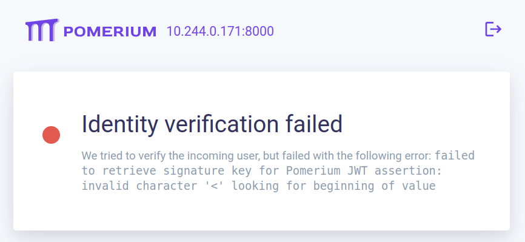
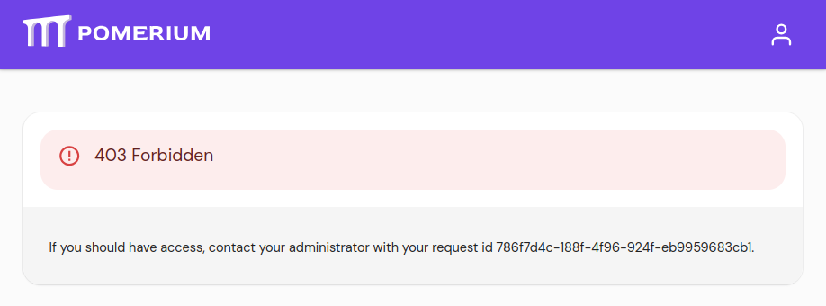

The community
[Ingress-NGINX controller](https://github.com/kubernetes/ingress-nginx?tab=readme-ov-file#ingress-nginx-controller)
is scheduled for
[retirement in March 2026](https://kubernetes.io/blog/2025/11/11/ingress-nginx-retirement/),
so the time comes near to replace it with either a compatible Ingress-NGINX controller or
migrate to the new Gateway API. Given the relatively short migration timeline, the former
promises the least friction and complexity for self-hosted, single-node clusters.

The clusters (`octavo` and `alfred`) are currently running Kubernetes version 1.32 which
is will be the next one up to go
[End Of Life in Feb 28, 2026](https://kubernetes.io/releases/patch-releases/#non-active-branch-history/#1-32).
Updating the cluster to Kubernetes version 1.34 would first require updating
Ingress-NGINX to version 1.14 according to its
[Supported Versions table](https://github.com/kubernetes/ingress-nginx?tab=readme-ov-file#supported-versions-table).

Instead, it is possible to replace Ingress-NGINX entirely with
[**Pomerium**](https://www.pomerium.com/),
which serves as a direct, secure-by-default alternative that combines standard reverse
proxy functionality with integrated Zero Trust identity verification.

<!-- more -->

## Installation

Helm installation of Pomerium is no longer recommended for new deployments, instead use
[Manifests based deployment](https://www.pomerium.com/docs/k8s/quickstart)
(using Kustomize) which ensures the most current Zero Trust architecture is used. This
natively handles WebSockets and media streaming without the limitations found in standard
NGINX setups.

### Prerequisites

Besides Kubernetes v1.19.0 or higher, 
[Pomerium Prerequisites](https://www.pomerium.com/docs/deploy/k8s/quickstart#prerequisites)
recomends **a domain space** and **TLS certificates**. Since the cluster is already
running cert-manager v1.17.2 and every subdomain of `very-very-dark-gray.top` is already
pointing to the public IP address, it is **not** necessary and *generally discouraged* to
use `mkcert` to create locally trusted certificates.

### Deploy `ingress-controller`

The official documentation recommends to install
[Install Pomerium](https://www.pomerium.com/docs/deploy/k8s/quickstart#install-pomerium)
by deploying the (Kustomize-based) manifests directly from their GitHub repository:

``` console
$ kubectl apply -k github.com/pomerium/ingress-controller/config/default\?ref=v0.31.0
```

To later make modifications to the deployment (add [Pebble storage](#pebble-storage) for
persistance) the repository can be cloned locally and pinned to the
[latest state release](https://github.com/pomerium/ingress-controller/releases):

``` console
$ cd ~/src
$ git clone https://github.com/pomerium/ingress-controller.git
$ cd ingress-controller/
$ git checkout v0.31.3
```

Deploy Pomerium using its default configuration to start with:

``` console
$ cd config/default/
$ kubectl apply -k .
# Warning: 'commonLabels' is deprecated. Please use 'labels' instead. Run 'kustomize edit fix' to update your Kustomization automatically.
namespace/pomerium created
customresourcedefinition.apiextensions.k8s.io/policyfilters.gateway.pomerium.io created
customresourcedefinition.apiextensions.k8s.io/pomerium.ingress.pomerium.io created
serviceaccount/pomerium-controller created
serviceaccount/pomerium-gen-secrets created
clusterrole.rbac.authorization.k8s.io/pomerium-controller created
clusterrole.rbac.authorization.k8s.io/pomerium-gen-secrets created
clusterrolebinding.rbac.authorization.k8s.io/pomerium-controller created
clusterrolebinding.rbac.authorization.k8s.io/pomerium-gen-secrets created
service/pomerium-metrics created
service/pomerium-proxy created
deployment.apps/pomerium created
job.batch/pomerium-gen-secrets created
ingressclass.networking.k8s.io/pomerium created
```

Pomerium pod is running but not yet ready; it appears to be unhealthy:

```
$ kubectl get pods -n pomerium
NAME                         READY   STATUS      RESTARTS   AGE
pomerium-75d45cf7f8-c9tlx    0/1     Running     0          4m28s
pomerium-gen-secrets-8sx7m   0/1     Completed   0          4m28s

$ kubectl describe pod pomerium-75d45cf7f8-c9tlx -n pomerium | tail

Events:
  Type     Reason     Age                  From               Message
  ----     ------     ----                 ----               -------
  Normal   Scheduled  4m2s                 default-scheduler  Successfully assigned pomerium/pomerium-75d45cf7f8-c9tlx to octavo
  Normal   Pulling    4m2s                 kubelet            Pulling image "pomerium/ingress-controller:v0.31.3"
  Normal   Pulled     3m57s                kubelet            Successfully pulled image "pomerium/ingress-controller:v0.31.3" in 5.39s (5.39s including waiting). Image size: 101804642 bytes.
  Normal   Created    3m57s                kubelet            Created container: pomerium
  Normal   Started    3m57s                kubelet            Started container pomerium
  Warning  Unhealthy  2s (x16 over 3m47s)  kubelet            Startup probe failed: Get "http://10.244.0.167:28080/startupz": dial tcp 10.244.0.167:28080: connect: connection refused
```

This `connection refused` on port **28080** during the startup probe indicates the
Pomerium Ingress Controller is waiting for its mandatory global configuration before it
starts its health check listeners. The Pomerium Ingress Controller is designed to fail
its health probes until it has a valid [**Pomerium CRD**](#pomerium-crd) applied, which
is not ready yet.

Until then, the controller is running in a loop waiting for the global settings that
define its Identity Provider and internal secrets.

#### Pebble Storage

[System requirements](https://www.pomerium.com/docs/deploy/k8s/install#system-requirements)
for Pomerium include *PostgreSQL 11 or higher*, but this is not necessary for a
single-node cluster. Instead, a self-healing file-based databroker that embeds Pebble
(the storage engine behind CockroachDB) can be used to provide persistence across
restarts without the complexity of managing a full PostgreSQL instance.

Using a Manifest-based deployment, the standard Deployment can be modified into a
StatefulSet to attach a `PersistentVolume` to the Pomerium Databroker. As has been done
for previous deployments, the `PersistentVolume` will be using a `hostPath` pointing to a
local directory owned by the user `pomerium` runs as (65532 as revealed by
`ps aux | grep -i pomerium`).

Create the local directory with the appropriate permissions: 

``` console
# mkdir -p /home/k8s/pomerium/data
# chown -R 65532:65532 /home/k8s/pomerium/
# chmod -R 750 /home/k8s/pomerium/
# ls -laR /home/k8s/pomerium/
/home/k8s/pomerium:
total 0
drwxr-x--- 1 65532 root    8 Dec 18 23:06 .
drwxr-xr-x 1 root  root  478 Dec 18 23:06 ..
drwxr-x--- 1 65532 65532   0 Dec 18 23:06 data

/home/k8s/pomerium/data:
total 0
drwxr-x--- 1 65532 65532 0 Dec 18 23:06 .
drwxr-x--- 1 65532 root  8 Dec 18 23:06 ..
```

Create the Local Storage manifests and `kustomization.yaml` in a new `pomerium-overlay`
directory and patch the Deployment to mount the volume:

???+ k8s "`pomerium-overlay/pomerium-storage.yaml`"

    ``` yaml linenums="1" hl_lines="13"
    apiVersion: v1
    kind: PersistentVolume
    metadata:
      name: pomerium-pv-data
    spec:
      storageClassName: manual
      capacity:
        storage: 2Gi
      accessModes:
        - ReadWriteOnce
      persistentVolumeReclaimPolicy: Retain
      hostPath:
        path: /home/k8s/pomerium/data
    ---
    apiVersion: v1
    kind: PersistentVolumeClaim
    metadata:
      name: pomerium-pvc-data
      namespace: pomerium
    spec:
      storageClassName: manual
      volumeName: pomerium-pv-data
      accessModes:
        - ReadWriteOnce
      resources:
        requests:
          storage: 2Gi
    ```

???+ k8s "`pomerium-overlay/kustomization.yaml`"

    ``` yaml linenums="1" hl_lines="5 14-17 19-23 25-27 29-34"
    apiVersion: kustomize.config.k8s.io/v1beta1
    kind: Kustomization

    resources:
      - ../../../ingress-controller/config/default
      - pomerium-storage.yaml

    patches:
      - target:
          kind: Deployment
          name: pomerium
        patch: |-
          - op: add
            path: /spec/template/spec/containers/0/volumeMounts/-
            value:
              name: pomerium-data
              mountPath: /data
          - op: add
            path: /spec/template/spec/volumes/-
            value: 
              name: pomerium-data
              persistentVolumeClaim:
                claimName: pomerium-pvc-data
          - op: replace
            path: /spec/strategy
            value:
              type: Recreate  # Terminates old pods before starting new ones
          - op: add
            path: /spec/template/spec/containers/0/lifecycle
            value:
              preStop:
                exec:
                  # Gives the process 5 seconds to flush Pebble logs and release locks
                  command: ["/bin/sh", "-c", "sleep 5"]
    ```

    To avoid file lock conflicts in the Pebble database across pods, lines 25-27 set the
    `Recreate` strategy so that the running pod are shut down before starting a new one.
    Otherwise, Kubernetes defaults to a `RollingUpdate` strategy which starts a new pod
    before the old one is terminated, leading to a deadlock situation where the old pod
    still has the lock on the database, which keeps the new pod stuck as  `ContainersNotReady`.
    
    Lines 29-34 force graceful shutdown to let the old pod flush Pebble logs
    and release locks.

There are two different checks to make before applying this deployment:

1.  Run `kubectl kustomize pomerium-overlay` to inspect that the generated deployment
    manifest does replace the correct values.

    !!! tip

        This step is particularly useful to confirm the right amount of `../` has been
        added in front of `ingress-controller/config/default` depending on where files
        are.

1.  Run `kubectl apply -k pomerium-overlay --dry-run=client` to verify that `kubectl`
    finds no errors in the generated manifest.

Once the above manifests are confirmed valid, patch the deployment with it:

``` console hl_lines="13-15"
$ kubectl apply -k pomerium-overlay 
namespace/pomerium unchanged
customresourcedefinition.apiextensions.k8s.io/policyfilters.gateway.pomerium.io unchanged
customresourcedefinition.apiextensions.k8s.io/pomerium.ingress.pomerium.io unchanged
serviceaccount/pomerium-controller unchanged
serviceaccount/pomerium-gen-secrets unchanged
clusterrole.rbac.authorization.k8s.io/pomerium-controller unchanged
clusterrole.rbac.authorization.k8s.io/pomerium-gen-secrets unchanged
clusterrolebinding.rbac.authorization.k8s.io/pomerium-controller unchanged
clusterrolebinding.rbac.authorization.k8s.io/pomerium-gen-secrets unchanged
service/pomerium-metrics unchanged
service/pomerium-proxy unchanged
persistentvolume/pomerium-pv-data created
persistentvolumeclaim/pomerium-pvc-data created
deployment.apps/pomerium configured
job.batch/pomerium-gen-secrets unchanged
ingressclass.networking.k8s.io/pomerium unchanged
```

## Global Pomerium Settings

### Pomerium CRD

Define the global settings in `pomerium-settings.yaml`, with `spec.storage.file.path`
pointing to storage defined above (`/data/databroker`) and `spec.authenticate.url`
pointing to the cluster's real domain to use the self-hosted identity-aware proxy,
instead of the domain <https://authenticate.pomerium.app> which is the endpoint for
[Pomerium Zero](https://www.pomerium.com/zero) (their SaaS control plane):

???+ k8s "`pomerium-settings.yaml`"

    ``` yaml linenums="1" hl_lines="9 12"
    apiVersion: ingress.pomerium.io/v1
    kind: Pomerium
    metadata:
      name: global
      namespace: pomerium
    spec:
      secrets: pomerium/bootstrap
      authenticate:
        url: https://authenticate.very-very-dark-gray.top:8443
      storage:
        file:
          path: /data/databroker
    ```

!!! note "Using a non-standard port like 8443 mostly works, if port 443 is taken."

Applying the settings does not restart the `pomerium` pods, but it is now `READY`:

``` console
$ kubectl apply -f pomerium-settings.yaml
pomerium.ingress.pomerium.io/global created

$ kubectl get pods -n pomerium
NAME                         READY   STATUS      RESTARTS      AGE
pomerium-58bdd56668-6p5q5    1/1     Running     2 (16m ago)   36m
pomerium-gen-secrets-8sx7m   0/1     Completed   0             163m
```

The Pomerium Proxy service is now running in the cluster:

``` console
$ kubectl describe pomerium
Name:         global
Namespace:    
Labels:       <none>
Annotations:  <none>
API Version:  ingress.pomerium.io/v1
Kind:         Pomerium
Metadata:
  Creation Timestamp:  2025-12-18T23:53:05Z
  Generation:          1
  Resource Version:    51753377
  UID:                 288ab14d-3cdc-490c-9650-cd09a463a72b
Spec:
  Authenticate:
    URL:    https://authenticate.very-very-dark-gray.top
  Secrets:  pomerium/bootstrap
  Storage:
    File:
      Path:  /data/databroker
Status:
  Settings Status:
    Observed At:          2025-12-18T23:53:06Z
    Observed Generation:  1
    Reconciled:           true
Events:
  Type     Reason      Age   From                                     Message
  ----     ------      ----  ----                                     -------
  Normal   Updated     17s   bootstrap pod/pomerium-58bdd56668-6p5q5  config updated
```

The `connection refused` on port **28080** errors are still present in the `Events`
section, but they are now only old entries, and no more errors have been produced in
the last **6 minutes**:

``` console
$ kubectl describe pod pomerium-58bdd56668-6p5q5 -n pomerium | tail

Events:
  Type     Reason     Age                  From               Message
  ----     ------     ----                 ----               -------
  Normal   Scheduled  31m                  default-scheduler  Successfully assigned pomerium/pomerium-58bdd56668-6p5q5 to octavo
  Normal   Pulled     11m (x3 over 43m)    kubelet            Container image "pomerium/ingress-controller:v0.31.3" already present on machine
  Normal   Created    11m (x3 over 43m)    kubelet            Created container: pomerium
  Normal   Started    11m (x3 over 43m)    kubelet            Started container pomerium
  Normal   Killing    11m (x2 over 33m)    kubelet            Container pomerium failed startup probe, will be restarted
  Warning  Unhealthy   6m (x102 over 43m)  kubelet            Startup probe failed: Get "http://10.244.0.169:28080/startupz": dial tcp 10.244.0.169:28080: connect: connection refused
```

### Certifiate for the auth endpoint

Without a dedicated certificate for the `authenticate.very-very-dark-gray.top` domain,
users will see a security error when redirected here from other subdomains, because
Pomerium’s Authenticate service is a separate internal "virtual route" that requires its
own certificate to be explicitly defined in your global settings.

Generate a separate certificate for the authenticate domain and link it to the Pomerium
global configuration CRD. First, create the certificate from `auth-certificate.yaml`

???+ k8s "`auth-certificate.yaml`"

    ``` yaml linenums="1" hl_lines="11-13"
    apiVersion: cert-manager.io/v1
    kind: Certificate
    metadata:
      name: pomerium-auth-cert
      namespace: pomerium
    spec:
      secretName: pomerium-auth-tls
      issuerRef:
        name: letsencrypt-prod
        kind: ClusterIssuer
      commonName: authenticate.very-very-dark-gray.top
      dnsNames:
        - authenticate.very-very-dark-gray.top
    ```

Apply this manifest to crete the certificate:

``` console
$ kubectl apply -f auth-certificate.yaml
```

Wait for it to show `READY: True` via `kubectl get certificate -n pomerium` and then
link the Certificate to Pomerium Settings by updating the Pomerium CRD to reference it:


???+ k8s "`pomerium-settings.yaml`"

    ``` yaml linenums="1" hl_lines="10-11"
    apiVersion: ingress.pomerium.io/v1
    kind: Pomerium
    metadata:
      name: global
      namespace: pomerium
    spec:
      secrets: pomerium/bootstrap
      authenticate:
        url: https://authenticate.very-very-dark-gray.top:8443
      certificates:
        - pomerium/pomerium-auth-tls
      storage:
        file:
          path: /data/databroker
    ```

And apply the updated settings: 

``` console
kubectl apply -f pomerium-settings.yaml
pomerium.ingress.pomerium.io/global configured
```

### Identity Provider (IdP)

Before configuring the Ingress, store credentials for the chosen provider. In this case,
start with Google to authenticate @gmail.com users,
[create an OAuth 2.0 Client ID for Web Server Applications](https://developers.google.com/identity/protocols/oauth2/web-server#creatingcred),
obtain the client ID and secret from and store them in `google-idp-secret.yaml`:

???+ k8s "`google-idp-secret.yaml`"

    ``` yaml linenums="1" hl_lines="8-9"
    apiVersion: v1
    kind: Secret
    metadata:
      name: idp-secret
      namespace: pomerium
    type: Opaque
    stringData:
      client_id: "your-google-client-id.apps.googleusercontent.com"
      client_secret: "GOCSPX-your-google-client-secret"
    ```

!!! note

    In the Google Cloud Console, the OAuth consent screen should be set to **External**
    ([**Google Auth Platform > Audience**](https://console.cloud.google.com/auth/audience?project=very-very-dark-gray))
    when using standard @gmail.com accounts. While the app status is **Testing** there is
    a 7-day token expiration and a 100-user limit. To increase or remove those limits,
    **Publish app** in the Console, although this is only necessary when requesting
    [sensitive scopes beyond name, email address, and user profile](https://support.google.com/cloud/answer/15549945#publishing-status-testing&zippy=%2Ctesting%2Cin-production%2Cexternal%2Cinternal).    

Configure Pomerium to recognize Google as the provider and set a generous 30-day
expiration for sessions:

???+ k8s "`pomerium-settings.yaml`"

    ``` yaml linenums="1" hl_lines="7-8 14-16"
    apiVersion: ingress.pomerium.io/v1
    kind: Pomerium
    metadata:
      name: global
      namespace: pomerium
    spec:
      cookie:
        expire: 720h
      secrets: pomerium/bootstrap
      authenticate:
        url: https://authenticate.very-very-dark-gray.top:8443
      certificates:
        - pomerium/pomerium-auth-tls
      identityProvider:
        provider: google
        secret: pomerium/idp-secret
      storage:
        file:
          path: /data/databroker
    ```

Apply the above in this order, so the secret is available for Pomerium:

``` console
$ kubectl apply -f google-idp-secret.yaml
secret/idp-secret created

$ kubectl apply -f pomerium-settings.yaml
pomerium.ingress.pomerium.io/global configured
```

## Test with Verify

To verify that the authentication and authorization flow works, use Pomerium's
[Test Service](https://www.pomerium.com/docs/deploy/k8s/quickstart#test-service)
with an initial policy to allow only uses with @gmail.com addresses:

??? k8s "`verify-service.yaml`"

    ``` yaml linenums="1" hl_lines="49-53"
    apiVersion: v1
    kind: Service
    metadata:
      namespace: pomerium
      name: verify
      labels:
        app: verify
        service: verify
    spec:
      ports:
        - port: 8000
          targetPort: 8000
          name: http
      selector:
        app: pomerium-verify
    ---
    apiVersion: apps/v1
    kind: Deployment
    metadata:
      namespace: pomerium
      name: verify
    spec:
      replicas: 1
      selector:
        matchLabels:
          app: pomerium-verify
      template:
        metadata:
          labels:
            app: pomerium-verify
        spec:
          containers:
            - image: docker.io/pomerium/verify
              imagePullPolicy: IfNotPresent
              name: httpbin
              ports:
                - containerPort: 8000
                  protocol: TCP
                  name: http
    ---
    apiVersion: networking.k8s.io/v1
    kind: Ingress
    metadata:
      namespace: pomerium
      name: verify
      annotations:
        cert-manager.io/cluster-issuer: letsencrypt-prod
        ingress.pomerium.io/pass_identity_headers: true
        ingress.pomerium.io/policy: |
          - allow:
              or:
                - email:
                    ends_with: "@gmail.com"
    spec:
      ingressClassName: pomerium
      rules:
        - host: 'verify.very-very-dark-gray.top'
          http:
            paths:
              - pathType: Prefix
                path: /
                backend:
                  service:
                    name: verify
                    port:
                      number: 8000
      tls:
        - secretName: tls-secret-verify
          hosts:
            - verify.very-very-dark-gray.top
    ```

!!! note

    The `ingress.pomerium.io/allowed_domains` annotation and domain-based policies like
    `'domain: is: gmail.com'` fail with @gmail.com users because Pomerium's domain check
    looks for an OIDC claim called **hd** (Hosted Domain) and @gmail.com accounts do not
    have an hd claim, this is only present for Google Workspace/Enterprise accounts.

Apply this manifest to start the verify service:

``` console
$ kubectl apply -f verify-service.yaml
service/verify created
deployment.apps/verify created
ingress.networking.k8s.io/verify created
```

Visiting <https://verify.very-very-dark-gray.top:8443> now redirects to the Google login
page, which redirects back to the application after the user logs in and agrees to
disclose their identity to the application. When the user is authenticated with an email
address that ends with `@gmail.com` the application grants access, although it shows an
*Identity verification failed* due to other issues:


??? note "about **Identity verification failed** error page."

    When accessing Pomerium through a non-standard HTTPS port (e.g. 8443), this page
    shows an "Identity verification failed" error:

    

    This is because the app is unable to fetch the JWKS file due to the application
    assuming it must be reachable on the standard HTTPS port 443. The file is available
    on port 8443 and this can be verified using `wget` from inside the `verify` pod:

    ``` console
    $ kubectl exec -it deployment/verify -n pomerium -- wget -qO- \
      https://authenticate.very-very-dark-gray.top:8443/.well-known/pomerium/jwks.json
    wget: note: TLS certificate validation not implemented
    {"keys":[{"use":"sig","kty":"EC","kid":"...","crv":"P-256","alg":"ES256","x":"...","y":"..."}]
    ```

If the user is denied access, e.g. logged in with an email address on a different domain,
then the result is a clear *403 Forbidden* page:



## Additional Settings

To replace the existing Nginx-based `Ingress` for currently running applications,
additional settings are necessary for specific purposes.

### Access Control for Users

To restrict access to a concrete list of users by their email address, replace the above
`allow` with a list of `'email: is: user@gmail.com'` conditions under the `or` condition:

``` yaml hl_lines="9-15"
apiVersion: networking.k8s.io/v1
kind: Ingress
metadata:
  name: audiobookshelf-ingress
  namespace: audiobookshelf
  annotations:
    cert-manager.io/cluster-issuer: letsencrypt-prod
    ingress.pomerium.io/pass_identity_headers: true
    ingress.pomerium.io/policy: |
      - allow:
          or:
            - email:
                is: "alice@gmail.com"
            - email:
                is: "bob@gmail.com"
```

!!! warning

    The YAML parser will fail when multiple operator ending with a colon (`:`) are put
    on a single line (`email: is: "bob@gmail.com"`). The correct syntax is to either put
    each operator ending with a colon (`:`) on its own line (as seen above), or to wrap
    the entire condition in single quotes (`'email: is: "bob@gmail.com"'`).

### API access

Each service that exposes an API, authenticated or not, needs an additional `allow`
policy to allow traffic directed to the API, so that it bypasses Pomerium authentication
and relies instead on the API's own authentication. This policy should match **only**
requests to the APIs used by applications other than web frontends, to keep Web frontends
protected by Pomerium while allowing traffic to the APIs from mobile apps, etc.

Finding the required `path` prefixes for each service is best done by consulting their
API reference. In cases where that turns out to be not enough, Pomerium logs can be
filtered for specific lines to find URL paths for those requests that are not allowed:

``` bash
#!/bin/bash
# Extrat URL paths for requests going through Pomerium

pod=$(kubectl get pods -n pomerium | grep "^pomerium-.*Running" | awk '{print $1}')
echo $pod

kubectl get ingress -A | awk 'NR > 1 {print $1, $2, $3, $4}' | \
while IFS=$' ' read -r namespace name class host; do
  if [[ "$class" != "pomerium" ]]; then continue; fi
  echo  "requests to ${host} via ${name}: "
  kubectl logs "${pod}" -n pomerium \
  | grep "authority.*${host}" \
  | grep -v '"response-code":200' \
  | grep -oE '"path":"[^"]+"' \
  | cut -f4 -d'"' \
  | grep -oE '^/[^/]+' \
  | sort -u
done
```

#### Audiobookshelf

The [Audiobookshelf API reference](https://api.audiobookshelf.org/) turned out not so
convenient to find all the URL paths needed for the 
[Audiobookshelf Android app](https://play.google.com/store/apps/details?id=com.audiobookshelf.app&hl=en),
the above method of filtering Pomerium logs was needed to find the following prefixes:

``` yaml hl_lines="5-22"
metadata:
  annotations:
    ...
    ingress.pomerium.io/policy: |
      - allow:
          or:
            - http_path:
                starts_with: "/api"
            - http_path:
                starts_with: "/auth/refresh"
            - http_path:
                starts_with: "/audiobookshelf/socket.io"
            - http_path:
                starts_with: "/hls"
            - http_path:
                starts_with: "/login"
            - http_path:
                starts_with: "/public"
            - http_path:
                starts_with: "/socket.io"
            - http_path:
                starts_with: "/status"
      - allow:
          or:
            - email:
```

#### Firefly III

[Firefly III](./2024-05-19-self-hosted-accountancy-with-firefly-iii.md) includes a
[REST-based JSON API](https://docs.firefly-iii.org/how-to/firefly-iii/features/api/)
all under a single `/v1` prefix (full reference at <https://api-docs.firefly-iii.org/>).
The application itself is not actually in use, but that single prefix is all that would
be necessary to `allow` if it was to be used, e.g. from
[a Home Assistant integration](https://community.home-assistant.io/t/anyone-doing-anything-with-the-firefly-iii-api/433491/10).

#### Grafana

[Grafana HTTP API reference](https://grafana.com/docs/grafana/latest/developer-resources/api-reference/http-api/)
suggests the entire API is under `/api`, including authentication.

#### InfluxDB

[InfluxDB Authentication](./2024-04-20-monitoring-with-influxdb-and-grafana-on-kubernetes.md#influxdb-authentication)
being enabled for all exposed endpoints, similar rules are added to bypass Pomerium
authentication for the relevant API paths. There is no policy to allow human users
because this API is not meant to be accessed directly by users from browsers.

All the legacy
[InfluxDB 1.x HTTP endpoints](https://docs.influxdata.com/influxdb/v1/tools/api/#influxdb-1x-http-endpoints)
are under the following prefixes:

``` yaml hl_lines="5-14"
metadata:
  annotations:
    ...
    ingress.pomerium.io/policy: |
      - allow:
          or:
            - http_path:
                starts_with: "/debug"
            - http_path:
                starts_with: "/ping"
            - http_path:
                starts_with: "/query"
            - http_path:
                starts_with: "/write"
```

#### Komga

The [Komga eBook library](./2024-05-26-self-hosted-ebook-library-with-komga.md) exposes
several API endpoints to make books
[accessible to eReaders](./2024-05-26-self-hosted-ebook-library-with-komga.md#ereaders)
and these all need to be allowed without enforcing the Gmail-based authentication:

``` yaml hl_lines="5-14"
metadata:
  annotations:
    ...
    ingress.pomerium.io/policy: |
      - allow:
          or:
            - http_path:
                starts_with: "/api"
            - http_path:
                starts_with: "/kobo"
            - http_path:
                starts_with: "/opds"
            - http_path:
                starts_with: "//sse"
      - allow:
          or:
            - email:
```

#### Home Assistant

Home Assistant hosts a
[WebSocket API at `/api/websocket`](https://developers.home-assistant.io/docs/api/websocket)
and a [RESTful API at `/api`](https://developers.home-assistant.io/docs/api/rest),
which needs to be allowed for the Home Assistant mobile app. In addition to that,
Home Assistant [Authentication API](https://developers.home-assistant.io/docs/auth_api)
also needs to be allowed for the Home Assistant mobile app to be able to directly
authenticate against the service.

``` yaml hl_lines="5-10"
metadata:
  annotations:
    ...
    ingress.pomerium.io/policy: |
      - allow:
          or:
            - http_path:
                starts_with: "/api"
            - http_path:
                starts_with: "/auth"
      - allow:
          or:
            - email:
```

#### Jellyfin

To keep the Web UI locked by Pomerium while allowing traffic from mobile apps in, allow
API paths to bypass authentication; the Jellyfin API uses a few path prefixes:

Jellyfin API reference can be downloaded from <https://api.jellyfin.org/> as a
[JSON file](https://api.jellyfin.org/openapi/jellyfin-openapi-stable.json) and
API `path` prefixes can be extracted from the keys in its `paths[]` object. This way,
the full list of request path prefixes can be extracted easily:

``` bash
#!/bin/bash
# Extrat request path prefixes from the Jellyfin API reference.
json=$1

jq -r '.paths | keys[]' ${json} \
| grep -oE '^/[^/]+' \
| sort -u \
| while read dir; do
cat << ___EOF___
                - http_path:
                    starts_with: "${dir}"
___EOF___
done
```

The list of prefixes may need to be updated when the API changes.

``` yaml hl_lines="5-12"
metadata:
  annotations:
    ...
    ingress.pomerium.io/policy: |
      - allow:
          or:
            - http_path:
                starts_with: "/api"
            - http_path:
                starts_with: "/Users/Public"
            - http_path:
                starts_with: "/System/Info/Public"
      - allow:
          or:
            - email:
```

#### Navidrome

To keep [Navidrome](./2024-10-26-self-hosted-music-streaming-with-navidrome.md) Web UI
behind Pomerium while allowing traffic from mobile apps (e.g. my favorite one,
[Ultrasonic](https://play.google.com/store/apps/details?id=org.moire.ultrasonic)),
allow [Subsonic API](https://www.subsonic.org/pages/api.jsp#updatePlaylist) requests
to bypass authentication; this requires a single path prefix:

``` yaml hl_lines="5-8"
metadata:
  annotations:
    ...
    ingress.pomerium.io/policy: |
      - allow:
          or:
            - http_path:
                starts_with: "/rest/"
      - allow:
          or:
            - email:
```

### HTTPS backends

Some applications provide only an HTTPS endpoint and come with self-signed certificates,
forcing reverse proxies to use that protocoal and skip TLS certificate validation. For
these, Pomerium has policies equivalents to those NGinx provides for the same purpose:

``` yaml hl_lines="5-6"
metadata:
  annotations:
    ingress.pomerium.io/policy: |
      ...
    ingress.pomerium.io/secure_upstream: true # Support HTTPS backend
    ingress.pomerium.io/tls_skip_verify: true # Skip verification of backend certs
```

Previously, these services used equivalent Nginx annotations to the same effect:

``` yaml hl_lines="5-6"
metadata:
  annotations:
    ingress.pomerium.io/policy: |
      ...
    nginx.ingress.kubernetes.io/backend-protocol: HTTPS
    nginx.ingress.kubernetes.io/auth-tls-verify-client: "false"
```

### Streaming

Applications that transfer large files, such as audio/video streaming or file-sharing
applications, will require (or largely benefit from) higher CPU and Memory limits than
the default. The following should be enough for 4K video and multiple concurrent streams;
this can be added to the `kustomization.yaml` file used above to configure
[Pebble storage](#pebble-storage):

???+ k8s "`pomerium-overlay/kustomization.yaml`"

    ``` yaml linenums="28" hl_lines="9-10"
      - target:
          kind: Deployment
          name: pomerium
        patch: |-
          - op: replace
            path: /spec/template/spec/containers/0/resources
            value:
              requests:
                cpu: "500m"
                memory: "512Mi"
              limits:
                cpu: "1000m"
                memory: "1Gi"
    ```

### WebSockets

For the best experience with audio and video streaming applications, `Ingress` for
streaming services should have the `timeout` disabled and explicitly allow "upgrades"
like **WebSockets**:

``` yaml hl_lines="5-10"
metadata:
  annotations:
    ingress.pomerium.io/policy: |
      ...
    # Keeps the "pipe" open even during quiet parts of a stream.
    ingress.pomerium.io/idle_timeout: 0s
    # Prevents long-running streams (like a 2-hour movie) from timing out.
    ingress.pomerium.io/timeout: 0s
    # Allow requests to be upgraded to WebSockets
    ingress.pomerium.io/allow_websockets: true
```

While NGINX handles WebSocket upgrades somewhat permissively, Pomerium (Envoy) is
stricter regarding the `Connection` and `Upgrade` headers, especially when multiple
proxies or non-standard ports are involved. Pomerium requires an explicit setting to
allow *Upgrades* (like WebSockets) for specific routes; this is handled via the
`allow_websockets` annotation.

Enabling WebSockets is a recommended *best practice* for most modern media and streaming
applications, and even some non-media applications, including:

*   **Audiobookshelf** uses WebSockets to for almost all of its "live" functionality.
*   **Jellyfin** uses WebSockets extensively for several core features.
*   **Headless Steam** and other gaming streaming protocols that handle low-latency video
    and input (Steam Remote Play, Moonlight/Sunshine, etc.) typically use WebSockets or
    specialized protocols to exchange encryption keys and handle input (mouse/keyboard)
    before the heavy UDP video stream begins.
*   **Home Assistant** entire dashboard UI relies on a single persistent WebSocket.
*   **Navidrome** and the Subsonic API are strictly HTTP-based and do not use WebSockets,
    but enabling this future-proofs against potential future real-time extensions.

## Convert Ngnix `Ingress` to Pomerium

Copy the current `Ingress` and make the following changes:

*   Change the `ingressClassName` to `pomerium`.

*   Change the `name` so that both can temporarily coexist in the same namespace.

*   Remove *all* (see note below) `annotations` except `cert-manager.io/cluster-issuer`.

*   Add `ingress.pomerium.io/pass_identity_headers: true` to the `annotations` for
    services that will be restricted and accessed by human users.

*   Add `ingress.pomerium.io/preserve_host_header: true` to the `annotations` so that
    Pomerium does not rewrite the `Host` header. This is required by certain applications
    (e.g. Grafana) because their backend checks request headers to enforce the
    [same-origin policy](https://en.wikipedia.org/wiki/Same-origin_policy).
    
    Many applications that rely on [WebSockets](#websockets) will also need this, because
    they will reject the WebSocket handshake if the `Origin` sent by the browser does not
    match the `Host` header seen by the server.

    The UniFi Network application also requires this annotation, without it the login
    page fails with a generic error message asking to simply "try again later".

*   Add `annotations` for applications that rely on [HTTPS backends](#https-backends),
    [streaming](#streaming) or [WebSockets](#websockets).

*   Add **one of**

    *   `ingress.pomerium.io/policy` to the `annotations` for services that require
        access controls for [human users](#access-control-for-individual-users) or 
        [API access](#api-access).

    *   `ingress.pomerium.io/allow_public_unauthenticated_access: true` to the
        `annotations` for services do not require access to be controlled by Pomerium.

        !!! warning

            Use with caution, e.g. only with
            [Cloudflare Tunnels](#cloudflare-tunnels), as it enables **unrestricted**
            [Public Access](https://www.pomerium.com/docs/reference/routes/public-access).

??? note "Why remove *all* annotations other than `cert-manager.io/cluster-issuer`?"

    The following `annotations` not under `nginx.ingress.*` are unnecessary for Pomerium:

    *   `acme.cert-manager.io/http01-edit-in-place: true` is an NGINX-specific legacy
        annotation that forces `cert-manager` to add the ACME challenge path directly to
        the existing `Ingress` instead of creating a *temporary challenge ingress*.
        Pomerium does not need this because the Pomerium Ingress Controller is designed
        to watch for the temporary Ingresses created by `cert-manager` during the HTTP-01
        challenge and automatically merges those challenge paths into its routing table.
        Unlike early versions of NGINX, Pomerium's underlying Envoy engine can handle
        dynamic routing updates (adding the `/.well-known/acme-challenge/` path) without
        reloading or needing to *edit the Ingress in place*.
        
    *   `cert-manager.io/issue-temporary-certificate: true` tells `cert-manager` to
        issue a *Fake Let's Encrypt* or self-signed certificate immediately, so that the
        `Ingress` has *something* to serve while waiting for the real Let's Encrypt
        certificate. Pomerium does not need this because it has a built-in *Fallback CA*
        to serve its own certificate (the "Pomerium PSK CA") when a referenced TLS secret
        is missing or not yet ready. Once a new TLS secret is ready, Pomerium uses
        Envoy's SDS (Secret Discovery Service) to *hot-swap* certificates; as soon as
        `cert-manager` finishes the challenge and populates the secret, Pomerium detects
        the update and swaps the internal certificate for the real Let's Encrypt
        certificate without dropping active connections or requiring a temporary
        placeholder.

    *   `ingress.kubernetes.io/force-ssl-redirect: true` is unnecessary with Pomerium
        because it automatically enforces HTTPS for all managed routes.

    The following `annotations` under `nginx.ingress.*` are made unnecessary by Pomerium:

    *   `nginx.ingress.kubernetes.io/proxy-buffer-size: 16k` is not necessary because
        Envoy (the engine inside Pomerium) defaults to 64 KB for maximum request headers
        to prevent *Header too large* errors, especially when handling large cookies or
        OIDC tokens.

    *   `nginx.ingress.kubernetes.io/websocket-services` is entirely unnecessary because
        Pomerium handles WebSockets automatically for all routes. Unlike NGINX, Pomerium
        treats all HTTP traffic as potentially upgradable to [WebSockets](#websockets).

    *   `nginx.ingress.kubernetes.io/whitelist-source-range: 10.244.0.0/16` is
        unnecessary and generally unsupported by the Pomerium Ingress Controller.
        NGINX relies on the assumption that if a request comes from 10.244.0.0/16 (the
        internal pod network), it is "safe", while Pomerium requires that every request
        be authenticated regardless of its origin.

### Cloudflare Tunnels

In addition to the above changes, for each `Ingress` behind a
[Cloudflare Tunnel](./2025-02-22-home-assistant-on-kubernetes-on-raspberry-pi-5-alfred.md#cloudflare-tunnel),
**Edit** the corresponding **Connectors** in <https://one.dash.cloudflare.com/> (under
**Networks**) to route traffic to port 443 to the `LoadBalancer` IP of Pomerium, instead
of that of Nginx.

Changing the `name` is not necessary because there is no point in having multiple
`Ingress` in the same namespace; traffic is only ever routed to the one `LoadBalancer`
IP set as the target for the corresponding **Connector** above. If the name is changed
to be consistent with other Pomerium `Ingress` (e.g. `<service-name>-pomerium-ingress`),
delete the old one since it won't be used:

``` console
$ kubectl delete ingress ddns-updater-nginx
ingress.networking.k8s.io "ddns-updater-nginx" deleted
```

### Update Kustomized `Ingress`

[Home Assistant](./2025-02-22-home-assistant-on-kubernetes-on-raspberry-pi-5-alfred.md#home-assistant)
was deployed in several clusters (`alfred` and `lexicon`, later replaced by `octavo`)
with very similar manifests by using `kustomize`, so the above changes may need to be
applied in different files depending on the specific structure of the manifests.

For the current Home Assistant manifests, all the above changes need to be applied in the
`base/ingress.yaml` file, so the same migration is applied to all Home Assistant 
instances, while each cluster's `kustomization.yaml` needs only to reflect the change in
the `name` of those `Ingress` that have their `ingressClassName` changed from `nginx` to `pomerium`.

For now, all Home Assistant instances are accessed exclusively through
[Cloudflare Tunnels](#cloudflare-tunnels) only, so they need only
`ingress.pomerium.io/allow_public_unauthenticated_access: true` added to their
`annotations`.

### Kustomize per-service ACLs

Most of the [Additional Settings](#additional-settings) above will be fixed for each
application, with only sporadic updates, but the set of people to be added as
[authorized users](#access-control-for-users) is subject to change over time, so it
would be convenient to have those centralized in a single file for all the applications.

This can be done by leveraging `kustomize` to *patch* the `ingress.pomerium.io/policy`
annotation for every application from a single file, so that authorizing a new user to
access a number of applications can be quickly done by updating only that one file.

The most reliable way to achieve a setup with a *global policy* (with 1 admin user who
is authorized to access everything) and *per-application overrides* in Kustomize is to
use a base resource for the global policy and a patch that targets each application to
replace its policy to override the list of authorized users and/or API paths.

The follow shows, as *extreme* examples, the least and most complex of the many
applications currently running in `octavo`, along with a global policy that authorizes
one `admin` user access to all applications:

*   `audiobookshelf` requires policy overrides for both [API access](#api-access) and
    [human users](#access-control-for-users), as well as `annotations` for 
    [streaming](#streaming) and [WebSockets](#websockets).
*   `dashboard` needs only `annotations` for [HTTPS backends](#https-backends).
*   `ddns-updater` needs *none* of that; in fact it needs not any access control because
    it is only accessible through a [Cloudflare Tunnel](#cloudflare-tunnels).

`audiobookshelf` is the only one that needs a patch on its `ingress.pomerium.io/policy`
annotation, the others could be taken out of this `kustomize` setup entirely, but it also
seems convenient to have all Pomerium `Ingress` manifests in a single place and it makes
them also easier to update should they need a patch later.

??? k8s "`pomerium-ingress/kustomization.yaml`"

    ``` yaml linenums="1" hl_lines="4-7 19-23 30-49"
    apiVersion: kustomize.config.k8s.io/v1beta1
    kind: Kustomization

    resources:
      - audiobookshelf.yaml
      - dashboard.yaml
      - ddns-updater.yaml 

    patches:
      # Global policy (targeting all Ingress)
      - target:
          kind: Ingress
        patch: |-
          apiVersion: networking.k8s.io/v1
          kind: Ingress
          metadata:
            name: all-ingresses # Kustomize uses the target selector, this name is a placeholder
            annotations:
              ingress.pomerium.io/policy: |
                - allow:
                    or:
                      - email:
                          is: "admin-user@gmail.com"

      # Override for audiobookshelf (targeting only its Ingress)
      # This patch must come after the global policy, to override it.
      - target:
          kind: Ingress
          name: audiobookshelf-pomerium-ingress
        patch: |-
          - op: replace
            path: "/metadata/annotations/ingress.pomerium.io~1policy"
            value: |
              - allow:
                  or:
                    - http_path:
                        starts_with: "/api"
                    - http_path:
                        starts_with: "/login"
                    - http_path:
                        starts_with: "/status"
              - allow:
                  or:
                    - email:
                        is: "admin-user@gmail.com"
                    - email:
                        is: "alice@gmail.com"
                    - email:
                        is: "bob@gmail.com"
    ```

??? k8s "`pomerium-ingress/audiobookshelf.yaml`"

    ``` yaml linenums="1" hl_lines="8-12"
    apiVersion: networking.k8s.io/v1
    kind: Ingress
    metadata:
      name: audiobookshelf-pomerium-ingress
      namespace: audiobookshelf
      annotations:
        cert-manager.io/cluster-issuer: letsencrypt-prod
        ingress.pomerium.io/allow_websockets: true
        ingress.pomerium.io/idle_timeout: 0s
        ingress.pomerium.io/pass_identity_headers: true
        ingress.pomerium.io/preserve_host_header: true
        ingress.pomerium.io/timeout: 0s
    spec:
      ingressClassName: pomerium
      rules:
        - host: audiobookshelf.very-very-dark-gray.top
          http:
            paths:
              - path: /
                pathType: Prefix
                backend:
                  service:
                    name: audiobookshelf-svc
                    port:
                      number: 13388
      tls:
        - secretName: tls-secret
          hosts:
            - audiobookshelf.very-very-dark-gray.top
    ```

??? k8s "`pomerium-ingress/dashboard.yaml`"

    ``` yaml linenums="1" hl_lines="9-10"
    apiVersion: networking.k8s.io/v1
    kind: Ingress
    metadata:
      name: dashboard-pomerium-ingress
      namespace: kubernetes-dashboard
      annotations:
        cert-manager.io/cluster-issuer: letsencrypt-prod
        ingress.pomerium.io/pass_identity_headers: true
        ingress.pomerium.io/secure_upstream: true
        ingress.pomerium.io/tls_skip_verify: true
    spec:
      ingressClassName: pomerium
      rules:
        - host: kubernetes.very-very-dark-gray.top
          http:
            paths:
              - path: /
                pathType: Prefix
                backend:
                  service:
                    name: kubernetes-dashboard-kong-proxy
                    port:
                      number: 443
      tls:
        - secretName: tls-secret
          hosts:
            - kubernetes.very-very-dark-gray.top
    ```

??? k8s "`pomerium-ingress/ddns-updater.yaml`"

    ``` yaml linenums="1" hl_lines="7"
    apiVersion: networking.k8s.io/v1
    kind: Ingress
    metadata:
      name: ddns-updater-pomerium-ingress
      annotations:
        cert-manager.io/cluster-issuer: letsencrypt-prod
        ingress.pomerium.io/allow_public_unauthenticated_access: true
    spec:
      ingressClassName: pomerium
      rules:
        - host: ddns-updater.very-very-dark-gray.top
          http:
            paths:
            - path: /
              pathType: Prefix
              backend:
                service:
                  name: ddns-updater-svc
                  port:
                    name: "http"
      tls:
        - hosts:
            - ddns-updater.very-very-dark-gray.top
          secretName: tls-secret
    ```

Applying the above setup will create (or update) all the Pomerium `Ingress` at once:

``` console
$ kubectl apply -k pomerium-ingress
ingress.networking.k8s.io/audiobookshelf-pomerium-ingress created
ingress.networking.k8s.io/dashboard-pomerium-ingress created
ingress.networking.k8s.io/ddns-updater-pomerium-ingress created
```

By having both the global policy and the overrides in the `patches` list, Kustomize
applies them sequentially, so that each application-specific patch overrides the global 
policy in the first patch. This is more reliable and easier to work with than
`commonAnnotations` which is a "global transformer" and rather difficult to override
because it applies to everything in the final build.

## Final Traffic Migration

Once all services have a Pomerium `Ingress` and are reachable on their assigned FQDN on
port 8443, move traffic on port 443 over to the new Pomerium `Ingress`:

1.  Confirm the UniFi router and access points have their inform URL set to the 
    `LoadBalancer` IP of the UniFi Network application, which will not change.
    *   UniFi access points accessible through SSH can be easily checked: the IP address
        is in the `cfg/mgmt` file, under variables` mgmt.servers.1.url` and `mgmt_url`.
1.  Log into the UniFi Network application at port 8443 on its `LoadBalancer` IP (e.g.
    <https://192.168.0.173:8443/>)
1.  Update port forwarding rules on the router to point port 443 to the `LoadBalancer`
    IP of Pomerium, and 8443 to Nginx, i.e. the opposite as the current setup.
1.  Remove `:8443` from the `authenticate.url` in `pomerium-settings.yaml` (and `apply`).

## Clean-up retired Nginx Ingress

Once all the traffic has been migrated and there is no need for Nginx ingresses, they
can be deleted with this script:

``` bash title="delete-nginx-ingress.sh"
#!/bin/bash
# Find and delete Nginx Ingress

kubectl get ingress -A | awk 'NR > 1 {print $1, $2, $3}' | \
while IFS=$' ' read -r namespace name class; do
  if [[ "$class" != "nginx" ]]; then continue; fi
  echo -e "\nRemoving ${name} from ${namespace}: "
  kubectl get ingress "${name}" -n "${namespace}"
  kubectl delete ingress "${name}" -n "${namespace}"
done
```

??? terminal "Result from running `delete-nginx-ingress.sh`."

    ``` console
    $ delete-nginx-ingress

    Removing audiobookshelf-ingress from audiobookshelf: 
    NAME                     CLASS   HOSTS                     ADDRESS         PORTS     AGE
    audiobookshelf-ingress   nginx   audiobookshelf.very-very-dark-gray.top   192.168.0.171   80, 443   239d
    ingress.networking.k8s.io "audiobookshelf-ingress" deleted

    Removing code-server-ingress from code-server: 
    NAME                  CLASS   HOSTS                            ADDRESS         PORTS     AGE
    code-server-ingress   nginx   code.very-very-dark-gray.top   192.168.0.171   80, 443   237d
    ingress.networking.k8s.io "code-server-ingress" deleted

    Removing firefly-iii-ingress from firefly-iii: 
    NAME                  CLASS   HOSTS                           ADDRESS         PORTS     AGE
    firefly-iii-ingress   nginx   firefly.very-very-dark-gray.top   192.168.0.171   80, 443   237d
    ingress.networking.k8s.io "firefly-iii-ingress" deleted

    Removing komga-ingress from komga: 
    NAME            CLASS   HOSTS                  ADDRESS         PORTS     AGE
    komga-ingress   nginx   komga.very-very-dark-gray.top   192.168.0.171   80, 443   239d
    ingress.networking.k8s.io "komga-ingress" deleted

    Removing jellyfin-ingress from media-center: 
    NAME               CLASS   HOSTS                          ADDRESS         PORTS     AGE
    jellyfin-ingress   nginx   jellyfin.very-very-dark-gray.top   192.168.0.171   80, 443   238d
    ingress.networking.k8s.io "jellyfin-ingress" deleted

    Removing grafana-ingress from monitoring: 
    NAME              CLASS   HOSTS                   ADDRESS         PORTS     AGE
    grafana-ingress   nginx   grafana.very-very-dark-gray.top   192.168.0.171   80, 443   240d
    ingress.networking.k8s.io "grafana-ingress" deleted

    Removing influxdb-ingress from monitoring: 
    NAME               CLASS   HOSTS                         ADDRESS         PORTS     AGE
    influxdb-ingress   nginx   influxdb.very-very-dark-gray.top   192.168.0.171   80, 443   240d
    ingress.networking.k8s.io "influxdb-ingress" deleted

    Removing navidrome-ingress from navidrome: 
    NAME                CLASS   HOSTS                              ADDRESS         PORTS     AGE
    navidrome-ingress   nginx   navidrome.very-very-dark-gray.top   192.168.0.171   80, 443   239d
    ingress.networking.k8s.io "navidrome-ingress" deleted

    Removing ryot-ingress from ryot: 
    NAME           CLASS   HOSTS                          ADDRESS         PORTS     AGE
    ryot-ingress   nginx   ryot.very-very-dark-gray.top   192.168.0.171   80, 443   187d
    ingress.networking.k8s.io "ryot-ingress" deleted

    Removing steam-headless-ingress from steam-headless: 
    NAME                     CLASS   HOSTS                          ADDRESS         PORTS     AGE
    steam-headless-ingress   nginx   steam.very-very-dark-gray.top   192.168.0.171   80, 443   149d
    ingress.networking.k8s.io "steam-headless-ingress" deleted

    Removing unifi-ingress from unifi: 
    NAME            CLASS   HOSTS                       ADDRESS         PORTS     AGE
    unifi-ingress   nginx   unifi.very-very-dark-gray.top   192.168.0.171   80, 443   236d
    ingress.networking.k8s.io "unifi-ingress" deleted

    ```

### Tailscale

The Tailscale Kubernetes operator does not depend on the NGINX Ingress Controller.

Creating an Ingress with `ingressClassName: tailscale`, the operator provisions its own
dedicated Tailscale proxy pods. Traffic from the tailnet goes directly to these
Tailscale proxy pods, which then route it to the backend services. It does not pass
through an NGINX ingress unless manually configured a "funnel" to do so.
The Tailscale operator handles its own TLS certificate management (via Let's Encrypt
and MagicDNS), independent of NGINX or cert-manager.

[Custom domains with Kubernetes Gateway API and Tailscale](https://tailscale.com/kb/1620/kubernetes-operator-byod-gateway-api)
may be desirable in the future, but it requires
[Envoy Gateway (Helm)](https://gateway.envoyproxy.io/docs/install/install-helm/) and
[ExternalDNS](https://github.com/kubernetes-sigs/external-dns?tab=readme-ov-file#externaldns)
to be installed first, plus a few more requirement that seem less straight-forward.
**To be revisited**.

## Migrate Let's Encrypt solvers

Another use of the Ingress class `nginx` is made by the 
[Let's Encrypt HTTP-01 solvers](./2025-04-12-kubernetes-homelab-server-with-ubuntu-server-24-04-octavo.md#configure-lets-encrypt)
to obtain and renew HTTPS certificates.

Activating HTTP-01 solvers at this point will still use Ingress-NGINX, because
`cert-manager` was originally setup to use its ingress class `nginx`:

!!! k8s "`cert-manager-issuer.yaml`"

    ``` yaml hl_lines="13"
    apiVersion: cert-manager.io/v1
    kind: ClusterIssuer
    metadata:
      name: letsencrypt-prod
    spec:
      acme:
        server: https://acme-v02.api.letsencrypt.org/directory
        privateKeySecretRef:
          name: letsencrypt-prod
        solvers:
          - http01:
              ingress:
                class: nginx
    ```

If Ingress-NGINX is uninstalled at this point, new HTTP-01 solvers will fail,
because they'll attempt to create a temporary Ingress with the `class: nginx`
annotation, which no longer has an active controller to fulfill it.

In other environments it may be possible to transition certificate renewals to
Pomerium, but Pomerium running in Kubernetes is not able to route requests to port
80 to the HTTP-01 solvers, it can only redirect to port 443 instead.

### Switch to DNS-01 solvers

The better alternative is to switch `cert-manager` to DNS-01 solvers, which do not
require external requests to reach internal services, so it can be used to obtain
certificates even for internal-only services that are not externally reachable.

While CloudFlare DNS are supported by a native `cert-manager` driver, Porkbun is
supported for DNS-01 challenges only via webhook solvers, so one must install an
external webhook to bridge the Porkbun API with `cert-manager`. One such option is
[Porkbun Webhook for cert-manager](https://github.com/Talinx/cert-manager-webhook-porkbun?tab=readme-ov-file#porkbun-webhook-for-cert-manager);
install this via Helm into the `cert-manager` namespace:

``` console
$ helm repo add cert-manager-webhook-porkbun \
  https://talinx.github.io/cert-manager-webhook-porkbun
"cert-manager-webhook-porkbun" has been added to your repositories

$ helm install cert-manager-webhook-porkbun \
  cert-manager-webhook-porkbun/cert-manager-webhook-porkbun \
  -n cert-manager \
  --set groupName=uu.am
NAME: cert-manager-webhook-porkbun
LAST DEPLOYED: Fri Jan 16 23:30:55 2026
NAMESPACE: cert-manager
STATUS: deployed
REVISION: 1
NOTES:
Porkbun cert-manager Webhook
Create an issuer and a certificate to issue a certificate for a domain.

$ helm get values cert-manager-webhook-porkbun -n cert-manager
USER-SUPPLIED VALUES:
groupName: uu.am
```

Create a `ClusterRole` and `ClusterRoleBinding` to allow the `cert-manager` controller
to access the Porkbun webhook's API:

!!! k8s "`cert-manager-issuer-rbac.yaml`"

    ``` yaml
    apiVersion: rbac.authorization.k8s.io/v1
    kind: ClusterRole
    metadata:
      name: cert-manager-webhook-porkbun:domain-solver
    rules:
      - apiGroups:
          - uu.am          # must match webhook's groupName
        resources:
          - porkbun        # must match webhook's solverName
        verbs:
          - create
          - get
          - list
          - watch
    ---
    apiVersion: rbac.authorization.k8s.io/v1
    kind: ClusterRoleBinding
    metadata:
      name: cert-manager-webhook-porkbun:domain-solver
    roleRef:
      apiGroup: rbac.authorization.k8s.io
      kind: ClusterRole
      name: cert-manager-webhook-porkbun:domain-solver
    subjects:
      - kind: ServiceAccount
        name: cert-manager
        namespace: cert-manager
    ```

``` console
$ kubectl apply -f cert-manager-issuer-rbac.yaml 
Warning: resource clusterroles/cert-manager-webhook-porkbun:domain-solver is missing the kubectl.kubernetes.io/last-applied-configuration annotation which is required by kubectl apply. kubectl apply should only be used on resources created declaratively by either kubectl create --save-config or kubectl apply. The missing annotation will be patched automatically.
clusterrole.rbac.authorization.k8s.io/cert-manager-webhook-porkbun:domain-solver configured
Warning: resource clusterrolebindings/cert-manager-webhook-porkbun:domain-solver is missing the kubectl.kubernetes.io/last-applied-configuration annotation which is required by kubectl apply. kubectl apply should only be used on resources created declaratively by either kubectl create --save-config or kubectl apply. The missing annotation will be patched automatically.
clusterrolebinding.rbac.authorization.k8s.io/cert-manager-webhook-porkbun:domain-solver configured
```

While HTTP-01 solvers work independently of domain name, DNS-01 solvers are specific to
each domain name if they are managed by different DNS providers. In this case, one
domain is managed by Porkbun while another is managed by Cloudflare.

For CloudFlare, to allow `cert-manager` to perform DNS-01 challenges, create a scoped
API token in the Cloudflare Dashboard: 

1.  Navigate to **My Profile** (top right corner) and select **API Tokens**.
1.  Click **Create Token**.
1.  Select the **Edit zone DNS** template.
1.  Configure the following Permissions:
    *  **Zone > DNS > Edit**
    *  **Zone > Zone > Read**
1.  Under **Zone Resources**, select **Include** and choose the specific zones this
    token should manage (e.g., `very-very-dark-gray.top`).
1.  Click **Continue to summary**, then **Create Toke**n.
1.  **Copy the token immediately**; it will only be displayed once. 

Create also [a porkbun API key](https://kb.porkbun.com/article/190-getting-started-with-the-porkbun-api),
or re-use the one already created for
[`ddns-updater`](./2025-09-25-ddns-updater-on-kubernetes.md),
and store all the above in two Kubernetes secrets within the `cert-manager` namespace:

!!! k8s "`cert-manager-issuer-dns-secrets.yaml`"

    ``` yaml
    apiVersion: v1
    stringData:
      PORKBUN_API_KEY: PORKBUN_API_KEY
      PORKBUN_SECRET_API_KEY: PORKBUN_SECRET_API_KEY
    kind: Secret
    metadata:
      name: porkbun-secret
      namespace: cert-manager
    type: Opaque
    ---
    apiVersion: v1
    stringData:
      CLOUDFLARE_API_TOKEN: CLOUDFLARE_API_TOKEN
    kind: Secret
    metadata:
      name: cloudflare-secret
      namespace: cert-manager
    type: Opaque
    ```

``` console
$ kubectl apply -f cert-manager-issuer-dns-secrets.yaml 
secret/porkbun-secret created
secret/cloudflare-secret created
```

Update `ClusterIssuer` to use the native CloudFlare and the Porkbun webhook solvers;
these replaces the `http01` section completely (thus bypassing Pomerium redirects).
The `ClusterIssuer` configuration needs two separate `dns01` solvers, one for each
DNS provider:

!!! k8s "`cert-manager-issuer-dns-secrets.yaml`"

    ``` yaml
    apiVersion: cert-manager.io/v1
    kind: ClusterIssuer
    metadata:
      name: letsencrypt-prod
    spec:
      acme:
        server: https://acme-v02.api.letsencrypt.org/directory
        email: root@uu.am
        privateKeySecretRef:
          name: letsencrypt-prod
        solvers:
          - selector:
              dnsZones:
                - uu.am
            dns01:
              webhook:
                groupName: uu.am
                solverName: porkbun
                config:
                  apiKey:
                    key: PORKBUN_API_KEY
                    name: porkbun-secret
                  secretApiKey:
                    key: PORKBUN_SECRET_API_KEY
                    name: porkbun-secret
          - selector:
              dnsZones:
                - very-very-dark-gray.top
            dns01:
              cloudflare:
                apiTokenSecretRef:
                  name: cloudflare-secret
                  key: CLOUDFLARE_API_TOKEN
    ```

``` console
$ kubectl apply -f cert-manager-issuer.yaml 
clusterissuer.cert-manager.io/letsencrypt-prod configured
```

To test the new DNS solvers, add an `Ingress` under each domain for a simple service
(e.g. `ddns-updater`) to trigger the creation of a certificate under each one:

!!! k8s "`pomerium/pomerium-ingress/ddns-updater.yaml`"

    ``` yaml
    apiVersion: networking.k8s.io/v1
    kind: Ingress
    metadata:
      name: ddns-updater-pomerium-ingress
      annotations:
        cert-manager.io/cluster-issuer: letsencrypt-prod
    spec:
      ingressClassName: pomerium
      rules:
        - host: ddns-updater.uu.am
          http:
            paths:
            - path: /
              pathType: Prefix
              backend:
                service:
                  name: ddns-updater-svc
                  port:
                    name: "http"
        - host: ddns-updater.very-very-dark-gray.top
          http:
            paths:
            - path: /
              pathType: Prefix
              backend:
                service:
                  name: ddns-updater-svc
                  port:
                    name: "http"
      tls:
        - hosts:
            - ddns-updater.uu.am
          secretName: tls-secret-uu-am
        - hosts:
            - ddns-updater.very-very-dark-gray.top
          secretName: tls-secret-cloudflare
    ```

A few minutes after applying these to Pomerium, both certificates should be `READY`:

``` console
$ kubectl get certificate
NAME                    READY   SECRET                  AGE
tls-secret-cloudflare   True    tls-secret-cloudflare   14m
tls-secret-uu-am        True    tls-secret-uu-am        14m
```

## Uninstall Ingress-NGINX

After all the above migrations and consideration, the time finally comes to remove
Ingress-NGINX entirely:

``` console
$ helm uninstall ingress-nginx -n ingress-nginx 
release "ingress-nginx" uninstalled

$ kubectl get all -n ingress-nginx
NAME                                           READY   STATUS        RESTARTS       AGE
pod/ingress-nginx-controller-b49d9c7b9-w26hb   1/1     Terminating   20 (17h ago)   258d
```

After a minute or so, there should be nothing left in the `ingress-nginx` namespace,
and the `ingress-nginx-admission` should be no longer found as one of the active
`validatingwebhookconfiguration`:

``` console
$ kubectl get all -n ingress-nginx
No resources found in ingress-nginx namespace.
```

``` console
$ kubectl get validatingwebhookconfigurations 
NAME                                                  WEBHOOKS   AGE
cert-manager-webhook                                  1          258d
inteldeviceplugins-validating-webhook-configuration   7          255d
metallb-webhook-configuration                         6          258d
prom-kube-prometheus-stack-admission                  2          19d
```

There are actually a few resources left in the namespace:

``` console
$ kubectl get \
  -n ingress-nginx \
  $(kubectl api-resources --namespaced=true --verbs=list -o name | tr '\n' ',' | sed 's/,$//')
NAME                         DATA   AGE
configmap/kube-root-ca.crt   1      258d

NAME                             TYPE     DATA   AGE
secret/ingress-nginx-admission   Opaque   3      258d

NAME                     SECRETS   AGE
serviceaccount/default   0         258d

NAME                                             HOLDER                                     AGE
lease.coordination.k8s.io/ingress-nginx-leader   ingress-nginx-controller-b49d9c7b9-w26hb   258d
```

These are all safe to remove:

*   `configmap/kube-root-ca.crt` is a standard Kubernetes resource automatically
    injected into every namespace. it contains the public certificate for the cluster's
    Certificate Authority (CA) so pods can verify the API server.
*   `secret/ingress-nginx-admission` is a certificate used by the Validating Admission
    Webhook. It secured the communication that allowed the API server to ask NGINX
    "Is this new Ingress rule valid?" before saving it. Since the webhook configuration
    itself is gone, this certificate is orphaned and useless.
*   `serviceaccount/default` is the default identity for pods in this namespace.
*   `lease.coordination.k8s.io/ingress-nginx-leader` is a lock used by NGINX-ingress
    for "leader election". It ensures that when running multiple replicas of the ingress
    controller, only one acts as the "leader" to handle tasks like updating status
    fields on Ingress objects. It is a small, lightweight object that has no purpose
    without the NGINX pods. Helm often fails to delete these because they are created
    dynamically by the application at runtime rather than being part of the manifest.

Since all these resources are either orphaned (lease, secret) or boilerplate
(configmap, serviceaccount), the cleanest and most efficient action is to delete the
entire namespace:

``` console
$ kubectl delete namespace ingress-nginx
namespace "ingress-nginx" deleted
```

## Appendix: `alfred` migration

Same setup can be applied to `alfred`, which has all services behind either Tailscale
or CloudFlare, with the following changes.

### Alfred Pomerium CRD

While `octavo` was moved to a different domain, configured with
[ddns-updater](./2025-09-25-ddns-updater-on-kubernetes.md) to route external traffic
directly through the router to Pomerium, `alfred` is behind a router that does not
allow routing external traffic via port forwarding. This means, while Pomerium in
`octavo` has `authenticate.url` pointing to that other domain, `alfred` needs
[Pomerium CRD](#pomerium-crd) to have `authenticate.url` pointing to the domain that is
setup with CloudFlare.

``` console
$ kubectl apply -f pomerium-settings-alfred.yaml 
pomerium.ingress.pomerium.io/global configured
```

### Alfred Certifiate for the auth endpoint

Similarly, a dedicated certificate for the `authenticate.very-very-dark-gray.top`
domain must be created, with the domain setup behind CloudFlare:

``` console
$ kubectl apply -f auth-certificate-alfred.yaml 
certificate.cert-manager.io/pomerium-auth-cert created
```

### Alfred CloudFlare hostnames

Because `alfred` is only reachable through the CloudFlare tunnel, additional hostnames
have to be added in CloudFlare to make the `authenticate.very-very-dark-gray.top` route

*   HTTP (port 80) requests to `/.well-known` to the `cm-acme-http-solver` service port,
    typically http://localhost:32080
*   HTTP (port 80) requests to the IP `LoadBalancer` IP address given to the
    `pomerium-proxy` service.

``` console
$ kubectl get svc -n pomerium
NAME                        TYPE           CLUSTER-IP       EXTERNAL-IP     PORT(S)                                    AGE
cm-acme-http-solver-t6zdh   NodePort       10.101.209.98    <none>          8089:32080/TCP                             13m
pomerium-metrics            ClusterIP      10.104.197.212   <none>          9090/TCP                                   25m
pomerium-proxy              LoadBalancer   10.105.126.132   192.168.0.154   443:31936/TCP,443:31936/UDP,80:31514/TCP   25m
```

Without the route to port 80, the `pomerium-auth-tls` certificate won't become `READY`.

``` console
$ kubectl get certificate -n pomerium
NAME                 READY   SECRET              AGE
pomerium-auth-cert   False   pomerium-auth-tls   7m25s
```

Once the setup is ready in CloudFlare, it may take some time for `alfred` to pick up the
new DNS records.

### Alfred Identity Provider (IdP)

Again, `alfred` needs its own credentials for Google to authenticate @gmail.com users;
[create an OAuth 2.0 Client ID for Web Server Applications](https://developers.google.com/identity/protocols/oauth2/web-server#creatingcred),
obtain the client ID and secret from and store them in `google-idp-secret-alfred.yaml`:

``` console
$ kubectl apply -f google-idp-secret-alfred.yaml 
secret/idp-secret created
```

### Alfred test with Verify

At this point Pomerium *should* be ready to [test with Verify](#test-with-verify),
but first additional [CloudFlare hostnames](#alfred-cloudflare-hostnames) must be setup
to route requests to the `verify.` subdomain on ports 80 and 443. Once those are ready,
and the new certificate is `READY` too, applying the same `verify-service.yaml`
manifest get the application ready at <https://verify.very-very-dark-gray.top>.

### Alfred Additional Settings

[Additional Settings](#additional-settings) can be copied directly for those services
running in `alfred` based on their counterparts in `octavo`, simply copying the
`pomerium-ingress` to [Kustomize per-service ACLs](#kustomize-per-service-acls) as
a new directory (e.g. `alfred-ingress`); removing the files for services not running,
updating the FQDN for the services running in `alfred` behind CloudFlare tunnels,
and applying the directory:

``` console
$ kubectl apply -k alfred-ingress
ingress.networking.k8s.io/audiobookshelf-pomerium-ingress created
ingress.networking.k8s.io/home-assistant-pomerium-ingress created
ingress.networking.k8s.io/dashboard-pomerium-ingress created
ingress.networking.k8s.io/grafana-pomerium-ingress created

$ kubectl get ingress -A | grep pomerium
audiobookshelf         audiobookshelf-pomerium-ingress          pomerium         arkham-library.very-very-dark-gray.top          192.168.0.154                               80, 443   62s
home-assistant         home-assistant-pomerium-ingress          pomerium         home-assistant-alfred.very-very-dark-gray.top   192.168.0.154                               80, 443   22s
kubernetes-dashboard   dashboard-pomerium-ingress               pomerium         kubernetes-alfred.very-very-dark-gray.top       192.168.0.154                               80, 443   62s
monitoring             grafana-pomerium-ingress                 pomerium         bat-signal.very-very-dark-gray.top              192.168.0.154                               80, 443   62s
```

At this point the hostnames in CloudFlare can be updated to route requests to the
LoadBalancer IP of the Pomerium service and that should complete the migration.

### Alfred clean-up

Ingress-NGINX was installed in `alfred` using the `nginx-baremetal.yaml` manifest from
[kubernetes/ingress-nginx](https://raw.githubusercontent.com/kubernetes/ingress-nginx/controller-v1.12.0/deploy/static/provider/baremetal/deploy.yaml)
so the recommended method to uninstall it is to `delete` all those resources, since a
few of them will not be deleted when deleting the `ingress-nginx` namespace:

``` console
$ kubectl delete -f nginx-baremetal.yaml
namespace "ingress-nginx" deleted
serviceaccount "ingress-nginx" deleted
serviceaccount "ingress-nginx-admission" deleted
role.rbac.authorization.k8s.io "ingress-nginx" deleted
role.rbac.authorization.k8s.io "ingress-nginx-admission" deleted
clusterrole.rbac.authorization.k8s.io "ingress-nginx" deleted
clusterrole.rbac.authorization.k8s.io "ingress-nginx-admission" deleted
rolebinding.rbac.authorization.k8s.io "ingress-nginx" deleted
rolebinding.rbac.authorization.k8s.io "ingress-nginx-admission" deleted
clusterrolebinding.rbac.authorization.k8s.io "ingress-nginx" deleted
clusterrolebinding.rbac.authorization.k8s.io "ingress-nginx-admission" deleted
configmap "ingress-nginx-controller" deleted
service "ingress-nginx-controller" deleted
service "ingress-nginx-controller-admission" deleted
deployment.apps "ingress-nginx-controller" deleted
job.batch "ingress-nginx-admission-create" deleted
job.batch "ingress-nginx-admission-patch" deleted
ingressclass.networking.k8s.io "nginx" deleted
validatingwebhookconfiguration.admissionregistration.k8s.io "ingress-nginx-admission" deleted
```

This takes a few minutes, after which the following test should find nothing left:

``` console
$ kubectl get \
  -n ingress-nginx \
  $(kubectl api-resources --namespaced=true --verbs=list -o name | tr '\n' ',' | sed 's/,$//')
No resources found in ingress-nginx namespace.
```

Finally, the `ingress-nginx` namespace can be deleted:

``` console
$ kubectl delete namespace ingress-nginx
namespace "ingress-nginx" deleted
```

## Appendix: streaming support

Cloudflare Tunnels does not support or allow audio streaming on its Free plan, as it
prohibits using its CDN (which Tunnels use by default) to serve a "disproportionate
percentage" of audio files or other large media unless you are using a dedicated paid
service like Cloudflare Stream or R2. Neither of those are actually suitable for
self-hosted web-based audio streaming applications like Audiobookshelf or Navidrone;
the closest match would be to offload storage of media files to Cloudflare R2 and then
point those applications to that off-site storage. Not a great setup, specially since
billing is based on the storage capacity rqeuired for the entire catalog, while only a
portion of it is typically needed for listening.

Discarding VPN-based solutions and Cloudflare-like tunnels, other solutions that offer
improved security over exposing applications directly on the HTTPS port on a public IP
address via Ingress-NGINX, could be one of the following **Identity-Aware Proxies (IAP)**
to move from Passive Security (opening a port and hoping SSL/TLS is enough) to Active
Zero-Trust Security, where access is denied until identity is verified at the network
edge; users must first authenticate against a specialized "gatekeeper" service.

*   **Pomerium**: A high-performance, Layer 7 reverse proxy that requires authentication
    (via Google, GitHub, or OIDC) before a request ever reaches your Audiobookshelf
    server. It treats your local app as if it were behind a corporate Zero-Trust wall.
*   **Authentik**: A feature-rich identity provider that can act as a frontend for almost
    any app. It allows you to enforce Multi-Factor Authentication (MFA) and specific
    device posture checks before granting access to your audio library.
*   **Authelia**: A lightweight alternative to Authentik that integrates directly with
    existing reverse proxies like Nginx or Traefik to provide a unified login portal with
    2FA.

[Pomerium Ingress Controller](https://www.pomerium.com/docs/deploy/k8s/ingress)
was chosen because it can entirely replace Ingress-NGINX.
