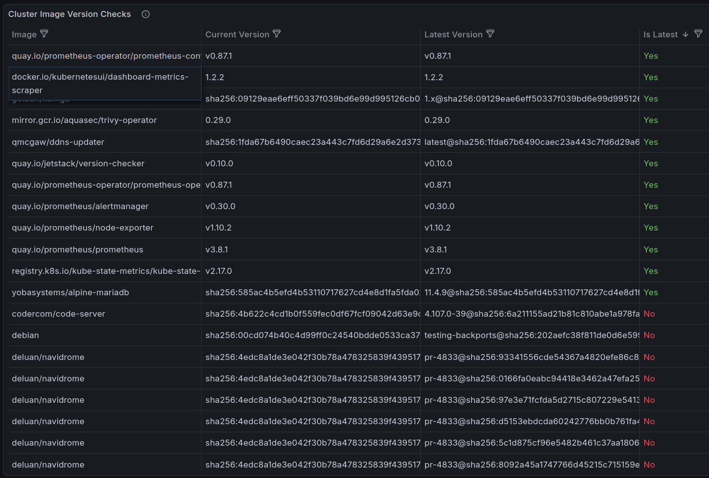

[Replacing Ingress-NGINX with Pomerium](./2025-12-18-replacing-ingress-nginx-with-pomerium.md),
prompted by the upcoming
[retirement in March 2026](https://kubernetes.io/blog/2025/11/11/ingress-nginx-retirement/)
of
[Ingress-NGINX controller](https://github.com/kubernetes/ingress-nginx?tab=readme-ov-file#ingress-nginx-controller),
was a stark reminder the importance of keeping deployments updated and staying abrest of
security issues, vulnerabilities and deprecations.

Manually monitoring each application's repository for new releases, to then update each
deployment manually, work well for a few deployments but does not scale well to dozens of
deployments. The process should be automated to automatically update deployments, at
last those with a good track record of hassle-free updates, so that manual updates are
needed only for those prone to requiring more attention, intermediate backups, etc.

<!-- more -->

## Manual monitoring of releases

Deployments that require special treatment during updates, and optionally those of
special interest, can be monitored manually for better visibility.

### Watch GitHub repositories

Source code repositories in GitHub can be *Watched* to reveive email notifcations when
new release, security alerts and/or other new publications are available. For the
purpose of keeping deployments up to date, keep an eye on releases and security alerts:


### `new(releases)`

[**`new(releases)`**](https://newreleases.io/about) is a simple service to get
notifications about new version releases from many programming platforms (GitHub,
GitLab, etc.) and docker registries (Docker Hub, Quay, etc.).  


To strike a balance between time saving of managing dependencies and annoyances by notifications, emails can sent in batches (frequency can set per project) and releases
can be filtered based on regular expressions (e.g. to ignore non-stable releases)
The main page shows the latest releases with projects sorted to show first those with
the most recent releases:


## Manually updating a deployment

Once a new release for a Docker image is available, Kubernetes will automatically
update the deployment the next time it is *restarted*; depending on how the container
image version is specified, Kubernetes will pull the latest release that matches the
*tag* specified in each `container.image` — this may be the latest stable, major or
minor version.

### Deployment restart

Applications with no special requirements for a gradeceful shutdown can be udpated by
simply restarting the deployment, e.g. this will update
[Audiobookshelf](./2024-02-28-audiobookshelf-on-kubernetes.md) in just a few seconds.

``` console
$ kubectl rollout restart deployment audiobookshelf -n audiobookshelf
deployment.apps/audiobookshelf restarted
```

Although restarting the deployment is itself a fast operation (the new pod is ready in
about 10 seconds), it can disrupt the service for users in a few ways:

*   If a user is listening to a book or podcast, their progress will no longer be saved
    until they reload te client application (web or mobile).
*   If the new version includes changes to user authentication, user will need to login
    again. This can also interrupt tracking progress and streaming media.

To avoid such service disruptions to its users, Audiobookshelf is restarted daily at 5am
from a `crontab` (this is good enough because all the users are in the same time zone).

### Deployment scale down/up

Applications that require a relatively long time to shut down, such as the
[Minecraft Java server](./2023-08-10-running-minecraft-java-server-for-bedrock-clients-on-kubernetes.md)
which needs to *Save the World* during shut down, this alternative script can be used
to make sure the old pods hav enough time to gracefuly shutdown:

``` bash
$ cat ~/bin/restart-audiobookshelf 
#!/bin/bash
kubectl scale -n audiobookshelf deployment audiobookshelf --replicas=0
sleep 60
kubectl scale -n audiobookshelf deployment audiobookshelf --replicas=1
```

This approach is **necessary** when it is recommended to make a full backup before
running the new version, e.g. this was neccessary to make full backes when
[updating UniFi from v9 to v10](./2024-12-31-migrating-unifi-controller-to-kubernetes.md#december-2025-update-to-v10).

!!! tip

    When there is no need to make a full backup before running the new version, the slow
    graceful shutdown is better accomplished by updating the deployment to set the
    `Recreate` strategy so that running pods are shut down before starting new ones,
    and ensure the old pod has enouth time to commit changes to local files by adding a
    `lifecycle.preStop` that waits for a specific amount of time, similarly to
    [Pomerium's Pebble storage setup](./2025-12-18-replacing-ingress-nginx-with-pomerium.md#pebble-storage).

#### Clean-up discarded `replicasets`

Restarting services with the above methods can lead to an accummulation of *empty*
old `replicasets` that can be deleted once the new version is running. It is possible
to reduce the history kept by the Deployment by setting `.spec.revisionHistoryLimit` in
Deployment manifests (the default is typically 10)s, that `replicasets` with 0 replicas
and no active pods are deleted through garbage collection once this limit is reached.

Alternatively, these can be deleted as a one-off with this script:

``` bash
#!/bin/bash
#
# Delete unused replicasets.

kubectl get namespaces -o json \
| jq -r '.items[].metadata.name' \
| while read namespace; do
  kubectl get replicasets -n $namespace -o json \
  | jq -r '.items[] | select(.status.replicas | contains(0))' \
  | jq -r '.metadata.name' \
  | while read replicaset; do
    kubectl delete -n $namespace replicaset $replicaset --cascade=background; 
  done
done
```

### Node restart

Restarting the entire server (Kuberneters `node`) would also update deployments to the
latest release available that matches their specified release tag. This can be done by
 restarting the entire server, or as part of the process to 
[upgrade the kubernetes cluster to the next version](./2025-01-10-upgrading-single-node-kubernetes-cluster-on-ubuntu-studio-24-04-lexicon.md).

## Automated monitoring of vulnerabilities

*Presumably* a good reason to keep a service updated to the latest version is to deploy
fixes to bugs, including vulnerabilities. Whether that is actually true or not, that's
another story, and to understand this it becomes necessary to have a good view of what
vulnerabilities are actually present in the running versions of each service.

### Trivy

[Trivy](https://trivy.dev/) is an extremely fast open-source scanner that can scan the
entire Kubernetes cluster or local images for vulnerabilities and misconfigurations.

[Debian/Ubuntu (Official) packages](https://trivy.dev/docs/latest/getting-started/installation/#debianubuntu-official) are easy to install as usual:

``` console
# wget -qO - https://aquasecurity.github.io/trivy-repo/deb/public.key \
  | gpg --dearmor |  tee /usr/share/keyrings/trivy.gpg > /dev/null
# echo "deb [signed-by=/usr/share/keyrings/trivy.gpg] https://aquasecurity.github.io/trivy-repo/deb generic main" \
  | tee -a /etc/apt/sources.list.d/trivy.list
deb [signed-by=/usr/share/keyrings/trivy.gpg] https://aquasecurity.github.io/trivy-repo/deb generic main
# apt-get update
# apt-get install trivy -y
```

The `trivy` CLI can be used to audit several types of targets, for Kubernetes it can be
used directly on each Docker image, e.g.

``` console
$ trivy image yobasystems/alpine-mariadb:latest
2025-12-24T17:25:29+01:00       INFO    [vuln] Vulnerability scanning is enabled
2025-12-24T17:25:29+01:00       INFO    [secret] Secret scanning is enabled
2025-12-24T17:25:29+01:00       INFO    [secret] If your scanning is slow, please try '--scanners vuln' to disable secret scanning
2025-12-24T17:25:29+01:00       INFO    [secret] Please see https://trivy.dev/docs/v0.68/guide/scanner/secret#recommendation for faster secret detection
2025-12-24T17:25:32+01:00       INFO    Detected OS     family="alpine" version="3.23.0"
2025-12-24T17:25:32+01:00       WARN    This OS version is not on the EOL list  family="alpine" version="3.23"
2025-12-24T17:25:32+01:00       INFO    [alpine] Detecting vulnerabilities...   os_version="3.23" repository="3.23" pkg_num=44
2025-12-24T17:25:32+01:00       INFO    Number of language-specific files       num=0
2025-12-24T17:25:32+01:00       WARN    Using severities from other vendors for some vulnerabilities. Read https://trivy.dev/docs/v0.68/guide/scanner/vulnerability#severity-selection for details.

Report Summary

┌───────────────────────────────────────────────────┬────────┬─────────────────┬─────────┐
│                      Target                       │  Type  │ Vulnerabilities │ Secrets │
├───────────────────────────────────────────────────┼────────┼─────────────────┼─────────┤
│ yobasystems/alpine-mariadb:latest (alpine 3.23.0) │ alpine │        1        │    -    │
└───────────────────────────────────────────────────┴────────┴─────────────────┴─────────┘
Legend:
- '-': Not scanned
- '0': Clean (no security findings detected)


yobasystems/alpine-mariadb:latest (alpine 3.23.0)

Total: 1 (UNKNOWN: 0, LOW: 0, MEDIUM: 1, HIGH: 0, CRITICAL: 0)

┌─────────┬────────────────┬──────────┬────────┬───────────────────┬───────────────┬────────────────────────────────────────────────────────────┐
│ Library │ Vulnerability  │ Severity │ Status │ Installed Version │ Fixed Version │                           Title                            │
├─────────┼────────────────┼──────────┼────────┼───────────────────┼───────────────┼────────────────────────────────────────────────────────────┤
│ c-ares  │ CVE-2025-62408 │ MEDIUM   │ fixed  │ 1.34.5-r0         │ 1.34.6-r0     │ c-ares: c-ares: Denial of Service due to query termination │
│         │                │          │        │                   │               │ after maximum attempts...                                  │
│         │                │          │        │                   │               │ https://avd.aquasec.com/nvd/cve-2025-62408                 │
└─────────┴────────────────┴──────────┴────────┴───────────────────┴───────────────┴────────────────────────────────────────────────────────────┘
```

### Trivy Operator

The [Trivy Operator](https://aquasecurity.github.io/trivy-operator/v0.29.0/) leverages
[Trivy](#trivy) to continuously scan the Kubernetes cluster for security issues. The
scans are summarised in security reports as Kubernetes
[Custom Resource Definitions (CRD)](https://aquasecurity.github.io/trivy-operator/latest/docs/crds/),
which become accessible through the Kubernetes API. The Operator does this by watching
Kubernetes for state changes and automatically triggering security scans in response.
For example, a vulnerability scan is initiated when a new Pod is created. This way, users
can find and view the risks that relate to different resources in a Kubernetes-native way.

To install the operator using
[Helm](https://aquasecurity.github.io/trivy-operator/v0.29.0/getting-started/installation/helm/),
add the respository and then install the latest version in its own namespace:

``` console
$ helm repo add aqua https://aquasecurity.github.io/helm-charts/
"aqua" has been added to your repositories

$ helm repo update
Hang tight while we grab the latest from your chart repositories...
...Successfully got an update from the "node-feature-discovery" chart repository
...Successfully got an update from the "kubernetes-dashboard" chart repository
...Successfully got an update from the "jetstack" chart repository
...Successfully got an update from the "aqua" chart repository
...Successfully got an update from the "ingress-nginx" chart repository
...Successfully got an update from the "intel" chart repository
...Successfully got an update from the "tailscale" chart repository
Update Complete. ⎈Happy Helming!⎈
```

!!! note "The 0.31.0 is the latest version of the Helm chart."

``` console
$ helm install trivy-operator aqua/trivy-operator \
     --namespace trivy-system \
     --create-namespace \
     --version 0.31.0
NAME: trivy-operator
LAST DEPLOYED: Sun Dec 21 11:25:21 2025
NAMESPACE: trivy-system
STATUS: deployed
REVISION: 1
TEST SUITE: None
NOTES:
You have installed Trivy Operator in the trivy-system namespace.
It is configured to discover Kubernetes workloads and resources in
all namespace(s).

Inspect created VulnerabilityReports by:

    kubectl get vulnerabilityreports --all-namespaces -o wide

Inspect created ConfigAuditReports by:

    kubectl get configauditreports --all-namespaces -o wide

Inspect the work log of trivy-operator by:

    kubectl logs -n trivy-system deployment/trivy-operator
```

Right after installing there are no vulnerabilities to report *yet*, the operator will
need some time (several minutes) to scan the whole cluster:

``` console
$ kubectl get vulnerabilityreports -A -o wide
No resources found

$ kubectl logs -n trivy-system deployment/trivy-operator
2025/12/21 10:25:25 maxprocs: Leaving GOMAXPROCS=16: CPU quota undefined
{"level":"info","ts":"2025-12-21T10:25:25Z","logger":"main","msg":"Starting operator","buildInfo":{"Version":"0.29.0","Commit":"c8b31d9428fe730da7f306e43abc45c3de904c94","Date":"2025-09-23T06:46:35Z","Executable":""}}
{"level":"info","ts":"2025-12-21T10:25:25Z","logger":"operator","msg":"Resolved install mode","install mode":"AllNamespaces","operator namespace":"trivy-system","target namespaces":[],"exclude namespaces":"","target workloads":["pod","replicaset","replicationcontroller","statefulset","daemonset","cronjob","job"]}
{"level":"info","ts":"2025-12-21T10:25:25Z","logger":"operator","msg":"Watching all namespaces"}
```

Once the cluster has been scanned, `vulnerabilityreport` objects can be listed and
inspected via the Kubernetes API:

``` console
$ kubectl get vulnerabilityreports -A -o wide
NAMESPACE                  NAME                                                              REPOSITORY                      TAG        SCANNER   AGE     CRITICAL   HIGH   MEDIUM   LOW   UNKNOWN
audiobookshelf             replicaset-audiobookshelf-b49c49757-audiobookshelf                advplyr/audiobookshelf          latest     Trivy     31s     1          14     11       15    0
cert-manager               replicaset-cert-manager-webhook-78cb4cf989-cert-manager-webhook   jetstack/cert-manager-webhook   v1.17.2    Trivy     46s     0          3      15       0     0
default                    pod-command-demo-command-demo-container                           library/debian                  latest     Trivy     2m12s   0          0      10       50    0
intel-device-plugins-gpu   daemonset-intel-gpu-plugin-gpudeviceplugin-intel-gpu-plugin       intel/intel-gpu-plugin          0.32.0     Trivy     2m13s   0          3      15       0     0
kube-flannel               daemonset-kube-flannel-ds-install-cni                             flannel-io/flannel              v0.26.7    Trivy     112s    0          9      44       5     2
kube-flannel               daemonset-kube-flannel-ds-kube-flannel                            flannel-io/flannel              v0.26.7    Trivy     2m7s    0          9      44       5     2
kube-system                daemonset-kube-proxy-kube-proxy                                   kube-proxy                      v1.32.4    Trivy     2m13s   1          12     36       17    0
kube-system                pod-etcd-octavo-etcd                                              etcd                            3.5.16-0   Trivy     104s    4          23     101      4     0
kube-system                pod-kube-apiserver-octavo-kube-apiserver                          kube-apiserver                  v1.32.4    Trivy     2m14s   1          9      33       0     0
kube-system                pod-kube-controller-manager-octavo-kube-controller-manager        kube-controller-manager         v1.32.4    Trivy     107s    1          12     33       0     0
kube-system                pod-kube-scheduler-octavo-kube-scheduler                          kube-scheduler                  v1.32.4    Trivy     2m13s   1          8      32       0     0
kube-system                replicaset-coredns-668d6bf9bc-coredns                             coredns/coredns                 v1.11.3    Trivy     16s     1          8      26       1     4
kubernetes-dashboard       replicaset-656764b68d                                             kubernetesui/dashboard-api      1.12.0     Trivy     2m13s   0          4      20       0     0
kubernetes-dashboard       replicaset-6c7c97c867                                             kubernetesui/dashboard-auth     1.2.4      Trivy     77s     0          6      21       0     0
kubernetes-dashboard       replicaset-f59b77564                                              kubernetesui/dashboard-web      1.6.2      Trivy     54s     0          5      21       0     0
kubernetes-dashboard       replicaset-kubernetes-dashboard-kong-79867c9c48-proxy             library/kong                    3.8        Trivy     59s     0          0      8        26    0
metallb-system             daemonset-speaker-speaker                                         metallb/speaker                 v0.14.9    Trivy     106s    0          11     55       0     0
monitoring                 replicaset-grafana-6fff9dbb6c-grafana                             grafana/grafana                 11.6.1     Trivy     37s     0          13     64       6     0
monitoring                 replicaset-influxdb-5974bf664f-influxdb                           library/influxdb                1.11.8     Trivy     67s     2          5      39       97    2
navidrome                  replicaset-navidrome-df8c9c769-navidrome                          deluan/navidrome                latest     Trivy     10s     0          0      3        7     0
node-feature-discovery     daemonset-node-feature-discovery-worker-worker                    nfd/node-feature-discovery      v0.17.3    Trivy     103s    0          30     100      6     0
node-feature-discovery     replicaset-node-feature-discovery-gc-5b65f7f5b6-gc                nfd/node-feature-discovery      v0.17.3    Trivy     43s     0          30     100      6     0
pomerium                   job-pomerium-gen-secrets-gen-secrets                              pomerium/ingress-controller     main       Trivy     2m12s   0          0      0        8     0
pomerium                   replicaset-pomerium-6b454bb8f9-pomerium                           pomerium/ingress-controller     v0.31.3    Trivy     73s     0          0      1        9     0
pomerium                   replicaset-verify-7889db6976-httpbin                              pomerium/verify                 latest     Trivy     78s     0          0      0        8     0
ryot                       replicaset-ryot-55c5845667-ryot                                   ignisda/ryot                    v8         Trivy     61s     2          19     90       92    1
tailscale                  replicaset-operator-748ccd7c75-operator                           tailscale/k8s-operator          v1.82.0    Trivy     16s     0          5      24       5     0
tailscale                  statefulset-7c5dc67989                                            tailscale/tailscale             v1.82.0    Trivy     2m13s   0          13     60       5     0
tailscale                  statefulset-ts-home-assistant-tailscale-mdqlt-tailscale           tailscale/tailscale             v1.82.0    Trivy     2m14s   0          13     60       5     0
trivy-system               replicaset-trivy-operator-59489786c6-trivy-operator               aquasec/trivy-operator          0.29.0     Trivy     106s    0          6      21       5     0
```

[Install `tree`](#appendix-install-krew-and-tree) to easily find the relevant reports for
each deployement:

``` console
$ kubectl tree deployment unifi -n unifi
NAMESPACE  NAME                                                       READY  REASON  STATUS   AGE 
unifi      Deployment/unifi                                           -              -        237d
unifi      ├─ReplicaSet/unifi-584f4847c7                              -              -        237d
unifi      ├─ReplicaSet/unifi-67679795dd                              -              -        19h 
unifi      │ ├─ConfigAuditReport/replicaset-unifi-67679795dd          -              -        19h 
unifi      │ ├─ExposedSecretReport/replicaset-unifi-67679795dd-unifi  -              -        19h 
unifi      │ ├─Pod/unifi-67679795dd-bw2vg                             True           Current  19h 
unifi      │ ├─SbomReport/replicaset-unifi-67679795dd-unifi           -              -        19h 
unifi      │ └─VulnerabilityReport/replicaset-unifi-67679795dd-unifi  -              -        19h 
unifi      ├─ReplicaSet/unifi-7d44b599dc                              -              -        97d 
unifi      │ ├─ConfigAuditReport/replicaset-unifi-7d44b599dc          -              -        3d7h
unifi      │ ├─ExposedSecretReport/replicaset-unifi-7d44b599dc-unifi  -              -        3d6h
unifi      │ └─SbomReport/replicaset-unifi-7d44b599dc-unifi           -              -        3d6h
unifi      ├─ReplicaSet/unifi-8997b8865                               -              -        202d
unifi      └─ReplicaSet/unifi-bff88d4df                               -              -        98d 

$ kubectl tree deployment home-assistant -n home-assistant
NAMESPACE       NAME                                                                             READY  REASON  STATUS   AGE  
home-assistant  Deployment/home-assistant                                                        -              -        241d 
home-assistant  └─ReplicaSet/home-assistant-77bf44c47b                                           -              -        241d 
home-assistant    ├─ConfigAuditReport/replicaset-home-assistant-77bf44c47b                       -              -        3d7h 
home-assistant    ├─ExposedSecretReport/replicaset-home-assistant-77bf44c47b-home-assistant-app  -              -        3d7h 
home-assistant    ├─Pod/home-assistant-77bf44c47b-trgrt                                          True           Current  144d 
home-assistant    ├─SbomReport/replicaset-home-assistant-77bf44c47b-home-assistant-app           -              -        3d7h 
home-assistant    └─VulnerabilityReport/replicaset-home-assistant-77bf44c47b-home-assistant-app  -              -        6h49m

$ kubectl tree deployment audiobookshelf -n audiobookshelf
NAMESPACE       NAME                                                                        READY  REASON  STATUS   AGE 
audiobookshelf  Deployment/audiobookshelf                                                   -              -        239d
audiobookshelf  └─ReplicaSet/audiobookshelf-c6d46b54f                                       -              -        13h 
audiobookshelf    ├─ConfigAuditReport/replicaset-audiobookshelf-c6d46b54f                   -              -        13h 
audiobookshelf    ├─ExposedSecretReport/replicaset-audiobookshelf-c6d46b54f-audiobookshelf  -              -        13h 
audiobookshelf    ├─Pod/audiobookshelf-c6d46b54f-ngm8w                                      True           Current  13h 
audiobookshelf    ├─SbomReport/replicaset-audiobookshelf-c6d46b54f-audiobookshelf           -              -        13h 
audiobookshelf    └─VulnerabilityReport/replicaset-audiobookshelf-c6d46b54f-audiobookshelf  -              -        13h 
```

Use the `describe` command to inspect all details about each report. The output is often
very long, so here is a trick to filter it down to show only `CRITICAL` vulnerabilties:

``` console
$ kubectl describe vulnerabilityreport \
    replicaset-audiobookshelf-c6d46b54f-audiobookshelf \
    -n audiobookshelf \
    | egrep -B11 -A1 CRITICAL | egrep --color '|.*Version.*|Title.*'
    Title:               follow-redirects: Possible credential leak
    Vulnerability ID:    CVE-2024-28849
    Fixed Version:       2.5.4, 3.0.4, 4.0.4
    Installed Version:   4.0.0
    Last Modified Date:  2025-11-03T20:19:20Z
    Links:
    Package PURL:        pkg:npm/form-data@4.0.0
    Primary Link:        https://avd.aquasec.com/nvd/cve-2025-7783
    Published Date:      2025-07-18T17:15:44Z
    Resource:            form-data
    Score:               5.4
    Severity:            CRITICAL
    Target:              
```

### Trivy Operator Dashboard

[Trivy Operator Dashboard](https://github.com/raoulx24/trivy-operator-dashboard?tab=readme-ov-file#trivy-operator-dashboard)
is a dedicate dashboard for the Trivy Pperator that comes with its own web UI
(not based on Grafana). The recommended
[installation](https://github.com/raoulx24/trivy-operator-dashboard/blob/master/docs/install-doc.md#installation)
method is via Helm, with the following `trivy-operator-dashboard-values.yaml` to create
a Pomerium-based `Ingress`:

``` yaml title="prometheus/trivy-operator-dashboard-values.yaml"
ingress:
  enabled: true
  annotations:
    cert-manager.io/cluster-issuer: letsencrypt-prod
    ingress.pomerium.io/pass_identity_headers: true
    ingress.pomerium.io/secure_upstream: true
    ingress.pomerium.io/tls_skip_verify: true
    ingress.pomerium.io/policy: |
      - allow:
          or:
            - email:
                is: "admin-user@gmail.com"
  className: pomerium
  tls:
    - secretName: tls-trivy-operator-dashboard
      hosts:
        - trivy-operator-dashboard.very-very-dark-gray.top
  hosts:
    - host: trivy-operator-dashboard.very-very-dark-gray.top
      paths:
        - path: /
          pathType: Prefix
```

``` console
$ helm install trivy-operator-dashboard \
  oci://ghcr.io/raoulx24/charts/trivy-operator-dashboard \
  --namespace monitoring \
  --version 1.7.2 \
  --values prometheus/trivy-operator-dashboard-values.yaml
Pulled: ghcr.io/raoulx24/charts/trivy-operator-dashboard:1.7.2
Digest: sha256:a7831877b6f3d2124312cffbf5839b0d4f8159abf3215c29f837a17d6a2f65b9
NAME: trivy-operator-dashboard
LAST DEPLOYED: Sun Dec 21 19:02:34 2025
NAMESPACE: monitoring
STATUS: deployed
REVISION: 1
NOTES:
1. Get the application URL by running these commands:
  https://trivy-operator-dashboard.very-very-dark-gray.top/
```

The dashboard is now available at
<https://trivy-operator-dashboard.very-very-dark-gray.top>


### Trivy Operator Dashboard in Grafana

[Trivy Operator Dashboard in Grafana](https://aquasecurity.github.io/trivy-operator/v0.11.0/tutorials/grafana-dashboard/)
makes all those reports easier to find and provides better *Big Picture* views of the
whole cluster, using [Prometheus](https://prometheus.io/) to scrape those reports and
visualizing them on Grafana dashboards.

Prometheus and Grafana can easily be installed through the kube-prometheus-stack
[Helm Chart](https://github.com/prometheus-community/helm-charts/tree/main/charts/kube-prometheus-stack),
but Grafana is already installed so it is only necessary to install Prometheus.
To omit Grafana it, create a custom `prometheus/values.yaml` file to disable the Grafana
component:

```yaml title="prometheus/values.yaml"
# Disable Grafana installation
grafana:
  enabled: false

# Ensure Prometheus can find the Trivy ServiceMonitors
prometheus:
  prometheusSpec:
    serviceMonitorSelectorNilUsesHelmValues: false
    serviceMonitorSelector: {}
    serviceMonitorNamespaceSelector: {}
```

Add the repository:

``` console
$ helm repo add prometheus-community https://prometheus-community.github.io/helm-charts
"prometheus-community" has been added to your repositories

$ helm repo update
Hang tight while we grab the latest from your chart repositories...
...
...Successfully got an update from the "prometheus-community" chart repository
Update Complete. ⎈Happy Helming!⎈
```

Install the stack in the existing `monitoring` namespace where Grafana is running,
using the above `prometheus/values.yaml` to omit installing Grafana:

``` console
$ helm upgrade --install prom prometheus-community/kube-prometheus-stack \
  --namespace monitoring \
  --values prometheus/values.yaml

Release "prom" does not exist. Installing it now.
NAME: prom
LAST DEPLOYED: Sun Dec 21 13:32:07 2025
NAMESPACE: monitoring
STATUS: deployed
REVISION: 1
TEST SUITE: None
NOTES:
kube-prometheus-stack has been installed. Check its status by running:
  kubectl --namespace monitoring get pods -l "release=prom"

Get Grafana 'admin' user password by running:

  kubectl --namespace monitoring get secrets prom-grafana -o jsonpath="{.data.admin-password}" | base64 -d ; echo

Access Grafana local instance:

  export POD_NAME=$(kubectl --namespace monitoring get pod -l "app.kubernetes.io/name=grafana,app.kubernetes.io/instance=prom" -oname)
  kubectl --namespace monitoring port-forward $POD_NAME 3000

Get your grafana admin user password by running:

  kubectl get secret --namespace monitoring -l app.kubernetes.io/component=admin-secret -o jsonpath="{.items[0].data.admin-password}" | base64 --decode ; echo


Visit https://github.com/prometheus-operator/kube-prometheus for instructions on how to create & configure Alertmanager and Prometheus instances using the Operator.
```

The instructions referring to the Grafana dashboards can be ignored, they are only
relevant when installing Grafana from this Helm chart.

Then update the Trivy Operator to expoort its metrics to Prometheus, by upgrading the
Helm chart with the following `trivy-values.yaml`:

``` yaml title="prometheus/trivy-values.yaml"
serviceMonitor:
  enabled: true
```

``` console
$ helm upgrade \
  trivy-operator aqua/trivy-operator \
  -n trivy-system \
  --values prometheus/trivy-values.yaml

Release "trivy-operator" has been upgraded. Happy Helming!
NAME: trivy-operator
LAST DEPLOYED: Sun Dec 21 13:37:38 2025
NAMESPACE: trivy-system
STATUS: deployed
REVISION: 2
TEST SUITE: None
NOTES:
You have installed Trivy Operator in the trivy-system namespace.
It is configured to discover Kubernetes workloads and resources in
all namespace(s).

Inspect created VulnerabilityReports by:

    kubectl get vulnerabilityreports --all-namespaces -o wide

Inspect created ConfigAuditReports by:

    kubectl get configauditreports --all-namespaces -o wide

Inspect the work log of trivy-operator by:

    kubectl logs -n trivy-system deployment/trivy-operator
```

This update to the Trivy operator Helm values leads to the creation of its
`ServiceMonitor`:

``` console hl_lines="12"
$ kubectl describe servicemonitor trivy-operator -n trivy-system 
Name:         trivy-operator
Namespace:    trivy-system
Labels:       app.kubernetes.io/instance=trivy-operator
              app.kubernetes.io/managed-by=Helm
              app.kubernetes.io/name=trivy-operator
              app.kubernetes.io/version=0.29.0
              helm.sh/chart=trivy-operator-0.31.0
Annotations:  meta.helm.sh/release-name: trivy-operator
              meta.helm.sh/release-namespace: trivy-system
API Version:  monitoring.coreos.com/v1
Kind:         ServiceMonitor
Metadata:
  Creation Timestamp:  2025-12-21T12:37:39Z
  Generation:          1
  Resource Version:    52316470
  UID:                 610823f7-b6bd-459f-a6c7-8b5c18bf1ae4
Spec:
  Endpoints:
    Honor Labels:  true
    Port:          metrics
    Scheme:        http
  Selector:
    Match Labels:
      app.kubernetes.io/instance:  trivy-operator
      app.kubernetes.io/name:      trivy-operator
Events:                            <none>
```

``` console
$ kubectl get all -n monitoring
NAME                                                         READY   STATUS    RESTARTS      AGE
pod/alertmanager-prom-kube-prometheus-stack-alertmanager-0   2/2     Running   0             7m7s
pod/grafana-6fff9dbb6c-v22hg                                 1/1     Running   19 (9d ago)   237d
pod/influxdb-5974bf664f-8r5mf                                1/1     Running   19 (9d ago)   237d
pod/prom-kube-prometheus-stack-operator-645fd684d6-n6qpf     1/1     Running   0             7m12s
pod/prom-kube-state-metrics-8576986c6b-xqcwl                 1/1     Running   0             7m12s
pod/prom-prometheus-node-exporter-r24zl                      1/1     Running   0             7m13s
pod/prometheus-prom-kube-prometheus-stack-prometheus-0       2/2     Running   0             7m7s

NAME                                              TYPE        CLUSTER-IP       EXTERNAL-IP   PORT(S)                      AGE
service/alertmanager-operated                     ClusterIP   None             <none>        9093/TCP,9094/TCP,9094/UDP   7m8s
service/grafana-svc                               NodePort    10.110.29.239    <none>        13000:30300/TCP              237d
service/influxdb-svc                              NodePort    10.110.65.108    <none>        18086:30086/TCP              237d
service/prom-kube-prometheus-stack-alertmanager   ClusterIP   10.100.199.60    <none>        9093/TCP,8080/TCP            7m13s
service/prom-kube-prometheus-stack-operator       ClusterIP   10.107.124.226   <none>        443/TCP                      7m13s
service/prom-kube-prometheus-stack-prometheus     ClusterIP   10.110.216.0     <none>        9090/TCP,8080/TCP            7m13s
service/prom-kube-state-metrics                   ClusterIP   10.96.142.254    <none>        8080/TCP                     7m13s
service/prom-prometheus-node-exporter             ClusterIP   10.97.182.188    <none>        9100/TCP                     7m13s
service/prometheus-operated                       ClusterIP   None             <none>        9090/TCP                     7m7s

NAME                                           DESIRED   CURRENT   READY   UP-TO-DATE   AVAILABLE   NODE SELECTOR            AGE
daemonset.apps/prom-prometheus-node-exporter   1         1         1       1            1           kubernetes.io/os=linux   7m13s

NAME                                                  READY   UP-TO-DATE   AVAILABLE   AGE
deployment.apps/grafana                               1/1     1            1           237d
deployment.apps/influxdb                              1/1     1            1           237d
deployment.apps/prom-kube-prometheus-stack-operator   1/1     1            1           7m13s
deployment.apps/prom-kube-state-metrics               1/1     1            1           7m13s

NAME                                                             DESIRED   CURRENT   READY   AGE
replicaset.apps/grafana-6fff9dbb6c                               1         1         1       237d
replicaset.apps/influxdb-5974bf664f                              1         1         1       237d
replicaset.apps/prom-kube-prometheus-stack-operator-645fd684d6   1         1         1       7m13s
replicaset.apps/prom-kube-state-metrics-8576986c6b               1         1         1       7m13s

NAME                                                                    READY   AGE
statefulset.apps/alertmanager-prom-kube-prometheus-stack-alertmanager   1/1     7m8s
statefulset.apps/prometheus-prom-kube-prometheus-stack-prometheus       1/1     7m7s
```

``` console
$ kubectl get svc -n monitoring -o wide
NAME                                      TYPE        CLUSTER-IP       EXTERNAL-IP   PORT(S)                      AGE     SELECTOR
alertmanager-operated                     ClusterIP   None             <none>        9093/TCP,9094/TCP,9094/UDP   7m35s   app.kubernetes.io/name=alertmanager
grafana-svc                               NodePort    10.110.29.239    <none>        13000:30300/TCP              237d    app=grafana
influxdb-svc                              NodePort    10.110.65.108    <none>        18086:30086/TCP              237d    app=influxdb
prom-kube-prometheus-stack-alertmanager   ClusterIP   10.100.199.60    <none>        9093/TCP,8080/TCP            7m40s   alertmanager=prom-kube-prometheus-stack-alertmanager,app.kubernetes.io/name=alertmanager
prom-kube-prometheus-stack-operator       ClusterIP   10.107.124.226   <none>        443/TCP                      7m40s   app=kube-prometheus-stack-operator,release=prom
prom-kube-prometheus-stack-prometheus     ClusterIP   10.110.216.0     <none>        9090/TCP,8080/TCP            7m40s   app.kubernetes.io/name=prometheus,operator.prometheus.io/name=prom-kube-prometheus-stack-prometheus
prom-kube-state-metrics                   ClusterIP   10.96.142.254    <none>        8080/TCP                     7m40s   app.kubernetes.io/instance=prom,app.kubernetes.io/name=kube-state-metrics
prom-prometheus-node-exporter             ClusterIP   10.97.182.188    <none>        9100/TCP                     7m40s   app.kubernetes.io/instance=prom,app.kubernetes.io/name=prometheus-node-exporter
prometheus-operated                       ClusterIP   None             <none>        9090/TCP                     7m34s   app.kubernetes.io/name=prometheus
```

#### Create Grafana Data source

Once Prometheus is running there are two ways to connec the existing grafana to it:

*   If both services are running in the same cluster, an internal URL can be used to
    connect based on the `prom-kube-prometheus-stack-prometheus` **service** at
    <http://prom-kube-prometheus-stack-prometheus.monitoring.svc:9090>
*   If a public endpoint is otherwise needed to reach Prometheous, create an `Ingress`
    for the Prometheus service:

    ??? k8s "Additional `Ingress` for the Prometheus service."

        ``` yaml linenums="54" title="pomerium/pomerium-ingress/monitoring.yaml"
        apiVersion: networking.k8s.io/v1
        kind: Ingress
        metadata:
          name: prometheus-pomerium-ingress
          namespace: monitoring
          annotations:
            cert-manager.io/cluster-issuer: letsencrypt-prod
            ingress.pomerium.io/allow_public_unauthenticated_access: true
            ingress.pomerium.io/allow_websockets: true
            ingress.pomerium.io/pass_identity_headers: true
            ingress.pomerium.io/preserve_host_header: true
        spec:
          ingressClassName: pomerium
          rules:
            - host: prometheus.very-very-dark-gray.top
              http:
                paths:
                - path: /
                  pathType: Prefix
                  backend:
                    service:
                      name: prom-kube-prometheus-stack-prometheus
                      port:
                        number: 9090
          tls:
            - hosts:
                - prometheus.very-very-dark-gray.top
              secretName: tls-secret
        ```

#### Create Grafana dashboards

Once the data source is connected, ready-made Grafana dashboards can be imported
directly by ID into the existing Grafana instance.

*   [Trivy Operator Dashboard (ID: 21398)](https://grafana.com/grafana/dashboards/21398-trivy-operator-dashboard/)
    
*   [Trivy Operator - Vulnerabilities (ID: 16337)](https://grafana.com/grafana/dashboards/16337-trivy-operator-vulnerabilities/)
    

## Automated monitoring of releases

While automatically **updating** all deployments to the latest stable version of every
Docker image may not be the best idea, at least **monitoring** the availability of new
releases should be automated. Considering a small homelab server has accumulated **50**
*running* containers in about three years, manually monitoring for new releases is
already a bit much:

??? "List of running Docker images as reported by `kubectl get pods`"

    ``` console
    $ kubectl get pods -A -o jsonpath="{.items[*].spec.containers[*].image}" \
        | tr -s '[[:space:]]' '\n' | sort -u
    codercom/code-server
    debian
    deluan/navidrome:latest
    docker.io/grafana/grafana:12.3.1
    docker.io/influxdb:1.11.8
    docker.io/kubernetesui/dashboard-api:1.12.0
    docker.io/kubernetesui/dashboard-auth:1.2.4
    docker.io/kubernetesui/dashboard-metrics-scraper:1.2.2
    docker.io/kubernetesui/dashboard-web:1.6.2
    docker.io/mongo:8.0.0
    docker.io/pomerium/verify
    fireflyiii/core
    ghcr.io/advplyr/audiobookshelf:latest
    ghcr.io/flannel-io/flannel:v0.26.7
    ghcr.io/home-assistant/home-assistant:stable
    ghcr.io/ignisda/ryot:v10
    ghcr.io/raoulx24/trivy-operator-dashboard:1.7.1
    gotson/komga
    intel/intel-deviceplugin-operator:0.32.0
    intel/intel-gpu-plugin:0.32.0
    jellyfin/jellyfin
    kong:3.8
    lscr.io/linuxserver/unifi-network-application:10.0.162
    mirror.gcr.io/aquasec/trivy-operator:0.29.0
    pomerium/ingress-controller:main
    postgres:16-alpine
    qmcgaw/ddns-updater:latest
    quay.io/jetstack/cert-manager-cainjector:v1.17.2
    quay.io/jetstack/cert-manager-controller:v1.17.2
    quay.io/jetstack/cert-manager-webhook:v1.17.2
    quay.io/jetstack/version-checker:v0.10.0
    quay.io/metallb/controller:v0.14.9
    quay.io/metallb/speaker:v0.14.9
    quay.io/prometheus/alertmanager:v0.30.0
    quay.io/prometheus/node-exporter:v1.10.2
    quay.io/prometheus-operator/prometheus-config-reloader:v0.87.1
    quay.io/prometheus-operator/prometheus-operator:v0.87.1
    quay.io/prometheus/prometheus:v3.8.1
    registry.k8s.io/coredns/coredns:v1.11.3
    registry.k8s.io/etcd:3.5.16-0
    registry.k8s.io/ingress-nginx/controller:v1.12.1@sha256:d2fbc4ec70d8aa2050dd91a91506e998765e86c96f32cffb56c503c9c34eed5b
    registry.k8s.io/kube-apiserver:v1.32.4
    registry.k8s.io/kube-controller-manager:v1.32.4
    registry.k8s.io/kube-proxy:v1.32.4
    registry.k8s.io/kube-scheduler:v1.32.4
    registry.k8s.io/kube-state-metrics/kube-state-metrics:v2.17.0
    registry.k8s.io/nfd/node-feature-discovery:v0.17.3
    tailscale/k8s-operator:v1.82.0
    tailscale/tailscale:v1.82.0
    yobasystems/alpine-mariadb:latest
    ```

### Jetstack Version-Checker

[Jetstack Version-Checker](https://github.com/jetstack/version-checker?tab=readme-ov-file#version-checker)
is a Kubernetes utility for observing the current versions of images running in the
cluster, as well as the latest available upstream. Additionally, it monitors the
Kubernetes cluster version against the latest available releases using official
Kubernetes release channels. These checks get exposed as Prometheus metrics to be
viewed on a dashboard.

[Install using Helm](https://github.com/jetstack/version-checker/blob/main/docs/installation.md#install-using-helm)
with the following `version-checker-values.yaml` to disable Grafana, because it's
already running as part of
[monitoring with InfluxDB and Grafana](./2024-04-20-monitoring-with-influxdb-and-grafana-on-kubernetes.md),
and enable the service metrics endpoint for Prometheous to scrape metrics:

``` yaml title="prometheus/version-checker-values.yaml"
# Disable Grafana installation
dashboards:
  enabled: false

# Enable the ServiceMonitors for Prometheus to scrape metrics.
serviceMonitor:
  enabled: true
```

Add the Jetstack Helm repository and install the chart in the `monitoring` namespace:

``` console
$ helm repo add jetstack https://charts.jetstack.io
"jetstack" already exists with the same configuration, skipping

$ helm upgrade --install version-checker jetstack/version-checker \
  --namespace monitoring \
  --values prometheus/version-checker-values.yaml
Release "version-checker" does not exist. Installing it now.
NAME: version-checker
LAST DEPLOYED: Sun Dec 21 17:08:15 2025
NAMESPACE: monitoring
STATUS: deployed
REVISION: 1
TEST SUITE: None

$ kubectl describe servicemonitor version-checker -n monitoring 
Name:         version-checker
Namespace:    monitoring
Labels:       app=version-checker
              app.kubernetes.io/managed-by=Helm
Annotations:  meta.helm.sh/release-name: version-checker
              meta.helm.sh/release-namespace: monitoring
API Version:  monitoring.coreos.com/v1
Kind:         ServiceMonitor
Metadata:
  Creation Timestamp:  2025-12-21T16:08:18Z
  Generation:          1
  Resource Version:    52349035
  UID:                 37dc3c0f-9bdd-4271-9ee5-810f53e3f3cb
Spec:
  Endpoints:
    Path:  /metrics
    Port:  web
  Selector:
    Match Labels:
      App:  version-checker
Events:     <none>
```

Once Version-Checker is running, with its `ServiceMonitor` exposing metrics, there is
(at least one) easy-to-install Grafana dashboard to conveniently display and explore
these metrics:
[Version-Checker (ID: 22745)](https://grafana.com/grafana/dashboards/22745-version-checker/)
is the most current and recommended version-checker dashboard;
it provides a clean table view of current image versions vs.latest upstream releases:



[Supported Annotations](https://github.com/jetstack/version-checker/blob/main/docs/installation.md#supported-annotations)
are needed to make `version-checker`  match only specific version numbers, so that
the "Latest Version" is picked among semantic version tags rather than versions that
should not be running in production (`experimental`, `develop`, `unstable`, etc),
in some cases even pinning to a specific major version other than the latest:

``` yaml hl_lines="9-16 21"
apiVersion: apps/v1
kind: Deployment
metadata:
  name: unifi
  namespace: unifi
spec:
  template:
    metadata:
      annotations:
        enable.version-checker.io/unifi: "true"
        match-regex.version-checker.io/unifi: "^v?\\d+\\.\\d+\\.\\d+$"
        pin-major.version-checker.io/mongo: "10"
        pin-minor.version-checker.io/mongo: "0"
        resolve-sha-to-tags.version-checker.io/unifi: "true"
        use-metadata.version-checker.io/unifi: "false"
        use-sha.version-checker.io/unifi: "false"
      labels:
        app: unifi
    spec:
      containers:
      - image: lscr.io/linuxserver/unifi-network-application:10.0.162
```

## Appendix: install `krew` and `tree`

[Install `krew` from Bash](https://krew.sigs.k8s.io/docs/user-guide/setup/install/#bash),
append `export PATH="${KREW_ROOT:-$HOME/.krew}/bin:$PATH"` to the `.bashrc` and reload it
with `. .bashrc` to have `krew` installed and ready to use:

``` console
$ cd /tmp && (
  set -x; cd "$(mktemp -d)" &&
  OS="$(uname | tr '[:upper:]' '[:lower:]')" &&
  ARCH="$(uname -m | sed -e 's/x86_64/amd64/' -e 's/\(arm\)\(64\)\?.*/\1\2/' -e 's/aarch64$/arm64/')" &&
  KREW="krew-${OS}_${ARCH}" &&
  curl -fsSLO "https://github.com/kubernetes-sigs/krew/releases/latest/download/${KREW}.tar.gz" &&
  tar zxvf "${KREW}.tar.gz" &&
  ./"${KREW}" install krew
)
++ mktemp -d
+ cd /tmp/tmp.e0UDytiaZ9
++ uname
++ tr '[:upper:]' '[:lower:]'
+ OS=linux
++ uname -m
++ sed -e s/x86_64/amd64/ -e 's/\(arm\)\(64\)\?.*/\1\2/' -e 's/aarch64$/arm64/'
+ ARCH=amd64
+ KREW=krew-linux_amd64
+ curl -fsSLO https://github.com/kubernetes-sigs/krew/releases/latest/download/krew-linux_amd64.tar.gz
+ tar zxvf krew-linux_amd64.tar.gz
./._LICENSE
tar: Ignoring unknown extended header keyword 'LIBARCHIVE.xattr.com.apple.provenance'
./LICENSE
./._krew-linux_amd64
tar: Ignoring unknown extended header keyword 'LIBARCHIVE.xattr.com.apple.provenance'
./krew-linux_amd64
+ ./krew-linux_amd64 install krew
Adding "default" plugin index from https://github.com/kubernetes-sigs/krew-index.git.
Updated the local copy of plugin index.
Installing plugin: krew
Installed plugin: krew
\
 | Use this plugin:
 |      kubectl krew
 | Documentation:
 |      https://krew.sigs.k8s.io/
 | Caveats:
 | \
 |  | krew is now installed! To start using kubectl plugins, you need to add
 |  | krew's installation directory to your PATH:
 |  | 
 |  |   * macOS/Linux:
 |  |     - Add the following to your ~/.bashrc or ~/.zshrc:
 |  |         export PATH="${KREW_ROOT:-$HOME/.krew}/bin:$PATH"
 |  |     - Restart your shell.
 |  | 
 |  |   * Windows: Add %USERPROFILE%\.krew\bin to your PATH environment variable
 |  | 
 |  | To list krew commands and to get help, run:
 |  |   $ kubectl krew
 |  | For a full list of available plugins, run:
 |  |   $ kubectl krew search
 |  | 
 |  | You can find documentation at
 |  |   https://krew.sigs.k8s.io/docs/user-guide/quickstart/.
 | /
/

$ echo 'export PATH="${KREW_ROOT:-$HOME/.krew}/bin:$PATH"' >> ~/.bashrc
$ . .bashrc
```

Then use `krew` to isntall
[`kubectl tree`](https://github.com/ahmetb/kubectl-tree?tab=readme-ov-file#kubectl-tree)

``` console
$ kubectl krew update
Updated the local copy of plugin index.

$ kubectl krew install tree
Updated the local copy of plugin index.
Installing plugin: tree
Installed plugin: tree
\
 | Use this plugin:
 |      kubectl tree
 | Documentation:
 |      https://github.com/ahmetb/kubectl-tree
 | Caveats:
 | \
 |  | krew is now installed! To start using kubectl plugins, you need to add
 |  | krew's installation directory to your PATH:
 |  | 
 |  |   * macOS/Linux:
 |  |     - Add the following to your ~/.bashrc or ~/.zshrc:
 |  |         export PATH="${KREW_ROOT:-$HOME/.krew}/bin:$PATH"
 |  |     - Restart your shell.
 |  | 
 |  |   * Windows: Add %USERPROFILE%\.krew\bin to your PATH environment variable
 |  | 
 |  | To list krew commands and to get help, run:
 |  |   $ kubectl krew
 |  | For a full list of available plugins, run:
 |  |   $ kubectl krew search
 |  | 
 |  | You can find documentation at
 |  |   https://krew.sigs.k8s.io/docs/user-guide/quickstart/.
 | /
/
```

Use the `kubectl tree` command on deployments to more easily find whether they are ready:

``` console
$ kubectl tree deployment unifi -n unifi
NAMESPACE  NAME                            READY  REASON  STATUS   AGE 
unifi      Deployment/unifi                -              -        233d
unifi      ├─ReplicaSet/unifi-584f4847c7   -              -        233d
unifi      ├─ReplicaSet/unifi-7d44b599dc   -              -        94d 
unifi      │ └─Pod/unifi-7d44b599dc-58z92  True           Current  94d 
unifi      ├─ReplicaSet/unifi-8997b8865    -              -        199d
unifi      └─ReplicaSet/unifi-bff88d4df    -              -        95d 

$ kubectl tree deployment home-assistant -n home-assistant
NAMESPACE       NAME                                     READY  REASON  STATUS   AGE 
home-assistant  Deployment/home-assistant                -              -        237d
home-assistant  └─ReplicaSet/home-assistant-77bf44c47b   -              -        237d
home-assistant    └─Pod/home-assistant-77bf44c47b-trgrt  True           Current  141d
```

## Appendix: `kube-bench`

```
$ wget https://github.com/aquasecurity/kube-bench/releases/download/v0.14.0/kube-bench_0.14.0_linux_amd64.deb
$ sudo dpkg -i ./kube-bench_0.14.0_linux_amd64.deb 


$ sudo kube-bench run 
[INFO] 1 Control Plane Security Configuration
[INFO] 1.1 Control Plane Node Configuration Files
[PASS] 1.1.1 Ensure that the API server pod specification file permissions are set to 600 or more restrictive (Automated)
[PASS] 1.1.2 Ensure that the API server pod specification file ownership is set to root:root (Automated)
[PASS] 1.1.3 Ensure that the controller manager pod specification file permissions are set to 600 or more restrictive (Automated)
[PASS] 1.1.4 Ensure that the controller manager pod specification file ownership is set to root:root (Automated)
[PASS] 1.1.5 Ensure that the scheduler pod specification file permissions are set to 600 or more restrictive (Automated)
[PASS] 1.1.6 Ensure that the scheduler pod specification file ownership is set to root:root (Automated)
[PASS] 1.1.7 Ensure that the etcd pod specification file permissions are set to 600 or more restrictive (Automated)
[PASS] 1.1.8 Ensure that the etcd pod specification file ownership is set to root:root (Automated)
[WARN] 1.1.9 Ensure that the Container Network Interface file permissions are set to 600 or more restrictive (Manual)
[PASS] 1.1.10 Ensure that the Container Network Interface file ownership is set to root:root (Manual)
[PASS] 1.1.11 Ensure that the etcd data directory permissions are set to 700 or more restrictive (Automated)
[FAIL] 1.1.12 Ensure that the etcd data directory ownership is set to etcd:etcd (Automated)
[PASS] 1.1.13 Ensure that the default administrative credential file permissions are set to 600 (Automated)
[PASS] 1.1.14 Ensure that the default administrative credential file ownership is set to root:root (Automated)
[PASS] 1.1.15 Ensure that the scheduler.conf file permissions are set to 600 or more restrictive (Automated)
[PASS] 1.1.16 Ensure that the scheduler.conf file ownership is set to root:root (Automated)
[PASS] 1.1.17 Ensure that the controller-manager.conf file permissions are set to 600 or more restrictive (Automated)
[PASS] 1.1.18 Ensure that the controller-manager.conf file ownership is set to root:root (Automated)
[PASS] 1.1.19 Ensure that the Kubernetes PKI directory and file ownership is set to root:root (Automated)
[PASS] 1.1.20 Ensure that the Kubernetes PKI certificate file permissions are set to 644 or more restrictive (Manual)
[PASS] 1.1.21 Ensure that the Kubernetes PKI key file permissions are set to 600 (Manual)
[INFO] 1.2 API Server
[WARN] 1.2.1 Ensure that the --anonymous-auth argument is set to false (Manual)
[PASS] 1.2.2 Ensure that the --token-auth-file parameter is not set (Automated)
[WARN] 1.2.3 Ensure that the --DenyServiceExternalIPs is set (Manual)
[PASS] 1.2.4 Ensure that the --kubelet-client-certificate and --kubelet-client-key arguments are set as appropriate (Automated)
[FAIL] 1.2.5 Ensure that the --kubelet-certificate-authority argument is set as appropriate (Automated)
[PASS] 1.2.6 Ensure that the --authorization-mode argument is not set to AlwaysAllow (Automated)
[PASS] 1.2.7 Ensure that the --authorization-mode argument includes Node (Automated)
[PASS] 1.2.8 Ensure that the --authorization-mode argument includes RBAC (Automated)
[WARN] 1.2.9 Ensure that the admission control plugin EventRateLimit is set (Manual)
[PASS] 1.2.10 Ensure that the admission control plugin AlwaysAdmit is not set (Automated)
[WARN] 1.2.11 Ensure that the admission control plugin AlwaysPullImages is set (Manual)
[PASS] 1.2.12 Ensure that the admission control plugin ServiceAccount is set (Automated)
[PASS] 1.2.13 Ensure that the admission control plugin NamespaceLifecycle is set (Automated)
[PASS] 1.2.14 Ensure that the admission control plugin NodeRestriction is set (Automated)
[FAIL] 1.2.15 Ensure that the --profiling argument is set to false (Automated)
[FAIL] 1.2.16 Ensure that the --audit-log-path argument is set (Automated)
[FAIL] 1.2.17 Ensure that the --audit-log-maxage argument is set to 30 or as appropriate (Automated)
[FAIL] 1.2.18 Ensure that the --audit-log-maxbackup argument is set to 10 or as appropriate (Automated)
[FAIL] 1.2.19 Ensure that the --audit-log-maxsize argument is set to 100 or as appropriate (Automated)
[WARN] 1.2.20 Ensure that the --request-timeout argument is set as appropriate (Manual)
[PASS] 1.2.21 Ensure that the --service-account-lookup argument is set to true (Automated)
[PASS] 1.2.22 Ensure that the --service-account-key-file argument is set as appropriate (Automated)
[PASS] 1.2.23 Ensure that the --etcd-certfile and --etcd-keyfile arguments are set as appropriate (Automated)
[PASS] 1.2.24 Ensure that the --tls-cert-file and --tls-private-key-file arguments are set as appropriate (Automated)
[PASS] 1.2.25 Ensure that the --client-ca-file argument is set as appropriate (Automated)
[PASS] 1.2.26 Ensure that the --etcd-cafile argument is set as appropriate (Automated)
[WARN] 1.2.27 Ensure that the --encryption-provider-config argument is set as appropriate (Manual)
[WARN] 1.2.28 Ensure that encryption providers are appropriately configured (Manual)
[WARN] 1.2.29 Ensure that the API Server only makes use of Strong Cryptographic Ciphers (Manual)
[FAIL] 1.2.30 Ensure that the --service-account-extend-token-expiration parameter is set to false (Automated)
[INFO] 1.3 Controller Manager
[WARN] 1.3.1 Ensure that the --terminated-pod-gc-threshold argument is set as appropriate (Manual)
[FAIL] 1.3.2 Ensure that the --profiling argument is set to false (Automated)
[PASS] 1.3.3 Ensure that the --use-service-account-credentials argument is set to true (Automated)
[PASS] 1.3.4 Ensure that the --service-account-private-key-file argument is set as appropriate (Automated)
[PASS] 1.3.5 Ensure that the --root-ca-file argument is set as appropriate (Automated)
[PASS] 1.3.6 Ensure that the RotateKubeletServerCertificate argument is set to true (Automated)
[PASS] 1.3.7 Ensure that the --bind-address argument is set to 127.0.0.1 (Automated)
[INFO] 1.4 Scheduler
[FAIL] 1.4.1 Ensure that the --profiling argument is set to false (Automated)
[PASS] 1.4.2 Ensure that the --bind-address argument is set to 127.0.0.1 (Automated)

== Remediations master ==
1.1.9 Run the below command (based on the file location on your system) on the control plane node.
For example, chmod 600 <path/to/cni/files>

1.1.12 On the etcd server node, get the etcd data directory, passed as an argument --data-dir,
from the command 'ps -ef | grep etcd'.
Run the below command (based on the etcd data directory found above).
For example, chown etcd:etcd /var/lib/etcd

1.2.1 Edit the API server pod specification file /etc/kubernetes/manifests/kube-apiserver.yaml
on the control plane node and set the below parameter.
--anonymous-auth=false

1.2.3 Edit the API server pod specification file /etc/kubernetes/manifests/kube-apiserver.yaml
on the control plane node and add the `DenyServiceExternalIPs` plugin
to the enabled admission plugins, as such --enable-admission-plugin=DenyServiceExternalIPs.

1.2.5 Follow the Kubernetes documentation and setup the TLS connection between
the apiserver and kubelets. Then, edit the API server pod specification file
/etc/kubernetes/manifests/kube-apiserver.yaml on the control plane node and set the
--kubelet-certificate-authority parameter to the path to the cert file for the certificate authority.
--kubelet-certificate-authority=<ca-string>

1.2.9 Follow the Kubernetes documentation and set the desired limits in a configuration file.
Then, edit the API server pod specification file /etc/kubernetes/manifests/kube-apiserver.yaml
and set the below parameters.
--enable-admission-plugins=...,EventRateLimit,...
--admission-control-config-file=<path/to/configuration/file>

1.2.11 Edit the API server pod specification file /etc/kubernetes/manifests/kube-apiserver.yaml
on the control plane node and set the --enable-admission-plugins parameter to include
AlwaysPullImages.
--enable-admission-plugins=...,AlwaysPullImages,...

1.2.15 Edit the API server pod specification file /etc/kubernetes/manifests/kube-apiserver.yaml
on the control plane node and set the below parameter.
--profiling=false

1.2.16 Edit the API server pod specification file /etc/kubernetes/manifests/kube-apiserver.yaml
on the control plane node and set the --audit-log-path parameter to a suitable path and
file where you would like audit logs to be written, for example,
--audit-log-path=/var/log/apiserver/audit.log

1.2.17 Edit the API server pod specification file /etc/kubernetes/manifests/kube-apiserver.yaml
on the control plane node and set the --audit-log-maxage parameter to 30
or as an appropriate number of days, for example,
--audit-log-maxage=30

1.2.18 Edit the API server pod specification file /etc/kubernetes/manifests/kube-apiserver.yaml
on the control plane node and set the --audit-log-maxbackup parameter to 10 or to an appropriate
value. For example,
--audit-log-maxbackup=10

1.2.19 Edit the API server pod specification file /etc/kubernetes/manifests/kube-apiserver.yaml
on the control plane node and set the --audit-log-maxsize parameter to an appropriate size in MB.
For example, to set it as 100 MB, --audit-log-maxsize=100

1.2.20 Edit the API server pod specification file /etc/kubernetes/manifests/kube-apiserver.yaml
and set the below parameter as appropriate and if needed.
For example, --request-timeout=300s

1.2.27 Follow the Kubernetes documentation and configure a EncryptionConfig file.
Then, edit the API server pod specification file /etc/kubernetes/manifests/kube-apiserver.yaml
on the control plane node and set the --encryption-provider-config parameter to the path of that file.
For example, --encryption-provider-config=</path/to/EncryptionConfig/File>

1.2.28 Follow the Kubernetes documentation and configure a EncryptionConfig file.
In this file, choose aescbc, kms or secretbox as the encryption provider.

1.2.29 Edit the API server pod specification file /etc/kubernetes/manifests/kube-apiserver.yaml
on the control plane node and set the below parameter.
--tls-cipher-suites=TLS_AES_128_GCM_SHA256,TLS_AES_256_GCM_SHA384,TLS_CHACHA20_POLY1305_SHA256,
TLS_ECDHE_ECDSA_WITH_AES_128_CBC_SHA,TLS_ECDHE_ECDSA_WITH_AES_128_GCM_SHA256,
TLS_ECDHE_ECDSA_WITH_AES_256_CBC_SHA,TLS_ECDHE_ECDSA_WITH_AES_256_GCM_SHA384,
TLS_ECDHE_ECDSA_WITH_CHACHA20_POLY1305,TLS_ECDHE_ECDSA_WITH_CHACHA20_POLY1305_SHA256,
TLS_ECDHE_RSA_WITH_AES_128_CBC_SHA,TLS_ECDHE_RSA_WITH_AES_128_GCM_SHA256,TLS_ECDHE_RSA_WITH_AES_256_CBC_SHA,
TLS_ECDHE_RSA_WITH_AES_256_GCM_SHA384,TLS_ECDHE_RSA_WITH_CHACHA20_POLY1305,TLS_ECDHE_RSA_WITH_CHACHA20_POLY1305_SHA256

1.2.30 Edit the API server pod specification file /etc/kubernetes/manifests/kube-apiserver.yaml on the Control Plane node and set the --service-account-extend-token-expiration parameter to false.
`--service-account-extend-token-expiration=false`
By default, this parameter is set to true.

1.3.1 Edit the Controller Manager pod specification file /etc/kubernetes/manifests/kube-controller-manager.yaml
on the control plane node and set the --terminated-pod-gc-threshold to an appropriate threshold,
for example, --terminated-pod-gc-threshold=10

1.3.2 Edit the Controller Manager pod specification file /etc/kubernetes/manifests/kube-controller-manager.yaml
on the control plane node and set the below parameter.
--profiling=false

1.4.1 Edit the Scheduler pod specification file /etc/kubernetes/manifests/kube-scheduler.yaml file
on the control plane node and set the below parameter.
--profiling=false


== Summary master ==
40 checks PASS
10 checks FAIL
10 checks WARN
0 checks INFO

[INFO] 2 Etcd Node Configuration
[INFO] 2 Etcd Node Configuration
[PASS] 2.1 Ensure that the --cert-file and --key-file arguments are set as appropriate (Automated)
[PASS] 2.2 Ensure that the --client-cert-auth argument is set to true (Automated)
[PASS] 2.3 Ensure that the --auto-tls argument is not set to true (Automated)
[PASS] 2.4 Ensure that the --peer-cert-file and --peer-key-file arguments are set as appropriate (Automated)
[PASS] 2.5 Ensure that the --peer-client-cert-auth argument is set to true (Automated)
[PASS] 2.6 Ensure that the --peer-auto-tls argument is not set to true (Automated)
[PASS] 2.7 Ensure that a unique Certificate Authority is used for etcd (Manual)

== Summary etcd ==
7 checks PASS
0 checks FAIL
0 checks WARN
0 checks INFO

[INFO] 3 Control Plane Configuration
[INFO] 3.1 Authentication and Authorization
[WARN] 3.1.1 Client certificate authentication should not be used for users (Manual)
[WARN] 3.1.2 Service account token authentication should not be used for users (Manual)
[WARN] 3.1.3 Bootstrap token authentication should not be used for users (Manual)
[INFO] 3.2 Logging
[WARN] 3.2.1 Ensure that a minimal audit policy is created (Manual)
[WARN] 3.2.2 Ensure that the audit policy covers key security concerns (Manual)

== Remediations controlplane ==
3.1.1 Alternative mechanisms provided by Kubernetes such as the use of OIDC should be
implemented in place of client certificates.

3.1.2 Alternative mechanisms provided by Kubernetes such as the use of OIDC should be implemented
in place of service account tokens.

3.1.3 Alternative mechanisms provided by Kubernetes such as the use of OIDC should be implemented
in place of bootstrap tokens.

3.2.1 Create an audit policy file for your cluster.

3.2.2 Review the audit policy provided for the cluster and ensure that it covers
at least the following areas,
- Access to Secrets managed by the cluster. Care should be taken to only
  log Metadata for requests to Secrets, ConfigMaps, and TokenReviews, in
  order to avoid risk of logging sensitive data.
- Modification of Pod and Deployment objects.
- Use of `pods/exec`, `pods/portforward`, `pods/proxy` and `services/proxy`.
For most requests, minimally logging at the Metadata level is recommended
(the most basic level of logging).


== Summary controlplane ==
0 checks PASS
0 checks FAIL
5 checks WARN
0 checks INFO

[INFO] 4 Worker Node Security Configuration
[INFO] 4.1 Worker Node Configuration Files
[FAIL] 4.1.1 Ensure that the kubelet service file permissions are set to 600 or more restrictive (Automated)
[PASS] 4.1.2 Ensure that the kubelet service file ownership is set to root:root (Automated)
[WARN] 4.1.3 If proxy kubeconfig file exists ensure permissions are set to 600 or more restrictive (Manual)
[WARN] 4.1.4 If proxy kubeconfig file exists ensure ownership is set to root:root (Manual)
[PASS] 4.1.5 Ensure that the --kubeconfig kubelet.conf file permissions are set to 600 or more restrictive (Automated)
[PASS] 4.1.6 Ensure that the --kubeconfig kubelet.conf file ownership is set to root:root (Automated)
[PASS] 4.1.7 Ensure that the certificate authorities file permissions are set to 644 or more restrictive (Manual)
[PASS] 4.1.8 Ensure that the client certificate authorities file ownership is set to root:root (Manual)
[FAIL] 4.1.9 If the kubelet config.yaml configuration file is being used validate permissions set to 600 or more restrictive (Automated)
[PASS] 4.1.10 If the kubelet config.yaml configuration file is being used validate file ownership is set to root:root (Automated)
[INFO] 4.2 Kubelet
[PASS] 4.2.1 Ensure that the --anonymous-auth argument is set to false (Automated)
[PASS] 4.2.2 Ensure that the --authorization-mode argument is not set to AlwaysAllow (Automated)
[PASS] 4.2.3 Ensure that the --client-ca-file argument is set as appropriate (Automated)
[PASS] 4.2.4 Verify that if defined, the --read-only-port argument is set to 0 (Manual)
[PASS] 4.2.5 Ensure that the --streaming-connection-idle-timeout argument is not set to 0 (Manual)
[PASS] 4.2.6 Ensure that the --make-iptables-util-chains argument is set to true (Automated)
[PASS] 4.2.7 Ensure that the --hostname-override argument is not set (Manual)
[PASS] 4.2.8 Ensure that the eventRecordQPS argument is set to a level which ensures appropriate event capture (Manual)
[WARN] 4.2.9 Ensure that the --tls-cert-file and --tls-private-key-file arguments are set as appropriate (Manual)
[PASS] 4.2.10 Ensure that the --rotate-certificates argument is not set to false (Automated)
[PASS] 4.2.11 Verify that the RotateKubeletServerCertificate argument is set to true (Manual)
[WARN] 4.2.12 Ensure that the Kubelet only makes use of Strong Cryptographic Ciphers (Manual)
[WARN] 4.2.13 Ensure that a limit is set on pod PIDs (Manual)
[WARN] 4.2.14 Ensure that the --seccomp-default parameter is set to true (Manual)
[WARN] 4.2.15 Ensure that the --IPAddressDeny is set to any (Manual)
[INFO] 4.3 kube-proxy
[PASS] 4.3.1 Ensure that the kube-proxy metrics service is bound to localhost (Automated)

== Remediations node ==
4.1.1 Run the below command (based on the file location on your system) on the each worker node.
For example, chmod 600 /lib/systemd/system/kubelet.service

4.1.3 Run the below command (based on the file location on your system) on the each worker node.
For example,
chmod 600 /etc/kubernetes/proxy.conf

4.1.4 Run the below command (based on the file location on your system) on the each worker node.
For example, chown root:root /etc/kubernetes/proxy.conf

4.1.9 Run the following command (using the config file location identified in the Audit step)
chmod 600 /var/lib/kubelet/config.yaml

4.2.9 If using a Kubelet config file, edit the file to set `tlsCertFile` to the location
of the certificate file to use to identify this Kubelet, and `tlsPrivateKeyFile`
to the location of the corresponding private key file.
If using command line arguments, edit the kubelet service file
/lib/systemd/system/kubelet.service on each worker node and
set the below parameters in KUBELET_CERTIFICATE_ARGS variable.
--tls-cert-file=<path/to/tls-certificate-file>
--tls-private-key-file=<path/to/tls-key-file>
Based on your system, restart the kubelet service. For example,
systemctl daemon-reload
systemctl restart kubelet.service

4.2.12 If using a Kubelet config file, edit the file to set `tlsCipherSuites` to
TLS_ECDHE_ECDSA_WITH_AES_128_GCM_SHA256,TLS_ECDHE_RSA_WITH_AES_128_GCM_SHA256,TLS_ECDHE_ECDSA_WITH_CHACHA20_POLY1305,TLS_ECDHE_RSA_WITH_AES_256_GCM_SHA384,TLS_ECDHE_RSA_WITH_CHACHA20_POLY1305,TLS_ECDHE_ECDSA_WITH_AES_256_GCM_SHA384,TLS_RSA_WITH_AES_256_GCM_SHA384,TLS_RSA_WITH_AES_128_GCM_SHA256
or to a subset of these values.
If using executable arguments, edit the kubelet service file
/lib/systemd/system/kubelet.service on each worker node and
set the --tls-cipher-suites parameter as follows, or to a subset of these values.
--tls-cipher-suites=TLS_ECDHE_ECDSA_WITH_AES_128_GCM_SHA256,TLS_ECDHE_RSA_WITH_AES_128_GCM_SHA256,TLS_ECDHE_ECDSA_WITH_CHACHA20_POLY1305,TLS_ECDHE_RSA_WITH_AES_256_GCM_SHA384,TLS_ECDHE_RSA_WITH_CHACHA20_POLY1305,TLS_ECDHE_ECDSA_WITH_AES_256_GCM_SHA384,TLS_RSA_WITH_AES_256_GCM_SHA384,TLS_RSA_WITH_AES_128_GCM_SHA256
Based on your system, restart the kubelet service. For example:
systemctl daemon-reload
systemctl restart kubelet.service

4.2.13 Decide on an appropriate level for this parameter and set it,
either via the --pod-max-pids command line parameter or the PodPidsLimit configuration file setting.

4.2.14 Set the parameter, either via the --seccomp-default command line parameter or the
seccompDefault configuration file setting.
By default the seccomp profile is not enabled.

4.2.15 Configuring the setting IPAddressDeny=any will deny service to any IP address not specified in the complimentary setting IPAddressAllow configuration parameter (
IPAddressDeny=any
IPAddressAllow={{ kubelet_secure_addresses }}
*Note
  kubelet_secure_addresses: "localhost link-local {{ kube_pods_subnets |regex_replace(',', ' ') }} {{ kube_node_addresses }} {{ loadbalancer_apiserver.address | default('')"
By default IPAddressDeny is not enabled.


== Summary node ==
17 checks PASS
2 checks FAIL
7 checks WARN
0 checks INFO

[INFO] 5 Kubernetes Policies
[INFO] 5.1 RBAC and Service Accounts
[WARN] 5.1.1 Ensure that the cluster-admin role is only used where required (Manual)
[PASS] 5.1.2 Minimize access to secrets (Manual)
[WARN] 5.1.3 Minimize wildcard use in Roles and ClusterRoles (Manual)
[PASS] 5.1.4 Minimize access to create pods (Manual)
[WARN] 5.1.5 Ensure that default service accounts are not actively used (Manual)
[WARN] 5.1.6 Ensure that Service Account Tokens are only mounted where necessary (Manual)
[WARN] 5.1.7 Avoid use of system:masters group (Manual)
[WARN] 5.1.8 Limit use of the Bind, Impersonate and Escalate permissions in the Kubernetes cluster (Manual)
[WARN] 5.1.9 Minimize access to create persistent volumes (Manual)
[WARN] 5.1.10 Minimize access to the proxy sub-resource of nodes (Manual)
[WARN] 5.1.11 Minimize access to the approval sub-resource of certificatesigningrequests objects (Manual)
[WARN] 5.1.12 Minimize access to webhook configuration objects (Manual)
[WARN] 5.1.13 Minimize access to the service account token creation (Manual)
[INFO] 5.2 Pod Security Standards
[WARN] 5.2.1 Ensure that the cluster has at least one active policy control mechanism in place (Manual)
[WARN] 5.2.2 Minimize the admission of privileged containers (Manual)
[PASS] 5.2.3 Minimize the admission of containers wishing to share the host process ID namespace (Manual)
[PASS] 5.2.4 Minimize the admission of containers wishing to share the host IPC namespace (Manual)
[WARN] 5.2.5 Minimize the admission of containers wishing to share the host network namespace (Manual)
[WARN] 5.2.6 Minimize the admission of containers with allowPrivilegeEscalation (Manual)
[WARN] 5.2.7 Minimize the admission of root containers (Manual)
[WARN] 5.2.8 Minimize the admission of containers with the NET_RAW capability (Manual)
[WARN] 5.2.9 Minimize the admission of containers with added capabilities (Manual)
[WARN] 5.2.10 Minimize the admission of containers with capabilities assigned (Manual)
[WARN] 5.2.11 Minimize the admission of Windows HostProcess containers (Manual)
[WARN] 5.2.12 Minimize the admission of HostPath volumes (Manual)
[WARN] 5.2.13 Minimize the admission of containers which use HostPorts (Manual)
[INFO] 5.3 Network Policies and CNI
[WARN] 5.3.1 Ensure that the CNI in use supports NetworkPolicies (Manual)
[WARN] 5.3.2 Ensure that all Namespaces have NetworkPolicies defined (Manual)
[INFO] 5.4 Secrets Management
[WARN] 5.4.1 Prefer using Secrets as files over Secrets as environment variables (Manual)
[WARN] 5.4.2 Consider external secret storage (Manual)
[INFO] 5.5 Extensible Admission Control
[WARN] 5.5.1 Configure Image Provenance using ImagePolicyWebhook admission controller (Manual)
[INFO] 5.6 General Policies
[WARN] 5.6.1 Create administrative boundaries between resources using namespaces (Manual)
[WARN] 5.6.2 Ensure that the seccomp profile is set to docker/default in your Pod definitions (Manual)
[WARN] 5.6.3 Apply SecurityContext to your Pods and Containers (Manual)
[WARN] 5.6.4 The default namespace should not be used (Manual)

== Remediations policies ==
5.1.1 Identify all clusterrolebindings to the cluster-admin role. Check if they are used and
if they need this role or if they could use a role with fewer privileges.
Where possible, first bind users to a lower privileged role and then remove the
clusterrolebinding to the cluster-admin role : kubectl delete clusterrolebinding [name]
Condition: is_compliant is false if rolename is not cluster-admin and rolebinding is cluster-admin.

5.1.3 Where possible replace any use of wildcards ["*"] in roles and clusterroles with specific
objects or actions.
Condition: role_is_compliant is false if ["*"] is found in rules.
Condition: clusterrole_is_compliant is false if ["*"] is found in rules.

5.1.5 Create explicit service accounts wherever a Kubernetes workload requires specific access
to the Kubernetes API server.
Modify the configuration of each default service account to include this value
`automountServiceAccountToken: false`.

5.1.6 Modify the definition of ServiceAccounts and Pods which do not need to mount service
account tokens to disable it, with `automountServiceAccountToken: false`.
If both the ServiceAccount and the Pod's .spec specify a value for automountServiceAccountToken, the Pod spec takes precedence.
Condition: Pod is_compliant to true when
  - ServiceAccount is automountServiceAccountToken: false and Pod is automountServiceAccountToken: false or notset
  - ServiceAccount is automountServiceAccountToken: true notset and Pod is automountServiceAccountToken: false

5.1.7 Remove the system:masters group from all users in the cluster.

5.1.8 Where possible, remove the impersonate, bind and escalate rights from subjects.

5.1.9 Where possible, remove create access to PersistentVolume objects in the cluster.

5.1.10 Where possible, remove access to the proxy sub-resource of node objects.

5.1.11 Where possible, remove access to the approval sub-resource of certificatesigningrequests objects.

5.1.12 Where possible, remove access to the validatingwebhookconfigurations or mutatingwebhookconfigurations objects

5.1.13 Where possible, remove access to the token sub-resource of serviceaccount objects.

5.2.1 Ensure that either Pod Security Admission or an external policy control system is in place
for every namespace which contains user workloads.

5.2.2 Add policies to each namespace in the cluster which has user workloads to restrict the
admission of privileged containers.
Audit: the audit list all pods' containers to retrieve their .securityContext.privileged value.
Condition: is_compliant is false if container's `.securityContext.privileged` is set to `true`.
Default: by default, there are no restrictions on the creation of privileged containers.

5.2.5 Add policies to each namespace in the cluster which has user workloads to restrict the
admission of `hostNetwork` containers.
Audit: the audit retrieves each Pod' spec.hostNetwork.
Condition: is_compliant is false if Pod's spec.hostNetwork is set to `true`.
Default: by default, there are no restrictions on the creation of hostNetwork containers.

5.2.6 Add policies to each namespace in the cluster which has user workloads to restrict the
admission of containers with `.securityContext.allowPrivilegeEscalation` set to `true`.
Audit: the audit retrieves each Pod's container(s) `.securityContext.allowPrivilegeEscalation`.
Condition: is_compliant is false if container's `.securityContext.allowPrivilegeEscalation` is set to `true`.
Default: If notset, privilege escalation is allowed (default to true). However if PSP/PSA is used with a `restricted` profile,
privilege escalation is explicitly disallowed unless configured otherwise.

5.2.7 Create a policy for each namespace in the cluster, ensuring that either `MustRunAsNonRoot`
or `MustRunAs` with the range of UIDs not including 0, is set.

5.2.8 Add policies to each namespace in the cluster which has user workloads to restrict the
admission of containers with the `NET_RAW` capability.

5.2.9 Ensure that `allowedCapabilities` is not present in policies for the cluster unless
it is set to an empty array.
Audit: the audit retrieves each Pod's container(s) added capabilities.
Condition: is_compliant is false if added capabilities are added for a given container.
Default: Containers run with a default set of capabilities as assigned by the Container Runtime.

5.2.10 Review the use of capabilites in applications running on your cluster. Where a namespace
contains applications which do not require any Linux capabities to operate consider adding
a PSP which forbids the admission of containers which do not drop all capabilities.

5.2.11 Add policies to each namespace in the cluster which has user workloads to restrict the
admission of containers that have `.securityContext.windowsOptions.hostProcess` set to `true`.

5.2.12 Add policies to each namespace in the cluster which has user workloads to restrict the
admission of containers with `hostPath` volumes.

5.2.13 Add policies to each namespace in the cluster which has user workloads to restrict the
admission of containers which use `hostPort` sections.

5.3.1 If the CNI plugin in use does not support network policies, consideration should be given to
making use of a different plugin, or finding an alternate mechanism for restricting traffic
in the Kubernetes cluster.

5.3.2 Follow the documentation and create NetworkPolicy objects as you need them.

5.4.1 If possible, rewrite application code to read Secrets from mounted secret files, rather than
from environment variables.

5.4.2 Refer to the Secrets management options offered by your cloud provider or a third-party
secrets management solution.

5.5.1 Follow the Kubernetes documentation and setup image provenance.

5.6.1 Follow the documentation and create namespaces for objects in your deployment as you need
them.

5.6.2 Use `securityContext` to enable the docker/default seccomp profile in your pod definitions.
An example is as below:
  securityContext:
    seccompProfile:
      type: RuntimeDefault

5.6.3 Follow the Kubernetes documentation and apply SecurityContexts to your Pods. For a
suggested list of SecurityContexts, you may refer to the CIS Security Benchmark for Docker
Containers.

5.6.4 Ensure that namespaces are created to allow for appropriate segregation of Kubernetes
resources and that all new resources are created in a specific namespace.


== Summary policies ==
4 checks PASS
0 checks FAIL
31 checks WARN
0 checks INFO

== Summary total ==
68 checks PASS
12 checks FAIL
53 checks WARN
0 checks INFO
```

## Appendix: more Grafana dashboards for Prometheous

Prometheus will be scrapping many more metrics about the Kubernetes cluster and its
workloads and these can be explored using additional Grafana dashboards:

*   [**Kubernetes / Overview** (ID: 21410)](https://grafana.com/grafana/dashboards/21410-kubernetes-overview/)
    is designed to be a one-stop solution for monitoring your Kubernetes cluster-
    This dashboard provides a comprehensive view of the health and resource utilization
    within a Kubernetes cluster. It is designed to assist cluster administrators and
    DevOps engineers in monitoring and optimizing their deployments.

*   [**Kubernetes / Views / Pods** (ID: 15760)](https://grafana.com/grafana/dashboards/15760-kubernetes-views-pods/)
    is a modern 'Pods View' dashboard for your Kubernetes cluster(s). Made for
    kube-prometheus-stack and take advantage of the latest Grafana features.

*   [**Docker and system monitoring** (ID: 893)](https://grafana.com/grafana/dashboards/893-main/)
    is a simple overview of the most important Docker host and container metrics.
    This dashboard display Docker and system metric, the aim it’s to have all the
    metric on one dashboard. The first lines represents the system metric with gauge
    and text/graph (easy to visualize and minimalist).

*   [**Monitoring Golden Signals for Kubernetes** (ID: 21073)](https://grafana.com/grafana/dashboards/21073-monitoring-golden-signals/)
    is a comprehensive Grafana dashboard that provides a detailed view of the key
    metrics that can be categorized under the Four Golden Signals: Latency, Traffic,
    Errors, and Saturation. Designed for quick issue identification, this dashboard
    offers real-time insights into the performance and health of your Kubernetes
    cluster. Ideal for DevOps teams and SREs, this dashboard is your go-to resource for
    proactive Kubernetes cluster management.