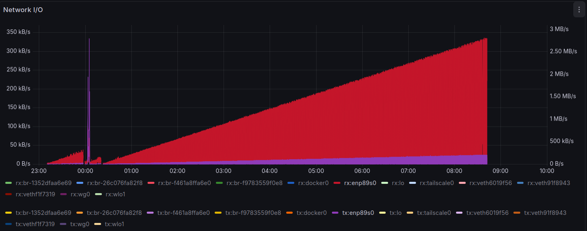

Ever since the new, *more powerful*
[`octavo`](./2025-04-12-kubernetes-homelab-server-with-ubuntu-server-24-04-octavo.md)
replaced the good old
[`lexicon`](./2023-03-25-single-node-kubernetes-cluster-on-ubuntu-server-lexicon.md)
server as the single-node Kubernetes cluster to serve all the local self-hosting needs,
the latter has not found any use. Since it would be a waste to let it sit in a box
unused, it will be setup to join the (for now) single-node cluster that is `octavo` to
enable **Zero Downtime Maintenance**.

<!-- more -->

## The PLN

The first step will be to have `lexicon` join the cluster as a worker node, while
keeping `octavo` as the control plane. Chances are another Intel NUC will join the
cluster later with an intermediate CPU (Intel Core i5) which will bring the total
size of the cluster to the ideal 3: a control plane and two wokers for an
**Active-Passive High Availability** setup.

Nodes with more capable CPU and GPU can be setup to run the more CPU/GPU instensive
workloads, such as Jellyfin (heavy media transcoding), by using **Node Labels** and
**Taints** to ensure high-demand tasks stay on the more capable nodes.

All nodes have direct access to a NAS where all files are available, both NUCs have NVMe
SSDs for the operating system and Kubernetes local persistent volumns, and `octavo` has
an additional 4TB SATA SSD, a capability unlikely to be added to other nodes in the near
future. Keeping Jellyfin running in `octavo` should let it stay using the media files
out of the 4TB SATA SSD rather than using the NAS, while most of audio-only media can be
replicated on the NVMe SSDs.

To handle the diverse storage landscape, two `StorageClasses` will be defined, one for
the NVMe SSD and another one for the *bigger but slower* SATA SSD. For apps that benefit
from faster SSD, `nodeAffinity` can force them onto `octavo`, while `lexicon` is kept 
exclusively for *overflow* or light tasks, with a taint to `lexicon` so that only
specifically *tolerated* pods will schedule on it.

### Potential expansions

There is a distinct possibility that a second high-perf NUC (with an Intel Core i5 CPU)
may be added later. In that case, `lexicon` could be dedicated (mostly) only to run the
control panel, leaving the high-perf NUCs run all the workloads. **Pod Anti-Affinity**
could then be used to ensure that if one of then high-perf nodes goes down, a redundant
copy of critical apps are already running on the second high-perf NUC.

This would then leave `lexicon` as the third Quorum/Control Plane "witness" node, which
would be useful to avoid "split-brain" issues during network partitions. For a 3-node
Kubernetes cluster to be truly stable (HA), it needs a Quorum (a majority vote) to make
decisions. A "witness" node provides this third vote without needing to be powerful.

??? note "Alternative devices considered (and discarded)."

    There is Raspberry Pi 4 currently available but in has only 2GB or RAM, which is not
    enough (too tight) becuase the Kubernetes Control Plane typically takes up to 1.8 GB.
    Instead, an old (2016) retired
    [ASUS Chromebox-M014U](https://www.neobyte.es/mini-pc-asus-chromebox-m014u-i3-4010u-4gb-569.html)
    with a Core i3-4010U CPU, 4 GB of RAM and 16 GB SSD, already running
    [GalliumOS 3.1](https://galliumos.org/download),
    could be enough to run the Control Plane node, but considering the latest release
    of GalliumOS 3.1 was released on 2019-12-22, it doesn't seem fit for this purpose.

If there is a critical hardware failure on `lexicon`, the cluster *degrades* but stays
online, management continues without Fault Tolerance. Applications already running on
worker nodes are unaffected by a control plane failure and will continue to run
normally, but if a worker node also fails while the control plane is degraded (only 1
node left), then Kubernetes cannot "self-heal" by rescheduling those pods to `octavo`
because the "brain" (API server) is inaccessible.

In such event, replacing a failed hardware "witness" is a standard maintenance task:

1.  Remove the failed node from the `etcd` member list using  
    `etcdctl member remove <ID>` from one of the healthy NUCs.
1.  Delete the dead node object from Kubernetes using  
    `kubectl delete node <chromebox-name>`
1.  Bring in a replacement and join it as a new control plane node using  
    `kubeadm join --control-plane`

## Reinstall `lexicon`

[`lexicon`](./2022-07-03-low-effort-homelab-server-with-ubuntu-server-on-intel-nuc.md)
was running Ubuntu Server 22.04 and was upgraded to 24.04 using the `do-release-upgrade`
tool but, although the upgrade went well, it did not fix an old issue that caused the NIC
to slowly become more and more overloaded and slow:



[Installing Ubuntu Server 24.04](https://ubuntu.com/tutorials/install-ubuntu-server)
went smoothly and without any problems, the NUC booted from the USB stick and secure
boot, enabled by default, never presented any problem.

Once the intaller boots, the installation steps are:

1.  Choose language and keyboard layout.
1.  Choose **Ubuntu Server** (default, not *(minimized)*).
    *  Checked the option to *Search for third-party drivers*.
1.  Networking: DHCP on wired network.
    *  The `enp89s0` interface is the NUC's integrated 2.5Gbps NIC (Intel I226-V).
1.  Pick a local Ubuntu mirror to install packages from.
1.  Setup a **Custom storage layout** as follows
    1.  Select the disk (Samsung SSD 970 EVO PLUS 2TB) to **Use As Boot Device**.
        This automatically creates a 1GB partition for `/boot/efi` (formatted as `fat32`).
    1.  Create a 30G partition to mount as `/` (formatted as `ext4`).
    1.  Create a 30G partition to reverse for a future OS.
    1.  Create a 60G partition to mount as `/var/lib` (formatted as `xfs`).
    1.  Create a partition with the remaining space (1.7T) to mount as `/home`
        (formatted as `xfs`).
1.  Confirm partitions & changes.
1.  Set up a Profile: username (`ponder`), hostname (`lexicon`) and password.
1.  Skip Upgrade to Ubuntu Pro (to be done later).
1.  Install OpenSSH server and allow password authentication (for now).
1.  A selection of snap packages is available at this point, none were selected.
1.  Confirm all previous choices and start to **install software**.
1.  Once the installation is complete, remove the UBS stick and hit Enter to reboot.

After the first reboot, the server is setup with the same steps as done for `octavo`:

*   [Disable swap](./2025-04-12-kubernetes-homelab-server-with-ubuntu-server-24-04-octavo.md#disable-swap).

*   [Tweak Bash prompt](./2025-04-12-kubernetes-homelab-server-with-ubuntu-server-24-04-octavo.md#tweak-bash-prompt).

*   [Tweak OpenSSH server](./2025-04-12-kubernetes-homelab-server-with-ubuntu-server-24-04-octavo.md#tweak-network-config) to set the (only) `enp89s0` interface (Intel 2.5GB NIC)
    with the `.6 `addresses with this Netplan configuration:

    ``` yaml title="/etc/netplan/50-cloud-init.yaml" hl_lines="6 10 14 17"
    # Dual static IP on LAN, nothing else.
    network:
      version: 2
      renderer: networkd
      ethernets:
        enp89s0:
          dhcp4: no
          dhcp6: no
          # Ser IP address & subnet mask
          addresses: [ 10.0.0.6/24, 192.168.0.6/24 ]
          # Set default gateway
          routes:
          - to: default
            via: 192.168.0.1  # UniFi router gateway
          # Set DNS name servers
          nameservers:
            addresses: [ 77.109.128.2, 213.144.129.20 ]
    ```

*   [Set correct timezone](./2025-04-12-kubernetes-homelab-server-with-ubuntu-server-24-04-octavo.md#set-correct-timezone).

*   [Update system packages](./2025-04-12-kubernetes-homelab-server-with-ubuntu-server-24-04-octavo.md#update-system-packages).

*   [Upgrade to Ubuntu Pro](./2025-04-12-kubernetes-homelab-server-with-ubuntu-server-24-04-octavo.md#upgrade-to-ubuntu-pro).

*   [Stop `apparmor` spew in the logs](./2025-04-12-kubernetes-homelab-server-with-ubuntu-server-24-04-octavo.md#stop-apparmor-spew-in-the-logs).

*   [Mount the NAS NFS](./2025-04-12-kubernetes-homelab-server-with-ubuntu-server-24-04-octavo.md#nas-nfs-mount).

*   [Install Continuous Monitoring](../../projects/conmon.md#install-conmon).

*   Setup Remote Access:
    [Cloudflare Tunnel](./2025-04-12-kubernetes-homelab-server-with-ubuntu-server-24-04-octavo.md#cloudflare-tunnel)
    and
    [Tailscale](./2025-04-12-kubernetes-homelab-server-with-ubuntu-server-24-04-octavo.md#tailscale).

### Update to HWE 6.14 kernel

While the Intel 11th Gen hardware does not require the absolute latest kernel, having
both nodes on the same major kernel branch (e.g. 6.14) simplifies troubleshooting and
ensures CNI and networking features behave identically across the cluster.

Once the system is upgraded to Ubuntu 24.04, switching the kernel is as easy as
`apt install linux-generic-hwe-24.04` and it even becomes the new default kernel in GRUB:

??? terminal "`# apt install linux-generic-hwe-24.04 -y`"

    ``` console
    # apt install linux-generic-hwe-24.04 -y
    Reading package lists... Done
    Building dependency tree... Done
    Reading state information... Done
    The following additional packages will be installed:
      libdebuginfod-common libdebuginfod1t64 linux-headers-6.14.0-37-generic linux-headers-generic-hwe-24.04
      linux-hwe-6.14-headers-6.14.0-37 linux-hwe-6.14-tools-6.14.0-37 linux-image-6.14.0-37-generic
      linux-image-generic-hwe-24.04 linux-modules-6.14.0-37-generic linux-modules-extra-6.14.0-37-generic
      linux-tools-6.14.0-37-generic
    Suggested packages:
      linux-hwe-6.14-tools
    The following NEW packages will be installed:
      libdebuginfod-common libdebuginfod1t64 linux-generic-hwe-24.04 linux-headers-6.14.0-37-generic
      linux-headers-generic-hwe-24.04 linux-hwe-6.14-headers-6.14.0-37 linux-hwe-6.14-tools-6.14.0-37
      linux-image-6.14.0-37-generic linux-image-generic-hwe-24.04 linux-modules-6.14.0-37-generic
      linux-modules-extra-6.14.0-37-generic linux-tools-6.14.0-37-generic
    0 upgraded, 12 newly installed, 0 to remove and 6 not upgraded.
    Need to get 0 B/199 MB of archives.
    After this operation, 320 MB of additional disk space will be used.
    Preconfiguring packages ...
    Selecting previously unselected package libdebuginfod-common.
    (Reading database ... 87562 files and directories currently installed.)
    Preparing to unpack .../00-libdebuginfod-common_0.190-1.1ubuntu0.1_all.deb ...
    Unpacking libdebuginfod-common (0.190-1.1ubuntu0.1) ...
    Selecting previously unselected package libdebuginfod1t64:amd64.
    Preparing to unpack .../01-libdebuginfod1t64_0.190-1.1ubuntu0.1_amd64.deb ...
    Unpacking libdebuginfod1t64:amd64 (0.190-1.1ubuntu0.1) ...
    Selecting previously unselected package linux-modules-6.14.0-37-generic.
    Preparing to unpack .../02-linux-modules-6.14.0-37-generic_6.14.0-37.37~24.04.1_amd64.deb ...
    Unpacking linux-modules-6.14.0-37-generic (6.14.0-37.37~24.04.1) ...
    Selecting previously unselected package linux-image-6.14.0-37-generic.
    Preparing to unpack .../03-linux-image-6.14.0-37-generic_6.14.0-37.37~24.04.1_amd64.deb ...
    Unpacking linux-image-6.14.0-37-generic (6.14.0-37.37~24.04.1) ...
    Selecting previously unselected package linux-modules-extra-6.14.0-37-generic.
    Preparing to unpack .../04-linux-modules-extra-6.14.0-37-generic_6.14.0-37.37~24.04.1_amd64.deb ...
    Unpacking linux-modules-extra-6.14.0-37-generic (6.14.0-37.37~24.04.1) ...
    Selecting previously unselected package linux-image-generic-hwe-24.04.
    Preparing to unpack .../05-linux-image-generic-hwe-24.04_6.14.0-37.37~24.04.1_amd64.deb ...
    Unpacking linux-image-generic-hwe-24.04 (6.14.0-37.37~24.04.1) ...
    Selecting previously unselected package linux-hwe-6.14-headers-6.14.0-37.
    Preparing to unpack .../06-linux-hwe-6.14-headers-6.14.0-37_6.14.0-37.37~24.04.1_all.deb ...
    Unpacking linux-hwe-6.14-headers-6.14.0-37 (6.14.0-37.37~24.04.1) ...
    Selecting previously unselected package linux-headers-6.14.0-37-generic.
    Preparing to unpack .../07-linux-headers-6.14.0-37-generic_6.14.0-37.37~24.04.1_amd64.deb ...
    Unpacking linux-headers-6.14.0-37-generic (6.14.0-37.37~24.04.1) ...
    Selecting previously unselected package linux-headers-generic-hwe-24.04.
    Preparing to unpack .../08-linux-headers-generic-hwe-24.04_6.14.0-37.37~24.04.1_amd64.deb ...
    Unpacking linux-headers-generic-hwe-24.04 (6.14.0-37.37~24.04.1) ...
    Selecting previously unselected package linux-generic-hwe-24.04.
    Preparing to unpack .../09-linux-generic-hwe-24.04_6.14.0-37.37~24.04.1_amd64.deb ...
    Unpacking linux-generic-hwe-24.04 (6.14.0-37.37~24.04.1) ...
    Selecting previously unselected package linux-hwe-6.14-tools-6.14.0-37.
    Preparing to unpack .../10-linux-hwe-6.14-tools-6.14.0-37_6.14.0-37.37~24.04.1_amd64.deb ...
    Unpacking linux-hwe-6.14-tools-6.14.0-37 (6.14.0-37.37~24.04.1) ...
    Selecting previously unselected package linux-tools-6.14.0-37-generic.
    Preparing to unpack .../11-linux-tools-6.14.0-37-generic_6.14.0-37.37~24.04.1_amd64.deb ...
    Unpacking linux-tools-6.14.0-37-generic (6.14.0-37.37~24.04.1) ...
    Setting up libdebuginfod-common (0.190-1.1ubuntu0.1) ...
    Setting up linux-hwe-6.14-headers-6.14.0-37 (6.14.0-37.37~24.04.1) ...
    Setting up linux-modules-6.14.0-37-generic (6.14.0-37.37~24.04.1) ...
    Setting up linux-headers-6.14.0-37-generic (6.14.0-37.37~24.04.1) ...
    Setting up libdebuginfod1t64:amd64 (0.190-1.1ubuntu0.1) ...
    Setting up linux-image-6.14.0-37-generic (6.14.0-37.37~24.04.1) ...
    I: /boot/vmlinuz is now a symlink to vmlinuz-6.14.0-37-generic
    I: /boot/initrd.img is now a symlink to initrd.img-6.14.0-37-generic
    Setting up linux-modules-extra-6.14.0-37-generic (6.14.0-37.37~24.04.1) ...
    Setting up linux-headers-generic-hwe-24.04 (6.14.0-37.37~24.04.1) ...
    Setting up linux-hwe-6.14-tools-6.14.0-37 (6.14.0-37.37~24.04.1) ...
    Setting up linux-image-generic-hwe-24.04 (6.14.0-37.37~24.04.1) ...
    Setting up linux-generic-hwe-24.04 (6.14.0-37.37~24.04.1) ...
    Setting up linux-tools-6.14.0-37-generic (6.14.0-37.37~24.04.1) ...
    Processing triggers for man-db (2.12.0-4build2) ...
    Processing triggers for libc-bin (2.39-0ubuntu8.6) ...
    Processing triggers for linux-image-6.14.0-37-generic (6.14.0-37.37~24.04.1) ...
    /etc/kernel/postinst.d/initramfs-tools:
    update-initramfs: Generating /boot/initrd.img-6.14.0-37-generic
    /etc/kernel/postinst.d/zz-update-grub:
    Sourcing file `/etc/default/grub'
    Generating grub configuration file ...
    Found linux image: /boot/vmlinuz-6.14.0-37-generic
    Found initrd image: /boot/initrd.img-6.14.0-37-generic
    Found linux image: /boot/vmlinuz-6.8.0-94-generic
    Found initrd image: /boot/initrd.img-6.8.0-94-generic
    Warning: os-prober will not be executed to detect other bootable partitions.
    Systems on them will not be added to the GRUB boot configuration.
    Check GRUB_DISABLE_OS_PROBER documentation entry.
    Adding boot menu entry for UEFI Firmware Settings ...
    done
    Scanning processes...                                                                                        
    Scanning candidates...                                                                                       
    Scanning processor microcode...                                                                              
    Scanning linux images...                                                                                     

    Pending kernel upgrade!
    Running kernel version:
      6.8.0-94-generic
    Diagnostics:
      The currently running kernel version is not the expected kernel version 6.14.0-37-generic.

    Restarting the system to load the new kernel will not be handled automatically, so you should consider
    rebooting.

    The processor microcode seems to be up-to-date.

    Restarting services...

    Service restarts being deferred:
    /etc/needrestart/restart.d/dbus.service
    systemctl restart getty@tty1.service
    systemctl restart systemd-logind.service
    systemctl restart unattended-upgrades.service
    systemctl restart wpa_supplicant.service

    No containers need to be restarted.

    User sessions running outdated binaries:
    root @ session #1: sshd[913]
    root @ session #4: sshd[1153]
    root @ user manager service: systemd[918]

    No VM guests are running outdated hypervisor (qemu) binaries on this host.
    ```

Check what the new default kernel is to make sure it is the newer one:

``` console
# awk -F"'" '/menuentry / && /with Linux/ {print i++ " : " $2}' \
  /boot/grub/grub.cfg
0 : Ubuntu, with Linux 6.14.0-37-generic
1 : Ubuntu, with Linux 6.14.0-37-generic (recovery mode)
2 : Ubuntu, with Linux 6.8.0-90-generic
3 : Ubuntu, with Linux 6.8.0-90-generic (recovery mode)
```

**Reboot the server to load the new kernel now.**

## Kubernetes

[Kubernetes on Raspberry Pi 5 (`alfred`)](./2025-02-22-home-assistant-on-kubernetes-on-raspberry-pi-5-alfred.md#kubernetes)
showed quite a few *new hurdles* caused by newer versions of Kubernetes (v1.32.2) and
a few components, but now those have been deprecated, so that following the installation
process from `octavo` is good enough of a guide.

[Storage Requirements](./2025-04-12-kubernetes-homelab-server-with-ubuntu-server-24-04-octavo.md#storage-requirements)
are satisfaied in the same way by having similar partitions setup.

[Install Helm](./2025-04-12-kubernetes-homelab-server-with-ubuntu-server-24-04-octavo.md#install-helm)
(via `apt`) and then
[install Kubernetes](./2025-04-12-kubernetes-homelab-server-with-ubuntu-server-24-04-octavo.md#install-kubernetes)
(also via `apt`); install Kubernetes version
[**v1.34.3** which is the one running at the moment in the cluster](./2026-01-10-upgrading-single-node-kubernetes-cluster-on-ubuntu-studio-24-04-octavo.md#upgrade-to-134):

``` console hl_lines="7"
# kubectl version --output=yaml
clientVersion:
  buildDate: "2025-12-09T15:06:39Z"
  compiler: gc
  gitCommit: df11db1c0f08fab3c0baee1e5ce6efbf816af7f1
  gitTreeState: clean
  gitVersion: v1.34.3
  goVersion: go1.24.11
  major: "1"
  minor: "34"
  platform: linux/amd64
kustomizeVersion: v5.7.1

The connection to the server localhost:8080 was refused - did you specify the right host or port?
```

Finally,
[install container runtime](./2025-04-12-kubernetes-homelab-server-with-ubuntu-server-24-04-octavo.md#install-container-runtime)
and Kubernetes is ready to be initialized.

### Bootstrap with `kubeadm`

[Adding Linux worker nodes](https://kubernetes.io/docs/tasks/administer-cluster/kubeadm/adding-linux-nodes/)
is the next big step towards upgrading the single-node cluster to a multi-node cluster,
so here is where the setup of this node (`lexicon`) diverges from that of the first node
(`octavo`).

#### Join as worker node

Having initialized the cluster originally in `octavo` with
[`kubeadm init`](./2025-04-12-kubernetes-homelab-server-with-ubuntu-server-24-04-octavo.md#initialize-the-control-plane), the first step is to obtain a fresh token to join the
customer (this token expires in 24 hours):

``` console
$ kubeadm token create --print-join-command
kubeadm join 10.0.0.8:6443 \
  --token ivpct4.7piqcgw68ng77kn5 \
  --discovery-token-ca-cert-hash \
  sha256:18d968e92516e1a2808166d90a7d7c8b6f7b37cbac6328c49793863f9ae2b982 
```

Then run that command on the new node:

``` console
# kubeadm join 10.0.0.8:6443 \
  --token a0vi2t.rhxs1cc2rkicpeu0 \
  --discovery-token-ca-cert-hash \
  sha256:18d968e92516e1a2808166d90a7d7c8b6f7b37cbac6328c49793863f9ae2b982
[preflight] Running pre-flight checks
[preflight] Reading configuration from the "kubeadm-config" ConfigMap in namespace "kube-system"...
[preflight] Use 'kubeadm init phase upload-config kubeadm --config your-config-file' to re-upload it.
[kubelet-start] Writing kubelet configuration to file "/var/lib/kubelet/instance-config.yaml"
[patches] Applied patch of type "application/strategic-merge-patch+json" to target "kubeletconfiguration"
[kubelet-start] Writing kubelet configuration to file "/var/lib/kubelet/config.yaml"
[kubelet-start] Writing kubelet environment file with flags to file "/var/lib/kubelet/kubeadm-flags.env"
[kubelet-start] Starting the kubelet
[kubelet-check] Waiting for a healthy kubelet at http://127.0.0.1:10248/healthz. This can take up to 4m0s
[kubelet-check] The kubelet is healthy after 504.313399ms
[kubelet-start] Waiting for the kubelet to perform the TLS Bootstrap

This node has joined the cluster:
* Certificate signing request was sent to apiserver and a response was received.
* The Kubelet was informed of the new secure connection details.

Run 'kubectl get nodes' on the control-plane to see this node join the cluster.

```

After a few seconds the new node is ready:

``` console
$ kubectl get nodes
NAME      STATUS   ROLES           AGE    VERSION
lexicon   Ready    <none>          42s    v1.34.3
octavo    Ready    control-plane   281d   v1.34.3
```

#### Temporary `cordon`

Even if the new node is *ready to run* pods, it is not yet ready to satisfy all their
requirements yet; even though all the `hostPath` volumes have been migrated to
[Longhorn](./2026-01-25-migrating-kubernetes-volumes-to-longhorn.md), they are not yet
replicated to the new node.

To avoid having pods scheduled in the new node before everything is ready, temporarily
cordon it:

``` console hl_lines="6"
$ kubectl cordon lexicon
node/lexicon cordoned

$ kubectl get nodes -o wide
NAME      STATUS                     ROLES           AGE    VERSION   INTERNAL-IP   EXTERNAL-IP   OS-IMAGE             KERNEL-VERSION      CONTAINER-RUNTIME
lexicon   Ready,SchedulingDisabled   <none>          19h    v1.34.3   192.168.0.6   <none>        Ubuntu 24.04.3 LTS   6.14.0-37-generic   containerd://2.2.1
octavo    Ready                      control-plane   282d   v1.34.3   192.168.0.8   <none>        Ubuntu 24.04.3 LTS   6.14.0-37-generic   containerd://2.2.1
```

#### Setup `kubectl` access

To run `kubectl` as a non-root user, copy the Kubernetes config file under the
`~/.kube` directory from the currento node to the new one:

``` console
$ scp -r .kube/ lexicon:
```

And with that all the `kubectl` commands work:

``` console
$ kubectl get nodes
NAME      STATUS   ROLES           AGE     VERSION
lexicon   Ready    <none>          4m53s   v1.34.3
octavo    Ready    control-plane   281d    v1.34.3

$ kubectl cluster-info
Kubernetes control plane is running at https://10.0.0.8:6443
CoreDNS is running at https://10.0.0.8:6443/api/v1/namespaces/kube-system/services/kube-dns:dns/proxy

To further debug and diagnose cluster problems, use 'kubectl cluster-info dump'.
```

### Default pod distribution

After joining the cluster as a worker node, infrastructure components will behave
differently depending on how they were deployed (`DaemonSets` vs. `Deployments`).

Resources deployed as a `DaemonSet` will immediately spawn a pod on the new node, so
these are the components that will run on `lexicon` automatically:

*   **Flannel**: `kube-flannel` pod will start to establish the pod network on `lexicon`.
*   **MetalLB**: The speaker pods will start and `lexicon` will be able to respond to ARP
    requests for `LoadBalancer` IPs (once it settles).
*   **Longhorn**: the `longhorn-manager` and `csi-plugin` pods will start and Longhorn
    will detect the new 2TB SSD if the Node Labeling Job running or after the node is
    manually labeled.
*   **Intel Device Plugin**: this is an *operator-managed* `DaemonSet`, so it will
    detect the GPU and make it available for hardware transcoding (e.g., in Jellyfin).
*   **Prometheus**: a `DaemonSet` running as part of the
    [Trivy Operator Dashboard in Grafana](./2025-12-21-monitoring-a-kubernetes-cluster-for-vulnerabilities.md#trivy-operator-dashboard-in-grafana).

??? terminal "`kubectl get daemonsets.apps -A`"

    ``` console
    $ kubectl get daemonsets.apps -A
    NAMESPACE                  NAME                               DESIRED   CURRENT   READY   UP-TO-DATE   AVAILABLE   NODE SELECTOR                               AGE
    intel-device-plugins-gpu   intel-gpu-plugin-gpudeviceplugin   1         1         1       1            1           intel.feature.node.kubernetes.io/gpu=true   277d
    kube-flannel               kube-flannel-ds                    1         1         1       1            1           <none>                                      281d
    kube-system                csi-nfs-node                       1         1         1       1            1           kubernetes.io/os=linux                      8d
    kube-system                kube-proxy                         1         1         1       1            1           kubernetes.io/os=linux                      281d
    longhorn-system            engine-image-ei-ff1cedad           1         1         1       1            1           <none>                                      2d20h
    longhorn-system            longhorn-csi-plugin                1         1         1       1            1           <none>                                      2d20h
    longhorn-system            longhorn-manager                   1         1         1       1            1           <none>                                      7d5h
    metallb-system             metallb-speaker                    1         1         1       1            1           kubernetes.io/os=linux                      44h
    monitoring                 prom-prometheus-node-exporter      1         1         1       1            1           kubernetes.io/os=linux                      42d
    node-feature-discovery     node-feature-discovery-worker      1         1         1       1            1           <none>                                      277d
    ```

Resources deployed as `Deployments` (single-replica so far) or `StatefulSets` will stay
running only on on `octavo`. Most of these will need to be scaled up to 2+ replicas
before a pod is started on `lexicon`, with a few notable exceptions:

*   **CoreDNS**: Has 2 replicas; Kubernetes will likely move one to `lexicon` to balance
    the load.
*   **Longhorn UI/Controller**: These central "brains" stay on `octavo`.

??? terminal "`kubectl get deployments.apps -A; kubectl get statefulsets.apps -A`"

    ``` console
    $ kubectl get deployments.apps -A 
    NAMESPACE                  NAME                                    READY   UP-TO-DATE   AVAILABLE   AGE
    audiobookshelf             audiobookshelf                          1/1     1            1           279d
    cert-manager               cert-manager                            1/1     1            1           281d
    cert-manager               cert-manager-cainjector                 1/1     1            1           281d
    cert-manager               cert-manager-webhook                    1/1     1            1           281d
    cert-manager               cert-manager-webhook-porkbun            1/1     1            1           15d
    code-server                code-server                             1/1     1            1           276d
    default                    ddns-updater                            1/1     1            1           129d
    firefly-iii                firefly-iii                             1/1     1            1           276d
    firefly-iii                firefly-iii-mysql                       1/1     1            1           276d
    home-assistant             home-assistant                          1/1     1            1           280d
    homepage                   homepage                                1/1     1            1           31d
    intel-device-plugins-gpu   inteldeviceplugins-controller-manager   1/1     1            1           277d
    komga                      komga                                   1/1     1            1           279d
    kube-system                coredns                                 2/2     2            2           281d
    kube-system                csi-nfs-controller                      1/1     1            1           8d
    kube-system                headlamp                                1/1     1            1           22h
    kube-system                snapshot-controller                     1/1     1            1           8d
    kubernetes-dashboard       kubernetes-dashboard-api                1/1     1            1           281d
    kubernetes-dashboard       kubernetes-dashboard-auth               1/1     1            1           281d
    kubernetes-dashboard       kubernetes-dashboard-kong               1/1     1            1           281d
    kubernetes-dashboard       kubernetes-dashboard-metrics-scraper    1/1     1            1           281d
    kubernetes-dashboard       kubernetes-dashboard-web                1/1     1            1           281d
    longhorn-system            csi-attacher                            3/3     3            3           2d22h
    longhorn-system            csi-provisioner                         3/3     3            3           2d22h
    longhorn-system            csi-resizer                             3/3     3            3           2d22h
    longhorn-system            csi-snapshotter                         3/3     3            3           2d22h
    longhorn-system            longhorn-driver-deployer                1/1     1            1           7d8h
    longhorn-system            longhorn-ui                             2/2     2            2           7d8h
    media-center               jellyfin                                1/1     1            1           278d
    metallb-system             metallb-controller                      1/1     1            1           46h
    monitoring                 grafana                                 1/1     1            1           280d
    monitoring                 influxdb                                1/1     1            1           280d
    monitoring                 prom-kube-prometheus-stack-operator     1/1     1            1           42d
    monitoring                 prom-kube-state-metrics                 1/1     1            1           42d
    monitoring                 trivy-operator-dashboard                1/1     1            1           42d
    monitoring                 version-checker                         1/1     1            1           42d
    navidrome                  navidrome                               1/1     1            1           279d
    node-feature-discovery     node-feature-discovery-gc               1/1     1            1           278d
    node-feature-discovery     node-feature-discovery-master           1/1     1            1           278d
    pomerium                   pomerium                                1/1     1            1           45d
    ryot                       postgres                                1/1     1            1           227d
    ryot                       ryot                                    1/1     1            1           227d
    tailscale                  operator                                1/1     1            1           281d
    trivy-system               trivy-operator                          1/1     1            1           42d
    unifi                      mongo                                   1/1     1            1           276d
    unifi                      unifi                                   1/1     1            1           276d

    $ kubectl get statefulsets.apps -A 
    NAMESPACE        NAME                                                   READY   AGE
    monitoring       alertmanager-prom-kube-prometheus-stack-alertmanager   1/1     42d
    monitoring       prometheus-prom-kube-prometheus-stack-prometheus       1/1     42d
    steam-headless   steam-headless                                         0/0     188d
    tailscale        ts-home-assistant-tailscale-mdqlt                      1/1     280d
    tailscale        ts-kubernetes-dashboard-ingress-tailscale-jhb6z        1/1     281d
    ```

### Longhorn

Longhorn needs to know the new node is ready for data; to activate Longhorn storage on
the new node it need to be labeled:

``` console
# kubectl label node lexicon node.longhorn.io/create-default-disk=true
node/lexicon labeled
```

Once the node is labeled, the Longhorn UI will immediately show that the node now has one
disk (`/home/longhorn`). The new disk will not automatically get any **Disk Tag** so the
`nvme` must be manually added so that the disk fits the `longhorn-nmve` storage class.

Once the node is ready and the 2TB SSD disk is ready and tagged, existing volumes can be
*rescaled* up by increasint the value of `numberOfReplicas` in the relevant volumes or
even on the `longhorn-nmve` storage class:

``` console
$ kubectl patch storageclass longhorn-nvme --type merge \
  -p '{"parameters":{"numberOfReplicas":"2"}}'
```

This can also be done by updating y reapplying the `longhorn-storage.yaml` manifest
created when 
[migratng `hostPaht` volumes to Longhorn](./2026-01-25-migrating-kubernetes-volumes-to-longhorn.md):

!!! k8s "`longhorn-storage.yaml`"

    ``` yaml hl_lines="8"
    apiVersion: storage.k8s.io/v1
    kind: StorageClass
    metadata:
      name: longhorn-nvme
    provisioner: driver.longhorn.io
    allowVolumeExpansion: true
    parameters:
      numberOfReplicas: "2"
      diskSelector: "nvme"
      dataLocality: "best-effort"
    ---
    apiVersion: storage.k8s.io/v1
    kind: StorageClass
    metadata:
      name: longhorn-sata
    provisioner: driver.longhorn.io
    allowVolumeExpansion: true
    parameters:
      numberOfReplicas: "1"
      diskSelector: "sata"
      dataLocality: "best-effort"
    ```

However, one does not simply *modify* a `StorageClass`:

``` console
$ kubectl apply -f longhorn-storage.yaml
The StorageClass "longhorn-nvme" is invalid: parameters: Forbidden: updates to parameters are forbidden.
```

Instead, the `StorageClass` must be deleted, then recreated anew; this does not affect
existing volumes, only those that are created later:

``` console
$ kubectl delete storageclass longhorn-nvme
storageclass.storage.k8s.io "longhorn-nvme" deleted

$ kubectl apply -f longhorn-storage.yaml 
storageclass.storage.k8s.io/longhorn-nvme created
storageclass.storage.k8s.io/longhorn-sata unchanged
```

Since this does not affect existing volumes, Longhorn will not immediately start
replicating the volumes from `octavo` to `lexicon`; this needs to be done manually for
each existing volume by `patch`ing it; with the caveat that volumes on the SATA SSD are
**not** to be replicated:

``` console
$ kubectl get volumes.longhorn.io -n longhorn-system -o json \
| jq -r '.items[] | select(.spec.numberOfReplicas==1 and (.spec.diskSelector | contains(["nvme"]))) | .metadata.name' \
| xargs -I {} kubectl -n longhorn-system patch volumes.longhorn.io {} \
  --type merge -p '{"spec":{"numberOfReplicas":2}}'
volume.longhorn.io/pvc-0c892178-0451-4043-be76-9e2e33464631 patched
volume.longhorn.io/pvc-1083fedd-27e9-4a58-8a8f-6b8553d62034 patched
volume.longhorn.io/pvc-17d73e68-4c5a-4f34-b5dc-89936202d8d7 patched
volume.longhorn.io/pvc-1d7dc891-4694-4744-be75-6ab12c11aea9 patched
volume.longhorn.io/pvc-2610bf0b-0c90-4ecb-956c-355d8619dbe4 patched
volume.longhorn.io/pvc-2b72de1d-93d8-492e-aed1-1708a35ce5b4 patched
volume.longhorn.io/pvc-2e7cd0bd-6efe-4e8b-ae81-a025b447a7f9 patched
volume.longhorn.io/pvc-43916c81-6e07-4eae-92e4-e37b816c407c patched
volume.longhorn.io/pvc-495872f3-cf95-4268-b3ea-2f4d51d33399 patched
volume.longhorn.io/pvc-5c724ff5-e7dd-483b-9450-0b8e299c49ca patched
volume.longhorn.io/pvc-5dd1e736-b80b-43a8-9570-95a3637cff4d patched
volume.longhorn.io/pvc-6250f010-4a0b-4ac5-83a6-07cf71d95b33 patched
volume.longhorn.io/pvc-726c1b2d-c0c0-4232-85f5-b3119558d0d1 patched
volume.longhorn.io/pvc-72741e77-c05c-4b84-b74d-bddcf32a2236 patched
volume.longhorn.io/pvc-7ae11ade-d6c8-4296-ac67-58953e3dddc2 patched
volume.longhorn.io/pvc-aea4a7e9-baf0-4fbc-ba5f-7007a66fcef6 patched
volume.longhorn.io/pvc-e3f04fc3-9126-43d6-82c0-c427a730b338 patched
volume.longhorn.io/pvc-fd8bb4e8-39a4-4b7f-a3c5-668333e4d64a patched
```

Doing this will result in all those volumes going from **Healthy** to **Degraded**.
Because `lexicon` was previously *cordoned* to avoid pods running on it before the
volumes were ready, this also means the Kubernetes scheduler (and by extension the
Longhorn scheduler) is forbidden from starting the **Replica Instance Manager** pods;
so now is the time to uncordon `lexicon`.

``` console
$ kubectl uncordon lexicon 
node/lexicon already uncordoned
```

This launches Longhorn into *an I/O frenzy* to replicate all those volumes and keeps the
2.5 Gbps NICs at their maximum throughput for 8 minutes to replicate about 250 GB first,
then stays at nearly the maximum for over an hour to finish replicating the last volume,
much larger than the rest, until eventually all volumes are **Healthy** again.

### Intel GPU

Support for the Intel GPU works automatically when joining the node:

``` console hl_lines="6-9 13-14 22-23 38-39"
$ kubectl describe node lexicon
Name:               lexicon
Roles:              <none>
Labels:             beta.kubernetes.io/arch=amd64
                    ...
                    gpu.intel.com/device-id.0300-9a78.count=1
                    gpu.intel.com/device-id.0300-9a78.present=true
                    intel.feature.node.kubernetes.io/gpu=true
...
Capacity:
  cpu:                            4
  ephemeral-storage:              61376Mi
  gpu.intel.com/i915:             1
  gpu.intel.com/i915_monitoring:  1
  hugepages-1Gi:                  0
  hugepages-2Mi:                  0
  memory:                         32484920Ki
  pods:                           110
Allocatable:
  cpu:                            4
  ephemeral-storage:              57921660423
  gpu.intel.com/i915:             1
  gpu.intel.com/i915_monitoring:  1
  hugepages-1Gi:                  0
  hugepages-2Mi:                  0
  memory:                         32382520Ki
  pods:                           110
...
Allocated resources:
  (Total limits may be over 100 percent, i.e., overcommitted.)
  Resource                       Requests    Limits
  --------                       --------    ------
  cpu                            655m (16%)  100m (2%)
  memory                         219Mi (0%)  1102Mi (3%)
  ephemeral-storage              0 (0%)      0 (0%)
  hugepages-1Gi                  0 (0%)      0 (0%)
  hugepages-2Mi                  0 (0%)      0 (0%)
  gpu.intel.com/i915             0           0
  gpu.intel.com/i915_monitoring  0           0
```

#### Logs reader helper

Troubleshooting pods and services often involves reading or *watching* the logs, which
involves combining two `kubectl` commands to find the relevant pod/service and
requesting the logs. To make this easier, save the following script as `~/bin/klogs`
(and add `~/bin/` to the `$PATH`):

``` bash title="bin/klogs"
#!/bin/bash
#
# Watch logs from Kubernetes pod/service.
#
# Usage: klogs <namespace> <pod/service>

ns=$1
pd=$2
if [[ "$pd" == "" ]]; then pd="$ns"; fi
kubectl logs -n $ns \
  $(kubectl get pods -n $ns | grep $pd | cut -f1 -d' ') -f
```

### Headlamp

[Kubernetes Dashboard](https://github.com/kubernetes-retired/dashboard?tab=readme-ov-file#kubernetes-dashboard)
was deprecated and archived in January 2026, and is no longer
maintained due to lack of active maintainers and contributors.
[Headlamp](./2025-04-12-kubernetes-homelab-server-with-ubuntu-server-24-04-octavo.md#new-in-2026-headlamp)
is the suggested replacement and was already
[deployed in `octavo`](./2025-04-12-kubernetes-homelab-server-with-ubuntu-server-24-04-octavo.md#new-in-2026-headlamp)
using its Helm chart.

### Metrics Server

[Skooner](https://github.com/skooner-k8s/skooner?tab=readme-ov-file#skooner---kubernetes-dashboard)
was briefly installed and it relied heavily on the
[Kubernetes Metrics Server](https://github.com/kubernetes-sigs/metrics-server?tab=readme-ov-file#kubernetes-metrics-server)
to display real-time cluster metrics. Although Skooner was later removed (it has been
abandoned for 5 years), `metrics-server` turned out necessary also for many of the
Grafana dashboards installed previously to
[monitor the cluster for vulnerabilities](./2025-12-21-monitoring-a-kubernetes-cluster-for-vulnerabilities.md).

When installed using
[its Helm chart](https://artifacthub.io/packages/helm/metrics-server/metrics-server),
it uses by default a self-signed certificate which is generated during startup and the
`APIservice` resource is registered with `.spec.insecureSkipTLSVerify` set to `true`.
Although ideally `metrics-server` can be kept more secure by using the `cert-manager`
that is available in the cluster, in a homelab environment this is typically avoided.

!!! k8s "`metrics-server-values.yaml`"

    ``` yaml
    apiService:
      insecureSkipTLSVerify: false
    defaultArgs:
      - --kubelet-insecure-tls
      - --kubelet-preferred-address-types=InternalIP
    replicas: 2
    ```

??? note "Skipping TLS verification is the standard setup for homelabs, not production!"

    In a homelab environment without its own DNS server, nodes hostnames are not
    resolvable via DNS, making the `InternalIP` the only way Metrics Server can reach
    the nodes. However, `kubeadm` generates self-signed certificates for Kubelets that
    do not include IP **SANs** by default, which causes the TLS verification failure
    when trying to use certificates; metric-server pods would fail with:

    ``` console
    $ kubectl -n kube-system logs metrics-server-fd5dc6448-f2fkm
    ...
    E0204 22:02:20.935565       1 scraper.go:149] "Failed to scrape node" err="Get \"https://192.168.0.6:10250/metrics/resource\": tls: failed to verify certificate: x509: cannot validate certificate for 192.168.0.6 because it doesn't contain any IP SANs" node="lexicon"
    E0204 22:02:20.943097       1 scraper.go:149] "Failed to scrape node" err="Get \"https://192.168.0.8:10250/metrics/resource\": tls: failed to verify certificate: x509: cannot validate certificate for 192.168.0.8 because it doesn't contain any IP SANs" node="octavo"
    ```

    The most common solution in environments without internal DNS is to tell Metrics
    Server to **skip TLS verification** when connecting to the Kubelet; this is what
    the `defaultArgs` flags above do: disable CA verification for the node certificate
    and force Metrics Server to use the IP directly instead of DNS.

    To enable secure between the Metrics Server and the kubelets, these need to have
    Server Certificate Bootstrapping enabled. This allows Kubelets to request
    certificates signed by the cluster CA that include the correct IP SANs:

    1.  **Enable Server TLS Bootstrapping**: update `/var/lib/kubelet/config.yaml` on
        each node to include `serverTLSBootstrap: true` and then restart the service
        with `systemctl restart kubelet`.

    2.  **Approve the CSRs**: Kubelet will generate a Certificate Signing Request on
        each node and these must be approved manually:

        ``` console
        $ kubectl get csr
        $ kubectl certificate approve <csr-name>
        ```

    3.  **Update Metrics Server**: Once nodes have valid certificates, point Metrics
        Server to the cluster's CA:

        ``` yaml
        apiService:
          insecureSkipTLSVerify: false
        replicas: 2
        args:
          - --kubelet-certificate-authority=/etc/kubernetes/pki/ca.crt
          - --kubelet-preferred-address-types=InternalIP
        ```

Install the Helm chart and then install `metrics-server` with the above values:

``` console
$ helm repo add metrics-server https://kubernetes-sigs.github.io/metrics-server/

$ helm repo update
Hang tight while we grab the latest from your chart repositories...
...
...Successfully got an update from the "metrics-server" chart repository
...
Update Complete. ⎈Happy Helming!⎈

$ helm upgrade --install \
  metrics-server metrics-server/metrics-server \
  --namespace=kube-system \
  --values=metrics-server-values.yaml
Release "metrics-server" does not exist. Installing it now.
NAME: metrics-server
LAST DEPLOYED: Wed Feb  4 23:00:32 2026
NAMESPACE: kube-system
STATUS: deployed
REVISION: 1
TEST SUITE: None
NOTES:
***********************************************************************
* Metrics Server                                                      *
***********************************************************************
  Chart version: 3.13.0
  App version:   0.8.0
  Image tag:     registry.k8s.io/metrics-server/metrics-server:v0.8.0
***********************************************************************
```

### Node Affinity

To ensure specific workloads remain on the primary node unless it goes down, use
**Node Affinity** with a preferred rule based on node labels. First, label the nodes
according to the relevant properties for the node affinity preferences; in this case
start with a "performance level":

``` console
$ kubectl label node lexicon node-type=low-perf
node/lexicon labeled
$ kubectl label node octavo node-type=high-perf
node/octavo labeled
```

To apply a *preferred affinity*, use `preferredDuringSchedulingIgnoredDuringExecution` in
each `Deployment` manifest to set the preference for the node with the required label
value (e.g. `node-type=high-perf`). The scheduler will then always place the pod on the
*high-perf* node if it is available. If the high-perf node goes down, the scheduler will
allow the pod to be scheduled on other nodes because the rule is "preferred" rather than
"required". 

Adding the `affinity` block to a Deployment's `spec.template.spec` can be done as a
*Hard Rule* (Required) or as a *Soft Rule* (Preferred).

Jellyfin **must** run on `octavo`, not only to use the Core i7 CPU but also to use the
4TB SATA SSD. If `octavo` is down, the pod will stay in a `Pending` state and will not
start on `lexicon` or other nodes without their a local replica of the relevant volumes:

!!! k8s "`jellyfin.yaml`"

    ``` yaml hl_lines="16-24"
    apiVersion: apps/v1
    kind: Deployment
    metadata:
      name: jellyfin
      namespace: media-center
    spec:
      replicas: 1
      selector:
        matchLabels:
          app: jellyfin
      template:
        metadata:
          labels:
            app: jellyfin
        spec:
          affinity:
            nodeAffinity:
              requiredDuringSchedulingIgnoredDuringExecution:
                nodeSelectorTerms:
                - matchExpressions:
                  - key: node-type
                    operator: In
                    values:
                    - high-perf
          containers:
          - image: jellyfin/jellyfin
            ...
    ```

Audiobookshelf **should** run *preferably* on `octavo` for better performance, but in
`octavo` goes down then it should run on `lexicon` since it has its own replicas of all
the relevant volumes:

!!! k8s "`audiobookshelf.yaml`"

    ``` yaml hl_lines="24-33"
    apiVersion: apps/v1
    kind: Deployment
    metadata:
      labels:
        app: audiobookshelf
      name: audiobookshelf
      namespace: audiobookshelf
    spec:
      replicas: 1
      revisionHistoryLimit: 0
      selector:
        matchLabels:
          app: audiobookshelf
      strategy:
        rollingUpdate:
          maxSurge: 0
          maxUnavailable: 1
        type: RollingUpdate
      template:
        metadata:
          labels:
            app: audiobookshelf
        spec:
          affinity:
            nodeAffinity:
              preferredDuringSchedulingIgnoredDuringExecution:
              - weight: 100
                preference:
                  matchExpressions:
                  - key: node-type
                    operator: In
                    values:
                    - high-perf
          containers:
            - image: ghcr.io/advplyr/audiobookshelf:latest
              ...
    ```

## Zero-Downtime Reboots

Even though the cluster now has two nodes, most deployments are running only one pod
(replica) that may be in either node (unless biased by [Node Affinity](#node-affinity)).

Rebooting the control plane node (`octavo`) will still cause a total outage on `lexicon`
because three fundamental architectural dependencies are not yet correctly setup for
*High Availability*:

1.  **Flannel**: when `octavo` goes down, the Flannel pods on `lexicon` can lose the
    ability to communicate with the API server. If `lexicon`'s networking logic "hangs"
    because it cannot reach the control plane to verify routing tables, all cross-pod
    and ingress traffic stops.
2.  **MetalLB Controller**: MetalLB has two parts: the Speaker (`DaemonSet`, runs on
    both nodes) and the Controller (`Deployment`, runs on only 1 replica by default).
    If the `metallb-controller` is running on `octavo` when it reboots, there is no
    "brain" to assign or refresh IPs. Even though the speaker on `lexicon` is alive, it
    may stop announcing the IP if it loses its lease or a network "hiccup" occurs during
    the control plane's absence.
3.  **Pomerium** (`Ingress`): all apps are exposed through Pomerium Ingress. If the
    Pomerium pods were not explicitly scaled to **2** replicas and spread across both
    nodes, they will likely remain on `octavo`. Even if some services' pods are running
    fine on lexicon, the "Front Door" (Pomerium) is shut down when it's (only) in the
    rebooting node. However, Pomerium cannot be scaled beyond a single replica when
    using file-based persistant storage.

To prevent downtine when a node is rebooted, these components must be made
**High Availability** across both NUCs:

1.  **Scale MetalLB**: the `metallb-controller` controller must be scaled manually
    because the Helm chart does not support `spec.replicaCount` (or similar) at all:

    ``` console
    $ kubectl scale deployment metallb-controller -n metallb-system --replicas=2
    deployment.apps/metallb-controller scaled
    ```

    After a few seconds there should be one replica `READY` on each node:

    ``` console
    $ kubectl get pods -n metallb-system -l app.kubernetes.io/component=controller -o wide
    NAME                                  READY   STATUS    RESTARTS   AGE     IP             NODE      NOMINATED NODE   READINESS GATES
    metallb-controller-764cb589cc-fgk56   1/1     Running   0          5m18s   10.244.1.237   lexicon   <none>           <none>
    metallb-controller-764cb589cc-hzgbq   1/1     Running   0          29s     10.244.0.31    octavo    <none>           <none>
    ```

1.  **Actually Don't** Scale Pomerium: even after migrating Pomerium to a Longhorn
    `ReadWriteMany` volume, so that multiple pods can read/write the volume, the
    database inside the volume can only be used (locked) by a single pod. This is why,
    when scaling Pomerium to 2 replicas, 1 will stay `Running` but not healthy:

    ``` console
    $ kubectl scale deployment pomerium --replicas=2

    $ kubectl get pods -n pomerium -o wide 
    NAME                        READY   STATUS    RESTARTS        AGE   IP             NODE      NOMINATED NODE   READINESS GATES
    pomerium-6c7f5448b9-bvw64   0/1     Running   6 (8m19s ago)   40m   10.244.1.13    lexicon   <none>           <none>
    pomerium-6c7f5448b9-np27p   1/1     Running   1 (13m ago)     34m   10.244.0.101   octavo    <none>           <none>
    ```

1.  **Handle the Control Plane "Unreachable" Taints**: 

    By default, when the control plane goes down, Kubernetes waits 300 seconds before
    deciding to failover. This should be reduced in Deployment manifests beforehand:

    ``` yaml
    spec:
      template:
        spec:
          tolerations:
          - key: "management-only"
            operator: "Equal"
            value: "true"
            effect: "NoSchedule"
          - key: "node.kubernetes.io/unreachable"
            operator: "Exists"
            effect: "NoExecute"
            tolerationSeconds: 10
          - key: "node.kubernetes.io/not-ready"
            operator: "Exists"
            effect: "NoExecute"
            tolerationSeconds: 10
    ```

1.  **Longhorn "First Node" Settings**: 

    Longhorn's UI and some managers often default to the first node. Before rebooting
    `octavo`, check the Longhorn UI to ensure all volumes are Healthy on both nodes.
    If a volume is only on octavo, the pod on `lexicon` will crash.

    ``` console
    $ kubectl get pods -A -o wide | grep -E 'longhorn-manager|longhorn-ui'
    longhorn-system            longhorn-manager-7dh85                                   2/2     Running     4 (11m ago)    5d10h   10.244.1.26    lexicon   <none>           <none>
    longhorn-system            longhorn-manager-pbl4t                                   2/2     Running     4 (34h ago)    8d      10.244.0.73    octavo    <none>           <none>
    longhorn-system            longhorn-ui-7fc9b4667f-h22gm                             1/1     Running     4 (34h ago)    8d      10.244.0.68    octavo    <none>           <none>
    longhorn-system            longhorn-ui-7fc9b4667f-xqdvw                             1/1     Running     4 (34h ago)    8d      10.244.0.58    octavo    <none>           <none>
    ``` 

1.  **Longhorn "Pod Deletion Policy"**: In the Longhorn UI, under **Settings > General**
    set **Pod Deletion Policy When Node is Down** to
    `delete-both-statefulset-and-deployment-pod` so that when a node is down, Longhorn
    will force-delete the pods. This breaks the "Volume Lock" and allows the pods to
    start on the remaining healthy node (octavo) immediately.

### Tolerations on Helm Charts

To apply the above management-only tolerations to those applications deployed using Helm
charts, add the `tolerations` section under the following specific keys in the YAML
values for each chart. The simplest charts will take the `tolerations` at the top level:
[Headlamp](#headlamp),
[metrics-server](#metrics-server),
[cert-manager-webhook-porkbun](./2025-12-18-replacing-ingress-nginx-with-pomerium.md#switch-to-dns-01-solvers),
[tailscale](./2025-03-23-remote-access-options-for-self-hosted-services.md#tailscale-kubernetes-operator).

Trivy Operator and Prometheus for the
[Trivy Operator Dashboard in Grafana](./2025-12-21-monitoring-a-kubernetes-cluster-for-vulnerabilities.md#trivy-operator-dashboard-in-grafana) only accept the `tolerations` under specifc keys:
under `trivyOperator` in `prometheus/trivy-values.yaml` and under
`prometheus.prometheusSpec` in `prometheus/values.yaml`.

[Longhorn](./2026-01-25-migrating-kubernetes-volumes-to-longhorn.md) takes `tolerations`
under multiple keys, but adding it simply under `global` will make it effective for
every `Deployment` and `DaemonSet` (`longhorn-driver-deployer`, `longhorn-manager`,
`longhorn-ui`); and the
[The NFS CSI driver](./2026-01-24-migrating-nfs-volumes-to-the-nfs-csi-driver-for-kubernetes.md#install-the-nfs-csi-driver)
takes `controller.tolerations` and `node.tolerations` in `nfs-csi-values.yaml`.

## High Availability Ingress

Incoming requests are routed to the `LoadBalancer` (virtual) IP of
[Pomerium](./2025-12-18-replacing-ingress-nginx-with-pomerium.md); when it goes down in
one node and starts on the other one, MetalLB moves the virtual IP to the node now
running Pomerium. Even though Pomerium cannot be scaled up beyond one replica, MetalLB
takes care of moving requests to the correct node where Pomerium is running.

Moreover, when traffic hits the Virtual IP on any node, the Kubernetes internal network
(`kube-proxy`) automatically load balances that request to any available Pomerium pod,
regardless of which node it sits on.

In Layer 2 mode, MetalLB operates as a failover rather than a load balancer. When adding
the second node, the MetalLB speaker pod will automatically deploy to it as part of its
`DaemonSet`. The two speakers will communicate; one node will be "elected" the leader
and will handle the ARP requests for the Pomerium IP. If the current leader goes
offline, the other speaker will detect the loss of its peer and automatically begin
announcing that same IP address to the router.

Adding a second node to a cluster already running MetalLB in **Layer 2 mode** provides a
"semi-automatic" path to high availability. While MetalLB will technically handle the
failover, the current setup requires two manual checks to ensure it actually works
when a node goes down:

1.  **External Traffic Policy:** `Cluster` is the default mode that allows any node to
    be the leader, and that is requiried for high availability ingress, so that even if
    the Pomerium pod isn't on that specific node. The leader node will catch the traffic
    and forward it internally to wherever the Pomerium pod is running. This can be
    checked with the following command:

    ??? terminal "`kubectl get svc -A`"

        ``` console
        $ kubectl get svc -A -o \
          custom-columns="NAME:.metadata.name,NAMESPACE:.spec.externalTrafficPolicy" \
          | grep -E 'Cluster|Local'
        firefly-iii-mysql-svc                                   Cluster
        firefly-iii-svc                                         Cluster
        komga-svc                                               Cluster
        grafana-svc                                             Cluster
        influxdb-svc                                            Cluster
        navidrome-svc                                           Cluster
        pomerium-proxy                                          Cluster
        postgres-svc                                            Cluster
        ryot-svc                                                Cluster
        mongo-svc                                               Cluster
        unifi-tcp                                               Cluster
        unifi-tcp-1                                             Cluster
        unifi-udp                                               Cluster
        ```

2.  **L2 Advertisement Scope:** must be unrestricted so that the `L2Advertisement`
    resource advertises to all nodes. If restricted via a `nodeSelector`, it must be
    updated it to include all the relevant nodes.

As it happens, MetalLB was already setup using the default `Cluster` polic and the
`L2Advertisement` resources were not restricted, so it was essentially ready from the
beginning.