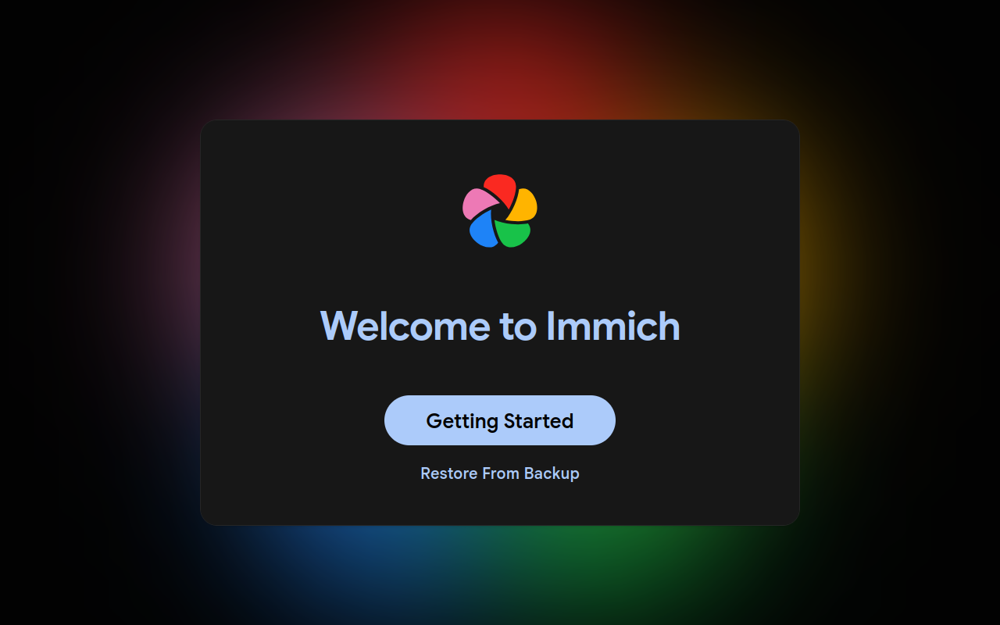
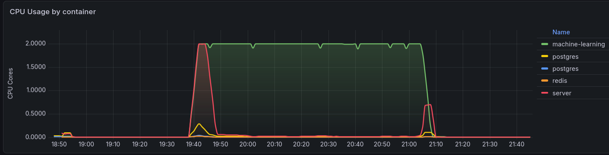
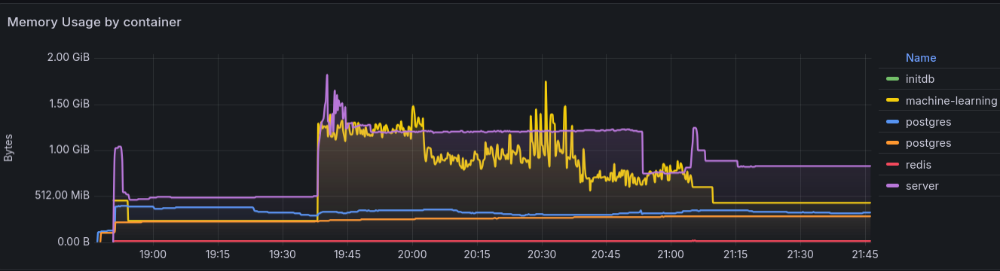
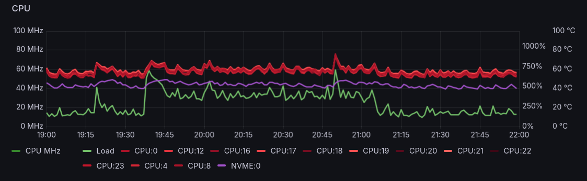
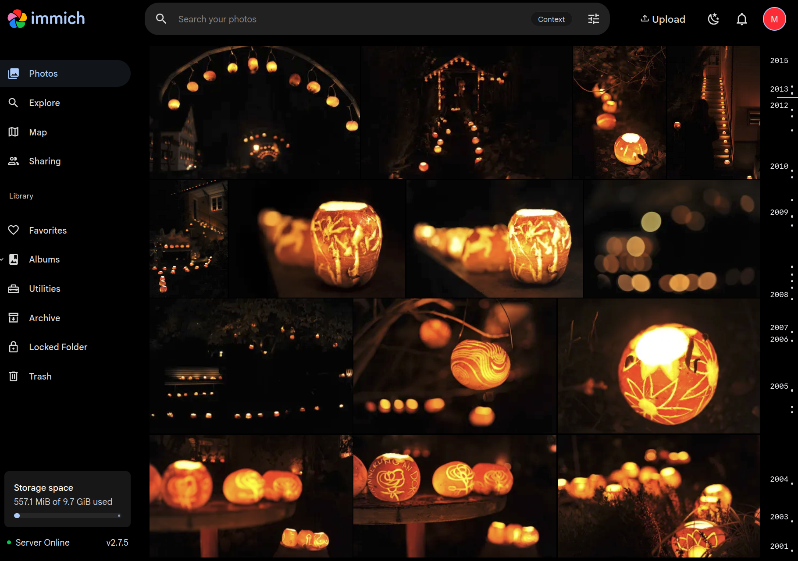
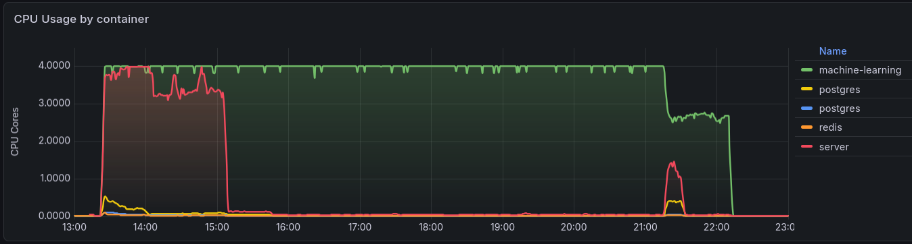
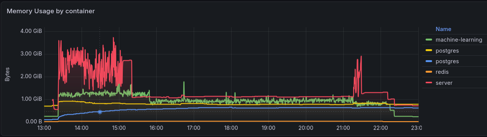
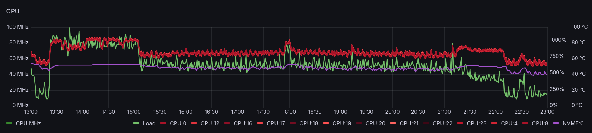

[Immich](https://immich.app/) is a *self-hosted photo and video management solution* that
should make it easy to *browse, search and organize photos and videos with ease, without
sacrificing privacy*. This could be a better solution than the less flexible cloud-based
services for a family with multiple photographers and *very diverse degrees of organizational discipline*.

<!-- more -->

## Deployment

Immich requires a Postgres database with [VectorChord](https://vectorchord.ai/), which
can be more easily managed via the [CloudNativePG](https://cloudnative-pg.io/) operator.

### CloudNativePG operator

To support creation of a Postgres cluster, install the **CloudNativePG Operator** using
[CloudNativePG Helm Charts](https://github.com/cloudnative-pg/charts#cloudnativepg-helm-charts)
with the values below to enable CRDs and Prometheous monitoring:

!!! k8s "`cnpg-values.yaml`"

    ``` yaml
    # Automatically install and upgrade the operator CRDs along with the chart.
    # This ensures easy updates for future Immich schema adjustments.
    crds:
      create: true

    monitoring:
      podMonitorEnabled: true

    resources:
      limits:
        cpu: "1"
        memory: 512Mi
      requests:
        cpu: 100m
        memory: 128Mi
    ```

``` console
$ helm repo add cnpg https://cloudnative-pg.github.io/charts
"cnpg" has been added to your repositories

$ helm repo update
Hang tight while we grab the latest from your chart repositories...
...
...Successfully got an update from the "cnpg" chart repository
...
Update Complete. ⎈Happy Helming!⎈
```

``` console
$ helm upgrade --install \
  cnpg cnpg/cloudnative-pg \
  --namespace cnpg-system \
  --create-namespace \
  -f cnpg-values.yaml
Release "cnpg" does not exist. Installing it now.
NAME: cnpg
LAST DEPLOYED: Mon Jun  8 17:31:00 2026
NAMESPACE: cnpg-system
STATUS: deployed
REVISION: 1
TEST SUITE: None
NOTES:
CloudNativePG operator should be installed in namespace "cnpg-system".
You can now create a PostgreSQL cluster with 3 nodes as follows:

cat <<EOF | kubectl apply -f -
# Example of PostgreSQL cluster
apiVersion: postgresql.cnpg.io/v1
kind: Cluster
metadata:
  name: cluster-example
  
spec:
  instances: 3
  storage:
    size: 1Gi
EOF

kubectl get -A cluster
```

``` console
$ kubectl get all -n
cnpg-systemNAME                                       READY   STATUS    RESTARTS   AGE
pod/cnpg-cloudnative-pg-6767d4cccf-sj46n   1/1     Running   0          12s

NAME                           TYPE        CLUSTER-IP     EXTERNAL-IP   PORT(S)   AGE
service/cnpg-webhook-service   ClusterIP   10.100.97.45   <none>        443/TCP   12s

NAME                                  READY   UP-TO-DATE   AVAILABLE   AGE
deployment.apps/cnpg-cloudnative-pg   1/1     1            1           12s

NAME                                             DESIRED   CURRENT   READY   AGE
replicaset.apps/cnpg-cloudnative-pg-6767d4cccf   1         1         1       12s
```

### Immich Database

With the operator managed by Helm, create a Postgres cluster by applying the following
specialized cluster manifest. This specifically pulls the AI image bundled with
**VectorChord** (`cloudnative-vectorchord`), which is required by Immich, maps the state
onto the Longhorn NVMe class with 2 replicas, and loads the required vector libraries
straight into database memory at boot:

!!! k8s "`immich-db.yaml`"

    ``` yaml
    apiVersion: v1
    kind: Namespace
    metadata:
      name: immich
    ---
    apiVersion: postgresql.cnpg.io/v1
    kind: Cluster
    metadata:
      name: immich-postgres
      namespace: immich
    spec:
      instances: 2
      imageName: ghcr.io/tensorchord/cloudnative-vectorchord:16-0.3.0

      # Native array listing placed directly under postgresql to preload the binaries
      postgresql:
        shared_preload_libraries:
          - "vchord.so"
        parameters:
          shared_buffers: "512MB"
          work_mem: "32MB"
          maintenance_work_mem: "128MB"
          max_connections: "100"

      storage:
        size: 20Gi
        storageClass: longhorn-nvme

      # Bootstraps the system and injects the schema extensions at birth
      bootstrap:
        initdb:
          database: immich
          owner: immich_admin
          secret:
            name: immich-db-credentials
          # Executes the required SQL to activate the engine natively on initialization.
          postInitSQL:
            - "ALTER ROLE immich_admin WITH SUPERUSER;"
            - "CREATE EXTENSION IF NOT EXISTS vchord CASCADE;"
          postInitApplicationSQL:
            - "ALTER ROLE immich_admin WITH SUPERUSER;"
    ---
    apiVersion: v1
    kind: Secret
    metadata:
      name: immich-db-credentials
      namespace: immich
    type: Opaque
    stringData:
      username: immich_admin
      password: ******************************************
    ```

??? warning "Need to make `immich_admin WITH SUPERUSER` or Immich crashes."

    During the startup sequence, the Immich database connection driver attempts to drop
    the extension (`DROP EXTENSION IF EXISTS vchord CASCADE;`) to handle its internal
    table tracking, and then issue a raw `CREATE EXTENSION` command. Because
    CloudNativePG intentionally connects the application container using a standard,
    unprivileged role (`immich_admin`) rather than a dangerous `SUPERUSER` role,
    PostgreSQL blocks the action and returns `42501: permission denied error`.

??? note "Why use specifically version 16-0.3.0?"

    The tag 16-0.3.0 explicitly stands for **PostgreSQL Major Version 16** coupled with
    **VectorChord Version 0.3.0**.

    When deploying Immich, selecting the PostgreSQL major version is not about chasing
    the highest integer (like PG 17 or 18); it is about matching what the current Immich
    codebase is tested against and ships with natively in its standard deployment
    pipelines. 

    *   **Immich's Core Engine Target**: Immich heavily binds its core SQL optimizations,
    backend query compilers, and backup tools to specific PostgreSQL releases. Using PG
    17 or 18 when the current stable layer of Immich targets PG 16 can lead to database
    startup syntax errors, missing migration variables, or fatal runtime mismatches.
    *   **Major Upgrades in CNPG**: In CloudNativePG, upgrading the major database engine
    version (e.g., from 16 to 17) requires a formal, semi-automated [PostgreSQL Upgrade
    Job (`pg_upgrade`)](https://cloudnative-pg.github.io/docs/1.26/postgres_upgrades/).
    You cannot simply change the tag in a production cluster from 16-x to 17-x; doing so
    will corrupt the transaction write-ahead logs (WAL) and block the pod initialization
    sequence completely. 
    *   **How to Pick the True Latest Stable Release**: To upgrade safely or target the
    exact latest release matching the ecosystem, use the official [TensorChord Image
    Registry](https://github.com/tensorchord/cloudnative-vectorchord/pkgs/container/cloudnative-vectorchord/442815134?tag=17-0.4.3) to check tag patterns.
    The version string tag logic uses this format:
    `[PostgreSQL-Major-Version]-[VectorChord-Version]`.

Apply this database cluster map to the environment:

``` console
$ kubectl apply -f immich-db.yaml 
namespace/immich created
cluster.postgresql.cnpg.io/immich-postgres created
secret/immich-db-credentials created
```

``` console
$ kubectl get all -n immich 
NAME                                 READY   STATUS     RESTARTS   AGE
pod/immich-postgres-1-initdb-9p5k9   0/1     Init:0/1   0          14s

NAME                         TYPE        CLUSTER-IP       EXTERNAL-IP   PORT(S)    AGE
service/immich-postgres-r    ClusterIP   10.108.153.64    <none>        5432/TCP   15s
service/immich-postgres-ro   ClusterIP   10.101.128.165   <none>        5432/TCP   15s
service/immich-postgres-rw   ClusterIP   10.100.22.151    <none>        5432/TCP   15s

NAME                                 STATUS    COMPLETIONS   DURATION   AGE
job.batch/immich-postgres-1-initdb   Running   0/1           14s        14s
```

Track the native setup of database instances using:

``` console
$ kubectl get cluster -n immich immich-postgres -w
NAME              AGE   INSTANCES   READY   STATUS               PRIMARY
immich-postgres   4s    1                   Setting up primary   
immich-postgres   22s   1                   Setting up primary   
immich-postgres   22s   1                   Setting up primary   
immich-postgres   22s   1                   Waiting for the instances to become active   
immich-postgres   30s   1                   Waiting for the instances to become active   immich-postgres-1
immich-postgres   39s   1           1       Waiting for the instances to become active   immich-postgres-1
immich-postgres   39s   1           1       Waiting for the instances to become active   immich-postgres-1
immich-postgres   39s   1           1       Creating a new replica                       immich-postgres-1
immich-postgres   39s   2           1       Creating a new replica                       immich-postgres-1
immich-postgres   66s   2           1       Waiting for the instances to become active   immich-postgres-1
immich-postgres   86s   2           2       Waiting for the instances to become active   immich-postgres-1
immich-postgres   86s   2           2       Cluster in healthy state                     immich-postgres-1
immich-postgres   86s   2           2       Cluster in healthy state                     immich-postgres-1
```

Once the cluster switches to `Cluster in healthy state`, database foundation is complete.

With the Helm-managed CloudNativePG operator and database clusters fully primed for
high-efficiency vector queries, the system is now ready to deploy the Immich application.

### Immich App

The following manifest deploys the modern Immich stack, including:

*  **Immich Server** handling web routing, internal logic, and Pomerium ingress
*  **Immich Machine Learning** powering facial recognition, object detection, and
   `VectorChord` embedding tasks, and
*  an isolated **Redis** instance for job queue synchronization.

!!! k8s "`immich-app.yaml`"

    ``` yaml
    apiVersion: apps/v1
    kind: Deployment
    metadata:
      name: immich-redis
      namespace: immich
    spec:
      replicas: 1
      selector:
        matchLabels:
          app: immich-redis
      template:
        metadata:
          labels:
            app: immich-redis
        spec:
          containers:
            - name: redis
              image: redis:6.2-alpine
              resources:
                limits:
                  cpu: 500m
                  memory: 256Mi
                requests:
                  cpu: 100m
                  memory: 64Mi
    ---
    apiVersion: v1
    kind: Service
    metadata:
      name: immich-redis-service
      namespace: immich
    spec:
      selector:
        app: immich-redis
      ports:
        - protocol: TCP
          port: 6379
          targetPort: 6379
    ---
    apiVersion: apps/v1
    kind: Deployment
    metadata:
      name: immich-machine-learning
      namespace: immich
    spec:
      replicas: 1
      selector:
        matchLabels:
          app: immich-machine-learning
      template:
        metadata:
          labels:
            app: immich-machine-learning
        spec:
          containers:
            - name: machine-learning
              image: ghcr.io/immich-app/immich-machine-learning:release
              env:
                - name: TRANSFORMERS_CACHE
                  value: /cache
              volumeMounts:
                - name: ml-cache
                  mountPath: /cache
              resources:
                limits:
                  cpu: "2"
                  memory: 2Gi
                requests:
                  cpu: 500m
                  memory: 512Mi
          volumes:
            - name: ml-cache
              emptyDir: {}
    ---
    apiVersion: v1
    kind: Service
    metadata:
      name: immich-machine-learning-service
      namespace: immich
    spec:
      selector:
        app: immich-machine-learning
      ports:
        - protocol: TCP
          port: 3003
          targetPort: 3003
    ---
    apiVersion: v1
    kind: PersistentVolume
    metadata:
      name: ponder-fotos-pv
      namespace: immich
    spec:
      storageClassName: manual
      capacity:
        storage: 2500Gi
      accessModes:
        - ReadOnlyMany
      csi:
        driver: nfs.csi.k8s.io
        volumeHandle: luggage-ponder-fotos-nfs-octavo
        volumeAttributes:
          server: luggage
          share: /volume1/NetBackup
          subDir: public/ponder/Fotos
      mountOptions:
        - nfsvers=4.1
        - hard
      persistentVolumeReclaimPolicy: Retain
    ---
    apiVersion: v1
    kind: PersistentVolumeClaim
    metadata:
      name: ponder-fotos-pvc
      namespace: immich
    spec:
      storageClassName: manual
      accessModes:
        - ReadOnlyMany
      resources:
        requests:
          storage: 2500Gi
      volumeName: ponder-fotos-pv
      volumeMode: Filesystem
    ---
    apiVersion: apps/v1
    kind: Deployment
    metadata:
      name: immich-server
      namespace: immich
    spec:
      replicas: 1
      selector:
        matchLabels:
          app: immich-server
      template:
        metadata:
          labels:
            app: immich-server
        spec:
          containers:
            - name: server
              image: ghcr.io/immich-app/immich-server:release
              env:
                - name: NODE_ENV
                  value: production
                - name: DB_USERNAME
                  valueFrom:
                    secretKeyRef:
                      name: immich-db-credentials
                      key: username
                - name: DB_PASSWORD
                  valueFrom:
                    secretKeyRef:
                      name: immich-db-credentials
                      key: password
                - name: DB_HOSTNAME
                  value: immich-postgres-rw.immich.svc.cluster.local
                - name: DB_DATABASE_NAME
                  value: immich
                - name: REDIS_HOSTNAME
                  value: immich-redis-service.immich.svc.cluster.local
                - name: IMMICH_MACHINE_LEARNING_URL
                  value: http://immich-machine-learning-service:3003
              ports:
                - containerPort: 2283
                  name: http
              volumeMounts:
                - name: immich-upload-storage
                  mountPath: /usr/src/app/upload
                - name: nfs-nas-photos
                  mountPath: /mnt/nas/photos
                  readOnly: true 
              resources:
                limits:
                  cpu: "2"
                  memory: 2Gi
                requests:
                  cpu: 500m
                  memory: 512Mi
          volumes:
            - name: immich-upload-storage
              persistentVolumeClaim:
                claimName: immich-upload-pvc
            - name: nfs-nas-photos
              persistentVolumeClaim:
                claimName: ponder-fotos-pvc
    ---
    apiVersion: v1
    kind: PersistentVolumeClaim
    metadata:
      name: immich-upload-pvc
      namespace: immich
    spec:
      accessModes:
        - ReadWriteOnce
      storageClassName: longhorn-nvme
      resources:
        requests:
          storage: 100Gi
    ---
    apiVersion: v1
    kind: Service
    metadata:
      name: immich-server-service
      namespace: immich
    spec:
      selector:
        app: immich-server
      ports:
        - protocol: TCP
          port: 80
          targetPort: 2283
    ```

Instead of pointing to a static IP or generic service, this deployment uses 
`immich-postgres-rw.immich.svc.cluster.local`. This is a dynamic, high-availability
service maintained by the CloudNativePG operator. It always automatically maps write
traffic straight to the active primary node.

The NFS volume specification enforces a strict read-only lock (`readOnly: true`). This
ensures that no matter what tasks Immich runs (such as generating metadata, calculating
embeddings, or compiling AI face points), it cannot alter, modify, or delete a single
file on the NAS volume.

``` console
$ kubectl apply -f immich-app.yaml
deployment.apps/immich-redis created
service/immich-redis-service created
deployment.apps/immich-machine-learning created
service/immich-machine-learning-service created
persistentvolume/ponder-fotos-pv created
persistentvolumeclaim/ponder-fotos-pvc created
deployment.apps/immich-server created
persistentvolumeclaim/immich-upload-pvc created
service/immich-server-service created

$ kubectl -n immich get all
NAME                                           READY   STATUS    RESTARTS   AGE
pod/immich-machine-learning-5557f5ff5c-5pxhr   1/1     Running   0          56s
pod/immich-postgres-1                          1/1     Running   0          4m39s
pod/immich-postgres-2                          1/1     Running   0          3m55s
pod/immich-redis-f6fc5d779-gnnkp               1/1     Running   0          56s
pod/immich-server-7999ddf7f4-4sqjt             1/1     Running   0          56s

NAME                                      TYPE        CLUSTER-IP       EXTERNAL-IP   PORT(S)    AGE
service/immich-machine-learning-service   ClusterIP   10.103.107.241   <none>        3003/TCP   56s
service/immich-postgres-r                 ClusterIP   10.96.79.68      <none>        5432/TCP   5m1s
service/immich-postgres-ro                ClusterIP   10.102.55.30     <none>        5432/TCP   5m1s
service/immich-postgres-rw                ClusterIP   10.97.132.130    <none>        5432/TCP   5m1s
service/immich-redis-service              ClusterIP   10.97.1.237      <none>        6379/TCP   56s
service/immich-server-service             ClusterIP   10.100.161.54    <none>        80/TCP     56s

NAME                                      READY   UP-TO-DATE   AVAILABLE   AGE
deployment.apps/immich-machine-learning   1/1     1            1           56s
deployment.apps/immich-redis              1/1     1            1           56s
deployment.apps/immich-server             1/1     1            1           56s

NAME                                                 DESIRED   CURRENT   READY   AGE
replicaset.apps/immich-machine-learning-5557f5ff5c   1         1         1       56s
replicaset.apps/immich-redis-f6fc5d779               1         1         1       56s
replicaset.apps/immich-server-7999ddf7f4             1         1         1       56s
```

Once the Immich app is running, it produces **lots** of details in its logs:

??? terminal "`$ kubectl logs -n immich -f deployment/immich-server -c server -f`"

    ``` console
    $ kubectl logs -n immich -f deployment/immich-server -c server -f
    Initializing Immich v2.7.5
    Detected CPU Cores: 2
    (node:7) ExperimentalWarning: WASI is an experimental feature and might change at any time
    (Use `node --trace-warnings ...` to show where the warning was created)
    Starting api worker
    Starting microservices worker
    (node:7) ExperimentalWarning: WASI is an experimental feature and might change at any time
    (Use `node --trace-warnings ...` to show where the warning was created)
    [Nest] 7  - 06/08/2026, 4:50:48 PM     LOG [Microservices:WebsocketRepository] Initialized websocket server
    (node:24) ExperimentalWarning: WASI is an experimental feature and might change at any time
    (Use `node --trace-warnings ...` to show where the warning was created)
    [Nest] 7  - 06/08/2026, 4:50:48 PM     LOG [Microservices:DatabaseRepository] Creating VectorChord extension
    [Nest] 24  - 06/08/2026, 4:50:48 PM     LOG [Api:WebsocketRepository] Initialized websocket server
    [Nest] 7  - 06/08/2026, 4:50:48 PM     LOG [Microservices:DatabaseRepository] Reindexing clip_index (This may take a while, do not restart)
    [Nest] 7  - 06/08/2026, 4:50:48 PM     LOG [Microservices:DatabaseRepository] Reindexing face_index (This may take a while, do not restart)
    [Nest] 7  - 06/08/2026, 4:50:48 PM    WARN [Microservices:DatabaseRepository] Table smart_search does not exist, skipping reindexing. This is only normal if this is a new Immich instance.
    [Nest] 7  - 06/08/2026, 4:50:48 PM    WARN [Microservices:DatabaseRepository] Table face_search does not exist, skipping reindexing. This is only normal if this is a new Immich instance.
    [Nest] 7  - 06/08/2026, 4:50:48 PM     LOG [Microservices:DatabaseRepository] Running migrations
    [Nest] 7  - 06/08/2026, 4:50:49 PM     LOG [Microservices:Migrations] Converting database file paths from relative to absolute (source=upload/*, target=/usr/src/app/upload/*)
    [Nest] 7  - 06/08/2026, 4:50:50 PM     LOG [Microservices:DatabaseRepository] Migration "1744910873969-InitialMigration" succeeded
    ...
    [Nest] 7  - 06/08/2026, 4:50:50 PM     LOG [Microservices:DatabaseRepository] Finished running migrations
    [Nest] 7  - 06/08/2026, 4:50:50 PM     LOG [Microservices:DatabaseService] Checking for schema drift
    [Nest] 7  - 06/08/2026, 4:50:50 PM     LOG [Microservices:DatabaseService] No schema drift detected
    [Nest] 7  - 06/08/2026, 4:50:50 PM     LOG [Microservices:StorageService] Verifying system mount folder checks, current state: {"mountChecks":{}}
    [Nest] 7  - 06/08/2026, 4:50:50 PM     LOG [Microservices:StorageService] Writing initial mount file for the encoded-video folder
    [Nest] 7  - 06/08/2026, 4:50:50 PM     LOG [Microservices:StorageService] Writing initial mount file for the library folder
    [Nest] 7  - 06/08/2026, 4:50:50 PM     LOG [Microservices:StorageService] Writing initial mount file for the upload folder
    [Nest] 7  - 06/08/2026, 4:50:50 PM     LOG [Microservices:StorageService] Writing initial mount file for the profile folder
    [Nest] 7  - 06/08/2026, 4:50:50 PM     LOG [Microservices:StorageService] Writing initial mount file for the thumbs folder
    [Nest] 7  - 06/08/2026, 4:50:50 PM     LOG [Microservices:StorageService] Writing initial mount file for the backups folder
    [Nest] 7  - 06/08/2026, 4:50:50 PM     LOG [Microservices:StorageService] Successfully enabled system mount folders checks
    [Nest] 7  - 06/08/2026, 4:50:50 PM     LOG [Microservices:StorageService] Successfully verified system mount folder checks
    [Nest] 24  - 06/08/2026, 4:50:50 PM     LOG [Api:DatabaseRepository] targetLists=1, current=1 for clip_index of 0 rows
    [Nest] 24  - 06/08/2026, 4:50:50 PM     LOG [Api:DatabaseRepository] targetLists=1, current=1 for face_index of 0 rows
    [Nest] 24  - 06/08/2026, 4:50:50 PM     LOG [Api:DatabaseRepository] Running migrations
    [Nest] 7  - 06/08/2026, 4:50:50 PM     LOG [Microservices:MetadataService] Bootstrapping metadata service
    [Nest] 7  - 06/08/2026, 4:50:50 PM     LOG [Microservices:MetadataService] Initializing metadata service
    [Nest] 7  - 06/08/2026, 4:50:50 PM     LOG [Microservices:MapRepository] Initializing metadata repository
    [Nest] 24  - 06/08/2026, 4:50:50 PM     LOG [Api:DatabaseRepository] Finished running migrations
    [Nest] 24  - 06/08/2026, 4:50:50 PM     LOG [Api:DatabaseService] Checking for schema drift
    [Nest] 24  - 06/08/2026, 4:50:50 PM     LOG [Api:DatabaseService] No schema drift detected
    [Nest] 24  - 06/08/2026, 4:50:50 PM     LOG [Api:StorageService] Verifying system mount folder checks, current state: {"mountChecks":{"thumbs":true,"upload":true,"backups":true,"library":true,"profile":true,"encoded-video":true}}
    [Nest] 24  - 06/08/2026, 4:50:50 PM     LOG [Api:StorageService] Successfully verified system mount folder checks
    [Nest] 24  - 06/08/2026, 4:50:50 PM     LOG [Api:PluginService] Upserted plugin: immich-core (ID: 5e20a9f4-2b6f-406c-b325-56379fee4751, version: 2.0.1)
    [Nest] 24  - 06/08/2026, 4:50:50 PM     LOG [Api:PluginService] Upserted plugin filter: filterFileName (ID: 887ca7ad-159f-4770-a09d-8aecffc44930)
    [Nest] 24  - 06/08/2026, 4:50:50 PM     LOG [Api:PluginService] Upserted plugin filter: filterFileType (ID: abf628cc-e3b6-433b-9e9a-4c87134be2f4)
    [Nest] 24  - 06/08/2026, 4:50:50 PM     LOG [Api:PluginService] Upserted plugin filter: filterPerson (ID: 5d933528-9f14-4647-b356-2b7b19f2d035)
    [Nest] 24  - 06/08/2026, 4:50:50 PM     LOG [Api:PluginService] Upserted plugin action: actionArchive (ID: ac280138-c96e-4b7e-9073-f9869637c4c4)
    [Nest] 24  - 06/08/2026, 4:50:50 PM     LOG [Api:PluginService] Upserted plugin action: actionFavorite (ID: e1448a93-effb-4097-a620-d27578b1dd83)
    [Nest] 24  - 06/08/2026, 4:50:50 PM     LOG [Api:PluginService] Upserted plugin action: actionAddToAlbum (ID: 371da63c-c1fc-4e15-b993-ea2e290620be)
    [Nest] 24  - 06/08/2026, 4:50:50 PM     LOG [Api:PluginService] Successfully processed core plugin: immich-core (version 2.0.1)
    [Nest] 24  - 06/08/2026, 4:50:50 PM     LOG [Api:PluginService] Successfully loaded plugin: immich-core
    [Nest] 24  - 06/08/2026, 4:50:51 PM     LOG [Api:ServerService] Feature Flags: {
      "smartSearch": true,
      "facialRecognition": true,
      "duplicateDetection": true,
      "map": true,
      "reverseGeocoding": true,
      "importFaces": false,
      "sidecar": true,
      "search": true,
      "trash": true,
      "oauth": false,
      "oauthAutoLaunch": false,
      "ocr": true,
      "passwordLogin": true,
      "configFile": false,
      "email": false
    }
    [Nest] 24  - 06/08/2026, 4:50:51 PM     LOG [Api:SystemConfigService] LogLevel=log (set via system config)
    [Nest] 7  - 06/08/2026, 4:50:51 PM     LOG [Microservices:MapRepository] Starting geodata import
    [Nest] 24  - 06/08/2026, 4:50:51 PM     LOG [Api:NestFactory] Starting Nest application...
    ...
    [Nest] 24  - 06/08/2026, 4:50:51 PM     LOG [Api:NestApplication] Nest application successfully started
    [Nest] 24  - 06/08/2026, 4:50:51 PM     LOG [Api:Bootstrap] Immich Server is listening on http://[::1]:2283 [v2.7.5] [production] 
    [Nest] 24  - 06/08/2026, 4:50:51 PM     LOG [Api:MachineLearningRepository] Machine learning server became healthy (http://immich-machine-learning-service:3003).
    [Nest] 7  - 06/08/2026, 4:50:52 PM     LOG [Microservices:MapRepository] 10000 geodata records imported
    ...
    [Nest] 7  - 06/08/2026, 4:50:58 PM     LOG [Microservices:MapRepository] 210000 geodata records imported
    [Nest] 7  - 06/08/2026, 4:50:58 PM     LOG [Microservices:MapRepository] Successfully imported 224210 geodata records in 7.43s (30165 records/second)
    [Nest] 7  - 06/08/2026, 4:51:01 PM     LOG [Microservices:MapRepository] Geodata import completed
    [Nest] 7  - 06/08/2026, 4:51:01 PM     LOG [Microservices:MetadataService] Initialized local reverse geocoder
    [Nest] 7  - 06/08/2026, 4:51:01 PM     LOG [Microservices:PluginService] Plugin immich-core is up to date (version 2.0.1). Skipping
    [Nest] 7  - 06/08/2026, 4:51:01 PM     LOG [Microservices:PluginService] Successfully processed core plugin: immich-core (version 2.0.1)
    [Nest] 7  - 06/08/2026, 4:51:01 PM     LOG [Microservices:PluginService] Successfully loaded plugin: immich-core
    [Nest] 7  - 06/08/2026, 4:51:01 PM     LOG [Microservices:ServerService] Feature Flags: {
      "smartSearch": true,
      "facialRecognition": true,
      "duplicateDetection": true,
      "map": true,
      "reverseGeocoding": true,
      "importFaces": false,
      "sidecar": true,
      "search": true,
      "trash": true,
      "oauth": false,
      "oauthAutoLaunch": false,
      "ocr": true,
      "passwordLogin": true,
      "configFile": false,
      "email": false
    }
    [Nest] 7  - 06/08/2026, 4:51:01 PM     LOG [Microservices:SystemConfigService] LogLevel=log (set via system config)
    [Nest] 7  - 06/08/2026, 4:51:01 PM     LOG [Microservices:MachineLearningRepository] Machine learning server became healthy (http://immich-machine-learning-service:3003).
    [Nest] 7  - 06/08/2026, 4:51:01 PM     LOG [Microservices:NestFactory] Starting Nest application...
    [Nest] 7  - 06/08/2026, 4:51:01 PM     LOG [Microservices:InstanceLoader] BullModule dependencies initialized
    [Nest] 7  - 06/08/2026, 4:51:01 PM     LOG [Microservices:InstanceLoader] ClsModule dependencies initialized
    [Nest] 7  - 06/08/2026, 4:51:01 PM     LOG [Microservices:InstanceLoader] ClsCommonModule dependencies initialized
    [Nest] 7  - 06/08/2026, 4:51:01 PM     LOG [Microservices:InstanceLoader] KyselyModule$1 dependencies initialized
    [Nest] 7  - 06/08/2026, 4:51:01 PM     LOG [Microservices:InstanceLoader] OpenTelemetryModule dependencies initialized
    [Nest] 7  - 06/08/2026, 4:51:01 PM     LOG [Microservices:InstanceLoader] KyselyCoreModule$1 dependencies initialized
    [Nest] 7  - 06/08/2026, 4:51:01 PM     LOG [Microservices:InstanceLoader] DiscoveryModule dependencies initialized
    [Nest] 7  - 06/08/2026, 4:51:01 PM     LOG [Microservices:InstanceLoader] OpenTelemetryCoreModule dependencies initialized
    [Nest] 7  - 06/08/2026, 4:51:01 PM     LOG [Microservices:InstanceLoader] ClsRootModule dependencies initialized
    [Nest] 7  - 06/08/2026, 4:51:01 PM     LOG [Microservices:InstanceLoader] BullModule dependencies initialized
    [Nest] 7  - 06/08/2026, 4:51:01 PM     LOG [Microservices:InstanceLoader] BullModule dependencies initialized
    [Nest] 7  - 06/08/2026, 4:51:01 PM     LOG [Microservices:InstanceLoader] MicroservicesModule dependencies initialized
    [Nest] 7  - 06/08/2026, 4:51:01 PM     LOG [Microservices:NestApplication] Nest application successfully started
    [Nest] 7  - 06/08/2026, 4:51:01 PM     LOG [Microservices:Bootstrap] Immich Microservices is running [v2.7.5] [production] 
    ```

### Pomerium Ingress

Add the following file to the Pomerium
[Kustomize per-service ACLs](./2025-12-18-replacing-ingress-nginx-with-pomerium.md#kustomize-per-service-acls)
setup to make the Immich app accessible at <https://immich.uu.am>

!!! k8s "`pomerium/pomerium-ingress/immich.yaml`"

    ``` yaml
    apiVersion: networking.k8s.io/v1
    kind: Ingress
    metadata:
      name: immich-pomerium-ingress
      namespace: immich
      annotations:
        cert-manager.io/cluster-issuer: letsencrypt-prod
        ingress.pomerium.io/allow_websockets: true
        ingress.pomerium.io/idle_timeout: 0s
        ingress.pomerium.io/pass_identity_headers: true
        ingress.pomerium.io/preserve_host_header: true
        ingress.pomerium.io/timeout: 0s
    spec:
      ingressClassName: pomerium
      rules:
        - host: immich.uu.am
          http:
            paths:
              - path: /
                pathType: Prefix
                backend:
                  service:
                    name: immich-server-service
                    port:
                      number: 80
      tls:
        - secretName: tls-secret
          hosts:
            - immich.uu.am
    ```

``` console
$ kubectl apply -k pomerium/pomerium-ingress 
...
ingress.networking.k8s.io/immich-pomerium-ingress created
...
```

``` console
$ kubectl -n immich get certificate  -w
NAME         READY   SECRET       AGE
tls-secret   False   tls-secret   5s
tls-secret   False   tls-secret   79s
```

Once the new certificate is ready, accessing the Immich app at
<http://immich.uu.am> should show the welcome page to setup the admin user:



#### API and Mobile apps

To enable access to the API endpoints, which are required for the mobile apps and the
script to [rescan libraries on demand](#library-rescan-on-demand), add the following
path-based `allow` rules:

!!! k8s "`pomerium/pomerium-ingress/kustomization.yaml`"

    ```yaml hl_lines="8-13"
      - target:
          kind: Ingress
          name: immich-pomerium-ingress
        patch: |-
          - op: replace
            path: "/metadata/annotations/ingress.pomerium.io~1policy"
            value: |
              - allow:
                  or:
                    - http_path:
                        starts_with: "/.well-known/immich"
                    - http_path:
                        starts_with: "/api"
              - allow:
                  or:
                    - email:
                        is: "...@gmail.com"
    ```

## Configuration

Once the frontend is running, the first user to register will be the admin user. This
admin user will be able to add other users to the application, although this can be made
unnecessary if users already have a GMail account, by setting up OAuth authentication.

### Authenticaton

[OAuth Authentication](https://docs.immich.app/administration/oauth/#google-example)
is relatively easy to setup in Immich and the documentation even includes a handy
[Google Example](https://docs.immich.app/administration/oauth/#google-example),
which is much easier than setting up Immich to use Pomerium as the OIDC provider.
Pomerium still block unauthorized web traffic at the infrastructure perimeter, but the
actual identity mapping is handled cleanly through a direct relationship between Immich
and Google.

First, create a new, dedicated **OAuth Client ID** in the Google Cloud Console:

   1. Open the Google Cloud Console and select (or create) the relevant project.
   2. Navigate to **APIs & Services > Credentials**.
   3. Click **Create Credentials** and select **OAuth client ID**.
   4. Set the Application type to **Web application** and name it (e.g. `Immich-App`).
   5. Configure the specific redirection URLs required by Immich:
    
      * `https://immich.uu.am/auth/login`
      * `https://immich.uu.am/user-settings`
      * `https://immich.uu.am/api/oauth/mobile-redirect`

   6. Click **Create** and copy the **Client ID** and **Client Secret**.

!!! note

    `app.immich:///oauth-callback` is not a supported URL.

Then setup **Login with OAuth** in Immich:

   1. Click on the user badge on the top-right corner of the screen.
   2. Click on **Administration** (the **wrench** icon) under the user badge.
   3. Open the **Authentication Settings** section and its the **OAuth** subsection.
   4. Enable **Login with OAuth** and fill in the following fields exactly as follows:
      *  **Issuer URL**: `https://accounts.google.com`
      *  **Client ID**: Paste the Client ID from Step 1
      *  **Client Secret**: Paste the Client Secret from Step 1
      *  Scroll down past fields that are populated automatically.
   5. Set the Behavior Strictness Rules:
      *  **Auto Register**: **enable** this so that authorized users (gated by Pomerium)
         get an account created automatically the first time the log in.
      *  **Auto Launch**: **enable** this to achieve a seamless workflow, so that users
         are logged in directly without having to click on any button.
      *  **Mobile redirect URI override**: **enable** this because Google OAuth does not
         support the `app.immich:///oauth-callback` URL format.
      *  **Mobile redirect URI**: `https://immich.uu.am/api/oauth/mobile-redirect`
   6. Click **Save Settings**.

Because [Pomerium](./2025-12-18-replacing-ingress-nginx-with-pomerium.md)
is already authenticating users via Google before they can reach Immich, they will
experience a completely transparent, zero-click login: Immich with **Auto Launch** enabled
immediately redirects the browser to Google OAuth to confirm identity, but the user is
already logged into Google in that browser session, so Google instantly responds with a
signed web token containing their `@gmail.com` address, skipping any password prompts,
and Immich will automatically create a new account on their first visit.

#### Fallback authentication

In a pinch, adding `?autoLaunch=false` to the end of the login URL will explicitly tell
the Immich frontend engine to disable the Auto Launch of the OAuth flow. It will stop the
Google redirection loop entirely and present you with the original login screen. From
there, the administrator user can log in with the password created during the initial
setup.

#### API key

To use scripts that rely on the Immich API, e.g. to trigger
[library rescan on demand](#library-rescan-on-demand) and to create
[folder-based albums](#folder-based-albums), create an API key from the Immich Web UI,
under **Account Settings > API Keys**, with the following permissions:

- `album` (all)
- `albumAsset` (all)
- `albumUser` (all)
- `asset.read`
- `asset.view`
- `folder.read`
- `library.update`
- `user.read`

### External Library

Immich handles pre-existing photo structures using its native **External Libraries**
feature. Using this, a curated photo collection can be loaded directly from external
storage, such as the NAS volume mounted over NFS included in the above deployment.

The External Libraries UI is found in the **Administration** menu, accessed through the
user badge icon on the top-right corner of the screen. Using the **Create Library**
button on the top-right corner (under the user badge), the first and critical step is to
choose the owner for the library. **This cannot be changed later**.

Once the library is created, **Folders** are added by specifying their path in the
Immich pod filesystem, e.g. under `/mnt/nas/photos` based on the above deployment.
For an initial test, a single subdirectory can be added instead of the entire volume.
This can also be a good way to gradually add parts of the external library in stages,
while at the same time leaving out subdirectories that are not intended to be imported.

To avoid indexing certain files in subdirectories further down the tree, patterns can be
added to the list of **Exclusion Patterns** next to the list of **Folders**. To avoid
importing unprocessed raw files, these being stored in `raw` subdirectories throughout
the library, add the pattern `**/raw/**`.

The `**/` prefix instructs Immich's file traversal loop to intercept the search anywhere
in the folder architecture. If it hits a nested directory like
`/mnt/nas/photos/2024/Trip/raw/xt5_1234.raf`, the wildcard instantly matches and drops
the file. This allow allows root-level paths, but those can be excluded by adding only
the specific root-level directories to be scanned.

!!! note

    To avoid indexing files inside of multiple directories named after a *pattern* (not
    with the same name), the pattern must be enclosed between `**/` and `/**`; e.g. to
    avoid indexing files under diretories named `pano-xx` where `xx` are numbers, use
    `**/pano-*/**`.

??? tip "A more complete list of exclusion patterns"

    ```
    **/._*
    **/_a/**
    **/banners/**
    **/CD/**
    **/chus/**
    **/.comments/**
    **/.dtrash/**
    **/@eaDir/**
    **/icons/**
    **/import_vid/**
    **/insta/**
    **/Insta-*/**
    **/nope/**
    **online_auf**
    **Online Resolution**
    **/oof/**
    **/orig/**
    **/pano-*/**
    **/panos/**
    **/parts/**
    **/raw/**
    **/#recycle/**
    **/slides/**
    **/#snapshot/**
    **/.stfolder/**
    **/.stversions/**
    **/test/**
    **/thumbnails/**
    **/TODO/**
    **/trash/**
    ```

Once all the desired **Folders** and **Exclusion Patterns** have been added, click on
**Save** to store the changes and then **Scan** to start the scanning process. When
scanning the library, Immich will catalog the directory tree and read file metadata
headers. Once the files are indexed, Immich's background job queue manager will
automatically send files to the `immich-machine-learning` sidecar. This generates visual
thumbnails, extracts faces, and calculates `VectorChord` machine-learning embeddings for
semantic search. This deep AI scanning process runs asynchronously in the background and
can take several hours to fully complete depending on the library size. In the meantime,
the web and mobile applications remain completely fast and usable.

The initial test with 1,555 photos in the `Events` subdirectory (2.9 GB) took about 90
minutes, with CPU usage hard-capped at 2 CPU cores, most of the time used by machine
learning:




Given the relatively small impact of dedicating 2 CPU cores in a system with 12 cores,
it may be reasonable to increse CPU allowance to 4 cores, maybe even 6, when the time
comes to import larger parts of the library.



The main **Photos** section (timeline) already showed the photos as soon as the files and
metadata were scanned, which took only about 10 minutes, and scrolling through the
timeline was *fast*.



For the subsequent parts of the library, resource limits were increased for both the web
server and machine-learning pipeline to 4 CPU cores and 4 GB of memory. Indexing the last
part, with 22,600 photos in the `People` subdirectory took 2-3 hours for the main scan
and a total of 9 hours including the machine learning process.





The initial internal storage of 10 GB had to be explaned to 100 GB to make room for all
the thumbnails and metadata.

#### Library rescan on-demand

External libraries are not scanned periodically and there is no facility to "watch" for
changes in the file system (which would not work with NFS volumes anyway), but there is
a very simple way to trigger a library rescan by sending a single API request. Running
this script after updating or adding files to the NAS volume will have changes reflected
in Immich, typically within seconds:

```bash
#!/bin/bash
API_KEY=XXXXXXXXXXXXXXXXXXXXXXXXXXXXXXXXXXXX
IMMICH_URL="https://immich.uu.am/api"

for lid in 6c753389-b35e-4728-ac61-633c8889aff8; do
  curl -X POST "$IMMICH_URL/libraries/$lid/scan" \
    -H "Content-Type: application/json" \
    -H "x-api-key: $API_KEY"
done
```

[Create an API key](#api-key) with the required permissions for this. The album id
`6c753389-b35e-4728-ac61-633c8889aff8` can be taken from the Immich server URL when
viewing the album's settings.

### Additional navigation features

For a highly curated photo collection, it is useful to enable navigation features that
are disabled by default:

- [Folder View](https://docs.immich.app/features/folder-view/) provides an additional
  view besides the timeline that is similar to a file explorer, to navigate through the
  folders and files in the library. This feature is handy for a highly curated external
  library with a well organized directory structure.
- [Tags](https://docs.immich.app/features/tags//) provides another view to navigate
  through the hierarchical tree of tags, read the XMP `TagsList` field and IPTC
  `Keywords` fields.

### Partner Sharing

[Partner Sharing](https://docs.immich.app/features/partner-sharing) lets users share
their entirely libraries, including geographical data (or not). On the receiving end,
each user can choose to include a partner's photos in their timeline (or not).

### Folder-based albums

[Immich Folder Album Creator](https://github.com/Salvoxia/immich-folder-album-creator?tab=readme-ov-file#immich-folder-album-creator)
can be integrated to automatically create albums from specific directories. This is
particularly useful when combined with the
[`.albumprops` File Format](https://github.com/Salvoxia/immich-folder-album-creator?tab=readme-ov-file#albumprops-file-format)
to precisely define which files in which directories are included in each album created
this way, as well as how the photos show up and who has access to them.

[Create an API key](#api-key) with the required permissions and add it as a `secret`:

``` console
$ kubectl -n immich \
  create secret generic immich-api-key-secret \
  --from-literal=api-key="XXXXXXXXXXXXXXXXXXXXXXXXXXXXXXXXXXXX"
```

To integrate the `immich-folder-album-creator` docker image, add an additional `container`
to the Immich server pod, so that it shares the same network and volumes as the Immich
server, and run it periodically to check for new and updated files.

!!! k8s "`immich-app.yaml`"

    ``` yaml linenums="225" hl_lines="1-70 75-77 79-81"
            - name: immich-folder-album-creator
              image: salvoxia/immich-folder-album-creator:latest
              command: ["/bin/sh", "-c"]
              args:
                - |
                  echo "Starting conditional .albumprops cron loop..."
                  
                  run_sync() {
                    echo "Searching for folders containing .albumprops files..."
                    
                    # Clear positional parameters to build our filter flag list safely
                    set --
                    
                    # 1. Locate every .albumprops file on the read-only share.
                    #    Using a while-read block preserves spaces and special characters.
                    find /mnt/nas/photos -type f -name ".albumprops" | while read -r prop_file; do
                      if [ -f "$prop_file" ]; then
                        ABS_DIR=$(dirname "$prop_file")
                        
                        # 2. Extract the relative path path starting from the root mount point.
                        #    Example: /mnt/nas/photos/Events/Spain/Gran.Canaria/FiCIT.2002
                        #    Becomes: Events/Spain/Gran.Canaria/FiCIT.2002/**
                        REL_DIR=$(echo "$ABS_DIR" | sed 's|^/mnt/nas/photos/||')
                        
                        # 3. Append them as separate tokens into the shell execution array
                        set -- "$@" "-f" "${REL_DIR}/**"
                      fi
                      
                      # Store the built parameter flags into a temporary environment file
                      # to cleanly pass the array data outside of the while subshell scope
                      printf '%s\n' "$@" > /tmp/filter_args.txt
                    done
            
                    if [ -s /tmp/filter_args.txt ]; then
                      echo "Executing single fast batch sync..."
                      SECRET_KEY=$(cat /secrets/api-key)
                      
                      # Reconstruct the positional array elements cleanly
                      set --
                      while read -r arg; do
                        set -- "$@" "$arg"
                      done < /tmp/filter_args.txt
                      rm -f /tmp/filter_args.txt
            
                      # 4. Invoke the python engine as a single master batch run.
                      #    -A forces the script to re-evaluate photos already in albums,
                      #    allowing it to read modified .albumprops files and push missing shares.
                      #    --album-levels -1 automatically extracts the leaf folder name.
                      python3 /script/immich_auto_album.py \
                        -u \
                        --read-album-properties \
                        --update-album-props-mode 2 \
                        --album-levels -1 \
                        --find-assets-in-albums \
                        "$@" \
                        "/mnt/nas/photos" \
                        "http://localhost:2283/api" \
                        "$SECRET_KEY"
                    else
                      echo "No .albumprops configurations found. Skipping sync."
                      rm -f /tmp/filter_args.txt
                    fi
                  }
            
                  run_sync
            
                  while true; do
                    sleep 300
                    run_sync
                  done
              volumeMounts:
                - name: nfs-nas-photos
                  mountPath: /mnt/nas/photos
                  readOnly: true
                - name: immich-api-key-volume
                  mountPath: /secrets
                  readOnly: true
          volumes:
            - name: immich-api-key-volume
              secret:
                secretName: immich-api-key-secret
    ``` 

Because the files in the NFS volume are updated by different NFS client than the server,
it is not possible to use `inotifywait` to watch the NFS volume for updates, so the
script runs in a loop instead. To trigger a manual run, delete the pod to start a new
one.

``` console
$ kubectl -n immich delete pod -l app=immich-server
```

#### Limitations

The above script works around certain limitations of the `immich-folder-album-creator`
and yet some limitations proved impossibe to work around. The most notorious of these is
that when new albums are created, and every time the script runs again subsequently, the
album may not be shared with any of the invited users. The issue appears to "stick" to
each affected album. Even deleting the albums, so that the script would create it anew,
did not help.

## Conclusions

Immich performs and feels superior to Google Photos in many aspects, while keeping
its familiar UI and extending it in what feels like a natural way. A few features are
missing (e.g. adding labels in albums to group photos) and sharing is still quite rough.
Work has been started in Immich 3.0 to address the latter, but this may take quite some
time to materialize into usable features.

In the meantime, Immich offers a far superior, faster and more reliable way to find out
what details are missing or incorrect in photos metadata (EXIF, IPTC, etc.). Photos
without `DateTimeOriginal` show up on the date the file was created, Photos with
malformed `Model` (camera) or `LensID` tag will show up with an incorrect or broken
value and, most useful, Immich makes that value a direct link to find **all** the photos
affected by the same issue. And the best part is that fixing the issues in the original
files (in the NAS volume) will lead to Immich updating the assets the next time the
library is scanned.
